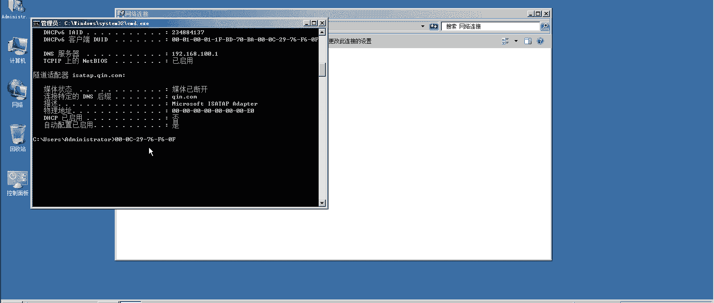
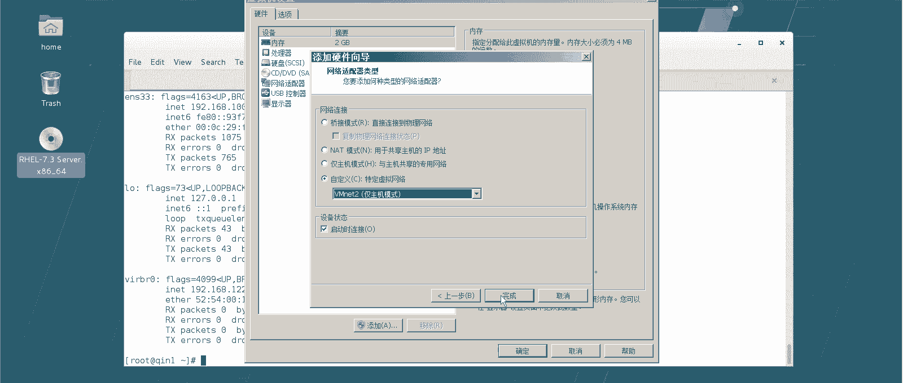
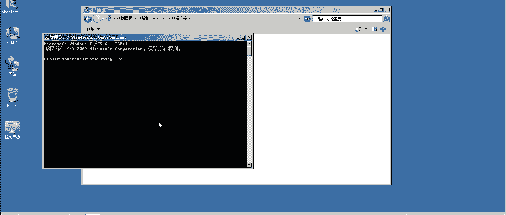
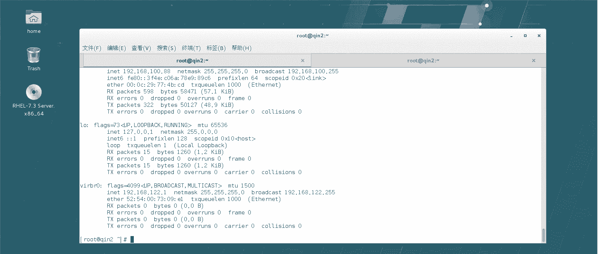
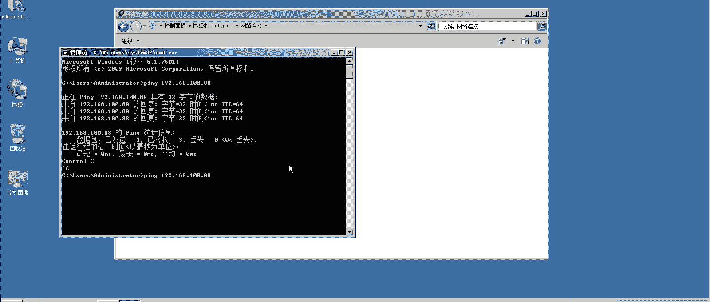
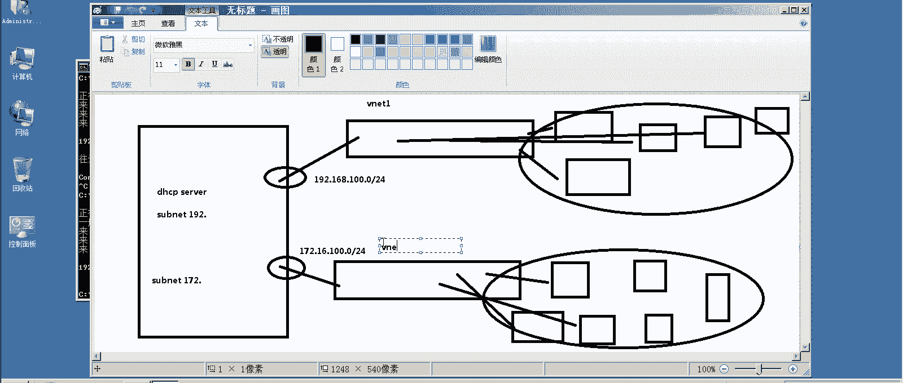
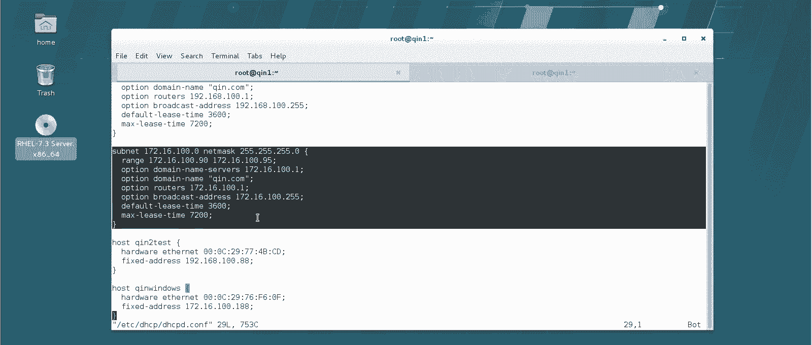

# Linux实战中级篇：14：DHCP服务器配置进阶 🚀

在本节课中，我们将深入学习DHCP服务器的进阶配置，包括如何为特定主机分配固定IP地址，以及如何配置DHCP服务器为多个不同网段提供服务。这些技能对于管理复杂网络环境至关重要。

## DHCP租约数据文件 📁

上一节我们介绍了DHCP的基本配置和地址池。本节中，我们来看看DHCP服务器如何记录已分配的IP信息。

DHCP服务器分配的IP租约信息通常存储在特定的数据文件中。在RHEL7/CentOS7系统中，这个文件位于 `/var/lib/dhcpd/` 目录下。

以下是关键文件说明：
*   `dhcpd.leases`：这是主要的租约文件，记录了所有已分配IP地址的主机信息，包括IP地址、对应的MAC地址和租约时间。
*   其他以 `.leases` 结尾的文件（如 `dhcpd6.leases`）可能与DHCPv6或其他备份相关。

你可以使用 `less` 命令查看这个文件的内容：
```bash
less /var/lib/dhcpd/dhcpd.leases
```
文件内容会显示类似 `192.168.100.30` 分配给了某个特定MAC地址的主机。DHCP服务器依靠MAC地址来识别主机，并在下次该主机请求IP时，优先分配相同的地址（如果可用）。

## 配置固定IP地址（IP-MAC绑定） 🔗



默认情况下，DHCP从地址池中按顺序或随机分配IP。但某些重要服务器（如Web服务器、数据库服务器）需要固定的IP地址。我们可以通过将IP地址与主机的MAC地址绑定来实现。

配置方法是在DHCP的主配置文件 `/etc/dhcp/dhcpd.conf` 中，使用 `host` 声明块。

以下是配置固定IP的步骤：

1.  **获取主机的MAC地址**：
    *   **Linux客户端**：使用 `ip link show` 或 `ifconfig` 命令查看。
    *   **Windows客户端**：在命令行中输入 `ipconfig /all`，在物理地址一栏找到。或者使用 `getmac` 命令。

2.  **编辑DHCP主配置文件**：
    参考 `/usr/share/doc/dhcp*/dhcpd.conf.example` 示例文件中的 `host` 部分格式。在 `subnet` 声明块内部或外部添加配置。
    ```bash
    vim /etc/dhcp/dhcpd.conf
    ```

3.  **添加固定IP配置**：
    在配置文件中添加类似下面的内容。注意，固定的IP地址可以不在动态地址池范围内。
    ```bash
    host client-linux {
        hardware ethernet 00:0c:29:xx:xx:xx; # Linux客户端的MAC地址
        fixed-address 192.168.100.88;        # 指定要分配的固定IP
    }
    host client-windows {
        hardware ethernet 00-0C-29-xx-xx-xx; # Windows客户端的MAC地址（需改为冒号分隔）
        fixed-address 192.168.100.188;
    }
    ```
    **关键点**：`host` 后的名称（如 `client-linux`）可自定义，用于标识。Windows系统的MAC地址通常用“-”分隔，需要改为Linux标准的“:”分隔格式。

4.  **重启DHCP服务并验证**：
    ```bash
    systemctl restart dhcpd
    ```
    在客户端，需要释放并重新获取IP才能生效：
    *   **Linux客户端**：`dhclient -r && dhclient`
    *   **Windows客户端**：在网络适配器中执行“禁用”再“启用”操作。

## 多网段DHCP服务配置 🌐




在实际网络中，一台DHCP服务器可能需要为多个物理隔离的网段（例如192.168.100.0/24 和 172.16.100.0/24）分配IP。这可以通过为DHCP服务器配置多个网络接口，并在配置文件中定义多个 `subnet` 来实现。

其网络拓扑可以理解为：DHCP服务器拥有两块网卡，分别连接两个不同的交换机（代表两个网段）。每个网卡配置对应网段的IP地址，DHCP服务为每个网段定义独立的地址池。

以下是实验步骤概述：





1.  **为DHCP服务器添加第二块网卡**：
    在虚拟机设置中添加一个新的网络适配器。为了模拟不同交换机，需要在虚拟网络编辑器中创建一个新的网络（如VMnet2），并**务必取消勾选“使用本地DHCP服务…”选项**，以避免冲突。





2.  **配置第二块网卡的IP地址**：
    ```bash
    nmcli connection add type ethernet con-name ens37 ifname ens37 ipv4.method manual ipv4.addresses 172.16.100.1/24 connection.autoconnect yes
    nmcli connection up ens37
    ```

3.  **在 `dhcpd.conf` 中添加第二个子网声明**：
    在配置文件中新增一个 `subnet` 块，针对第二个网段（172.16.100.0/24）。
    ```bash
    subnet 172.16.100.0 netmask 255.255.255.0 {
        range 172.16.100.90 172.16.100.95;
        option domain-name-servers 172.16.100.1;
        option routers 172.16.100.1;
        option broadcast-address 172.16.100.255;
        default-lease-time 600;
        max-lease-time 7200;
    }
    ```

4.  **将客户端连接到新网段**：
    将测试客户端（如Windows虚拟机）的网络适配器切换到新创建的网络（如VMnet2）。

5.  **重启服务并测试**：
    ```bash
    systemctl restart dhcpd
    ```
    在切换了网络的客户端上更新IP，它将从新的地址池（172.16.100.90-95）中获取IP。

**工作原理**：当客户端广播DHCP请求时，请求到达DHCP服务器的某个具体网络接口。服务器会根据收到请求的接口所属网段，从对应的 `subnet` 配置中分配IP地址。

## 总结 📝



本节课中我们一起学习了DHCP服务器的两项进阶配置。
首先，我们掌握了如何通过绑定MAC地址为特定主机分配固定IP，这对于稳定关键网络服务非常重要。
其次，我们探索了如何配置单台DHCP服务器为多个不同网段提供服务，这通过配置多块网卡并在 `dhcpd.conf` 中定义多个 `subnet` 段来实现。
理解这些概念能帮助你更好地管理企业内复杂的网络环境。