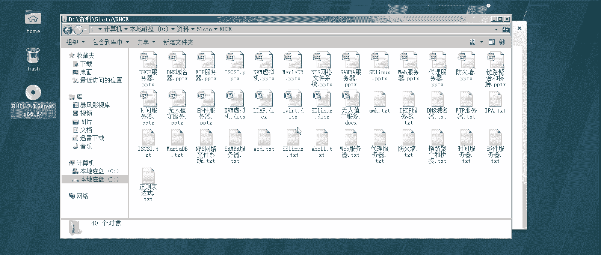
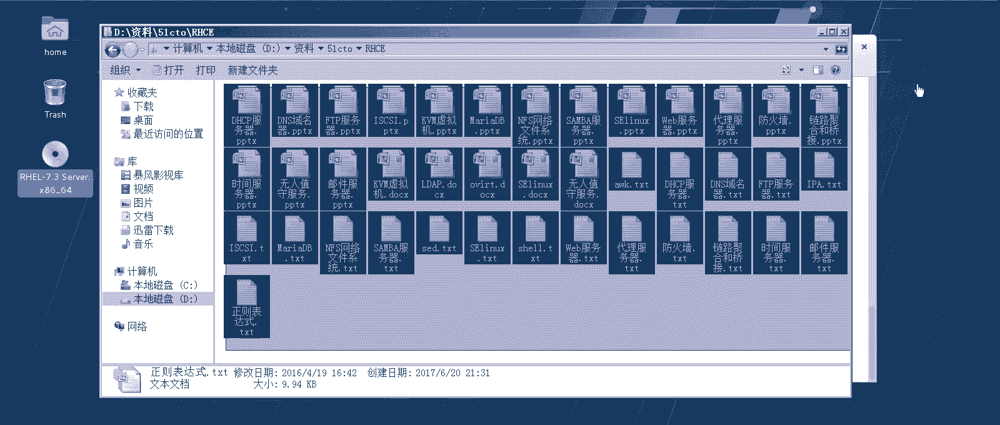
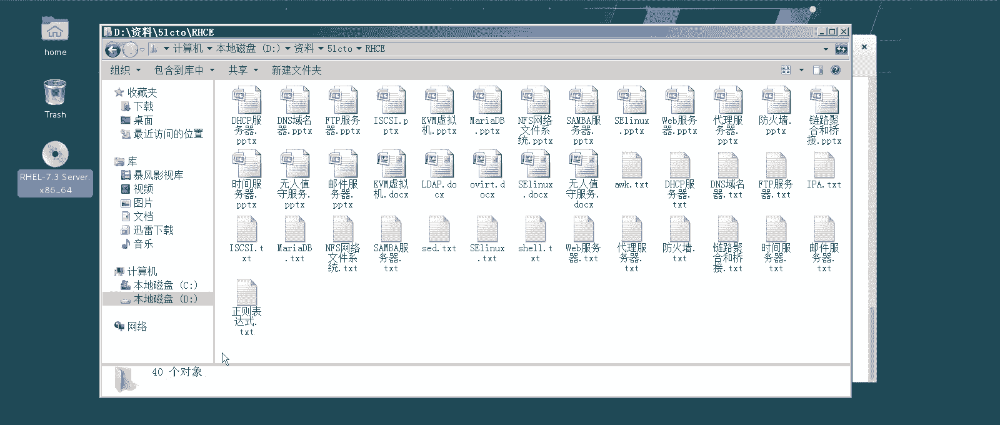
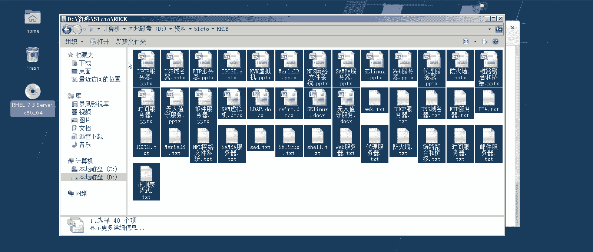
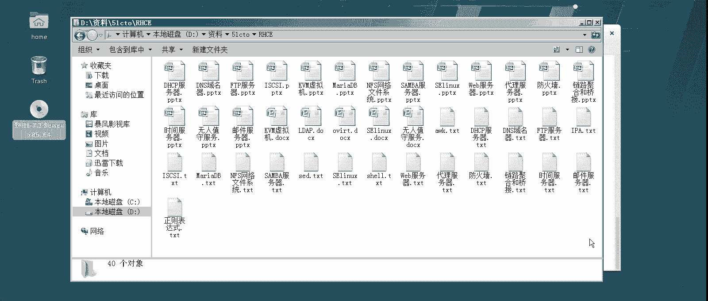
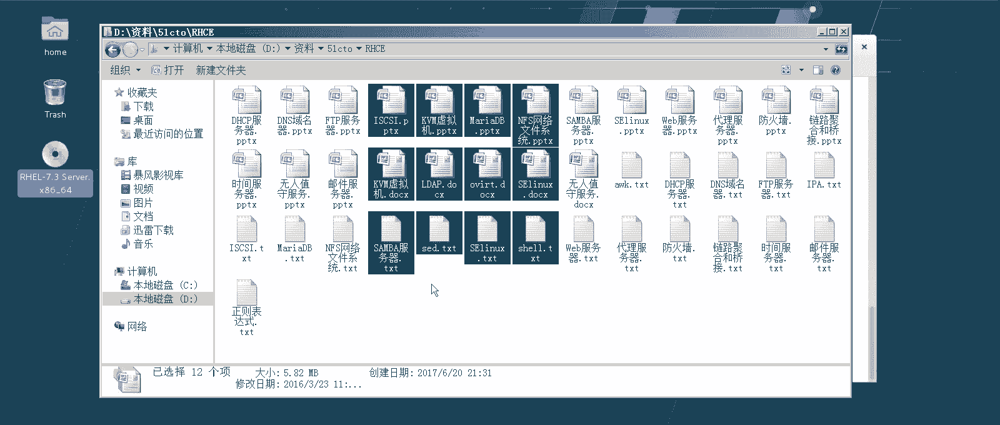
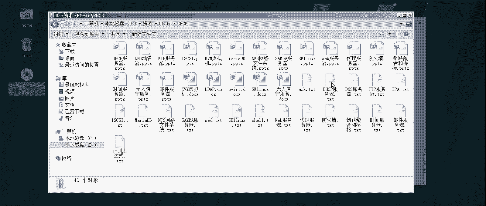
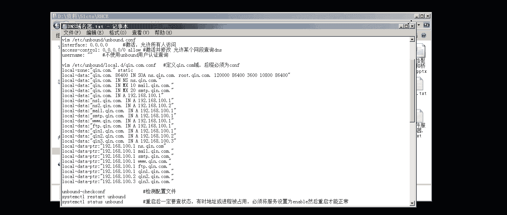
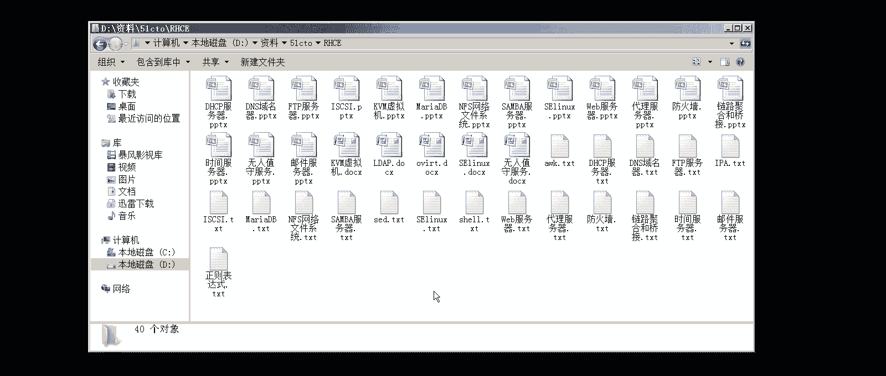

# Linux实战中级篇：1：中级课程概述与准备

在本节课中，我们将要学习Linux中级课程的整体框架、学习目标以及必要的准备工作。通过本节内容，你将了解中级课程与初级课程的区别，以及如何为后续的学习做好充分准备。

---

经过初级课程的学习，大家应该对红帽7操作系统的基础操作和知识点有了一定的了解。初级课程以红帽官方RHCSA课程大纲为基础，并适当加入了生产一线常见的项目和实验，以实验为导向进行讲解。

上一节我们介绍了初级课程的概况，本节中我们来看看中级课程的内容。中级课程同样以红帽官方RHCE课程大纲为导向，但内容更为深入和广泛。有同学可能会发现，本课程内容比标准RHCE考试范围更多。这是因为，与初级课程一样，我们在官方大纲基础上进行了加强和深化，融入了更多生产一线的实用技能。

中级课程的核心内容大致可分为几个部分。以下是主要组成部分：

1.  **服务器配置与管理**：这是课程的重点，约占一半比重。我们将学习DNS、FTP、DHCP、Samba、Web及代理服务器等多种服务的搭建与配置。其中部分服务器（如代理服务器）虽不在官方RHCE考试范围内，但在实际生产中应用广泛。
2.  **系统安全**：课程将深入讲解防火墙配置、安全策略设置以及通过代理增强安全等内容。安全理念和实践将几乎贯穿每一个服务器配置章节。
3.  **存储管理**：涉及集群存储（如GlusterFS）和网络文件系统（NFS）等高级存储概念的配置与管理。
4.  **数据库基础**：从红帽7开始，官方加强了对数据库知识的要求。课程将涵盖相关数据库操作，这在现代应用部署中至关重要。
5.  **网络与综合应用**：在初级课程网络知识的基础上进行深化，并强调解决企业生产一线真实场景问题的综合能力。

对于已完成初级课程的同学，学习中级课程应该问题不大。许多中级知识点会复用和深化初级课程的内容，因此学习中级课程的过程也是对初级知识的二次提升和巩固。例如，在初级课程中因难度考虑而未深入讲解的部分实验，将在中级课程中得到补充。

红帽认证体系中，RHCE（对应中级课程）是含金量很高的认证。本课程之所以称为“中级课程”而非单纯的“RHCE课程”，正是因为其内容比标准考试大纲更丰富、更贴近实战。

中级课程的实验量和笔记内容会比初级课程显著增加，更强调动手解决实际问题的能力。因此，学习过程可能需要投入更多精力。但好消息是，随着你对Linux系统越来越熟悉，理解这些“新”知识反而可能感觉比入门时更顺畅。本课程的配套笔记也会做得更加细致，以辅助大家学习。

技术学习往往如此，前期扎实的付出将为未来带来长久的回报。

---

本节课中我们一起学习了Linux中级课程的定位、核心内容构成以及与初级课程的关系。我们了解到，中级课程以RHCE大纲为基础，深度融合了服务器管理、安全、存储、数据库等实战技能，旨在培养解决企业实际问题的能力。虽然学习曲线可能更陡峭，但这也是技能提升的关键阶段。接下来，我们将开始具体的环境准备与学习。