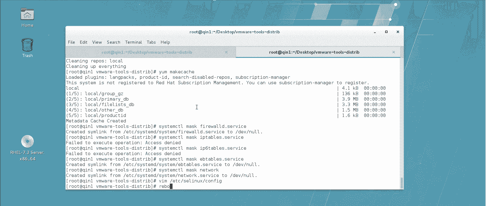
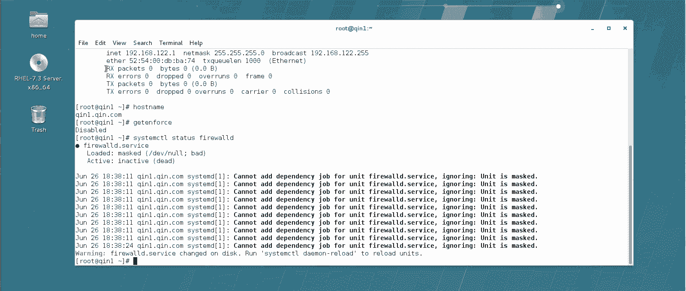

# Linux实战中级篇：P2：中级课程准备工作(二)

## 概述
在本节课中，我们将学习如何为后续的Linux中级课程实验搭建和配置基础环境。主要内容包括安装虚拟机增强工具、配置网络、设置软件源以及禁用可能影响实验的系统服务。完成这些准备工作后，你将拥有一个干净、标准化的实验平台。

---

## 实验环境要求与设置

中级课程要求至少使用两台虚拟机。建议安装一台中文系统和一台英文系统，或者两台均为英文系统。两台机器都需要进行相同的初始设置。

以下是需要完成的具体操作步骤。

### 安装VMware Tools半虚拟化驱动

首先，需要为虚拟机安装VMware Tools，以实现主机与虚拟机之间的文件复制粘贴等功能。

1.  在虚拟机菜单中，选择“更新VMware Tools”或“安装VMware Tools”。这会将一个包含驱动程序的ISO镜像加载到虚拟机的光驱中。
2.  打开光驱，可以看到一个名为 `VMwareTools-xxx.tar.gz` 的压缩文件。将其解压。
3.  进入解压后的目录。如果系统是中文版，目录可能在“root/下载”或“root/桌面”下。
4.  运行安装脚本：
    ```bash
    cd /root/下载/VMwareTools-xxx
    ./vmware-install.pl
    ```
5.  安装过程中，对所有提示（无论是`y`还是`n`）直接按回车，采用默认设置即可。安装程序会自动将驱动模块写入内核。
6.  安装完成后，建议将虚拟机的光驱重新连接至操作系统的安装ISO镜像（如CentOS-7.3-x86_64-DVD.iso），以备后续使用。
7.  删除解压出来的VMware Tools安装目录。

**注意**：以上操作需要在两台虚拟机上分别执行。

---

### 配置主机名

建议将主机名设置为标准的FQDN（完全限定域名）格式，以便于区分和管理。

使用 `hostnamectl` 命令进行设置：
```bash
hostnamectl set-hostname client1.example.com  # 在第一台机器上执行
hostnamectl set-hostname client2.example.com  # 在第二台机器上执行
```

---

### 配置网络连接

接下来，我们需要为虚拟机配置静态IP地址，确保网络环境稳定。

以下是配置步骤：
1.  使用 `nmcli` 命令删除可能存在的旧网络连接配置。
    ```bash
    nmcli connection delete ens33  # 假设原连接名为‘ens33’
    ```
2.  使用一条命令创建并配置新的网络连接：
    ```bash
    nmcli connection add type ethernet con-name ens33 ifname ens33 ipv4.method manual ipv4.addresses 192.168.100.1/24 ipv4.gateway 192.168.100.254 ipv4.dns 8.8.8.8 connection.autoconnect yes
    ```
    *   `con-name`: 连接配置名称。
    *   `ifname`: 对应的物理网卡设备名。
    *   `ipv4.method manual`: 设置为手动配置IP。
    *   `ipv4.addresses`: 设置IP地址和子网掩码。
    *   `ipv4.gateway` 和 `ipv4.dns`: 设置网关和DNS。
    *   `connection.autoconnect yes`: 设置开机自动连接。
3.  激活新配置的连接：
    ```bash
    nmcli connection up ens33
    ```
4.  使用 `ip addr show` 或 `ifconfig` 命令验证IP地址是否配置成功。

---

### 配置本地YUM软件源

为了便于安装软件，我们将系统安装光盘配置为本地YUM源。

以下是配置本地YUM源的步骤：
1.  清理原有的YUM源配置文件（如果是CentOS系统，建议先备份`/etc/yum.repos.d/`下的文件）。
    ```bash
    rm -f /etc/yum.repos.d/*
    ```
2.  挂载系统安装光盘。
    ```bash
    mount /dev/sr0 /mnt/cdrom
    ```
3.  创建一个新的本地源配置文件。
    ```bash
    vi /etc/yum.repos.d/local.repo
    ```
4.  在文件中输入以下内容：
    ```ini
    [local]
    name=Local Repository
    baseurl=file:///mnt/cdrom
    enabled=1
    gpgcheck=0
    ```
5.  保存退出后，清除YUM缓存并测试源是否可用。
    ```bash
    yum clean all
    yum makecache
    yum install -y tree  # 尝试安装一个软件（无需真正安装，看到提示即可按Ctrl+C取消）
    ```

---

### 禁用特定系统服务

为了避免防火墙、SELinux等服务对后续实验造成干扰，在课程初期建议先将它们禁用。

需要禁用的服务列表如下：
*   **防火墙服务**：`firewalld`, `iptables`, `ip6tables`
*   **传统网络服务**：`network` (因为我们使用NetworkManager)
*   **安全增强模块**：`selinux`
*   **图形化目标**：`graphical.target` (如果使用纯命令行环境)

执行以下命令禁用这些服务并设置开机不启动：
```bash
systemctl mask firewalld iptables ip6tables network selinux graphical.target
systemctl stop firewalld iptables ip6tables network  # 同时停止当前运行的服务
```
要立即禁用SELinux，还需编辑配置文件：
```bash
sed -i 's/SELINUX=enforcing/SELINUX=disabled/g' /etc/selinux/config
```

---




### 最终检查与创建快照

完成所有设置后，必须重启系统以使更改（尤其是VMware Tools驱动和禁用服务）完全生效。

1.  执行重启：
    ```bash
    reboot
    ```
2.  重启后登录系统，进行最终检查：
    *   使用 `hostname` 命令查看主机名。
    *   使用 `ip addr show` 命令查看IP地址。
    *   使用 `getenforce` 命令确认SELinux状态为`Disabled`。
    *   使用 `systemctl list-unit-files | grep masked` 命令查看被禁用的服务。
3.  确认所有配置无误后，在虚拟机管理软件（如VMware）中为当前状态创建一个名为“Base”或“Initial Setup”的快照。这样，在后续实验出错时，可以快速恢复到此刻的干净状态。

**重要**：另一台虚拟机也需要完全重复上述所有步骤，仅主机名和IP地址需设置为不同的值。

---



## 总结
本节课中，我们一起完成了Linux中级课程的实验环境搭建。我们安装了VMware Tools，配置了标准的主机名和静态网络，建立了本地YUM软件源，并禁用了可能影响实验的防火墙和SELinux等服务。最后，我们为这个纯净的系统状态创建了快照，为后续大量的实验操作打下了坚实的基础。请确保两台虚拟机均完成以上所有配置。