# Linux实战中级篇：P4：Web服务器(二) - 虚拟主机技术

## 概述
在本节课中，我们将要学习Web服务器中一项非常核心且应用广泛的技术——虚拟主机。这项技术允许我们在一台物理服务器上同时运行多个独立的网站，是互联网服务提供商和企业节省成本、提高资源利用率的关键手段。

## 虚拟主机技术简介
上一节我们介绍了如何搭建一个基本的Web服务器。本节中我们来看看如何让一台服务器承载多个网站。

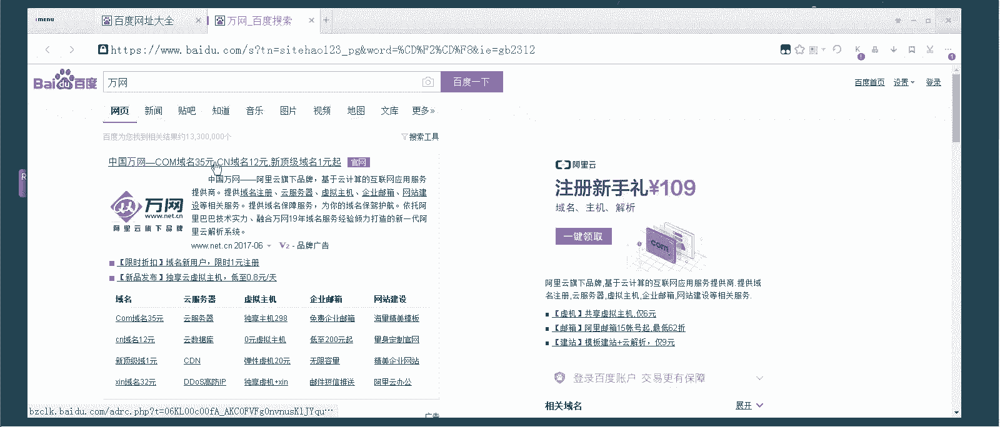

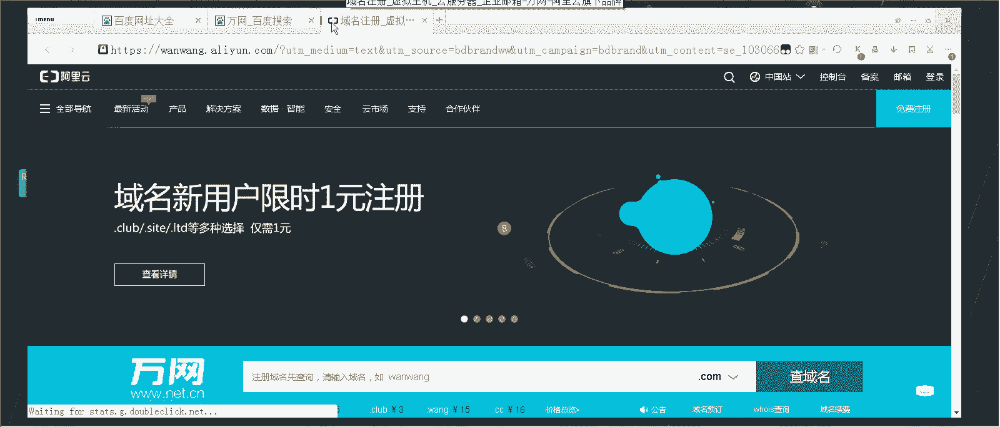

虚拟主机技术主要解决资源分配问题。大型网站（如新浪、百度）访问量巨大，可能需要成千上万台服务器来支撑。而大量中小型网站访问量较小，如果每个网站都独占一台服务器，会造成巨大的资源浪费和成本压力。虚拟主机技术允许多个网站共享同一台服务器的硬件资源（如CPU、内存、硬盘、带宽），从而显著降低成本。

例如，服务商可以提供“共享虚拟主机”套餐：用户支付少量年费（如298元/年），即可获得2GB的网站存储空间和一定的月流量额度。服务商则在一台高性能服务器上为成百上千个这样的网站提供服务，实现盈利。

在企业生产环境中，实现虚拟主机主要有三种方式，我们将逐一学习。

## 基于域名的虚拟主机
这是生产一线应用最广泛的虚拟主机类型。其核心原理是：**服务器只有一个IP地址，但通过访问者使用的不同域名，将请求导向服务器上不同的网站目录**。

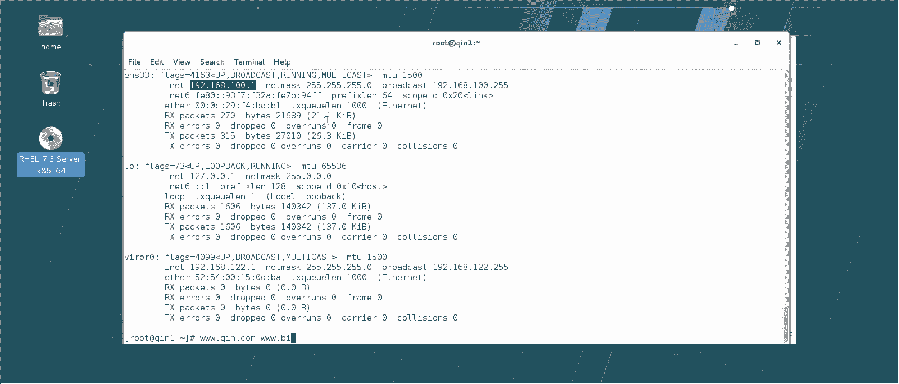

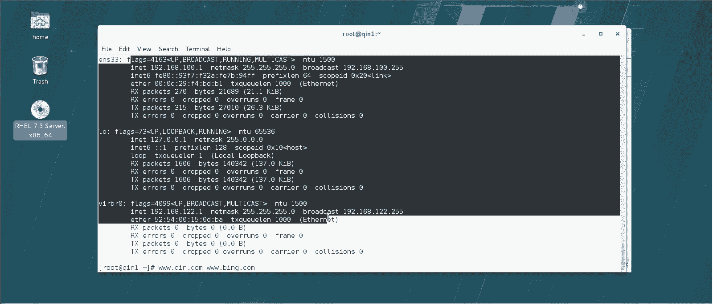

例如，我们有一台IP为 `192.168.100.1` 的服务器，希望同时承载 `www.qin.com` 和 `www.bing.com` 两个网站。

以下是实现步骤：

### 1. 准备网站目录与测试页
首先，为每个网站创建独立的目录和简单的测试页面，以区分内容。

```bash
# 创建网站目录
mkdir -p /var/www/www.qin.com
mkdir -p /var/www/www.bing.com

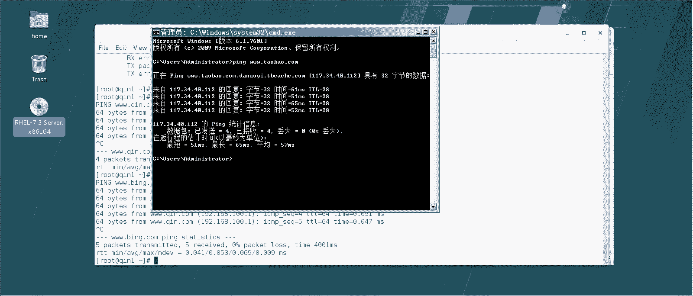

# 为“qin”网站创建测试页
echo “This is Qin‘s Website.” > /var/www/www.qin.com/index.html
# 为“bing”网站创建测试页
echo “This is Bing‘s Website.” > /var/www/www.bing.com/index.html
```

### 2. 配置本地域名解析（hosts文件）
在尚未搭建DNS服务器的情况下，我们可以通过修改本机的 `hosts` 文件来实现域名解析。`hosts` 文件的优先级高于DNS服务器，但仅对本机生效。

编辑 `/etc/hosts` 文件，添加以下两行：
```bash
192.168.100.1 www.qin.com
192.168.100.1 www.bing.com
```
这样，在本机上访问 `www.qin.com` 或 `www.bing.com` 时，就会被解析到 `192.168.100.1`。

> **提示**：`hosts` 文件在网络安全和测试中非常有用。例如，可以通过将购物网站域名指向本地IP（如 `127.0.0.1`），来临时阻止访问。

### 3. 配置Apache虚拟主机
Apache官方推荐将自定义配置放在 `/etc/httpd/conf.d/` 目录下，并以 `.conf` 结尾。这样主配置文件会自动包含这些文件。

以下是 `www.qin.com` 网站的配置文件示例，保存为 `/etc/httpd/conf.d/www.qin.com.conf`：

```apache
<VirtualHost 192.168.100.1:80>
    # 管理员邮箱（可选）
    ServerAdmin webmaster@qin.com
    # 网站域名
    ServerName www.qin.com
    # 网站根目录
    DocumentRoot /var/www/www.qin.com
    # 自定义访问日志路径（可选）
    CustomLog /var/log/httpd/www.qin.com-access.log common
    # 自定义错误日志路径（可选）
    ErrorLog /var/log/httpd/www.qin.com-error.log
</VirtualHost>
```

核心配置项说明：
*   **`<VirtualHost IP:端口>`**：定义虚拟主机的监听地址和端口。
*   **`ServerName`**：指定该虚拟主机对应的域名。
*   **`DocumentRoot`**：指定网站文件的根目录。

对于 `www.bing.com` 网站，只需复制上述配置文件并修改相关参数即可。

### 4. 重启服务并测试
配置完成后，重启Apache服务使配置生效。
```bash
systemctl restart httpd
```
现在，在浏览器中访问：
*   `http://www.qin.com` 将显示 “This is Qin‘s Website.”
*   `http://www.bing.com` 将显示 “This is Bing‘s Website.”
*   `http://192.168.100.1` 将显示Apache默认页面（如果存在）或第一个虚拟主机的页面。

**总结**：基于域名的虚拟主机通过 `ServerName` 指令区分不同请求，是成本最低、管理最方便的虚拟主机方案。

## 基于IP地址的虚拟主机
这种技术原理是：**服务器拥有多个IP地址，不同的网站绑定到不同的IP上**。访问者通过访问不同的IP地址来访问不同的网站。

### 1. 为服务器添加多个IP
首先，需要为服务器网卡配置多个IP地址。例如，在原有 `192.168.100.1` 的基础上，再添加一个 `192.168.100.11`。
```bash
# 使用 nmcli 添加IP（具体命令可能因系统而异）
nmcli connection modify ens33 +ipv4.addresses 192.168.100.11/24
nmcli connection up ens33
```

### 2. 准备网站目录
为两个IP地址对应的网站创建目录和测试页。
```bash
mkdir -p /var/www/ip-100-1
mkdir -p /var/www/ip-100-11
echo “Website for IP 192.168.100.1” > /var/www/ip-100-1/index.html
echo “Website for IP 192.168.100.11” > /var/www/ip-100-11/index.html
```

### 3. 配置虚拟主机
创建两个配置文件，分别指定不同的IP和对应的网站目录。

`/etc/httpd/conf.d/ip-100-1.conf`：
```apache
<VirtualHost 192.168.100.1:80>
    ServerName 192.168.100.1
    DocumentRoot /var/www/ip-100-1
</VirtualHost>
```

`/etc/httpd/conf.d/ip-100-11.conf`：
```apache
<VirtualHost 192.168.100.11:80>
    ServerName 192.168.100.11
    DocumentRoot /var/www/ip-100-11
</VirtualHost>
```

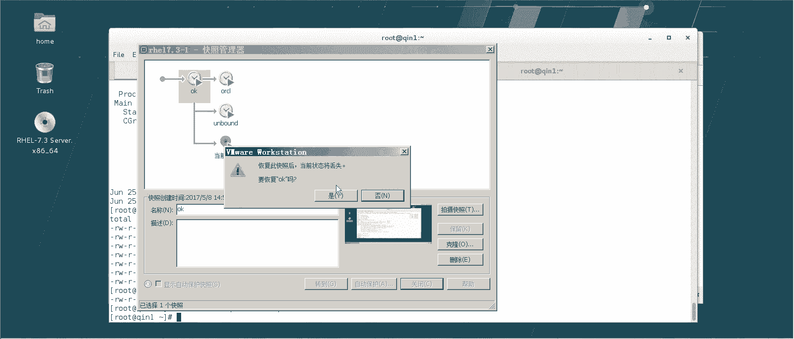

### 4. 重启服务并测试
重启Apache后，访问 `http://192.168.100.1` 和 `http://192.168.100.11` 将看到不同的页面。

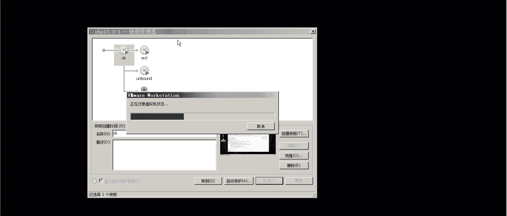

**总结**：基于IP的虚拟主机需要服务器具备多个IP地址，配置直观，但浪费IP资源，在实际应用中不如基于域名的方式普遍。

## 基于端口的虚拟主机
这种技术原理是：**服务器只有一个IP地址，但通过不同的端口号来区分不同的网站**。例如，默认网站使用80端口，另一个网站使用8080端口。

### 1. 修改Apache监听端口
默认Apache只监听80端口。要启用其他端口（如8899），需要修改主配置文件 `/etc/httpd/conf/httpd.conf`，找到 `Listen` 指令，添加新端口。
```apache
Listen 80
Listen 8899 # 添加这行
```

### 2. 准备网站目录
为不同端口的网站创建目录。
```bash
mkdir -p /var/www/port-80
mkdir -p /var/www/port-8899
echo “Website on Port 80” > /var/www/port-80/index.html
echo “Website on Port 8899” > /var/www/port-8899/index.html
```

### 3. 配置虚拟主机
创建配置文件，在 `<VirtualHost>` 标签中指定端口。

`/etc/httpd/conf.d/port-80.conf`：
```apache
<VirtualHost 192.168.100.1:80>
    ServerName 192.168.100.1
    DocumentRoot /var/www/port-80
</VirtualHost>
```

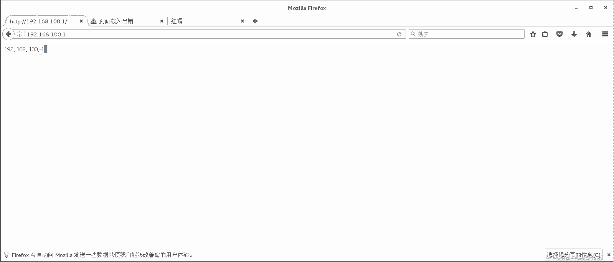


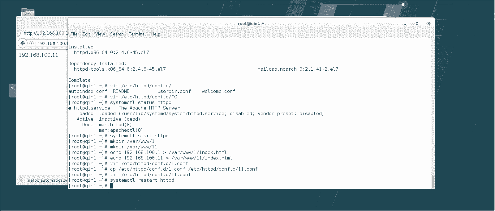

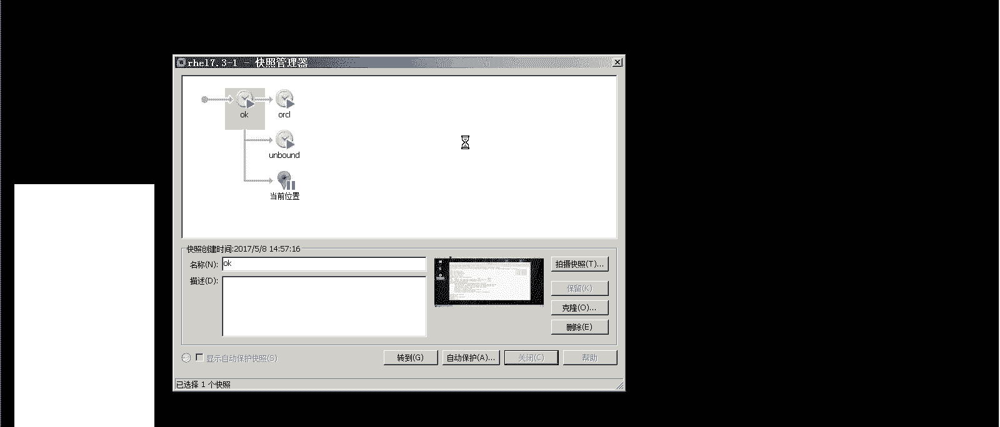

`/etc/httpd/conf.d/port-8899.conf`：
```apache
<VirtualHost 192.168.100.1:8899>
    ServerName 192.168.100.1
    DocumentRoot /var/www/port-8899
</VirtualHost>
```

### 4. 重启服务并测试
重启Apache后，访问测试：
*   `http://192.168.100.1:80` (或省略 `:80`) 显示 “Website on Port 80”
*   `http://192.168.100.1:8899` 显示 “Website on Port 8899”

**总结**：基于端口的虚拟主机常用于运行一些非公开或管理后台服务，用户需要知道特定端口才能访问，增加了些许安全性，但不利于用户记忆和传播。

## 总结
本节课中我们一起学习了Web服务器的虚拟主机技术。我们探讨了三种主要的实现方式：

1.  **基于域名的虚拟主机**：最常用、最经济的方式，通过不同域名区分网站。
2.  **基于IP地址的虚拟主机**：通过不同IP地址区分网站，配置简单但消耗IP资源。
3.  **基于端口的虚拟主机**：通过不同端口号区分网站，常用于特殊或内部服务。

其中，**基于域名的虚拟主机**是生产环境中应用最广泛的方案。它的核心配置模板可以复用于创建无数个网站，只需修改 `ServerName` 和 `DocumentRoot` 即可。掌握这项技术，是成为一名合格的Linux运维工程师和通过RHCE认证的重要基础。

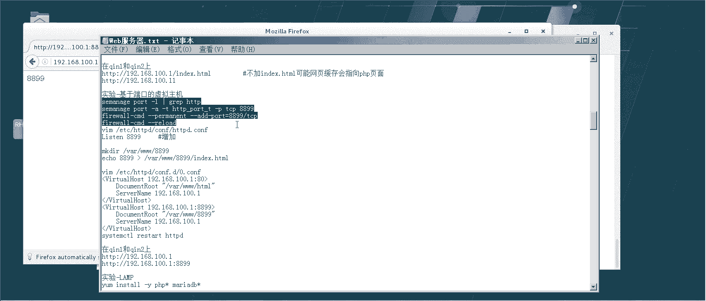

> **后续学习提示**：本实验在默认环境中进行。在实际生产环境中，还需要考虑**SELinux安全上下文**和**防火墙规则**的配置，以确保虚拟主机能够被正常访问。请在后续学习完相关章节后，务必回顾并重做本实验，以构建完整的安全知识体系。