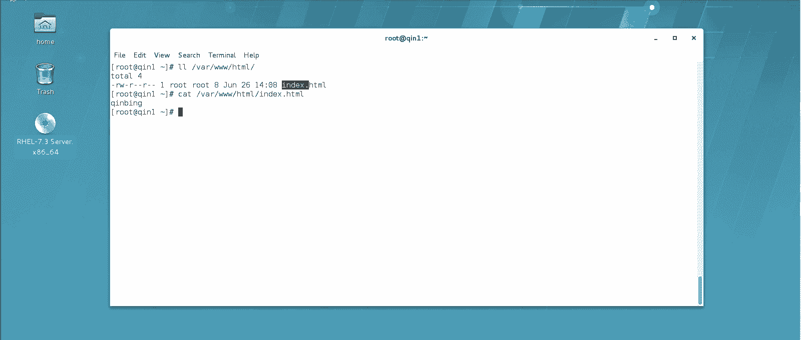
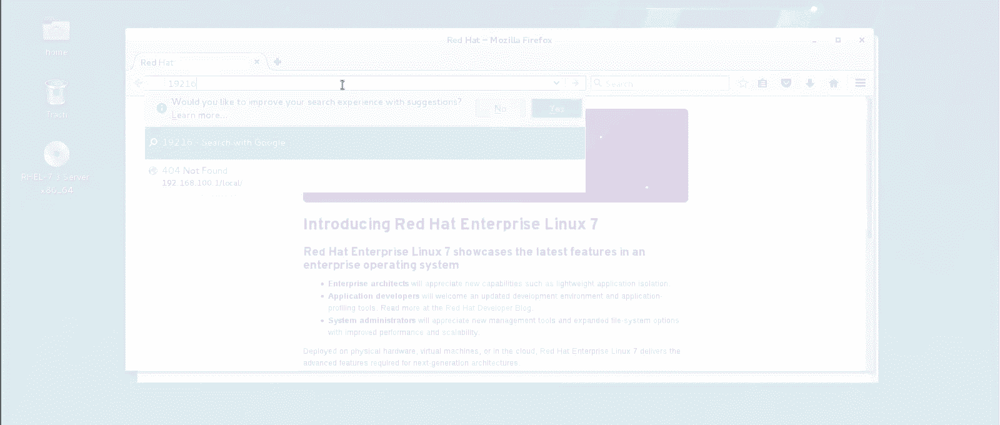
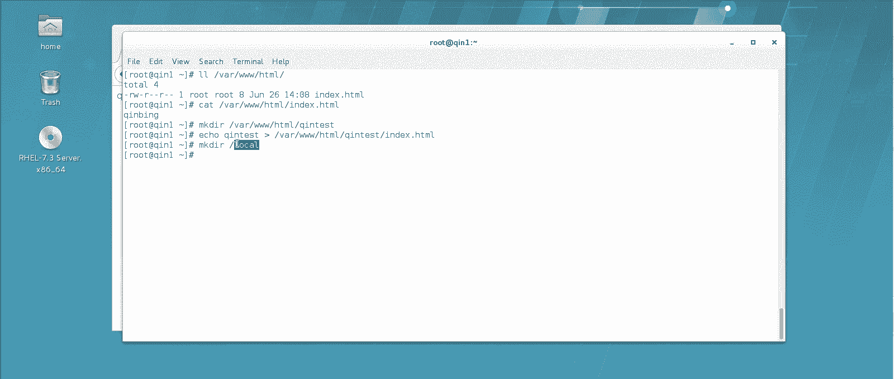
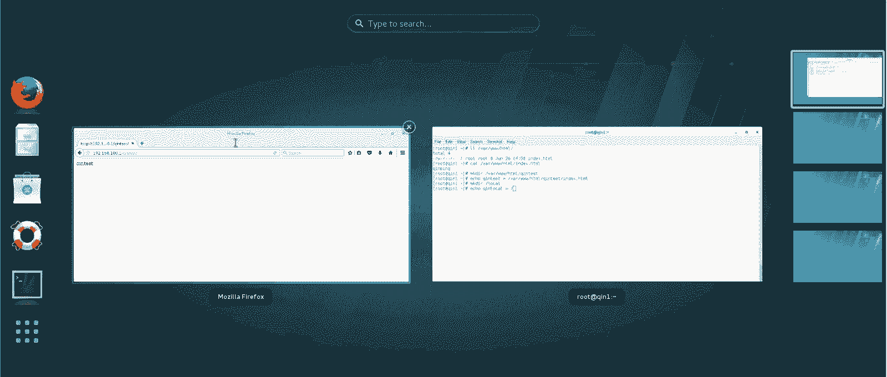
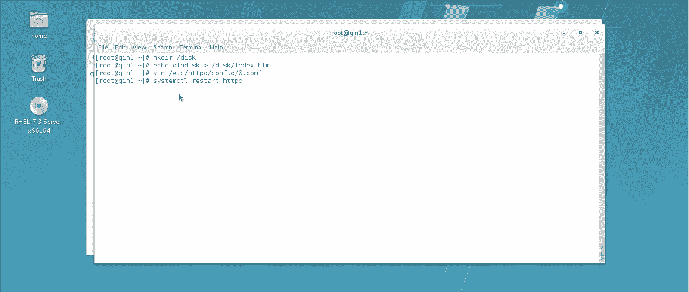
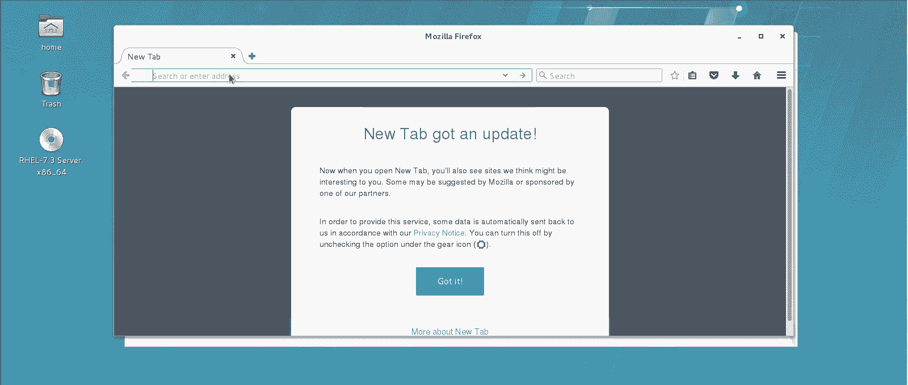
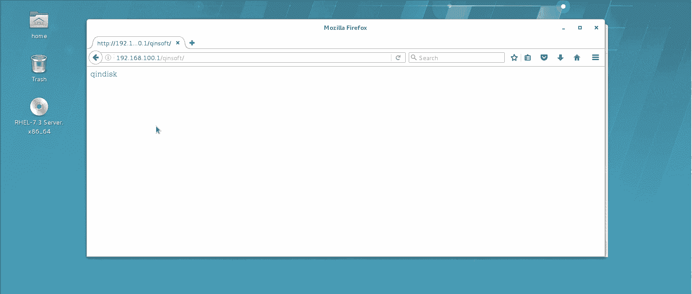

# Linux实战中级篇：P6：Web服务器(四) 🔗




在本节课中，我们将要学习如何让Apache Web服务器访问其默认主目录以外的文件和文件夹。我们将介绍两种核心方法：创建软链接和使用配置文件别名。



上一节我们介绍了Web服务器的基本配置，本节中我们来看看如何扩展服务器的访问范围。

## 软链接技术





默认情况下，Apache服务器的主目录通常位于 `/var/www/html/`。放在此目录下的所有资源都可以通过URL直接访问。

例如，在主目录下创建一个 `qintest` 文件夹并放置网页，可以通过 `http://服务器IP/qintest/` 访问。

如果网页文件存放在主目录之外的其他位置，例如根目录下的 `/local/` 文件夹，直接访问将失败。

以下是使用软链接解决此问题的步骤：

1.  **创建软链接**：使用 `ln -s` 命令，将外部目录链接到Web服务器的主目录下。
    ```bash
    ln -s /local /var/www/html/soft
    ```
    此命令创建了一个名为 `soft` 的软链接，指向 `/local` 目录。

2.  **通过链接访问**：创建后，可以通过访问 `http://服务器IP/soft/` 来访问 `/local` 目录下的内容。服务器会将请求重定向到实际的物理路径。



## 配置别名（Alias）



除了软链接，另一种更灵活的方式是在Apache配置文件中使用 `Alias` 指令。这种方法无需创建实际的链接文件，直接在配置中定义路径映射。

以下是配置别名的具体步骤：

1.  **编辑配置文件**：在虚拟主机配置块中，使用 `Alias` 指令定义一个URL路径别名。
    ```apache
    Alias /qinsoft /disk
    ```
    这表示当访问 `http://服务器IP/qinsoft/` 时，服务器会去 `/disk` 目录寻找资源。

2.  **设置目录权限**：仅设置别名还不够。由于Apache默认禁止访问主目录以外的路径，必须为别名指向的目录单独配置访问权限。
    ```apache
    <Directory "/disk">
        Options Indexes FollowSymLinks
        AllowOverride None
        Require all granted
    </Directory>
    ```
    这段配置放在 `Alias` 指令之后，它开放了 `/disk` 目录的访问权限（`Require all granted`）。

3.  **重启服务**：保存配置文件后，重启Apache服务使配置生效。
    ```bash
    systemctl restart httpd
    ```
    现在，访问 `http://服务器IP/qinsoft/` 即可成功显示 `/disk` 目录下的网页。

## 两种方法对比

*   **软链接**：操作简单，类似于创建一个快捷方式。但管理上可能不够清晰，且链接依赖于原始路径的存在。
*   **配置别名**：更专业和灵活，所有映射关系集中在配置文件中管理，便于维护。这是生产环境中更推荐的方式。



本节课中我们一起学习了两种让Apache Web服务器访问主目录外资源的方法：创建软链接和配置别名。理解并掌握这些技术，可以让你更灵活地部署和管理网站文件。