# Linux实战中级篇：P7：Web服务器(五) 🔧


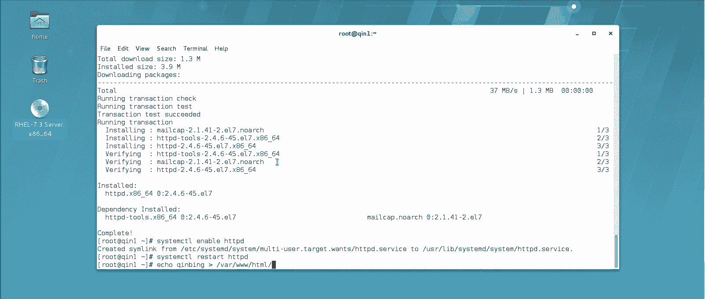

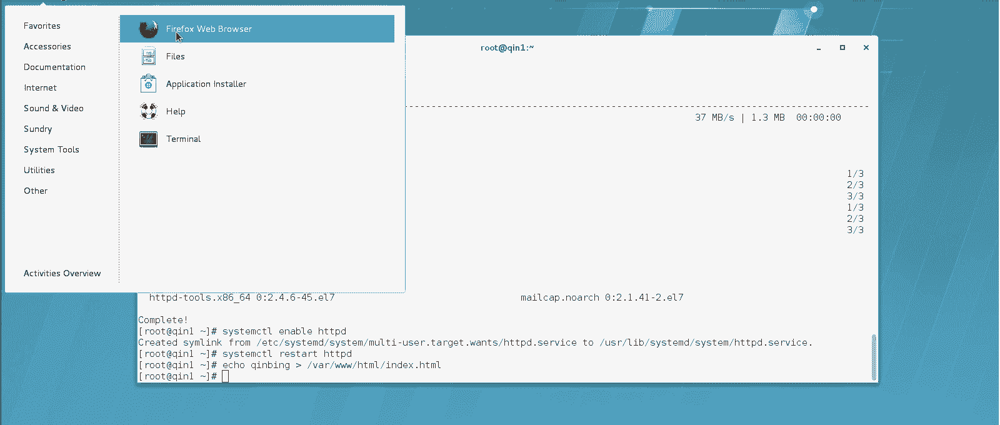

在本节课中，我们将学习如何配置Apache Web服务器以支持脚本调用，并实现基于IP地址和用户认证的目录访问控制。这些是构建动态、安全网站的基础技能。

## 实验环境准备 🛠️

上一节我们介绍了虚拟主机的基本配置，本节中我们来看看如何让Apache服务器支持脚本执行。首先，我们需要一个干净的环境来开始实验。

*   还原系统快照，确保实验环境纯净。
*   启动Apache服务并创建测试网站目录。

## 支持脚本调用 📜

Apache默认不能直接调用脚本。生产环境中常用的脚本语言包括Shell、Perl和Python。我们将学习如何配置Apache以支持这三种脚本。

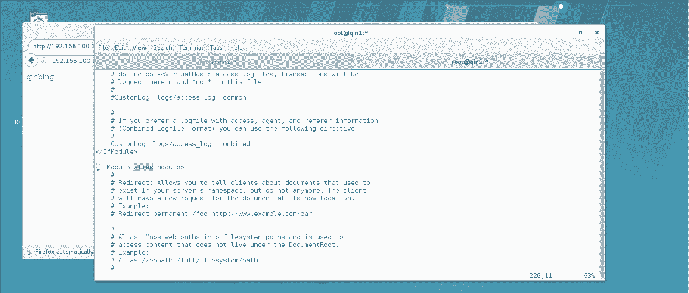

### 创建测试脚本

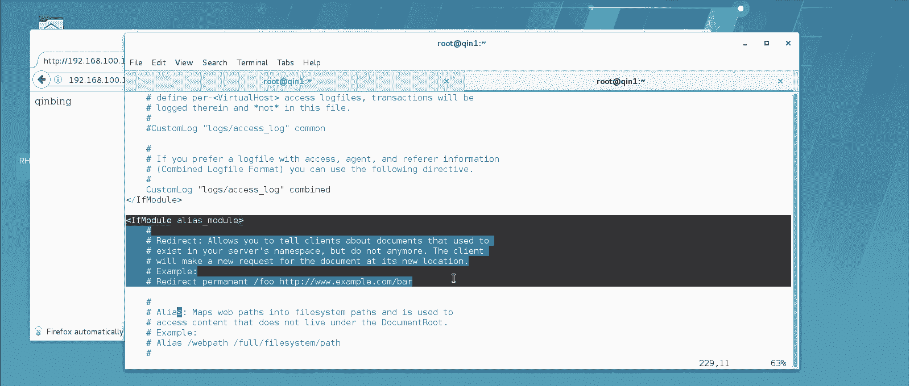

首先，我们需要在指定目录下创建三个测试脚本。Apache建议将脚本程序放置在 `/var/www/cgi-bin/` 目录下。

以下是三个脚本的创建步骤：

1.  **Shell脚本** (`shell.sh`)：用于查看系统时间。
    ```bash
    #!/bin/bash
    echo "Content-type: text/html"
    echo ""
    echo "<html><head><title>Shell Script</title></head><body>"
    echo "<h1>System Time from Shell:</h1>"
    echo "<p>$(date)</p>"
    echo "</body></html>"
    ```

2.  **Perl脚本** (`perl.pl`)：同样用于查看系统时间。
    ```perl
    #!/usr/bin/perl
    print "Content-type: text/html\n\n";
    print "<html><head><title>Perl Script</title></head><body>";
    print "<h1>System Time from Perl:</h1>";
    $time = localtime;
    print "<p>$time</p>";
    print "</body></html>";
    ```

3.  **Python脚本** (`python.py`)：功能同上。
    ```python
    #!/usr/bin/python3
    import time
    print("Content-type: text/html\n")
    print("<html><head><title>Python Script</title></head><body>")
    print("<h1>System Time from Python:</h1>")
    print("<p>%s</p>" % time.ctime())
    print("</body></html>")
    ```

### 配置Apache支持Shell和Perl脚本

Shell和Perl脚本可以直接被Apache调用，但需要进行一些配置。

以下是配置步骤：

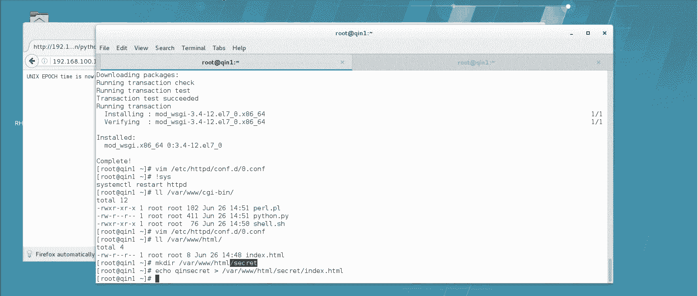

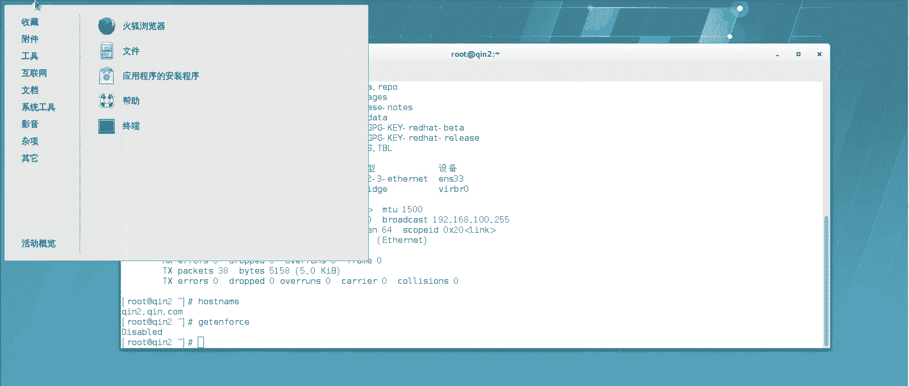

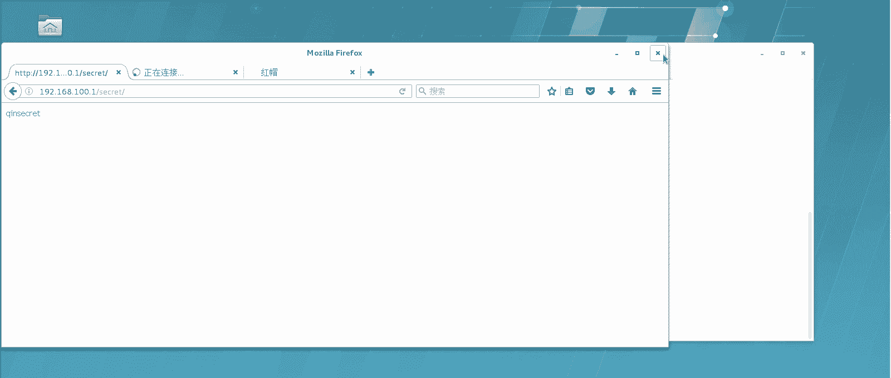

1.  为脚本文件添加执行权限。
    ```bash
    chmod +x /var/www/cgi-bin/shell.sh /var/www/cgi-bin/perl.pl
    ```
2.  编辑网站的配置文件（例如 `vhost.conf`），添加脚本别名模块。
    ```apache
    <IfModule alias_module>
        ScriptAlias /scripts/ "/var/www/cgi-bin/"
    </IfModule>
    ```
    *   `ScriptAlias` 指令将URL路径 `/scripts/` 映射到服务器上的 `/var/www/cgi-bin/` 目录。
    *   路径名称 `/scripts/` 可以自定义。
3.  重启Apache服务使配置生效。
    ```bash
    systemctl restart httpd
    ```
4.  通过浏览器访问脚本。
    *   Shell脚本：`http://服务器IP/scripts/shell.sh`
    *   Perl脚本：`http://服务器IP/scripts/perl.pl`

### 配置Apache支持Python脚本

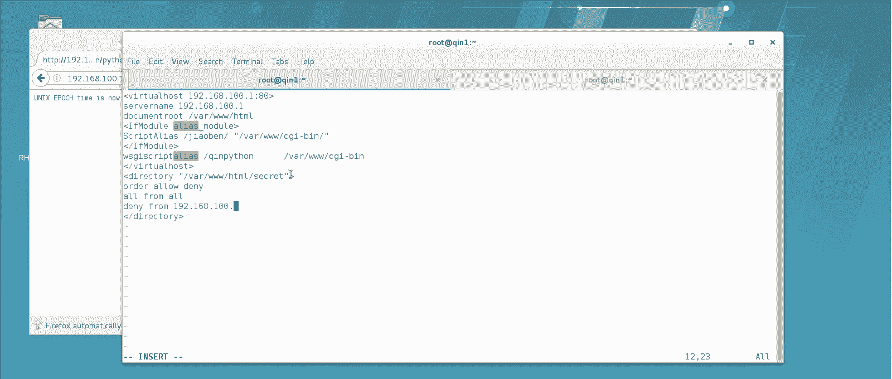

Apache默认不支持Python脚本，需要额外加载模块。

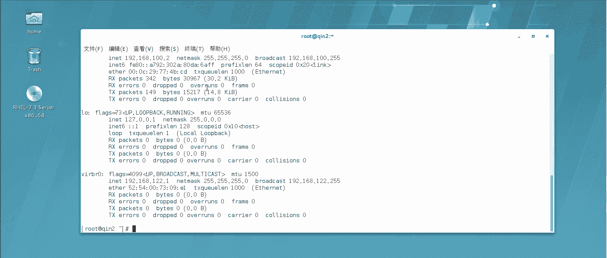

以下是支持Python脚本的步骤：

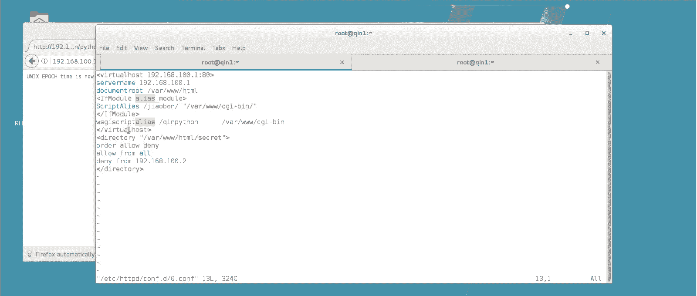

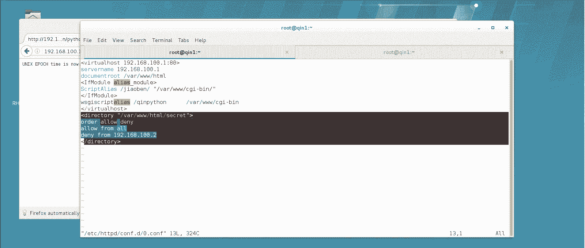

1.  安装 `mod_wsgi` 模块。
    ```bash
    yum install mod_wsgi -y
    ```
2.  在网站配置文件中添加Python脚本的别名配置。
    ```apache
    WSGIScriptAlias /python_scripts/ "/var/www/cgi-bin/"
    ```
    *   `WSGIScriptAlias` 是专门用于Python脚本的指令。
    *   别名 `/python_scripts/` 可以自定义。
3.  重启Apache服务。
    ```bash
    systemctl restart httpd
    ```
4.  通过浏览器访问Python脚本。
    *   `http://服务器IP/python_scripts/python.py`

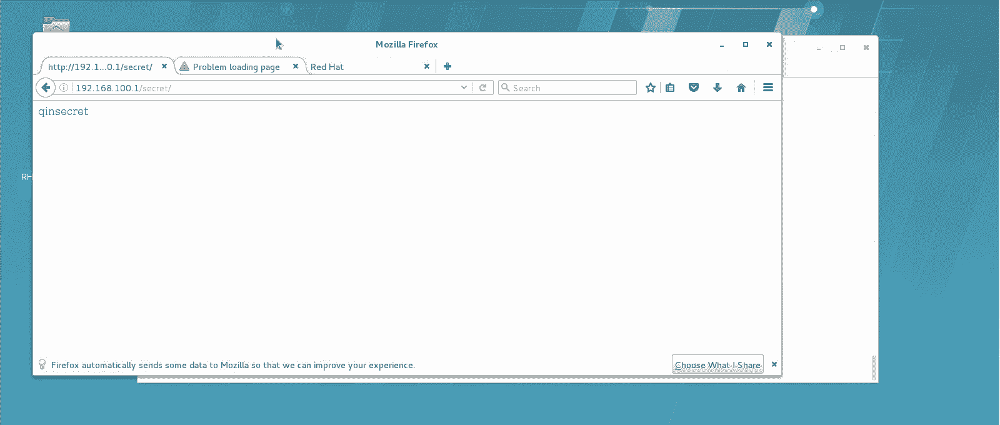

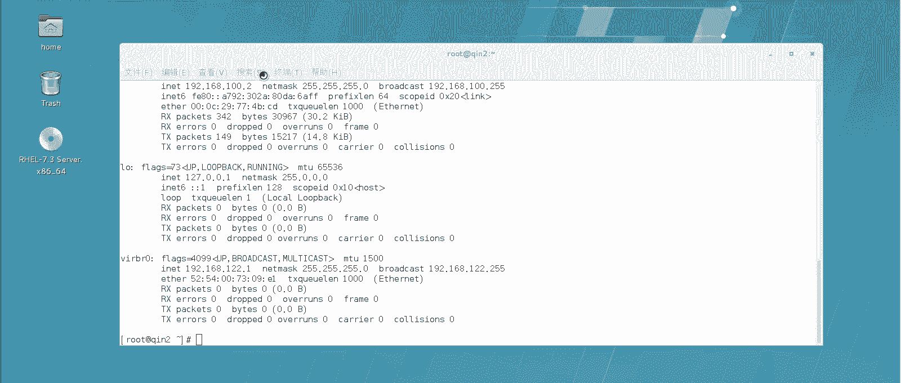

## 目录访问控制 🔒

接下来，我们学习如何对网站上的特定目录进行访问控制，包括基于IP地址的限制和基于用户账号密码的认证。

### 基于IP地址的访问控制

我们可以配置Apache，禁止或允许特定IP地址访问某个目录。

以下是实现步骤：

1.  创建一个需要保护的目录和测试页面。
    ```bash
    mkdir /var/www/html/secret
    echo "<h1>This is a secret page.</h1>" > /var/www/html/secret/secret.html
    ```
2.  编辑网站配置文件，在 `<VirtualHost>` 段内添加目录控制指令。
    ```apache
    <Directory "/var/www/html/secret">
        Order allow,deny
        Allow from all
        Deny from 192.168.100.2
    </Directory>
    ```
    *   `<Directory>` 块用于对指定目录进行配置。
    *   `Order allow,deny` 指定规则检查顺序：先处理 `Allow` 规则，再处理 `Deny` 规则。
    *   `Allow from all` 表示默认允许所有访问。
    *   `Deny from 192.168.100.2` 表示拒绝来自IP `192.168.100.2` 的访问。
3.  重启Apache服务并测试。来自 `192.168.100.2` 的客户端将无法访问 `/secret` 目录，而其他IP可以正常访问。

### 基于用户认证的访问控制（更常用）

基于用户账号密码的认证方式在生产环境中更为常见和可靠。

以下是配置步骤：

1.  创建用于存储认证用户和密码的文件。
    ```bash
    htpasswd -c -m /etc/httpd/.htpasswd qin
    ```
    *   `-c` 创建新文件。
    *   `-m` 使用MD5加密密码。
    *   `/etc/httpd/.htpasswd` 是密码文件路径和名称（建议使用隐藏文件提高安全性）。
    *   `qin` 是要创建的用户名，命令会提示输入密码。
2.  如需添加更多用户，使用不带 `-c` 参数的命令。
    ```bash
    htpasswd -m /etc/httpd/.htpasswd bing
    ```
3.  编辑网站配置文件，为需要保护的目录添加认证配置。
    ```apache
    <Directory "/var/www/html/secret">
        AuthName "Restricted Area"
        AuthType Basic
        AuthUserFile /etc/httpd/.htpasswd
        Require valid-user
    </Directory>
    ```
    *   `AuthName`：认证区域名称，会显示在登录框中。
    *   `AuthType`：认证类型，`Basic` 表示基础认证。
    *   `AuthUserFile`：指定密码文件的位置。
    *   `Require valid-user`：要求用户必须是密码文件中认证有效的用户。
4.  重启Apache服务并测试。现在访问 `/secret` 目录时，浏览器会弹出登录框，只有输入密码文件中正确的用户名和密码才能访问。

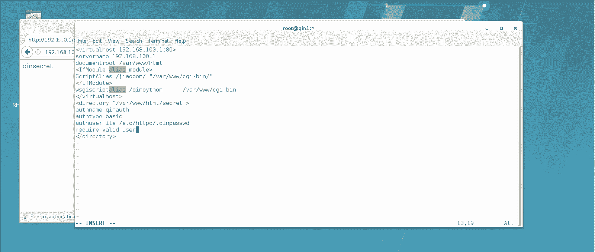

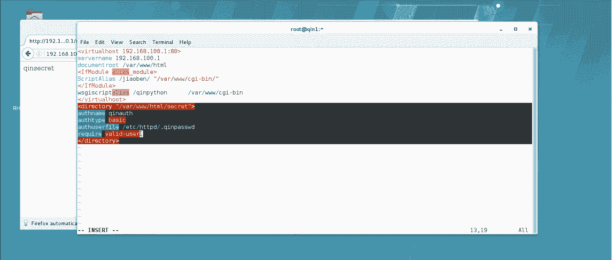

## 总结 📝

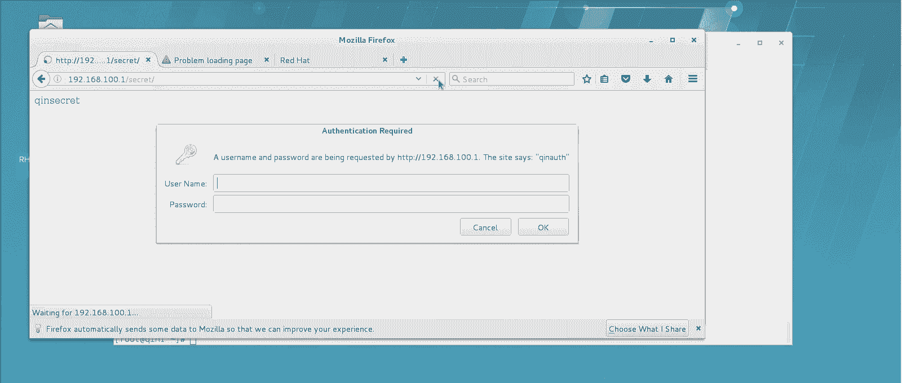

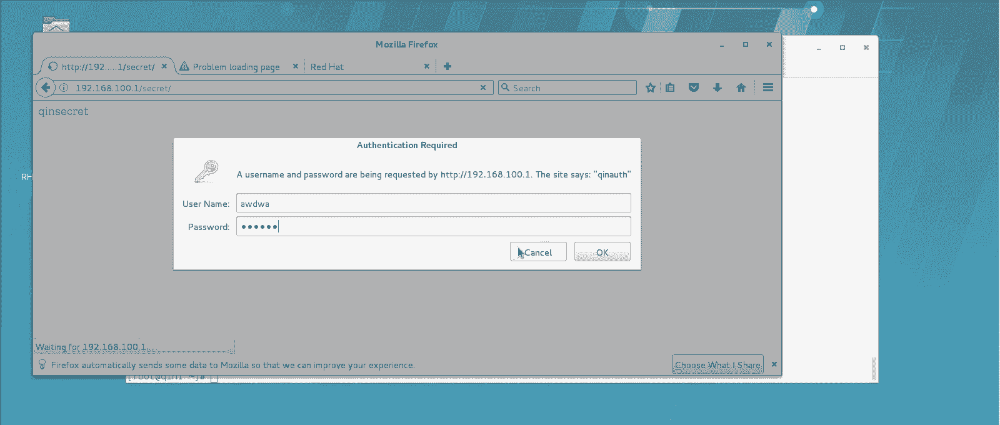

本节课中我们一起学习了Apache Web服务器的两项高级配置。

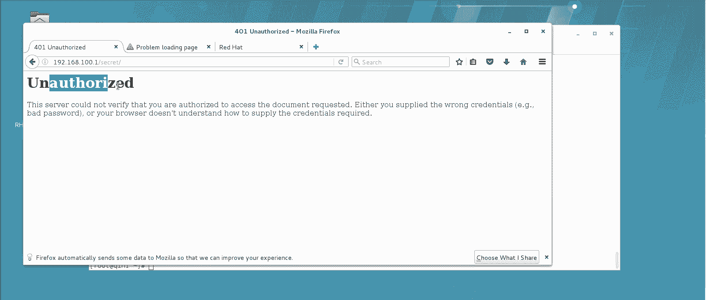

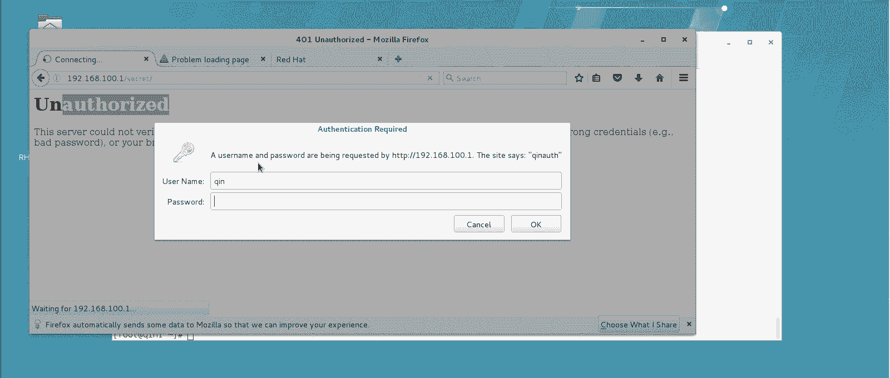

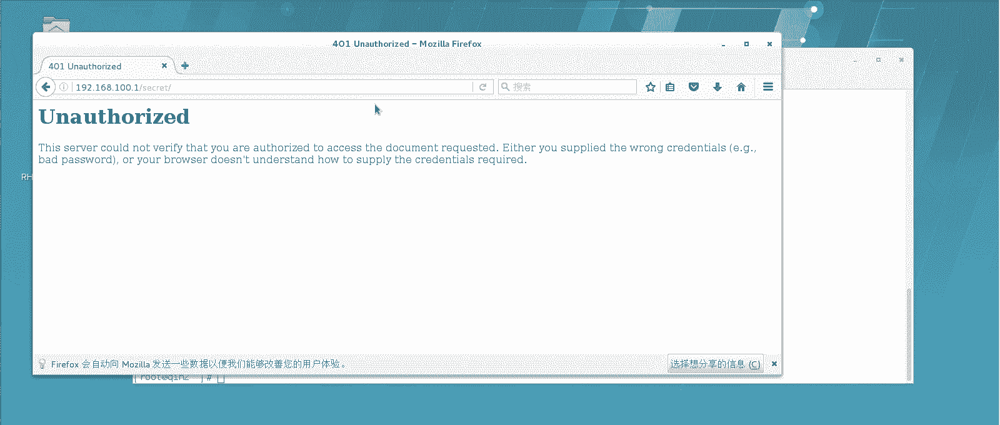

*   **脚本支持**：我们配置了Apache以支持执行Shell、Perl和Python脚本。关键点在于使用 `ScriptAlias`（针对Shell/Perl）和 `WSGIScriptAlias`（针对Python，需安装 `mod_wsgi`）指令将URL路径映射到服务器上的脚本目录，并确保脚本文件具有执行权限。
*   **访问控制**：我们实现了两种目录访问控制方法。
    *   **基于IP的控制**：使用 `<Directory>` 块结合 `Order`、`Allow`、`Deny` 指令，可以灵活地允许或拒绝特定IP的访问。
    *   **基于用户的认证**：这是一种更安全的方式。使用 `htpasswd` 命令创建密码文件，然后在 `<Directory>` 块中配置 `AuthName`、`AuthType`、`AuthUserFile` 和 `Require` 指令，强制用户通过账号密码认证后才能访问受保护目录。

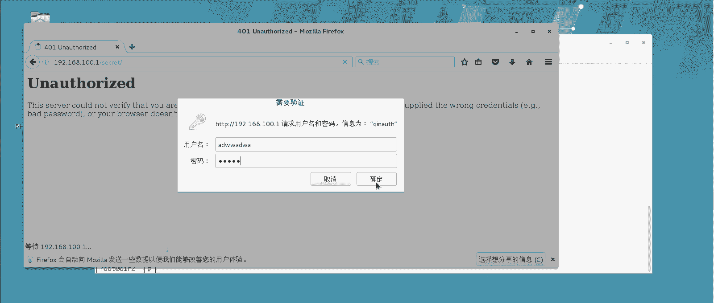

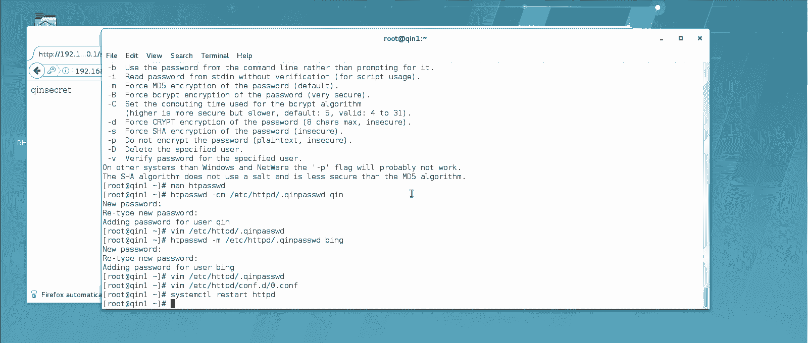

这些技能对于部署动态网站内容和保护网站敏感区域至关重要。