# Linux实战中级篇：P8：Web服务器(六) - 实现HTTPS加密访问 🔒


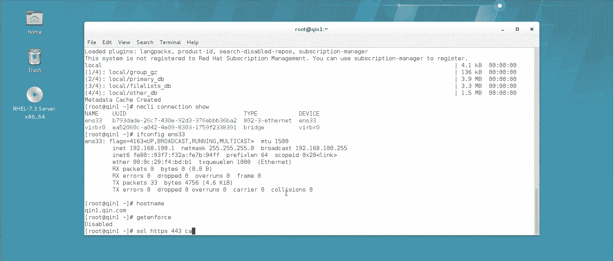

在本节课中，我们将学习如何为Apache Web服务器配置HTTPS加密访问。HTTPS协议通过SSL/TLS加密技术，在标准的HTTP协议上增加了安全层，使用443端口进行通信，能有效保护数据传输的安全。我们将通过模拟生成自签名证书的方式，来实现这一过程。

上一节我们介绍了基于端口和域名的虚拟主机配置，本节中我们来看看如何为虚拟主机添加SSL加密功能。

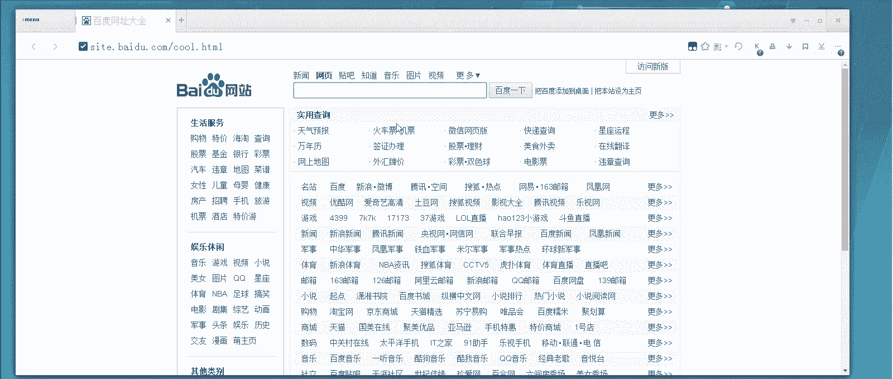

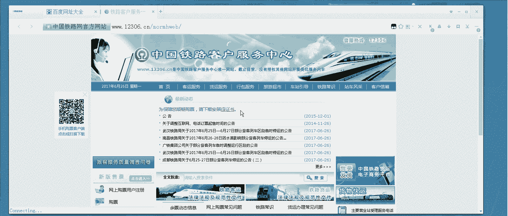

## 实验原理概述

在生产环境中，高安全级别的网站（如银行、证券、12306购票网站）通常会使用HTTPS协议，并需要由权威的**证书颁发机构（CA）** 签发数字证书。其核心目的是解决身份认证问题：确保客户端访问的服务器就是其声称的那一台，而非恶意仿冒的服务器。

其简化的工作原理是：
1.  服务器向CA申请证书，获得一对密钥：**私钥（private key）** 和**证书（certificate）**。
2.  客户端访问服务器时，服务器会出示其证书。
3.  客户端通过验证该证书（通常由浏览器或操作系统内置的受信CA列表完成），来确认服务器身份的真实性。
4.  验证通过后，双方会基于证书建立加密连接。

由于搭建完整的CA中心较为复杂，本实验将使用OpenSSL工具在服务器上**生成自签名证书**来模拟这一过程，以便我们理解HTTPS的配置与访问流程。

## 实验步骤详解

以下是配置HTTPS访问的具体步骤。

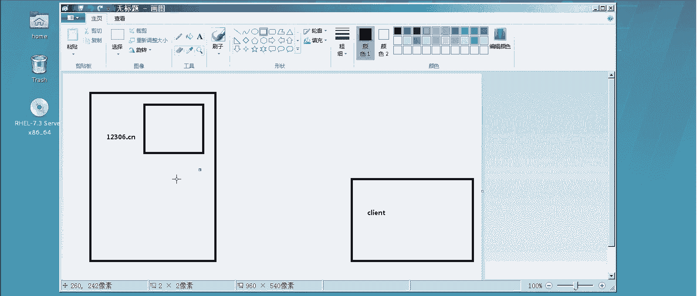

### 1. 生成SSL证书与私钥

首先，我们需要为网站创建自签名的SSL证书和私钥。

```bash
# 进入证书存放的默认目录
cd /etc/pki/tls/certs/

# 使用make命令生成证书和私钥
# 此命令会生成一个名为 `qin.crt` 的证书文件和一个对应的私钥文件
make qin.crt
```
执行命令后，系统会交互式地提示输入信息：
*   **设置私钥密码**：用于加密私钥文件，可直接回车跳过，或设置密码（如 `redhat123.com`）以提高安全性。
*   **证书信息**：包括国家（`CN`）、省/市、公司名称、部门等，可按实际情况或实验需求填写。
*   **关键项 `Common Name`**：必须填写网站的域名（如 `www.qin.com`）。如果使用IP访问，则此处应填写IP地址。

生成完成后，建议将私钥文件移动到更安全的专用目录：
```bash
# 将私钥文件移动到private目录
cp /etc/pki/tls/certs/qin.key /etc/pki/tls/private/
# 删除原始目录下的私钥文件
rm -f /etc/pki/tls/certs/qin.key
```

### 2. 安装Apache的SSL模块

Apache通过模块化方式支持SSL功能，需要安装对应的模块。
```bash
yum install -y mod_ssl
```
安装 `mod_ssl` 模块后，Apache会自动生成SSL的配置文件（`/etc/httpd/conf.d/ssl.conf`）并默认监听443端口。

### 3. 准备测试网页与虚拟主机配置

我们创建两个测试目录，分别对应HTTP（80端口）和HTTPS（443端口）的访问内容。
```bash
# 创建HTTP测试页面
echo "This is HTTP (80) site." > /var/www/html/80/index.html
# 创建HTTPS测试页面
echo "This is HTTPS (443) site." > /var/www/html/443/index.html
```
接下来，配置基于端口的虚拟主机。创建两个配置文件：
*   `/etc/httpd/conf.d/80.conf` (HTTP)
```apache
<VirtualHost *:80>
    ServerName www.qin.com
    DocumentRoot /var/www/html/80
</VirtualHost>
```
*   `/etc/httpd/conf.d/443.conf` (HTTPS)
```apache
<VirtualHost *:443>
    ServerName www.qin.com
    DocumentRoot /var/www/html/443
    # 在此处暂时留空，后续将添加SSL配置指令
</VirtualHost>
```
同时，确保客户端（或本机）的hosts文件（`/etc/hosts`）中有域名解析记录：
```
192.168.100.1 www.qin.com
```

### 4. 配置SSL虚拟主机

首先，修改Apache主配置，**全局关闭**SSL引擎，改为在需要的虚拟主机中单独开启。
```bash
# 编辑主配置文件
vim /etc/httpd/conf/httpd.conf
```
找到 `SSLEngine on` 这一行，将其改为 `SSLEngine off`。保存退出。

然后，我们需要找到关键的SSL配置指令。它们位于 `/etc/httpd/conf.d/ssl.conf` 文件中。
```bash
# 提取关键的SSL配置行
grep -i ^SSLCertificate /etc/httpd/conf.d/ssl.conf
```
以上命令输出的几行（通常是关于证书和私钥路径的配置）是关键信息。我们将这些关键配置**复制**，并**粘贴**到HTTPS虚拟主机的配置块中（即 `/etc/httpd/conf.d/443.conf` 文件的 `<VirtualHost *:443>` 部分）。

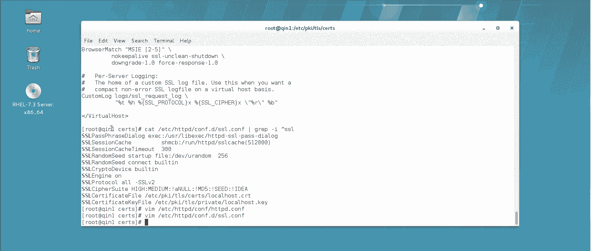

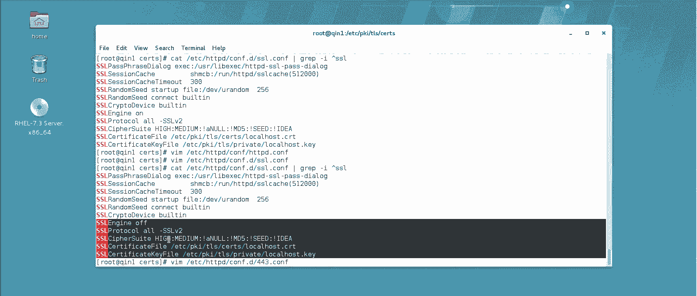

编辑后的 `/etc/httpd/conf.d/443.conf` 文件内容应类似如下（路径需根据实际生成的证书名修改）：
```apache
<VirtualHost *:443>
    ServerName www.qin.com
    DocumentRoot /var/www/html/443

    # 启用SSL引擎
    SSLEngine on
    # 禁用不安全的SSL协议版本
    SSLProtocol all -SSLv2 -SSLv3
    # 指定证书文件路径
    SSLCertificateFile /etc/pki/tls/certs/qin.crt
    # 指定私钥文件路径
    SSLCertificateKeyFile /etc/pki/tls/private/qin.key
</VirtualHost>
```

### 5. 重启服务并测试访问

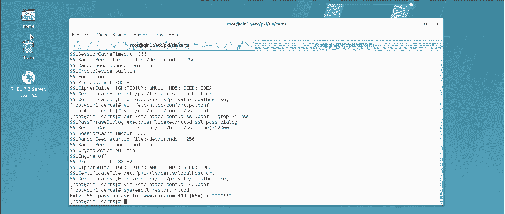

保存所有配置后，重启Apache服务。
```bash
systemctl restart httpd
```
重启时，如果之前为私钥设置了密码，系统会提示输入。输入正确的密码后服务才能成功启动。

现在进行访问测试：
1.  **HTTP访问**：在浏览器访问 `http://www.qin.com`，应正常显示“This is HTTP (80) site.”。
2.  **HTTPS首次访问**：在浏览器访问 `https://www.qin.com`。由于使用的是自签名证书（不被浏览器默认信任），浏览器会显示“连接不安全”等警告。
    *   此时需要手动添加安全例外。通常在警告页面点击“高级” -> “接受风险并继续”或类似选项。
    *   部分浏览器可能需要将证书导入到“受信任的根证书颁发机构”中。

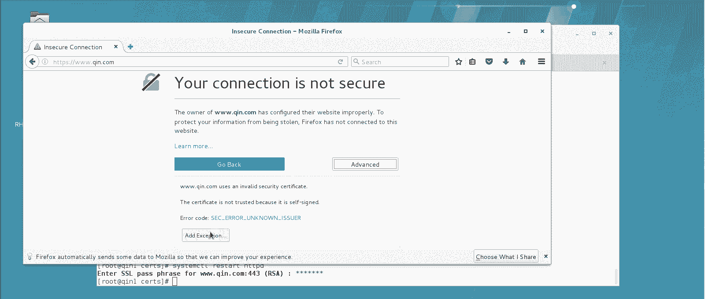

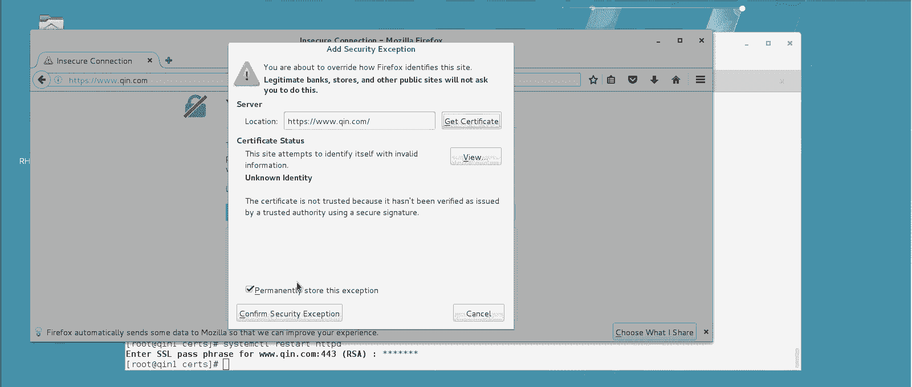

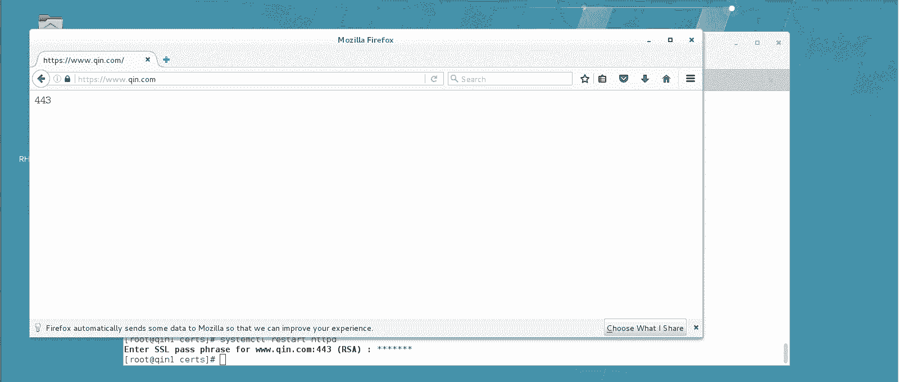

### 6. （可选）强制HTTP跳转到HTTPS

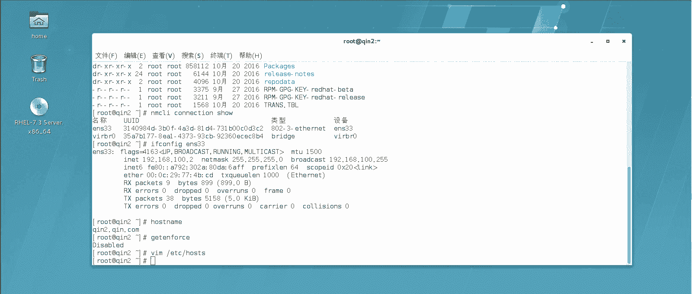

为了提高安全性，可以配置网站，使所有通过HTTP的访问都自动重定向到HTTPS。这可以通过在HTTP的虚拟主机配置（`/etc/httpd/conf.d/80.conf`）中添加重写规则来实现。

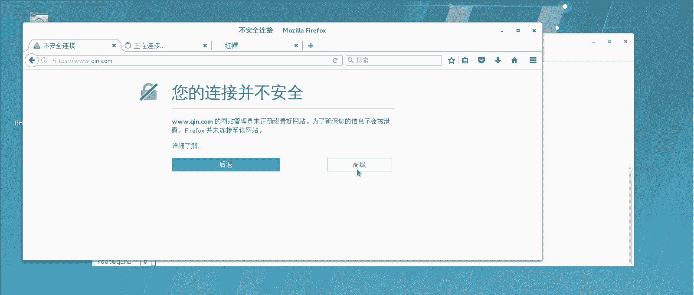

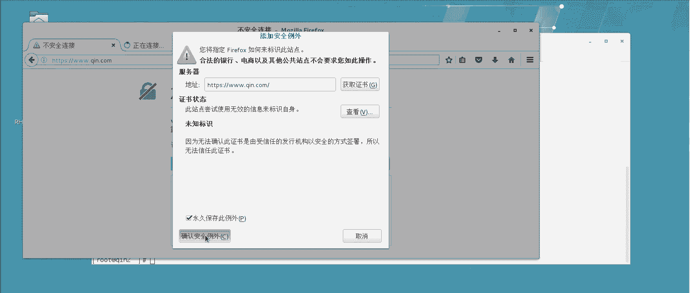

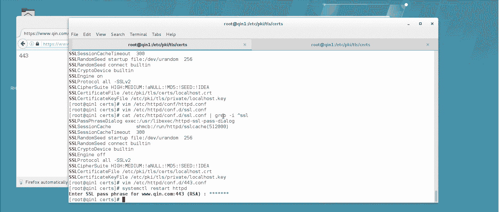

修改 `/etc/httpd/conf.d/80.conf` 文件：
```apache
<VirtualHost *:80>
    ServerName www.qin.com
    DocumentRoot /var/www/html/80

    # 添加重定向规则
    RewriteEngine on
    RewriteCond %{SERVER_PORT} !^443$
    RewriteRule ^(.*)$ https://%{SERVER_NAME}$1 [L,R]
</VirtualHost>
```
添加后重启Apache服务，再次访问 `http://www.qin.com`，浏览器会自动跳转到 `https://www.qin.com`。

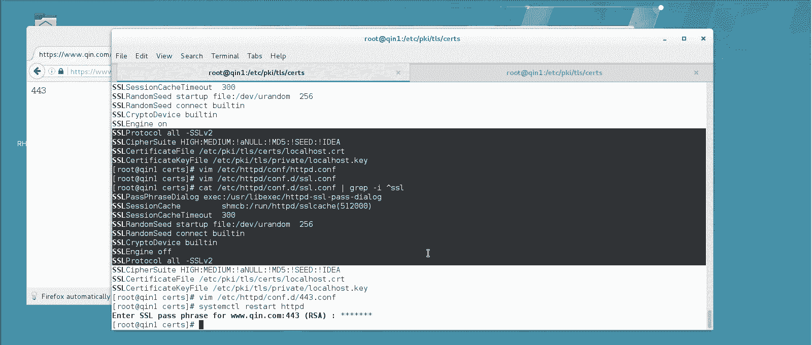

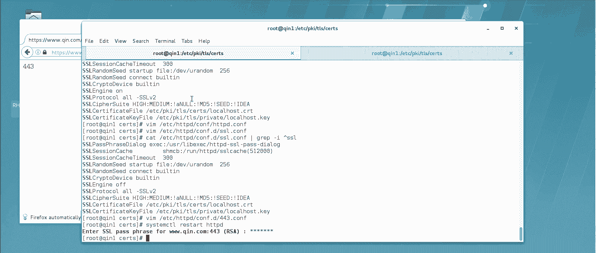

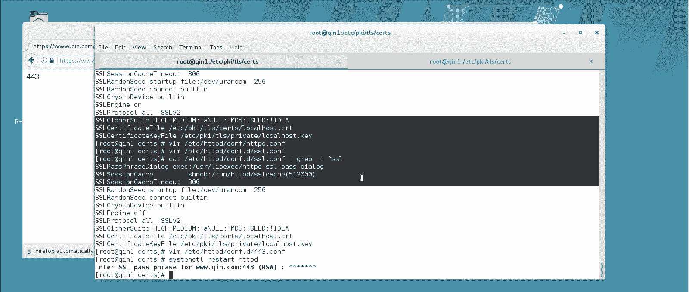

## 总结

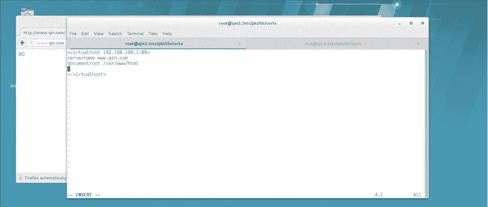

本节课中我们一起学习了如何为Apache Web服务器配置HTTPS加密访问。我们掌握了使用OpenSSL工具生成自签名证书和私钥的方法，了解了如何安装和配置 `mod_ssl` 模块以启用SSL引擎，并完成了基于端口的SSL虚拟主机配置。最后，我们还探讨了如何通过重写规则强制将HTTP流量跳转到更安全的HTTPS。通过本实验，你应当对Web服务器的安全加固有了初步的实践认识。记住，在生产环境中，应使用由可信CA签发的正式证书来替代自签名证书。