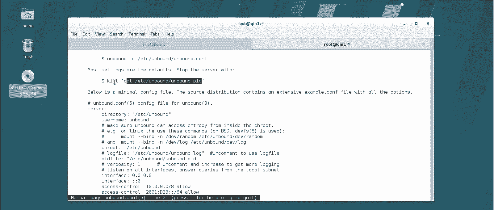
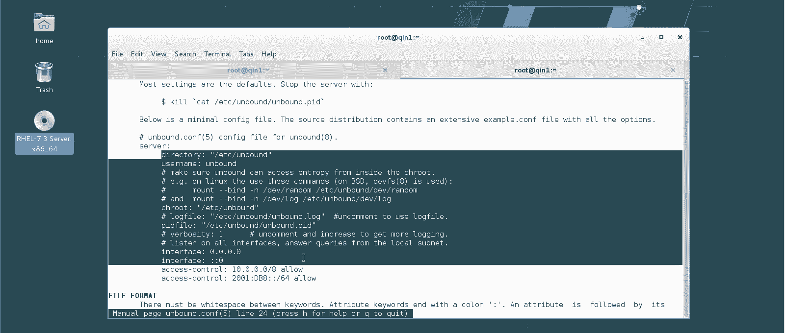
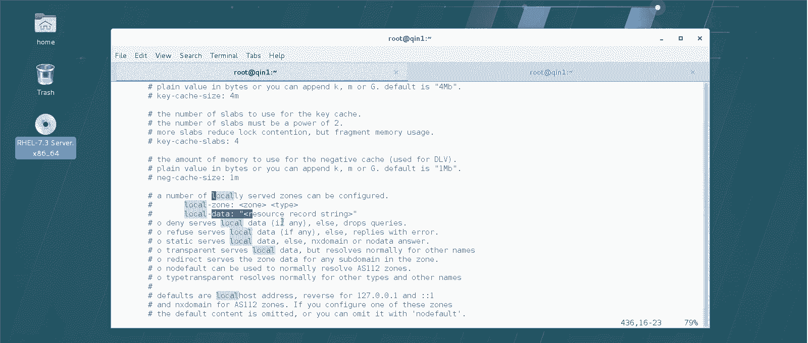
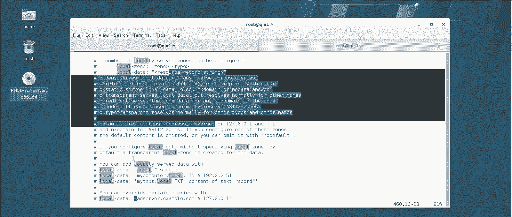
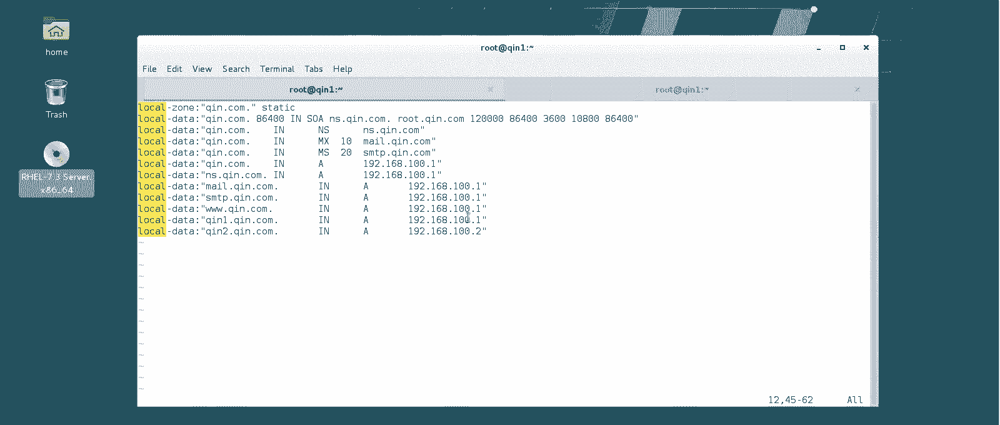

# 【云知梦】Linux实战中级篇／RHCE认证／RHEL7／CentOS7 - P10：第10集 DNS服务器(二) - 云知梦官方账号 - BV1iV411h7ia

。

那么讲完了这个理论呢，咱们就得适当的做几个实验了啊，因为这个咱们说也不能光说不对是吧？毕竟咱们讲这课程还是以这个动手为主啊，那么生产一线来说啊，常用的DNS服务器有哪些呢？最多的其实是ban的啊，呃。

包括windows其实它DNS底下都是用ban的啊，好像都办的久了啊，那么。但是呢有一点就是红包六和红包五的确是这办的。但是到红帽七啊，这个不讲它了，建议用这个。为什么呢？

就是说ban的这个DNS服务器有一些在安全性上的问题发展到今天啊，的确这也比较老了啊。所以说到期开始，宏榜官方建议用它来替代这个band啊，但是呢它这个考虑到兼容性啊。

因为毕竟5和6那会儿都是推的这个ban，所以说到7呢它虽然推荐用这个，但是它那个系统里呃光盘里边有这个ban的包啊，我可以给你查一下。办。这个啊嚯这查出来这个多呀。

它就叫ban啊哎就这个啊ban点叉8664啊，你可以看到这ban是谁开发的，它是伯克利啊，伯克利大学伯克利里伯克利在这个大学在这个开元这个linux这个很多软件都是他们弄的啊。

你看这是internet name读漫ban啊，所以它叫ban嘛，它叫博克利的internet name读漫啊，博克利开发的一个互联网的域名服务啊，DNS读漫 name system server啊。

早期是用它啊，的确是很老牌很很老牌的一个DNS服务器。到期的话建议装这个啊。用它来替换ban啊，它相对来说更安全啊，我们把它这个系统这个这个这个给它装上啊。然后肯定完了之后还得怎么着呢？

你看我这讲第二个服务，我觉得你应该差不多都知道我要干嘛了那。是吧。但是呢实际上你要注意啊，这个半的啊安棒的啊这个服务其实不建议你装完马上启。为什么呢？就是它呢一重启啊，一启动，它要求干嘛呢？

它就要读一下这配置文件。因为它要读什么呢，配置文件的，也要读那个咱们本地服务的一些什么域名主机的这些解析记录。所以你发现重启一下，有的时候这时间挺长的啊。所以其实你要是装完了，你不重启也行。

你等都配完了，你再启动它啊，那么我们现在看一下啊，启完了。哎，现在是激活状态，正在运行是吧？啊，嗯我们说一下啊，就是这个服务呢那个安棒的呀，它这个配置服务啊，它要求对配置文件的书写非常严格啊。

如果一旦你写错了，它起不来了啊，所以他自己带一个自己带一个什么呢？带一个这个检测工具啊，这个检测工具呢叫安棒的的。这个checkfi啊，你看默认如果你没写错，当然我现在肯定没错，这里都没写东西呢是吧？

就默认值这哪弄错，他就给你写示no errors in什么这个这个这个啊，一旦你写错了，拿这个工具他可以给检测出来啊，这是后话，咱们一会儿写完了之后，咱们要改动了，咱们拿这个工具得检测一下啊。

他对这个书写要求还是比较严格的，他有固定的格式啊，那么默认呢这这哥们监听的是53端口啊，UDP的啊。ANTURP。这些幸亏咱们上一章咱们都是吧，都都都讲完了。所以说你这一张我做这些你可能就明白点是吧？

53啊，你注意啊，这底下这这这这这这些不是啊，这些是，但是你注意默认它是监控本机的53发现了吗？啊，监控本机的53端口，那么这是有问题的，包括这个IP啊，这是咱们那个。

你去看这是那个呃自己机器上做那桥接的IP啊，他默认它监控都是本机的这不行，为什么呢？你这办的服务器咱说了它是在企业里啊，它是一个DNS服务器。

它应该为整个网络所有的计算机提供这域名解析你要是只为自己提供域名解析，还不如它呢不如用E下个多好自提以说这个一会配置文件咱都得改让他得为网络中所有人提供这个DNS解析那怎么改呢？

那肯定还是肯定有一个这个文件夹里边也一定有一个叫l，这个你对照上一张你会发回头服务讲多了你自己都能知道啊装完以后第一重启一下然后呢看一下它的端口，然后直接就得改配置文件就得了啊。

当然讲完防火墙之后要配一下防火墙啊，讲完呢要改一下条值下文这东西那现在你看啊他告你。他说你如果想改这盘件配置文件，如果有什么问题的话，你可以干嘛呢？

你可以看安bound的config5man page这是什么意思啊？哎，你可以man一下什么呢？5。Un bound的。点儿。你可以慢他，这里边就是对安bound的这怎么改怎么改的一些这个呃描述啊。

你比如说你杀死安bound的这进程，你可以通过这个文件啊，这个文件呢你可以看一下这文件里的内容，这里边写着bound进程号，你直接把它ki了，他给你提供了很多这个里边这些东西。

他默认这文件夹什么这些格式啊，你要是看得懂的话，你可以看啊，它包括的一些语法的规则啊，包括它一些端口啊，什么默认是53什么这些啊，有兴趣你就看看啊。如果你说老师我英文不懂英文差。

那你知道有这么回事就得了也别细看，这里边呢推荐给一些就是老工程师，或者说你呃英文底子比较好的，你可以看一看它的bound的一些书写的语法规范啊，但是咱们还是按那个老话说。

就是咱们上一章咱们的说法就是这些东西你不可能都记住啊，这些语法规则也好，书写规则，你不可能都能记得住。包括这配置文件里东西，我也不都给你讲，我都讲。

你也记不住是吧？咱们挑点有用的啊，实际上这配置文件来说，结构体很简单啊，第一块上来这第一大段前面。主要是描解他一些什么呢？就是谁能访问，谁不能访问他一些规则哈interface。

为什么现在它只能监控本机呢？因为你看它inface这默认值啊，它没开开啊，你应该把这值给它开开。开个成什么样呢？这个interface让它监控0。0。0。0。就是说它这个服务啊。给网络中0。0。0。

0表示所有网段的这个IP啊，对他们都能提供服务啊，这才行的是吧？然后呢嗯还有什么东西啊？53端口这些默认值这些其实都不用改。你发现这棒的这配置文件大部分都是注释啊，大部分都是注释。

他就是告诉你一些语法怎么写这些东西啊，其实大部分的这包括什么缓存值啊，现程有多少个线你都不用去改你都不用去改就改几个地就行了包括时都不动什默认不用动还有哪个要改还有一个允许就是你现在光开放所有人对外提供服务。

但是不是所有人都能访问到你啊，你对外开放了，然后你还得开放一这个就是允许所有人过来从你这获得DNS记录啊。

也是面向所有网开开而且最后这不re拒绝你应该改底下这不有规则改成行上面那条对外开放底下这条允许他们从你得DNS解析还有什么是比较重要的呢之住就是回头你可以给一个高安全性的。啊。

这些其实咱们统一都搁在后边，咱们讲到安全啊CA内蒙课的时候再讲啊，这个得改use name user name。这个其实它本来设计这个是好意，它是什么意思呢？就是说你看它也跟阿帕提一样。

它会在ET下 passwordword比。他这个里边也会建一个叫安bound的的这个用户啊，也是n log in的，它用于管理啊，管理这个安bound的DNSserv啊。它本意是说什么意思呢？

就是说只有经过这个安棒的这个用户认证的，可以查询啊。但是在生产一线这个测过就是说安的出来有一段时间就测就是这个其实是呃会有一些安全隐患的，而且使用起来不方便，所以一般我们就把这删了。

就是说任何用户啊不用非得安棒的用户认证查询就都可以使用这进行查询啊，这个是比较好的啊然后他告诉你默认这安bound的这主目录嘛。

是不这ETC下的安棒啊都在这所有这些主配置文件什么乱七糟的PID fail是这个这是什么意思呢？这个PIDfa其实很多程序都有啊，包括前面讲的阿帕奇，它也有这PIDfa，这什么意思啊？我给你看一眼啊。

这个PID fail里就是一个进程号，就是谁呢？就是你这个安棒的这个程序起来以后的进程号，你这个服务一起来，这就有一数啊，你看PS。呃AOXGREP一下这个unbound。

你看安邦的这进程是不是2573是吧？你要给他停了，这里边就没东西了啊，说为什么弄这么1个PID文件呢？其实就是为了说我可以随时从这个文件里读取我这个进程的号。我对这个进程进行管理，他就是这么用的啊。

很多程序都有这个啊。包括还有什么，这大部分都是注释啊，这些默认参数值，这些其实都不用改啊，不用动它。还有你比如说他会告诉你，就是如果你默认的规则啊，他会给你搁一地儿。后边一些涉及安全啊，什么key呀。

这些咱们都是到安全加固。啊，那张咱们到CA讲服务器固化的时候才细讲啊。一些证书啊，怎么增强它安全性，包括做这啊这个看一眼啊inTC下安下的loc d星点这跟那个阿卡旗舰一样，就是你自己写的规则。

本地规则我不是说了？就是说咱们在企业生产一线很多时你配的是本地本企业自内部的DNS记录？你搁在这个目录底下去啊，搁在这目录底下叫什么什么点他到时能给你读到这配置文件里啊。

以及你看他底下还说了说怎么去加强这些用key证书这种方式43咱讲43？安全端口么着这包括还有一个他也可以把这个这就一些附加规则但是建议你本地写的这个配置文件一定写在这底下其实这个安最麻烦写的是那个配置文件怎么写这配置文件怎么写呢。

他其实也给了一些规则，包括什么这些转发的规则。如果说你本地局域网搜不到，你怎么转发啊，咱们回头还有。实验专门将转发服务器啊，这是这个啊。包括这些安全这个咱们到那个CA那课再去讲它啊，最难写的是什么呢？

就是你本地的这个配置文件啊，本地的这个记录就是你比如琴一点7点com，你想回头让它对应19168100。1，这怎么对应啊？其实这个它在这个文件里啊，我看一眼啊。

它里边其实是有一些这个规则给你提供locer data啊，包括locer data怎么去写，我看这不是啊。嗯。他有哎这呢就是怎么去写，其实就是按这个格式local z本地的区域啊，区域的类型。

然后本地的数据啊，怎么做这一条一条解析记录啊。但是你这英文如果差的话，我估计你读这玩意儿也费劲。

呃，他默认的是这样的local z什么什么样，然后这个这个区域inA什么什么，就是这个怎么说呢？就是我也甭你来这个了，我直接给你敲一个，你回头就明白怎么做了。它这个呢其实写的还可以啊。

它设置的几种这个域类型，有这种tatic有静态的，有这种转发域的啊，它其实有几种这个格式啊，这个咱就不看那个例子了，我直接给你写吧，保存最初啊，注意啊，刚才这棒我改的仨地儿，哪仨地啊，再说一遍。

一个把interface这个打开，表示我安到的要对外所有的这些主机提供服务，这是我提供服务啊，这个呢。是这还改了一个什么什么，就是所有的这是允许别人访问我，这是两回事啊。这是允许别人所有主机访问我啊。

当然如果在生产一线，你说我就对一个网段的话，你就把这一个网写个网少位码写你可以写细然后注意us name不要只允许用户认证查询的啊，把这个删了里边什么都没有就改仨就然不用重启服务啊。

你直接去编ETC下下注意loc点啊，你自己本地写的规则搁在这底下比如说你看我这主机我这个 name你看啊我这这不都是域域里边有一台主机叫个应1810回头还有我域等于是那我没有一个我就得建一个这个域的解析文件个解析文件名。

随便写啊，为好为了好记，我就叫勤点com是吧？注意后边一定是点c的，它才能读到那个主配置文件里去啊，那么这个文件怎么写呢？首先你要去定义这个域这个域叫什么呢？用这个语法，它其实那个配置文件里都有啊。

我就不愿意复制粘贴了，你直接来吧，locgo做。我这本地的这个粽叫什么呢？叫勤点com，这就是我本地那个玉嘛，是吧？注意啊。你写的这个安棒的也好，是ban的，其实它都有这要求。就是说你最好写完整的域名。

完整的域名。就是说咱们最后得加上那根域那点儿大啊，这是一个静太玉，这是一个静态玉本地的静态玉logo中啊。那么然后呢你要写什么呢？你要写local data，第一行local data是描述。

就是说描述什么呢？你这个域里边这起点comm这个域啊。呃，一个生命周期是多少时间？这86400是什么呢？是秒，我给你算一下，你知道了。那BC啊。

这是咱们linux计算器1分钟是1小时60分钟一分钟是60秒，这是3600啊，那么你3600秒，这一小时的秒啊，乘以个24，这不一天嘛，一天正好是86400秒，所以说DNS服务器它的生命周期。

86400啊in啊SOA啊，什么意思呢？就是这个域里边勤点com这域里首先它要让你指定谁是老大，就是谁是负责主DNS解析的NS点7点com比如这台机器啊。

我生产一线里肯定不会说用琴一点琴点com这个机器。呃，当这个主DNS，但是今天做实验的没办法，因为我这主机太少了，所以我就把这些机器当DNS服务器。我呢这个名字NS点7点com呢。

回头我也指向这个1191810。1，我等于回头呢我会做几条解析记录啊，包括DNS服务器，包括邮件服务器，我都指道这台机上啊那么就告诉你了，这个域里边啊，谁是DNS服务器，谁是老大呀。

NS点7点com这个主机啊，但是我现在还没说这主机啊，注意这个点啊，我还没说这个主机是谁啊，他的IP是多少？然后如果有问题的话，呃给谁发个邮件是给他啊，然后后边有一串数。后边有一串数。

这串数呢我再给你念叨念叨啊。嗯，比如说我先这么写啊，我先写完了，我给你念叨念叨这个。这有点意思，这个啊这是什么意思啊？这5个数，这是一个序列号，一个序号，什么意思呢？代表这个配置文件啊。

就是这个主机这个配置文件这记录，这里边不是回头要写那个IP和域名对应关系嘛？代表什么呢？这个序号每修改一次序号加一说这个序号有什么用呢？我前面说了，我说生产一线。

咱们这个一个企业里可能是不止一台DNS服务器。那么这台如果作为主DNS的话，那些别的DNS服务器，什么缓存DNS就是不是得从他这去获得数据啊，是吧？你这如果更新了，我们底下得把这数据更新一下啊。

但是有个问题，我更新是不是占用网络资源呢？那如果我发现你没更新，我是不是尽量我也就不更新了是吧？那怎么知道你更新没更新啊，看这个序号啊，如果你序号比我大啊，我上一次更新完了，咱俩肯定序号一致。

那么我如果发现你序号比我大了，那我就知道你这里边肯定又变化了，因为你一变化这就加一嘛是吧？我发现你这数比我那数大，那我就给你同步一下啊，如果发现我咱俩数值一样，那我就不给你同步了啊。

减少点这个资源浪费啊，这是这序列号啊，所以说注意点什么呢？在生产一线，如果你这主DNS服务器，你重做了，你这号一定要写大点为什么你这你要写个1000好嘛？底下那些服务器都1万10万了是吧？你这1000。

你得更新多久，你才能底下从的才认为。你你这值得跟你更新一下，这就麻烦了，底下就一直不更新了。所以你得保证谁是主的，你这号得大着点啊。然后后边这86400是什么呢？这还是秒啊，这这是时间啊，这个是次数啊。

这是序号，这个是秒，这表什么意思呢？那我们底下这些从DNS，包括辅助DNS包括什么缓存DNS这是这些它不是跟这主的得同步嘛？多长时间同步一次啊，默认是一天同步一次，因为它一个生命周期是86400嘛。

所以它过一天同步一次啊，这3600呢也是秒，这是什么意思啊？就是说如果我这一天不是同步一次嘛？发现没同步成功怎么办呢？过3600秒，就是过一个小时，我再跟你同步一次，我再找你同步去啊。

然后后边这10800呢，这也是秒，什么意思呢？如果我过一小时没成功，我是不是过一小时又同步啊，同步到这么多时间以后啊，这是几个86400，这应该是？呃，我算一下啊。呃，10800除以这个。呃。

这是3600，这是多少？哎，不对。应该是用这个啊。10800。除以这个3600，这是3啊，就是说。三次啊三次我跟你这同步，如果都不成功，他会认为什么呢？底下这些从DNS辅助DNS他会认为。哎呀。

他们大哥可能死了，他可能认为大哥死了，然后呢，他就不再同步了不再同步了。他表示过期，然后再经过一个生命周期。86400之后，他就把自己的数据全删了啊。他认为大哥都死了，我活着也没什么劲了啊。

因为他主要是其实这是咱们开玩笑说，他认为主DNS出去。如果那记录没了，那这些记录有可能是有风险的。我在对外提供这些DNS解析，这个可能不安全啊，他是这么个意思啊，这是这条记录啊，这条记录非常有用啊。

那么他指定了我这个域里边谁是老大啊，然后以及一些更新的，就是这些从DNS更新的这些时间和次数啊，包括这些生命周期啊什么这些东西啊。那么。这第二行啊，接下来就要具体的写写什么呢？写这个具体的这些呃条目啊。

往里写条目。你比如说第一条咱们就应该写什么呢？写这个域里边，咱们现在写这些域的一些关键角色啊，比如说呃注意这个点啊，我这。上面这些都没有加点，那就不好。那么写这个其实不加也行啊。

但是说这个尽量书写上稍微注意点啊印。啊，然后呢这个域里边这不是勤点com这域吗？谁是NS服务器，它用这种语法啊，NS点7点com我告诉你了，DNS服务器叫这个名字叫NS点7点com啊，以及呢。

这样YYPPP啊，咱们P几条啊。这个域里边，比如说我先把这语法先写一下啊，说谁是邮件服务器啊，如果邮件服务器不唯一的话呢，你还可以在这加号啊比如说这个也是一个邮件服务器啊，那比如这是20。

他这有优先级啊，这没关系，咱们等讲到那个邮件服务器的时候，还会跟你说这是什么意思啊，邮件机，比如说我有两台邮件服务器是吧？一台叫卖点点com，一台叫SMTP点琴点com啊，然后呢。

比如说我这个嗯然后再接着就开始写一些A季度的啊，那么这个域啊，比如说你有的是有的用户比较无聊，他不拼，我一台主机他直接拼这域也能让你拼通的话，那你这个域啊，你得给他一个IP就是如果说拼这域的话。

你让他指道比如说指到这个IP。这个A叫A记录，就是主机记录啊。嗯，然后呢我再P一个。然后再往下，你就要把你前面这些主机一条一条的这个IP记录，就是主机记录，你得给它写上了啊。你首先来说呃。

比如说你这个NS哎一会。比如说你这第一台主机NS点7点com，你就得告诉他这台主机是谁是吧？这台NS点7点com的主机，那它的。呃，这个解析就是100。1是吧？以及你刚才写的这个，比如说。

卖点轻点com点是吧，也是100。1。包括这个SMTP这个主机啊，也让他指到这儿啊，我这生产一线机器肯定比这多啊。我这现在是我把这几个都搁在一上了啊，生产一线你不可能把这么多服务器都搁在一上啊。

它肯定不同的IP是吧？啊，包括在底下该写什么呢？比如说你可能还有个3W点7点com，这是一网站的外服务器是吧？你也可以指到这儿啊。再底下呢就是我具体这个网络里的这些主机了。比如说我有两台，一台叫。

琴一点7点com，还有一台叫这个秦二点7点com。当然秦二点7点com这个只到这个二上去了啊，这个指到二上去了。那么这是正向的，就是说正向的域名到IP的解析记录，我们这么去写啊。

那如果是反向的记录怎么写呢？

