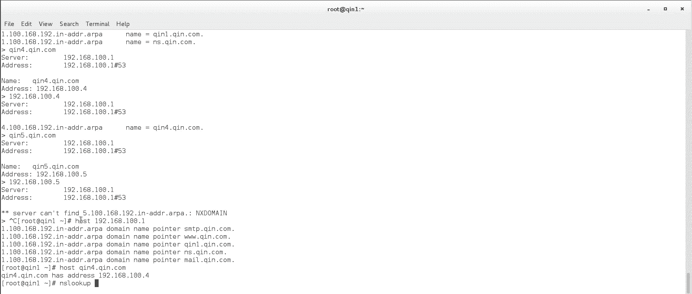

# 【云知梦】Linux实战中级篇／RHCE认证／RHEL7／CentOS7 - P11：第11集 DNS服务器(三) - 云知梦官方账号 - BV1iV411h7ia

。那咱们放大点啊，这有点看不清楚，反向的呢也是加这个local data啊，但要注意呢，反向的是有1个PTR的，它这个PTR表示它是个这个反向的啊，然后呢呃冒号，还是引号里边加什么呢？

就加这个解析的这个记录啊，192点168点100点1啊，你前面正向有的域名的IP的解析，反向这你都得给它做出来。比如NS点7点com点啊，这个得有。还有谁呢？好几个啊，1。188100。1。

咱们对应的刚才是好几个啊，比如还有这个mail啊。还有什么SMTP的啊，还有这个3W的啊，还有谁呢？7一的啊，以及呢还有谁其二的是吧？前二是对应的100。2啊。这样咱们再添个秦三吧。

我这个解析记录里好像真有秦三啊，来，咱们再添个秦三。这个记录对应的是100。3啊，那你反向的这儿也得添一个啊，就是你注意有正向的就必须有个反向的啊，这样的话呃才能解析成功啊。当然也可以没有。

不是一一对应的啊，那就是说你正向的有反向的没有，那反向的到时候解析不回去啊，来看一看有什么问题没有啊，就是一些基本语法啊，别错。哦，你还真有一个这个没点儿啊，其实这个。有点没点都行。

但是呢就是在生产一线呢，尽可能的你按照这个书写规则啊，比较标准的规则就是都要带点啊，写它的完整域名。好了。呃，完了之后呢，咱们呃安棒的这个config检测一下，你看没有错误啊。注意啊，它这个检测来说呢。

就是说相对来说这个检测的还是比较不错的。你比如说你随便弄点错出来吧。你比如说你。你少一冒号是吧？检测你看他告诉你了，说这个这个文件里边第十八行啊，什么loc data pR这个什么这行啊有问题啊。

你看你进去看一眼。他这个相对来检测的还是挺准的set。number你看第十八行是吧，这不就这行吗？你看就是咱们刚才这个啊，它相对来说检测还是比较靠谱比较靠谱的啊。

但是呢你也别认为说no error就一定没毛病，为什么呢？这个安棒本身来说啊，它尤其你第一次配了这么多信息，你一重启，它往里读的时候，它一条一条的把这记录往里加。这个时候有可能有点小毛病。

尤其第一次你加这么多这个解析记录的时候，有时候是有小毛病的。你看它ra大时间特别长，就是它一条往里往里边读的啊，解析。所以说呢你光看重启完了，你一定看一眼这个t。有的时候这个space。

你看这个是没毛病，active running是吧？这正常了啊，有的时候这是failled的啊，尤其你第一次大规模的改完了这个这些什么正向反向这些记录添进去以后，经常有呢是failled的生产一线也是。

那这种情况如果是碰着了怎么办啊？boot一下，reboot一次以后就没这毛病了啊，就那一次就行啊，这是它安棒的本身的一个小毛病。就是它第一次你大规模修改配置文件之后，必须reboot一下。

有时候才能好啊。那么这是咱们说这安棒的啊。那么配完了之后咱们再检测一下，说怎么检测呢？嗯，我这有三台这个虚拟机。分别是琴一，这个的IP是这个100。1是吧，正上对应琴一，还有一台这个。

这是前二啊，这个IP是100。2啊，hose name你看一眼啊，首先说我这三个主机肯ho里边都没东西啊，还有一台windows的琴啊，注意windows这个也是虚拟机啊，我这IP你看设的100。

3D服务器我也指的是100。1啊，也指的100。1啊。然后呢有的时说这windows怎么做那个网卡重启啊，你把它禁用了，再给它启用一下，这就算是做了这个网卡的down了再up啊。

那我这呃这三台机械有windows有linux环境，我都知道这台机器上，那怎么来检测呢？最简单的方法，你拼一下。

勤一点勤点好。你看解出来100。1了啊，然后呢呃你可以再拼这个前二点轻点com。你看也解析出来了，也能拼通啊，注意啊，不是说这机器必须得是开着呢才能解析出来。不是啊，你比如说我再添一条记录。嗯。

我再往这个季度里边，我再添一条。比如说我再添一条什么呢，我再添条秦似啊，你这秦似就没机器了。你看啊YYP啊。这个记器我天琴4。对应的IP，比如说对应100。4啊，反向记录我也添一个。YYP。呃。100。

4。琴四对，咱们再顺便添一琴五吧，然后我只做正向。不做反向啊，让你看看会有什么这个毛病，咱们把这些东西尽量给大家都演示一下啊。琴舞你看有正向啊，对应的就100。5吧。啊，100。5好。然后呢。

这个应该检测不出什么毛病啊。重启一下啊重启一下啊。重新式的服务啊，那么我们现在又增加了一秦4，秦4应该是现在目前网络上没这机器啊，起码是找不着GIP这机器啊，那它能解析过去吗？也能啊。

因为DNS服务器它解析不是说必必须得通才行啊。包括我们做了一个琴5，只有正向，没有反向。那好。看一下啊，现在还是active running，没事啊，那么我们聘一下谁呢？琴4。7点好。你看也能体出来。

但只不过这拼不通罢爸啊。你看他告诉你hoss的这个叫什么unreachable不可达啊，包括说琴舞也是可以的。但是我们在生产一线一般来说不太愿意用pin这个来做这个正向解析的检测啊，这是比较方便啊。

一般情况下用什么呢？用NS。lookup跟windows一样，这个命令都有啊，有些人愿意用第个，我就愿意用这NSlookup啊。这个的话，你比如说你勤一点勤点好，你一输，你看他告诉你了。

我是通过这服务器啊，53端口啊，然后我解析出来呢，这个这个IP地址对应的是它啊，那你要注意啊。这是正向啊，反向的也能解析100点1。但你要注意这反向解析出来，你看解析出来一堆域名。

因为当时我把这些都指到100点亿上了啊，指出来好多啊指出来好多。所以说呢这个就是哎呀。所以就是生产一线啊，你这尽量你反正这机器啊，你怎么说呢？呃，生产一线一般情况下，这服务器富裕，啊不会说像我这样。

这么多IP我都给弄一个上，因为你把这么多域名都指在一个上，你发现第一次解析出来是这个IP，第二次解析出来它不一样，明白吧？他每次解析出来的这个IP它会你看都是轮巡的轮巡的啊，其实这道有一好处。

什么好处呢？我们生产一线可以拿这玩意儿做这轮巡啊，但是实际上来说，一般生产一线呃，不会说把这么多服务器都对着一个机器上机器太累了啊，正向的反向的。咱们比如说琴四点勤点CO。哎你看这解析出来就一个了啊。

1点1。8点100。4。啊，你看这就一个啊，解析说的反向记录就是他啊，你注意啊，琴五点勤点方。正向没问题，解释出来了吧，1。168点100点5。注意，因为你没有琴5的反向解析记录。

所以你输这个告诉你server看到的 find，你看见没有？这是反过来的IP反过来的这是反向解析，它没有查到相对应的域啊，域名这记录没有啊。所以我说了，你正向反向可以说不都做。但是注意你要是不做反向的。

它肯定就是反向出不来啊，反向出不来。啊，那除了这个还可以用什么呢？还得用这个。host这个命令是专门用来做反向解析的，说你不愿用NS lookup，你专项做反向就用它啊host。啊，也可以啊。

它也可以做这个域名解析的检测啊，还可以用第一个啊，但其实我挺讨厌这个的，这挺挺麻烦的啊，为什么我愿意用NSlookup？就是说它正向反向，它那个windowslinux都支持这命令啊，那么好。

这是我们在这个机器上试了啊，那么别的机器呢，你比如说我这儿是吧？这有一台这个linux主机啊，那么我们看一下啊。

啊，我们看这个1S33，当时我们在添这个。你看啊我们在添这个记录的时候，这个IP的时候，我们就把DNS指到100。1了啊，或者说你直接怎么看？直接看这个呗是吧，也能看着。你看这DNS。哪儿呢？

这儿DNS一等于它啊，生产一线一般有的时候DNS一等于一个内网的是吧？DNS2一般可能等于一个外网的啊，等于一个外网DNS你看那这都有可能，那么还可以看哪啊。这个reol点c啊。

这个里边实际上会写什么呢？会写你这个name server就是这DNM的服器。但你要注意啊，这个是从你的配置文件里读过来的啊，当然你可以改，你可以改，你可以把这手动的改成别的啊。但是你要注意。

你要改成别的，你比如说我改成100点100啊，说那边没有DNS服务器，它这是马上生效的啊。DNSlookup，你去查琴1。7点com。你看解析不出来了，为什么他从这个文件认，这是马上生效的啊。

马上认他就认不出来了啊，那这种时候怎么办呢？

你最好给他改回来你最好给他改回来，或者说怎么着呢，你rebo一下。😊，你看他能不能自动改回来啊。应该是能自动改回来的啊，他会因为他其实他自己这个文件，它不生效的，他是要去读那个网卡那块。

然后把那块读过来啊，所以你重启，只要你网卡那边配置文件写的是这个它能读过来啊，但是你要记住就在生产一线。如果你某某些时候你临时你说我我要改一下这个这个DNS是吧？你可以用这种方法，你改它A啊，行记了。

你可以改这个ETC下reso，这是他记录你DNS那个记录的地儿啊。

来，我们再ca一下ETC下的restore，你看改回来了，因为他是去网卡那读嘛，是吧？NS lookup我们看看这个啊，这个机器勤一点勤点行。没问题啊，你看他告诉你。

他说我服务器DNS服务器是这个服务器啊，我从这53端口过去，然后我能解析出来它啊。反向的也是一样，你看反向的也一样啊。同理windows这边也一样啊，你只要这边你指对了啊，你看这状态啊。

你这个DNS服务器你指对了啊，那么它应该也能够去支持。CMD我们去用NSlookup，这就是我为什么愿意用这个啊，你看。用这个，但是你看它默认服务器。

它把那个域名解析出来是卖有点轻点com轮到那个域名了啊，然后奇你点轻点com，你看解析出来没问题啊，100。1。然后呢，1。2。168。100。1。你看解析出来，他解析出来这个哥们叫轻一点轻点com啊。

他这么解析出来的。注意啊，你再解析出来，你看这域名又不一样了啊，windows也NS5开吧，他每次出来给你调一个域名出来，他每次给你调一个，这跟linux有点区别。

再有时候我告诉你为什么我不愿意用第一个，是你发现windows底下没第个啊，没这个东西。

这是咱们讲这个DNS服务器啊，第一个实验就是说最基础的你在这台琴衣这个机器上装了一个主的DNS服务器。那么别的这些这两台机器当客户端啊，他们来访问，通过琴一做DNS解析啊。你把这做DNS服务器。

别的机器只要DNS服务器指过来，他就可以获得相应的DNS这个解析的结果记录啊，这是第一个实验啊。

