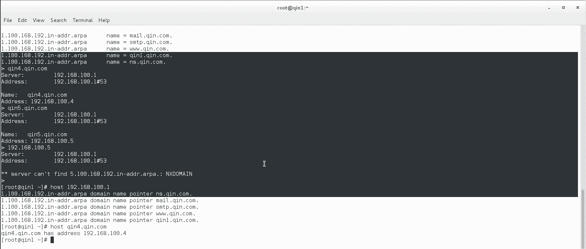
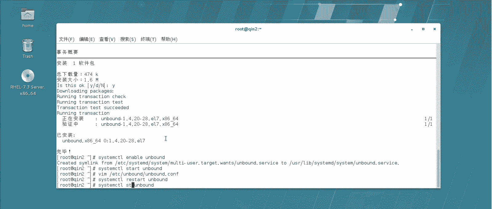

# 【云知梦】Linux实战中级篇／RHCE认证／RHEL7／CentOS7 - P12：第12集 DNS服务器(四) - 云知梦官方账号 - BV1iV411h7ia

。那么第二个实验呢，我们来做一下这个呃辅助的这种缓存DNS啊，那什么意思呢？就是说我们说在生产一线里，这台是主DNS。那么如果只有这一台这个DNS服务器来说，可能说面对企业中啊众多的这种客户端啊。

这种那他可能说压力比较大。那么我们就需要在企业中呢，就是多做几台辅助DNS啊，来帮助这台主DNS共同对外提供服务。那么现在呢我们这个谁做辅助呢？比如说我们用琴2啊，这台机器啊。

它来做辅助DNS那么怎么做呢？首先来说它它的DNS要指向这个秦一这台就是主DNS然后呢，从这顶上去获得缓存的记录啊，缓存记录之后呢，它再对别的这些windows客户端啊，就是是包括D客户端。

它再去提供服务啊，那怎么做呢？首先我们要在这台秦二这台机器上啊，作为辅助DNS也要去安装这个安棒的。

啊，也要去安装安棒的这个服务啊。嗯，然后呢把它也要配置成一台。我们也要enable它啊I bound这台啊，然后呢。给他。呃，我们就。起不起的吧，然后我们先配后期也行，然后对它也要进行一个配置啊。

配置它呢呃指向主DNS注意啊，呃如果我们想在这个主DNS和这个辅助的缓缓存这个DNS上传输某1个域的数据。比如说我们这实验里，我们要传输晴点com域的信息是吧？我们就要在这2个这个DNS里。

去打开这两个的安全传输信息啊，在哪儿呢？呃，我们去搜索里边应该会有这个叫。读麦或者说你搜这个secur insecurity应该就能。搜什么呢？搜这个insecurary。

这个啊信息我们看啊这个再往下哎，这个就这一行，我们再打开啊，你看它这有个例子，配置文件里。当时咱们说有些行是默认值，有些有用，有些没有这个就有用。

这个是我们在两个域要传主主的和这个缓存DNS我们想传输某一个域的这个信息。我们得设置说这个序这个域的信息啊，是安全的。哪个域的在咱们这实验里就是7点com域是吧？这个要打开，然后呢再重启一下咱们的的。

哎，重启一下，注意啊，安棒的重启完之后，我们说一定要看一眼它起来没有啊，一般来说只有安装完第一次启动，有的时候可能失败，你重启一下计算机就没事了。后期来说，重启一般都不会再有问题啊。

这是属于安棒的一个自己一个小bug吧。啊这样我们重启一下啊，我们再看一看。他的状态。你看没问题啊active runningning啊，就主DNS上允许呢允许什么呢？

就是说我们刚才改这条就是主主DNS上允许安全传输这个域的信息啊，你要不开启这个的话，主辅之间没法去正常传输啊。那么辅的这个DNS上，首先我们说。也要打开这个哈，包括它那个DNS服务器普遍的这些功能。

比如说我们说得去把interface这儿啊打开是吧？对所有的外网计算机提供服务，并且呢得允许所有的这个外网计算机得能访问到它。你看啊这样。

跟那个刚才说咱们说讲那个正常DNS这几项也要去做一样的修改了lo啊，还有谁呢？啊不能说光是传他的是吧，不能限制，都传。然后呢一样我们也要去找那个因私。cure啊找到这个啊，找到他嗯，下一个啊。

这个啊也要让他之间允许他们安全的传输这个域内的这个信息，我们把它删了，改成咱们的这个琴点com。哎呦。哎，啊，这。改成琴点com啊，改成它。然后呢，这个还得再加两句。

作为这个缓冲的这个辅助DNS还要加两句什么？叫要加一个转发域。就是说你这是辅助DNS它上面并没有说我像主DNS上这样写一堆信息是吧？写很多这种就对应的正向解反向解析的信息。

那么它是要从主DNS上去获得这些记录。所以说当它没有这些记录的时候，别的机器找他来提供DNS解的记录，它要去做转发啊，那么怎么写呢？你可以搜一下这个呃。forward的信息啊，你看他这有例子。

他这有例子，你看这不就是这这这些都是关于for的这个转发信息怎么写啊。你比如说我们可能会用到这个啊，转发地址的是吧？我们就直接转发在机器吧，我们把这行打开啊，这行转发哪个域的，把我转发到哪个地址。

我们给打开啊，那么转发呢，比如说一般来说转发那个区域呢，你这得写，就是你要转发哪个域，比如你只转发勤点com域的，你就写点但是一般在生产中呢，就是说我们作为辅助DNS我们可以这么写就是如果你不明确。

你要转发谁，那你就这样所有的这个点表示所有的这个DNS解析记录啊，就是说别人找我问DNS解析记录，我顶上一条没有是吧？一条没有怎么办呢？我告诉你啊，我转发到这儿就是无条件只要找我问这个DNS解析记录。

我就转发到这台机器上去我就转发到这台机器上啊，这三句话是这个意思就是说我作一个。转发区域转发送啊，因为我这点上自己没有任何解析记录。所以说你们如果找我问任何的转发记录，比如说windows这台机器。

或者说企业中有1万多台机器找他来问这个DNS谁的解析记录，正向的反向的也好，你只要找我问我点的意思就表示任何信息啊，那么我都会转发到哪呢？转发到这台机器上，由他负责解析。然后他负责解析解析回来的记录呢。

我这点会缓存下来，缓存下来之后，我就有这条缓存了，我就可以向你提供服务了。而且下一次别人再向我问这个相同的这个转发的这个信息的话，我的缓存记录就有了，他是这个意思啊，这个辅助DNS改的比较多啊。

首先来说我们再总结一下啊，首先还是首先得等那三行啊，interface啊，这个对于所有外网的机器提供服务是吧？而且呢要允许所有外网的机器来访问我这一行啊，然后呢还有就是这个。user name啊。

这个跟普通的andmb一样。然后呢，我们多改了两行是什么呢？一个是改了。这个安全的这个啊不应该搜阻嘛，insecur应该搜这个。那么主辅之间可以去传安全的传输这个域内的信息啊，这行主的也改了这个啊。

主的我们为了传输信息也改了它。然后还有什么呢？就是。转发啊，那么这三行激活它，并且修改一下，就是说所有人向我要转发任何记录的时候，我就都转发到这台机上，让他替我去解析啊，当然他自己会把这个缓存下来啊好。

我们把它。re start一下这个un bound。重启一下这个服务啊。重启一下这个服。那么也是一样，重启完了之后，你要看一眼状态啊，尤其第一次你修改完这些安邦的这些东西之后，重启完一定看一下状态。

如果有问题，第一次可能要重启啊。好，我们看一眼状态啊。

你看果然failled了啊，就是有的时候你会碰到这种情况啊，有的时候你会碰到那没有关系，碰到这种情况怎么办？你只要设为enableable，然后呢重启一下啊，第一次重启一下计算机。

后边一般就不会出现这问题了啊。我们重启一下啊。那么这台呢就是辅助DNS应该到这儿呢，就算做完了啊。我们从启去只要它状态是正常的，就算是可以了。R hand。好，我们今天看一眼啊。😔。

你看重启完之后就正常了啊，这还正好能看着一遍这个出真正出错的情况啊，让你要一次都看不着，还不太好。我还在想着怎么不出错，这挺麻烦啊，能看着一次就行。煮的有的时候就是第一次配置完，只有第一次啊。

一般有的时候会有这种情况。你看这是正常了。那么现在呢我们呢。就把这个秦二这台机器啊秦二这台机器也变成了一台DNS服务器，它是缓存DNS但是要注意它顶上没有任何缓存记录。

它是直接把所有人家向他的要求转发到这个秦一这台机器上去啊，转发到。这台机上去啊，那怎么测试呢？这么测试。

那么我们在这个比如这台机器啊，现在这台机器指向谁呢？它指向的是。这个现在默认刚才这实验，你看100。3这个机，琴三嘛，它指的是琴一是吧？啊，那么他现在可以获得记录嘛？肯定是可以啊。

那么我们现在给他指到谁呢？指到前二上去。这样为了为了让大家看的更清楚一点啊，我首先比如说我解到琴似上去。啊，不是不是这个啊，这是网关。我们把这个DNS比如说解析到一个琴似上去啊，你看一下。

它是它是不能解析这个记录的啊，我们把它禁用一下，再启用一下，相当于就是system controltlrestar了一下这个这块网卡啊，那么我们去。来。看一下啊。我们用NSlook up啊。

我们再去解析一下。提前呢，比如说我们解析勤一点7点好。你看啊，如果你的DNS指的不对，它是不能解析的啊。那好，你看它一直太冒它啊。那么我们现在给它改成谁啊？我们把它的现在DNS服务器改到谁啊？

改到新一肯定能解析。我们改到前二啊，就是这台辅助的。我们说了生产一线中主DNS一般是不直接对外提供服务的，一般都是用这种前二啊，这种就辅助DNS啊缓存DNS啊来提供服务。

我们现在看看前二上一条解析记录没有，只能做转发的话，它能否对外提供这个服务。啊，禁用再启用。好，其用完了。那么这个时候我们在NS卢 up，我们看啊轻1点7点com。这样我们解析，我想想啊。

我们解析一个秦三点琴点com。注意啊，我只解去这一条。他现在去到秦二点这个地儿找秦三点秦点comservice failed啊，没有。Sice是 failed。啊，解析出来了啊，刚才是卡了一下。

你看呃秦3点7点com，它解析出来是什么呢？它是通过这台服务器，你看他告诉你服务器是这台1。218100。2，解析出来名称是秦3点7点com啊，同理呢我可以再拿它解析一下谁呢？比如秦4点琴点com。啊。

你看马上解析出来了，秦4点7点com啊，那么我现在在这个这台机器上解析了两条记录，一个是解析了一个秦三的信息，还解析了一个秦四的信息啊。那好，到这儿呢，我干一个什么事儿呢？我干一个这个事儿啊。

我现在把秦一这个机器。😊。

我给它关了。

把它关机啊，关机之后呢。注意啊，我把这个机上，我接着退出一次啊，我给它退出一次。我再来做点 lookup啊。我看这边关了吗？关完了啊关完了，我这边琴一主DNS现在关机了。

那我们刚才呢通过秦二解析的两个地址，一个是秦三点琴点com，一个是秦4点琴点com，对吧？分别解出来了。这俩IP正常的。现在我把主DNS关了之后呢，我再解析秦三点琴点com。你发现它是能解析的。

为什么呢？因为前二点琴点com上刚才解析过这条记录，所以说它顶上应该是有缓存的。然后呢，前四点琴点com。也是能解析的，因为他刚才也解析过是吧？但是我在解析，比如勤一点琴点com。你发现他就卡在这儿了。

出不来，为什么呢？因为现在他在让秦二去做解析的时候，我们说秦二只是一个缓缓它只是一个缓存DNS，它需要到琴一上去找那个记录，对吧？它本身没有记录，那么琴一关了，所以这个时候呢它就解析不到这个记录的。

除非是刚才琴三秦4这种它解析过的记录，它会有缓存，它没解析过的，它不会有缓存啊，同领域解析秦二点琴点com，你去看。他也是到这个机器上去找，也是找不到也是找不到啊，为什么？

因为我们刚才也没有做这个解析啊，包括什么秦5点7点CO。你只要是在秦一关机之前，你没有解析过的信息都没有，因为它缓存记录上都没有啊，但是只要你在点上解析过一次的记录，它都会有。

你看他直接就秦三和秦4这两条之前我们解析过的，直接就出来了。那什么时候会没有呢？就是咱们说的在安报的那配置文件里，我没有规定是吧？啊，它有一个周期是吧？多长时间去同步一次。

那么在再过一天这个琴二呢会再去找这个琴三去同步。当但是当然他肯定如果琴一在琴一他琴二会再去找秦一同步琴一那个时候如果还是关着，它就会怎么办呢？他就会根据咱们的规则是吧？再过一一个小时再去同步。

如果不行的话，再去同步，一直都同步到什么呢？1当时我说的是10800吧，是吧？

到那个时间还是同步不了，他就会怎么办呢？他认为大哥死了，然后呢，再过一个生命周期，把自己干掉啊，秦二也就不能再去完成这个DNS协议记录啊。但是这时间时间太长了，有兴趣的话可以底下去做一下啊。

去验证一下这个配置的东西啊。

好，那么讲到这儿呢，是咱们讲这两个这个安棒子的实验啊，主DNS和这个辅助的DNS。那安棒的这部分呢到这儿就算是讲完了。

