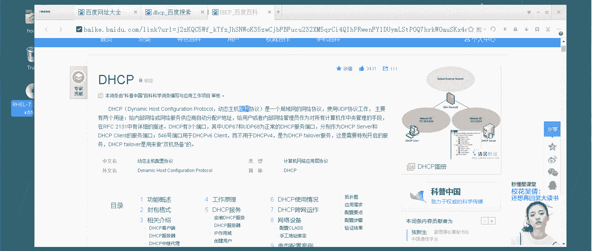

# 【云知梦】Linux实战中级篇／RHCE认证／RHEL7／CentOS7 - P13：第13集 DHCP服务器(一) - 云知梦官方账号 - BV1iV411h7ia

。

好，那么这一章呢咱们着重介绍一下这个叫DHCP服务器啊，DHCP服务器啊。首先来说呢，它也是一个在生产一线应用非常广泛的这么一个服务器啊，那它是做什么的呢？咱们先看一下它这个理论部分啊。

，DC呢它是一个缩写啊，全称叫dynamicmatic host configuration protocol啊动态的主机配置协议啊这说的比较绕嘴啊，这个咱们翻译成普通话解释一下干嘛的？

就是说咱们这个企业之中这些网络之中这些计算机啊，这些主机啊，它在配置你比如说IP啊，什么网络信息啊，这些DNS什么的时候，它一般有两种方式啊，一种方式就是咱们前面讲这种叫什么叫手动啊。

我们去通过什么 modifyify这种方式手动的包括windows咱们点鼠标是吧？右键我的电我的网络什么的网络设置这块来设置，这种是手动的啊，手动配置这些主机的这些网络信息呢呃有两个要求。

第一个你网络中计算机不能太多了，为什么呢？你像咱们这一台两台，你你手首好好配你要是成千上万台，你手动配置可是很累的啊，而且你还容易冲突是吧？张三配个100点1四不知道啊。

也自己也配给100点1，你俩还容易冲突啊，这是第一个情况。第二个情况就是说呃手动的要求这个这个配置这个人，你起码得会是吧？M可待这种命令不是每个人都会的啊。那么包括说windowswindows点鼠标。

它也不是每个人都会的公司你比如财务部什么那种老会计，你让他去自己给自己配个IP这个他可能还是有难度啊，还是有难度。所以说手动配置呢，他对于生产情况下不能满足所有的情况啊。

因为生产情况一般都主机多啊几千台上万台而且呢IP地址就要求这个配置的话，你有lin有windows，他配置很麻烦啊，所以说生产一线尽可能的我们不用手动配置。我们用什么呢？

用DCP来动态的动态的自动的方式给这些主机配置这些信息啊，包括什么IP啊DNS那个网关什么这些都能去自动的配啊，所以说这个DCP干嘛的，就是干这个他能自动的给网络。

所有的计算机去配置啊呃这些。网呃网络的IP啊，什么DNS这种信息，它就叫DNDNCB服务器。那么这个DNCB服务器它的工作原理是什么呢？那个咱们画张图吧。换张图啊，工作原理是这样的啊。

首先来说呃网络中得有DRRCP服务器啊，你比如这台啊这台我们就是这个做DRCP服务器。啊，这台服务器上呢它一般会有一个叫地址池的概念啊，就是说它能给外边这些主机不是分IP嘛，是吧？它顶上有一个池子。

这池子里比如说有100IP，比如它能分配的是这个呃1192点168点100点。30啊，到那个。130啊，这多了嗯，100个IP的话应该是从30到129是吧？啊？比如这个段啊。

到这个段这一段的IP呢就是他负责分配啊，它可以分配。那么它底还会有一个什么呢？租约时间那么比如说一天啊，它这个IP是租出去的，它是租出去的，挺有意思的啊，那么这是它这个DSRCP服务器。

那么网络中其他的计算机呢，你比如说这儿啊一台两台一堆啊，这些计算机他们呢怎么来获得这DSRCP服务器的这些信息呢？首先来说它中间走的肯定是什么呢？是UDP协议。为什么呢？不能是TCP呢？

因为您这还没IP呢？TCP要求是精准传输，你得有IP然后精准一对一点对点的这么传是吧？那么你现在没IP，你是过来管我要IP是吧？

我分给你IP我租给你IP那你肯定得走这UDP协议广播的形式那怎么样一个工作过程呢这样首先这些客户端比如这台这台过大哥大哥谁能提供这IP啊，我这DC服务器也是UDP的形式发广播。

我能提供我能提供然后这边呢也是往外找着谁能提供能提供DP的是吧？找着了找着他了找着哎大哥，你能提供是吧？

你给我分一个吧他是连接到这台DCP服务器的67号口然后呢服务器接到这请求你要是吧你要分给你一个分给这主机他是连到这个主机客户端的68号这边是67号。

这边68号号然后呢从地址池里按顺序分给他个IP第一个连过来的肯定分给他3。😊，然后以此类推啊，再过来一台分31号，32号一直分到129号啊，那么分过去，这IP呢是租的啊，租约时间是一天啊。

在这一天的时间里啊，这个都可以使用啊，那么这一天到一半的时候，到半天的时候呢，这个客户端会给这个DC服务器再发一个请求什么意思呢？他会问他说大哥大哥到半天了，但是我呢还想接着租啊，那么我接着租可以吗？

如果DCP服务器接收到这请求了，他会回一个信息说没问题，接着租吧，那么这个租约时间呢就又变成一天了啊，那么他接着租，然后到半天的时候，他又发信息，就是每到50%租约的时候，他会找DNCP服务器呢续约啊。

这是续约成功的情况，如果续约没成功是什么情况呢？他找大哥他说我要续约，我到一半了，我还想接着租没接收到之后没接收到，比如说因为网络故障，或者说这是什么原因是吧？没接收到。😊，办呢？他还能接着租。

因为他租业时间是一天啊，这才半天是吧？才50%的时间，他还能接着享用这30号VIP。但是呢他租到87。5%的时间的时候，他会再找一次。他接着回啊，大哥大哥，我还想接着租啊，如果他这时候联系到了。

那他第着CP服务器还会告诉他，那你接着租吧，他这时间又变成接着租一天啊，30号IP他这租业时间又变成租一天。如果这次还没有找到这服务器怎么办呢？他还能接着租，因为还没到期呢，还没到一天。但是呢注意啊。

它在到期一天的时候，他真的就不能租了。他会把这个IP释放回来。就是他这IP就释放回来了。然后呢，他呢他的IP就变成什么呢？租不到IP租不到IP会变成什么呢？会变成这个169点。254段的1个IP啊。

一会儿我们可以看时间现象啊，会变成这个啊，这是他租不到和租不到的情况。就是说他在50%的时候发一次请求，87。5%的时候再发一次请求。如果能联系到服务器服务器接着租给他这IP他的租业时间会更新为一天。

如果租不到，那他到一天的时候，必须把这IP释放出来啊，这是一台服务器过来。那么别的服务器呢，别别的一台这个客户端啊，别的客户端也是用这种方式这么来租啊，一次往后30号31号注意，如果一直租到129号。

那么再有一台计算机。比如说这129台啊，129号就租完了，再有一台过来租的时候，恰好地址池里一个IP都没了，怎么办呢？它也将只能获得169。

点254那个网段的1个IP啊，就是注意啊，就是他这是有地址池，这是有限制的啊。如果说他前面有别人还回来了，那他能接着再租那个去啊，如果的确一个都没有了，他也获不到JIP他会就是只要是获不得不到IP的。

他就会获得1个169。254段的这么1个IP啊，那么这是第CP服务器这个呃整体的工作原理啊，那么默认的呢是从这地址池里啊，是按顺序一个一个往后这么租啊，然后呢，也可以怎么着呢？固定的，你手动的写。

比如说我这比如说我公司有个老板啊，我公司老板就希望让他一直租到这个88号啊，可以吗？可以，他可以跟这个mark地址绑定。那比如说这是这是那boss。这是boss那台电脑啊。

那么这个88号IP不会租给其他任何人了，只会租给老板。老板在的时候，他只要连过来，他就直接把这个IP拿走了，直接把这IP拿走了啊，不在的时候，别人也租不到，他跟m地址绑定啊。

每次别的这些客户端过来租IP的时候都会有一个记录啊，记在它的一个缓缓缓冲缓存池里啊，那么这个池子里都是按m地址绑定的啊，那么这不又有什么好处呢？就是说如果说你下一次比如这台机器。

你第一次你租的是30号啊，1928点100点30啊，那么呃回头你示范完了，你再来找我租的时候呢，我会在这个这个列表里查一下哦，之前你有这个租用记录是吧？30号租给你了。

如果我发现现在我这池子里30号的IP没有租给别人，那优先把30号还租给你啊，优先还租给你所以有时候你在企业里发现你说哎我是自动获得IP的，但是每次分给我的都是那一个固定的，为什么呢？就是说你那个缓。

缓冲那个缓存池里有你这个30号IP，你这和你mark克绑定的记录，所以他默认的每次只要是别人没租啊，自动的就租给你，还是这号啊，这是他整个这个DJCP工作的一个原理啊，那么讲完原理之后该干嘛呢？

咱们再做几个实验哈，还是说那句话就是不能光说不练啊，咱们主要还得靠这个最后把这东西弄出来，是吧？😊。

那么第一个这个简单的实验，咱们作为什么呢？嗯，咱们去首先来说咱们装一个啊。

装1个DACCP啊，装一个啊这个服务呢就是DSCP这包也是DSRCP这包啊，装一下这个服务。那么秦音这个机器上装完了之后，我就把它作为一1个DACCP的主服务器啊，注意一下啊，DACCP的主服务器。

建议您就手动配了。你说你这主服务器啊还来回变，这玩意儿就有点不靠谱了啊，就是这种很重要的服务器，最好把它IP给它固定下来啊，这个是静态IP19216810。1，我在点上装DRCP了。所以咱们ctl啊。

enableDRCP。注意啊，它的首部进程叫DACPD啊，把这个也A爆了。然后呢。启动，但是你发现你启动是有问题，为什么有问题啊？是因为我这么说吧，它这个配置文件是有极强的书写要求。

如果中间错一点就起不来啊，那么我们现在看一下它的配置文件啊，你肯定说肯定是DCP下是吧咱们都讲几个了都熟了，注意啊DC你打到这你看啊，它有一个DCPD点c还有一个DCP6点c啊。

六呢是专门负责给D那个IPV6负责分配的啊，咱们现在来说六了多少年了，也没溜过去还是用IPV4啊，好，咱们再配这个你看啊这配置文件写的就很简单了。

这可能是说咱们说见到它最简单的一个配置文件里边全是注释4这几行啊，他说什么呢？他说你如果想知道这个配置文件怎么配啊，看这个地儿C这啊，这个文件里就存着它一些配置的方法，以及你可以看什么呢？

DCPD点5啊漫5它。咱们先看看这个吧。这个慢。DRCPD点这里边就有一些DCP这个怎么配这些规则啊，怎么配这些规则。但是一般情况下呢，咱们还真不愿意用它，一般我还真愿意用谁用这个啊。

你就直接打开这文件就完了。你注意它这是个星，为什么是星呢，这块实际上是个版本号啊，你直接VIM这你就带着星啊，也能打开也能打开，实际上这是什么呢？我把这删你到这看看啊，它这是一个版本号。

现在用的是这个4。25版啊，你把它替换成它是一样的。后边你还跟这个DRCPD点c点simple啊点 example，它是这个配配置的示力文件啊，这个其实就是它一个视例文件啊，它DRCP是用这种方式啊。

那么怎么配置DCP服务器呢。它里边都有一些给你写好的这些一段一段的，你可以直接拿它用。你比如说这个snet啊，这个就是一段DCP配置的规则。我说了它可以分IP，可以分DNS可以分网关。

那你这个要想分的话，你最好就找一段是比较长的，找一段比较长的你像这个这是只分配的一个地址池的这个段这个呢有一个广播。

然后分配个有路由的什么这个你找一段最长的最长的这段就这段第三段就最长snet你把这一段啊复制下来啊，这一段你看它连这个呃域名啊，什么域啊什么网关啊什么这个广播啊什么这些都有啊，DNS什么服务器。

这些都有。那你就把这段复制下来，这段就是它写好的一个很好的这个实例啊，你把现在原来那些给它删了删了以后呢，把你刚才写的这段。😊。

你粘进去啊，然后呢改不改不就行啊，注意底下有一空格啊，空行怎么改呢？第一行子网就是你要分配这个整个网段，你比如说我要给底下以后这些主机分配的话，嗯，这个网段是谁啊？这个网段是192。168。100段啊。

我因为我自己是100。1嘛，所以我分配配IP我就分配这个段啊，子网呃分配这个段的网关呢3-255最后一位是0。我分配这个网段啊，然后这大括号框起来就是里边这些主机过来的，你要分配的信息啊。

我给这个子网这个网段的这些主机连过来的主机分配IP呢分配。首先第一个range是池范围嘛，是吧？就是我这地址池192点168点100点，比如说我从30号啊分配到什么呢？😊，分配到192。

168点100点，比如60吧啊，我这地址值稍微少一点。就能分配这么几个IP啊，30号到60号这IP啊，这是应该是31个IP啊。然后呢底下这个do漫name server，就是我的DNS服务器啊。

这不DNS嘛，前面咱们都讲过啊，DNS服务器它直接给他域名啊，这块其实建议直接写IP要不然你还得找那域名去解析去是吧？我这DNS服务器比如1。18。100点1啊，就让他去这解析啊。

但然我现在其义上没加DNS啊。😊，然后呢呃默认的这个域名读 my name啊，域名，你比如说是起点com域。然后呢呃ros这是网关是吧？路由网关也是指到100。1啊，这边呢。广播一般广播就是这个网段的。

最后1个255这个IP啊最后1个IP这是广播地址。那么默认的这个租约时间，注意啊，这两个值这是一半的时间。呃，就是说多长时间过来给你发这个再次请求信息的。一般我们设为它的一半啊，比如说。呃。

3600秒3600秒是多少是这个一个小时。然后呢，最大租约时间呢是这个7200秒2个小时啊，但是生产一线你可以设的再大点啊，你可以设成一天或者说两天都可以啊，一天的话不就是86400是吧？

然后一半的时间，你看着写啊，默认的这个租约时间，一般到这时间呢，还有一个最大租约时间。那到这时间必须得归还了。这最大的这个是必须归还时间啊，这个默认时间到这时间会给你发个请求一半的嘛是吧？

这是一个子网信息，到这就算配置完了，保存退出，然后呢，你再去re一下这个CP。D这个紧张，你看这回重启就没问题，直接重启就没给你报错。你可以看一眼st。状态正常啊，active running是吧？

active running可以了。那么底下这些客户端，你怎么去判断它能不能来分配分配到这IP呢？

你比如说我有一个客户端是钱二啊，那前二现在是有IP的啊，他前2IP现在咱们写的是100。2是吧？那让它自动获取IP啊，你得让它自动获取IP怎么让自动获取呢？😊，嗯。

把这个改成这个automatic autoto就行了。那现在是这个手动怎么办呢？我建议你啊不要直接那么改，因为直接改，有时候会失败，你最好把这个配置文件给它直接删了啊，直接删了，然后重建。

Atype以太，然后呢。以太网，然后抗内幕。ENS33是吧if nameENS33，然后呢呃然后呢再给他配这个IPV4的这个mes的规则，这会改成auto啊，然后呢conn点autocon yes啊。

你现在看这个还是你看直接都过来了，30直接分过来了。按说应该怎么着呢？应该这个con当一下是吧？再up一下，结果他这直接配置文件直接就生效了啊，没用我up再当。按说应该再做一下，如果没成功。

你就up再 down一下。你看 down了，再up一下，你看它直接30分过来了，这回就是自动分过来的啊，自动分过来的啊，包括这个windows客户端也可以啊，windows客户端我这禁用了啊。

禁用我改一下，你看默认是手动的嘛，我给它改成这个自动的啊，改成这种自动分配的，自动的，然后呢禁用了再启用啊，启用。😊。

它原来是100。3嘛，启用完了之后，你看啊。

31啊，它是从这个地址池里自动的一个1个IP分过来的，一个一个分过来的。DC。点好。注意他书写极其严格啊，你中间稍微写点错的东西。你再重启。嗯。Re started。你看现没有？稍微错一点儿。

他就不让你重启了。这就是为什么你刚配完那会儿我重启，他给你报错，就是这意思，他对书写的要求极为严格啊极为严格，你只要配错一点儿。他就给你报错了啊，但是你只要配对了，它马上你看又正常了啊，又正常了。好。

这是咱们讲这个DACRCP这些信息啊。

