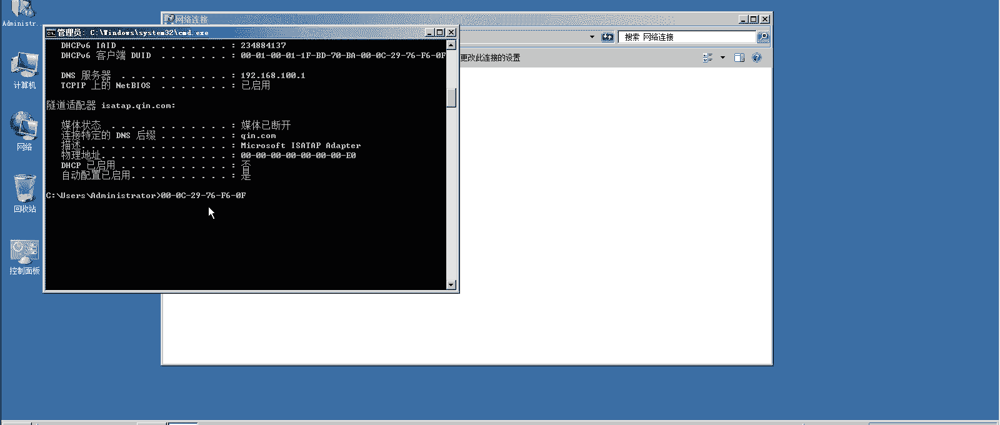

# 【云知梦】Linux实战中级篇／RHCE认证／RHEL7／CentOS7 - P14：第14集 DHCP服务器(二) - 云知梦官方账号 - BV1iV411h7ia

。那么DACRCP这些分出去的IP信息一般会存在哪呢？存在这个底下啊，word下lab下啊，它的数据文件吧，就相当于你看啊这底下有这这么这么多这个文件啊，这是DACRCP6的啊。

当然咱们没分这两个是关于这DRCP的啊，这个实际是备份啊，一般就是这个文件啊，DRCPD点。啊，less这个文件它里边存的就是咱们这些分配主机的信息啊，这些信息。你比如说你看不是分了1个30131嘛啊。

30号分给谁了呢？呃，分给这个主机了啊，它的mark地址啊，它一般是靠这个硬件mark地址来识别的啊，分配的这个信息啊，包括31号分给谁了是吧？mark地址。它是一个windows的是吧，一个主机啊。

那么下次如果在这几个主机过来来分这IP的话，它会优先的从这里边查这个记录，然后把这个IP还是分给他啊，这是它的这些数据文件一般存在这儿啊。那么呃我们说了说它这个现在是自动的按照这个顺序。

从上往下就这么去分。呃，他每次是随机的，当然他有那个缓存文件可以去，就是下次保证它分的就。如果没租出去的话，还分这个。但是如果是被租出去的呢，你比如说32IP现在是分给前二了是吧？

那如果说又有一个机器过来，他把这前二台IP给占了。那前二再上来可能这IP就分不到了。那这个时候在生产一线，有的时候是不行的，为什么呢？比如说前二这台主机啊，是个非常重要的服务器啊。

咱们前面说举例子说是boss是吧？说企业中boss，我们应该分给他88IP，这是一个要求，这当然是开玩笑的但是有些时候你有些服务器的话，你比如说前二这机器比如是其中一台外部服务器啊。

那他可能说呃当然如果它真是外部服务器，我建议你手动配啊，当然就举一个例子，就比如说它是一台比较重要的服务器。它的IP来回变不太好的话，我们也可以通过DJCP服务器给它固定下来，就是永远分给它固定的IP。

这也是可以的那么。通过什么来固定呢？就是通过它这个mark地址啊，这个mark地址来给它固定啊，这是000C什么这个啊，那么把这个记录写在咱们的主配置文件里啊，写在其一这个主主配置文件里怎么写呢？

还是参考这个这个这个它这个参考这个值啊，就是我们还是说参考这个文件啊，这个example文件，它里边也有这种写法，叫什么呢？叫host看吧？叫host的这个你就直接找这段就行啊，它可以给你固定下来。

把这个给你固定下来，这找哪段都行啊，找哪段就行，就找这段吧。这几行这一段是固定一个主机的啊，你比如说我在这哦下插一行啊，可以再来一行啊。我比如说我固定谁呢？我固定两台啊，我固定哪两台呢，我固定一台琴二。

这是linux，再固定一台windows的啊，这样你就健全了啊，这台注意啊，你house这个值，这个值是定义的它的名字，这名字可以随便写，但是最好不要重，你比如说这台我定义是前二啊。

但是你不一定非得定义跟那主机名一样。比如说比如叫前二test啊，可以随便起。呃，这台叫什么呢？叫秦。windows啊新windows是吧啊，那这个mac地址怎么取呢？这个linux这好说。

这直接这这就能看if confi这直接能查，或者呢官方肯定是推荐用M collectcon它 show是吧？inS33啊？当然你最好这块是用 deviceice show啊，用dise show设备嘛。

直接看这硬件设备，你可以从中看到这个这个设备的这个markac地址是吧？你把它呢就改在这儿。你比如说这个机器啊。这个机器谁呢？他啊我希望他的IP地址。fix这直接写IP地址192点198点100点。

比如88。啊有同学说老师，你这88，你地址池里可不包括这个IP啊，可以抄啊，你不一定只只限制在这地址池里啊，前面只是定义的自动分配地址池。你这个IP可以在这个范围里，也可以不在可以啊。

然后底下这些windows IPP呢，呃windows IP怎么取呢？这么取啊，这儿啊这不是0822这机器吗？你直接看状态，这里边取啊呃也可以取啊，但是你需要手写啊，什么000C。

而且你注意windows是用横盖，你看linux都是用冒号分割，windows一般是用横杠啊，也可以怎么取呢？😊，windows也有类似这种命令行工具啊，你可以用什么呢？它不叫if confi啊。

你要这么敲。衣服扛fi它没有，它叫IP扛fi。啊，而且注意呢艾比卡fi呢，你最好你看这么取是没有呢，你加一个斜杠2，加一个参数2，就都出来了，它也会把你所有的网卡。

包括这些什么连mark地址都给你取出来。这个值怎么取呢？你直接这样是不行的，右键标记，这个时候就可以选取了啊，选取windows是这么着，就算是选上了，然后怎么粘贴呢？用这个。右键粘贴这么来粘贴啊。

就把它选取上粘贴过来啊，咱们这点上咱们直接哎中间粘贴linux是中间粘贴啊，注意你要把它改成这个linux识别的这种，就是用冒号来分割的这种方式，要改一下windows主机你得这么改一下啊。

这个IP你比如说。

我给它改成什么呢？192。168点，比如说100点，比如说改成1个呃188吧啊，这台可能嗯这俩这俩号都不错啊，这俩号都不错，保存退出。然后呢再把这个服务我们重启一下DVCBD啊。好，重启完了之后呢。

注意。你现在IP还是30，为什么呢？你得租约到期了，它重新分配的时候才能过来。你这边虽然生效了啊，你得重新分配的时候才能生效，但是咱们就不等了，强制让它怎么着呢？重新分配。荡一下这个配置文件。

然后呢再up，你强制这么荡了，再up一下，它会再去找DNCP分配一下啊，你看很快分配过来了。100点88啊，分过来了啊，这台也是一样，你默认的它肯定没变过来啊，它还是用31。

他得租约到期了才会或者到50%的才才从那边续租的啊。那么现在租约没到期怎么办？我强制强制我给你断开，再重启啊，启动。你看他IP变不变。是吧分过来了188号啊。

用这种方式呢就可以就是说不是自动的去随机分配了啊，它是自动的固定分配你的IP地址啊，分过来分配过来，这信息都是固定的啊，这些信息都是固定的啊。好，这是咱们说这个怎么去通过它这个DSCP我们固定的啊。

跟一个mark地址绑定，让它固定的分配这个信息啊，固定的分配。那么以及呢我们还可以在做什么呢？就是说我们还可以做类似DHCB中继啊，这是什么怎么理解呢？其实你可以这么想，就是我们做什么呢？

就是比如说网络中啊，我画张图吧。我画张图嗯，把这删了啊，网络中有这么一种情况。什么情况呢？呃，我们想是这样。这个D是C比服务器啊。😡，在这儿我们还是DACCB。这台DSCB服务器。那么在网络中呢。

可能说我们有很多网段啊，不是说只有16192168100多的IP是吧？比如说这些客户端。这些客户端它呢是1卷168100段的啊，我这儿还有一堆这个主机，这些我想让他分什么172段的。

可以通过一台DRCP分吗？可以啊，当然您可以再架一DRCP服务器是吧，也可以啊。这个是没问题的。当然如果你只有一台DRCP服务器能实现嘛，也可以，怎么做呢？那你既然是这样的话。

肯定是他们肯定是连接到两台交换机上。两台交换机上啊，这是24口的，这可能也是个24口的啊，这块属于网络支持啊，他们都是连在它上的啊，他们都是连在这个交换机上的。那么这些呢肯定都是连在这台交换机上的是吧？

啊，那么这个交换机连接过来，这个也间过连接过来，注意啊，它连接的应该是两个不同的网卡，两个不同网卡，那么这个网卡上，我们配的IP比如说还是这个192168。100。0段的。杠24啊，这个段。哎呀。

我把这稍微动一动。这个我看这怎么选举的。哎呀呵这还不好选。这个哦。这样我重新写一下啊。这个IP比如说192198点100。0段啊，那么这个网卡。我比如说我分的是172点16点100。0。也个24吧。

你让他杠24吧啊，你就区分一下哈。那么这两个交换机不同，我就可以在这个DSCB服务器设置什么呢？设置两个subbernet啊，subbernet一和subbernet2啊。

两个不同的subbernet这个subnet上对应的就是192的啊，那么这个subernet呢？对应的就是172的啊，这两个网段在DSRCP服务器站可以设置这两个网段。

那么它就可以实现给两个两个这个网络中的环境，这些主机设置不同的这种DRRCP的足域IP啊，那么连到这台主机，连到这个网卡上的这些主机呢？分的就是192段的IP连到这个网卡上的这些主机呢。

分的就是172段的啊，这是咱们讲啊，它可以分两段。那怎么来做这实验呢。这么做啊，首先来说呢呃我这有两台主机啊，我这有两台主机。那么呢我这有一台DSCP服务器啊，我怎么做这实验呢？

我首先来说这只有一个网卡肯定是不行啊，我要分出来2块网卡，我再给它添一块网卡吧啊，虚拟机设置。😊，我在这呢添加一块这个网络识别器啊，这块我把这个网络识别器呢为了表示它是两台交换机啊。

咱们这个虚拟机怎么模拟两台交换机呢？嗯，我这只有Vnet一什么的是吧？这样我先取消它啊，我专门设一网络出来。注意啊，这是咱们第一次讲怎么去设一个定义交换机，虚拟网络编辑器。

这儿啊你看啊它默认是一是这个主机模式，零是桥接，八是这个NAP模式啊，你去给它添加一个网络，添加一个网络其实就是添加一个交换机，添加一个新的网络环境，叫微n2啊添加。

那么这个微n2呢就跟微n一是两个不同的交换机啊，这是连接在两台不同的交换机上啊。这微n2呢我注意啊，你这个DCP实验正好讲到这我说一下啊，你注意啊，如果你做DCP实验，你一定在交换机里啊。

你如果是主机模式前面做你把这个勾勾了，默认这个勾是打开的，就使用本地DCP分配虚拟机啊，你一定把这个勾勾了，为什么呢？这个本地的DCP啊，它这个虚拟机自己提供1DCP它会给外边分开IP的啊。

前面如果你做实验有的失败了，可能是这个原因，有可能是这个原因啊，你注意一定把这个勾勾了它啊，微n2我们造了一个，然后把这个给它勾了，微n2也是一个主机模式啊，也是一个主机模式确定。

那这样呢我们就造出了另一个主机模式啊，连接在不同的交换机上。注意啊，这两个是不同的交换机。所以这两个机器连着网络呢，回头呢我们可以拼一下，它俩是不应该是拼不通的啊。

那么这个时候我们再来去添加一个网卡设置啊，在这个里边我们添加。添加一个网络识别器，把它注意啊，这回是连在这个Vn2，它也是主机模式啊，但是它是另一个主机模式，另一个网络环境的主机模式啊。

好，启动。我们就又添了一块网卡啊。

Im collect device show。我们看一下。呃，练了一个叫ENS37的这么一个硬件设备啊，它的mark地址是这个啊。conect show我们看一下没有是吧？没有，我们添一下。

conect aid type de是吧？嗯，看 name。我们就用这个ENS37吧，if name也是它。37，然后呢，IPV4点m。啊，主服务器上我们都用manu啊，172。16点100。

1-24啊。我们把它这块网卡设成这个IP啊。然后呢，IPV4点儿。后边其实不用设了设AIP得了，然后呢connect。嗯，啊没点，这是写错了什么呀？menuIPV4点and rise注意啊。

得这么着才能推播出来的啊。然后呢。Connect。点 auto connect。啊。最好是。荡一下，然后再up一下。我们看一下啊，37的IP也出来了，17216100。1啊。那么一会儿呢。

咱们怎么做这实验，这么做。首先啊我把这个这台机器啊，这台不是那个windows这台主机嘛？我把它的网网络改一下，我把它网络改成什么呢？改成连接到。Vn2这个网络上。注意啊，我现在没改之前。

我拼一下是能拼通的。因为我们现在连的是同一台交换机嘛，我现在还没改呢啊。192。168点100点，这是多少？这是88是吧，那前二那主机。

哎，88啊。28现在是能并通的，为什么？因为它俩现在是连到同一台交换机上，而且又是同一个网段，所以肯定能通是吧？那现在如果我把这网络识别器，我把它默认呢，它是主机模式。

默认主机模式实际上就是微net1啊，那么我给它改到微n2上了。改改完了啊，我再去拼一下100点88，你发现不通了，为什么不通了？就是我说的，它俩现在是分属于两个不同的交换机啊，这个交换机叫什么呢？

叫Vnet。

一啊这个交换机叫Vnet2啊，微net2啊，这个一定注意一下，咱们是第一次添不同的两个网段啊，这个一定倒回去重新再看一遍怎么去添的啊。然后我现在把这个机器啊。

这台windows这个主机我搁在Vnet2这个网卡上了。

那好，那么现在呢它呢就拼不通原来Vnet一的那台主机了啊，那你注意啊，这IP现在还有啊，你可以给它禁用了再重启一下。禁用启用。我们看一下啊。状态。你看他这回分不着IP了，为什么？就是因为我这个里边啊。

DCP。你看见没有？我是给这个子网来分的，我给这个子网可以分这些IP是吧？然后呢，这绑定这么分。但是现在呢。我现在这个。这块网卡不是这个网段的，所以它分不出来，它找不到这个网段的信息啊，在我配置文件里。

你看现没有？只写了这个网段的信息，所以他现在能找着这些东西是吧？现在呢他找不着。正好咱们可以看一个什么呢？如果他找不着。你看如果他从DRRCB上找不着信息。DRRCB没法获取IP他就会获得1个169。

254的网段，这个网段的1个IP是吧？正好咱们前面理论讲过这个就是说他租不着怎么办，租不着，他也不能闲着是吧？他能收着这么1个IP啊，169。254段的这么IP啊。那现在他要想收着怎么办呢？

他得去连接谁呢？就是这个机器上它对应网卡那个段的IP就是说ENS37这个网卡啊，它这个段的咱们得写一段配置文件是吧？写什么呢？你还写这么一段subnet就行啊，然后呢。咱别用这个。

这是1234567899行是吧，那就是9YY。到这儿我P一下啊，然后呢。那小插一下啊，这得改吧改吧。这个子网是什么呢？这是17216段的。172。16段的是吧，指网源码也是3-25啊。然后呢。

我希望他分的IP呢是172。16。100点30到。172点16。10点60，这样咱别3060的了。让他分这个。90。到什么呢？到95就行啊，少分几个吧。这个的DNS我让他指到172。16点。

100点1上啊，也是轻点康病，这没事儿啊。然后呢，这个。路由网关指到这儿，然后呢，广播地址是广播这个地址。然后呢，租约时间还这么多吧。好了。哎呀。重启一下服务啊，然后这个时候呢。呃。我先把它禁了啊。

不太进了，再重新启动一下啊，再把这网络重新启动一下，我们来看一下。状态。172。16。100。90，这回它能分着啊，能分着了啊，能分成谁的呢？就是这个IP段。给他分的啊。这个IP段给他分的啊。

这个这个子网给他分的17216段的这个信息啊，它能分到这个信息啊，有同学说老师，那底下这个怎么不生效啊，因为什么呢？因为它这个网段就不一样啊，因为它这个机器连的网卡，那个网段是17216。100段的。

所以它呢跟这个是有冲突的，这个时候它只能遵循这个信息啊，遵循这个信息从这分析90出来。你要是把底下这个也改成一个段，肯定还是这个生效，你可以看一下啊，你说我如果把这个段，我再改了。

我改成172点16点100点188。我再重启一下这第个CP。J用。再启用啊，我再去看一眼。状态。OK他又生效了啊，就是这个意思，他俩这个规则呀，他得看他哪个规则能允许能生效啊。你现在这样的话。

就是他肯定是这个100点188生效，为什么呢？因还是那句话。我配置文件里，我把它改成1签二段的啊，因为这个windows主机连的是Vnet2那个段啊，那个段儿。那么这个机器里呢。

ENS37是连的那个Vn2那个交换机是吧？所以它必须得是1个172段的，它原来一读这配置文件，原来这写的是192段的，这个就不生效了。那就是默认这段他找着匹配的就生效啊，它是这个意思啊。

最后这个实验呢稍微有一点麻烦啊，如果你觉得费劲的话，你可以先不做这个实验。等到说呃后边网络知识，你再补一补再去做这实验啊，最后这实验就是怎么去呃不同交换机。

我们分配不同网段的这个让它获取IP的这个啊那这是讲了讲这个。

这个技术那讲到这儿呢，DNCP这个差不多了。