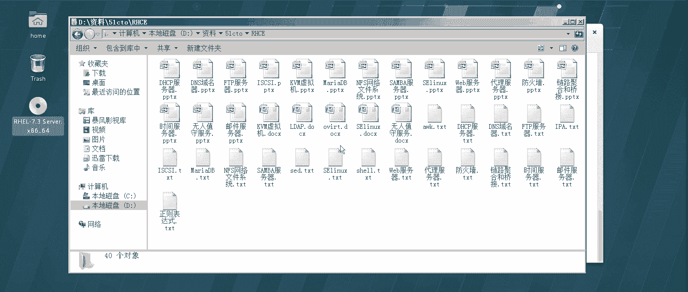
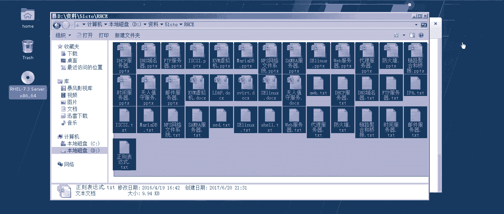
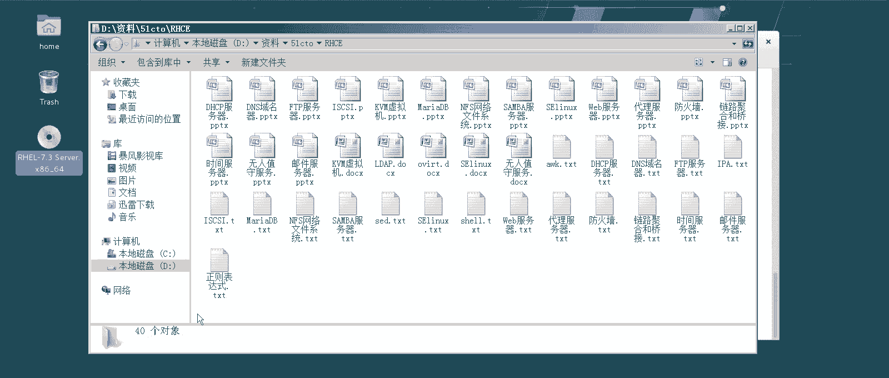
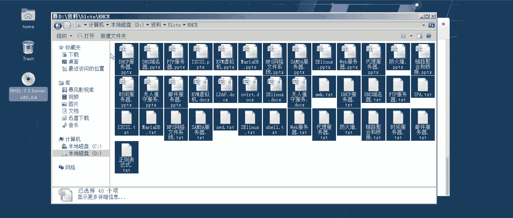
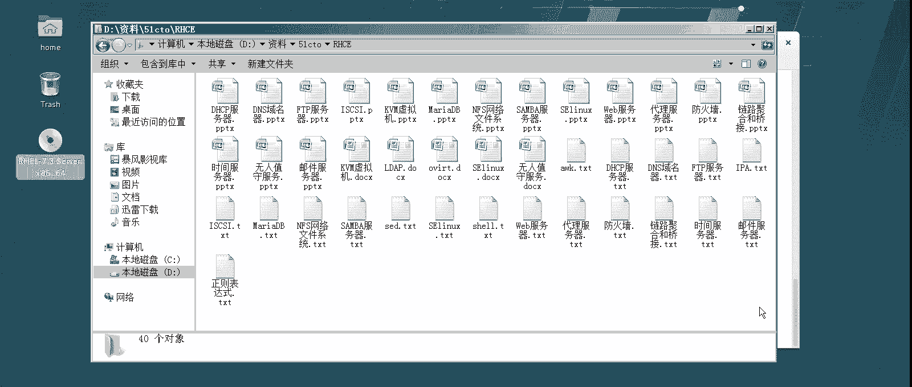
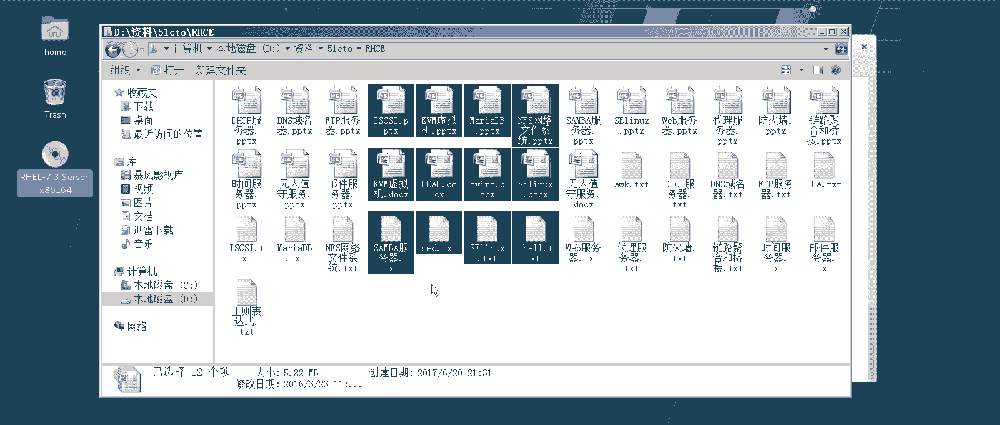
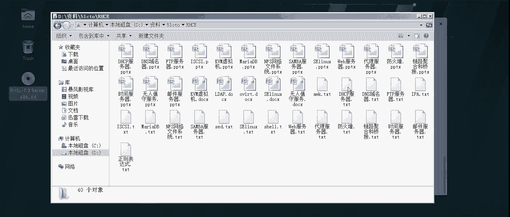
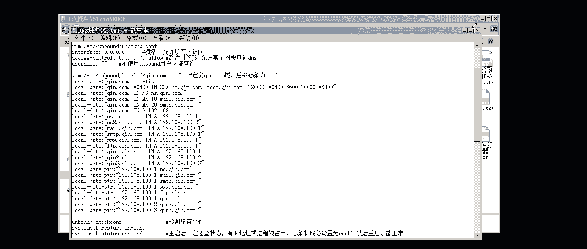
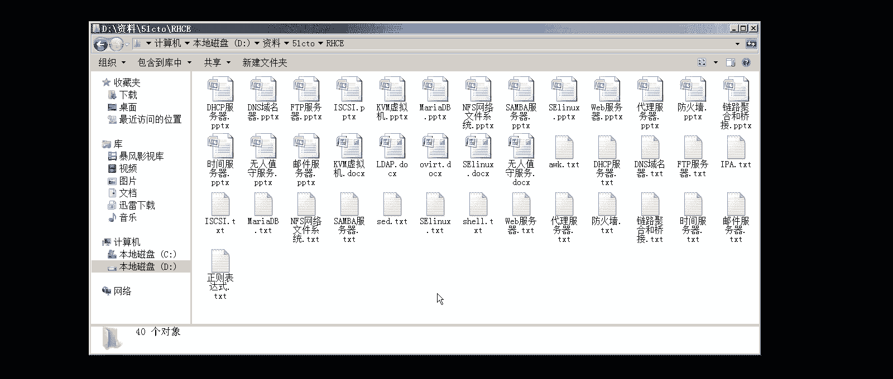

# 【云知梦】Linux实战中级篇／RHCE认证／RHEL7／CentOS7 - P1：第1集 中级课程准备工作(一) - 云知梦官方账号 - BV1iV411h7ia

。

好，那么从今天开始呢，咱们就正式进入这个中级课程的学习啊。经过前一段时间，咱们对这个初级课程的学习啊，大家应该是对这个红帽期操作系统啊整体的这个操作呀，包括一些知识点啊，有一些了解了啊，那么初级课程呢。

咱们当然说了，咱们说它是以这个呃红贸官方RCSA课程啊，为这个大纲啊，当然咱们适当的加入了一些这个呃生产一线经常见到的一些项目，还有一些实验啊，咱们主要是以实验为导向的嘛，是吧？啊。

这种课程咱们进行讲解。呃，到了中级课程呢，咱们说中极课程讲什么呀？我们首先来看一下啊，中级课程啊，中级课程呢是按照这个呃也是红帽官方啊R是CE的这个课程大纲为导向啊，当然有同学一看就是说哎不对。

说这个你要是考过CE一看说哎这这好像比CE那东西多得多啊，说这个呢怎么说呢？还是这句话就是说中级课程啊，咱们是按照这个为大纲，但是跟初级课程一样，咱们也是要加强加深的一些课程啊。

那么生产一线常用的课程其实好多用的最多的其实就涉及就是CE的课程啊，以前有人说说这个中级课程啊，包括说这个红帽官方那个CE课程说哎CE课程不就是讲服务器的嘛，是吧？这句话也对也不对啊，怎么说呢？

就的确服务器呢在中级课程里占一半吧啊得占一半，的确是个重头啊，你看咱们要讲什么DNS服务器啊，什么FDP服务器啊啊，什么这个DRCB服务器啊啊桑班啊什么这个包括外边服务器很多啊。

代服务器啊，像这个官方考试的没有啊，CE里边没有这个，但是咱们这些服务器呢是的确占的这个比重很大，它得占一半啊。但是实际上来说，终极课程啊更强调什么呢？

它是强调的你企业生产一线见到的一些很真实的一些场景性的东西。你比如说它还有一大部分内容讲什么呢？讲你比如说除了服务器以外啊，安全的东西啊，你比如防护墙怎么回事？它怎么去设置一些安全的东西啊。

怎么通过代理啊，你去设置一些安全的策略啊，那么这些安全的东西还会融合在每一张的服务器里几乎都涉及到一些安全啊，包括还有什么呢？一些存储的概念啊，你看class这种存储啊，包括说NFS这也是一种存储啊。

包括还有什么呢？还有一些数据库啊，到了这个红帽7以后呢，官方啊对于这个数据库的这个课程要求啊，呃有比六来说加深了啊，以前这个像红帽5和6那。😊，会的这个CE考试那会儿都没有数据库的题啊，到了期开始啊。

有了啊，而且还不止一道啊，也就是说红帽可能官方他越来越多的，他感觉到什么？就是说你这个玩服务器啊，跟数据库分不开啊，他最后来说很多的这个应用场景都要有数据库。所以说它到期以后，对于数据库啊。

它加加加加强了一下课程啊，包括还有什么呢？还有一些就是综合的应用啊，包括你比如讲网络啊，它也是加深啊，也就是说它除了比这初级课程，有的同学说老师我初级课程，我可能学的呃一般啊，因为时间也比较短是吧？

课时量也不是特别大啊，咱们就是说学完了可能呃上手敲过一遍两遍的是吧，直接到中级课程说能跟上么？应该问题不大，因为很多这个中级课程，说白了它还会用到那个初级课程的很多知识点。

也就是说实际上你在学中级课程的过程中呢，你对初级课程会有一个二次提升。啊，会有一个二次提生，他可以把很多在初级课程里，咱们有的没有讲的特别深入的地儿给你补上啊。你比如网络那张啊。

有有同学说老师就是有些初级课程章节，我发现那个笔记啊，咱们这个初级课程不是也配笔记吗？说有的笔记啊有的章节最后一个实验或者俩实验的，我发现课程上没讲，为什么没讲呢？就是考虑到说毕竟是初级课程啊。

怕你这个接受度啊有困难啊，所以说咱们搁在笔记里了，但是呢呃不做强行要求，像那部分内容到了中级课程那肯定要加进去肯定要加进去啊。那么中级课程实际上来说就是CE啊，有人说说红包这认证嘛，不是CSAECA嘛。

含金量最高的，实际上是CE也就是所谓的个中级课程。

当然我为什么不叫CE叫中级课程啊？就是因为的确这个课程内容啊，包括课程量比这个普通官方这个CE内容要多一些啊，要多一些啊。那好，这是大概的做一个介绍啊，这个课程。包括这个笔记啊呃中级课程有些东西。

这个笔记量啊比这个初级课程也要多啊。你比如说你这个什么数据库的这种章，你一看这笔记这随便拿出来一张啊，中级课程这一张可能都要比初级课程那个实验量要大啊。

因为它更强调的就是在一线的这个就是解决问题的能力啊，所以说这个中级课程相对来说初级课程来说可能更辛苦更辛苦。就是说你要是说这个手底下懒，你可能学这个中级课程就费劲了啊。

因为它这个实验量相对来说比较大了啊，但是其实难度相对来说啊，呃，你可能会觉得反而比初级课程还简单。为什么呢？就是说因为你初级课程那会你对于lin整个这个红包这操作系统你不熟啊，所以很多知识点都很新的啊。

那个时候你刚入门的时候，你觉得那些东西哎呦都没见过，你可能觉得反而觉得困难。到了中级课程，你反而会觉得哎呦这个还好一点啊，能接受了，就是没那么别扭。

啊，没那么难受啊，而且到中级课程，我这个笔记啊做的也比这个初级课程呃要细致要细致。所以说你可能感觉稍微要舒服很多啊，其实到了到高级课程啊，到CA的课程啊，你可能觉得更容易了。为什么呢？

那里边好多都不用敲这些东西了啊，都敲都不用敲了，这里边还有好多命令，还有很多这配置文件参数什么要改到高级课程，你发现好多是点鼠标的，都有图形化界面啊，好，就是咱们啰多多啰嗦两句啊，介绍介绍这个课程啊。

呃不要觉得太费劲啊，技术这东西就这样，你只要吃过这一遍苦，你能享服他一辈子啊，你能享用它一辈子啊。

