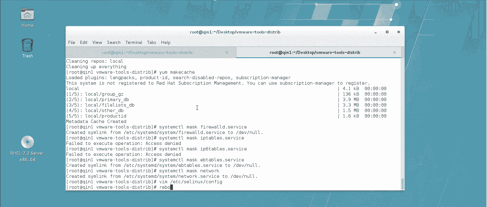
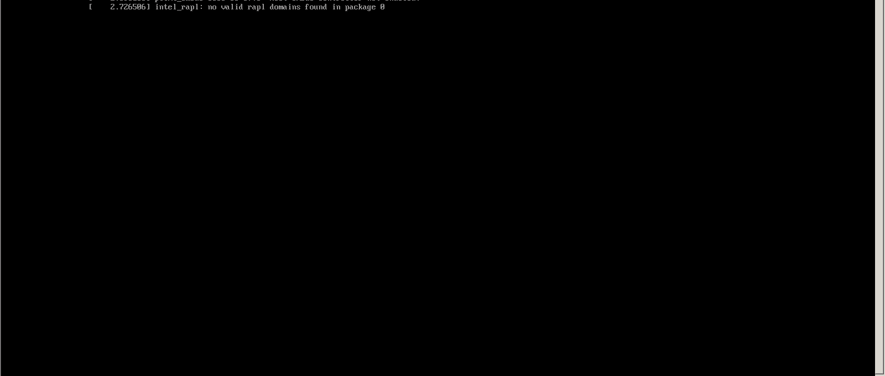
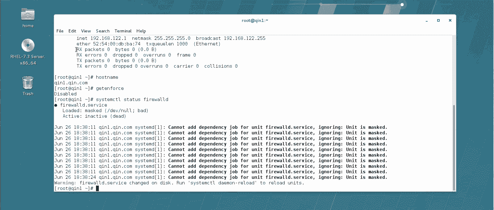

# 【云知梦】Linux实战中级篇／RHCE认证／RHEL7／CentOS7 - P2：第2集 中级课程准备工作(二) - 云知梦官方账号 - BV1iV411h7ia

우。🎼，接下来呢我们具体说一下我们这个实验环境的这个设置啊。首先来说呢这个中级课程呢要求啊至少两台虚拟机啊至少两台。那么呃建议你装一台中文的，装一台英文的啊。

或者两台英文的也可以啊呃两台机器呢都要做一些设置啊，我这个现在这个环境是刚装完啊，全新的一个虚拟机环境啊，需要做什么设置呢？首先。点这个虚拟机，这有一个更新vemer tools啊，新装的。

有可能这叫更新vemer tools或者叫安装vemer tools啊。就是说你要去往这个虚拟机上装这个半虚拟化驱动啊，有了这个半虚拟化驱动之后，你这个真机虚机之间才可以这个复制粘贴一些文件啊。

你会发现它这实际上什么呢？它就搁了张光盘进来啊，这张光盘呢呃你可以看一下啊，这张光盘实际上是谁呢？这张光盘实际上是你安装虚拟机，那目录底下有一个lininux点ISO的这个文件啊，ISO文件啊。

那么这里边呢就有这个相对应的这个半虚拟化驱动啊，那怎么装呢？首先来说。呃，您可以直接把它打开这张光盘啊。你可以看到里边有一个这个vemer tools的一个工具啊，这是个tJZ的啊，你也不用用命令行了。

直接双击解开也行。里边是个文件夹啊，给它解出来。解出来之后呢呃。我们看到就是这个文件夹啊，装哪个呢？装这个是一个泡泡写的一个程序啊呃，那么我们怎么去运行它呢？就直接进去这个文件夹运行就行了。

我们CD啊这个位置应该在如下载这个啊，如果装中文版的注意，那个位置应该是root下载叫桌面啊。这个下面有一个叫VM什么什么ts这个文件夹进去点杠VM什么什么点PL这个文件啊回车。那么所有它提示的。

不管是y还是no，你直接回车就可以了啊，就按照它默认值就可以啊就可以啊。那么它会呃往这个系统里装一些这个半虚拟化的驱动啊，还会写到内核里一些模块啊，这个都是它自动来设置的啊，我们只要一路回车就行了啊。

呃两个机器都要做啊，我现在说的这个操作都是两台机器都要去做的操作啊，都要去做的啊，大概这个呢得点个这么1次左右的这个回车啊，你中间还要等一会儿，它要往内核里写一些II替啊启动的一些东西啊。

参数模块写进去，这样以后你重启一下以后呢，这个机器就没问题了啊，让它这边装着这个内核，咱们还要做几件事。我再新开个窗口做吧，我们还要做什么呢？首先我们看这个house name。如果你默认设的话，呃。

你前面设了，当然最好。如果你没有设置的话，最好把它设置一下，怎么设呢？用这个housese name controltr啊，sethouse name然后呢一台机器，你看我这个叫琴一。

7点com那一台呢我就设置成琴2点7点com啊，都可以。根据你自己需求啊，反正最好设置的这个域名呢，名称你比较好区分啊，而且呢最好使用这种标准的这种格式啊。

就是这种全全全名的这种啊FQDN这种格式的这个域名啊，不要就弄么一段字，比如就叫琴一什么这种不好，最好是用这种FQDN的标准的这种名称啊，我们回来看这儿啊，这装完了这装完了之后呢。

你看那光驱自动就退出去了啊，建议你呢。把这个光驱啊呃改回来，改成什么呢？改成咱们那个操作系统那个SO啊，要不然以后你一压不好弄。你首先来说，这儿你看默认它选的没有连接，你看它默认这已经换回来了，7。

3的光盘是吧？你把它点成已连接啊，确定啊，你看一下，一会儿它这光盘就换回来了啊，换回咱们那个7。3的光盘了。但有时候啊有的时候他这虚拟机有毛病啊，这虚拟化这个这个虚拟机啊，就这为面这个呃好几版了。

我看都有这毛病。就有时候你直接配光驱弄不上啊，弄不上怎么办呢？要不你重启一下，它就正常了，或者呢你给他再把这一连接选掉，他这一般会为你个施啊符什么的，你不用管它，你就再重新练一次，有的时候就好了。

你看啊，我再重新练一次。嗯，或者呢你要有的时候就比较麻烦，你得哎你看这回就自动好了啊。呃，你看这光盘就是再重新断开，再连接一下，有的好了，或者你重启一下就虚机也好的。实在不行了。

你可以按棒它就DV下的CD入。你把它只能把这硬件设备你给卸了，卸了以后呢，你再重复我刚才那个操作啊，它有的时候这这是微自己的一个小bug，你把它在这勾了啊，确定是，然后你再连一下啊。

它这光驱有的时候就这毛病啊，就是从十啊好像就有这个毛病，一直到现在也没完全改善，就是他有时候替换这硬件设备的时候，有时候这个出不来啊，现在正常了啊，现在正常了好，然后这个就可以删了啊，这可以删了。

这没用了，装完了这个就可以删了啊，然后咱们接着说这吧啊，这主机名设置啊，设置成一个FQDN标准名称的主机名？然后呢还要设置一下这个网卡啊。网卡你默认M可能时你去看，你看它默认其实有一个。

但是没有直接挂这个迪Y的设备啊，建议你进来之后，不管这有什么啊，给它删了，给它删了。这个微呃微B0呢是这个7。3以后的一个新特性，就是它呃有一个桥接的网卡自动给你设的，你不用管它啊，关键是这块啊。

你可以怎么着呢？过来你把这个哥们给它先删了它。删了以后，你再看一眼没了吧。完了你再添加哎艾type是个什么呢？以太，然后呢，c name啊这个文配置文件的名字呢，你可以还叫它啊，然后呢if name啊。

这块硬件啊，这个网卡的这个网卡配置文件配这块硬件啊，注意啊，这个文件名啊，你前面要不删，你再建也能建上，但是俩文件它都叫这个名可能会有冲突。所以建议一定先把这删了啊，先把这删了再去新建这个啊，然后呢。

应该设备对应它IPV4点。咱们前面初级课讲的时候两条命令是吧？先把这建出来，再去设IP什么的，实际上可以一条命令也可以啊，others给它设一个。100。1啊，-24倍的掩码。然后呢。

这个王冠配一个这个。啊，然后还要配1个DNS。啊，注意前面应该加一句什么的，你这都是手动的，你这就应该加1个IPV4点麦色的啊。注意有时候是这样啊，你要是后边粘着东西呢，你tableble不出来空格。

然后再往前挪一位，这就能tableable出来了啊。麦的表示呢这个方法是manu啊，手动配置啊，不是auto的自动配置啊，手动配置。然后呢呃地址是吧？然后往关安DNS都给它设一下啊。然后呢，哎呦。

麦色的manu啊。然后还有什么呢？嗯，还有一个connect。点auto connect yes表示每次起来之后自动连击啊回车啊，你就成功的添加了这个了啊，配置文件名为这个的啊。

那么你在NM connect connect show，你看一下啊，这哥们已经连上了啊。当然如果没连上呢，你可以NM connect connect呃荡一下这哥们啊，然后再给他。怎么着呢？再up他一下。

啊，你在看这IP。看这IP啊过来了啊，改成功了改成功了啊，然后呢嗯还要做什么设置呢？咱们还要把这个系统的样源配一下啊。你首先要把ETC下的ys点D什么这个底下的所有的东西啊。给他先删掉啊，然后你新写。

啊呃其实默认系统一开始有的就就这就底下就没东西啊，但是出于一个好习惯，把它底下原来的规则全清掉啊。然后呢哦，对了，多说一句啊，如果你是渗头系的啊，装的是渗头那个这底下是有文件的。

他那个文件连的是公网的亚务员啊，建议你把那文件先备个份，万一你以后还想让公网装东西呢，是吧？啊那么然后呢你去编辑一个，比如说locer吧啊，编辑一个locer注意后缀一定是他的啊，后缀一定是他的。

咱们可以回头把这个光盘当亚务员啊，那你首先来说你就得。嗯。在这底下建一个叫这个名字的这个目录，然后呢把光盘给它挂上。这个时候你再去看。这光盘这不是在这底下了吗，是吧？咱们把它当这个圆的话，怎么做呢？嗯。

咱们前面都讲过是吧？这名字是随便起的，然后这个name幕呢也是随便起的啊。我表示这是本地的是吧？为了自己方便记啊，其实这名字没有意义啊。嗯。这个地址可得有意义。

fail冒号擦斜杠MNT下的CD room啊。啊，如果你选网上的源，这就是HTTP什么什么那个是吧啊？然后呢。Enableable的等于1GPG check。等于0啊，不用检测。

本地光盘自己安装的光盘有什么可检测的是吧？好后退出y list。看一眼啊，他能读到这几个文件夹，这些文件行了就可以了。然后呢。やも。你可以试着装一个啊。嗯，不用摁Y了啊。

你如果看到他有让你提示Y这说明能装啊就行了，不用摁Y不用装啊，不用装，不用真的装着它。然后呢。哎，清一下。是吧。再千个缓存啊，这两步可以不做也行啊，其实。还有什么呢？然后咱们有些系统服务得设置一下啊。

哪些服务呢？你比如说啊我们说了在没有讲防火之前，防火墙之前，建议你把这几个防火墙先给它mask掉，这样以后启动呢就不会起来了，它不会因为这个影响你的这个实验结果啊，I tables。

还有谁呢IP6 tables，其实还有一个咱们这个其实是绿4种防火墙啊，这是挺多的啊，把这几个都mask掉。然后呢，还有那个服务要mask。呃，咱们说了，咱们这期建议使用network manager。

所以你应该把network这服务给他ma死了啊，不建议使用这个啊，一般来说呢，就这几个还有谁啊？把这个SElin给它先禁掉了，把这个根们先禁掉它。为了咱们后边这个实验的时候，他不出错。

而且我说的建议这个文件修改的时候不标志就消，万一敲错了，麻烦了，直接复制粘贴来。好了，把这哥们也给它禁掉。这几步都做完了之后呢，reboot啊把系统干干净净重启一下啊，你要不重启啊。

你那个很多东西生效不了啊，比如说那个像你呃装的这个半虚拟化插件啊，它要重启才能生效啊，包括你设的都是mask，你没有stop啊，所以必须重启，它才能真正给它mask掉啊。

否则的话你就得再把那些服务都stop啊，因为它本次默认有的是启动的。

用这个账号密码进去。然后呢呃进来以后呢，就算是设置的比较干净了啊，设置的比较干净了啊，你可以用这个。这个哎让他排列一下啊，按名称排列一下。这就干干净净了，把这个窗口打开窗口啊，设置一个比较好的环境啊。

然后注意啊，重启以后光驱是没有默认化载的。你再把光驱的挂一下。挂一下光驱呃，然后呢。看一下IP你看一下IP啊，应该也是对的啊，把这窗口可以调的舒服一点啊，呃这些都是为了以后咱们做实验自己用啊，舒服一点。

还有什么呢？陶类啊，好了，主机面啊，然后你可以在。查一下啊，这slin都是关着的啊，我们再看一下这个服务。什么这个。这些服务你看都是m掉的啊，这就行了啊，这就可以了。你系统设置完这些东西之后啊。

就可以干嘛呢？去打一张快照啊，你可以在这打一张叫ok的快照啊，拍摄一张快照，这样你以后呢做实验，反复做的时候，因为咱们说中级课很多这个实验都需要反复练习啊，你在做的时候就可以去通过还原这张快照的方式啊。

反复的去做这个实验啊，两台机器都要做这些设置，它俩的区别就是主机名和IP不一样，别的地儿都一样啊，都要经历这几个过程装半虚拟化驱动是吧？装那然后设IP啊，设主机名啊，做，然后呢去禁掉一些系统服务啊。

防护墙那些东西，然后关闭啊，然后打一张快照。重启之后打一张快照啊。那么这两台机器的环境都做完了之后咱们后边的实验就建立在这两个时间点上开始去做啊。那么反复去做增强练习。

才能把这个整个中级课程顺利的学过去。啊，那好，接下来剩下的课程就是呃大量实验堆积起来的这个中极课程。

