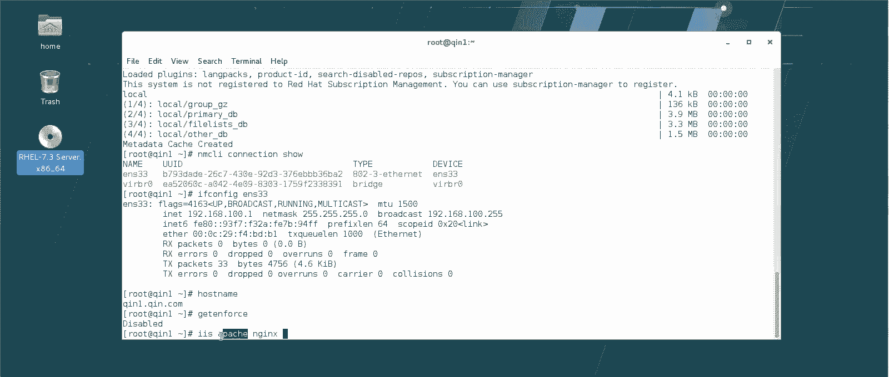

# 【云知梦】Linux实战中级篇／RHCE认证／RHEL7／CentOS7 - P3：第3集 Web服务器(一) - 云知梦官方账号 - BV1iV411h7ia

。

好，咱们开始这个呃终极课程第一章的学习啊。第一章咱们讲什么呢？咱们讲一下这个外部服务器啊，呃实际上按照这个官方CE的课程啊，第一章其实推荐是讲DNS啊，但是为什么后来咱们这个就不第一章先讲DNS呢。

主要是因为这个终极课程啊，第一章咱们讲这个第一个服务器啊，它除了讲这服务器本身以外啊，他还要讲一些这个通用的一些理论的概念啊，那DNS服务器本身它就有一些这个比较就是难懂的一些这个理论啊。

比如什么迭代啊，什么递归啊这些呃，所以说呢一般来说以前啊就是把这个第一章讲好多学生反应就是有点受不了，容易讲哭了。所以后来呢慢慢的就。拿这个外部服务器起头啊，这个的话因为咱们平时啊接触比较多啊。

一般都上网嘛，外边服务器它就是提供上网服务的啊，把这个网站发布出来这服务。所以说呢相对来说大家那个接受起来上手容易啊，呃，把这个服务器啊，通过它把一些常用的什么端口啊什么这些东西。

这些概念都讲清楚之后呢，后边的服务器，你再讲的话，就相对来说容易上手啊，所以后期咱们一般来说就是先讲外部服务器啊。那么我们既然讲这外部服务器。

首先咱们先讲一下说外部服务器咱们说这个整个中极课程要讲很多服务器啊，除了这个外部服务器还有很多，那这个服务器是个什么概念啊，首先我们讲一下服务器，那服务器你呃比如说你去查百度。

你去查服务器啊，他这个理论写的也是挺挺挺枯燥啊。实际上我们讲课一般我们不愿意这么去讲理论啊，思磕理论就是一般我们如果说正常的来理解的话，什么是服务器呢？呃，比如说你去饭店吃饭是吧？给你端茶递水那个啊。

那叫服务员是吧？他为什么叫服务员呢？它因为他向你提供服务的啊，给你这个端盘子是吧？擦桌子是吧？一个能够提供服务的人，我们叫服务员那服务器嘛顾名思义，一个能提供服务的仪器。

我们就叫服务器啊那服务器总体来说分呢，它分类啊分两种啊，哪两种呢？一种是我们能这个就看得见摸得着这个啊，这叫硬件服务器，就是它是有一电脑啊，性能很高的电脑啊塔式的啊台式机这两个模样的啊。

包括还有机架式的啊，两U4U8U啊，越来越厚越来越大这种啊，还可以按什么架构来分啊，它有很多分法啊，而咱们这个。

红帽官方这个课程啊，咱们说中极课，咱们讲呃不主要讲硬件服务器啊，咱们主要讲什么讲软件服务器啊，软件服务器是一个什么概念呢？首先来说它是要装在这种机架式或者它式这种硬件服务器上，它是个软件啊。

它呢装完之后能够提供一定的服务啊，对外能提供一定的服务，那它提供什么服务，就叫这个服务的服务器啊，你比如外边服务器，它是干嘛呢？

他能够把这网站啊，你看我们这一打3W百度点com是吧？咱们能去呃上网啊，打新浪打打这个谷歌什么的，我们能上网，为什么呢？就是因为在网络上啊，有一台或者多台啊。

安装了这个外部服务器这个软件的这个硬件的这个电脑服务器它能够干嘛呢？把这网站啊发布到互联网上，发布上来之后呢，我们再去打这个通过IE浏览器输入网址，就能去访问这个网站了，它能提供对外发布网站的服务啊。

所以我们就把它叫外部服务器啊，它能提供某种服务，就叫这个服务的服务器啊，你比如中极客咱们说的一小半的课都是讲服务器是吧？DNS服务器，它能提供什么服务呢？它能够提供域名解析啊。

把那个域名3W什么这域名解析成IP啊，因为互联网就是整个它底层计算机，它不认这个英文，它只认那个IP那是数字啊，0101这种东西啊，包括说DSCP是吧？它是能。

进行这个就是IP地址分配啊，一个企业你好几万台电脑是吧？一个一个手动设IP不得累死啊，包括什么screen啊代理服务器是吧？这很多啊很多，咱们说这些服务器它每一个服务器软件服务器它开发出来。

它能够干一个活提供一个服务啊，我们就叫这个服务器啊，那么今天咱们课程重点既然是这个外部服务器是吧？咱们就得介绍一下外部服务器啊，常用的外部服务器有几种呢。怎么说呢？目前来说大家公认的啊用的比较多的啊。

三个啊，微软微软。IS服务器啊，微软的IS服务器一般的你要是用windows操作系统都能看着这个服务器。那你比如说你要是呃学过什么MSE那种课程啊，你可能就对这个了解多一些啊，我这我这有虚拟机啊。

0822的啊，可以给你大概看一眼啊，微软这IS服务器呢就这个啊就是这个服务器。我们看就这个啊外服务器，它用的是IS啊，这个呢在什么它0822啊，什么E222啊，一直啊从最早的它一直用这个服务器啊。

叫这个服务器，它它可以把这个网站网页发布出来啊，功能也也挺强大啊，但是相对来说呢，它还是就是说一般来说就用在微软的平台上啊，那咱们linux平台用什么呢？用这个。

阿帕奇啊阿帕奇这服务器还有什么呢？NG啊，其实还有很多啊什么tom cat呃，还有什么这个挺多的，但是比较有名的是谁呢？就是这两个啊这两个其中这阿帕奇服务器呢，也是现在为止啊就是世界上就是排名第一的。

排名第一的啊，就是在linux这个圈里这两个服务器啊，那咱们今天课程重点呢，主要就是讲这个阿帕奇服务器啊，那既然讲它呢，咱们得对它稍微了解了解啊。你比如说。

我们看一下这阿帕奇服务器啊，你如果是百度上去搜啊，或者有时候你听外边有的地儿讲啊，这服务器阿帕奇是吧？他一般跟你说的都挺那什么。你看世界排名第一啊，说他这阿帕奇这名字挺好的，是什么这个什么北美部落啊。

又是什么基金会啊，什么武装直升机名字啊，实际上这个阿帕奇啊，他这个这个服务器它这个由来啊，挺挺传奇的啊，这是一个这是一个很有名的小三转正的故事啊这是怎么来的呢？就是给大家念叨念叨。

首先来说最早的时候互联网上那个外部服务器啊。

，没有这个没有这个啊。呃，在上个世纪那会儿啊，就是其实最早这阿帕提怎么出来，上个世纪有一学校大学啊叫什么名，我也忘了美国的学校。他们当时那个学校有一个外部服务器啊，那个年代上网人比较少。

所以他们自己有一个小外部服务器，就是提供网站服务啊，对外，然后呢呃一帮大学生拿这个服务器上网啊，上着上着上着呢，这个发现这服务器老崩啊，可能访问量越来越大了，是吧？那崩了怎么办呢？

这帮大学生就说那咱们这个给这个服务器打打补丁吧啊，打打补丁。打完补丁之后，好像崩的就机会就少了，就不太崩了，服务器越来越稳定。哎，随着这访问量又大了，又大，怎么又崩了，又崩了之后怎么办呢？不行。

咱们再打个补丁吧，是吧？后来又有病毒了是吧？有一些安全方面的隐隐患是吧？就网点上就使劲打补丁。这补丁啊越打越多越打越多啊，直到有一天啊，这帮哥们发现哎，说这补丁这功能好像咱们越做挺强大的哈。

说咱们不用主服务器了，咱们光用补丁看行不行啊，结果发现也行光用补丁服务器，那性能更好更稳定啊，而且这个负载更高，所以后来呢就大家就光用这补丁了啊，这补丁英文叫什么呢？

叫pas还是叫这个我我忘有点记不住了。然后他们申请注册名的时候就很草率的一块补丁。叫什么啊pas啊，好像叫这个啊，然后呢，后来音译音译音译过来就。appache服务器啊，这服务器就出来了啊。

这个服务器出来以后呢，就反正发展很迅速啊很迅速。咱们这个开源界这起名这事吧，反正一直以来就是比随性比较随性你像那个最很有名的那个就windows和linux之间通信的这个桑服务器起名就是很随意回头咱们讲的那章我再给你讲讲那故事啊。

那这个呢就是慢慢的这阿帕奇就发展起来了。直到今天呢它不光是做外面服务啊，他还能做什么中间键啊以他这个阿帕奇基金会啊，就很强大，他后边还发展了一大堆业务啊那这是一个很很励志的这个就是小三转正的故事啊。

从一个补丁慢慢发展成为世界上排行第一的主流服务器，这排行第一不是瞎说的啊，它的确性能是很强大的啊，怎么说呢？就是其实你要是有兴趣，你可以在网上搜一搜啊，就比阿帕奇和这IS。

还有他有比较啊，有些这个工程师闲的没事啊，把他们开的什么的做个比较是吧？你可以看一看。

就的确它这个性能不是说说老师你讲讲这个linux，你就说人家微软的IS不行是吧？不是那意思，你可以客观的上网上你去看一看这些呃比较啊，比如说这个收费免费，开源的肯定是免费是？微软那玩意肯定是收费是？

稳定性这个也没什么可比的linux再不稳定，它也windows稳定包括扩展性是？这个IS它只能在那个windows平台运行阿帕奇来说什么平台就行windows版的帕奇啊，也可以用很好很好做。

而且包括很多咱们中国的一些那个就是PP的那种做la的那种就是做P的他们好多做一个整合环境都整合进去奇很好用那种windows平台包括安全性啊这也没什么可比的lin怎么也比windows安全相对来说这个包括什么开放性IS。

的它不是开源的阿帕奇开源的啊，所以它发展快啊，为什么性能好啊，就是开源还是有它自己的这个强强强势的这方面啊，就它发展就是快啊，包括什么难易度啊，这个IS占点油，为什么微软那玩意点鼠标的，你知道吧？

这这点鼠标操作的啊，我把这关了啊，咱们这不是强这winwindow服务器？

那个。还有什么呢？啊，他是没了。哎，我记得以前我看。有好多评比的啊，就是。很多那个就是对比，就综合性对比啊。他那个就是评价啊，反正。嗯。包括那个其实在生产一线，有的时候，你在那个比较大的并发底下。

你可以去测啊，你可以去测这两个这个性能是吗？是吧你看这个。啊，南易度编程性啊，那肯定还是。这差不多是吧，支持语言啊，开源的肯定占优啊，本身搞开源的工程师就是比那个比较就全世界都有是吧？

包括这个什么啊待遇方面啊，这个可能是大家更关注是吧？因为嗯这么说吧，这同样在企业做运维岗，你搞windows运维的是吧？你肯定是没有这个linux运维挣的多啊，入职工资怎么也得差个一两千啊。

到后期就不好比是吧？不好比，因为好多到后期linux运维一般都至少在玩个数据库玩什么的是吧？往DBA方向再发展发展，肯定那工资就上去了啊，呃这这是这几个方面比啊，的确他呃这阿帕奇相对来说比较占有啊。

这这自从小三转正之后呢，这个阿帕奇现在属于是这个正房一态的位置啊，正房啊，这大房一态的排名第一。但是实际上在中国来说呀。中国它还真不是排第一啊，中国比较有意思，中国是NG就in服务器里边NG这服务器啊。

这个排行挺高。而且很多那个大企业，咱们中国的用这个服务器啊，为什么呢？这个好处在哪呢？这个这个负载轻，就什么叫负载轻就是它同样能干一样活吧，它对于服务器的要求没那么高，他不需要说这服务器性能特别强。

它就能实现什么，而且它功能也挺多，反向代理啊，什么负载均衡啊，都能用啊，咱们中国很多企业你看写了哈哎，现在这百度搜出来的东西挺全啊，像什么京东什么这些什么新浪网易腾讯啊。

好多都用的是NG还真不用ipad为什么呢？就是他这个尤其他这个反向反向代理负载均衡高性能这负载轻这点尤其是它轻量级这一点这点很受咱们中国这个市场喜欢咱们一般有的这个好多国内的企业是吧？

一方面也不愿意用IBM的的确国家也是大力倡导，咱们用什。呃，浪潮啊、曙光啊啊这种服务器。再一方面的确也是咱们这个是吧呃用点这个。这个就对服务器要求没有那么高啊，所以在在咱们中国，这个这这相当于二方一态。

但在中国市场占有率还挺高啊。那这两年呢这个NG的发展也很快啊，他也是开源的，也是开源软件啊，二方一太有点要抢占这个大房的位置这个意思啊这是说点题外话啊，那今天正客咱们还是讲阿帕奇。为什么呢？

毕竟这是呃目前来说他还是世界排行第一啊，而且来说就包括红帽官方也是推荐这个啊，推荐这个NG斯这个如果有兴趣的话，你可以后期等咱们讲那个讲那个就是运维课的时候讲啊那个课咱们讲讲NG斯他的一些反向代理啊。

做什么负载均衡啊，包括做一些这个。

这些工作，而且咱们那个讲的话，一般都是讲编译装企业生产一线一般NG个都是编译来做啊。就是介绍介绍这几个这个呃wi服务器啊，那既然咱们讲主要讲阿帕奇的话。咱们就得说说它啊，首先来说默认红帽起体操作系统。

默认没装它啊，他怎么知道装没装啊，RPM杠QA是吧，咱们查一下啊，你这个RM杠QA，你查这所有装了是吧？我还是那句话啊，就是如果有一些这个操作我不解释的时候，你发现你听不懂，一定去倒回去。

再把初级课好好的看看啊。这个干技术啊，这不能太懒了，不能太懒了，也不能太着急。你老说想学这个往后学，你前面底儿都打不好，后边很很很费劲的啊，你看看什么呢？阿帕奇这个包叫这个HTTBD啊，或者说你记不住。

你就搜HTTB就行了啊。你一看没有啊，没有。没有怎么办？没有装呗。把这包装上，这包叫HTTPD啊，那么默认呢这个包装的时候呢，还要依赖于这两个包啊，一块装。啊，这包就在咱们咱们这个光盘里啊。

装上去之后呢，你再查一下是吧？你看这就有了啊，这就有了，就这个包啊，这个包是依赖出来的，主要的主成就是这个咱们现在红帽7。3用的是这个2。4。6这个版本啊，这个版本的差不多64位的。那这是这个软件包。

回头呢，咱们也是通过这个叫HTTBD这个首不进程来对于整个这个阿帕奇这服务呢进行管理啊，怎么管理呢？一般来说咱们装完哪个这个服务器啊。首先来说，你至少得来一这个吧，让他下次重启，咱得让它能自动起来。

是吧？然后咱们就直接手动给他起来吧。起来之后，你可以看一眼阿帕提这个进程啊。啊，这个进程一看啊，这root启动的这是阿帕奇的这个主进程啊，3088号主进程PID是这个的啊，那么这个主进程呢。

下边它还会启动，这是一共5个啊子进程啊，那这是什么意思呢呃。他是这样的，阿帕奇服务他这个主禁程入的启动起来之后，他调这5个紫禁城是干嘛的？对外提供服务的啊，就是咱们这服务器外部服务器做启动起来之后。

里边跑着网站是吧？他把这网站网外发布以后不是得有客户端过来访问嘛？来一个客户端啊，这就得有一个紫禁城去接待他啊，你得提供服务啊，对吧？人那哥们要上网啊，这去了那这去呢，这哥四个在这等着。

在这等着等着之后呢，呃。一会儿又来哥们上网啊，这这这进程也去啊，实际上这一个进程可以处理多个那个户那个响应啊，不是说一个进一个响应进来，一个客户进来上网就得占用一个进程，不是那样的啊。

它底下可以有子进程，再有子进程进程啊，它一个可以接待好几个，这可以设在那个配置里可以设啊，以前红帽六的ipad7那个配置文件直接就可以写那块啊，那值还得算啊，那么七的这块呢。

它配置文件里没有明确指出来啊，实际上这几个就是干这用的啊，有的人说这这这这就5个啊，这能调嘛，这可以调的啊，这可以调。呃真正说在生产一线，这个要调大一点，稍微调大一点。然后呢呃你它有一个值可以设什么呢？

就是说它保持在这处于等待状态的进程有多少个啊，有多少个。那么你呢如果说这进程一个一个的是吧？那个访问量有点大，这不是一个一个进程出去提供服务的嘛？这进程。

这底下这数还能往上增还能往上加呢还能往上一个一个加加呢它是自动加的。阿帕奇自动智能的给它往那加，它会维持你这有一定的活跃的这个等待的这个数量啊。然后呢，说你如果说啪突然有一段时间，大家都上岸了都走了。

这进程不是啪啪在这等候闲置的进程又紫禁程又多了嘛，他阿帕奇自己会把这些多出来的，再杀死他始终保持在这处于等待的那个数是可以指定的啊，可以调节啊。那么这是咱们讲这它是主禁程紫禁城啊，你要拿PS吹。

去看一下，你看啊在哪儿呢？HH。H哎这儿呢啊主进程紫禁程啊，这是这么个这么个关系啊，那么嗯。这个主程序。哎哎。写法吧。这主程序咱们看一眼它的状态啊，目前的这状态，一般都是这个程序，咱们装上之后HTB啊。

那么咱们设为 enableable，而且目目前状态启动了啊这几个新账号这都有了啊，这是咱们看一下的状态啊，那么还要看什么呢？实际还应该看一个这个n state。这是什么意思呢？我们看一下它的端口啊。

这个咱们在初级课程的时候呢，提了一嘴没怎么讲啊，那么在这儿呢，咱们稍微讲一讲，因为后边几乎每个服务都要用到这个，这叫什么呢？这叫这个监听的端口啊，监听的端口啊，而且我们看到它是TCP的啊。

那这些都是什么意思呢？我们来看一个文件。打错了，我们看这个文件ETC下的这个service啊services这个文件。

这个文件就存着咱们这个呃系统里啊所有的这些呃这个已知的比较有名的这些呃服务的这个端口，还有它的这个协议啊，这什么意思呢？咱们先讲这个端口啊，先说这个端口嗯，说你看这阿帕奇这HTTBHTTP是吧？

它其实什么意思呢？阿帕奇这个程序啊，就是说这个外服务器，它点上跑的这些网页啊，遵循什么呢？遵循HTTP协议啊，点上跑的是超文本传输的协议是吧？这协议点上跑的这些网页呢，它来说传输数据啊。

传输的这些网页数据呢，它默认走80端口，这是什么意思？就是说呃比如说咱们画张图吧，你看啊比如说咱们模拟一个环境，哎，这是一客户机，这是一服务器啊，说这个客户机，这这这台电脑说跟这服务器。

这服务器比如说是谁呢？

比如说心脏吧。别心了。哎行，就新浪吧。虽然我挺烦这行，就比如说新浪网啊说你这客户端想过来上网那想过来上网，那你们两个是不是点要传输什么呢？传输这网页的这些信息啊啊，那你们两个之间传输信息。

那可能在这个网络上啊，你们之间传输的信息啊，那可能不光是这个网站这个P走的协议这些信息，你们俩还可能传输什么信息啊，你们俩比如说你可能还跟这服务器之间，你们还有FTP的信息是吧？啊。

你可能还远程连过去SSH到那台服务器上，就是说你可能跟网络中这些服务器之间传数据，你可能是很多服务都有这种可能啊，那如果说没有端口的这概念，你所有都直接这么传的话。

有可能就是冲突了啊我们设定这个端口是什么意思呢？你可以简单的把它想成什么呢？就是这不是网线？两个机器之间网线传数据嘛？这网站上戳了很多个眼戳了很多个眼戳这眼干嘛呢？你只要传输。😊。

HTTP的这种网页的这种信息，你就走80端口啊，你这走80端口，这条道给你固定好了，你可以把它想象成就是一个1个80号那个眼儿啊。那你比如说走别的信息呢，呃你走什么信息。

走它相应的那个通道那个眼儿传FTP走什么SSH的，或者说传邮件的，走什么tnet过去走哪个哪哪哪个那个眼是吧？你这样的话，你不会冲突啊，你不会冲突啊，当然这个端口是一个模拟的呃是一个逻辑的概念。

就是说你网线上真实的是没有这个眼的，这只是在逻辑上我们定义一个叫端口这么一个概念啊，那么你们之间传数据通过某一个端口传输。这样的话呢，这个端口被你占了之后呢，你就始终占着这个端口，那别的数据传输啊。

它走别的端口，你们之间就不会产生冲突了啊，所以这个概念呢。端口这概念，你看我们阿帕奇默认如果走HTTP协议传输的这个普通的这种网页信息啊，我们就走80号端口啊。实际上这个阿帕奇这点传输的信息。

除了80号端口，还有别的信息。你比如说呢它还有1443端口，你看这个啊43，这叫HTTP哎呀，哪儿去了，这儿了HTTPS啊，那这是啥意思啊？这个S表示security啊，就是安全加密的啊。

有些那个网站上你发现有些网站它是安全加密性比较高那种信息，它就是HTPSHTPS冒号斜杠什么什么的。

你比如说你比如说咱们找一个。你比如说。民生银行吧啊这种银行啊，证券金融的一般传输数据用这个啊，只要是加密的都用这个。你比如说咱们进民生银行啊，嗯比如说咱们这个你看个人网上银行，你看我一往这个人网银走。

这变成HTTPS传输的了。因为什么他就这块比较危险了当然让我下空件，就是凡涉及到这种比较危险的安他要求安全级别比较高的啊，他是你走443端口，你就别走80了，是吧？这个安全级别高，你单给你开条道是吧？

高速公路啊，也不能叫高速公路吧，反正说加密通道，它给你开这个啊，这是端口的概念啊，那么每一个服务呢一般都有它就是比较有名的这些啊，一般默认的已知的，它都占了一些固定的端口。

那么我们大家公认的就是你走这些走走这数据的话，你就走这端口啊，行业标准啊，行业标准。

呃，包括后面你看还有什么TCPUDP这是什么意思呢？呃，这是咱们讲这个叫传输协议啊，就是我们数据在网络中传输啊，一般来说走这两个协议啊，走这两个协议的多。那么这两个协议有什么区别呢？其实按说这课呀。

这这这都不应该是咱们这个这linux这课上讲啊，应该是正格讲应该是交换路由的课。比如说你学个思科呀，学个华为啊，考个什么CCNA啊，HCNA就那初级课上就讲这个啊嗯这是什么意思呢？我给你大概讲讲啊，嗯。

这是两个传输协议啊，网络上传输数据包呢，如果是走TCP的和走UDP的，它对于说这个传输的方式以及要求是不一样的啊。TCP的话，对于数据的传输呢，要求精准安全可靠啊。呃，怎么理解呢？

它要经过三次握手才能建立连接。就是咱俩之间传数据啊，你比如说我还开始吐，比如说我这个客户端，这是服务器端啊，一般来说HTTP那个传输网页来说，在传输网页这阶段走的是TCP的啊，那什么意思呢？

说你想要去新浪网上去上网啊，实际上是一什么过程呢？

你首先要给新浪网发请求啊，我我现在讲这三次握手啊，我不按那个就是像思科呀、华为啊那种那么讲讲那么讲三次握手的话，我估计也能给你讲骷了啊，咱们用普通话讲，普通话就是我说人话啊，我举个例子给你讲。

这怎么叫三次握手，还有这四次状开啊，说你们之间怎么传这数据TCP的啊，你去新浪网上网，你们要经过三次握手。这三次握手什么意思呢？就相当于啊你跟新浪商量。首先你不是想去人上网吗？你就跟新浪商量了。

你说大哥大哥，你在吗？哎，新浪就告诉你兄弟，我在呢啊，哎，你有啥事啊？然后你就说了，你说大哥我想去你那看个网页啊，看个八卦新闻是吧？然后新浪说呃中能给你看，然后呢，咱俩建立连接啊，这一共是三次过程啊。

我说的挺糙的，你仔细听啊，这是三次过程，然后你俩建立上连接了，建立完连接之后，你俩才传输数据，而且在这个数据传输的过程中是怎么样的呢？就是说你比如说传这数据，不管是十0兆也好，100兆也好。

1000兆也好，他把这些数据分成呃包啊，多少个包。然后呢，每一次这个包呢发过去之前啊，要封包头包尾，而且是多次的啊，这包头包尾都好几层啊，我不给你讲特别细啊，然后呢，把这个包头包尾封完了数据包发过去。

如果对方没接收到。😊，停止往后接着发啊，后边那些包先停把这包再发一次，你得确定我要发给谁。这目标地址和这个我这个地址，两个地址得是确定好的。因为我们通过TCB3次过手建立好连接了。

我们相互的这IP什么地址都已经是很明确的了，我就是要发给你啊，那么我要发多少个包这每一个包多少，然后第一个包发过去，第二个包是吧？如果发现你哪个包没收着，由于网络波动啊，或者是什么原因呢。

是网线断了什么的，不管因为什么，我要给你重发啊，直到这个包传完了再接着往后传后边的啊，一直到都传完了，咱们在断开的时候要经过4次断开啊，怎么叫4次断开呢，咱们还是用普通话说啊。

就是这边说大哥大哥我传完了大哥这边说呢兄弟，你传完了是不是打算断开啊，然后你这边说是的大哥我就是要断开大哥说好，那断开就断开这是4次啊，4次过后呢，你们俩就断开这个实际上你从这个新浪网也好，搜狐也好。

你去上网啊。那就是咱们把这个改叫搜狐吧，我个人很讨厌新浪啊。带我的擦了，嗯，有道理，我把它改成搜狐吧。好那么你从这网上上网，实际上什么过程啊？你不是说一直趴在人那服务器上的，你连接上去之后，然后呢。

你是怎么上网的？你是把这网站上的网页下载到你本地的缓存里啊，然后你是看你本地那缓存啊，那么你下载完之后，其实你俩就属于一个就是静播状态。过一段时间之后叫帽的时间啊，过了这时间之后，你们俩就断开了啊。

不是说你一直趴人网站服务器上那么把服务器累死了啊，所以说它是这么一个过程，这是整个这个PCP传输啊，它相对来说就很精准。就是首先咱俩建立连接得三次握手啊，很明确的我们两个要传输数据啊，断开也是一样啊。

要求这个步骤很繁琐，发的程序包也是要求很具体，不能缺包，不能缺东西啊，UDP就不一样。UDP一般来说就是广播啊，什么意思呢？你比如说啊还是咱俩说咱俩之间咱们说这个发数据是吧？UDP什么概念呢？

就是我也不问大哥大哥，你在我怎么发呢？大哥，这数据包给你，你收着啊，就扔出来了，是以广播的形式。一般啊一般是以广播就是网络中可能1000多台，我直接就扔出去了。然后大哥在这等着啊，收着了呢就收着了。

收丢了呢，收丢就收丢了吧也无所谓啊，那么这是UDP的特点啊，他一般不太明确的就是说得指定啊说对方是谁啊，一般是以广播传输。然后呢，至于说发发完之后，你收没收着，他也不会不去做这个明确校验。

如果丢包也不会再说呃重发啊，一般他是广播啊，反复广播这种的啊，那么有的听到这儿啊，之前我我在有的那个院校里啊，包括给那帮大学生有时候讲课啊，我讲到这儿我就问底下这些同学们。

我说那你觉得啊这TCP好还是UDP好啊。😊。

要是没学过这个什么这个思科华为这种交换路由客的啊，99%都告诉我说TCP的好啊，实际上不是啊，实际上不是这两个没有说哪个好哪个坏，他只是说数据传输的方式不一样啊，那大部分同学有的时候说这TCP又精准啊。

又这个这个不丢包，这个肯定好啊，不是啊，在生产一线当然有些很具体的有一些这个传输的时候，我们建议采用TCP你比如说你你这个上网啊，阿帕奇，你上网，你你就是上去弄那网页，回头这网页弄回来少一段。

那你肯定不乐意是吧你看你网站有时候你访问你就慢是慢。但你发现最后你只要有足够的时间，他可能网速是慢点，最后该打开的图片都打开了是吧？文字啊什么的都是全的啊，这种时刻我们是希希望用这个TCP传输的。

但是有一些东西就不能用TCP，我们就建议用用DP。你比如说什么呢？比如说腾讯那QQ啊，包括你微信啊，你传出这种数据的时候，包括还有什么呢？就是呃网站上那些流媒体视频，你就不能用TCP为什么呢？好。

你这TCP要求精准啊，这块读不过去没发完丢包了是吧？不管因为网络波动还是什么延迟什么的。那你这数据后边不传了，一直横在这就等着那你受得了嘛？是不是你包括比如说俩人打电话，你俩人打电话的话。

你说这边我说一句话，中间有一个字没说清好，后边说的话全给你没了。这谁受不了啊？你网站视频也是一样，这种流媒体的视频，你走TCP不现实，为什么我就那一点一秒钟没看着，不影响我继续观看。

可能卡一下跳一针啪过去了啊，所以说这个生产一线来说，你这两个技术来说存在就有它的道理啊，没有说哪个好哪个坏啊，没有这个。当年腾讯也是因为这个被很多人购币，说他这个邮箱不安全，说它是好多基于ugDp啊。

其实不完全是这回事啊。啊，当然实话实说啊，腾讯的邮箱好像是不太好。呃，然后这是咱们说的TCPUUDP啊，那么端口啊这几个概念啊，后边的章节我就不会再重复这些了啊。

所以说咱们说第一章咱们有些前面没有讲细的，咱们稍微补一补啊，那么默认普通的HTTP的协议传输的这种超文本超文本的这种网页信息走的是这个TCP80啊，TCP。好，还有好。哎哎。

那么nex state这个命令就是来查这个服务起来之后，我们就可以查什么呢？查它现在的监控状态啊，监控状态它走的是哪个呢？80端口，我们一直监听80端口啊，当然这些都可以改，怎么改呀？有一个配置文件。

我们首先说啊，这是咱们讲这第一章第一个服务，你可能看着还有点别扭。后边服务讲多了，你就习惯了。一般来说这个配置文件都在哪儿呢？咱们前面初级课也说过，大部分都在ETC下啊，那么会有一个文件夹啊。

叫HTBD啊，别的服务叫别的文件夹，底下呢，他把别的乱七八糟这东西都搁在底下。然后一般它的配置文件都叫什么什么点con啊，cfer。配置文件都叫这个名字啊，这是它的主配置文件啊，我们去调整一个服务。

主要来说就是调整这个主配置文件。那么这个文件呢咱们进去看一眼啊，你可以发现呢这个配置文件啊嗯不是很长不是很长啊，嗯大概有个几百行啊，但是其中很多的是这种注释啊，是这种注释文件啊。

那么真正起生效的这些内容啊，我们也不会每一行都细说啊，为什么呢？这就跟咱们讲初级课讲那个命令一样，我说了不是每一个命令咱们都要讲啊，就是某一个命令咱们讲了，你拿慢去看，我也说过。

我说不是每一个参数我们都要细讲，还是那句话生产一线用得到的啊，咱们后边会设计一些实验。你把这些用得到的能明白了就够了就够了啊，你没有必要死抠这个。因为什么你毕竟不是阿帕奇的开发人员，对不对啊。

企业生产一线，你也不一定说啊你就一定每一个参数都要记手啊，也不是，但是主要的核心的啊，咱们稍微说道说道啊，这个说明这些呢就是井号。这些啊这个这这这些东西呢你能看懂最好看不懂的话呃，也就算了，无所谓啊。

但是我一会儿详细讲的这几几个参数，你一定要记清啊。首先第一个。ser root这是什么呀？咱们从头看啊，第一个就是这个serv root，这是什么呢？它指定了这个服务器的根啊，服务器的根是什么意思？

就是我刚才我说的。就是这个阿帕奇啊这服务的主目录啊，它所有的配置文件也好，这些东西都在这儿啊都在这儿。所以ETC像HTDBD这是它的根目录啊，后边它有一些相对路径，相对的是谁呢？就是相对于这个路径的啊。

一会儿咱们讲到了再看啊。然后呢，这是定义它的一个主目录根的，这个一般不改啊，监听的端口啊，默认你看80。咱们说为什么你n看着它监听80端口HTTP一搜搜出来80，就是因为这指定的啊。

比如说你后期你的网站，你不愿意用80端口，或者说我们需要用多个端口，比如443啊，什么8080啊，在生产一线有的时候不用默认端口，为什么呢？有些网站它可能说涉及到就是说他可能觉得比较危险啊。

或者说他想在这一个阿帕7服务器起多个网站啊，他可能说通过这个端口号去区分。那你要想加端口，你就在底下得再写一行啊。你比如说你想加个8080啊，那你就得。是吧在这后边加8080。那以后呢。

阿巴提着起来之后，他会再监听这个80端口，你怎么让这配置文件生效啊，所以这么闪t，你restar一下这个ATBD它就生效了啊，它就生效了。然后你再netstate。ANTULP啊，这是什么意思啊？

你要光察这个这是监听所有的这个都出来了。你看现在网络就监听这么多服务是吧啊，那么AE的表所有的，我就哎得了，我还是给你慢一下吧。好哎。你看一眼啊，A就是把所有的列出来什么那个N呢，然后什么这些你看啊。

包括那个TT就是指的所有TCP的U呢指的就是UDP的一般就这两种呢，咱们列出来就行了啊，我也甭给你细翻了，这太耽误时间了，回头有空自己看吧啊。

反正一般来说就是这个参数啊ANTULP啊列出嘛啊P就是表示这个程序program这程序啊，然后你从里边再找一下HTTP啊吧？你看这回呢。嗯，我看啊。HTP的啊。Wb catch HTP。啊，这俩主进城。

ANTU啊，这错了，我说的呢ANTULRP啊，这打错了，所以说这个搞技术啊，你手底下别抖啊。ANTULRP你看它除了监控这个80以外，8080也出来了啊，它是这么来生效的。

就是你要想对它进行修改就改配置文件，改完配置文件重启一件服务就生效了啊，当然也不一定非得重启服务啊，这个咱们讲到这儿，咱们也多说一下，你可以干嘛呢。reload也行。

reload跟restar的区别在于哪儿呢？咱们初级课没细讲啊，中级课咱们说两句reload是不充启服务啊，不充启服务，直接就重读一下配置文件啊，那这俩区别在哪儿呢？有的时候生产一线啊不能重启服务。

你这服务一重启一断不行。这一段有可能对生产有有有这个毁坏。所以那个时候我们只是说你改了改配置文件，你想生效啊，那你就稍微给它relog一下。还有一个地是什么呢？

就是你比如说你PSAOXJREPHDDPT。你看啊，你现在这个主进程是3603吧。我比如说我relog一下。这样我先reite一下啊。re start一下，我再看一下这主进程，你看见没有？

明显进争号变了，这说明什么呢？它是先停止后开始，它等于是又一个进程了。但是您如果是reload呢。你看一眼啊，这哥们儿还是3633，他不会重启新的竞程号啊。

所以说生产一线你别看就这reloadre star这个在不同场合，你也要根据它不同需求啊，咱们这个稍微讲细一点啊。好，咱们接着改这个接着改这个啊。啊。好，接着改这个，接着往下看啊，对这我先给删了啊。

别瞎改。咱先用默认的这个啊，然后呢，他跟你说了，他说include control点地下的modules点地下的星点c，你看这就是一个相对路径。相对于谁呀？这个就是相对于咱们前面说这根的啊。

你看一下这个ETCD就是跟下有没有一个这叫什么con点mods点D。😊，点mod。1有吧哎它相对路径相对的就是上面啊，这里边其实搁的是什么呢？这里边就搁的阿帕奇是一个模块化的这个程序啊。

它里边搁的就是这些模块啊，什么代理的，如果是有代理的怎么办？CJI的这些这个这个脚本程序的怎么办啊？这些所以说这个我说啊真是没法给你把这配置文件全都看完了，都看完啊，天都黑了啊。

你知道他有这么回事就行了。像这个就不是说属于特别重要的。你要把阿帕奇每一个模块都弄明白了。这个不是一天两天的事然后呢，他告诉你的说阿帕奇谁来管理啊，用户的鼠主鼠组。

就这程序也有鼠主和鼠组阿帕奇这个用户来做啊，那您可以顺便的看一下这个。他几个用户啊。你看48号啊48号啊，就是我们说的红包6是500号，红帽7是1000号之前的这些都是属于系统默认保留的。

它有一些管理账号啊，你而且你看这账号不能登录的，是吧？啊，这跟咱们前面初级课程，你慢慢对啊，你发现，所以我说你初级课程稍微打扎着点，到中级课程这些都用得上啊。好，咱们接着往下看啊。这个什么意思呢？

smin就是说你这网站服务器如果要是崩了或者出什么事了，它会自动给发一邮件啊，默认给谁发呢？默认给lo house就给本机的root账号发一个啊，生产一线。如果你是联网的环境的话。

你想给那个外网的这邮件邮箱发，就直接把你邮箱写着就行了啊那么以及还有什么呢？这是井上了，实际上他告诉你，你可以用什么方式呢？就server name默认server name什么呢？就是它的格式啊。

它这是指是个格式，就是前面是主机名或者域名，后边加冒号80，这是完整的这个访问的写法。实际在生产一就是真正在平时生活中，咱们冒号80一般不加啊，一般不加啊，直接写这个主机名或者域名就行了啊，有同学说。

老师，那你这个能看吗？你这个现在。是吧。重启一下啊。说你现在这个网站服务器装好了，默认咱们能看着它发布出来那网站吗？能啊能可以，你可以看一下啊，我这个主机的IP是192168。100。1啊。回车。

你看能看着这个默认页啊，能看着这默认页。包括你还可以用什么看呢？local host表示你本机，那你本机的外边服务器嘛，看到的也是它，还有可能以是用这个。127。0。0。1啊，实际上这一网段都行。嗯。

这个咱们不深讲啊，这这个还是说你要是学过思科交换路由或者华为那种的，你知道整个这一段啊，整个127这一大段这都是本地回还地址啊，这是它的默认页，就是说如果你网站没有做网页，没有做网站那些程序的话。

默认打开是它通过它你可以判断出来你的阿帕奇装好没有。如果你装完了能看到这个页面，说明你阿帕奇服务跑起来了，而且是正常工作的啊，可以正常运行的。换句话说，你如果连这个都看不着。估计你那是有毛病啊。

这就相当于什么呢？就是打印机那测试页啊拿它来看，咱们这网站服务器，你装上没装上啊。好。嗯，咱们接着看这个啊，再往下看底下呢这一段是对于文件夹的描述啊。

它一般对于文件夹描述就是用这种它的程序就是这种格式啊，对于文件夹，哪个文件夹对根根的描述是什么呢？它有一个叫require就是禁止所有用户访问啊，有同学不对，刚才我网站都看着了。

你这禁止所有所有这根下所有的这文件夹，这里边所有东西访问，我怎么访问到的，它实际是这样，他先把这底下所有的都禁止了吧。然后你底下它会把一些文件夹，你比如这个文件夹word下3W下的这个文件夹。

它给你弄一个granted，把这文件夹做成granted的，你就可以访问的啊，它这样是为了提高安全性，就是先把所有系统里所有的文件文件夹都不让你访问。然后它用到哪个给你打开哪个啊。

实际上这样做是很安全的啊，它为什么把它打开的呢，因为看这行啊，这行。document root什么意思？这是咱们阿帕奇这个默认的就是存放网站的那个数据文件的地儿啊，默认这网站放在哪呢？

放在word下3W下HTML下啊，默认这底下咱们现在刚装完是没东西的啊，要是有东西就不会打开默认页了，就会打开你这底下那个有一个叫ind点HTML的网网页了啊，默认没东西才打开默认页的。

你既然要访问这个地儿，所以它就整个把这底下的所有的东西让人们可以去g的，可以看啊，它是这个意思啊，而且默认如果说你这个地儿有了网页之后呢，它能打开网页，而且默认的打开那个主页叫什么呢？

叫indexs啊indexs，这叫主页啊，这个主页是什么名字呢？叫inds点HTML啊，那么我给你去写一个吧，比如这底下啊，这里下是不是没有吗？我在这底下我写一个。

这里下写一个叫index点HTML的文件啊，默认打开就是打开这个主页文件啊，这是系统决定的啊。写什么呢？有人说老师我不会做网页，你不会做网页没关系，它是一个超文本。咱们说HTPP是一个超文本传输协议。

其实来说它顶上传输的就是文本格式，只不过呢它可以引用一些什么呃这个表格啊什么这种东西啊。最简单的玩意儿你就写点字儿就行。你比如我写一琴啊，就写一琴吧。写一秦得了，这网页里我就写了一个琴啊。

那么如果我打开这个网页，我能看到琴，说明这网站就能把这底下的网页发布出去。当然这个这只是用于测试啊，你真正生产一线的网站比这要复杂的多，咱们后边会讲那个大型动态的，一会儿给你们做一个啊。

这就是一简单测试页，我里边就写一琴，那咱们看看能不能访问到它。我说了这底下没东西，打开的是默认那网页是吧？这底下要有东西了呢？回车，你看它其实默认就会打开这个网页。注意啊。

这个网页必须得叫这个名字index点HTML这是由程序决定的。默认打开的主页就是它啊，那么。你要不信，你可以给他补全了啊。其实。它很多东西默认都是可以省略的。

你比如说前面我其实还省了1个HTT冒号斜杠的啊，这些都可以省啊，这些都可以省的。那么默认你打这个他就明白你要是打开HTTP的，而且后面是ind点HTML你看这不打开这内容了嘛啊，你要不放心。

我给你再改不改吧。比如说我ical秦斌啊，这是我名字。我你挨好到这网页里啊，挨口琴音，我得输出重新笑一下啊来。那你再打开这网页，你去看啊，这里边变成这个了啊。你这儿呢你你刷新一下啊。

注意这就是第一个实验，这就是第一个实验。你如果回头你看咱们那个实验。我给你打家看看啊，注意啊，这就是第一个实验，这是第一个实验啊，把这网站服务器装上啊，然后把这网站写进去啊，这个这个啊你写啊。

当然你这个我说一下啊，中级课程，如果你看到有什么这种嗯fwell什么的这种你如果现在不明白什么意思，你先略过啊，这是对于防火墙的设置。

包括如果你看到什么SE manager和这种呃re这种的你先略过这是slin的设置。因为我说了咱们初级课程再讲到这两章之前这两个我是让你先关上啊，这这些东西你碰到的先略过什么时候看呢等把这两章讲完了。

回来必须在打开防火墙和slin的条件下，你把这实验再重做一遍啊，有同学说老师这也太费劲了啊，你听我的你这手勤快点啊，这门课呀，这个生产一线干活挣钱这玩意儿啊，手太懒了，你就你压根就别学了啊，手勤快点。

啊，有好处啊有好处。这是咱们说一下这个实验啊，你反正这张实验就是。也是稍微长一点，因为毕竟第一章啊有些理论基础概念，你别别别怕麻烦啊，把这实验都敲一敲啊，都敲一敲啊。好，这咱们接着说啊。

那这就是咱们这第一个实验啊，那么这个看完之后呢，咱们接着看这个。配软件啊，没看完呢，其实其实最重要都说完了，哎呦。这个这边还打开也没关呢啊，没关系。那咱们接着往下看啊，这是文件夹啊。

你看默认的它打开是主页叫indexs点HTML啊，它这规定了啊，规定好的。然后呢，剩下的啊日志啊，日志的格式，这个不用细看啊，你只要知道它日志啊就默认的一般错误的日志放在这儿啊，包括还有一个自定义。

普通正常日志在哪儿呢？你看它相对路径就在这个也是在相对路径下有一个叫logs啊，你可以看一下啊。那ETC下HTTB下logs里边，你看这里边是不是有俩这个access log是访问日志。

就是说谁访问你了，记在这儿，如果有一些报错的信息啊，记在这里边，你可以稍微看一下，我s这个咱们看后世啊，这不是吗？也他告诉你朋友，这哥们访问了谁，就是我自己啊，我用这种方式也访问过，对吧？

还有一个叫Aerolog啊。有的同学老师我没报错啊，对你觉得没报错，但他有一些认为禁止啊一些选项的东西，他会记在这儿啊，他会记在这儿啊，不匹配一些文件的什么这些东西啊，他会记在这儿。啊。

那么这些都是它的这个日志系统啊，当然后期我们通过呃做网站的时候，我可以也用这两个格式往里边加日志。就是咱们有的时候后期要做多个网站，你得把日志分开啊，后面咱们有实验啊，不用着急啊不用着急。

日志这大概它的格式啊，什么，这些不用细看啊，还有什么是重要的呢。再看看啊啊，这个就是说的就是比如你这里边要加一些脚本啊，pythonpython啊，什么port啊，什么share脚本啊。

搁在哪儿搁在这儿啊，搁在这儿，包括它的格式怎么写啊。还有比如说啊脚本，这都是脚本是的。咱们后边有实验啊，包括说什么呢？没白这个这个都没什么大用啊。呃，这个。include optional什么意思呢？

就是说他呀给你搁了一地儿，就这个地儿啊，他告诉你相对路径是这，人家还特意怕你不知道，还告诉你了，说这个给你解释一下什么意思啊，就ETC下这个下载这个这个文件夹啊，什么意思呢？他说了。

他说系统会load confi in这个地啊， in这个文件夹啊。但是呢要求就是说什么意思？就是你如果自己想写点配置文件啊后期你肯定咱们好多实验都是得自己手写一些配置文件啊，你自己手写的建议你搁在哪呢？

搁在这个目录底下啊，并且名字一定叫什么什么点cf的啊，必须读这个文件的格式。你只要是命名为这个的，它会自动给你读进来，给你读进来啊，把它读进来之后作为主配置文件的一部分啊，它是这个这个地儿告诉你。

就是你一会儿咱们后边有的时间要手写配置文件，写在这儿写在这里下起名叫什么什么点cf。

这是咱们大概的捋了一下这阿帕奇这配置文件啊，那么。光说没用啊，咱们还得多做几个实验，加深一下了解啊。