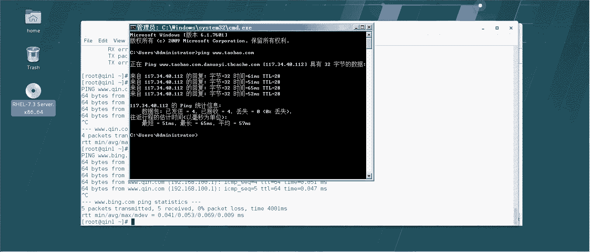

# 【云知梦】Linux实战中级篇／RHCE认证／RHEL7／CentOS7 - P4：第4集 Web服务器(二) - 云知梦官方账号 - BV1iV411h7ia

우。🎼，好，那接下来呢咱们介绍一个这个虚拟网站的这种技术啊，虚拟主机啊呃这个技术可以说是这个网站里边是相对来说在企业生产一线啊用途最多的啊，这是什么意思呢？比如说。比如说咱们那个呃互联网上。

比如说新浪啊呃百度啊，什么淘宝啊这些网站，它可能是一个网站，它可能是多台服务器啊，什么意思？就是说它访问量非常大嘛，是吧？所以说他可能在北方啊、网通的南方电信，他要在不同地区啊，不同的这个这种网络环境。

它要架很多服务器，以满足它的需求啊，这是一种情况。那反过来说还有一种情况，什么情况呢？就是说不是所有的网站都有这么大的啊，有很多企业的网站它很小啊，小的什么程度，他可能是只是说访问量只有几千几万啊。

或者说这种访问量他可能独自去弄一台服务器呢，不知当的啊，你像这种级别的网站，像什么新浪啊，百度它可能说得上几万台服务器啊，满足他需求。那你比如说小网站小的的话，他可能说你给他一台服务器，它都浪费啊。

而且他一台服务器买服务器啊，好几万。然后那个在租用这个南北什么双路的带宽这个投入。他来说可能它有点大啊，那么这种网站怎么办呢？他一般就使用咱们马上介绍这技术，知道什么呢？叫虚拟主机啊，这是什么意思呢？

就是说呃在一台服务器，一台硬件服务器上可以同时架设多个网站啊，你像这种是一个网站需要多台服务器。那小网站呢呃正好跟它相反，可能说呃多个网站搁在一台服务器上啊，这样来说，它相对来说比较省钱。

它不用去专门租动一台独立的服务器啊，他只要去租用什么呢？就是互联网上有这种专门做做这种业务的啊，他把这个服务器架好了之后，因为它性能很强这种服务器，U2服务器。他做了这个虚拟主机技术以后呢。

它在这一台电脑上啊，可以同时架设多个网站啊，这个你比如说咱们国内做这种业务的。比如说万网啊万网可能比较有名啊，但是我推荐大家千万不要去，为什么呢？万网挺黑的，它这域名什么现在还便宜了。

你看点com35块钱以前我记得关于域名就得能一两百啊，包括你像你其实只要搜这种就是虚拟主机业务啊，虚拟主机你可以看到很多啊，只要是做这种业务的，一般来说啊都比万网便宜都比万网便宜啊，这些都是做这个的啊。

那么你比如说看啊你看万网上主机服务啊，它里边就有这种啊，就是咱们一会马上要讲到这个技术虚拟主机什么意思呢？就是说它这服务器架好了，你看啊它你可以比如小公司的网站或者小型的网站论坛什么的。

你可以跟他来买空间啊，你比如我这网站，我很小那我比如说我买这种套餐两个G的空间放我网站可能够了数据库，如果网站动态的，我可以要带数据库的啊现在的网站一般情况下都带数据库啊。那么这种网站啊。

月流量不超过30个G啊，一年你只要付给他298就行了啊。你一看就明白，就是这台硬件服务器上不可能只跑你这一个网站，为什么呢？要不然就赔了。他这服务器多少钱是吧？租用这带宽多少钱啊，所以它叫什么呢？

共享的虚拟主机啊，共享的。实际这边有的你看是独享啊，它在底层实际上也是一台硬件服务器，它是怎么回事呢？它其实用一些虚拟化技术啊，在顶上给你跑几个独立虚机就号称是独享的，实际上来说我跟你说。

你可能啊一个月100多块钱给你一台独立服务器，那是不可能的啊，那么就这种啊，相对来说在这种外部服务器的应用啊，这种虚拟主机在互联网里边应用非常广泛啊，因为因为什么呢？因为挣钱啊，你说这玩意儿能挣钱嘛？

你比如说我给你算笔账吧。你看啊这一个空间是两个G啊，咱们拿计算机算算啊，这一个硬盘有多大呢？服务器上硬盘，你比如说咱们班最小算最小按一个T吧啊，当然不可能这么小啊，一般服务器上硬盘呃一个T。

咱们就拿一个T算，一个网站租用两个G是吧？除以2那这个服务器上一个T的硬盘可以给512个网站啊，那么这个网站呢一年租用298啊，你乘以个298啊，这就是这台服务器，一个T的硬盘的服务器。

可以说是很很很初级的服务器，都不是那种特别贵的服务器啊，能给这个企业一年带来多少利润呢，这是个10百千万10万15万的利润啊当然在生产一线服务器的这个数量。

你不可能这你做这个云计算中心或者这个呃IDC你就一台服务器，对吗？啊，所以说你肯定是多台硬盘也不可能那么小啊，当然还有更高性能的服务器啊，所以整体来说，其实做IDC机房啊，做什么，非常挣钱。啊。

你你可能觉得说哎呦我去应聘这个linux这个就是给他做这运维啊，一个月给个万八千的是吧，你还觉得挺高。其实相对来他说呀，你你这公司啊呃就根本就不占成本他最大这个钱嗯，你说他盈利这些钱干嘛呢？

他可要费付这个服务器的费用啊，租赁的费用带宽的费用啊，场地的费用，至于你这个运维工程师的费用啊啊，嗯。占其中很小很小一部分啊啊这这就是咱们说这个啊共享的这个虚拟主机啊。那么这种技术在企业生产一线来说。

应用有三种方式有三种方式啊，第一种第一种来说就是基于域名的啊，你比如说我这服务器上搁好多网站那我这网站来说，比如说我这网站就主主机服务器嘛，我就这一个IP啊，这台主机。

那么大家如果想就用这一台主机上网啊，把这网站共享出去怎么来区分呢？他们域名不一样。那我可以做第一种方式是基于域名的，实际这种方式也是生产一线用的最多的啊，你比如说我现在有两个网站。

一个叫3W点勤点com啊，一个叫3W点冰点com啊，有这么俩网站，我都想搁在我现在这台这个服务器上啊，共用这一个IP地址啊，但是人家如果说打I浏览器敲这俩网站还得访问的不同的地。

就这俩网站内容肯定不一样是吧？啊，这种技术就叫虚拟主机。那咱们怎么做呢？

首先来说我得这俩网站我得先有啊，咱们就不做整站了，还是像前面一样，咱们做一测试页就得了。我首先这俩网站，比如说呃秦这网站我放在word下3W下HM下啊，我放在word3W下建一文件夹啊。

然后我再建一个叫冰的这个文件夹，这好比就是这俩网站。那么一会儿呢人家如果访问这个网站，我就给他指到这个文件夹去啊，如果人家访问这个网站呢，我就给他指到这个文件夹啊，这样能达到说不同的网站。

我不同的地儿是吧？那么我这两个网站建好文件夹的，我里边做个测试页吧。😊，还有口琴麦边。到这个。琴下我做1个ind点HTMR啊哎。少打压啊。我等会儿啊。嗯，琴下哎，你看我得把这删了。好，这回就一个了啊。

你看word下三大个琴下只有这一个文件啊。你如果ca一下这文件你就知道了。一会儿如果人家访问这个网址3W67点com，我就给他指到这个文件夹下，让他访问这个页面去啊，那么冰那个网站同样。

我还扣一个冰well到哪呢？到沃尔下3W。钉这个文件夹下，我也建一个ind文件。好了，然后呢这俩网站呢，我现在域名还解析不了，你看啊，因为我没有域名那个DNS服务器啊，这个DNS服务器是后边讲。

那现在我怎么解析呢？就是人家现在打开网页敲3W7点com，你解析不成IP啊。呃，咱们生产一线来说，一般是做DNS服务器。那整个网络中呢通过这个DNS服务器，就可以把这个域名解析成IP了啊。

我这IP是这个100点1啊，但现在它解析不成这IP那怎么办呢？我们可以用这个host的文件的方式。😊，这个文件呢是管解析的啊，这文件是管解析的，它就可以把你的域名和IP做一个一对一的映射。

但是它跟DNS服务器的区别是什么呢？DNS服务器你在这台机进上布了啊，整个网络中只要是把DNS服务器指到这儿的，都可以解析。这个hoss的文件只对本机生效啊，只对本机生效啊，我添一条解析记录100。1。

7点com再添一条。哎，好了，那这个时候我再去解析啊，P3W点7点com，它就能够我把这个域名解析成这个IP了啊，以及呢我平这个。兵点com哎，你看它也能把这域名给我解析成IP啊，这个其实很有用啊。

这个其实很有用。咱们讲到DNS再讲DNS那块，我跟你说，不是说加DNS这hose没用了，这很有用啊。这有什么用啊？你比如说你在生活里，你这个windows服务器啊，或者你家你那windows的主机。

它也有这hoss文件啊呃你要是把你那个主机上那hosse的，你把它改了啊，注意啊，在这个解析域名的时候，首先来说呢。他是先听这hos文件的，然后才去问那个DNS的解析啊。你比如说我给你做个实验啊。

什么实验呢？你比如说啊你看啊，你看我比如说我现在你你这个我这windows这边，我windows这机器，你比如说我拼下3W点儿。淘宝点com。你看它能解析出来一个地址是吧？这是公网地址啊。

windows实际上它对应的也有hoss文件啊，这它在哪呢？在C盘下呃，windows下应该是在sstem32，然后我找找这儿呢。

下面应该有一个叫drivers，这ETC下host，你看windows也有这文件啊，这个功能啊跟linux里下这host文件一样，它这里边储存的什么？就是这域名解析信息啊，你比如说我用这个记术本打开。

我在里边也填一条，我刚才你看啊，我刚才我拼这个淘宝返回来出来是一公网地址吧啊我比如说我在这写什么呢？我写127。0。01然后呢我呢把这写3W点淘宝点它的优先级是比这DNS服务器高的啊，你看我保存了吧。

我再拼淘宝，你看他返回值返回我本机了，那你可以在你本机上呢自己加一淘宝或者加一什么这种购物网站，京东也好，网上有源码啊，一会咱们可以给你演示，怎么从网上的源码，你自己做一动态网站。

然后呢你可以这个在这个双十一之前啊，如果你防止你们家要是有这个败家的是吧？提前你可以做这个工作啊，你到那天起码来说他上淘宝可能就上不去了他上淘宝京东，你最起码你不会弄网站，你把这文件改了。

他那天可能发现哎上不去了，这天能减少你不少经济损失啊。当然你要是技术稍微再强点的，你可以。考虑这个弄点这种钓鱼网站啊，模板，你给在本机，你把这链接呢做好了，他一上这淘宝呢输密码那块账号密码你就劫持了啊。

你可以通过你看作为一个技术宅男啊，你简简单单通过一个后se解析，你可以重新掌握家底账号，银行的这个账号密码啊，这是咱们开个玩笑啊，这瞎掰的。但是从此呢就是说通过这个你理解一下这houses文件干嘛的啊。

这hos文件可以去把咱们这个主机的IP地址和域名进行一个解析。而且它优先级最高啊，优先级最高。你可以看到我做完那解析以后，DNS的解析结果都没有了。它优先听这个的啊，但是它相比跟DNS它不能带DNS啊。

区别在哪？就是说这个解析只对本机生效啊，就是说一会儿你比如说琴二上你看啊，我现在琴一上我做的这解析了啊，我现在P3W点。琴点com是吧？我能解析出来成以IP吧，你换一台机写，你比如说到琴二上。😊。

你再去拼3W点琴点com，这是不行的这是不行的，为什么不行啊？这点上没有那hos文件。所以说这个的缺点是只对本机生效。所以你要想回头这个秦二这个机器也能访问，你得在它上面也得改这个ho文件啊。

这就是它不如DNS服务器的地了，你别它优先级比DNS服务器高DNS服务器是什么呢？你这一台机器上做了以后，整个网络中只要是DNS指导指到这台机器上，整个网络DNS系录全有了。

你不用每台机器给它做hoss文件啊，你这个做完了之后，你再拼3W点，你看这是秦二啊，你可以看一眼这个IP是。100。2啊，你再拼一下这个3W点。勤点汤，你发现他也能解析成这个了。

因为他自己的hos文件也被我改了啊，咱们在没讲DNI服务器之前，咱们用hoss文件，把每个主机的hoss的记录里边填这两个信息，它就能解析了啊。那我现在这个网站也能解析了啊，网站的内容也有了是吧？

我建议文件夹里边给俩测试页了，剩下该干嘛的，就是改咱们这个呃hos就改这个ETC下这个。HTTB下这个conforrl下载HTTP这个文件啊，但实际上官方不推荐你直接在配置文件改，它推荐什么呢？

你自己如果要写规则，你在这个底下改，他不是说了吗？他读的时候会把这底下的这些这个文件夹下星点top的文件读进来。他建议你自己写的这个规则写在这底下啊，那我怎么写呢？我要这么写。嗯。

ETC下HTP下cfor下。ctrorl点地下。他建你写在这儿啊，你比如说你秦那个网站和兵这个网站，你配置文件最好单独分开写勤点com啊，这个啊这个怎么写呢？它有标准格式啊。

这标准格式实际你要是记不住的话，你可以参考ETC下这个配置文件里，其实它有类似的这种写法。你比如说。比如说他这个我想想啊嗯我们搜一个关键词，比如说。他其实这里边有各个段儿。So，我。root嗯。

我们还是搜这个，他有可能是。你看它里边有doment它入的什么这样，但是它写的比较松散。实际上我们这个配置文件里所有的语法，它这里边大部分都有，它这里边大部分都有啊，我就不参考它这个吧，我给你单独写。

我建议这几行呢，实际上是这样你不用背啊，但是你写多了，其实自然也要记住了啊，勤点com这个呢相对来说你自己这网站你怎么写呢？这么来写啊，首先你这不是虚拟主机嘛？哎，虚拟主机这么表示。

viual host啊，这叫虚拟主机啊，我这虚拟主机叫什么名字呢？3W起点com它对应的IP是这个。呃，默认端口80啊。哎，这么写注意啊，在这个阿帕奇这外尔服务器的语法里，那个头啊。

这这是对housest文件的头有这个头必须得有这个尾尾呢。这么写啊，visual host啊。vitro host啊，有这个头就得有这个尾啊，这是一对写在里边的东西。

就是对这个vi house的这个描述啊，对它的描述啊，这个其实按照官方要求呢，其实这个V啊，包括这H啊是大写的。但是呢其实生产线不用，为什么呢？因为这个外这服务器这配置文件的阿帕奇它对大小写不敏感啊。

然后底下写呢serv呃，这是什么呢？就是说这个网站如果出事的邮箱发给谁啊，你要记得刚才我讲的配置文件里应该有这行是吧？那这发给谁，你比如琴com，你就发给秦艾特呃。7点com发给他啊，然后呢要写什么呢？

呃，servword name就是这服务器啊，这这网站叫什么名啊？serv name这网站叫3W点7点com，这是域名是吧？它然后呢，这网站访问这域名指到哪呢？document rootot。啊。

指到哪儿呢？指到word下3W下琴下指到这文件夹啊，这个呢是什么意思呢？就是说这个网站，如果人搜这网址解析出来到这服务器上了吧。

到这服务器呢解析出来是这个IP这个这个80端口这个IP然后呢就访问这一段啊，访问这一段啊，然后还有什么呢？Custom。custom log啊，这是它的系统日志啊。

你对每一个网站你要单独的记它的这个系统日志，系统日志记在哪呢？比如说我记在word下log下HTTBD啊，注意实际上默认的啊，这个地儿是有这个文件夹的。

log下SDB你看他默认给阿巴奇分了一个这个文件夹，阿帕奇的默认的这个官方那个刚才那网站的默认这个配置文呃，那个日志就记在这儿啊，你可以在底下接着写嘛，是吧？这个的这个网站呢我格式比如说就继成什么呢？

3W点7点com啊，杠。CESSacces的这个。呃，log日志啊，access log日志，然后呢，后边加一个common啊，这是标准语法。然后还有要记一个erero log，就是错误日志也要记。

记在哪呢？就也记在这个腕下。log下下这个叫3W点com的什么呢？这叫 log啊这个啊这一段是他这个标准写法就tro表示我这是一个虚拟主机的描述啊这虚拟主机呢对应的IP是这叫基于域名的虚拟主机就域名不一样。

这俩虚拟主机它俩区别域名不一样，这叫基于域名虚拟主机啊，什么意思呢？人家如果访问我这个网址，这个域名那我就解析到这个IP啊巴根端口的这个位置啊来访问。

如果他有什么日志呢访问正确访问的日志记在这错误访问日志记在这如果有什么毛病，发邮件发给他啊，这就是一个完整的一个网站啊好了那这个写完了呢，我们设发还有一冰那网站啊，冰的网站你不用写了。

你就直接把这个这哥们拷贝一份就行了。勤点com的吧，咱们再来冰点com。呃，注意啊，这有点小毛病。你看啊，刚才我这个是VM7点com，后面没加cf啊，这不行，为什么不行呢？

它读的时候是读这底下所有点cuff结尾的啊，所以你看我这么一改，我就把它后边改名啊，MV用MV来改个名，c点第下，你看我现在就是时候起点com点cuff，它就会读这个了啊，然后那个冰点com的怎么办呢？

我把这个再拷贝一份到冰点儿com点CO。啊，考完了之后呢，我得改不改怎么改呀？嗯，把这里边所有的。把这个里边所有琴的换成冰。哎，好了，那你看一眼是不是这意思，人家访问这个网址。

3W冰点com也会知道这个IP的搬元端口。然后呢呃指道这个文件夹下正确的日志发给他呃，正确访问日志，错误日志发给他啊，发给他。哦，你看这还真有点错，错误日志这儿这应该是什么呀？

这应该是个点儿啊3W冰点com。然后然后呢如果有问题邮箱发给他啊。好，那相应的我前面那琴点com那个应该也有点小毛病。这有时候写啊就不认真啊，不认一不认真呢，这就麻烦。不过也没事儿。

最后出来报错什么的都有啊。好了，那么勤点com和兵点com有了。但实际上你要注意啊，实际上还没完，我这其实是还有一网站，哪个呀？就是这个咱们默认不是访问31。2168100。1，它不是还有一网站吗？

这网站指到哪儿。这网站这网页不是在这儿呢吗？默认不是就这系统默认网站嘛，是吧？就这个刚才咱们那秦斌那网站是吧？这个其实建议你也写一个配置文件，为什么呢？要不写，容易这个默认网站跟他们有冲突啊。

一般那个咱们系统默认这网站呢，呃我们可以这么写啊，你比如说你还是把这个勤点com或者冰点com这个。也复制一位呃，复制一个叫什么呢？复制一份叫零点c就行了，你就知道他是谁了啊，或者说我们复制一份叫。嗯。

就就就。就叫什么呢？1。2。1。8。10。1点c谱吧。啊，遇到这个点靠谱，然后呢，我们也可以再编辑它一下。嗯，稍微改吧改吧，那地址还是指到这儿，如果出事了呢。毕竟这是主网站嘛是吧？

这个域名呢也不是这个英文域名，这英域名直接用VIP是吧？这个只到HTML对吧？这不是仨网站嘛，是吧？如果有事了呢，如果有事了，就它系统默认的会有一地儿啊，系统默认有一地儿，就是发那个地儿就行了。好了。

这就行了啊，实际上你不写额外计制制，这网站也能生效，甚至你不写这行也行，就是我完事了，我不发那个邮箱行吗？也可以，这两句是不能少的啊，serv name和 document root，这是不能少的。

就是我那网址是什么？回头访问哪个地儿，这是不能少的啊，好了。我现在这仨配置文件啊。这是三个配置文件啊，看一下，其中呢这个是我默认word下指的那个word下3W下ETML底下那网站，就是默认那主网站啊。

这两个呢是我新做的两个网站是吧？然后呢咱们把这个。HCTPB咱们给它重启一下啊，重启一下。注意啊，如果你重启的时候有毛病，比如说你配置文件哪写的有毛病，它检测出来了，当然像日志那种的可能检测出来。

比如说有大毛病，他这一定会给你报个错，让你看日志去啊。如果检测出来没毛病啊，或者说你再看一眼这儿。你看这还是装订是吧？这就说明没毛病啊，这样就说明没毛病，没有什么提示字儿，什么红字那种的这是正常啊。

正常的话，你就可以检测一下，怎么检测呢？你首先你看直接输IP，这还是那主网站，对吧啊？3W点起点好。你看他直接跑到那个word下3W琴下，那网页里不是写的是琴外边嘛，是吧？

你要是访问3W点冰点com你看跑到兵边啊这三个网站实际上共用一个IP但是呢你这域名不一样，它访问的位置不一样啊，分别指的word下3W下三个文件夹啊，这叫基于域名的虚拟主机。

他们仨的区别是靠域名来区别啊，域名不同知道的位置不同啊，同样的在别的这个主机上，你也可以去做这个但然前提你还是得文件能解析啊，或者说咱们后边那张讲的DNS你能解析这域名才行。咱们打开一个火狐的浏览器啊。

咱们去看看是不是。怎么回事？啊，呃首先3W点秦点com回车啊，你看前外边是吧？然后呢，3W点冰点com啊，冰外如果你直接访IP呢。他指的那默认网站秦斌啊，只过像3W点M下了啊，域名不同，指的位置不同。

那么靠域名区分这不同的网站啊，这叫基于域名的虚拟主题啊。当然我演示这就这么几个网站，生产一线，你可以再来很多啊，3W点什么新浪百度什么，你自己做实验的时候，你可以多做几个。

你记住只要多做一个多做一个网站，你就在这个。底下多一个配置文件的事儿，对吧？多一配置文件的事儿啊，多一个配置文件，你把它的信息写进去啊，按照我这格式啊，按照我这格式把它写进去啊。嗯。就这个基本格式啊。

我们再看一遍啊，要写这么几行。第一个服务器的域名是啥啊，然后呢，指到哪个位置啊，邮呃邮箱可以不写。其实自定义的这个访问日志也可以不写ilog也可以不写啊。然后呢，这个网站指道哪个IP哪个端口啊。

we house的头和尾啊，这就是标准格式啊，你不用死记硬背，你只要这一段你记住了，然后再有新的网站，你直接拷贝过去，改不改不就行啊，包括咱们看一眼这日志生效了嘛。word下的log下的是吧。

HTTB下的。哎呀。table播两天，你看这不一堆嘛，什么勤点com的冰点com这日志都出来了。你比如说咱们看这个3W点勤点com的这个access log访问日志，你看这不都有吗？是吧？100。

1的访问记录，100。2的访问记录它都有。这是咱们说最初级的最基本的这个啊，但是也是用的最多的这个基于域名的虚拟主机啊，那除了基于这个域名的呢，咱们还可以基于什么呢？

咱们还可以呃基于IP就是说我这俩两两个网站啊，比如说我这还是一个服务器上，我支持多个网站，但是他们不是靠域名来分配的，靠什么呢？IP不一样啊，那这实间怎么做呢？这么做啊，首先咱们把这个先还原了吧。

来我先还原个快照啊。来换个开照。

朋完拍照咱们重做啊。嗯，基于IP来说呢，那首先你不可能只有1个IP吧。你看我现在这不只有1个IP嘛，是吧？100点1是吧？IPA点R那么我要想增加EIP呢，咱们前面讲过怎么增加，就是说NM是吧？我说了。

你前面如果碰到我讲的不会的，你再翻翻前面初题课去啊。😊。

1233，我给他加1IP怎么加呀，直接加号是吧？IPV4。点ad，比如说我给加一个什么呢？1。2。168点100点，原来不是一嘛？我再加个11吧啊，杠24位的。行啊，M给它当一下这inS33。

然后我再给他再up一下啊，咱们到中极课可就不再细讲这些是为什么了啊，你用e看不出来，你必须得用IPAD点 show。这么着，你看这是不是一和11这机器上一个网卡绑俩IP当然你可以怎么着呢？

你或者你要实在不愿用这方法，你可以在这儿你添加一块网卡，再给那网卡设个IP一样啊，一个意思，反正呢这个这个技术是得是多个IP啊，靠IP区分啊，那怎么区分呢？那这回好办了，咱也不要域名了。

咱也不用域名解析了。这俩网站呢，比如说我让它一个指到1上，一个指到11上啊，啊，那我既然还原快照了啊，我这。还得把这个ADB重装一遍，把这个还得重装一遍。就你现在能理解为什么前面那呃有一张我让你把这个。

环境做好了吧，是吧？呃，然后呢我看啊配置文件。我现在默认什么都没改啊，我现在直接来改吧。😊，crl点地下，你看现在底下还是这几个初级文件啊，那我改几个文件怎么改呢？首先比如说。现在我默认还原快照之后啊。

我是什么都没有的啊，我给你看一眼，现在应该是那别那测试页什么都没有，你要直接打192点198。100。1，实际上指到哪啊啊，我这服务还没启动。是对，是。St。嗯，CRT好，启动起来之后。

默认它会指到这默认页，因为什么测试页都没有嘛，是吧？啊，那这俩网站我怎么做呢？我比如说我这么做。啊嗯。MKDR。word下3W下，比如说我建一个叫1的文件夹，我再建一个叫11的文件夹。

我拿这俩网站分别对应我IP1个19210011988100。11个对应100。11。我做两个测试页啊，测试那个来Ile1外边这么测，是不是不容易看清楚啊？我想想啊。就是。100。1mic口到这个。

word下3W下一。这个文件夹下inD点HTM。然后呢，icical个11到这个11底下。这回来反正得仔细看啊，这两个网站啊，一个那个网页写的是1，一个写的是11啊，然后呢嗯直接也不用后字解析了。

因为也不需要域名了。因为这俩网站也不是靠域名区分的嘛，是吧？直接这个写配置文件就行了。😊，cfor点地下，我先编一个1点口。哎，有点靠谱，怎么写呢？还是建立虚拟主机嘛。viual host是吧。

vi host，然后1点168。100。1，还是指到这个地儿是吧，指到这个地儿的。然后呢。ser咱们就不写那么多了啊，就写最基本的就得了。serverer root吧。

s server name啊serv name server name是192。168。100。1，我就直接拿这IP当域名了啊。然后呢，document root我直接指到这个word下3W下一啊。

指到这个地儿啊，然后呢。没tro host行了，一收尾拉倒了。CP这个文件到什么呢？到11这，然后呢，VIM这个啊，对了，这说一下技巧啊，你看我这也没打这啪机就出来，这怎么做的呢？这是用的alt点啊。

alt点是一个快捷方式，摁住al摁一下点，你别从手那alt啊，然后再摁一下点，每摁一下点，它会把上一条命令的最后一个参数给你列在这儿啊，你比如说alt一下点，它是上一个的上一行就这一行的。

你看最后一个参数，这不11点c吗？啊，我如果是再上一行的，想要弄这个怎么办呢？就alt摁住了，摁两下点，你看就跑到这个了，你每摁一下点就是往上一条命令的最后一个参数这么这快啊，生产一线好了。

我编辑这个文件是吧？嗯把一的地都换成11吧。如果我访问的是11这个域名是吧，那就指到这个IP上来。然后访问的位置呢是这个位置。保证退出啊保证退出。然后呢。是字么ctlre start HTTPD。好了。

重启一下咱们这服务啊，然后呢咱们再验证一下啊，你看我现在指到100。1，我刷新一下，你看直接指到这了是吧？如果是100。11呢，回车，你看指到11那外边那地儿了是吧？在这别的基器上也一样。😊。

别的机器上一样，你比如说100。1啊，我刷新一下。你看知到100。1了，那个网页是吧？100。11呢回车知道100。11了，这个没有域名啊，那这两个网站是靠什么区分的呢？是靠IP不一样。

所以这叫基于IP的虚拟主机技术啊，基于IP的啊。那实际上除了这两种之外呢，还有一种叫基于端口的啊，咱们前面你看都是基于80端口是吧？那其实按端口不一样，也可以区分啊。那咱们再来还原快照啊，再来还原快照。

咱们再看看这个基于端口大啊，这越往后啊，在企业中用的越少，用的最多的还是基于域名那个啊。

那么这个基于端口的这个首先来说啊，咱们还是得先把这先装上。啊，其育端口这个。呃，基于端口这个呢首先来说不仅仅要做两配置文件，你还要干意这事儿。因为默认咱们系统，咱们前面讲那配置文件的时候。

咱们说你默认咱们系统配置文件，你是不是只只laen了这个80端口啊，你看这儿啊，直接从这个端口的。你如果回头说这俩网站，一个是通过80端口过来，一个通过别的端口过来，那你在这儿。

首先你还得加一行加哪行呢？你比如说咱们这俩网站基于端口的虚拟主机嘛？呃，一个是80端口的，一个是比如说8899的，那你得怎么办呢？YYP。你在这先把这端口加上8899。你要不加一端口，人都不监听你啊。

你你你不信你现在我没次重启配置文件，你看看他监听谁啊。哎，不对，我这系统输入什么都没起来。哎呀，这还得你比如说啊我再麻烦点，我把这先注释上啊，你默认如果不加内行。😊，哎，HTTPD写错了。

你看啊n state咱们前面其实也搜过NNTULP。你这样IP一下，你看你默认的它只监测这80端口，你在配置文件里，你必须把这行加上之后，你看啊我把这注释再打开啊，你加上之后。然后再重启一下。啊。

这都明白什么意思啊，我得重启一下啊。重启一下，然后你再nex state。你去看你看这个时候它才会坚强这对源口，否则的话你这时间肯定做不成啊，肯定做不成。他得你把这接口得加上。

然后这俩配置文件呢大同小异啊，那首先咱们还得建立这个。😊，比如说一个叫80哈，一个叫什么呢？8899啊，咱们再挨口俩文件。80的是吧，沃尔下3W下80下。ind点HTML啊。

我们其实就是通这种技术反复折腾呗。这三种技术，反正最后达到的目的就是一个服务器上，我得有多个主网站能运行是吧？然后呢，我们再去编辑这个配置文件。那可能到这儿来说，大家有的就哎稍微明白点了啊。

这就是每一个网站一个配置文件呗，是吧？啊，然后呢。Wtro host。162。168。100。1，这还是只有1个IP1个网站过来走80啊，然后呢。ser name网站名字，1。2点168。10。1啊。

他俩都叫这个都叫这个名字。然后呢，document root这个呢。啊，给他指到这儿。发明上去，然后呢。啊。好，CP1分，这哥们儿到8899，咱们再来一个配置文件，叫这个8899的这个。然后呢。

我们编辑下。是吧这回这网站注意改哪啊，改这个地儿。注意改这个地儿。什么意思呢？还是这个网站域名过来，如果是进走8899端口过来的，就去这个地儿读网页，读网站去啊，它是靠这个端口来区分多个网站的虚拟主机。

好了，重启一下啊。好，那咱们再来看一下效果啊。打开。我们来看1168点100。1，你要什么都不输，默认走的其实就是80啊，默认它默认网站走的就是80，你也可以加上80啊。

但是如果你想走8899就一定得写了8899。你看这回走过来是8899这个技术在企业一线中一般干什么用呢？就是也是一种稍微设点密的网站啊，他希望你啊光IP你设密不行，因为人家一扫能把你所有的IP扫出来。

他有一些特殊的网站，他让你走别的端口啊，这个端口来说，他要不知道他光知道你这网址域名IP没用啊，那端口他一般也是稍微有点机密风险的，他搁在这啊，这样的话那单独摘出来一个也好办什么呢？

他回头就专门监控这个端口就行了。他专门监控这个端口，他就知道啊，谁访问了我这个端口，那肯定是往涉密的这个地去这个在生产一线也设计挺多的一般涉及到有点安全的网站啊，他会把一些特殊的资料放在这，放在一些。

特定端口上，因为默认都知道网站走80或者443什么的，8080，谁能想到你去单独改一个端口啊，就是这意思啊。好，那么在别的主机上也是一样的啊，在别的主机上也是一样的。我们看一眼啊。呃，192。

168点100。1回撤默认是80。走8899的话，会指到另一个网站上啊。好，这是咱们讲这个三种方式啊，来怎么实现这个虚拟主机技术啊，这三种方式都挺有用的啊。其中最重要的是第一种啊。

那么还是要说一下什么呢？就是说再注意啊这个笔记。我笔记里边有呃这这个详细的这个写法，但是要注意的呢，就是说里边都是带着这个slinux和防火墙的，都是带这些东西的。如果你在第一次做的时候。

你说我还没讲防火墙，你把这忽略过去，说我还没有讲SElinux，你把这个SElinux的忽略过去啊，只做那个关闭防火墙这些的。但是等到讲完SElinux和防火墙，一定把这实验重做一遍啊。

还是要重做一遍的，好吧啊。

