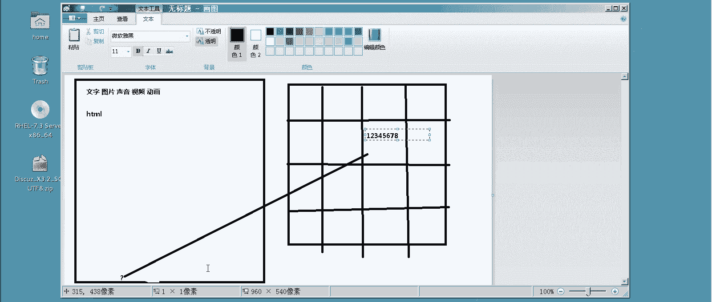
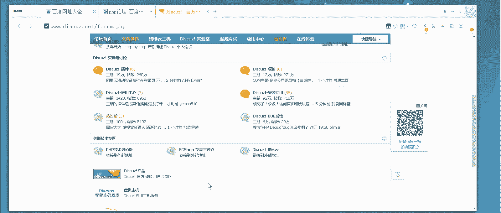
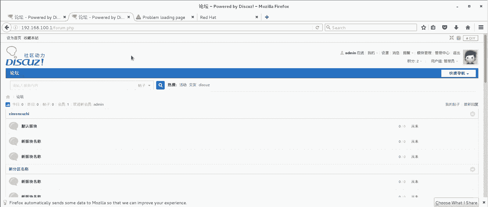

# 【云知梦】Linux实战中级篇／RHCE认证／RHEL7／CentOS7 - P5：第5集 Web服务器(三) - 云知梦官方账号 - BV1iV411h7ia

우。

🎼，那么接下来呢咱们再介绍一个呃，目前咱们在生产一线使用这个比较多的呃web服务器的技术是什么呢？就是咱们说这个叫呃lamp啊，lamp啊呃，为什么介绍这个呢？

就是因为呃现在在生产一线实际上啊使用静态网页的这种情况很少吧啊，咱们前面做测试验，你看呃作业HTMR这种这都是静态网页啊，那么什么是静态，什么是动态呢？这咱们得先讲讲啊，咱们得先讲讲啊，呃，我画张图吧。

咱们画张图呃，首先来说什么是静态网页呢？就是早先呢这个静态网页技术很流行啊，什么意思呢？就是说你看啊咱们说前面这网页，咱们里边往里边写字了是吧？然后往里边这网页里边有什么呢？有这个文字啊。

还可以有什么呢？还可以有这个图片啊，还可以有什么声音啊，呃视频是吧？还有什么动画。这种就是说你直接往这网页里放这些具体的内容啊，这种页面呢就是属于是静态的啊静态的一般它用什么来写的？

都是HTML格式的啊，呃，用什么来做呢？一般呃你要是学过以前我刚毕业那会儿我还学过这个啊，学过一段时间呃，考过一证叫什么网页认证三剑客啊，学什么dreamvi啊 dreamamvi是拿那个做页面的。

还有那个flash是用做动画的啊，呃，还有一个是叫firewall啊，firewall dfirewall啊，好像就是fireworks fireworks对。firereworks啊。

这个这是跟photoshop差不多做那个图片处理的啊，这三个软件是要倒比公司处理认证啊，现在也有现在也有专门用来做这种就是静态网页啊，挺挺挺方便的啊这个。但是呢呃随着时代的发展。

现在为什么我们说我们要去做动态呢？它是这样啊，你比如说举个例子。比如说这个网站啊这个网站是静态网站，这是一个咱们公司的一个小公司的一个企业形象网站啊。那比如说这网站最底下这这儿写什么呢？

这可能得写你公司的电话啊，电话比如说电话是多少呢？电话是12345678比如说这是电话号，说这个你公司有这个网页，这网站很小是吧？有多少页呢，大概比如说有个1万页啊，这就差不多了啊。

那么现在的网站来说比这都要大得多。你像新浪搜狐这种门户网站咱就不说了啊，就普通网站至少也得上个几万几十万页啊，以前的网站比较小嘛，都是这种就是可能100亿2000页1万页差不多了。那么比如说举个例子。

说我们公司啊搬家的，搬家以后可能电话号码换了。那你看这1万页的网站每一页底下都写着这公司电话号码，我是不是得改啊，那怎么办呢？那你只能说用追啊，或者你用什么工具打开它这1万张网页。你都要改死。

比如说你这个呃从八这块改成九了啊，那你就得把这个地儿，你把这八划了啊，我给它删了，就是给它再换成9啊，你把它再换，重新每个这一万页啊，每一篇写12345679啊，这是以前的这种方式啊，静态页面。

它的好处是什么呢？就是这玩意儿呃很这这种东西就是说它静态的网站来说，相对它比较省空间啊，都是这种静态的，然后呢比较好好编写，就制作比较好制作。就是你这搁个文字，这搁个图片很直接啊。

缺点就是后期维护的时候比较麻烦，就是你这一改动静太大啊太麻烦啊。所以说呢呃随着时代发展，逐渐就开始有了这个动态网页啊动态的动态是什么概念呢？首先来说是这样，你你要是学过数据库啊，就好办了。

比如说你学过mysrql啊，或者学oracle数据库是吧？好理解它这种动态网站就是加数据库的啊，加数据库的数据库是什么东西呢？你要简单点说，咱们后边当门有一张讲数据库讲mysql啊。

然后后边可能你要单想学再精一点学oracle什么的这些就是后边课程啊，那么比如说你现在想没学过数据库，我就跟你讲就什么叫数据库，你可以把它理解为数据库嘛，就是数据的仓库，它里边就是一堆表格啊。

一堆表格啊，关系型数据库啊，什么这种的非关系型的，它里边就是全是一堆表格啊，那么说这网站要这些表格干嘛呢？你比如说啊比如说我们还是这个地电话号码啊，这个地，比如说我这个。呃，电话号啊，我先把它擦了。

我把这个先开始改过来啊，原来那个原来电话号是多少呢？是12345678。5678啊，这个就是电话号。但是呢注意如果是动态网站，有表格这种的跟数据库连接的，他怎么做呢？他这儿不会直接写这数。

他这儿可能是打一个问号啊，类似于或者说打一个实际上是一个变量啊，一个变量一个值啊，那么这个变量呢对应数据库里的一个位置。哎呀这个。这个变量啊对应数据库里，比如说对应一个格啊。

然后呢他把这电话号码写在这个格里，写在这儿啊，这个12345678啊，是这么个关系。那你到时候你去访问这网站的时候，你调数据从哪调啊，你这网页打开打开到这儿，说这个地儿应该写成电话号了。

你会去数据库里读这个位置，然后再把它调过来显示出来啊，这是动态网站的制作技术啊，那么首先来说它的速度肯定比这个静态网站要慢。为什么呢？你这还有数据库读取的过程，再调过来是吧？啊。

所以早先那个像最早我上网那会就90年代啊，00年代那个时候是没有这种动态网站技术的。为什么呢？那时候带宽很低啊，都是猫上网啊，很低那个带宽。

我们那会儿我记得啊就是有一年我那会儿玩CS我那会儿去那个就是网吧，就下载当时世界第一狙神教你R的录像啊，就是CS那个一个帽子一个小视频。

啊很小大概有个几兆吧啊，我那天晚上去了包夜啊下了一宿，我下了多少呢，大概就下了几十兆几百兆，可能是100多兆200兆大概那个样子很少啊。为什么那会带宽就很低啊，我们那会普通话在宿舍里上网，没有宽带。

就是弄一个电话线猫啊，然拨号上网啊，就是很低的，都是几几十K的连接速度啊，所以那个年代来说呢，静态网站它的好处是什么呢？就是它不用这么占流量是吧？相对来说制作也简单，但是现在社会来说都是这种光纤啊。

有的都家里都百兆，像我我这家里都百兆是吧？直接接入，它的速度来说呢？你读数据库这个过程来说，它不怎么耗时间了，说这个技术推广出来之后，它就是你除了说它慢以外，你就没点优点嘛，优点很大，之所以它有优点。

咱们在现在都用这种动态技术优点什么呢？就比如说咱们公司又搬家了。说这个地儿电话号码又变成12345679了，那这次我们就不用。1万页也好，是10万页。我说了，现在网站都至少是几万页，几十万页。

上百万页啊，那你就不用一篇一篇改了，你直接在数据库里，这不是你这个地儿存的是电话号码吗？把这个地改一次啊，改一次，你这底下这所有这不管是上亿张页面也好是多少也好，它全都自动更新了。为什么呢？

因为这些页面它这儿打的都是问号，是一个变量啊，它从数据库里提取这个量过来赋值给它啊，那么这种好处是什么呢？就是说它制作起来当然要麻烦一点啊。但是它后期维护特别方便啊，现在的网站一般来说。

这种就是说制作都是用这种带数据库的啊动态技术啊。那么你比如说这个地儿有个比如说啊说说这个地有块天气预报，今天的天气是多少度啊，这个多少度，这就来回变是吧？或者说它很多这种只要是能变的地。

它都会把它对应到数据库里的一个位置一个值啊一个值，那么你就可以直接去提取提取这个位置啊，它对应的这些变量这些值都可以把它在这来提取这种叫动态网站技术啊，那么这种主流的动态网站技术来说呢，其实呃有很多。

你比如说企业生产一线啊，说您这样小网站呢有用AP写这个代码的。它等于不能用HTMR来写的HTMR写一般都是静态的，这个这种语言P的，其实P这种语言它是前面VB过来的啊。

你要是这个新工程师有可能听都听不着了，后台数据库一般加什么呢加access，我们上学会。B什挺火的，现在这两年也不火了啊，那么这种是做小型网站的。但是呢一般来说这种的生产一线比较少，为什么呢？

就是太容易破了数据库就是微软office带那个也是免费的吧，也不用算免费的吧，反正就是说office带的啊，功能很弱AB本身来说安全级别比较。这种网站可以说就是几分钟一个啊。

你都不用专门去学黑客什么技术，你上比如说有些黑客网站，比如么黑白网络那种你随便当点工具破了啊，现在生产一线用的比较多的啊。PP啊用这个写前台的页面加什么呢？mysrl数据库啊，拿这个做的，这个挺多。

中型的一般网站差不多全用这个啊，中型的中型的这种网站实际在互联网里占有率是最高的啊，你也不是说说哪个公司都做一网站像新浪搜狐百度那么大是吧，中型的这种的占的是最多的啊，那么这种结构也是最好的。

因为它这两个PP技术和这mycirl技术都是开源的啊都是开源的啊，然后呢还有什么呢？比如还有JSP的前台页面还要拿GSP写的，还有什么拿这个呃点net写的很多啊，这种编程语言现在很多啊。

JSP实际就是java的一种程序啊，那么静态网站其实往后也有发展，一般静态的它也也能实现一些动态效果，它比如加一些什么呢？就是java的。Scr。这些都超大纲了，我就介绍一下，你了解一下得了啊。

他用来写一些动态的一些脚本也可以啊。那么这是整个咱们讲什么叫动态网站啊，给大家简单介绍一下。因为这个毕竟不属于咱们linux正客啊，那么咱们今天讲的lamp就是这种技术啊。

那你说你拿1个PA加mysql的写的这么一网站主程序啊，你在外部服务器上，阿帕奇上，你怎么去给它发布出来。那么这整个这一套技术，有一个名字叫什么呢？叫LMP。就这个啊你可以百度一下啊，你可以百度一下。

你比如说。

哎，我给你把这个。放小一点看一下啊，你比如说你去百度LAMP啊，你可以看到有很多啊，那比如这个啊LAMP你看一眼。

他是什么意思呢？他是这个意思它是一个缩写啊，它是一个缩写。这个L就是代表linux。首先来说这个环境是搭建在linux平台上啊A呢就是代表阿帕奇啊阿帕奇的外部服务器啊，他来做外部服务啊。

然后呢M是什么呢？买circle或mar啊这俩实际上是一回事啊，这俩咱们后边有一张专门讲这个啊，就是说这mar啊，实际上就是买circle数据库，他是一个哥们开发的为什么一个哥们开发俩呢？

这不是cirqcle被oracle收购了嘛，那哥们怕这个回头有一天oracle再把这玩意闭源了，现在还开源的啊，但是oracle商业公司，万一闭元怎么？就又开发了一个99%一模一样的这么一数据库。

用他闺女的名字，他闺女叫mar啊命名的实际这俩是一东西啊，那么这是M这P呢代表就是po啊，这叫3P和一你这三个P哪个P都行，那他开发的这个。啊，一般来说在生产一线这个多啊这个最多这个最多啊。

这两年虽然这个python比较火，但是网页这块来说还是pP啊，绝对的江湖地位啊，它还是比较多的。那么一般来说这个结构啊。

我们在linux操作系统上搭一个阿帕奇的外服务器把用serv数据库和做的这种整战程序发布出来，供大家浏览的这个组合叫LMP技术啊这个技术跟它对应的来说呢，还有一个叫LNM啊。

那其实以前你前面课你要听明白的，你应该能大概能猜到这个区别在哪，就是把这个阿帕奇换成了N啊，就这么点区别，把这个阿帕奇外服务器换成了N别的都一样啊，别的都一样啊，没什么大区别。

那么咱们这节课主讲肯定讲这个啊回头你再把N学完了NM一模一样啊，没有区别，这是咱们讲这个什么叫啊，这是咱们这。

这个实验啊实验的前提啊。

嗯。那讲完了之后，咱们就讲一下怎么去搭啊。首先来说呢，这个LVMP咱们看一下环境啊，L咱们有了，这linux环境有了啊。嗯，A呢咱们也可以有是吧？咱们装一外部服务器就完了嘛，是吧？装压化器。啊。

咱们装这A啊，把这阿帕奇装上。好。呃，装完这个以后呢，还要装什么呢？就是那M和P了。M和P呢一个是myaccle，一个PP怎么装呢？myCrcle呢就装这个叫marDB啊，注意啊呃6和7的区别。

7全用marDB它俩其实就是名儿不一样，跟mycircle啊，他俩就名不一样。你把这里也都都装了吧啊，等到专门讲这张的时候，我再告诉你这星里边都包括什么啊，服务器端客户端啊，最后装这P就是这PAP啊。

也是装星吧啊，这是先把这些哥们都装上RAMP这几个哥们先装上啊，然后说呢这是环境，环境装完了之后，你得需要程序。咱们说那网站怎么办？说这PP加myscle这网站虽然是开源的，你怎么去获得呢？

呃，实际上你在网上可以找到很多啊，你搜什么呢？PP啊源码啊，就搜这个就行了，都是开源的啊。所以我说你这好好学开源技术的好处啊，就在这儿了。

嗯，我找解比如站长之家什么这站长什么源码之家，这些地儿都行啊，里边你可以看到大量的这种PP源码啊，这种我说了嘛它都是开源的。所以说很多人写完了这东西就放网上供大家使用啊，你直接弄下来。

比如说你想做一个直播系统啊，你把这当下来啊，后台都是数据库，都是开源的，一会儿怎么进，我可以给大家演示一下啊，那么这种很多啊很多。但是有的不是完全开源的，有的可能他还让你号称叫赞助点啊，一般也不贵。

这种PP加这种买C数据库的环境，他这种来说开发，你看是P它不会特别贵的，可能要个白班的是吧？赞助一下。比如说你想做为企业网站啊，什么这种但是你要是真说做什么开家系统啊，你要真说做企业网站的话。

我推荐你用哪个呢？咱们中国做的比较好的这个得得啊。

这个。

He。好像不是这好几年没用，不是这个，这是假的。我看这是把人家顶上的嘚嘚。

应该是这个对，叫知梦，这个这个做的挺好的，这模板你可以直接下啊。包括你看它还有一个windows版的这个lamp的环境啊，就是说点鼠标那个也可以加阿帕奇什么的。这里面有空自己看啊，这很简单。

就下一步下一步就行了啊。架完之后，你可以把整站发布在这windows平台上啊。那么这个它做的就非常好，拿这个改的，这是完全免费的啊，这是完全免费的。你拿它改，可以改成很多这种企业网站啊。

你可以改成很多这种企业网站，真正要是拿它做网站的话，你看这它有很多做好的，就是各种风格那当然咱们这个课不是专门想怎么建站的啊，你要是那个有兴趣的话，就自己琢磨，前台后台怎么弄。咱们这节课讲一个论坛的吧。

论坛的话。

嗯，论坛的话。嗯。论坛的话一般模板应该用哪个呢？PP问的，还有一个叫迪斯卡柚，尤其这个这个做的特别好，都是开源的，不要钱的。其实咱们中国国内好多论坛都是拿这模板套的啊，你可以看你仔细看再上论坛。

你去看底下有写这什power迪斯卡柚这个啊现出到3。3了啊，我这个实验环境我是以前当的当的是3。2啊，就是他上一版的前一阵档不管你当哪版注意啊，当UTF8的，为什么呢？这语言字符机比较丰富啊。

千万别就当那简体中文的那个那个到时候那B5码什么那个台湾的实别不当啊，当然有的时说老师我这网站我就搁国内啊，随便那你就但是我建议啊当这个。

UTF发这个的啊，这语言集多啊，这语言机多，咱们就用这个用这个来做这个呃咱们这个网站啊，拿它来做。那么这种开源环境呢很多，有兴趣的话，自己可以再慢慢玩玩。这节课咱们实验拿这个举例啊。嗯。

首先来说咱得把它干嘛呢？嗯，我得把它解出来啊。这个啊应该是叫。就用按z这命令，就能把这ZIP包给解出来啊，解出来啊，解出来之后呢。咱们看一下，哎啊，对你默认什么参数都不加啊，你要这么解。

它默认解的当前位置，当前位置在哪，我看一下，我再ro的下，那你看root的下啊，注意啊，解出来的是。呃，这个文件夹是最有用的，有一个叫阿普索，这样我重新解一下吧，我给它指定个路径。你比如说。啊。

也甭这么的，我就让他直接解到哪儿啊，我这不网站刚装完嘛，我直接让他解在。这个底下吧啊解在这个底下啊，解在这个路径下，因为这不是网站嘛。嗯，也不行，我想想啊。我建一个路径建一个，比如说跟下我建一个就叫。

就叫。dis卡 use的这么一个文件件啊，然后呢。z root下的桌面下的这个大dius用杠D啊，指定它的解压路径，我给它解到D这个dius这目录里啊。然后你看一下这个你看一下这路径。

你看它默认解出来是这仨文件夹啊，最有用的就是up上传什么意思？他就告诉你了，他说你不是回头租一个网上空间嘛。虚拟主机啊。咱们前面讲过，说你租这么一空间以后呢，你直接就把这个upload的文件夹里边。

这就是主站程序啊，你可以进去看一眼啊，嗯这个里边的文件，这些就是主站程序啊，你看它里边有ind点PVP。这个这是它主页啊，呃，有同学说老师，你这个叫index点PP，回头你那主页打开ind点HTML。

他又不认真怎么办？你放心啊，你只要装了那PP的芯的包，它会自动的。这个改你那个主页，你看啊。这个crl。这下面你看你装完那个包以后呢，呃我印象应该是在这里边啊，你看它自动多1个P1P点confer。

你看啊自动会有这配置文件，它会把你指定下边星点PHP的添进去，看见吗？所以你它就会搜索你这目录。如果这目录有新呃原来那主配置文件是如果里边有index点THTMR的自动打开。

那么现在增加这个页面是什么意思呢？就是说它搜索这底下如果有ind点PP的，它也打开啊，但是要注意啊，你这底下不能又有inds点PHP又有index点HTMR它到时候打开的时候就会先打开那个不打开这个啊。

这两个呢它都是可以作为主页，它会搜索按数据搜索，先找着哪个页面，就先打开哪个当主页了啊。这是主页有了那咱们把这主页咱们拷过去吧，咱们把这个迪斯卡us下载up load下载这所有的东西啊注意啊。呃。

杠RF把这个里边所有的些文件带文件夹这些东西啊拷到咱们的word下3W点ATM下。靠。这样你再看word3W就默认网站这点啊，这不就是这堆网站了嘛，是吧？这堆网站呃，需要注意的是。

你这么考这不是root吗？注意啊，你回头啊，你这个阿帕奇服务器啊是用呃这个你要调用数据库啊，因为这个动态网站嘛，它有PP还有数据库。这些PP的程序，数据库的程序，呃，你再回头网站打开的时候。

你必须让它是阿帕奇阿帕奇的身份啊，所以要做一部这个称之哦什么呢。阿帕奇阿帕奇，否则那个PP那过不去啊，杠R把这word下的3W下HTMR下的东西都给它改了。这块我先不做，我先不做，不做的话。

到那儿它会报错，我让你看一眼那个错什么样啊，注意啊，这步我先不做啊，然后呢。咱们维大一下咱们这HPVD啊，注意你新装完的那个PP芯啊什么那东西，呃，因为它配置文件相当于就重改了。

因为里边不多1个PP点cf嘛，你要不重启的话，这不生效啊，所以一定要重启一下。重启以后呢，你来打开这个火狐浏览器啊，你看看这网站行不行，能不能看。100点1是吧哎。

你看默认进去打开这个ind页面就进到一个in啊，实际这是第一次引导的，时自动会进到这。他告诉你，这是第一次还右这论坛安装向导啊，注意只要是这种PP加的一般都会有这种安装向导，为什么呢？

因为它要有一个过程，把你这个网站里这些动态数据导数据库的过程啊，你就按这来吧，很简单，我同意啊，但是到注意你看这就报错了，什么意思呢？他说了他要往这些东西里啊得有一些读写权限啊，注意可写。

他这提示当前状态，他说这个这个这个页面啊，这个PP页面必须得可写但是他说当前状态是目录不存在，其实是存在的，为什么显示不存在，就是因为权限inix权限，你那是roroot它看不着。

所以它不仅是不可写不存在，因为你没有那个权限嘛，是吧那这应该怎么办？就是。

你要做郴粥的。阿帕奇，因为你这个网站它是阿帕奇用户掉下来的，你阿帕奇过去读那些rootroot的东西，他可不给你显示不可写入嘛，对吧？权限不够啊，杠大R。

你得把这word下3WHM下这些东西注意加一大R啊，把它都改过来，这样你再看一眼这底下东西都是阿帕奇了吧，你把这个页面你刷新一下，你发现可写了吧啊，那肯定可写了是吧？你现在账号阿帕奇阿帕奇然后呢。

他告诉你还有数据库里有些东西啊，下一步。啊，全新安装一个啊全新安装一个下一步。然后他说了，他说你数据库这服务器在哪啊？一般来说你这数据库我刚才不是装本机了吗？如果你这myq数据没装到本机。

你得写在mysq数据库地址。比如说我装在呃琴二上了，那我这得写19216810。2啊，得能连过去啊，一般来说就都装在本机了啊，数据库名字啊，默认值就可以数据库的这个用户名注意啊。

咱们数据库装完了还没给他设置账号密码了啊，咱们得有一个管理数据库账号密码，这怎么做呢？首先你得把这个mysqq。我说了，他俩。给它先起起来哎啊，不对，这块还是叫mar瑞DB啊。你看啊这块还是叫MDB。

你现在把这数据库，买搜数据，这mDB数据库给它起起来，然后呢mysemin这命令啊杠Uroot，然后呢。Password。这是什么意思啊？就是这意思，给买cirl数据库设置root的账号密码。

注意这个root不是咱们系统的管理员root是买circle数据库，它那个管理员也叫root。这个root指的是他这个数据库的root。给这个买servgo数据库的入的账号设置一个密码，123456啊。

回车啊，回车设置完了之后。啊，其实建议你最好再restar一下啊，其实不re大也行啊。好习惯你改什么东西的，都要重启一下数据库啊。那么你在这儿，你看数据库的用户名啊，root密码123456。

就刚才那设置那个啊，然后这还有一个什么数据表的前缀什么意思呢？就是说呃。你这儿这个前缀的意思就是说。他会在你这数据库，你回头不是很多张数据库，咱们说里边表吗？在每张表这前面加一个秦这个前缀啊。

为什么要这么做呢？就是说你回头这个还是说那句话，就是你这服务器上万一装了多个网站，多个数据库。那你为了防止这些表的名字冲突啊，你加个前缀呢。

这个数据库下现在做的这就是提供这个网站支持的所有的表前面都加一这前缀，你回头再做另一个的数据库的时候，你加一个比如说冰的前缀，那这这这表名永远不会一样啊，因为前缀都不一样是吧？

他是为了怕这个如果你运行多个论坛的时候，他怕这表名一样有冲突啊，邮箱就是说你回头出事了，给谁发一邮件啊，这你随便写就行了，给你管理员发邮件啊，管理账号，这是用于管理咱们后期那个网站的啊，这个你。

一般我设成addmin密码，我也设成addmin吧，然后呢出事给谁发邮箱啊，这就不改了。注意其实我就改到哪啊，就是root这数据库的密码要写对，前缀要改一下。

然后那网站的管理账号密码设一下addminaddmin下一步。啊，它就开始自动的生成了啊，他就问你这账号密码要不要保存呢，不用保存了啊。s werenot found他没找到我这个。啊。

实际上应该是装完了，应该是装完了。他这可能是他前几版本也有这毛病啊，你的论坛也得安装电词访问，你看应该是正常了啊，实际刚才那个过程没看着啊，这过程应该是什么呢？就是他往数据库里写写那些表啊。

写完了之后呢，这模板就起来了。但是你看现在目前这数据库里没东西啊，所以你看这论坛也不像论坛，论坛应该是就是一个大栏目，几个小栏目那样的，是吧？啊，那咱做一个嘛。账号密码都是我的面，咱们刚才设置的啊。

登录啊，他这还有验证，这是他这个程序写的啊，这程序写的还不错。你看管理员，他现在让我以管理员身份进去啊，你平时登论坛，你应该是看不着这管理中心的啊，你看我这账号管理员账号，我进去能看见管理中心啊。呃。

这个功能呢也特别强大。咱们这节课不是为了讲怎么做这个的，我就大概做做就得了。点到这论坛这儿，你看啊大栏目，比如说我这个。大栏目第一个栏目写什么呢？一般是。什么新人须知，哎呦，对我这没中文是吧？

新人须知啊。这个里边可能要添几个模块，就是大栏目里的小模块嘛，比如说什么。网论坛的规则呀，什么一些奖惩制度啊，什么这个大模块一然后底下再添几个分区，这论坛不就这样嘛？就是呃一个一个大栏目。

几个小栏目是吧？然后点提交然后呢过来你看这几个大栏目出来了。然后大栏目底下你可以再添几个小栏目啊，你比如说我这是一个呃做游戏的这么一个论坛是吧？或者做电影下载的这么一个论坛，你根据你的需求啊。

我就不改名了。做游戏的，你可能第一栏叫什么，比如说是什么这是新人须知什么，底下可能CS专区里边可能是视频录像专区啊，什么战队活动专区啊，比如电视下载的可能这是什么国内电影啊，再分什么国外电影啊。

什么免费资源区啊，收费资源区啊吧这种啊这个功能很强大，自己慢慢看吧，它里边还能账号什么管理都有啊，都弄完了之后，你把这后边这回到这主页你看出来了啊一个大栏目，新人须知底下几个小栏目是吧？哎。

大概就这意思啊，咱们这节课不是讲怎么做网站的啊，包括那滴滴那个德那个你有兴趣，你自己当下来就做一网站可以啊可以啊关了啊，那么咱们这节课主要是讲怎么去搭，咱们作为linux这个管理来说。

咱们这个环境的搭建是最重要的啊。那么回顾一下啊，先linux操作平台有了装一个帕奇服务器啊，然后装满么数据库装PP环境啊，然后呢这些都装了之后。

后呢。把你这个该弄的那网站源码包解过去啊，解过去，解过去之后呢，把服务重启一下，然后数据库设账号密码啊，也重启一下。一定要注意的是网站拷过去之后，要给他那个目录底下的权限，把它的用户都改成阿帕奇阿帕奇。

然后呢打开外边浏览器，直接去访问这个网站就可以了啊。这网站做完了以后，应该也是全网通用的啊。你比如说。

比如说我们到秦二上啊，琴二上我们打开一个火狐浏览器是吧？啊，秦二我也还原系统了。那我们到这来搜1点点168。100。1啊，你看应该也能正常访问到这个论坛啊。

包括说我们应该也可以以这个账号密码和者面的身份去登录啊，就是让我登C688啊。

好，那么这个都是这个这只要这个网站搭起来，你后边你想怎么玩怎么玩啊，想怎么玩怎么玩。那么这个啊也一样都能改啊都能改。这个整个这个技术就是咱们讲这个l的这个搭建啊。

