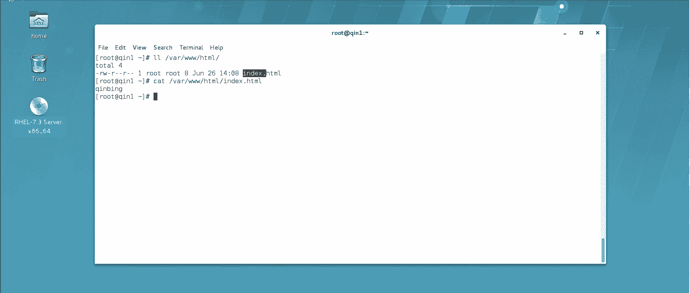

# 【云知梦】Linux实战中级篇／RHCE认证／RHEL7／CentOS7 - P6：第6集 Web服务器(四) - 云知梦官方账号 - BV1iV411h7ia

。

接下来咱们再讲一下这个软连接的技术啊，这是什么意思呢？你比如说。我之前的这些网站，我是不是都放在这个word下3W下啊，你比如说我的主网站是在这个位置是吧？啊，我这里边有一个indacy页面啊。

我看一下。呃，这页面里写的秦兵是吧？那我来访问一下这个页面是吧？呃，就是1。2。168哎呀。

点168点100。1是吧？我能访问到这里边页面啊，那比如说我在这个文件夹目录底下，就这个目录底下，我再去建文件夹往里边写网页啊，我还是能访问到的。比如说我在这个word下的3WM下，我再建一个。

比如叫什么呢？叫秦test这么一文件夹是吧？我可以再ecle一个秦test的页面。到这个文件夹底下。也叫in点HMR这样它自动会读到它是吧？那我怎么访问呢？我访问这底下的琴test，你看这是能访问的啊。

就是说我们在这个目录底下放的所有资源是可以用这种就是上下级目录这种方式去访问啊，那比如说我这个目录没放在这个目录底下怎么办？你比如说我MKDR，我在根下我造了个logo啊，我造了这么一个文件夹。

然后我建一个琴lo的页面吧。

到这个A行。

嗯，到这个。loal下去建一个叫ind的HTML页面啊，那我能访问到这个位置底下的这个页面吗？啊，这个页面肯定是不在这个文件夹底下，对吧？那我直接打的话，我肯定是搜搜索不到。你比如说我写local。

这搜索不到，对吧？搜索不到，那这个时候应该怎么办呢？我们有两种方法可以实现。一种是咱们讲这个软链接的方法啊，软链接怎么做呢？我们可以把这个这个文件夹做一个软链接到这个文件这个目录底下去啊。

软链接咱们前面初级课讲过杠S是吧？我们去把这个lo啊跟下lo这个文件夹，我们做一个到这个word3W下这么一个软链接，你比如说我就叫soft吧软件接名字就叫oft啊，那你可以看一下这个目录底下。

你看做出一个oft的软件接，它就指向了这个杠loc这个文件夹啊，做一个软链接过来，那么你这个时候你再访问的时候，这底下当然你不能搜loal啊。

你得写那个软链接的名字oft它会给你直接链接过去就直接链接到那个local跟下lo的目录了。你看这不显示说lo了是吧？这是在那个lo的文件夹那页面的内容是吧这是一种方式，就是我们会通过做软件接过去啊。

那么除了用这个软链接的方式以外呢，其实咱们。还有别的方式也可以让这个网站呢访问他呃这个主目录以外的这些呃目录信息。你比如说啊咱们再去做一个这个跟项，我们再做一个dis这个目录啊。

现在我们肯定呃主目录以外嘛，word下3WHTMR底下也没有它啊，也访问不到它。那么咱们要想访问它怎么办呢？我首先我还是。再等一下我去做。网页啊。这样呢我们来测试，一会儿来测试。

咱们最后反正访问到这里下这个页面就算成功了啊。那我这回不用软链接了，我用什么呢？我用编辑配置文件做别名的方式啊，ct在地下，我们编辑一下这个主配置文件啊，我们给他增加一个配置文件啊。

这个咱们用最简单的吧，就是。W host。给他访问到这儿去。80的。然后呢，给添个尾巴。是吧。然后这底下写什么呢？最简单的你就写s name什么的就行了，这也不用域名了。就IP吧。给他吹到这儿去。好。

那好，那我现在来说访问这个地儿啊。来，我给它保存对出，然后C增板罩。S start一下。

好，来注意看啊，我现在访问这个。重新买啊。

100。1我肯定还是访问到他是吧？那么我访问这个dis肯定访问不到的是吧？没这么个东西啊，那我怎么做呢？我这么做。啊，我首先来说呢，我在这个配置文件里，我要加入它的别名信息啊，怎么加呢？

配置文件这儿啊呃这这配置文件最简单了，我也没写什么邮箱啊，也没写什么日志记在哪儿啊，这最简单的就写到这两行就行了。那么怎么加呢？加一个al list的别名啊，list别名起一个别名，比如说我们叫什么呢？

叫这不叫秦soft啊，跟之前的oft咱们有所区分啊，然后呢它的别名指到哪呢，就指到这个dis这个磁盘上指到这磁盘上。那么就等于给这个磁盘建了一个叫秦soft的别名啊，建了一个这个别名啊。

这个别名指到这儿啊，然后呢我们去保存去出。重启一下这个阿巴奇啊，然后呢，我们看看这回能不能访问到叫秦扫。是吧哎，回车你注意啊，这回是forbidden了，刚才呢是访问不到，现在是什么意思呢？

禁止禁止是说你起码得有这地儿是吧？能访问到，但是呢权限上给你拒绝了。他说了嘛？forbiden拒绝，有don't have permission to exist这个地儿啊，说明这个地儿还是有东西的啊。

这比刚才进步了能访问到了，但是权限上给你拒绝了啊，这是为什么呢？这是因为你看一眼咱们这个配置文件啊。你注意咱们前面讲配置文件，咱们说过说什么呢？

说默认呢这个系统啊已经把根下所有的这个磁盘都做的outd了，就所有用户都拒绝了。然后他用到哪个目录，它给你ged，打开哪个目录啊，所以说你注意啊，你这儿你调用到了soft。

也就是指到那dis个那磁盘那了。那你就必须怎么着呢？你必须得做一段granted的，把这个文件夹给它打开这个访问权限啊，你可以就复制这一段，就用它就行啊，就复制这一段，然后呢，写在哪呢？

写在你这个配置文件里啊，写在你这儿啊。直接写吧，然后呢。改吧改吧啊，这目录指到哪呢？应该是指到。你那个dis就指导你的真正的磁盘啊，dis跟下disk那磁盘上。嗯，这行注释可以不要了啊，嗯不做什么验证。

然后允许所有人访问。好，这个时候你再。嗯，反问一下。再重启一下染发器啊，然后呢你再来 soft访问，你看这回就可以访问到它了，不是否逼的了。因为你现在在配置文件里加那行文件夹选项啊。

咱们再来看一下这个啊哎。来看一下啊，就是说第一个做个别名啊，在这个别名自己起啊，相对于根下你做了一个这个的别名，把这个磁盘的位置引用过来了。然后呢，你要把那个文件夹给它开放一个granted的权限。

让所有人能访问，否则就会被否逼dden啊，就会被否逼den。然后你再访问，这就可以了啊。这是咱们讲的这两个。这个。访问不在这个主目录底下的网站的方法啊。

