# 【云知梦】Linux实战中级篇／RHCE认证／RHEL7／CentOS7 - P7：第7集 Web服务器(五) - 云知梦官方账号 - BV1iV411h7ia

。

接下来咱们再看一下怎么让咱们这个阿帕奇服务器呢呃支持脚本的调用啊，那首先咱们还是。把它先装上啊，我这又还原了一次坏照啊，每次做实验之前啊，养成一个好习惯，是吧？干干净净的去。还原个拍照哈。

这么着避免出错啊，避免出错。好，然后呢呃我们再做一个测试页啊。我下3W。

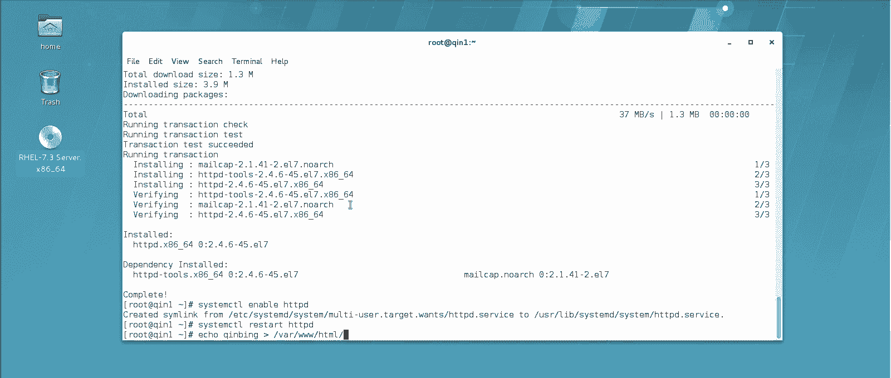

好了，咱们这网站的。

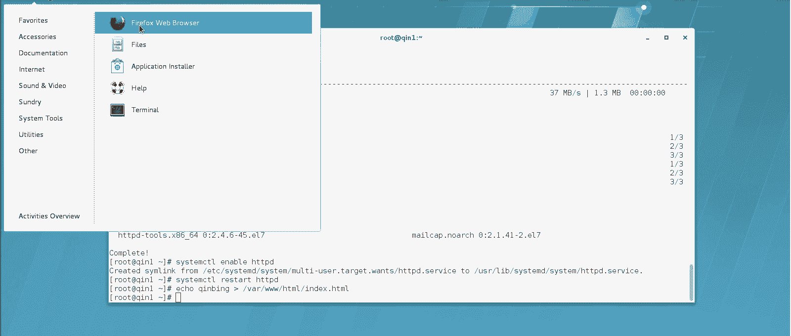

这个架构又起来了啊，每次还原一个快照，然后干干净净的咱们去做新的这个实验。好了啊，那么这个脚本的实验呢是什么意思呢？就是我们这个系统默认阿帕奇，它是不能直接调用脚本的。咱们生产一线常用的脚本有哪些呢？

呃，一般来说啊。是。或还有。pyon这三类脚本啊呃这三类脚本的生产一线来说用的比较多啊，那么怎么调用呢？呃，首先说前两种前两种可以直接调用，直接调用。但是呢需要你把它就是要有一个模块调用的过程啊。

最后一个呢还要再加载一个模块，系统默认不支持python的这个脚本调用啊，那么怎么做呢？咱们首先得有这仨脚本啊，得有这仨脚本，要不然咱没法做测试啊，这仨脚本呢三种脚本，我估计你现在目前啊都不会写啊。

咱们后期课程里边会有一张讲讲sha啊，但是这两个脚本什么python这个的话，你只能说咱们以后有机会单独给你们讲讲啊，这个来说呢就是说不属于linux课程之之内的啊。那咱们先造三个脚本吧啊。

这个脚本建议啊这个阿帕奇建议你给它搁在这个CGIBword下3WGIB搁在这个目录啊，这个默认就是搁脚本的，比如说咱们建议。shall点SH啊，一般shall脚本默认咱们愿意叫什么什么点SH的。

虽然咱们说linux底下没有这后缀这概念哈，但是一般习惯啊，那这脚本我也甭写了，我就呃直接给你复制粘贴吧啊，咱们这个笔记里都有。这样的话呢，咱们还能缩短点时间啊，这实际就是一个查看系统时间的一个脚本啊。

就是一个查看系统时间的。包括咱们再去建一个这个port的脚本。点PL啊，因般这po的脚本原叫什么什么点PL的啊，咱们还是这个复制粘贴一个啊，我这笔记里有有几个给你写好的啊，你可以直接给它粘过来啊。

粘的时候注意啊，这个如果有这个井号多的，注意一般第一行这井号就是有着的，后边这几行没井号，你就跟笔记弄的一模一样就行。但是有时候他往下粘贴的时候，他愿意跟着第一行，把底下几行愿意加一个井号。

你一会儿一操作，你就明白了啊。嗯同样咱们也得再来python的脚本啊，python的脚本呢就叫python。第二个。点PY啊，一般python的脚本是PY的啊，这脚本长。但是你注意啊，不管这脚本长和短。

它最后啊其实这仨脚本你看结果，最后你看结果是都是调动系统时间的啊，这是pyython的脚本啊，我也给你弄一个。好，那咱们系统怎么去调用这仨脚本呢？首先来说呃，我这系统我现在写个配置文件吧。

默认其实主主目录底下这个配置文件可以不写。但是咱们为了调用脚本，我建议你写一下啊，零点Cs这个啊，咱们说的这个默认的话，你要就以往站，你可以不写这个啊，怎么写呢？咱们就用最简写法吧。Vual host。

最简单的写法里边咱们就写两行就得了，一会儿。Me错。里边就写什么呢？s name。咱们就直接用IP就得了。Document root。就这两行就行了，咱们也不用什么日志啊、邮箱啊那些东西都不用写了。

Please是打等一下。刷一下。好，没问题啊，能访问啊那怎么往这个现在咱们这网站是正常的啊，就是怎么在这个网站上，咱们让他去调用脚本啊。首先说share和port脚本可以直接调用啊，直接调用的话。

咱们必须得加执行权限。chanA加X。对于谁呢？word下3W下CGIB下的这个share脚本，还有谁呢？对于这个co脚本。得加执行权限啊，才能去调用它啊，那么怎么调用呢？这么调用。

咱们得在这个配置文件里呃写点东西，写什么呢？呃，加一个脚本调用模块啊，这个模块的语法你不用背啊，其实它这个系统默认啊。你看这配置文件里啊有啊，这个怎么搜呢？应该这么搜啊，搜一下这个叫应该叫。

也是一个叫al什么的module啊什么al list，我们找一下，哎，就这个就这个if moduleif moduleal list module就这个这一段就是关于系统啊，怎么去调用这个呃shall。

还有pro脚本的这个描述。但是你注意啊，你这里边大部分注释。你看其实就这一句话，我们其实就要这一句话，就要这一句话，那怎么办呢？你给它复制下来。

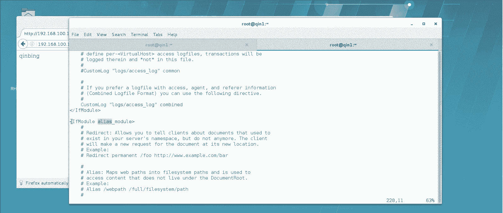

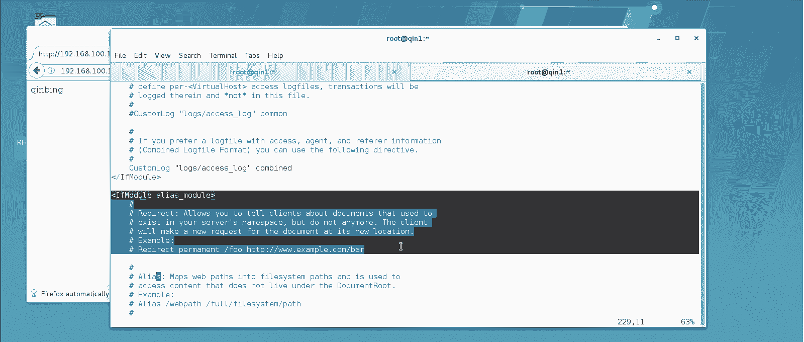

先把这句复制下来，你搜的时候，你就搜我例子，然后看的是个衣服mod least module这一段其实就是用来调用什么呢？调用脚本的。你把它。写在这儿。然后呢，底下那两行也拷过来。就这两行嘛是吧。

也给它拷过来啊，这不就省得背了嘛，是吧？哎，然后呢，这里边什么意思呢？就是说做一个别名，脚本别名啊，这个目录底下的这个脚本啊，我们做一个别名。那么呃首先说咱们不叫这个了，咱们这个名字是可以随便起的。

因为它是别名嘛，比如说这个叫什么呢？我就叫脚本嘛，就叫脚本。指到哪个位置呢？就指到这个位置。咱们刚才那上脚本和那铺脚本不是放在这儿了吗？是吧？哎，就指到这儿。啊，就填的这三行填的这三行。

这些东西你不用死记硬背，为什么呢？这都是人家阿帕奇的标准语法啊，你呢回头你以后生产中要用得到，你直接复制粘贴就行了。然后呢，我一般写这个的东西，你知道这能改就得了。好，保存退出。而阿帕奇。

服务器咱们重启一下啊，重启一下，注意啊，脚本写完了加执行权限啊，加完执行权限之后，把配置文件改一下，加上那三行啊，然后咱们怎么调用呢？这么调用，从这底下啊，咱们不是做的别名吗？这叫脚本啊。

脚本下就变成脚本这文件夹底下了，脚本底下不是有一个叫shall。点SH你看直接就掉了，就是查看系统时间的一个啊，包括咱们那pro那脚本。是吧点PL你看直接调时间啊，这俩脚本其实内容一个意思。

都是最后咱们去调时间的啊，python的脚本比较麻烦。python的脚本你要想调用啊，不能直接调啊，系统默认是不支持的那怎么办呢？你要去装一个模块啊，咱们说了阿玛其是这个模块化的啊，你需要什么功能。

你就装什么样的模块就行了。它这个模块叫什么呢？modode wSJI啊，你可以tableble出来啊，装这模块modWSJI装这模块以后，你就能支持这个python了，那你还得去改一下。这个零点c啊。

你想在这里边支识小本，这个怎么加呢？就加一句话就行，加什么呢？呃，这么一句话，WSJIcr。At least思。啊，加这个啊也是一个脚本的别名。但是注意呢他认WSJI用它来调这个python的啊。

这后边的名字也是随便起。你比如说我们就叫什么呢？就叫python吧。或者我为了让你知道。叫秦python啊，一般我后边你例子里，我只要写秦什么什么的，你就知道了，这个地儿可以随便命名啊。

秦python我们给它调到这个地儿。然后呢呃那个地儿指到哪呢？沃尔现3W咱们那python脚本不是也在这儿吗？CJI杠B这个目录是吧？哎，就行了，就加这么一句话就能调用这个目录底下的python脚本了。

好，保存退出，再把这个阿帕奇重启一下。那怎么掉呢？我们这个脚本的路径应该叫什么琴python是吧？下边会有一个python点pyY的脚本，你看一掉掉下来了啊，掉下来了。这个三种脚本语言就这么来调啊。

我再总结一下啊，首先。你要写的脚本，你给它写在word下这个3W下这个地儿啊，你把你想写的脚本，不管什么脚本popython什么的，建议所有的脚本程序都写在这底下啊。

包括你以后可能还能碰到什么ruby的，建议只要是脚本，你就写的搁在这儿。然后呢，你哪个网站要调它你哪个网站要调的话，你就在那个配置文件后边。如果是sha的和pro的脚本，你就加这么一个模块，然后呢。

这儿呢要用一个脚本别名啊。你这个脚本名名可以随便写。回头在网站上呢，你就可以直接的调那个位置，直接调这个脚本就行了啊，需要注意的是。嗯，要加执行权限，sha和pro要加执行权限。

但是好歹它是系统默认支持的啊，python的稍微麻烦点，要装一个mododeWSJI那么一个模块啊，装完以后呢，添这么一句话，也是python的脚本，一个调用别名啊，这个别名也可以随便起。

然后指到那个你搁脚本那位置，然后呢直接用这个路径就可以调这python的脚本啊，这是咱们阿帕奇怎么去支持这个脚本文件啊，怎么去支持这个脚本文。嗯，再接下来呢。咱们再讲点什么呢？

讲点关于安全访问控制的一些东西啊。你比如说在咱们这个网站服务器上啊，网站服务器上，咱们说比如有些目录啊，不希望所有人都能访问到什么意思呢？比如说嗯你比如说啊我先把这都退出去。

你比如说word下3WATM下，比如说啊这网站这网站下，比如我建一个文件夹。这个文件夹。叫什么呢？叫什么呢？叫sate。S。嗯，我们叫什么？就叫企。嗯。嗯，1。行，比如说我们建立一个文件夹。

就叫secret。秘密嘛是吧？那么这个文件夹呢底下我们也去写一个叫秦ec。这么一个网页啊，我们给他建的这个。ASe。你这个 stage there。比如这个文件夹，我们就是设置的，就不能谁都能访问啊。

不能谁都能访问。那么这个文件夹比如说我可以设置什么呢？就是某一部分主机不能访问。你比如说我希望秦二这个主机不那么我们现在看一下，现在你要什么都没设置，你到这个主机上来，你去看它能不能访问。

那肯定是可以访问的，是吧？你看啊。

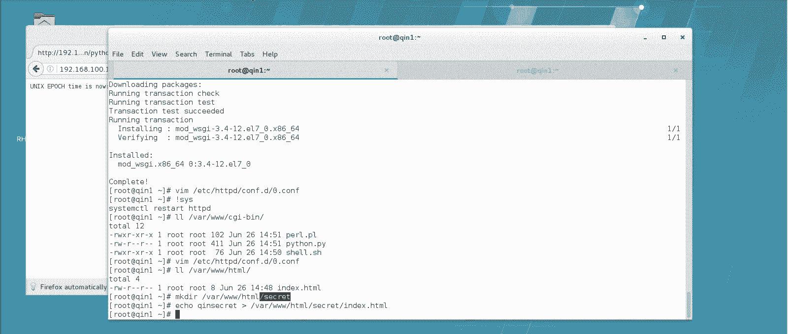

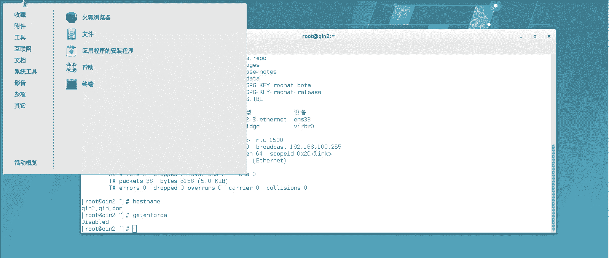

192。168点100点1，这是访问的主站是吧，底下的C。可以秘密，你看可以访问啊，没问题，可以访问啊。那么我现在如要做一些设置，我希望某些主机不能访问，那怎么来做呢？

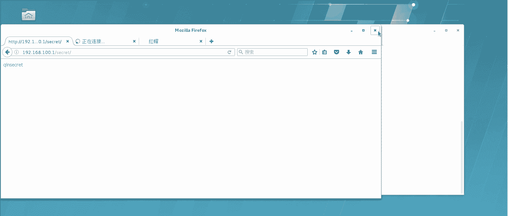

咱们再找这配置文件啊，这配置文件。啊，那这个配置文件你要加点东西，加什么呢？还是加对于文件夹的一些设置啊，对于文件夹的一些设置。呃，加directactory啊，咱们来哦小茶一行啊。加一个什么呢？

Dirrey。啊，对于文件夹的描述，你注意啊，你只要写对了，这一般变色啊，所以这英文你也不用太玩命去记啊。对于哪个文件夹呢，我们对于这个word下的3W下的是吧？呃。

HTML下的这个叫sreate这个文件夹啊，我们对它进行一个设置啊，对这个文件夹进行设置。那么我们头就这么写。然后呢，尾部怎么写呢？我们说了，只要有这个。他一般都是这么写的，比如。哎，好，有一头有一尾。

然后这尾部这加一斜杠啊，这就是表示一段啊，表示我们要对这个文件夹进行一些设置。设置什么呢？设置不能访问它这个语法是这样的，older。Hello。然后呢，allo from R啊，然后dy。

from比如说1。2点168。100。2吧啊，那台主机这台主机咱们是100。2是吧？

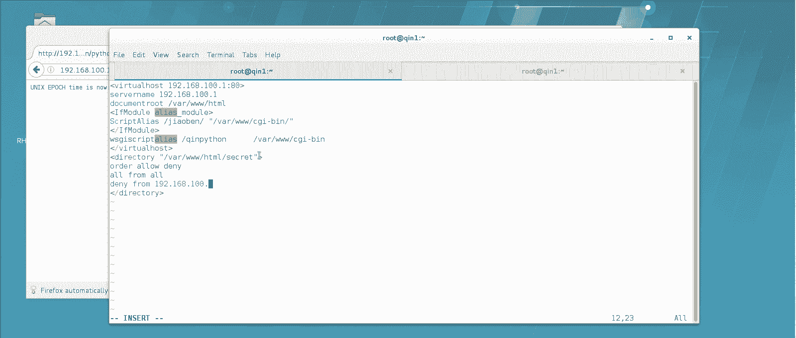

两位也看一眼这台数机IP100。2啊，那么这句话是什么意思呢？它是这意思。首先我们对这个文件夹进行一些设置是吧？怎么设置呢？oldder alone deny它是按照允许和不允许的，先后顺序。

先看允许再看不允许啊，然后呢呃。

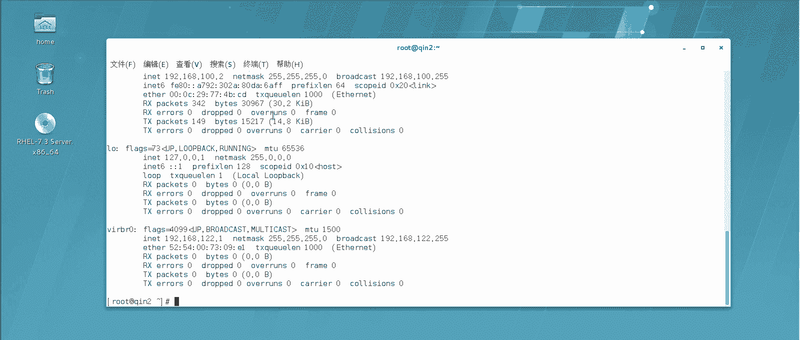

啊，这是个漏M2啊，这是少写了。hello from就允许规则是什么呢？是允许所有的人发问啊。不允许规则，那是。不允许他访问啊，这个规则这么设置完了之后，他就会先允许所有的。

然后只要看到他这个IP过来的就不允许。那咱们测试一下。咱们看它生不生效啊。首先哎等会儿这好像还有点毛病，我写的。哎，老底耐。😔。

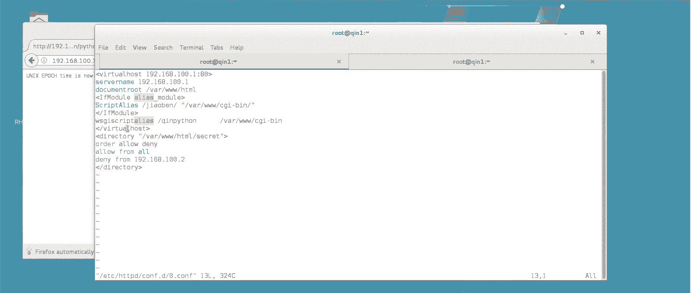

directory watch选3WHTML。

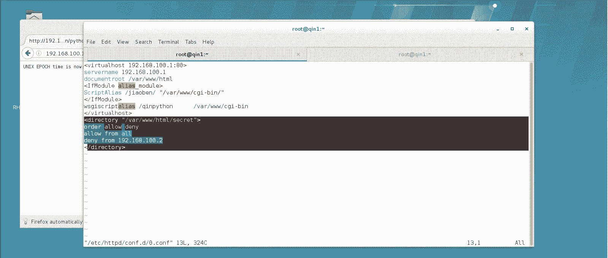

哦，这少一逗号，看着了啊。这中间啊这语法是这样的，逗号啊，好了，这回应该没问题了吧。咱们重启一下啊。好，从新而出，哎，这回没毛病了。那么我们首先看自己啊。自己能不能访问这个文件夹叫secreate。

你看自己是能访问的啊，因为我的IP1。168100。1嘛，这边这边我们看一下啊。

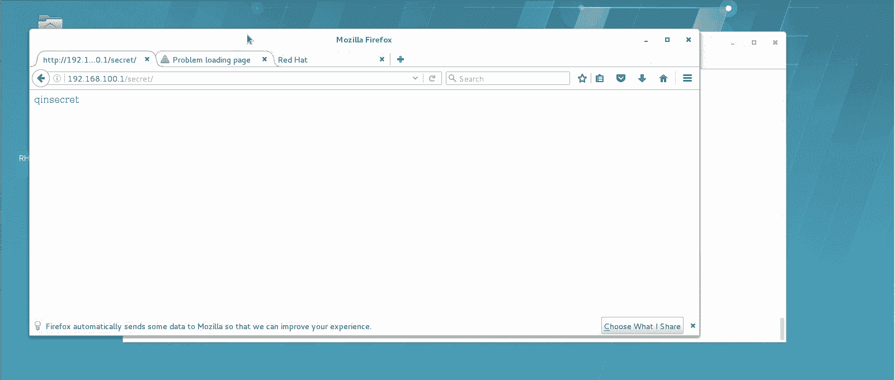

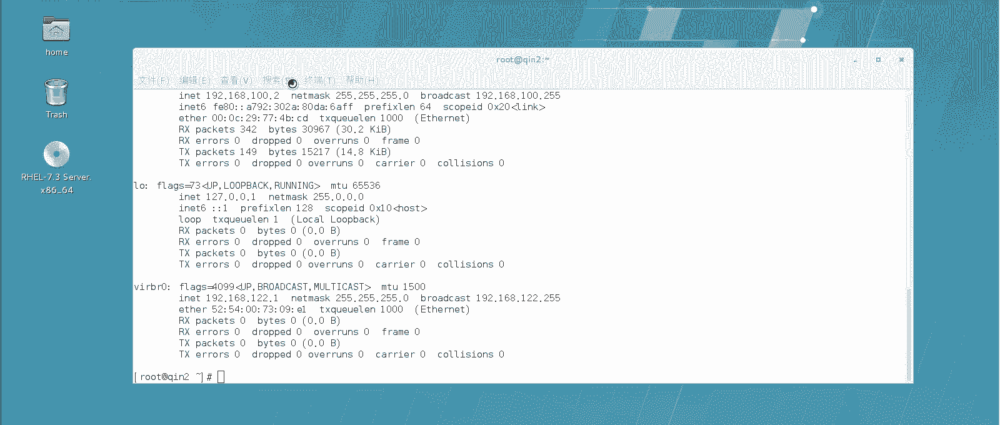

首先访问那个主页啊，我们看一下1。2点168。100。1没问题啊，你看这回就告诉你forbidden了。什么意思呢？就是你刚才设置的这个规则啊，你刚才设置的这个规则啊，这个direct描述。

对于文件夹这个文件夹的描述，你说了允许拒绝，允许所有拒绝它啊，就给拒绝了啊，这儿呢咱们说一下，就是说它这个允许拒绝规则呀，挺多的啊，比如说我给你翻一下笔记啊，你看啊我笔记的列举的很多种。

就是这种规则语法啊，你注意啊它这语法一般是怎么判断的？你可以这么想象，就是你首先来判断它先先运行哪个规则啊，一般就是说先写allow就先看allow的规则，先写dy就先看de的规则啊。

然后呢先low后抵y的话，先看allow允许所有的，然后dy from它，你要看这两个的交集，然后也要看先后顺序就相当于。什么呢？你想这个不是都允许了吗？然后这来拒绝他，那最后的结局结果肯定是拒绝他啊。

这种语法有多少种写法呢？有很多种，但我不建议你都都都去记他怎么去记这个语法顺序啊，就没意思了。你记几个特例就行了。你比如说你要拒绝谁啊，记几个特例就行了啊，单独禁止怎么写，全能通过怎么写。啊。

全部可以禁止啊，全部可以通过它是有这个默认的这种就是语法规则的啊。你稍微记几个就行。这这个我给你列举的情况呢，是几乎是所有的可能碰到的情况都有了。但你在生产一线呢，你没必要去记这么多。

一般来说咱们生产一前碰到就是单独拒绝谁啊，单独拒绝哪个主机呀这些东西啊，它是这个意思啊，那好，就是咱们讲这个额到底内这个。然后再说呢，就是说呃除了这种单独的啊，这样咱把它还是给它放开吧，先给它放开吧啊。

我只要把这一删，它肯定又能访问了。我再给它放开，因为我马上演示一个比这个还好用的一个功能啊，我这回再刷新，你看这又可以访问了啊。其实在生产一线，除了用这个额楼底内的，这个其实用的不是特别多，为什么呀？

因为你你想你这去进IP这事儿本身就不是很靠谱啊，人家换IP不就过来了嘛，是吧？真正其实在生产一线，咱们用的时候最多的还是用什么呀？用账号密码，用账号密码啊，账号密码这个靠谱，就是你只要知道账号密码。

你就能访问这个文件夹，说你不知道你就不能访问这文件夹这个比较靠谱，你换主机也没用，是吧？你爱扩IP也没用，那么这个技术咱们怎么来实现它呢。首先来说啊，你得有一个密码文件啊，就是说我先要造一个密码文件。

用什么造呢？就用这个HTTP的这个叫。呃，HHTP password。这个命令啊这个命令呢其实它就是HDDP的一个原来是只能用HTP后来其实好多服务，后边咱们后边还会讲一些别的服务。

你发现也能用这个这是来造一个密码文件啊，造一个密码文件呢，实际上就是把账号和密码存在这文件里。回头呢这个网站呢去调用这个文件字做验证。如果他发现你输入的账号密码和这文件里的一致，就让你访问。

如果说不一致，就不让你访问啊，他是这么意思。首先咱们先造这么一个文件，用于存储这个账号密码。用这命令啊，这个命令呢，你要想直接回车，你看他有一些描述，或者你可以直接慢他。你可以直接慢的也一样啊。

什么意思呢？就是这个命令咱们在造文件的时候，你比如杠C啊，这是创建这个密码文件啊，然后呢，杠M是用MD5强制的加密啊，强制加密啊，那么一般来说就用这俩参数最多啊，HT passwordword。

然后呢杠C啊，我们创建一个密码文件，而且最好是加M就是用MD5加个密弄出来是乱码的那种形式的啊，我这密码文件我搁在哪呢？我就搁在ETCHTB下啊，起个名起个名叫什么呢？比如说就叫秦。password啊。

比如就叫一名字叫秦password啊，那么你就知道了，这文件名也可以随便起。但是为什么叫隐藏文件呢？这样提高一下安全性啊，然后呢造在这文件里的第一个用户，比如说我叫它秦。回车啊。

他这样输入这个这个这个琴这个密码是吧？你比如我还用琴好了，我造了一个啊，那你要是来看一下这ETC下HTTB下这个点琴盘的。你看这文件，你看账号是琴，密码是这个，他用MD5给你做了个哈希啊。

如果想再往里添密码怎么办呢？比如我再添一账号叫冰，注意啊，这个杠C就得取消了。为什么你要还带杠C，它就会又重建这文件，那这个原来那些账号密码可就没了。所以你要往里添账号的时候不能加杠C了。

直接杠M就行了。比如说我再添一个冰的密码。行了，这个时候你再看这EDC下底下这个文件啊。你看。有两个账号密码，秦的和冰的啊，这两个这两个都有了啊。那么然后你怎么让这网站认他呢？这么认啊。

你还是要改这个配置文件啊，顶点后改它啊，这回怎么加呢？肯定还是对这个directory文件夹进行描述，对吧？那你还得这么加第reary。哎呀。我刚才合虎删他呢是吧，直接用了不就完了，还是对他进行描述啊。

对哪个呢？对word下3W下这个HTM下的这个。叫secreate啊，对这个文件夹进行描述啊，描述啥嘞？有时候不念的人都敲不出来啊，对它进行描述。注意啊呃描述的这几行啊，这个比较难记啊。

我一这这这这四行我建议你是就别记了，你呢直接去呃复制粘贴就得了啊，这怎么写呢？os name就是认证名，就是说你回头登录到这个点上这认证名。这认证名其实可以随便写哈。呃，比如说叫秦吧，就叫秦奥斯。

你就知道这事随便写，它就是这这个认证的这个名称啊，这个认证就这一组认证的名称叫什么？就随便写啊。然后呢呃你要写它的认证类型，ous type。你看它一般变色了，说不明定就写对了basic。

这种是基础认证啊，基础认证账号密码认证嘛是吧？ousus file就是你的账号密码那文件在哪呢？在ETC下的HTTPD下有一个点儿秦帕斯。哎呀呃word是这文件啊，你别敲错了啊，他就去找这文件去了。

然后从这文件提取账号密码，你输的一致，他就通过了。Require。然后挖里的。user就是什么意思呢？way的 user认证用户只有在这个密码文件里边认证的用户和密码登录成功了，才能访问这个文件夹。

这一段就是对这文件夹描述。那么你如果对这个文件夹写这四行，什么意思呢？就是我们要做一个叫秦奥的认证。这个认证呢？账号密码文件区这找，它是一种基础认证啊，只有通过的账号密码，在这文件里的认证的。

才能访问这个文件夹。它是这个意思。

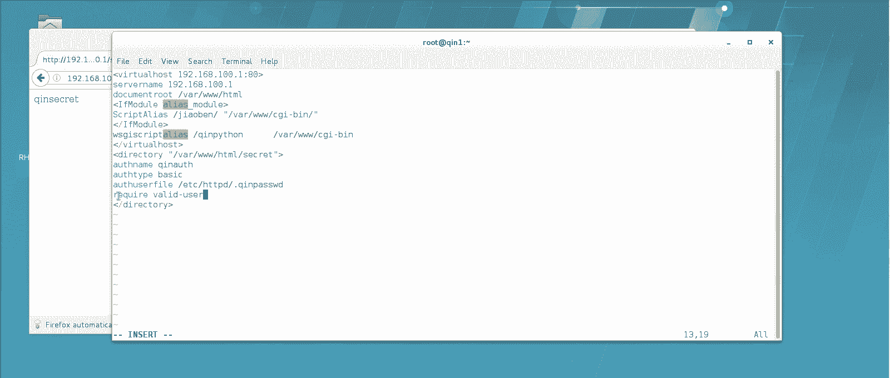

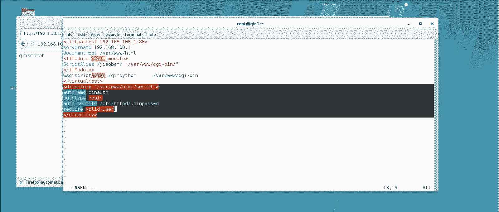

不用死记硬拜啊。不用死记硬背它这些我这些讲的笔记里都有啊，生产一线你也不用死记硬背，你复制粘贴也行，或者多弄点也行。因为这个语法是人家阿帕奇在开发这软件的时候，人家定的啊，所以说你死记硬背没意义。

人家万一回头换了怎么办是吧？嗯，好，这就成生效了，生效以后你看啊，比如我再访问这个文件我刷新一下，你看那就出一框了啊，出一框，让我输账号密码，注意啊，你只要是瞎输。

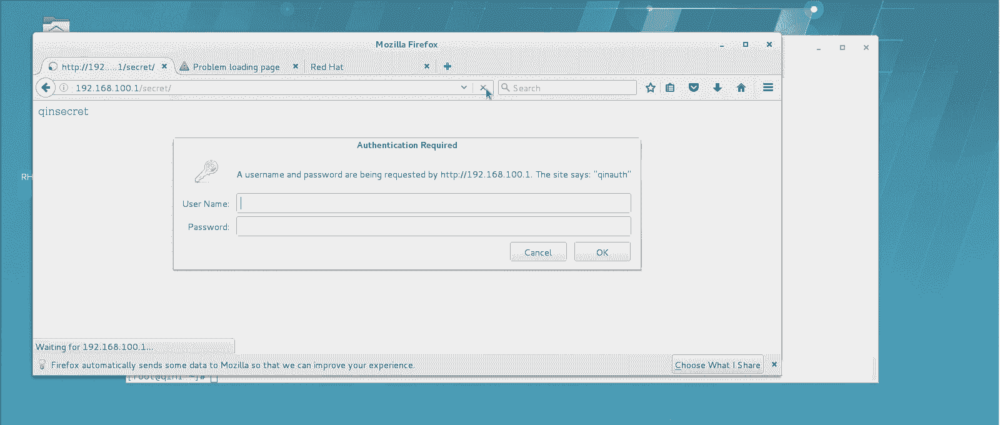

他就不让你进去了，明白这意思吧？你要是胡写，他就不让你进去了。你看他告诉你未认证成功啊，anous啊，未认证成功，你就进不去了，这很麻烦哈，你除非你输对了。

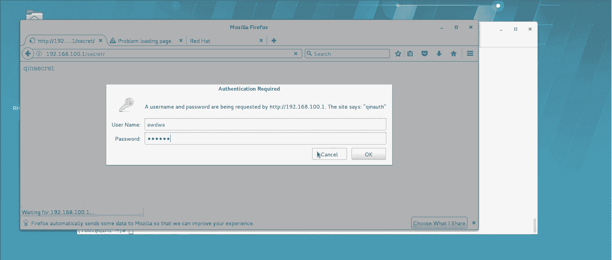

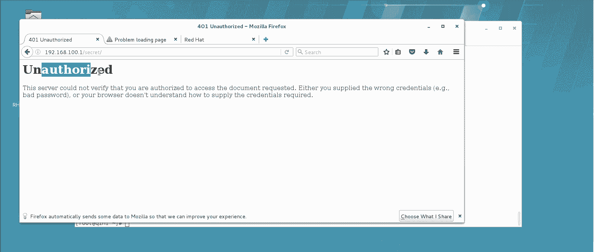

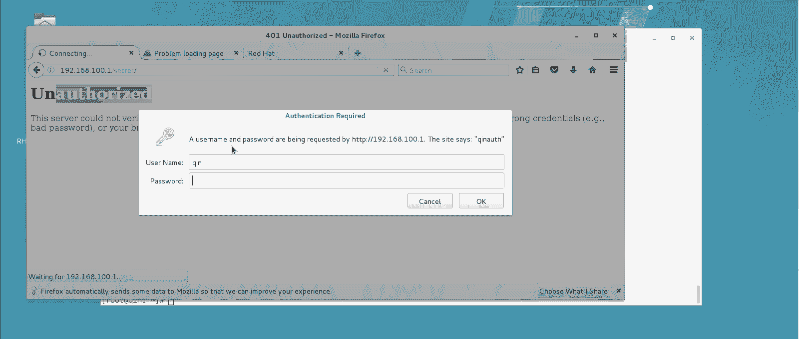

秦秦。你才能进去啊，他说你是不是要记啊，我不记了，看见没有？秦塞点进去了啊，包括说在别的机器上也是一样。也是一样。我们先刷一下，你看你一刷他就让输账号密码。刚才那是缓存啊，你只要一刷啊，你你除非输对了。

开让你进去，否则的话他不会让你进的。你这回我用这个冰吧。

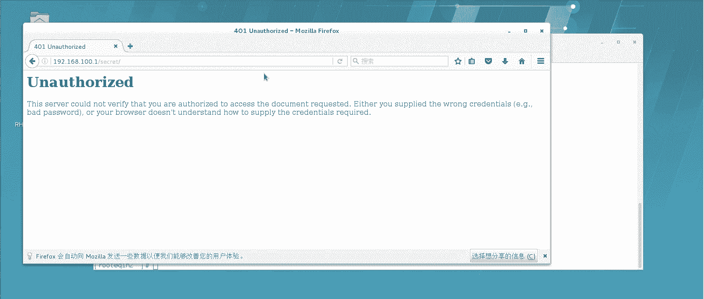

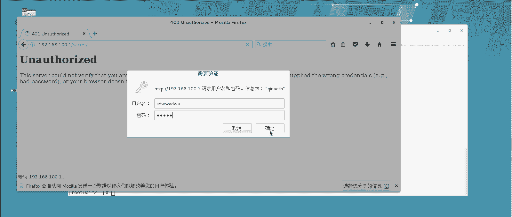

啊，他还让我记密码，我不记啊，你看进去了啊，只有当你输对账号密码的时候，你才能进去啊。这个实际上在生产一线应用的更为广泛更为广泛。他通过一个密码文件，把账号密码生成完了之后啊，你只要访问哪个目录。

你就加那么一段啊，让他必须去读那个账号密码文件，只有认证通过才可以啊。

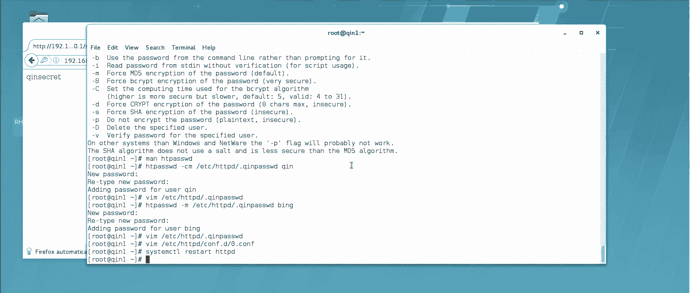