# 【云知梦】Linux实战中级篇／RHCE认证／RHEL7／CentOS7 - P8：第8集 Web服务器(六) - 云知梦官方账号 - BV1iV411h7ia

。

那么最后呢咱们看一下关于这个呃SSL。这部分的实验啊，那这块呢其实咱们提过，就是通过HTTPS协议啊，走的是443端口的啊，这种怎么能实现啊。那讲之前咱们先说啊，就是这块呃这块有点超超大纲。为什么呢？

就是说它这个实验里涉及到一个什么CA认证服务器啊，像这种东西安全讲到这个级别的话，一般来说是应该在这个高级课程啊，讲到服务器固化那块啊，专门有一门课叫413那里边讲这个怎么去做这个CA中心啊。

做这认证啊这些东西啊，呃，所以说呢你要看到这儿，你要是真正听这章里边费劲的话啊，你可以跳过啊，可以跳过这实验啊，呃生产一线的来说呢，这个应用来说最大的难点其实不是在这儿在做那CA上。

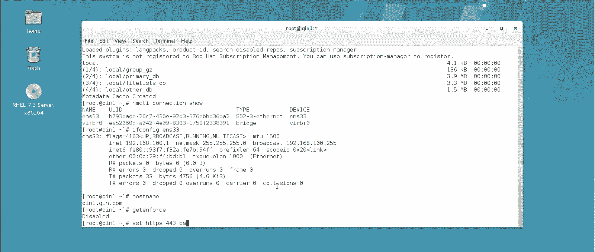

这是什么意思呢？就是说你看啊有一些网站，你比如说一些银行的，咱们前面说过一些银行证券的，包括你比如火车票这网站12306。你看啊他一般你你真正用用这种网站，他要求你先下一根证书，然后你再去买票什么的。

你你必须经过这证书，这是什么意思呢？我先大概给你画个图解释一下啊，当然咱们不像那个就是真正讲这个CA中心那么去讲，因为真正要讲那个呃，我估计你现阶段听你能给你讲窟子，就比如现在你这阶段呢。

就是真正就是真正学到CA课。有些学员我当时讲啊，什么叫公钥私药啊，怎么做证书啊，这种呃，当时都有窟子的。因为这块知识的确比较抽象啊，比较抽象啊，比如说啊我我给你按这个普通话的讲法啊。

咱们稍微这么讲一下啊，12306，比如说这是这个网站啊，你不要去这买票呢？你是这个叫。

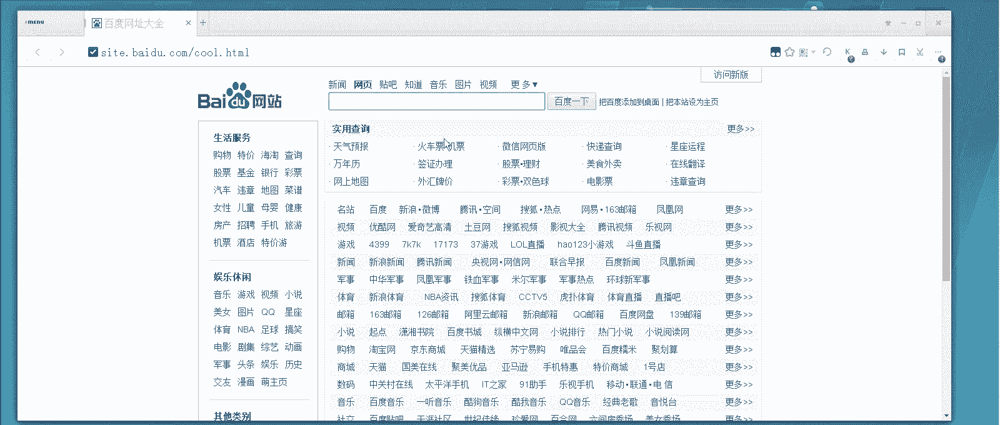

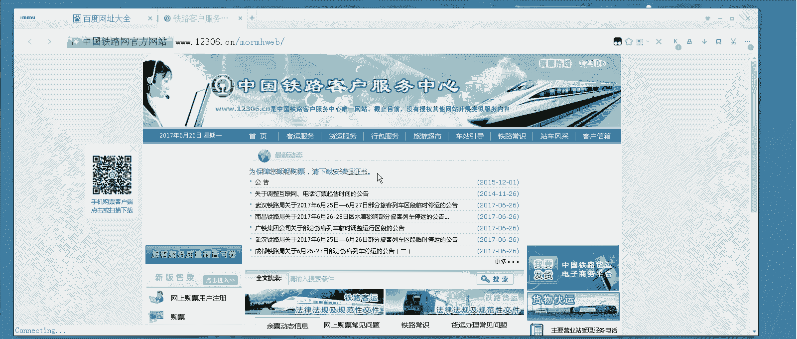

客户端啊。说如果你不通过HTTPS这种协议啊，你直接上去买票可以吗？可以啊，但是很危险，危险在哪儿呢？就是说你怎么知道你上这网站是12336啊，是吧？有同学说老师那这这网址写着呢。

12366不是点com，就是点CN可能是啊。哎呀，我记着这可能是个点CN。对，这是12306点CN这个网站啊，别记错了。啊，说你你看这网址啊，这不是12366点CN嘛，是吧？这可不一定，为什么呢？嗯。

在网络中，你真正这域名下12336解析是由谁决定的，是由你那个连接到的那台DNS服务器决定的啊，那么这台DNS服务器。他如果被攻击了，或者说人企业生产一线，或者在互联网里边。

人家去就专门做1个DNS解析骗你啊。那么你DNS连过来，它解析出来的是另一台服务器的IP比如说连接到了一台这个服务器啊，这台服务器可以做的跟12366的网站一模一样，这很容易实现呢？

你用什么火车头啊什么这种，或者用python写爬虫，你可以把整站给它霸下来，然后搁个搁到这儿以后呢，你把后台数据库改了啊，那么你再输入账号密码，你可就不会连到这儿了，你可直接就连到这儿了。

因为DNS解析告诉你，它是1236啊，底层IP是它，你看域名还是对的。但是底层IP跑到这儿来了。这就很危险这就很危险。所以在生产一线，我们一般来说要有什么呢？像这种安全级别比较高的这种网站。

它一般都要经过CA的认证。CA胜出服务器啊，他顶上就是你不用管他怎么工作的啊，他能够去帮助你识别谁是谁，就是你怎么知道这条11366是他告诉你的，他的工作原理是什么呢？呃，这公司要来回发来发去那过程啊。

咱们到高级课再讲，反正最后的结果是。他会发证书下来啊，在这台服务器上注意啊，在这台服务器上会有俩东西，一个是他的这个私钥，一个是他的证书啊，一个是。哎，我们在这写一下啊，一个是它的这个私钥。

我们叫key吧。还有一个叫证书啊，然后你连过来通过CA中心，你认证完了，连过来的时候呢，你应该是获得一个证书啊，你获得一证书，就你看这儿啊，看这儿你是不是要下载一根证书啊，你下载完这证书。

回头你再连过去啊，这证书下下来跟这个key的能对上，这俩对上了，说明它是1236。如果对不上，说明它不是啊，这是有有有风险的啊，这是靠这种机制来实现的啊，实际上我这个讲法稍微有点出入啊。

但是可能比较方便的理解啊，你这么来想这问题。那么今天咱们的实验呢。没有这CA中心啊，因为我在教你搭这CA中心呢，那课程比搭这外边服务器还麻烦啊，所以咱们怎么模拟呢？咱们这个机器自己能生成一个证书啊。

能生成证书和私钥啊，有一程序能直接编译出来，生成证书私钥。然后呢生成完之后呢，我们有了证书，有的私钥以后就能模拟这个你过来下证书，然后再登录它的这个过程啊，这是这么做。所以这张呢我说稍微抄点纲。

但是呢呃你看着做，你看着做啊，你要是觉得做有困难，你就甭抠死概念，你就照着我这实验先敲出来，你理解这个下证书啊，什么这个43端口这么的通信的这个过程就行了啊。好，那咱们看看这实验怎么做啊。呃。

首先来说咱们先把这证书做出来。

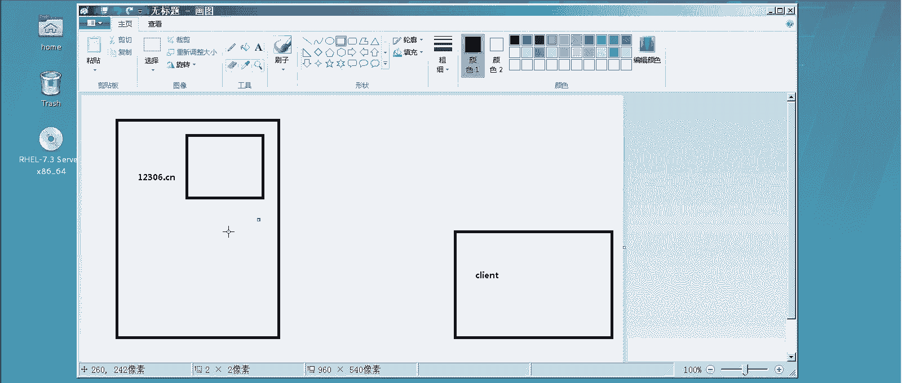

证书这个一般都搁在哪儿呢？ETC下有1个PKI下的TL里边有一st。哎，进到这里边看一下，这里边有一个make编译工具，它可以来make证书啊，怎么make呢？就这么make就行。

make编译琴点sert，我要生成一个琴叫琴点CRT的这么一个证书啊，它会生成一对，连那死钥都能生出来啊，这样你输一密码是什么呢？是为了加密这证书的啊。

至于什么叫RSSA啊什么这些咱们讲到安全那再给你细讲啊，那么你这可以直接往回车也行，或者你要是输个这个密码。比如说。read ahead123点com，你随便他是为了加密这证书的啊。

他还让你重复啊什么的行了，这行了，这证书就加完命了。然后呢，后边你要输入一些这个组织机构代码证，国家爱人信息，这是让你输入国家信息的啊。咱们中国就是CN注意大写啊，大写的CN当然你胡写也行，无所谓。

这个不重要啊，让你输是哪个哪个这个省是吧？哪个省呢。北京。啊，哪个市？北京省北京市，实际上别的省就好说，是分开的。北京这你直辖市你只能这么写啊，然后输你是哪个公司的公司名，比如说咱们公司。

red hat啊，红帽。是哪个部门呢？互联网部啊，这些都是自己随便写的啊，注意这个不能随便写，这是什么呢？是你这个网站的域名啊，servho name这网站的域名是什么呢？

那你必须得跟DNS上解析记录是一样的啊。如果你用hosse的话，你也必须一致，就是你这网站叫什么，你写什么，你要写IP以后只有用IP过来才能进行这个43的连接啊，邮件嘛就随便写一个吧。哎，邮箱好了。

你现在就给这个网站域名叫这个的网站生成了一对什么呢？看一下生成了一对证书和密钥啊，证书和密钥啊，注意呢这个密钥啊，一般不建议搁在这个文件夹，搁在哪儿啊？一体车下。呃。PKI上TRS你注意啊。

这目录底下证书是搁在这个source里啊，密钥一般是私要么，private，这是私人的，一般密钥愿意搁在这儿。所以你最好把这个琴点这个key拷到这个EDC下的这个PKI下的这个TRS下的。

priivate考到这儿，把这密钥搁在这儿最好啊，搁在这儿。然后呢，你就相当于已经有了CA中心，并且CA中心已经发了证书，发力证书搁哪呢？就搁在这里下了啊，注意你最好把这个删了。停点T把它删了。

你的私钥应该搁在那个文件夹下啊，一般来说，证书搁在这个cerert这文件夹下搁在这个里啊，咱默认生成就在这个目录下嘛，然后密钥搁在这个private私钥私钥就是你自己的那把私人的钥匙啊，搁在这儿啊。

然后为了让咱们这个网站支持SSL呢，你还要装一个模块。哎，到这儿就不陌生了是吧？咱们说了阿帕奇这种模块化的啊。装哪个模块呢？mododeSSL装这个模块啊。

这模块它才能让你这阿帕奇这服务器支持这个功能啊。装了这模块之后，你可以顺带手，你看一下这个。这个里边啊再crl点地下，你注意啊，里边会生成一个叫什么SSL这个。这个配置文件你看啊。

它自动就把你这43端口加进去了，所以说你就不用手动在有同学我要不要再手动加一端口啊，这不又一端口啊，不用，为什么呢？你手动你不用加他自己这配置文件，关于SSL一些东西都在这儿。

但是你要注意你要打这阿帕奇。说你的重启。是吧重启一下之后呢，nice state杠ANTOLP。点EP。PPD是吧？你看443端口就是监控上，不用你手动压，你装那模块，它支持SSL。

它自动就把好多功能给你加上来啊。然后呢，咱们是不是还得弄俩网站是吧？比如说一个网站，咱们就用默认这个吧。我挨扣一个就是80到哪儿呢？到这沃下的。3WHTML下win点HTML我如果通过普通80过来的。

我访问就是这个网站嘛，是吧？然后呢，我再去make dR1个word下3W下。我建个叫443的这个目录啊，然后再ecle1个443。到这底下ind点HTM回头我。HML回头我如果访问到这个地儿了。

说明我是通过43端号过来的那配置文件也是ETC下HTTB下的ctrl点D下，我们先编个0点top。到这儿就都熟啊到这都熟，这怎么编呢？你就写最基本的就行了。vittro host是吧？8。2168。

100。1啊，这是80哎呦。80啊，好。然后这儿呢。又差点写错了。哎，这。然后呢，里边只要有sver name。这叫什么呢啊。3W点7点好啊。document root呢，我让他知道。注意啊。

访问这个网址进来。如果是进80端口的，就去这个地儿啊，就去这个地儿啊。那一会儿呢我还得有一个访问43端口的，是吧？CP这哥们儿到了。43。4口啊。然后再编辑一下啊，还是访问这个地儿。

如果是到访问43端口过来的，就是通过HTPS过来的。我让你跑到443这来。好了啊，这是这俩网站配置文件，我也给编好了啊。那首先默认我们如果说呃没有做那个。什么之前啊，我们先。重启一下啊。

你现在可以达到什么效果呢？首先来说你肯定。我们看一下啊。啊，对，勤点勤点com那域名还没解析。咱们现在还得把这个。两点半。100点1啊，然后3W点7点CO。作为解析啊。

注意3W点7点com默认80是访问它，默认443知导它啊，这有点像咱们前面做的基于端口的那个转发啊，现在还没HTBS什么事呢啊？好了，现在开始要做这个关于SSL加密的东西了啊，那怎么做呢？

首先我们要往里边写几行关于SSL的东西。那这个文件看哪呢？看这个。HDB下的controrl点D下的SSL就这个文件啊，这个文件里这么多，说哪些有用啊？GREP。杠不区分大小写，以SSL开头的啊。

注意这不这么多行吗？最后这五行有用，最后这五行有用啊，这五行分别是什么意思呢？首先是这个是打开SSLL这叫这引擎嘛，就是打开这功能实际说白了啊默认是默认是整站打开，默认现在没打开。

这个是分别一会儿咱们搁在某个配置文件里，然后呢呃它可以对这些所有的加密，除了SSLV2的啊，实际现在还得一会儿再加一句，除了V3的这两个协议有问题啊，然后呢，底下是加密的这些就是呃证书的这么位置。

比如这sert证书搁哪，你一会儿得写正确的位置啊，咱们这不是搁到那个底下叫勤点er嘛，是吧？包括那私钥搁在这里下叫什么勤点K啊，你改过来这5行是有用的，这5行是有用的。然后呢呃我们还要改一下这。改哪呢？

就是如果你不想对所有的网站都激活这个SSR功能。你比如说我这这现在这环境里不是80那网站不激活嘛，是吧？你得把这个主配置文件啊，这里边会有一句。这个咱们搜一下，这个应该就叫。应该就叫安吉吧。

诶呵应该可能是个大写的。我看啊应该是叫。呃，应该是叫我我记得可能是个大写的SSL呀，也不叫这个。好像啊，对，不是在这个文件里啊，应该是在这个文件里。这个文件里啊。

这个文件里默认里边会有一个什么大写SSRNG应该是这样。SSL大写的啊，来看吧。呃，大写的SSL安吉吧E哎，这儿呢看这有一个引擎啊，这是什么意思呢？默认它是把现在所有虚拟主机的这个引擎都打开了。

但是生产一线不建议这么做，建议什么呢？把它设为off。你哪个网站要激活它这个功能SSL加密的，你再打开它，你不能把所有的都打开，对吧？保存退出。然后呢，你谁要激活它，你把最后那五行搁在这不这五行吗？

给它复制一下啊，12345，这5行谁要激活它，你写在哪个网站下。比如说这个43这个是不是要激活呀？

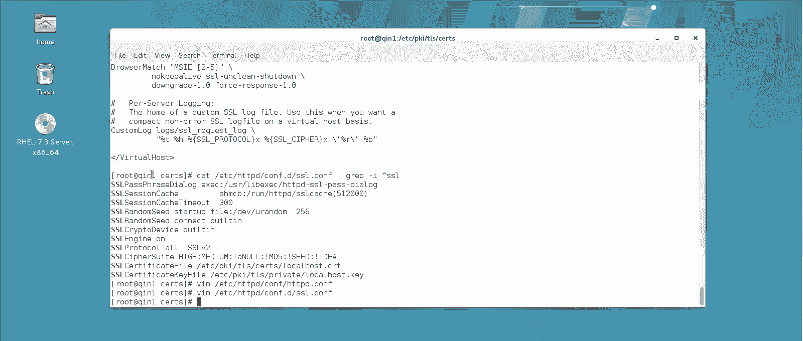

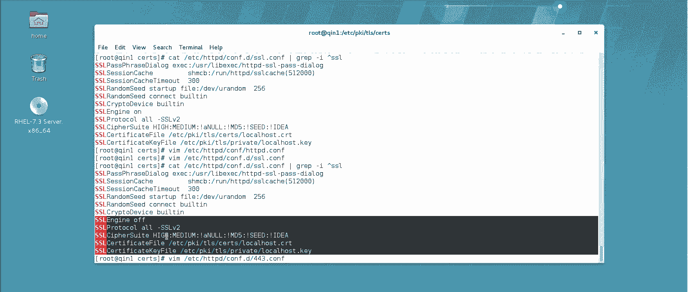

O下插一行，把这五行粘进去。这个地儿打开啊，这儿这儿变成什么呢？啊，这个打开除了这个V2的呢，V3的也不行。V3啊，这个这个这V2和V3这两个版本的都有问题。所以说我默认生产中一般都不打开啊。

这个的证书在哪呢？就在这个文件夹下，应该叫琴点st，这个应该是叫。琴点戏对吧？你要是不放心，你可以再看一眼。是吧有这 key。有这证书是吧？哎，都有。好，那么这是什么意思呢？

在这个网站上激活这个功能SSL这种加密功能，除了这两个协议，然后证书在这儿密钥在这儿好。保存退出啊保存退出。然后呢我们得把这个。给他重启一下。重启一下，你看他这让你输入刚才那个你给这个网站。

你不是给他做的时候，你不是生成的时候，我说了，你那可以回车，也可以输密码嘛？那建议输那密码，其实就是管理他的啊，123点com，我刚才输的是那个啊，你以后啊只要是碰到这种加密的，你不输这密码过不去啊。

这是提高安全性的。但是你那要只得一回车也就直接回车了啊，生产一线建议设一个建议设一个啊，那么。然后呢，我们来看一下我们来打开网页看一下。

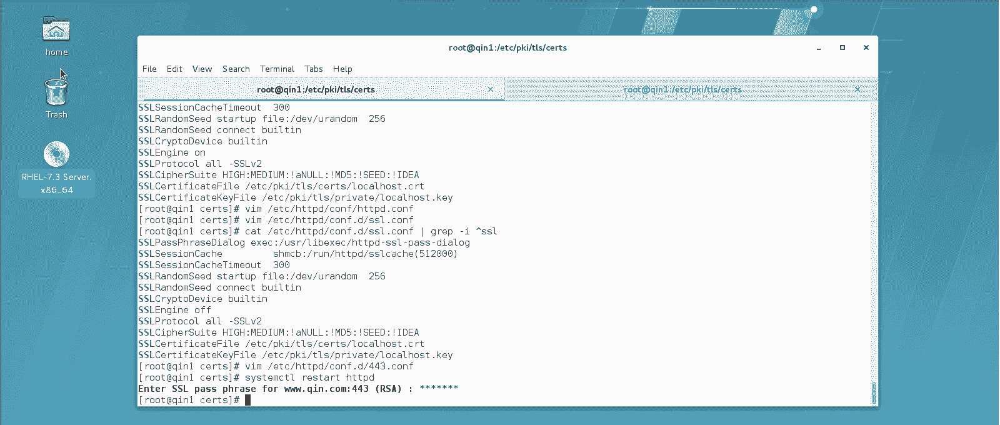

啊，那么首先来说你要是直接访问他80的，肯定还是能访问的。你比如说你默认。这样80的是没问题的。但是呢你注意你如果现在是用这种方式，HTPS。回说看见没有？他说你的连接啊现在不安全，为什么不安全呢？

这是加密的啊，那这种时候怎么办呢？你得去获得证书，怎么获得呢？点这个adance高级啊，上面要添加特殊除外啊，然后呢，这儿你的网址当时那证书服务器是不是这个名字呀，对吧？

你获得certific certificateific这是获得证书，就获得那证书了。然后呢，config securityex啊，配置完了之后你就能访问了，注意这把锁都是绿的啊，如果你没获得证书。

没通过这个认证，这肯定是打一斜杠，你不能访问它啊，不能访问它啊。

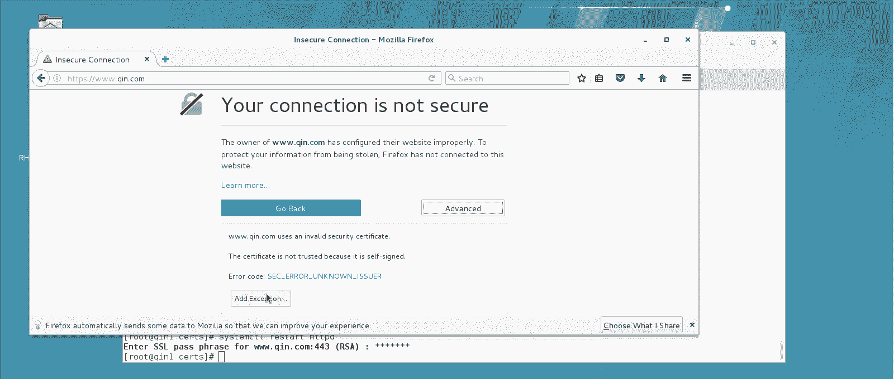

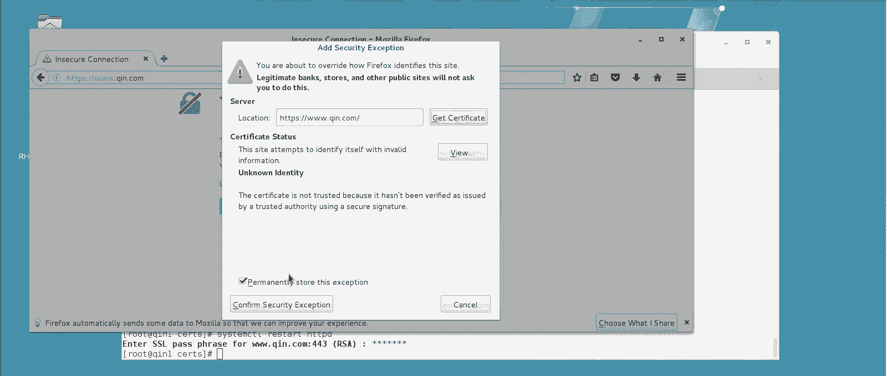

同样的在别的机器上也可以试啊。你比如在这个前二的机上，但家注意啊，秦二我现在还访问不了这个。

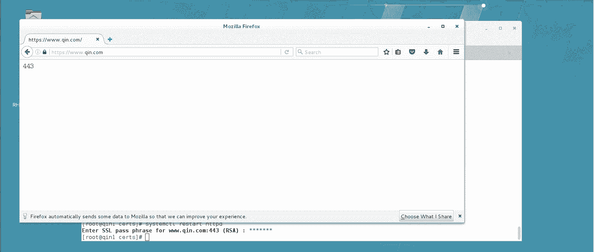

那个域名的。我得把这密码解析先填。对吧。好，然后我再打开这个火狐浏览器。

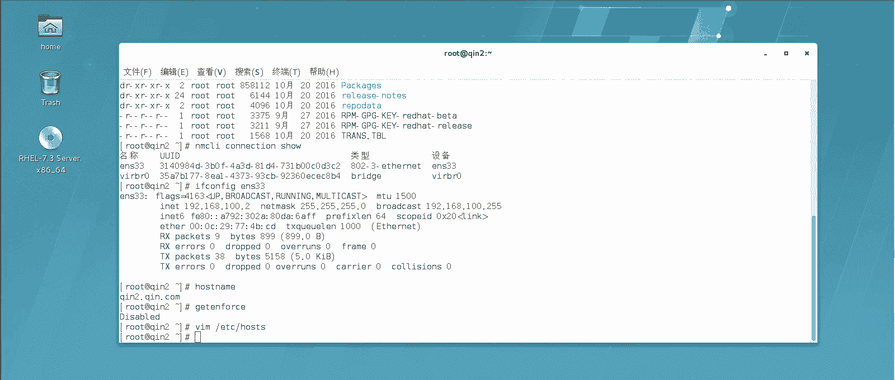

也能访问的，应该3W点7。号。你看默认访问80是没问题的，是吧？然后呢，如果你要是通过HTTPS来访问的话。第一次他都要让你去弄证书啊，高级啊添加例外获取证书啊，你看你要去从哪下载证书，你从哪下载证书。

你刚才配置文件里不是写了吗，是吧？确认安全地位。好了，过来了也能访问了啊这是咱们怎么通过这个呃HTPS去访问这个网站啊。

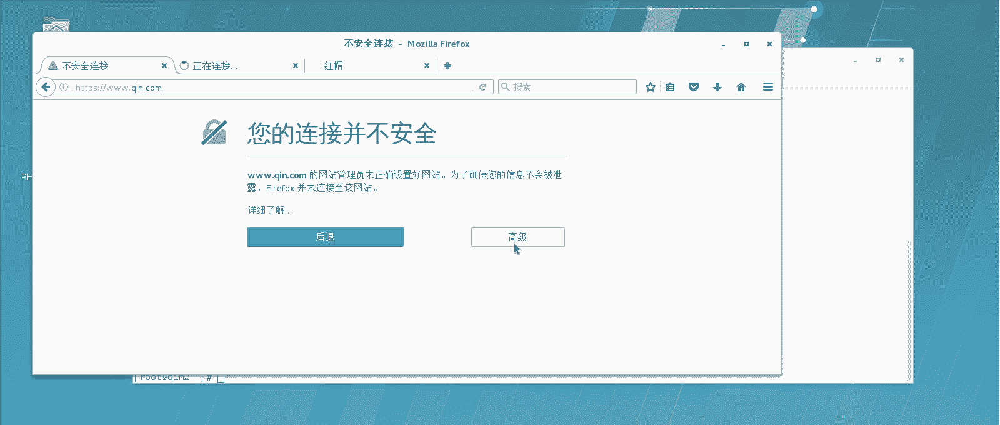

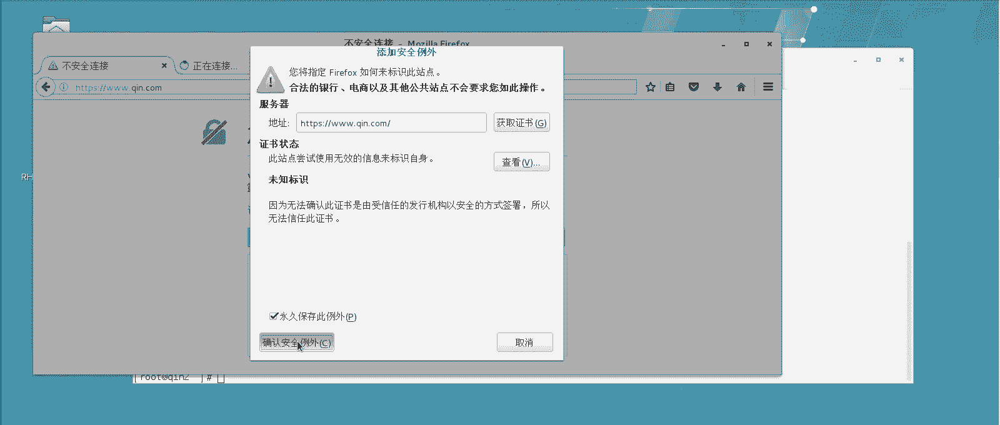

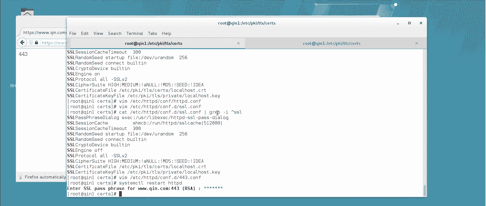

那么在这个生产一线呢，就是加强安全性的，用443端口加强安全性，让他走443啊，HTPS这种技术还是非常的这个常用的啊。但然讲到这儿其实可以再扩展一点。比如说。

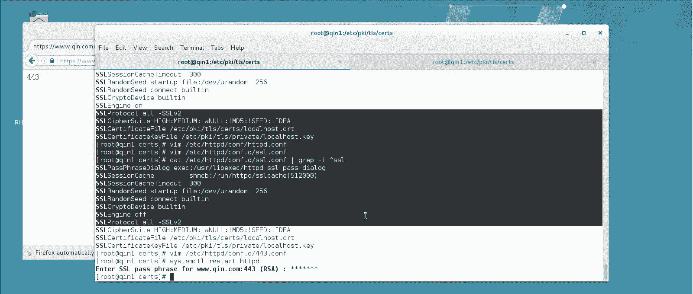

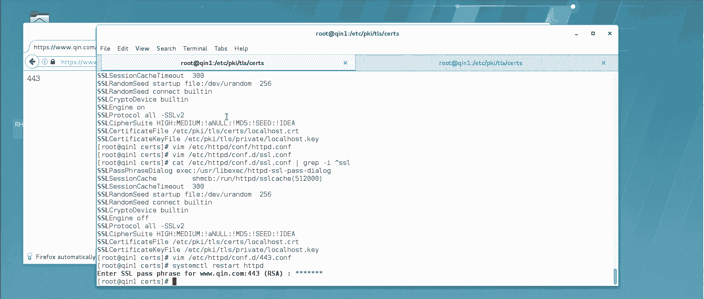

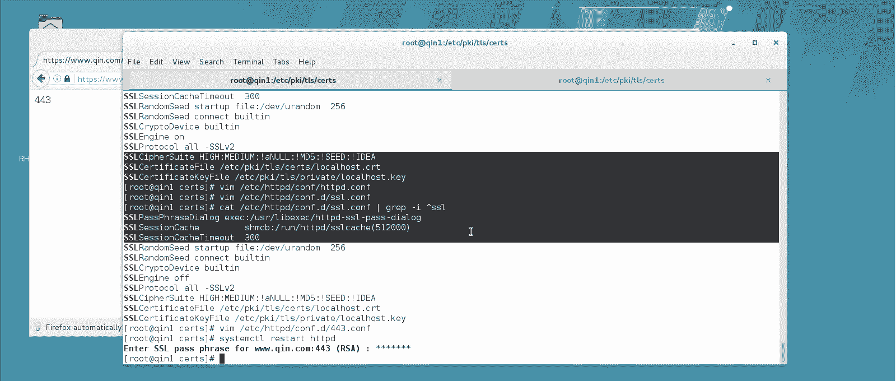

别人说了，说你有说老师，你看我通通过HTPSS过来是危险，但是我通过HTTP这不也能访问到那网站的吗？有没有办法说我不让他访问这HTTP的，就必须让他只要是这网站啊，必须做HTPS的，可以吗？

是可以的啊，这怎么做呢？呃，你直接在比如说你现在这网站啊。卡点地下的，比如说你这不是零点c，这个网站是那对应的80端口那个吗？你以后想让它，比如说有的用户只要一访问这个的。

你就想想给他跳转到AGPS可以吗？可以在这底下加一段话啊，这段号就直接复制过来了啊。

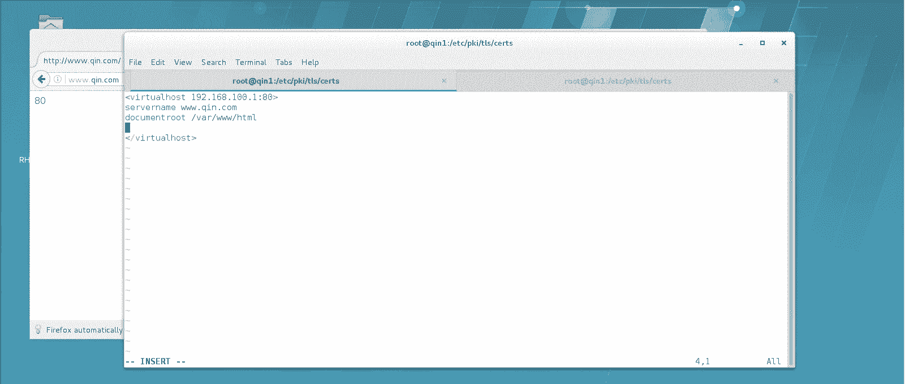

嗯。假。