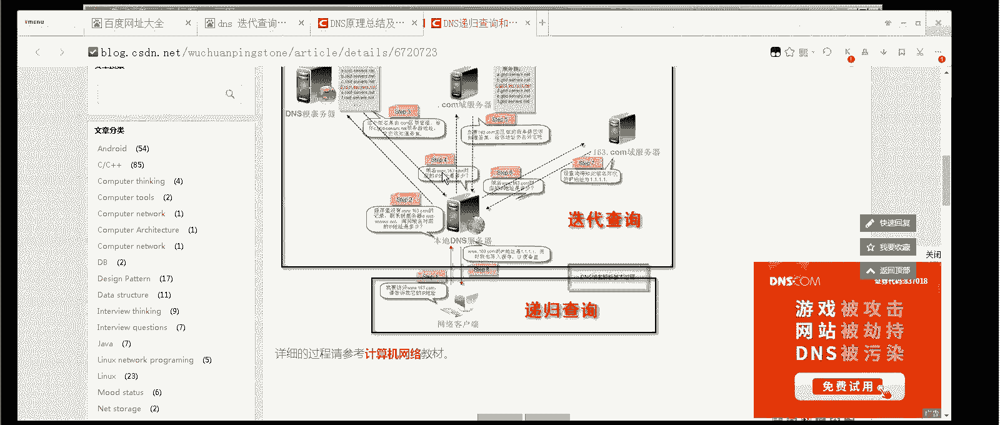
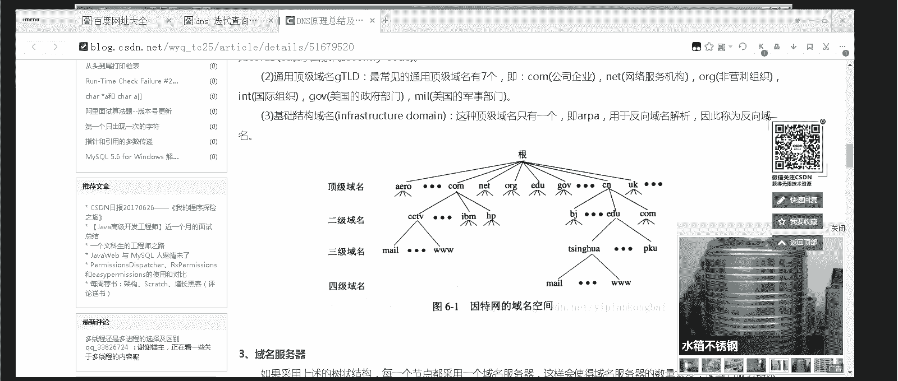

# 【云知梦】Linux实战中级篇／RHCE认证／RHEL7／CentOS7 - P9：第9集 DNS服务器(一) - 云知梦官方账号 - BV1iV411h7ia

。

好，那么这张我们介绍一下这个DNS服务器啊，DNS。那么其实前面我们也说了，说这个按说中极课程呢呃第一章就应该先讲它啊，为什么没讲呢？就是咱当时说这这章理论概念有一些还是有点枯燥，有点难啊。

所以说呢咱们考虑到这个难度呢，先讲了一张这个we部服务器啊，通过那一章呢，咱们把一些什么端口啊，协议啊，一些呃基本的一些服务的一些概念，咱们先摘出来，先讲一讲啊，咱们再讲这张可能就是舒服点啊。

不至于那么突兀啊。那咱们说什么是这个呃DNS呢？首先咱们连看一看这个它实际上是个缩写啊，它是个缩写。

是什么的缩写呢？我们看啊这儿呢。叫do漫 name system啊，域名系统啊，是说白了是干嘛呢？就是它是域名和IP做解析的啊，域名就是咱们平时你比如上网输这个啊。🎼是吧这个他呃输这个域名。

那咱们说这个好记是吧？那真正的实际上怎么去连到这个服务器上的？底层这个服务器不认域名，他认什么呢？认这个IP地址。

🎼但是如果说你直接输IP，你可能麻烦。你比如202。99什么100。68，你输这个东西这个不好记啊，很难记。那么怎么办呢？我们就是说还是记这个域名好记。然后呢，通过这个DNS。

做一个转换啊，它能够把这个域名解析成计算机能识别的IP啊，反过来它也可以把这个IP呢反向解析成一个英文格式的域名啊，这是做DNS啊，那么它对网络中的所有主机都能提供这种服务是吧？啊。

那么它就是叫DNS服务器啊，咱们一会儿会讲这个现在主流的DNS服务器啊，那么。这个呢呃是一方面的工作。实际上来说它还有更多的啊。比如说呃DNS它有些网站啊，它是直接你输IP是访问不了的啊。

那么只能通过域名方式啊才能去过去。所以说呢这真正在生产一线DNS用途非常广啊，非常广。这是咱们讲的DNS概念啊，那既然讲到它是个域名系统嘛，那么咱们再说说什么是域名啊，域名很好理解。

就是你看咱们输这英文这个这网址啊，包括说我们说主机的这个这个house name。

这些咱们看这不都是域名吗啊，注意啊一定是这种子层级结构的啊，这种叫域名啊。实际上真正这个域名来说，这个没写完啊，真正域名后边还有一点儿。

🎼你看这个啊这实际上是真正完整的这个域名啊，有同学老师呢我怎么平时不输也行啊？对，默认这个点可以省啊，就跟什么呢？就跟你输的APDP这冒号斜杠是不是也可以省是吧？一个意思啊，都可以省这个点叫什么呢？

是根域啊，这怎么理解呢？我们其实在生产一线这个域名的体系结构是什么样一个结构呢？它也是跟那个目录似的，是一个倒数型结构啊。你比如说我。

我给你搜一下啊。我们找1个DNS的图片的结构，看看有没有啊。嗯，这个哎这个清楚啊，这个你看实际在这个网络之中，这个比如说互联网的域名它是什么结构呢？是这个结构啊，就是它这个在互联网中这DNS服务器啊。

它是按层级来存储这个域名的啊。你比如说我真正去查百度点com新浪点它不会直接就到这个地，它会怎么办呢？先搜这个点这个点叫什么叫根域啊，根域里储存着什么呢？点com的信息点net信息点OG啊。

这种这种叫顶级域名一级域名啊，那么比如说哎你看它这例子举的就是新浪啊，挺方便。那你比如说我查新浪，它首先你去跟上查，这是根域服务器啊。

根域服务器储存着点CN的信息点CN呢通过它你再查到点com点CN这些服务器在哪。然后呢，这里边又包含了其中有新浪点点CN的信息，最后才能查到新浪的3W点新浪点这台主机啊，到这是主机位了啊。

上面就是一级域名。

级域名三级域名，这是最后的主机位，包括新浪的邮件服务器是mre点新浪点com这台主机IP是多少啊，它是这么样一个结构啊，也就是说它不可能说呃根据服务器上把这个整个所有的这域名全都存下去，它存不了啊。

那那那么多信息，这根据服务器性能再强也压崩了啊，所以它都是这种分级存放。这是咱们讲这个域名啊，那作为最重要的这个根域服务器。他有多少台呢？你比如说你去搜一下根玉啊。

根予。啊，这是图片。根预服务器呢整个互联网上来说，就种最著名的这种跟预服务器啊。有多少台呢？有13台啊，13台，你看啊这13台分别是A到M啊，这13台呢分布在哪儿呢？分布在全球啊，但实际上来说呢。

主要分布在美国啊，你看什么南加州大学，什么这这这马里兰什么互联网协会啊，这互联网协会他也在美国。然后什么美国国防部啊，什么防御啊，什么陆军，然后呢，瑞典有一台啊，我记得荷兰还有一台，对，还有谁呢？

小日本有一台啊，咱们中国呀没有啊咱们中国只有16组吧，叫什么呢？叫根预服务器的镜像啊，那镜像是什么意思呢？就是说你看啊刚才咱们说了说这些信息都存在这个根域上，就顶级域的信息都存在这个根域上。

那么他它相对来说压力比较大。那怎么办呢？他做一些镜像啊，这些镜像呢替根预服务器分担一些工作啊，大概有几百台啊，真实的你看根预服务器到这14年300多台啊，逻辑的啊根的这一共这么多啊，这些是核心。

这是互联网的这个DNS解析的核心啊，就这么多台啊，大部分控制在美国人手里啊，所以说真正如果有一天啊。

这怎么说呢？万一要有一天真弄崩了是吧？这这个也有点事儿啊，因为咱们中国现在没有啊，咱们只有镜像，就是说从人的拷贝过来的备份啊。嗯，当然了，美国这块呢他有个态度，美国当时他说了说我这个我作为一个这个国家。

我掌握着全世界的资源不合适，他把它交给这个互联网协会了。前两年啊，但实际上这个也有点瞎掰，为什么呢？这这这协会就在美国啊，你这交不交的吧。不太好说不太好说。

所以说呢呃为了应对这个呢就是咱们有一些关键的地儿有一些内部网络。你比如说军队有军网啊，教育口呢有什么教育网，它有一些单独独立出来的网络，包括咱们自己的这些镜像服务器吧，咱们也是考虑到这个问题。

就是万一有一天真的说咱们有点什么问题的是吧？咱们也不能说坐以待毙啊，就是咱们讲这个根域服务器以及这个域名的概念啊，那么在网络中呢，这DNS服务器。

它就是通过这个结构啊这个结构来把这个域名一层一层的解析出来，成为一个IP啊。你比如说咱们解析两个吧，我们用什么呢？用NS lookup。

这个工具windowslin都支持啊，我们可以来解析。你比如说咱们解析谁呢？解析一下它吧。百度啊，你看我解释出在假IP什么意思呢？这是我说的，就是在互联网里啊，你不用DNS服务器，还有一麻烦事在呢？

就是它这个真正像百度新浪这种服务器，它不会是一台的，那几万台呢啊几万台就叫这个3W点百度点com这个专门提供这种服务的主机就有很多台啊，这两台是它DNS记录里边摘出来。

就是我访问百度这个网站的这几万台服务器里离我最近的，它可以通过P来测一下啊，那么我直接输这个IP呢能不能访问这网站呢，呃，有的网站能有的不能。你比如说这个啊这叫18014913198。

180149什么131。

98是吧，哎，你看这是可以的啊，百度是可以的啊，180149132151，比如说132点151。

也可以，你看啊，但不是都可以啊，不是都可以。你比如说那个。我印象中这个就不行。啊这个应该就不行，你比如这叫什么121点14点1。190，121141190。

12114，哎，我这有记录啊，您看。呃，190是吧，121。190不是191190，你看啊他告诉你什么access denied啊，ded给你拒绝了JIP吗？你看。

这儿12114。1。190。他为什么拒绝了呢？就是说这个跟那个安全策略有一些关系啊，跟一些安全策。有关系啊，什么意思呢？就是说有些网站他为了防止你恶意攻击啊，他不让你直接通过这个IP访问。

所以咱说你要真没有这DNS服务器，很麻烦的啊。你第一个你不能判断是吧？你几万台服务器，你你你直接出这IP你不知道这IP这台服务器离你是近呢还是远啊，再一个有些网站根本就不让你直接通过IP过去。

所以说DNS在这个生产一线很重要啊，关于这个安全策略这块怎么说呢？这个其实也是以前出过事儿啊，呃，为什么有些网站不让弄这个呢？就是当年呃说这话还得是。

得有个十几十几十大几年20年了得啊。当年呢就是哪个网站我就不说了啊，有一个网站，当时是那会儿网络也不是很发达。当时他有一些这个就是呃就是对对咱们中国就不太好的一些言论啊，所以当年呢那个当年上网的人很少。

当年有一个组织就是清华大学的论坛，当时上上上网很多人去那个叫水木清华啊，那个论坛当时他呢就发起活动，发起什么活动，就是说这网站是怎么这么有一些反华的一些东西是吧？说咱们中国人这个那个的。然后呢。

他就他当时号召就是知识分子嘛，是吧？你也不能动刀动枪的砍人家。人就说咱们咱们这个聘他一下啊，大家都这聘这东西挺有意思。聘的话，他是等等于什么意思？就是聘是这样发过去一个数据包，然后再返回数据包。

然后算这个时间啊，实际上他主要是为了测通不通的。但实际他的工作原理，他是往那个地儿发数据包的，然后还会返回一个数据包啊，那么。

他号召那个就是大家pin他啊，其实按说这个数据流量不大啊不大。但关键咱们中国人多呀。早晨发的帖子吧，我记得是，然后那个到反正上午那会儿吧，北方地区啊就都知道这事儿了。呃。

中午下午那会儿反正南方地区也都知道了，到傍晚时分啊嗯海峡两岸就都知道了啊，后来那网站好像就就淡了，就淡了啊，这招只能中国人用只能中国人用。啊，这是开个玩笑啊，说点题外话啊。

就是说所以那以后啊有些网站就是他进什么ICMP啊，他进SCMP不让你拼啊，包括说有些根本就不让你直接去IP这么访问啊，它就是其实为了提高一些安全性啊。呃。

所以说呢反过来也说就是DNS服务器在企业之中的重要性啊，非常的大啊非常大啊。那么真正来讲说咱们讲这么多这DNS服务器这好处啊，包括用途啊，它真正的工作原理是什么呢？

我给大家画张图啊，这个原理就是我说的啊，就是这个这个这个原理比较复杂，就是DNS真正在查询的时候，你光看它域名啪机返回EIP是吧？IP返效解析域名，那这过程是怎么怎么解析过去的是吧？

这里边呢其实DNS服务器啊有两种查询模式啊，一种呢叫迭代查询，一种叫递归查询啊，你你不用管这词儿啊，我我也不想给你管这词儿，因为什么呢？你你真要是说你看这个词儿，我估计。能给你能给你听哭了。

你比如说你搜DNS。别的哎，这不有吗？

你真正你要是比如说你随便找两篇帖子，你听这帮这个网上的专家们，他就给你解释哪个叫迭代，哪个叫递归。

这能给你讲哭了啊，这真的给你讲哭了啊。呃，我用这个普通话给你讲讲吧啊，这个咱们用普通话讲讲，真要画这图，这这么讲就麻烦了，这么讲出来有点恶心啊，有点恶心，它是怎么个过程呢？我给你画一下啊。

比如说咱们从谁画起呢？咱们从这个生产一线啊，生产一线，比如说我企业内网有一个客户端啊，有一个小客户端访问外网开始啊，这个比如说这叫ant一是吧，他想访问一个网站，比如3W点这个这个这个百度点啊。

好比说啊这个网络中啊，这是第一个人访问这外网啊，他访问的时候是一个什么过程呢？他首先会查什么呢？本机的house文件啊，他会查本机的houses文件house文件，这个咱们前面外服务器。

那张咱们讲过是吧？这个文件呢这个优先级最高啊，他首先查这这如果有这个解析记录是吧？他就不往外走了啊，那如果这没有呢，他会查本机的DNS缓存啊，他访问过哪个网站，它会有一个缓存啊。

如果这缓存上也没有他就得往外找DNS服务器了啊那么企业生产一线一般有什么样的DNS服务器呢？首先来说企业生产一线一般都会有。有一个主电S。主进S我们叫什么呢？叫。

我们叫慢DNS server就是主DNS server啊，当然可能还会有从的啊，还会有一些，包括还会有一些什么呢？最多的应该是一些叫缓存DNS服务器啊，我者画仨吧啊画仨这三台缓存DNS服务器。

他们顶上是不配置信息的，他们的数据从哪来？从这个主DNS服务器来。主DNI的服务器上一般内网的DNI的服务器啊，它里边存的是什么呢？存的一般就是它内部的网络的一些主机这些信息啊。

咱们说的说你看这主机名是吧？

你这个内部比如说好几万台机械是吧，它一般起名的时候，也用这种域名的方式，就是这种层级的是吧？一级、二级、三级这种格式来取的话，比如说它这个可能是呃这机器，比如说。是吧红包他这公司可能这域名叫这个啊。

那他北京地区呢可能前面是这样啊，那北京地区的比如财务部的是吧，它可能是这样的啊，那可能说这会计的主机，前面主机名这样啊，你通过这个域名，你一目了然就可以看到这个哥们是哪个部门的，哪个城市的是吧？

哪个公司的是吧？那上海的呢可能这这这位就是上海，它一般是这种域名结构，那这种域名呢，企业中比如1万两台2万台机械或者说多少台机器它比较多啊，这种这种这种记录呢，一般它对应的内网IP是吧？

也不可能去外网DNS上去查。所以这部分记录呢就主要是搁在这个主DNS上。比如说呃1。2。168。100。1啊，这台。

先示主机名吧，勤一点勤点烫啊，它对应的这个IP。1点点168点100。1米啊，类似于这种记录都在这个主DNS服务器上啊，那么为什么不让客户端直接连到主DNS上呢？因为你这这么多电脑是吧？

其实中客户端这么多，你要都连到这点上，就从这解析内网这些域名信息是吧？那万一给他弄崩了怎么办是吧？所以说我们一般在生产一线，客户端不让它直接连接到主DNS然后呢让它连接到某一台这个缓存DNS上。

比如连到这台上啊，这些叫什么呢？这些都叫什么呢？Catch。DNS。啊他们都是缓存DNS啊那比如连到这台上，他去查说有没有这3W百度点com信息呢，说没有没有怎么办呢？他再到主DNS上去查啊。

他再这如果说这有了他直接就回来了直接就回来了，就不到主上了。如果说这没有到主上有了，那他也直接这么一路沿沿路就回来了并且沿路经过的呢？这是为什么要缓存DNS呢。

只要是过他他上就留一份缓存记录以后比如说再有一机器上网查到他了，他直接就从这个记录里给你了，就不用再往外走了，减轻主DNS的压力啊，那么为什么要有三四台的这种多台的这种缓存DNS呢？

就是说你比如说北京公司的连到这台上上海公司连到这台，或者说财务部连到这是吧？会计部连到这什么销售部连到这，他是为了分散一点这个主DNS服务器的压力，而且来说相对来说安全一点。

你不让你直接从这这些记录就对安全一点这是在企业生产一线内部的这DNS。那如果说一直访问缓存这没有到主DNS上，你这全是内网记录，也没有这条信息怎么办呢？那就只能往外走了啊，那就只能说往外走了。

往外走到哪儿呢？你看你的运营商了啊，你你是从联通弄的这个宽带或者从移动，比如说咱们是从联通啊，这机器，比如说这是谁呀？联通啊，那我就会找联通的这个DNS。啊。联通DNS上如果有一般来说肯定有啊。

如果有他就回来了，说感觉那么巧，假如说那么巧巧到什么程度，联通ADNS上也没有，这是整个网络中第一个搜索这信息的，怎么办啊，怎么办呢？他会这么办跑这儿去。注意啊，这块有点复杂了啊，开始要到迭代这了。

他会首先访问谁啊，那都没有怎么办啊？你这个域名的完整格式注意啊，这是不是还有个点啊？所以它一般来说这个第一个访问谁啊？就是访问这个点儿。不用英文这个点儿。访问他，也就是咱们说这根域啊，访问根域去。

那根玉这说大哥，你看啊，这这这网址你你知道吗？这点上咱们说的根玉上不会储存这么详细的信息，否则你这不把根玉给累疯了是吧？存那么多他存不了。那点说了点儿说哎呦，我这点上只存了一级域名的信息啊。

你这不是这格式，最后一个一级域名，这层是点com吗？我可以告诉你点儿com这些DNF的服务器，就是储存一级域名的这些DNF服务器都是谁？他把这信息发给你了，说这些信息我给你啊，他们上面储存的是一级域名。

那其中这点这根域上储存的肯定有点com的，有什么点CN的啊。你比如说这一堆。这个里边点com好，他告诉你这些服务器上存点com是吧？那怎么办呢？你再问他去，你说哎，大哥，你问你个事啊。

说这个3W点百度点com这这这这这主机IP是多少啊。然后这个一级域名这点com这域名服务器说有兄弟，我也不知道。但是我知道百度点儿com就是我那储存的是点com结尾的这个二级域名是百度的这些信息。

我能告诉你。他给你发回来信息，告诉你百度点com的这些信息啊，然后呢呃你就再往这儿去找这服务器上啊，比如说到这儿了，到这级了啊，这下存的是二级域名。百度点com的信息是吧？然后呢，你到他这身去找。

你说大哥，你问一下3W点百度点com到他这能查着了，为什么呢？前面就剩一主机位了，到这儿他肯定知道他里边存的是什么？就是关于百度点com的这个主机信息，3W点百度点com啊。

什么麦点百度点com啊FTP点百度点com啊，就是这些主机的信息啊，那么具体跟百度的里边的所有的信息，他肯定这服务全都有啊，这服务权都有。那他就会真正的把这个信息导回来兄弟，这回我知道了。

那你要找那哥们儿。他的IP是谁谁谁，然后那台服务器在这儿呢，那么其中这台啊他会咱们刚才看了啊，解释出来是俩，为什么呢他会挑俩给你啊，挑俩给你那那离你最近是吧？啊？

反正你在北方他肯定不会给你这个电信的这个IP是吧啊，那好，得到了以后呢，你联通就会把这个。

数据导回来啊，导回来往这发是，兄弟，我可给你查清了。在这儿呢返回到这儿返回到这儿呢，你这又一步一步回来。最后这个客户端得到这个信息之后，他呢在。过来访问这台3W点百度点com的某一台服务器啊。

这个过程之中呢呃DNS服务器之间这一来一回这种的这叫什么迭代查询啊，一来一回一来一回一来一回这么着反复的这叫迭代。那么你们之间这种直接的这么着查的，这叫什么这这叫递归查询啊。

你不用说具体的什么叫迭代递归，你不用管那个，你只要知道他查询这过程就行了。就是一级一级的往上查啊，然后一级一级的有信息往回倒，最后导出来是这信息啊，那么在你们这企业里。

如果说又有一台计算机叫clant2说这哥们也要访问这个信息了。这机器叫ant2他也要访问3W点com，这回就省事了，他还是会先查自己本机的hot文件然后再查本机的缓存DNS缓存如果没有是吧？好。

这个时候注意啊，他如果是查这台的话，如果他指的那个缓存DNS恰好也是这台，到这儿有信息直接就回来了啊，不会再往上走了啊。如果他导的这台那这台回会找他这点上不是也有缓存记录嘛？

因为所有他路过的这些服务器上都会有DNS的缓存记录啊，也就直接回来了。或者说如果他再查一个谁都没查过的信息，那他只能再往外走啊，到哪一路上有哪一步回来，这一路上就都有缓存信息了啊。

所以我们发现有的有的网站啊，你要是特别新第一次访问有点慢，因为解析过程慢，你后边越访问你觉得挺快，就是有缓存记录了啊，这是咱们讲啊这个内网和外网DNS整个的这个域名解析的这个过程啊。

那中间咱们可以划到线。这条线什么意思啊？真正在生产一线，你关心的？一般情况下是内网的DNS为什么外网这个不用你管啊，人家有人管啊，除非你说你以后上班，你就去联通移动这种运营商去啊，你可能有机会能摸到啊。

否则的话，更多的时候你是管内部的就是咱们这个内部的DNS管理才是这个重中之重啊，你怎么去做主DNS啊，怎么去做这个缓存的DNS啊，这是重要啊，那这是咱们讲这个整体这个结构啊。

你不用去琢磨什么递归什么迭代这些理论，你主要是明白它这个过程啊，这种分层的一级一级的查询的这个体系啊。

