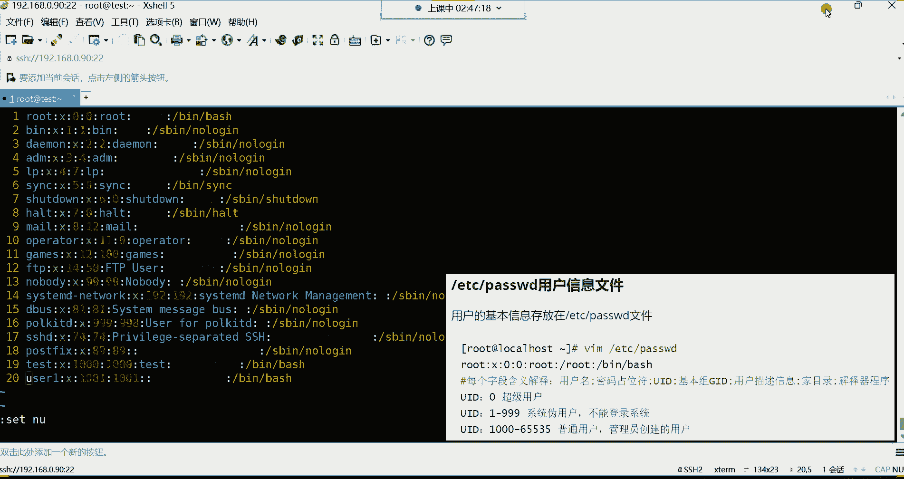
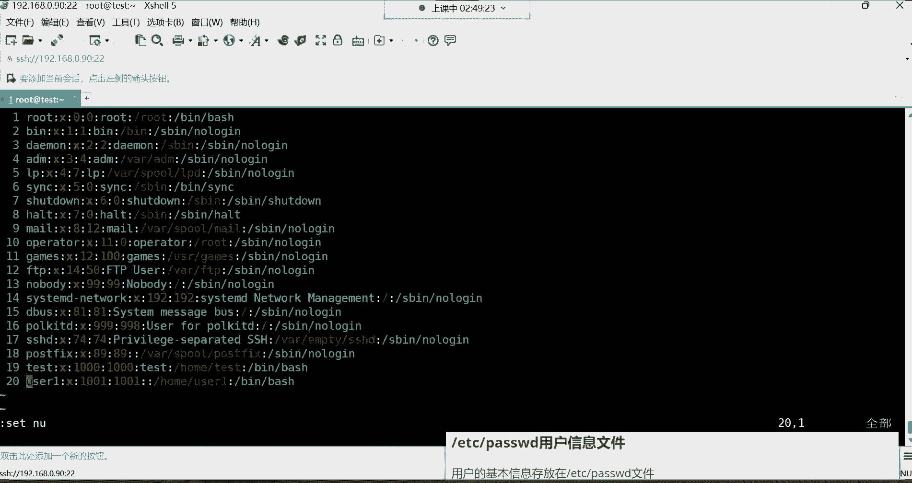
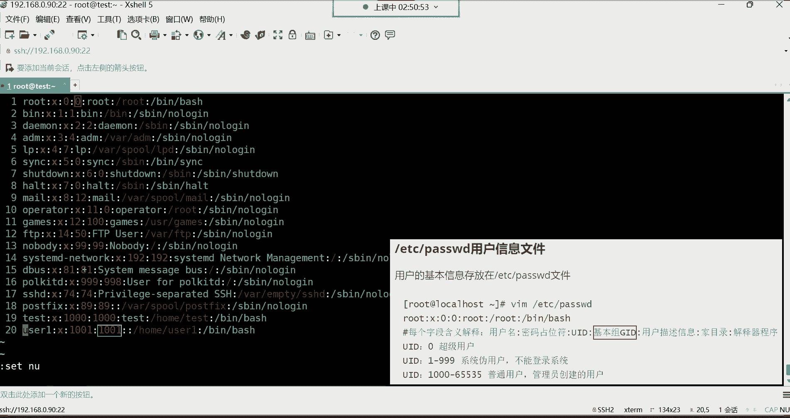
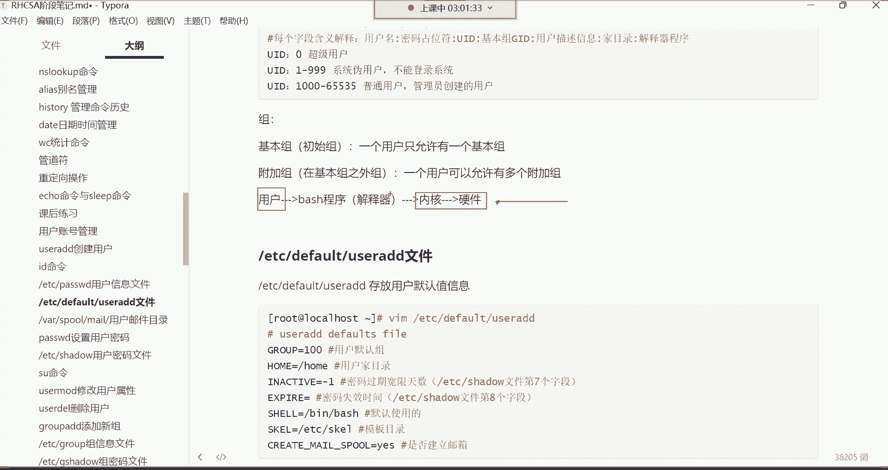
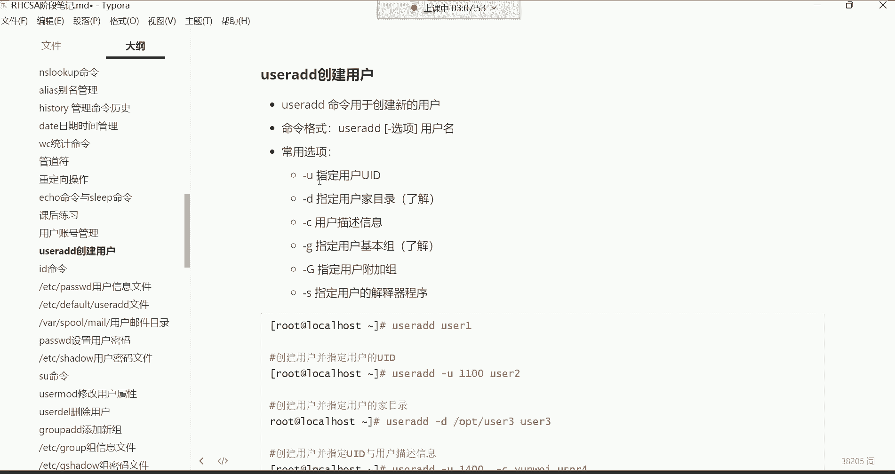
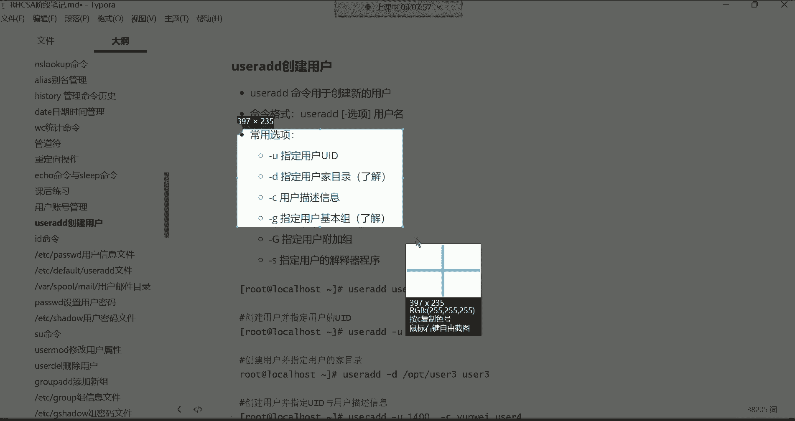
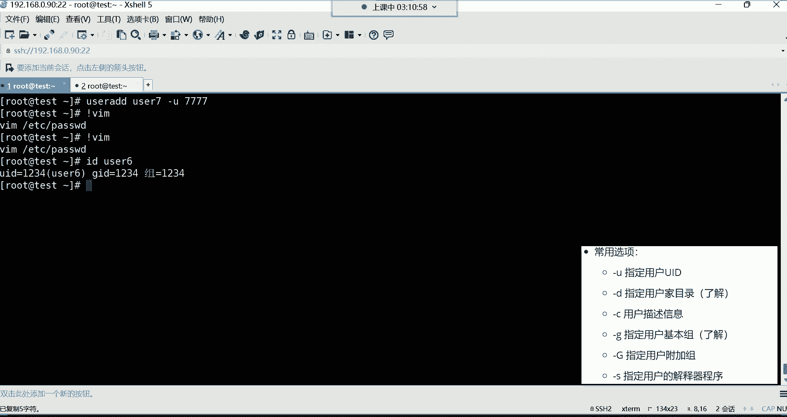
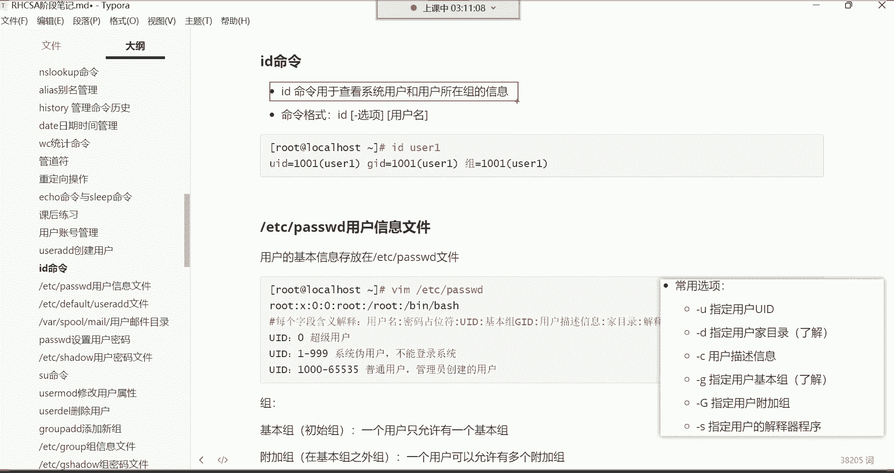
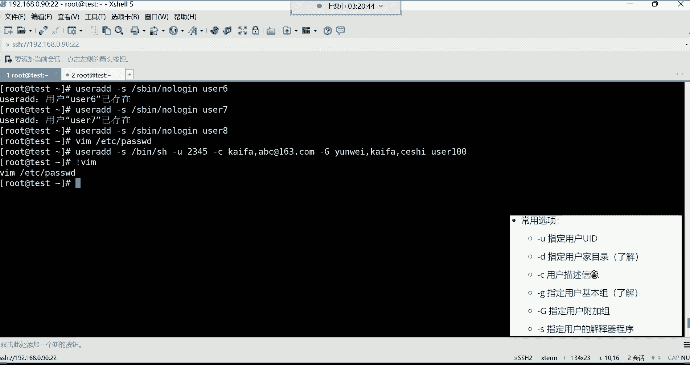

# Linux运维教程：P15：用户管理、用户信息文件详解 👤


在本节课中，我们将要学习Linux系统中的用户管理，包括用户账号的作用、分类，以及如何创建和管理用户。我们将重点解析存储用户核心信息的 `/etc/passwd` 文件，并学习 `useradd` 命令的常用选项。


## 用户账号概述


用户账号是登录系统所必需的凭证。系统中有两类用户：**超级管理员（root）** 和 **普通用户**。由于root账号权限过大，在企业中通常只分配给核心运维人员或部门领导，普通员工则使用权限受限的普通用户账号，以保障系统安全。

## 用户的模板目录

在深入用户管理之前，我们先了解一个概念：用户的模板目录 `/etc/skel/`。这个目录下的隐藏文件（如 `.bashrc`, `.bash_profile`）会在创建新用户时，被自动复制到该用户的家目录中。这些文件为用户提供了基础的Shell环境配置，例如命令别名、历史记录存储等。了解此目录即可，无需深入探究。

## 创建用户：`useradd` 命令




创建用户的命令是 `useradd`，此命令仅限root用户使用。命令格式简单明了：`useradd` 后跟用户名即可。




例如，创建一个名为 `user1` 的用户：
```bash
useradd user1
```
用户名需使用英文，不支持中文。创建用户后，需要为其设置密码才能用于登录系统。



## 用户信息文件：`/etc/passwd` 详解


用户创建后，其基本信息存储在 `/etc/passwd` 文件中。此文件至关重要，若被删除，所有用户（包括root）都将无法登录。

打开文件查看：
```bash
cat /etc/passwd
```
文件看似复杂，但遵循严格的格式。**每一行代表一个用户，每行以英文冒号 `:` 分隔，共包含7个字段（列）**。

以下是每个字段的含义：

1.  **用户名**：用户登录时使用的名称。
2.  **密码占位符**：历史上此处存放加密密码，现在密码已移至 `/etc/shadow` 文件。此处统一用 `x` 表示。
3.  **用户ID (UID)**：用户的唯一身份标识，相当于身份证号。
    *   `UID=0`：**超级管理员**。系统通过UID而非用户名判断超级用户身份。
    *   `UID=1~999`：**系统伪用户**。这些用户真实存在，但**不能登录系统**，其作用是供系统进程或服务运行时调用，以继承相应的权限。
    *   `UID>=1000`：**普通用户**。由管理员创建，可用于登录系统。
4.  **基本组ID (GID)**：用户所属的**初始组（基本组）**的ID号。创建用户时，系统会自动创建一个与用户名同名的组作为其基本组。一个用户只能有一个基本组。
5.  **描述信息**：用户的备注信息，如部门、联系方式等，可为空。
6.  **家目录**：用户登录后所在的初始工作目录。root用户的家目录是 `/root`，普通用户通常在 `/home/用户名` 下。
7.  **解释器程序**：用户登录后使用的命令解释器（Shell）路径。默认为 `/bin/bash`，它负责将用户输入的命令“翻译”给系统内核执行。如果此处设置为 `/sbin/nologin`，则该用户**被禁止登录系统**（系统伪用户常用此设置）。


## `useradd` 命令的常用选项




上一节我们介绍了`useradd`命令的基本用法，本节中我们来看看它的一些常用选项，这些选项允许我们在创建用户时进行更精细的配置。

以下是 `useradd` 命令的一些常用选项示例：

*   **`-u`**：指定用户的UID。
    ```bash
    useradd -u 6666 user6
    ```






*   **`-d`**：指定用户的家目录路径（了解即可，通常不修改默认位置）。
    ```bash
    useradd -d /myhome/user3 user3
    ```

*   **`-c`**：添加用户的描述信息（备注）。
    ```bash
    useradd -c "运维部，电话：xxx" user2
    ```





*   **`-G`**：指定用户的**附加组**。用户可加入多个附加组，以继承这些组对文件的权限。组名用逗号分隔。
    ```bash
    useradd -G dev,test user5
    ```

*   **`-s`**：指定用户的登录解释器（Shell）。
    ```bash
    useradd -s /sbin/nologin user8 # 创建不能登录的用户
    ```

这些选项可以组合使用，以满足不同的创建需求。例如：
```bash
useradd -u 2345 -c "开发部" -G ops,dev -s /bin/bash user100
```

## 查看用户和组信息：`id` 命令

创建或修改用户后，可以使用 `id` 命令查看用户及其所属组的信息。
```bash
id username
```
该命令会显示用户的UID、基本组GID以及所属的所有组（基本组+附加组）。



## 总结


本节课中我们一起学习了Linux用户管理的核心知识。我们了解了用户账号的分类与作用，详细解析了存储用户信息的 `/etc/passwd` 文件结构及其七个字段的含义。我们掌握了使用 `useradd` 命令创建用户的基本方法及其常用选项，并学会了使用 `id` 命令查看用户信息。理解用户与组的关系，特别是基本组和附加组的概念，是后续学习文件权限管理的基础。对于初学者，重点在于理解 `/etc/passwd` 文件结构和 `useradd` 命令的基本使用，多练习是熟悉这些知识的最佳途径。