# Linux权限管理：P18：chmod权限管理

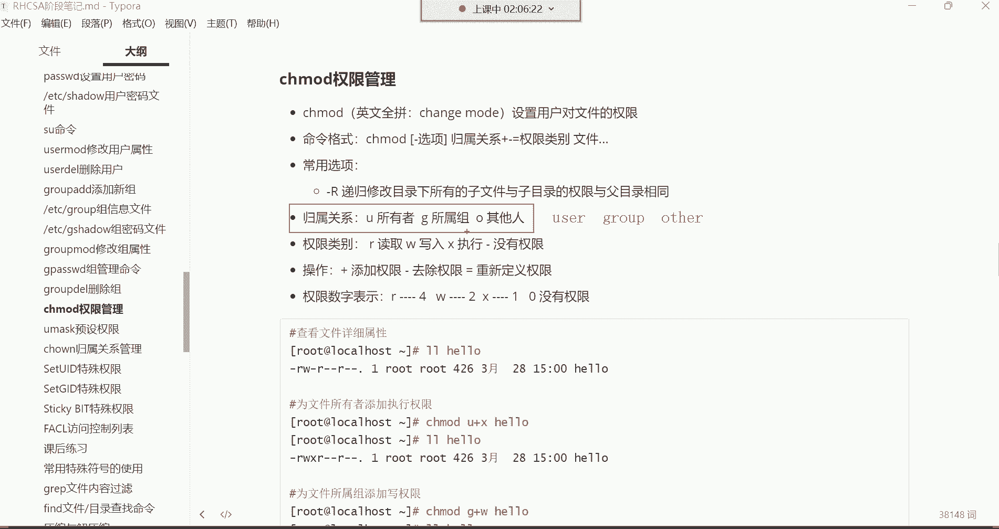

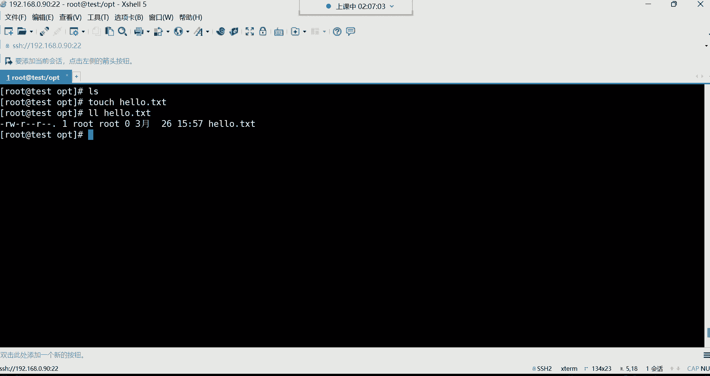

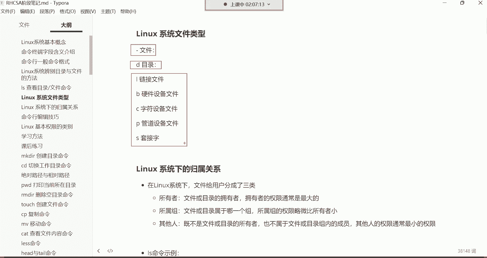

在本节课中，我们将要学习Linux系统中至关重要的权限管理知识。权限是控制用户对文件或目录能执行哪些操作（如读、写、执行）的规则。理解权限是掌握Linux系统安全和管理的基础。我们将从基本概念讲起，逐步深入到权限的设置与验证。

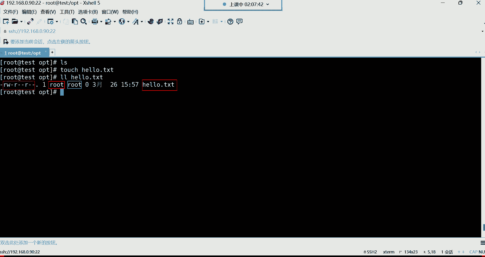

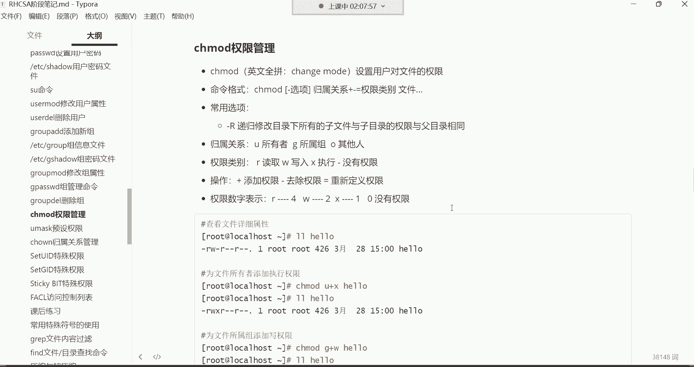

## 归属关系与基本权限

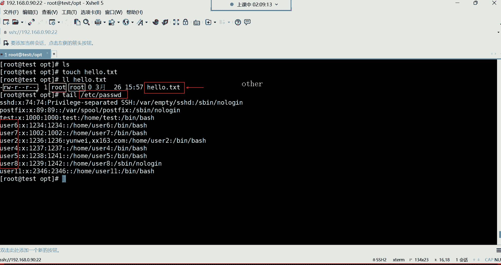

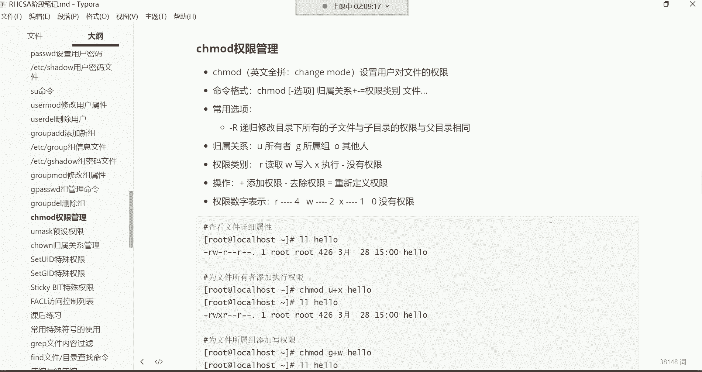

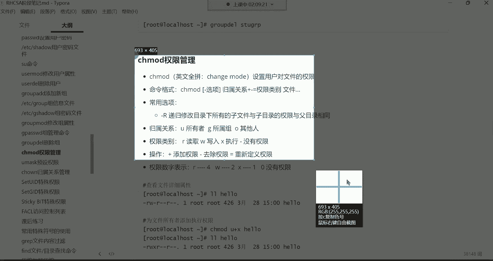

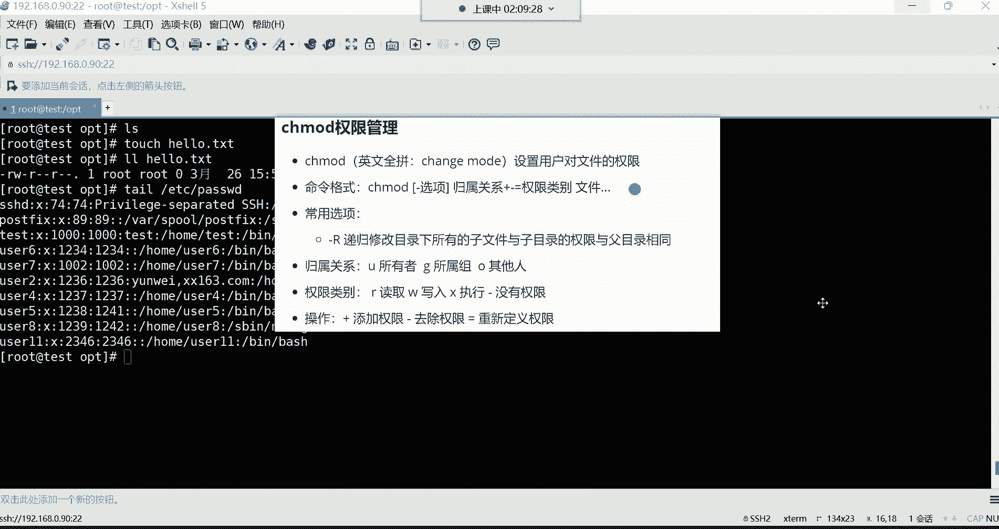

上一节我们介绍了用户和组的管理，本节中我们来看看如何通过权限来控制这些用户对文件的访问。

任何文件或目录都有三类归属关系：
*   **所有者 (User, U)**：文件的创建者，通常是文件的拥有者。
*   **所有组 (Group, G)**：文件所属的用户组。
*   **其他人 (Other, O)**：既不是文件所有者，也不在文件所属组内的其他所有用户。

权限本身分为三种基本类型：
*   **读 (r)**：对于文件，表示可以查看文件内容；对于目录，表示可以列出目录内的文件列表。
*   **写 (w)**：对于文件，表示可以修改文件内容（增、删、改）；对于目录，表示可以在目录内创建、删除、重命名文件。
*   **执行 (x)**：对于文件，表示可以运行该文件（如脚本或程序）；对于目录，表示可以进入（`cd`）该目录。

使用 `ls -l` 命令查看文件时，会显示类似 `-rwxr-xr--` 的权限字符串。这9个字符分为三组，每组三个字符，分别对应**所有者(U)**、**所属组(G)**和**其他人(O)**的权限。

**权限解读示例：**
`-rwxr-xr--`
*   第一个字符 `-` 表示这是一个普通文件。
*   前三个字符 `rwx`：文件**所有者**拥有**读、写、执行**权限。
*   中间三个字符 `r-x`：文件**所属组**成员拥有**读、执行**权限（`-`表示无写权限）。
*   最后三个字符 `r--`：**其他用户**只拥有**读**权限。

## 修改文件归属关系 (chown)

在设置权限前，有时需要先修改文件的归属关系。这通过 `chown` 命令实现。

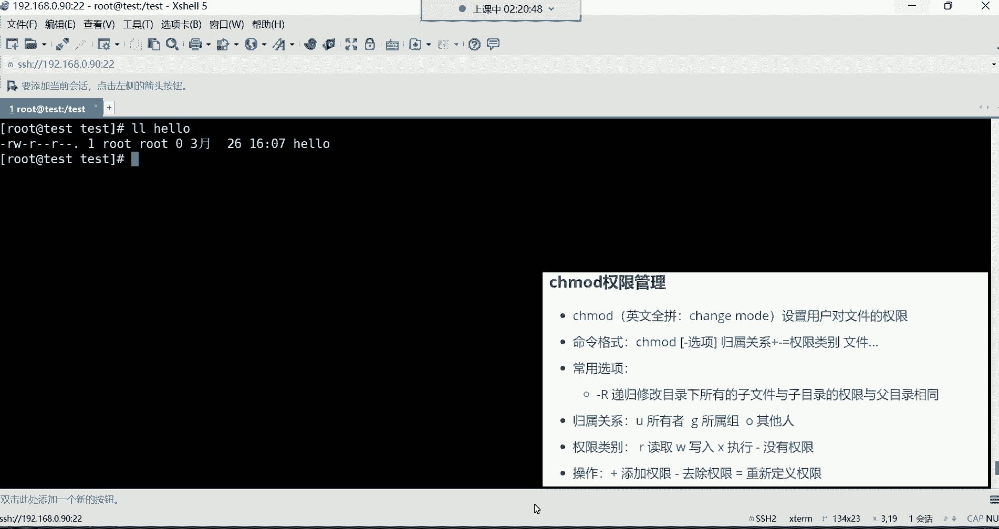

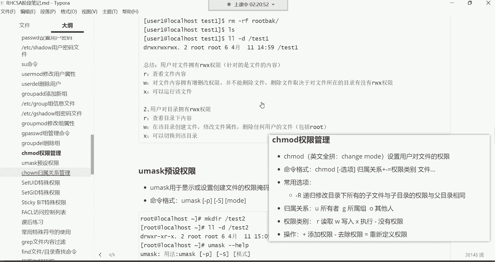

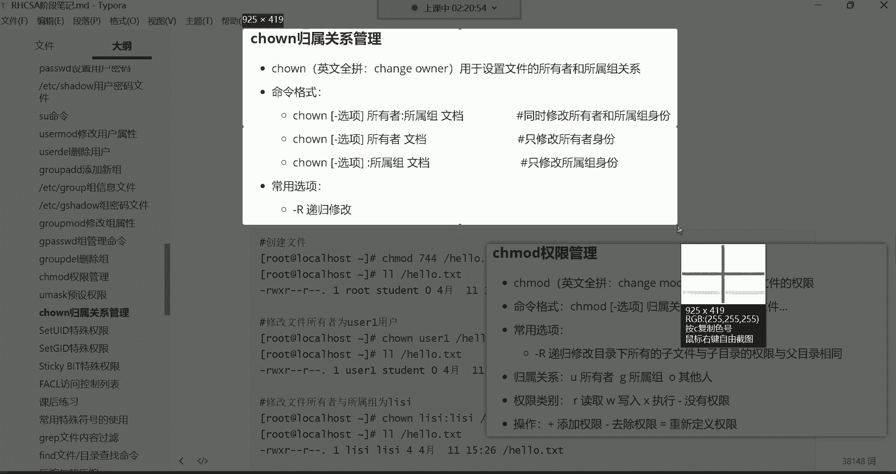

**命令格式：**
```bash
chown [选项] 所有者:所属组 文件或目录
```

以下是 `chown` 命令的几种常用格式：

*   **同时修改所有者和所属组**：`chown tom:devops hello.txt`
*   **仅修改所有者**：`chown root hello.txt`
*   **仅修改所属组**：`chown :devops hello.txt`

**常用选项：**
*   `-R`：递归处理，将指定目录下的所有文件及子目录一并处理。

## 修改文件权限 (chmod)

`chmod` 命令用于修改文件或目录的权限。有两种主要的权限表示方法：**字母表示法**和**数字表示法**。

### 字母表示法

此方法直观，通过 `u`（所有者）、`g`（所属组）、`o`（其他人）、`a`（所有人）来指定对象，用 `+`（添加）、`-`（移除）、`=`（设定）来操作权限。

**基本语法：**
```bash
chmod [ugoa][+-=][rwx] 文件或目录
```

**操作示例：**

*   给文件所有者添加执行权限：`chmod u+x hello.sh`
*   移除所属组的写权限：`chmod g-w document.txt`
*   为其他人设置只读权限：`chmod o=r document.txt`
*   同时为不同对象设置权限（用逗号分隔）：`chmod u=rwx,g=rx,o=r hello.sh`

### 数字表示法（八进制表示法）

此方法简洁，将 `r`、`w`、`x` 分别视为数字 4、2、1，无权限为 0。每组权限的数字是其包含权限的数字之和。

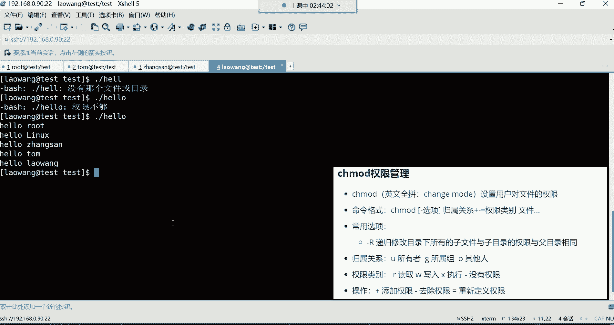

**权限数字对应表：**
| 权限 | 数字 |
| :--- | :--- |
| 读 (r) | 4 |
| 写 (w) | 2 |
| 执行 (x) | 1 |

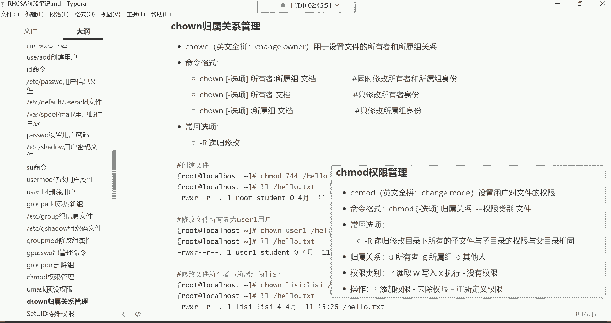

**计算示例：**
*   `rwx` = 4+2+1 = **7**
*   `rw-` = 4+2+0 = **6**
*   `r-x` = 4+0+1 = **5**
*   `r--` = 4+0+0 = **4**

**命令格式：**
```bash
chmod ABC 文件或目录
```
其中 **A** 代表所有者权限，**B** 代表所属组权限，**C** 代表其他人权限。

**操作示例：**
*   设置权限为 `rwxr-xr--`：`chmod 754 hello.sh`
*   设置权限为 `rw-r--r--`：`chmod 644 document.txt`

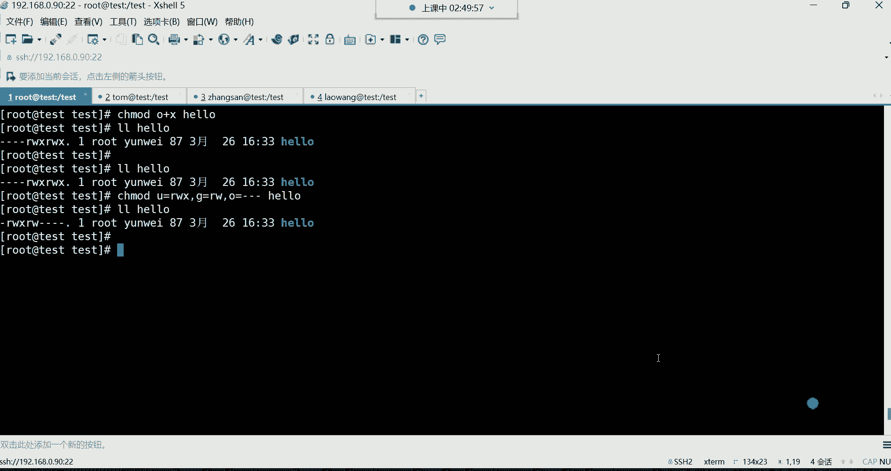

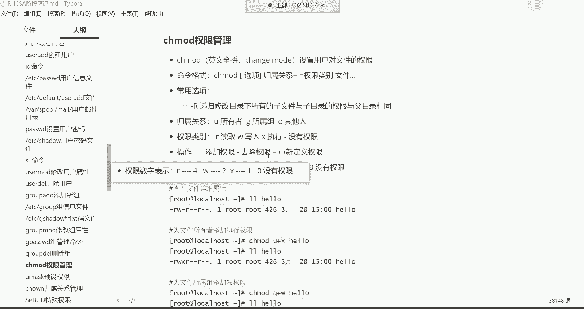

**注意**：使用数字表示法时，必须提供三个数字（如755、644），即使你只想修改其中一部分权限，也需要完整写出。例如，若只想给其他人加写权限，应使用 `chmod o+w file`，若错误使用 `chmod 2 file`，会导致所有者和所属组权限被意外清零。

## 文件与目录权限的差异

权限对文件和目录的含义有根本区别，这是初学者常混淆的地方。

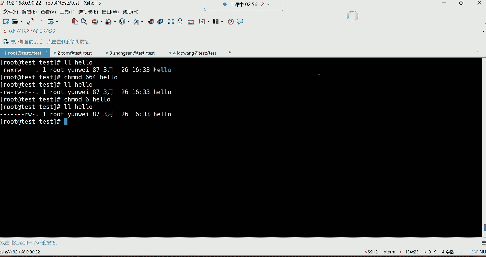

以下是核心差异总结：

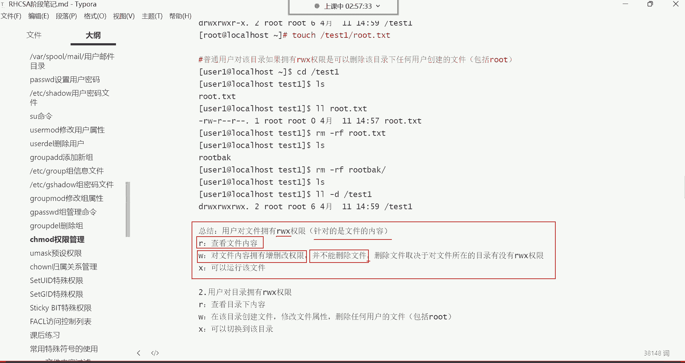

| 权限 | 对文件的含义 | 对目录的含义 |
| :--- | :--- | :--- |
| **读 (r)** | 可读取文件内容 | 可列出目录内容（如 `ls` 命令） |
| **写 (w)** | 可修改文件内容（增、删、改文本） | 可在目录内**创建、删除、重命名**文件或子目录 |
| **执行 (x)** | 可执行该文件（如运行脚本） | 可进入该目录（如 `cd` 命令） |

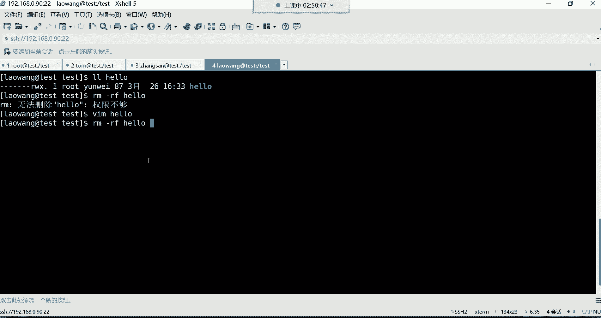

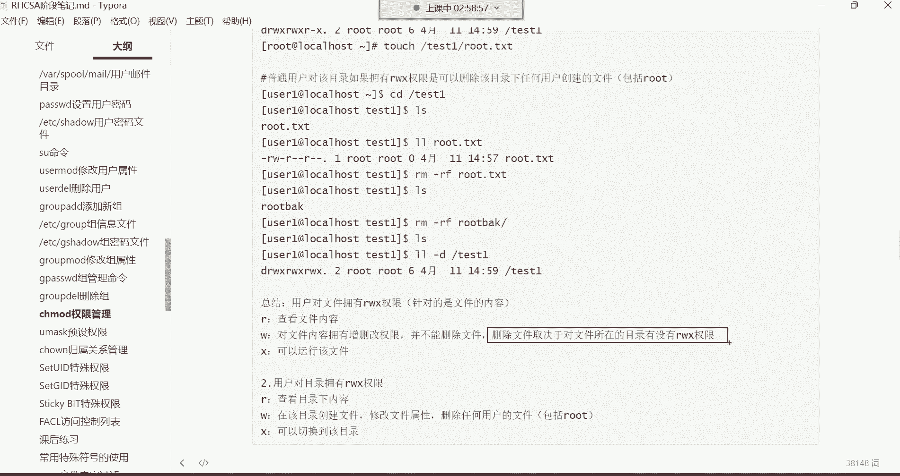

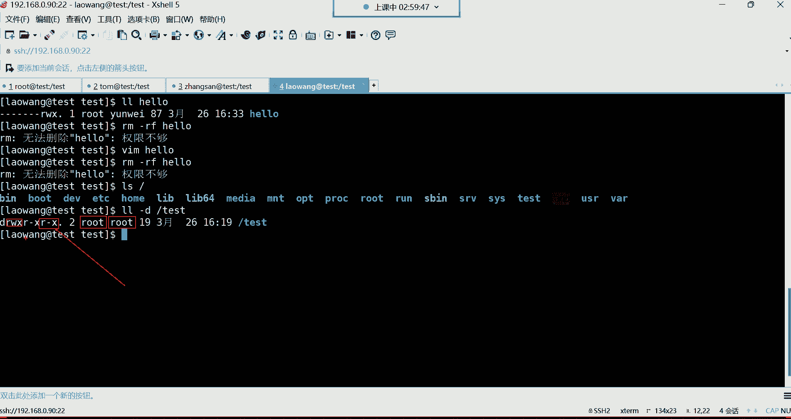

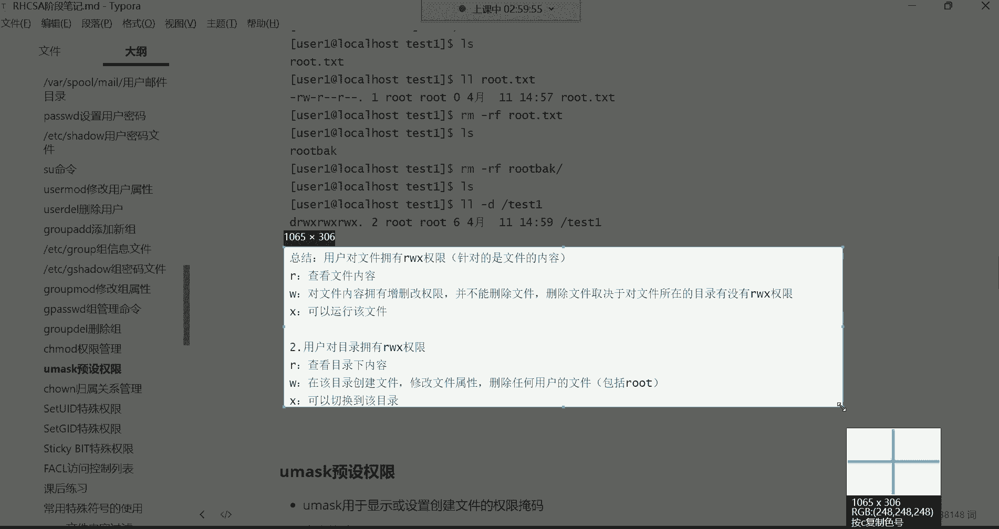

**关键理解**：
*   删除一个文件的能力，**不取决于**对该文件本身的 `w` 权限，而是取决于对该文件**所在目录**是否拥有 `w` 权限。
*   普通用户通常对系统关键目录（如 `/etc`, `/boot`）没有 `w` 权限，因此无法在这些目录中随意创建或删除文件，这保证了系统安全。

## 默认权限与掩码 (umask)

新创建的文件和目录会有一个默认权限。这个默认权限由系统的“权限掩码”决定。

**查看当前掩码：**
```bash
umask
# 或使用-S选项以字母形式查看
umask -S
```
输出如 `0022`。在字母形式下，会显示被“剥夺”的权限，例如 `u=rwx,g=rx,o=rx` 表示新建目录的默认权限是 `rwxr-xr-x`。

**掩码的工作原理**：
掩码是一个“反码”，它指定了在创建文件或目录时，**需要从完全权限中移除哪些权限**。
*   目录的完全权限是 `777` (`rwxrwxrwx`)。
*   文件的完全权限是 `666` (`rw-rw-rw-`)，因为新建文件默认不给执行权限。
*   默认掩码 `022` 意味着：从组和其他人的权限中移除写权限(`w`，对应数字2)。

**计算默认权限示例（目录）**：
完全权限 `777` 减去掩码 `022`，得到默认权限 `755` (`rwxr-xr-x`)。

**修改掩码（通常仅在当前Shell会话有效）**：
```bash
umask 002 # 设置掩码，使组和其他人拥有写权限
```
**注意**：通常不需要修改系统默认的 `umask` 值。

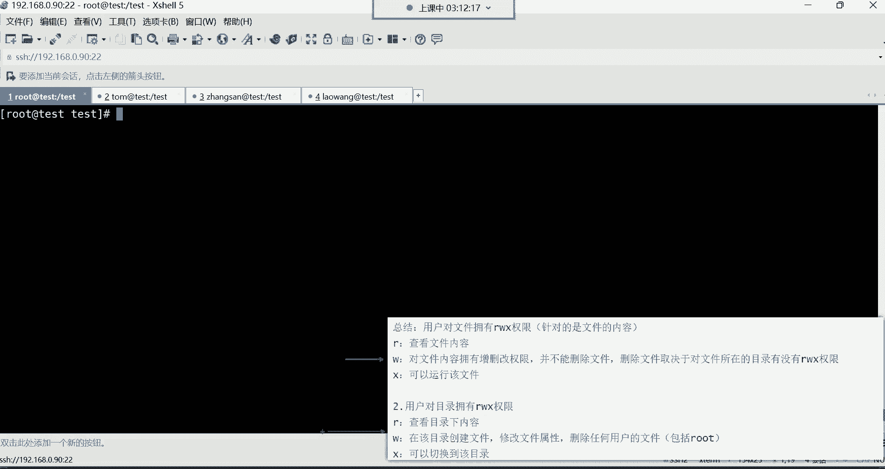

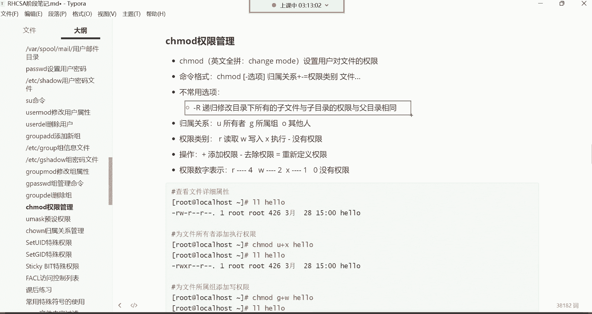

## 特殊权限（简介）

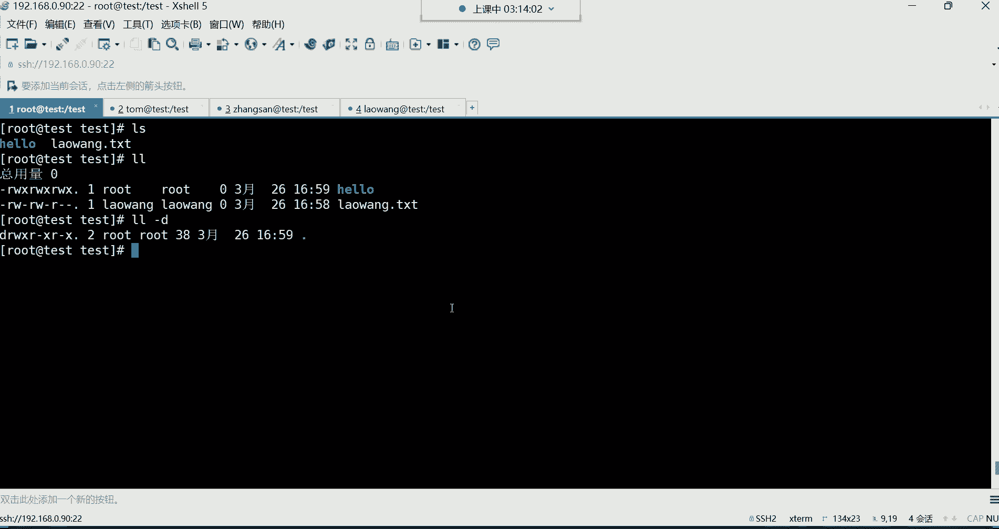

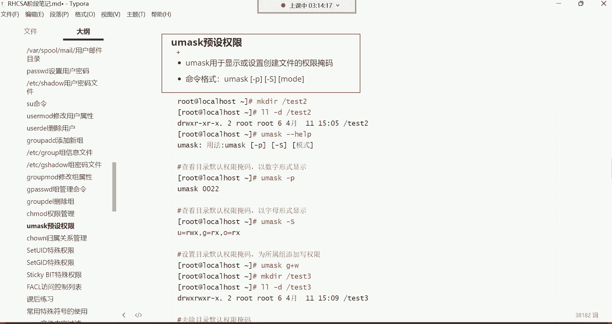

除了基本的 `rwx` 权限，Linux还有三种特殊权限位，它们提供了额外的功能：

1.  **SetUID (s)**：当设置在**可执行文件**上时，用户执行此文件期间将暂时拥有文件**所有者**的权限（典型例子：`/usr/bin/passwd`）。
2.  **SetGID (s)**：
    *   当设置在**可执行文件**上时，用户执行此文件期间将暂时拥有文件**所属组**的权限。
    *   当设置在**目录**上时，在该目录下新建的文件，其所属组会自动继承该目录的所属组，而不是创建者的默认组。
3.  **Sticky Bit (t)**：通常设置在目录（如 `/tmp`）上。在此目录下，用户只能删除或重命名**自己创建**的文件，而不能删除其他用户的文件，即使他对该目录有 `w` 权限。

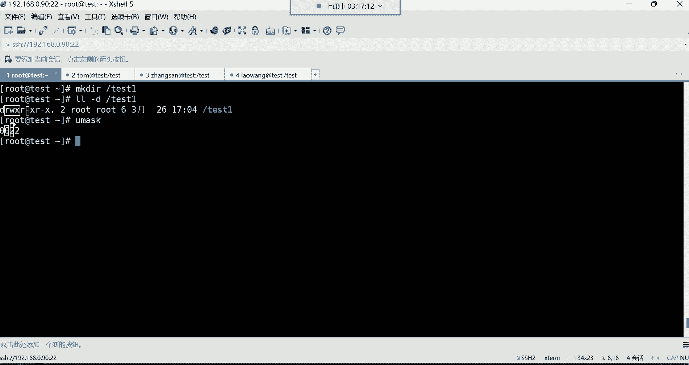

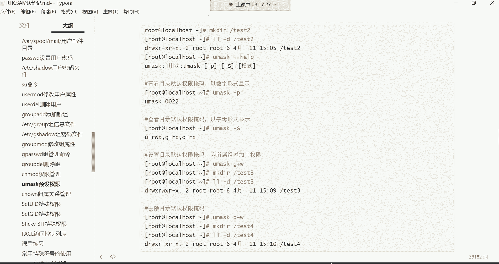

**设置方法（数字表示法）**：
在三位数字前再加一位数字来表示特殊权限：4(SetUID)、2(SetGID)、1(Sticky Bit)。
*   设置SetUID：`chmod 4755 file`
*   设置SetGID目录：`chmod 2770 shared_dir`
*   设置Sticky Bit：`chmod 1777 /tmp`

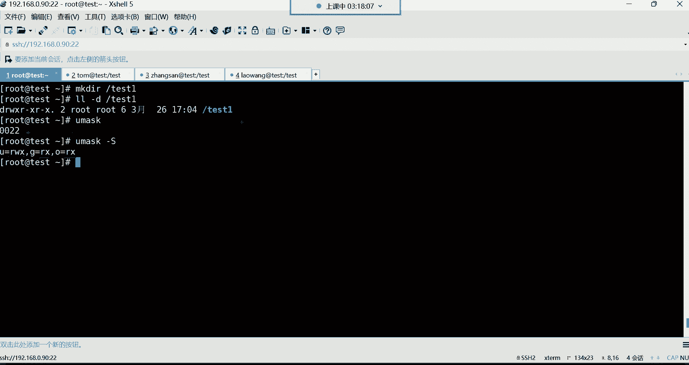

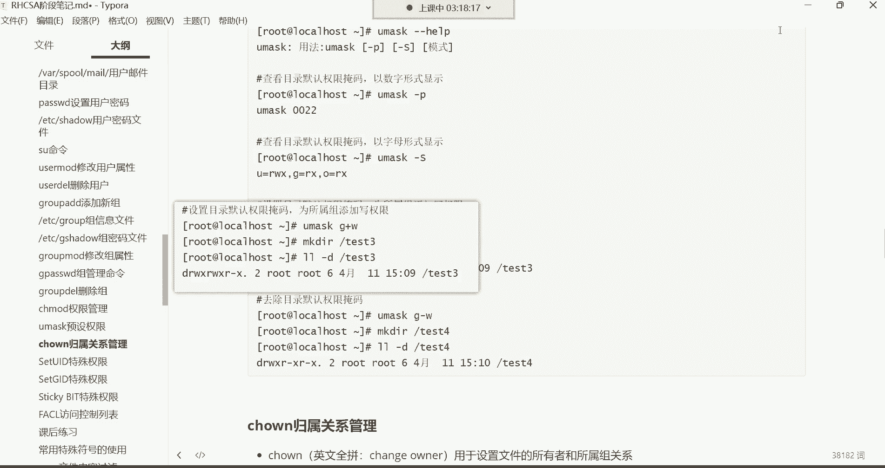

---

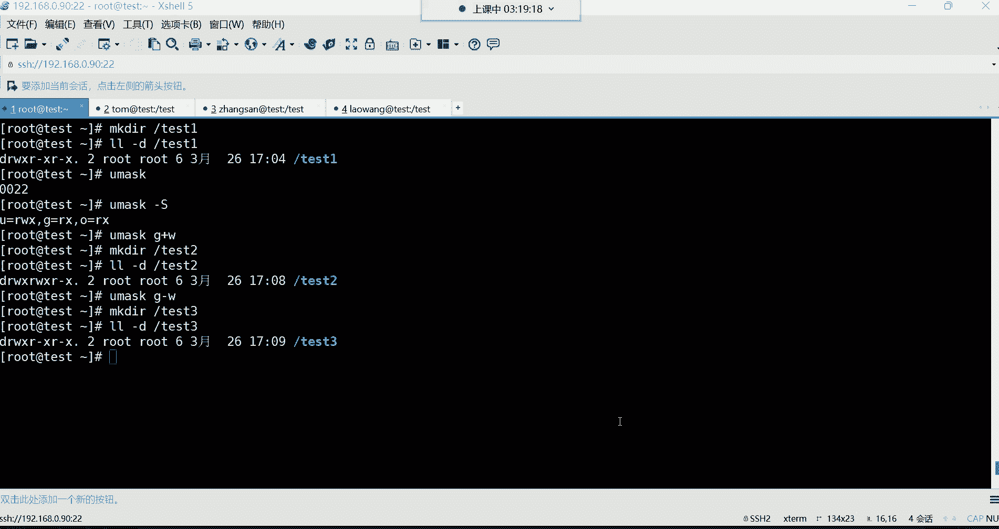

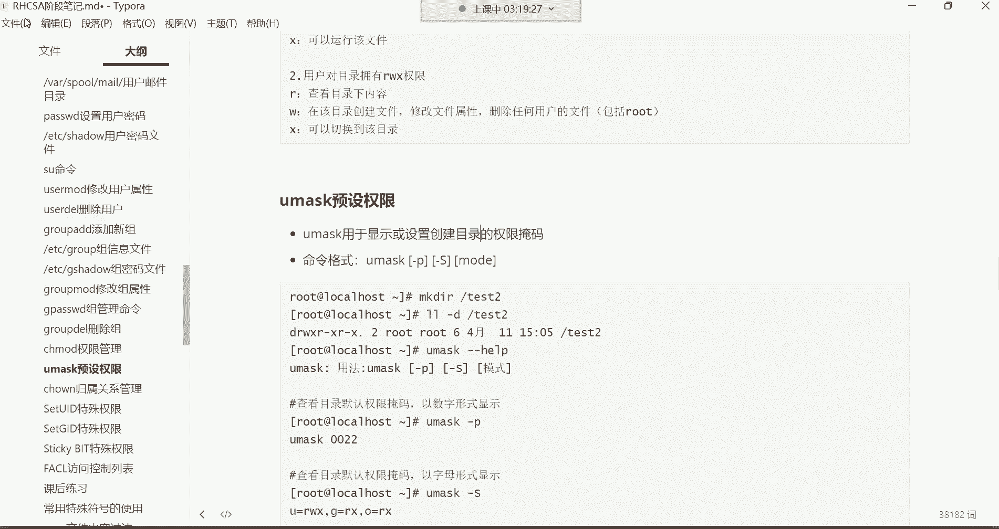

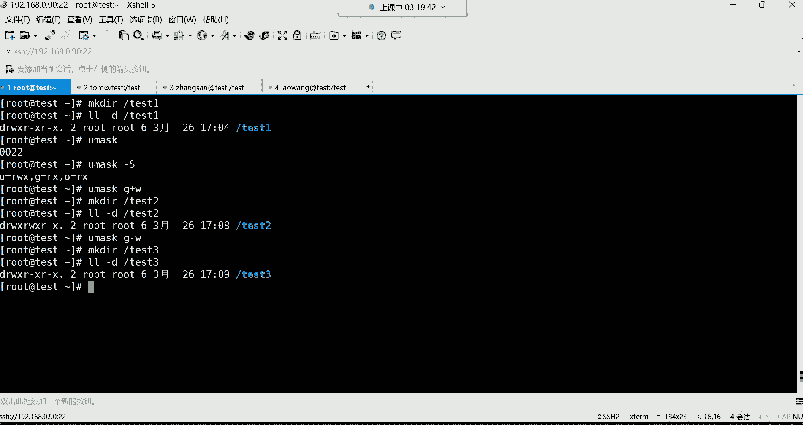

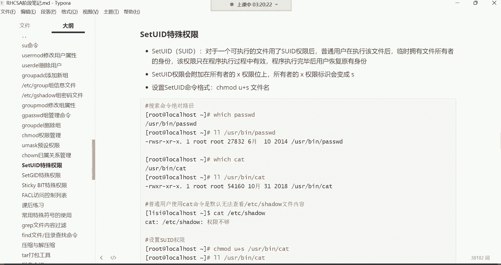

本节课中我们一起学习了Linux权限管理的核心知识。我们首先理解了文件的三类归属关系（所有者、所有组、其他人）和三种基本权限（读、写、执行）。然后，我们掌握了使用 `chown` 修改归属关系，以及使用 `chmod` 命令通过字母法和数字法来灵活设置权限。我们重点区分了权限对文件和目录的不同含义，这是正确管理权限的关键。最后，我们简要了解了默认权限掩码和三种特殊权限的概念。将这些知识与之前学习的用户、组管理结合起来，你就能有效地在Linux系统中规划和实施访问控制策略了。