# Linux运维入门：P1：云计算与Linux系统介绍 🚀

在本节课中，我们将要学习云计算的基本概念、Linux系统的起源与核心，以及它们在现代IT行业中的角色和关系。通过本课，你将理解云计算为何成为主流，以及Linux系统在服务器领域为何如此重要。

## 什么是云计算 ☁️

云计算在20年前是一个虚无缥缈的词汇。2000年深圳IT领袖峰会上，记者曾向中国互联网巨头们提问：“云计算在中国何时可以到来？”当时，马化腾认为可能需要几百年，李彦宏也持类似观点。然而，马云坚信云计算将很快到来，并随后在阿里巴巴内部大力支持王坚博士研发阿里云。经过8年努力，阿里云于2009年9月10日正式成立。

如今，阿里云在全球20多个地区设有数据中心，服务覆盖制造业、金融、政务、交通、医疗、电信、能源等众多行业。例如，12306购票网站、中石化、微博、知乎等知名企业都是阿里云的客户。

那么，云计算到底是什么？简单来说，**云计算的本质是网络资源的出租**。

### 云计算的优势

在传统模式下，企业若想运行一个网站，需要自行购买物理服务器、租赁机房、并维护电力、网络、温湿度等一系列复杂且昂贵的基础设施。

有了云计算之后，企业无需再操心这些底层设施。云厂商（如阿里云）已经建好了大型数据中心。用户只需在云平台上按需租用“云主机”（本质上是虚拟机），即可在上面部署自己的网站或应用。用户按实际使用量付费（如开机时长），或者选择包年包月的方式，极大地降低了初创企业的IT成本和运维门槛。

这类似于生活中的租房或去网吧：你无需自己买房或买电脑，只需支付租金即可使用所需的资源。

### 云计算的三种服务模式

云计算主要提供三种服务模式：

以下是三种核心服务模式的介绍：

1.  **IaaS（基础设施即服务）**
    *   **含义**：为用户提供最基础的计算资源，如CPU、内存、磁盘、网络。
    *   **类比**：就像你买了一台“裸机”电脑，只有硬件，需要自己安装操作系统和应用。
    *   **用户责任**：用户需要自己管理操作系统、中间件、运行时环境、数据和应用程序。

2.  **PaaS（平台即服务）**
    *   **含义**：在IaaS的基础上，为用户提供一个现成的平台环境，例如特定的开发框架、数据库、运维监控工具等。
    *   **类比**：就像你买了一台预装了Windows 10系统的电脑，可以直接安装和使用各种软件。
    *   **用户责任**：用户只需关注自己的应用程序开发和数据管理，平台环境由云厂商维护。

3.  **SaaS（软件即服务）**
    *   **含义**：在PaaS之上，为用户提供完整的、可直接使用的软件服务。云厂商负责软件的前期部署、后期维护和升级等所有工作。
    *   **类比**：就像入住五星级酒店，只需“拎包入住”，所有服务（清洁、送餐等）都由酒店提供。
    *   **用户责任**：用户只需使用软件，无需关心任何底层技术细节。例如，直接租用一套现成的企业网站或邮件系统。

对于大多数企业而言，IaaS和PaaS模式更为常见，因为它们能在提供便利的同时，让企业保留对自身业务和数据更高的控制权。

上一节我们介绍了云计算的概念与模式，本节中我们来看看这一切的基础——Linux系统。

## 什么是Linux 🐧

Linux是一个**类Unix**的**系统内核**。内核是计算机系统的核心，类似于人的大脑，负责管理计算机的所有软件和硬件资源，例如进程调度、内存管理、文件系统操作和硬件驱动等。

关于“Linux”的读音（如“里那克斯”或“里纽克斯”），没有绝对的正确读法，可根据个人习惯选择。

### Linux的起源

Linux的诞生与Unix密切相关。
*   **Unix**：诞生于1970年，最初由贝尔实验室的肯·汤普森用汇编语言编写，后由C语言之父丹尼斯·里奇用C语言重写。Unix是一个商业操作系统，需要付费使用。
*   **Linux**：由林纳斯·托瓦兹于1991年开发。它最初是仿照Unix内核、用C语言编写的一个开源免费项目。林纳斯选择了**企鹅**作为其吉祥物，象征着Linux像南极一样，不属于任何商业实体，是全球开发者共同维护的自由软件。

为了强调其开源免费的特性，Linux内核后来加入了GNU（自由软件基金会）项目，形成了完整的**GNU/Linux**操作系统。我们在Linux中使用的大部分命令工具，实际上都是由GNU组织开发的。

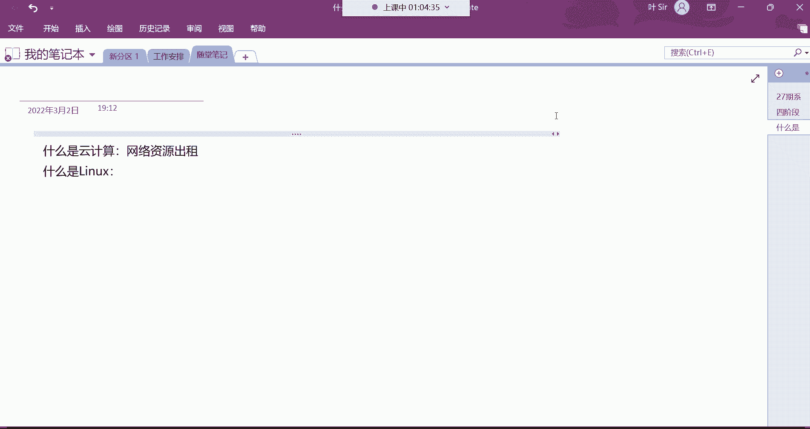

Linux内核的官方网站是：`www.kernel.org`

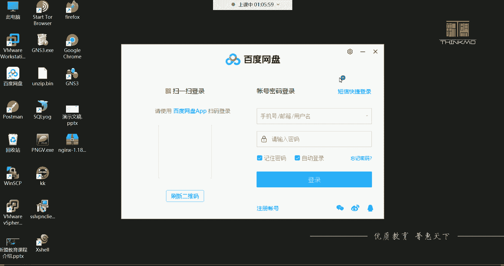

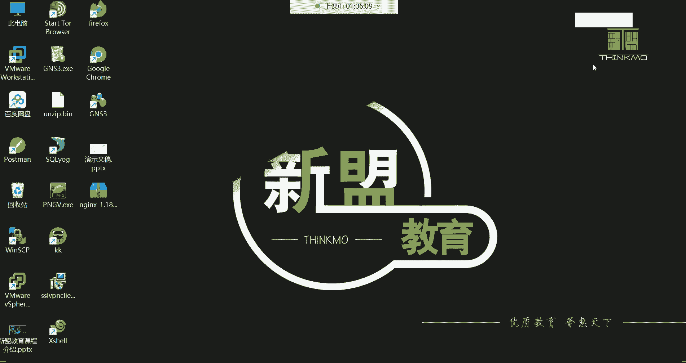

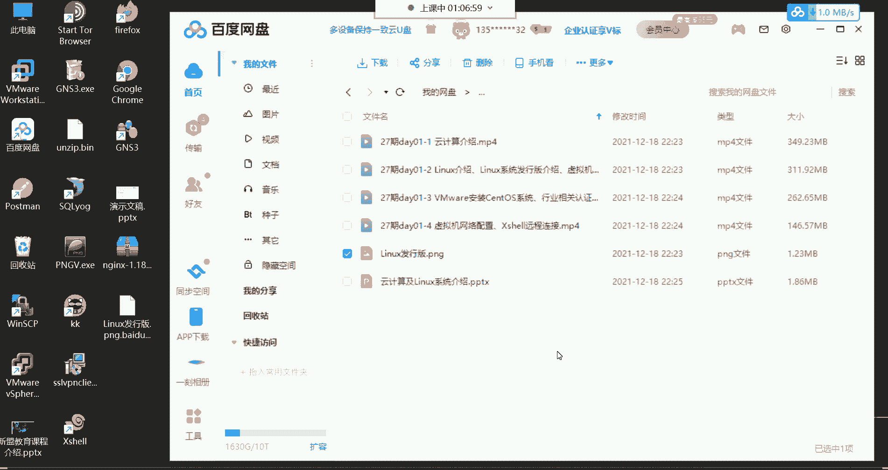

了解了Linux内核后，我们来看看基于它衍生出的各种操作系统。

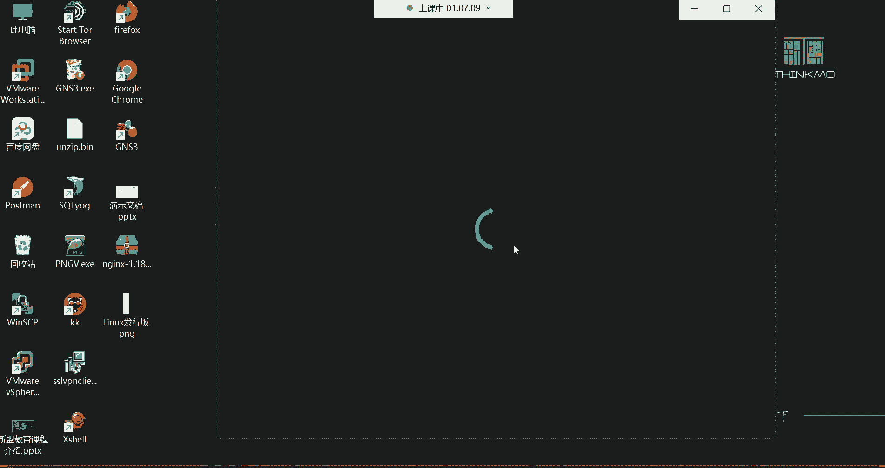

## 基于Linux的发行版系统 🌳

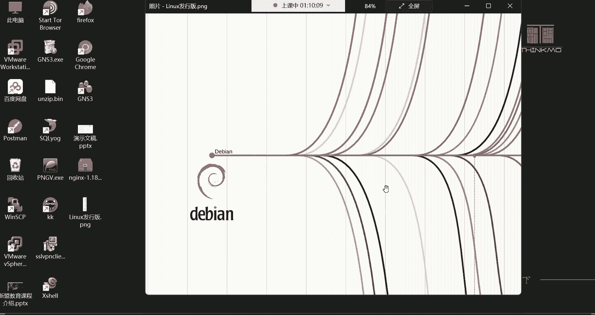

Linux本身只是一个内核，需要配合各种软件才能构成一个完整的操作系统。基于Linux内核包装不同软件后形成的系统，称为“发行版”。其家族非常庞大，主要分为几个流派。

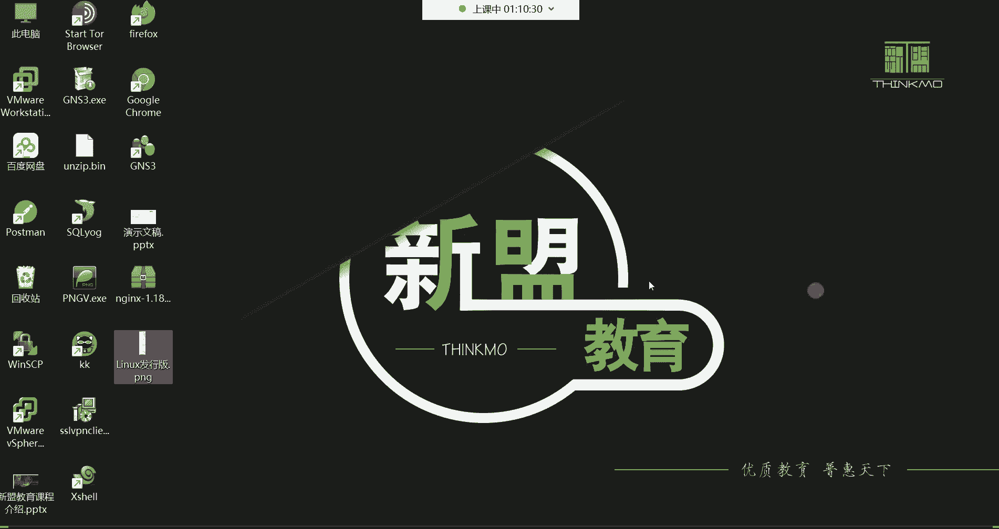

以下是几个主流Linux发行版的介绍：

*   **Red Hat Enterprise Linux (RHEL)**
    *   **特点**：红帽公司推出的**企业级**服务器操作系统，**需要付费订阅**（主要是购买技术支持和服务）。它稳定性极高，是全球企业服务器市场最主流的系统之一。
*   **CentOS**
    *   **特点**：RHEL的**社区免费克隆版**。它去除红帽商标，并延迟引入新特性以确保稳定，完全免费。是学习和企业部署的热门选择，尤其适合不需要官方商业支持的环境。
*   **Fedora**
    *   **特点**：红帽赞助的社区版，是**新技术的前沿测试平台**。新功能会先在Fedora上测试，稳定后再引入RHEL。适合开发者和技术爱好者。
*   **Ubuntu**
    *   **特点**：基于Debian，以**友好的桌面环境**著称。很多功能可以通过图形界面完成。主要流行于**开发领域**和**个人桌面**，但在服务器领域也有应用。
*   **Debian**
    *   **特点**：以稳定著称的社区发行版，Ubuntu等众多发行版都基于它。同样拥有优秀的桌面和服务器版本。

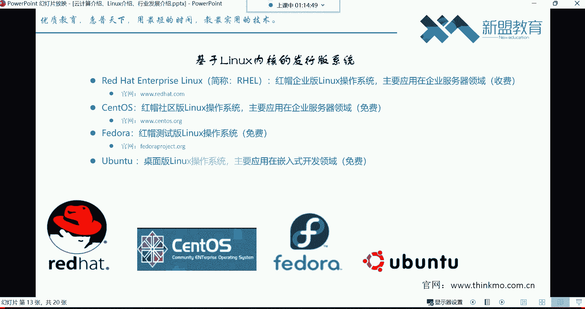

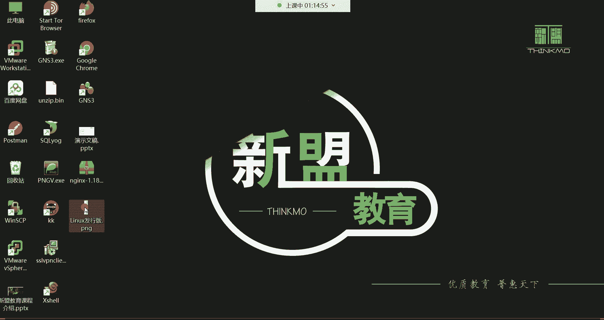

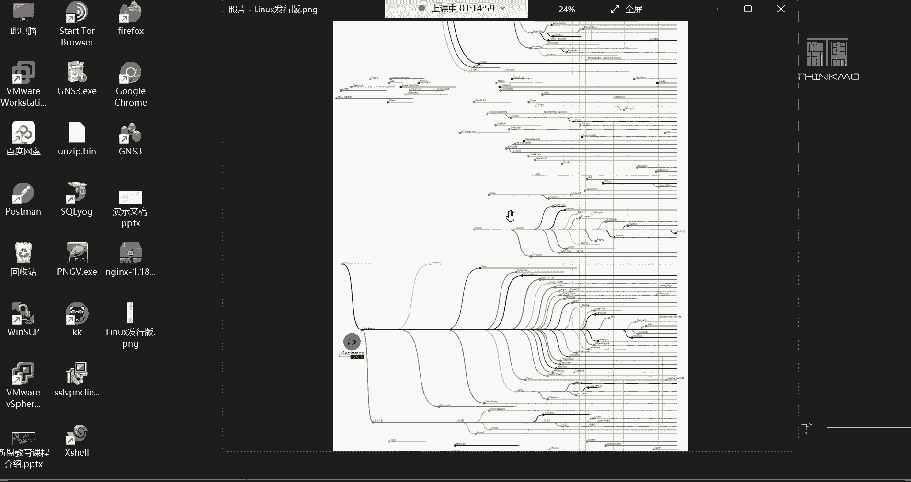

### 服务器系统与桌面系统的区别

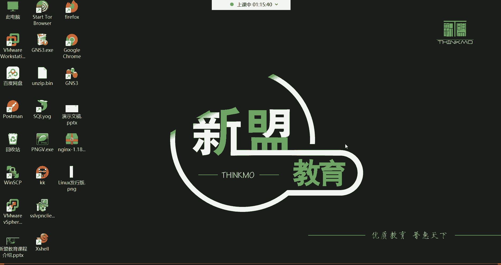

为什么RHEL/CentOS适合服务器，而Ubuntu更适合桌面？
*   **服务器系统**：追求**稳定、高效、节约资源**。通常不安装图形界面（桌面环境），几乎所有操作都通过命令行完成。这能最大程度节省CPU和内存资源，提升性能与稳定性。
*   **桌面系统**：追求**用户友好、易用**。拥有完善的图形界面，方便普通用户通过鼠标操作。但这会消耗更多系统资源。

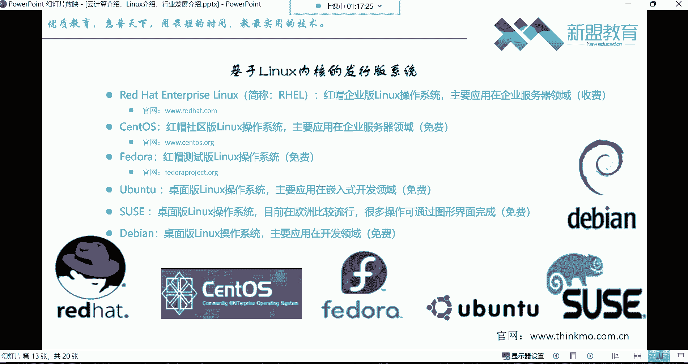

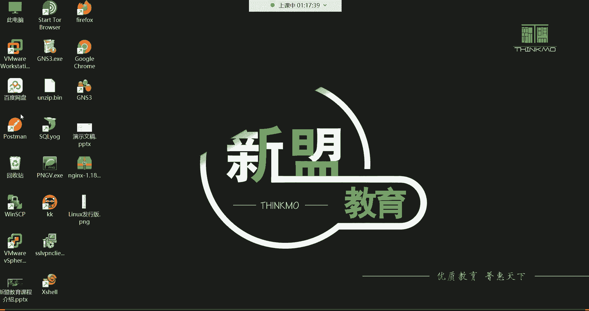

因此，在运维领域，我们主要学习像CentOS这样的**无图形界面**的服务器操作系统，专注于命令行管理技能。

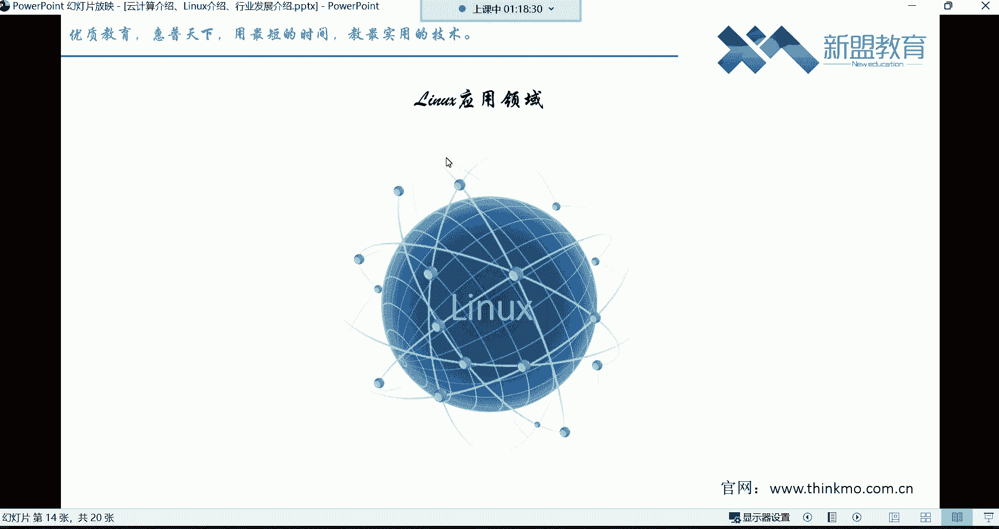

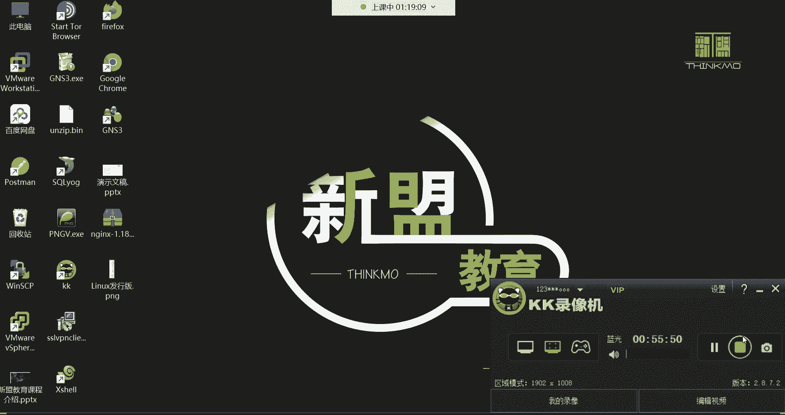

本节课中我们一起学习了云计算的核心概念、三种服务模式（IaaS, PaaS, SaaS），了解了Linux内核的起源及其开源免费的特性，并认识了基于Linux的主要发行版及其适用场景（如CentOS用于服务器，Ubuntu用于开发桌面）。这些基础知识是步入Linux运维和云计算领域的重要第一步。接下来，我们将动手安装一个CentOS系统，开始真正的实践之旅。