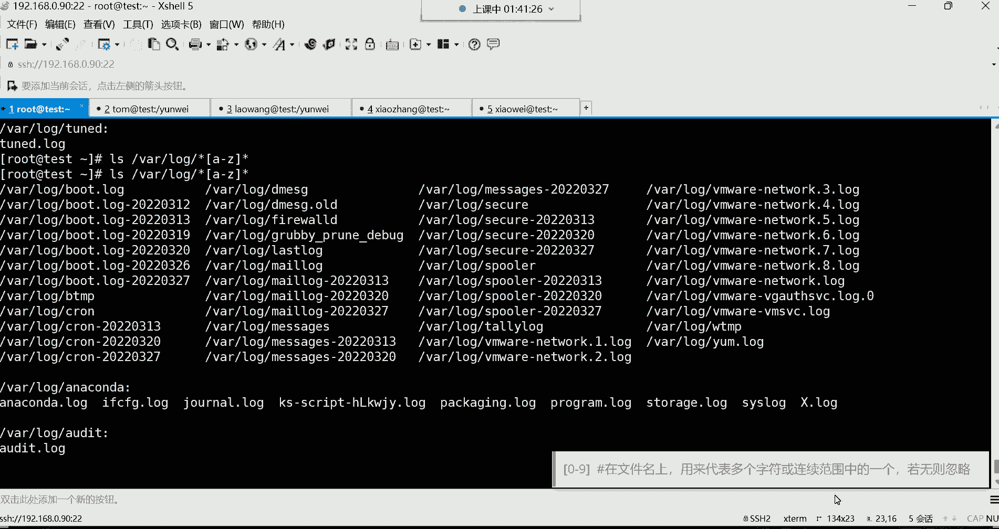

# 【小白入门 通俗易懂】全网最全RHCSA+RHCE教程，一周快速进阶Linux运维 - P20：红帽RHCSA-20.常用特殊符号的使用、grep文件内容过滤 - 网工小程立志不加班 - BV1PN4y1R7uU

啊给我刷波一，我们继续开始，好在我回来了是吧，那接下来呢我们给大家讲讲，这个常用的特殊符号，容易走神是吧，没关系哈，呃走神的时候呢掐自己两下啊哈哈，然后我们说说这个常用的特殊符号哈。

这个特殊符号我们现在在初级阶段，我们学的呢也就这么几个啊，其实常用的呢呃在这里面也就两个，哪两个呢，第一个星，第二个呢这个大括号啊，这是我们经常会用到的两个特殊符号哈，然后下面的这个问号跟这个中括号呢。

偶尔啊可能说偶尔会用到哈，用的不多啊，所以呢呃你必须要掌握的就是星号跟大括号，然后呢你如果说实在没有那么多精力，那问号跟中号号呢可以什么呢，可以我们说这个可以暂时先做一个了解啊，那我先说一下。

在LINUX系统下边，特殊符号起到了很大的作用，那特殊符号可以完成一些特殊的功能，我得先给你讲讲这个特殊符号都有哪些啊。

在我们这个键盘上边注意哈，你可以看一下在你键盘上的那个数字键，什么叹号啊，Sorry，这个号这个叹号艾特福井号dollar符，百分号，尖角号，暗符星号，什么大括号，小括号，那么在这种小于号大于号啊。

什么问号啊，这种斜线啊，包括左斜啊，这个左斜线哈，还有这个我们叫什么，这叫反撇，反撇，还有这种嗯，我再想想哈，还有什么呢，差差不多也没了，差不多没了哈，啊点点也是，第二也是哈，嗯课间睡觉是吧。

那这些呢都属于叫特殊符号，当然还有一个管道符啊，这些都属于特殊符号啊，每一种特殊符号在我们这个系统当中，都是有一定的含义的，都有一定的含义哈，所以说呢我们在这个阶段我们学哪些呢，星号大括号。

还有这个问号，还有那个中括号，当然我们再补充一个中括号啊，我们先学这几个呢，先学这四个，就是这个星号大括号，还有这个中括号，还有这个问号啊，其他的话呢我们后边再学用，到时候再学啊。

那然后咱们一个一个来说，一个一个来说吧。

这些再来说第一个星号常用的特殊符号。

在文件的扩展名上用来代表任意多个任意字符。

这句话呢读了一遍跟没读一样是吧，不太适合人类去理解呀，首先呢它肯定是一个特殊符号就对了，然后啊他在文件的名字上注意哈，一看就是应用在文件名上面的哈，那干什么用呢。

在文件名上它可以用来代表任意多个任意字符，那首先啊这个文件名甭管是目录还是文件哈，他都可以帮你去什么呢，帮你去代表，那我先说什么叫任意，什么叫任意呀，这个任意呢就是非常的随意，呵呵怎么随意呢。

就是你这个名字是1234呃，是这个数字也好，是字母也好，或者说有一些什么特殊符号之类的，什么点啊等等等等的，他这叫任意，所以说这个星号是可以代表什么呢，任意所有的甭管是什么什么数字字母。

大写小写都能代表啊，就代表所有那多个是什么意思呢，多个就是甭管你这个名字有多长啊，就是长度也不限，呵呵能理解吧，这就叫做任意字符，任意长度我都什么呢，我都通配了，所以它叫一个通配符啊，通配符。

那说这些东西有什么用呢啊，大家经常会看到这么一条命令是吧，RM跟RF根下的星，这个星它就能够在文件的名字上面代表什么呀，代表任意所有，而且就是是什么都能表示，我告诉你什么都能表示。

那也就是说他既然能够什么都能表示，那是不是就代表什么呀，我要删除这根下的任意所有啊，这个星号就代表任意所有，那它就是删除任意所有，那就删库跑路呗，是不是啊，删除所有的意思啊，所以这个信号很给力哈。

但是呢我们一般用它干嘛呀，做一些文件名搜索，比如说我想搜索etc下面有没有一个文件是什么，是那个叫pass w d的，但是名字记不全了，可能是我只记住什么呢，我只记住以这个PASS开头的结尾，记不住了。

好型号，回车看他，他已经搜到两个，你看到吗，搜到两个哈，而这两个文件呢都是以PASS开头的，以pass开头结尾的话呢，你用星号来表示的，那就说这个呀结尾，结尾的话那是什么，我就任意了。

什么WD还是WD杠啊，这都无所谓了，但是只要是以PASS开头的，就可以能理解吧，啊包括你把这个东西运做各种匹配，比如有没有FS开头的文件，看到没有啊，结尾以什么结尾的啊，后边你比如说有没有这个。

以这个或者说这种东西，你也可以放到中间，比如开头是以什么呢，是以这个渗透S开头的，然后呢结尾当然就直接这样搜吧哈就这样搜，如果你放到中间不太好用啊，不是很理想，这种看到吗，只要是以SL开头的结尾啊。

叫什么都行，看到了吗，叫什么都行哈，嗯目录现在可当然可以啊，它可以是各种各种各样帮你匹配的哈，你比如说我想搜索并下边有没有一个文件名呃，是叫什么呢，啊也是这个PASS开头，PAS开头结尾是什么，无所谓。

看到了是不是给你搜出来了，这个程序文件没错啊，但是还有一个呢，你看PS开头后边T结尾的，但不他不管只要是前边符合你的要求就可以了，后边就任意了。

所以这种东西呢还是怎么说呢，蛮好用的哈，蛮好用的，然后你看这里面我给大家举个例子里面哈啊，你可以搜索什么一点什么结尾的。

比如说我想咱们说这个在系统的VLOG下边，是存放日志文件的是吧，日志文件呢有个特点啊，一般呢就是以这种点log结尾的，那这时候你怎么办啊，这时候我就可以这样了，就L4Y下的log下。

以什么叫星点log结尾，那搜索出来了吧，好那搜索出来以后呢，我想把这些文件给它做个备份好，copy cp是不是copy copy杠P保持属性不变的拷贝。

把Rush的log这些星点log的拷贝到OPET下边，拷贝到根下的OPT目录，可不可以呢，可以啊，回车拉四，你看OT是不是给你拷贝过去了，对可以，总之这个信号它的功能是很强大的，你可以灵活运用。

有这种需求都可以帮你去匹配。

这是星号哈，然后它也很灵活，你可以放在开头，也可以放在什么结构，可以什么啊，你可以让他去帮你去匹配，以什么什么开头的，因为你记不住啊，是以什么开头都行，在结尾呢必须以征点com结尾的。

或者说必须得以这个，必须得以这个开头到结尾是什么都行，或者说以什么开头无所谓，以什么结尾也无所谓，但中间必须包含SS的都行，那这种就是这种需求比较少见一些，哈哈这种需求知道一下，因为对于一个文件名字。

其实我们大多数也就是怎么说呢，没有那么难记哈，没有那么难记文件名啊，这是新号啊，我们后期呢频繁会用它，所以说呢你在用的时候，你别对他感觉陌生哈，可以代表任意所有，然后第二个这个问号。

这个问号它的功能呢主要是干什么用的呢，他也是在文件的名字上面，用来代表任意单个注意哈，首先都是任意，只要是任意，就说明你这个东西是什么，1234还是ABCD还是什么特殊符号都行啊。

但是呢它是只能帮你去匹配一个字符，但你这一个字符是什么，那我就不管了，因为字符是任意的啊，都匹配，而前面不一样，是多个，就是你长度，我也任意而下边长度只能是一个对，这是他们两个的一个区别哈。

好那这个东西呢一般用的比较少一些的，你比如说我们想如果按照这个例子。

大家来看一下哈，这例子我想去搜索一下。

搜索什么搜索这个DEV下边啊，比如说以什么什么这个开头的，看看在DEV下边，我想搜索以TTY开头的结尾，必须是一一个字符结尾的一个字符结尾回车啊，当然这些文件我们后面会介绍哈，先知道一下。

这些就是给我们提供登录终端的这些文件好，那看到了吗，这不是一个字符啊，但是你甭管是数字还是字母，总之满足我们的条件能理解吧，满足我的条件哈啊一个字符那两个字符行吗，必须得一个字符吗，可以你再加个问号啊。

那就是两个字符哈，两个字符结尾的，首先TTY后边你发现都是跟了两个字符，但是这两个字符你甭管是数字还是字母，它都给你匹配了，因为他任意能列吧，这是我们所说的这个问号啊，就怎么说呢。

可以帮你去匹配一个注意哈，一个任意字符，嗯三个可不可以呢，也可以啊，但是没有看到了吗，他说没有TTY开头的结尾，以三个字符结尾的，没有没有就不不帮你匹配，没有就算了啊。

行这是问号，但不是很常用哈，不是很常用，然后下面这个中括号呢。

也是在文件的名字上面帮我们去做匹配的。

它匹配可以匹配什么呢，啊它可以帮我匹配一些，这个看代表多个字符或联系范围中的一个，这什么意思呢，首先它是用来匹配什么数字跟字母的，比如说我想这样去匹配啊，Alex vlog，下边以什么呢，嗯以这个。

就是这个文件名字里面包含数字的，那怎么办呢，中括号零杠九结尾行，注意哈，我这波操作是什么操作，就是，以什么开头无所谓任意，以什么结尾无所谓任意，但是只要包含0~9之间的数字就行。

那这时候你看这个名字里面就是一个文件，名字里面只要包含数字全给你查出来了，就包含数字，看到了吗，是不是你看这文件名字后边是不是有数字啊，这是不是123，是不是也有数字啊。

好这就是我们所说的什么叫做匹配啊，那你说我只想匹配什么呢，包含字母的数字，我不要A杠Z回撤，有没有呢嗯，来清空一下，有看到吗，现在呢他给我们查出来了，从这开始哈，从这当然啊。

这个由于我们是用心来表示的是吧，这没有办法没有办法，这星数字它也给你匹配了，所以这种搜索不是很精准，不是很精确啊，不是很准确，一般这样玩的比较少一些，但是你就知道它它是什么。

它是可以帮你代表多个连续的注意啊，代表多个连续的，连续的哈范围里边的一个都可以帮你匹配，什么叫范围内啊，就你比如说我们刚刚咱说从零到90万，那0~9之间，你只要在我这个零或者九范围内，都满足我的条件啊。

所以这个中括号呢是首先可以帮你匹配一个，连续的啊，比如A到Z是0~9之间，但只要有一个匹配上了，那就满足，这是中括号啊，都是因为在文件的扩展名上面啊，帮做一些筛选啊，筛选哈。

嗯那这种的话呢用的其实不是很多啊。

大家这个知道一下就行，我们后边呢也不是很常用这种中括号，大括号我们一般用的比较多一些，大括号哈，这大括号呢它的功能呢因为非常的给力。

不是说中括号这个不常用，是中控功能有瑕疵，你比如说我们把中括号拿过来，我要匹配wax的logo，下边什么呢，TTY开头，比如说结尾必须什么呢，零杠九，mars的log啊，T t y，然后。

不是不是不是搜错了哈啊这个DV下边哈，然后TTY开头零杠九回车，你看可以，他把你匹配了是吧，TTY开头的，然后呢从0~9都帮我们匹配了，但是呢我我想匹配什么呢，我想从我想匹配15~25之间结尾的。

有没有，就是这个文件名字，它的结尾是从15~25这个范围内，我想去匹配一下，那就是15杠25回车，你发现不对劲不对劲哈，怎么匹配个一又匹配个五啊，我们要的是15~25之间，是这个范围内呢是吧。

只要是满足条件的，你帮我筛选出来啊，那这时候你看第一位有没有啊，有他肯定有，你看到了吗，这个什么二，这个15~25之间，你看二十二十1223425都都符合条件，但是他没有办法帮我们筛选是吧。

但是如果你换大括号呢，你发现它不一样了，同样的操作，咱换个大括号哈哈，大括号里边呢用什么，用点儿点儿点儿点儿来表示回车，哎，你看是不是这文件名字必须TTY开头的结尾，只要是在这个范围内就可以就可以哈。

所以大括号呢也是在文件名上面，可以用来代表多组不同的多组不同的，也就是说这个有数字也行，然后呢字母也行，比如后面如果包含这个逗号隔开，比如包含这个S的也可以，或者说大S的也可以回车啊。

当然这个可能说这个嗯，我看看这个，啊这不让匹配吗，打一次我看哈，嘿难道这样，我记得是逗号隔开的呀，他这个啊，那算了吧，可能语法不支持，那算了吧，那你可以亮，比如说嗯A嗯A然后后边呢在A到Z，也没有没有。

算了吧，那就不这样匹配了哈，不这样匹配了，可能是不支持这个语法，正常来讲呢，它比中括号，要是它主要适合什么，后边跟一些数字数字哈，他这个数字比较给力在哪里呢，就是你比如我现在想建个文件啊。

我现在咱们把OPT清空一下，OPET一下子星，然后我进到OP，我现在想在OP题目中，我想建100个文件，注意我想建100个touch，名字叫什么呢，就是让它叫，pass的开头，然后后边呢就是以此类推。

什么test1test2test3test4test五之类的啊，以此类推，我要建100个文件，那这种需求，你们有没有想过我们手动去建100个文件吗，现实吗，你说好像也不太现实，是不是啊，诶这大括号啊。

它可以帮你这样玩test，后面跟上什么呢，一点点100回车，你看瞬间100个文件出来了是吧，所以你看这它就什么呢，它就可以帮你，非常适合去做数字方面的去匹配啊，是合数字，对你说我要建1000个文件好。

没关系，是啊，删也可以吗，当然可以了啊，你比如我现在要删RM杠RF，对我要删除以太子的开头的，但是啊一点点51~50就删50个行吗，回车阿莱斯，那你看前50个没了是吧。

所以说他这个呢一般就是非常适合去做这种，数字相关的去匹配啊，这种比较好用哈，比较好用一些，所以这个大括号呢，我们后面会在大括号里面去放一些数字啊，后期在学习社有脚本的时候，这个大括号也非常的常用啊。

非常的常用哈，啊50~100是不是删删除后面，对你这个数字给多少，他就帮你删多少，给多少，删多少，行了那嗯test一点点，test可以，test一点点，test50啊，Test1，是test一点点啊。

咱们就test的多少，test的51啊，点点60啊，Test60，哎呦，你这我还我我看看哈，不行不行哈不行，你看了吗，他确实不行，是不是不行哈，因为有这个字，有字母，它没有办法帮你去做这种匹配了啊。

对识别不出来了，语法不支持了，所以这种就不允许，一般就是大号里边都是放数字嗯，放数字放字母不太好识别，行了。

这是这个星座哈星所以大家在学的时候呢，就要掌握哪个呢，就先这个星跟大括号，这两个是我们最常用的，能理解吧，而是最常用的，但是我这个如果说你不加数字。

光用什么呢，光用字母，这没什么问题，你看啊，我们比如说这样呃，阿拉斯我们干嘛呢，我们就搜啊搜这个文件名字啊，搜etc下面文件名字以什么开头，无所谓，结尾呢只要包含A逗号BCD我们试试哈，嗯也行。

你看也行哈，但是如果你数字结合字母它就不行了啊，但是这样没什么关系，因为只要这个文件名字里面包含这个AB，CD啊，任意一个也都可以都满足哈，那文件文件名里面都包含什么A啊，或者说BD是不是。

但如果你说我只要包含A的，啊那没有B不可能没有啊，这是这不行啊，这不行，BCD逗号D啊，这样可以，但是你们没有必要搞那么复杂哈，没有必要搞那么复杂，这种东西不太适合去匹配一些字母，不太适合哈对嗯。

数字用的比较多一些。

好OK行了，那下面呢我们再来给大家讲讲这个grave啊，group呢，这条命令，它的功能呢是用于查找文件中，符合条件的字符串，什么意思呢。

就是我现在有一文件，哪个文件呢，咱们就拿这个，etc下的pass wd这个文件来说，我们加个选项哈，加个杠N这个文件来说，我现在想从这个文件里面去搜索一个字符串，但是呢我又不想什么呢，不想一行一行去看。

因为这个内容太多了。

那这怎么办呢，这时候grape可以帮你干这事，注意啊，他就是从文件中去查找符合条件的字符串，把你显示出来，能理解了吧，那后期呢可以利用一些什么正则表达式啊，这个大家先不用去管的。

因为正则表达式呢是我们后面会讲的啊，先了解一下，然后呢，他会把匹配到的字符串的行给你打印出来，就给你显示出来，你只要匹配到了才给你显示出来了，语法格式的grape，咱们来说说它的语法哈。

这语法还是蛮有意思的，以及这个选项都挺有意思。

好来看一下GRP，我现在想搜什么呢，我现在想搜，比如说汤姆汤姆哈啊，Grape tom，然后从哪儿呢，etc下载pass w d文件里面去过滤，哎回车看到了吗。

那现在就是我只想从这个文件里面看tom的信息，别的我不想看，但你发现用cat太麻烦是吧，你cat你直接看，直接把整个文件打开了，然后你再去找汤姆，汤姆在哪儿呢，在这儿呢我再去看费劲不费劲。

是不是我就想看汤姆，别的我都不甘心，是不是哎那咱就直接过滤tom不就完事了嘛是吧，他就帮你从这个文件里面专门去过滤哪一行，他得看好哪一行，包含汤姆啊，一看到有诶给你显示出来了，有的话给你显示出来了哈。

诶那你说这个这不知道这个载多少行啊是吧，加个杠N回车告诉你哈哈，这时候加个杠N告诉你，你要搜索的这个tom在这个文件里面的多少行呢，第20行啊，然后这是汤姆的这一行的，所有信息都给你列出来了。

是不是蛮好用的呀，哎这就是什么，这是我们所说的这个GRP是不是位置，不是哈，别搞混了，位置是什么位置，是搜搜索一个命令所在的位置，他可不是搜索文件内容哈，我们现在这个group是从一个文件里边。

去搜索某一些关键字，你比如说这个你曾经是吧，就那个什么呢，可能说这个有一个女孩子看上你了，给你写了一封，比如说好几万行的一封情书，然后呢你就想从这一封情书里边呢，就过滤过滤啊。

看看这个女孩子啊一共写了多少行，这个包含我爱你这三个字的是吧，然后看一看统计统计，那这时候格rap就可以帮你干这个事了啊，从你这个好几万行的一个情书里边呃，只帮你过滤包含啊，我爱你这三个字是吧。

哼都在这个文件里面的哪一行出现过，知道吧，他是从文件的内容过滤哈，which是搜索一个文件的所在位置，他们干的活不一样好，这非常简单吧，语法是不是你看GRAP加选项，然后跟上你的查找条件。

谁是你的查找条件，tom就是我的查找条件是吧，然后呢就跟上一个文件名就可以了，那你说我想还我还想过滤老王是吧，咱换一个我换老王，我现在又想看老王的信息了，那叫老王回车诶，他又把老王的信息给你过滤出来了。

说非常好用的，唉非常好用哈，我们以后会频繁用GRP这条命令啊，这这条命令也可以怎么玩的呢，这条命令你可以这样，比如我这样，If config，这条命令不是看网卡吗，是不是是不是看网卡好，没关系。

他也可以干嘛，结合管道，结合GRA在干嘛呀，再过滤，比如说这条命令把网卡信息显示出来以后，我只过滤什么呢，包含ENS32的行，group e n s32回车好，只把这一行给你过滤出来了，看到了吗。

你说我只想过滤包含这个英特尔的行好，那这时候咱就这样过滤int回车诶，你看只要是包含int的都给你列出来了吧，是不是，啊这是graph啊，好了这就是group，然后呢选选项的话呢。

我们给大家说说杠N我们刚刚已经用过了是吧，以行号的形式去显示告诉你这个内容在多少行，杠I叫忽略字符串大小写，这个用的比较少一些哈，比如我想在过滤的时候，我也不知道我要过滤这个东西，到底是大写还是小写。

忘了你可以补一个杠I说我要过滤一个什么呢，嗯一个什么DNS的，没有是吧，没有那大写有没有呢，我们看一下哈，呃大写唉，嗯大写的话，这个文件里面好像没有大写的，有大写的吗，没有啊，没有大写的哈，并没有啊。

有啊，这U是吧，那他这个nobody nobody有啊，这有system是吧，user那你可以，这就是我想这样过滤啊，过滤什么的，过滤user回车好了，那这时候就是大写也满足，小写呢也满足。

但如果你不加杠I的话，你看我们不加这个杠A哈，只过滤UC，你发现就少了两行，是不是只有这两行吧，但你加了杠杆以后，你发现哎这两行大写的也给你过滤出来了，就是有有的时候你记不住到底是大写还是小写，可以哈。

王卡里也有是吧，好这就是杠I用的不是很多哈，知道一下就行，然后杠V就显示不包含匹配的行，这是一种排除方法，这种排除啊怎么排除呢，呃就是咱说排除其实没有什么用，排除是没什么意义的哈。

嗯我想从一个文件里面去什么呢，排除某些东西，然后呢排除以后呢，再给我显示，可不可以可以rap杠V是吧，你后面跟root好，那他要干嘛呀，他要把root给你，从这个文件里面给你排除掉了啊。

只要是不包含root的，全都给你显示出来，看到了吗，这里面都没有包含root，你看从这开始，你发现是不是没有包含root的关键字啊，没有啊，没有没有，但有没有root呢，肯定有啊。

你group root root就在文件的第一行，哼肯定有root呀，是不是啊，但是呢由于由于呢我们杠V啊，就排除了想多加几个搜索点也可以啊，这得看你看你怎么加这条件，这种东西呢得看你等一下哈。

我这个我觉得我这个终端现在出问题了哈，是我这，好了嗯，键盘问题是吧，行了哈，那我们继续来说这个事情，当V我们一会儿说说哈，我们先把下边这几个特殊符号给大家讲讲啊，这几个特殊符号呢。

这是一些我们后期讲正则表达式的时候，一些常用的符号，第一个呢叫做尖角号，尖角号后边你跟上，一个字符串，比如说我这样哈，呃grape，然后呢尖角号后边我跟上一个root，然后后边再这样啊。

再边上那个文件etc下的pass wd，我的意思就是我要过滤这个文件里面，以root开头的，注意哈，他是匹配以什么什么开头的，但如果你不加这个尖角号，你会发现，不加尖角号哈，再来一遍哈，这加肩井号。

不加肩井号，看效果不一样，看到吗，就是你不加尖角号，它是由在这个文件里面是有两行，都包含root这个关键字的，看到了吗，这一行跟这一行，而且上面那一行的是三个，但如果你加了尖角号。

你发现就只有一行是满足你的条件的，这是从一个文件里面过滤了哈，这叫过滤，我只要以root开头的这一行才满足的条件，不是以root开头的，就像这种不满足能理解吧，这种是不满足的哈，OK这匹配什么什么开头。

匹配什么什么结尾，那我这样比如说我想看什么呢，我想看看在我这个系统当中，有哪些用户使用的解释器是什么呀，是变下的败者，可不可以可以就直接办事就可以是吧，哪些用户是正常的用户，那就以BH结尾的诶。

每刀后面跟上etc下的pass wd诶，你看那有说在我这个系统当中，就是他们正在用的解释器，都是BHBH这个解释器就证明他们都是什么呢，唉普通用户啊可以正常登录系统的，哎。

那你说我还想看看哪些用户不能登录系统是吧，对那这时候咱们就画什么呀，NO log in结尾的诶，那这些用户都无法登录系统，那你说多少个呀，统统计个数呗是吧，管道给WC给你统计一下14个，能力吧。

就这种哈就这种这是以什么什么开头，然后以什么什么结尾的，然后还有一个叫显示空行，这个尖角号跟美刀呢，怎么显示呢啊有的文件里面有些空行啊，哪些文件呢，比如说etc下的f s table。

这个文件我们加一个杠N行号，这文件总共多少行呢，11行对吧，当然了，我们系统当中这个文件有个风格，什么风格呢，如果这个文件的内容，它的开头是井号，开头的代表是注释，什么叫注释啊，就是解释不生效的配置。

不生效的配置哈，叫注释，系统不会读的，就是这就告诉我们这个文件是用来干什么用的，就一些解释就类似于说明书一样啊，说明书，所以说就不生效，还有什么，你看这个文件里面其实还有一个空行，还有一行是空行哈。

那比如现在我只想看这个文件里面有效的配置，哪些才算有效配置呢，这其实只有三行没有被注视的，这三行是有效的配置，那怎么办，那我现在就可以先干嘛呀，咱们学了这些特殊符号以后，我可以先结合这个杠V。

把以井号开头的是不是先给它排除掉啊，没错吧，有注释嘛，我不想看他啊，那我就这样，Grape，先干嘛呀，先杠V是吧，排除以井号开头的行etc下的FST哎，那你看这时候是不是就没有帮你把那个井井号。

包含井号的内容给你显示出来，给你排除掉了啊，就已经排除掉了哈，OK啊那排除掉了之后呢，其实这还有一个空行呢，这是个空行，如果你加个杠杆，你就能够看得出来，看到了吗，第一行这个文件的第一行是个空行。

知道吧，我也不想要，我也不想要，我就要精准的过滤，只要是我用不到的数据，我坚决不要啊，一点多余的都不要，怎么办，好那下边怎么排除空行，那你说我取反，后边我再补一个不就行了吗。

是不是再补一个这个尖角号跟美刀，这样是不是就是代表你把空行给我排除掉啊，因为尖角号跟美刀代表是显示空行吗，显示空行哈，那时候你发现他不对劲，他报错了，他说什么没有那个文件或目录，为什么呀。

因为他认为这是一个文件名的，然后他认为你要从这个文件里面去，把这个井号开头的给它取反掉，这能理解吧，他误以为哈，嗯误以为所以这样语法不行啊，他有点无法识别了，最终呢可能说理解能力还是有些欠缺啊。

那怎么办，那这时候呢你就可以这样再结合管道，管道再处理，边买grape，再杠为取反取反什么呀，前面这条命令，是不是把井号开头给你排除掉了呀，但是呢有一个空行唉，我再处理一遍，杠V取反什么呢，空行回车。

空行哈，这不行，又显示出来了，是吧嗯，当然杠N就不能放这了，这时候杠N有要求了，得把杠N，杠N啊，这时候放到这儿可以回撤，唉，看到了吗，这样你发现这空行也没了，然后井号开头的注释也没了。

现在就是我们要想要的这三行什么呢，数据那数据，那这那这杠N呢，如果你结合管道的话，如果你想行号，一般就不能放前面，放前面不行啊，那你说这个文件其实还不是很明显，哪个文件呢，呃在那个，etc下面有个啊。

有一个default目录，有一个什么呢，有一个文件叫不是啊，不是default，有一个，文件名我忘了哈，我看一下。

啊哪一个文件呢啊叫做啊log in there default。

这个文件好，来看一下这个文件哈，嗯你看这个文件总共72行，72行的文件哈，然后呢这文件里面你发现你往上翻一翻，有很多注释是吧，你看注释其实就是一些解释没什么用，而且还有很多空行，你看到了吗。

这是不是都是空行空行吧，空行，你说这一文件说白了你搞这么多空行干嘛呀，这空行没什么用是吧，你如果过滤一下呢，你怎么过滤呢，你可以这样grape过滤空行，尖角号米刀就是匹配空行了，从这个文件里面去过滤。

然后你在管道给WC，你统计一下看多少个空行，十行啊，这个文件里面有十行是空的，还有那如果说是这个井号开头的呢，注释呢，45行，也就是说一共是72行的文件，你看一下哈，72行的文件，你去掉你72和72行。

你去掉什么呢，去掉十行是空行的，再去掉45行是注释的，你说真正有效的多少行啊，是不是哼你自己统，我们来统计一下哈，这时候怎么统计呢，corp首先我第一步，我先把那个井号开头的给它取反掉，杠V取反掉。

以井号开头的，从这个从这个文件里面哈，etc下载log in the default，OK取反了，取反以后的话呢，我们再结合管道，再grape，再杠V再排除，排除谁呢，排除空行，然后再显示个行号。

那这个杠杆这个选项呢就放这儿吧，回撤好，我再统计一个函数，唉你看这是这么有效的配置，就17号哼一个72行的文件啊，这你们你们应该也能感受到，一个72行的文件，去掉十行空行，再去掉45行注释。

真正有效的配置，17行，看到了吗，你说这是这是不是有些坑爹了，对没错吧啊大部分其实都没什么用，所以呢像这种东西，你各种筛选，你看有的时候你发现就还是有必要，是不是，嗯然后筛选出来以后干嘛呀，你说哎呦。

我可以给他做一个备份呢是吧，这些有效的配置我给它保留下来呗，OK哈WC统计行数，统计行数，前面都讲过。

OK啊这就是我们说到这个grape这条命令啊，过滤文件内容的过滤文件内容哈，还是我们后期会频繁用到哈。

会频繁用到，因为它也结合它也可以结合一些什么呢，命令哈，什么cat啊，这个比如这个结合前面的命令结果，比如cat我从看了一个文件啊，但是这种就没有什么太大必要了哈，一般就是比如我前面来来一个什么命令啊。

free杠H看内存是吧，好看内存的话呢，我只想看什么，看memory memory叫memory，那我就可以管道给GRPIMEM回车，只显示内存这一行就行了，看到了吗，只显示内存这一行信息哈。

啊它可以结合，就是前边的命令在管道给grave也是可以的，很灵活哈，非常灵活的一条命令，然后也可以直接从文件里面过滤，也可以直接把前面的命令结果再交给他，继续去帮你去过滤一遍，很实用好了。

那接下来呢我们再讲讲饭的，我们我看看哈饭的啊，41分钟嗯，41分钟我们要不要休息一下呀，讲这个饭的呀休息一下吧，哈因为饭的这饭的这条命令啊，也是一个怎么说呢，非常给力的命令哈。

那肯定要是吧啊这个free看的是哪里的内存，就是我们的系统的内存。

物理内存，物理内存就是虚拟机的物理内存哈，Free，嗯这里边有我们这个虚拟机的总内存啊，以使用内存还剩余内存DFDF是看分区啊，DF是看看分区的，看你的这个磁盘分区的使用情况，它跟内存没什么关系哈。

比如看我的根分区看到了吗，根分区的磁盘，当然我们一般会结合一个杠H哈，杠H这我们这边的后面会讲先不用去管啊，我们后面会讲的，他们两个因为它他们两个功能不一样。

别搞混了，好今天讲到哪里，我们今天能把饭的这条命令讲完，能把饭都讲完哈，啊压缩跟解压缩看情况啊，踏我估计也差不多，饭呢讲半小时，压缩跟他讲半小时啊，我们可以休息一下，大家缓解一下，一会回来呢啊。

咱们接下来的一个小时可以说是理论加实操，那那可以说是都是非常非常给力的哈，啊也都也都是大家非常喜爱的环节啊，就是噼里啪啦敲命令，好休息吧。

