# 【小白入门 通俗易懂】全网最全RHCSA+RHCE教程，一周快速进阶Linux运维 - P21：红帽RHCSA-21.find文件查找 - 网工小程立志不加班 - BV1PN4y1R7uU

OK啊，放到命令是吧，我们来，find的，命令格式放这哈，嗯放哪呢，放这儿吧，命令格式哈，诶我觉得这个位置非常的好哈，命令格式，然后接下来呢咱们说说这个我想查什么呢，我想查一个文件啊。

我只记得这个文件名字啊，啊当然我们先一个一个来吧，先看第一个查找条件，find的你得先给他一个路径哈，把命令先敲上来，枪来find，给他一个路径，比如我要从这个VLOG下面去找啊。

让他去从这个路径去给我找，按什么去找呢，这条件非常多，常用的呢，我们先来看第一个叫按照类型，这个type呢代表是类型，那你这时候就直接杠type类型，看到了吗，这就是你的第一呢是你的查找路径。

对应的就是这个你告诉他从哪去，我找查找条件，唉这条件什么条件呢，我要按照类型去找什么类型啊，唉那类型有三种啊，当然也不止三种啊，有文件的，有目录的，有链接的，就是你想找的这个东西到底是文件还是目录。

还是链接文件等等等等，那其中F代表文件，我就想找文件好回车，那现在他帮你搜的都是什么呀，都是文件，注意哈，这前面是它的路径哈，前面是它的路径，后面呢他完全找到了啊，这是一个文件，注意这些都是文件。

那你说怎么找出这么多呀，是不是感觉很多呀，而且怎么感觉这路径也挺长的呀，我告诉你啊，它叫递归查找，什么叫DV啊，就你给他一个路径以后，你告诉他从Rush的log去给我找是吧。

但是你看看在这个VLOG下边，是不是还有几个子目录啊，没错吧，还有几个子目录哈，他也会干嘛呀，他也会把这个子目录给你翻一遍，翻完以后呢，然后再给你显示出来啊，反正只要找只要是文件呢就都给你显示出来了。

能理解吧啊这就是我们所说的什么呢，叫做这个递归啊，它的特点是递归哈，从头到尾给你找一遍啊，最后再给你列出来，那你说我想看目录行不行啊，行啊，那你就把F换成D哎那这几个是目录看到了吗。

也就是说在这个VLOG目录里边只有四个目录啊，这是四个目录哈，只有这四个目录，OK然后链接文件有没有呢，换成链接有没有呢，没有啊，在这个Rush的logo下面没有链接文件没有，那别的木啊。

如果你想找的话，那你说我想看看etc有没有链接呀，那你就把这个路径换成etc，那etc下边我们看看有没有哈，回车啊，非常多，这些都是链接文件，你看这是不是链接，我们来阿拉直接拿过来，是不是连接是吧。

最终的指向的是一个源文件，没错吧，随便挑，这都是链接，是不是都是链接，所以查找的还是非常准确啊，这按类型去找，到底是找文件还是目录还是链接，那有的时候按精确查找怎么办呢，精确的去找，那这种不是很精确。

太太宽泛了，是不是啊啊那精确查找可以按文件名去找啊，就给他一个名字，让他去帮你去找，比如find，这时候呢从哪儿找呢，咱们就从这个瓦下的log去找找什么名字呢，啊啊不是怎么找呢，条件杠name。

这是我的查找条件好，我换了杠内，就是后面给一个名字，这个名字呢就是给一个文件名哈，那这个名字比如说我要找一个，如果说你记不住诶，那可以怎么玩啊，这样星点log注意哈，这由于咱们是加上特殊符号了。

所以我们一般用引号给它引起来，这引号我们后面再详细讲啊，叫引用，整体就是我按照名字去找这个名字，必须得是以这种点log结尾的，那你看是不是找出来了呀，没错吧，那你说那这这跟我用l s Rush的log。

然后星点log这有什么区别吗，好像没什么区别，是不是有区别啊，有区别，它叫递归，它叫DV哈，如果说grape可不能做哈，group是你们现在还没搞清楚group过滤什么呀，过滤文件内容的文件内容。

它从一个文件里边去找东西，知道吧，是从一个文件里面去找东西，翻的呢，不是find的，我是找这个文件，这个文件在我系统的，在我的系统的哪个路径存放着呢，知道吧，对这个是过滤文件名，而这是过滤文件里的内容。

这得搞清楚啊，这个可能很多同学就确实容易搞混哈，嗯所以你要把这个自己在内心啊，自己如果你如果说记不住哈，自己去这个默默的去自己去读三遍啊，group是从文件里边去过滤内容的啊，针对文件内容的放的。

那是针对文件名的，他不一样哈，OK啊find呢它跟IOS的话呢它不一样哈，就是它是递归，可不是递归，如果你这样看，你这样写上etc下的，比如说叫星点康复，多少个呀，没有多少没有多少啊。

但如果你用find的呢，你看我用F给他一个路径，按照名字找杠name，然后呢来一个星点康复会车啊，你看这多了去了，看到了吗，是不是非常多吧，你看是不是非常多，为啥呀，因为他递归了啊。

他把etc整个目录都给你翻了一遍啊，只要是有文件名，是一点com结尾的号都给你翻出来，而这个LS呢它不一样，是只在etc这一层目录就给你找，而etc下边的子目录他不找，这是他们的区别哈。

OK按照名字去找，所以一般看情况，如果你说我就想在etc啊或者某一层目录，那你用什么呢，你用IOS也一样，如果你说我想递归找用泛的啊，因为他查查找更加详细一些哈，这是刚按照名字去找。

那这种时候就比较常用一些了呀，就是我想针对于某一个名字，但是记不住怎么办，唉匹配一下，用星号匹配一下啊，这种是比较常用一些啊，然后他这个条件呢你也可以什么呢，也可以加多个条件哈，这种东西没关系啊。

你比如说我再结合一个杠type类型，得是文件的回车，那这些就必须得是文件，是目录就不行了，OK结合多个条件了，这就属于，然后下边呢还有一个i name啊，查找的时候忽略大小写，这个用应用的比较少一些。

你比如说我记不住文件，名字里面有没有大写或者小写啊，没关系啊，就i name啊，就大写也行，小写也行，这种用的比较少一些，知道一下就行了，i name啊，这这三个这不难理解吧。

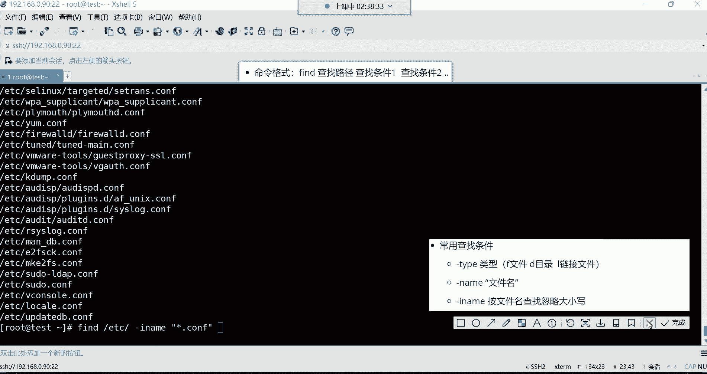

是不是按照类型找，然后按照名字找，然后名字里面可以支持通配符啊，就是星号可以帮你去做模糊匹配，这个呢I内是查找的时候忽略大小写。

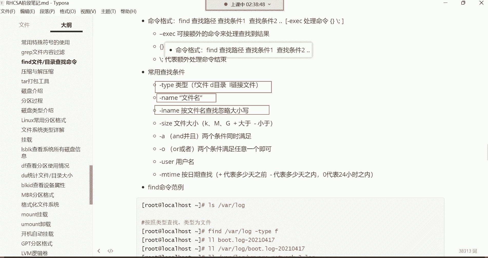

那下边这三个。

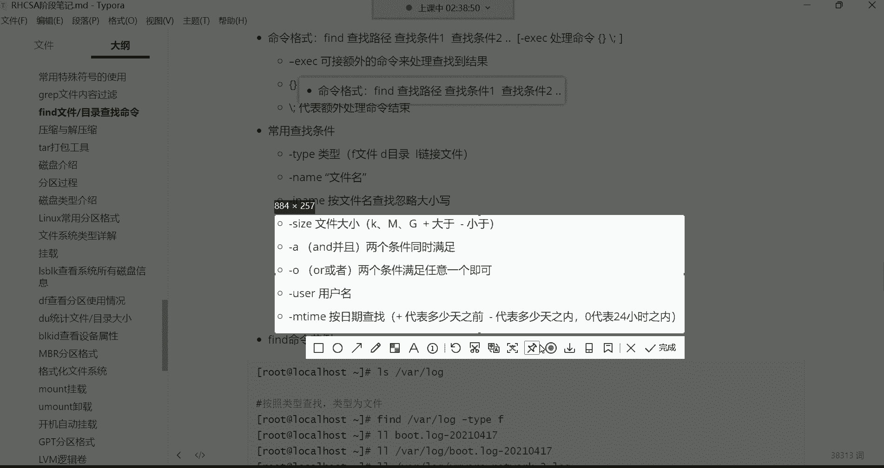

这是什么呢，这个条件呢就是可以按照文件大小去找了，文件大小，因为比如说我现在要找一个文件，然后呢我这个想怎么找呢，找一些日志文件哈，对于日志文件来讲呢，比如说太大了，我们一般会给这个日志文件做一些处理。

怎么处理呢，比如说后期做一些什么切割呀等等等等哈，但是总总之你得先找出来啊，这些文件我看看他别太大太大，占用磁盘空间呢，所以一般呢我们可以这样用gun size从哪儿找呢，啊就别从etc了。

因为日志文件都在挖下的logo下边，大大部分哈瓦下的log从那儿去找，然后按照大小去找，这个大小找的话呢可以看K招G为单位去找，然后加号代表大于，减号代表小于你就可以这样了，加号我要找什么呢。

我要找这个文件啊，它的大小大于K的，而且类型必须是文件回撤，那这些呢看一下它的大小，然后有一条命令呢叫do啊，do这条命令是统计文件大小的，do杠H加个选项跟上，可以告诉你这个文件大小是12K好吧。

这个do我们后面会学哈，嗯F是文件呢，F是文件类型里面F是文件哈，然后这时候你看到了吗，是不是满不满足我们的条件呢，大于10K的呀，满足啊，12K吗，是不是大于10K了呀是吧。

而且必须得是文件类型的才可以，OK然后你再随便找一个，像这种，你看一下我们to do杠H统计一下do命令，我们后面也会讲，上个28K是不是也大于10K啊，都满足条件啊，那我大于十兆的有没有啊。

那你就换10M是M哈，大写的M回车没有没有没有哈没有，那这里面没有etc，有没有呢，我们换个路径，可能这里没有太大的文件，etc回车也没有没有哈，那一兆的有没有啊，还有大于一兆的。

这个有这个文件这么大吗，啊do哈用do杠H统计有7。6兆，这文件这文件可确实很大呀，这是一个程序文件啊，这是一个程序文件哈，你那点B结尾的了这个，然后，哎哟这是内核相关的文件都很大，都很大了啊。

这就回车哎呦，3。8兆是吧，都大于一兆了，这是那你说有没有大于1G的呀，这就没有了，我们系统没有，我们系统新系统没有，那没有那么大的文件，比如换成一个G没有没有哈哈，这肯定是没有的哈，没有那么大的文件。

OK这是按大小去找，然后减号呢是小于啊，你比如我现在要查找小于多少的，那就用减号减号代表小于，比如小于多少，小于10K，咱就意思就是10K以下的文件从哪儿呢，从挖下的log去找，OK吧。

那你看这些文件它的大小刀是什么呀，都是小于10K的4。0K是吧，哎这个文件，看一下多少呢，4。0K是不是啊，唉都是小于多少的了哈，这大于跟小于哈，大于多少，小于多少。

好那这个呢就是根据你自己的情况去找呗是吧，你只要能够记住它的条件是杠size，然后它的单位看K招G都可以，剩下的操作就是加号代表是大于，减号代表小于，剩下就看你自己的情况了啊。

总之呢他你只要给他一个条件，他要帮你找啊，还有下边这种这个杠A啊，你在找的时候呢，那还可以加一些或者啊并且跟或者的意思嗯，杠A就是and并且的意思，O呢就是O啊叫或者O哈，或者然后这东西怎么怎么个意思。

你比如我想找一个文件，哎这个条件呢我比较苛刻，怎么苛刻呢，你这个文件大小必须得大于10K，并且那你就加个杠A，并且你要小于多少呢啊，叫杠C小于20K，2K类型得是文件的，那你看我这条件就复杂了。

怎么复杂呢，我这里面加了一个杠A啊，就是说这个文件大小必须得在多少呢，10K以上，20K以下啊，那就说得必须得在10~20K之间的范围，才能满足我的条件，能理解吧，你10K以下也不行，20K以上也不行。

必须在10~20K之间，这就是我的条件哈，那这样你看满不满足，必须得必须得在这个范围内哈，超出也不行，小于也不行，回车诶，你看12K满足吧，这个，满不满足呢唉也是2K是吧，都满足，你发现没有太小的吧。

也没有太大的，总之呢都是在10~20K之间了，就哎20K是不是，当然也包含哈，也包含20，这就是可以加这个，并且啊就是两个条件得同时满足，唉那这个杠欧呢，或者呢啊，这个就不是必须得两个条件同时满足了。

你是两个条件，满足一个就行，满足一个就行，那这个一般啊。

我记得这里边有一个例子哈，这个杠O，杠O啊在杠O嗯，杠，这哈哈哈干呕，或者啊，就当有多个条件是满足任意其中一个就行，我们可以这样哎，我就找名字是以点log作为结尾的，或者看到了。

或者你这个文件的大小小于10K的，而且类型是文件的，就是这个呢我的条件就比较什么呢，比较宽松一些，就是你这个文件名是一点log结尾也行，又或者说唉你的大小小于10K都可以，也就是说以点log结尾也满足。

或者说小于十可以满足。

哼哼这个呢说白了我就想找，要么文件名一点log结尾的，要么就是小于10K的，都从什么呢，都从这个VLOG去找，第一啊咱就杠name名字，星点log结尾的，然后这时候呢杠欧了啊，或者这个文件大小是多少呢。

小于10K的，小于10K，然后类型是文件的，不给他可以，那这时候就是只要你这个文件名，以点log结尾也可以，然后你的大小呢，那你不是以点log结尾的，但是你的大小是小于10K的，都符合的条件唉。

这个也不难理解是吧，OK两个条件满足一个就行，然后下面还可以按照什么，按照用户名去找，按照用户名去找你，比如说我现在要找系统当中的汤姆，这个用户的文件，那就这样放的来这杠U色了，后面跟上用户名汤姆啊。

或者说老王，我要看老王在这个系统当中的文件回车诶，没有是吧，没有没有给定一个路径是吧，那从哪儿给呢，啊我们就从系统根目录开始搜是吧，我要看看在这个系统当中，老王在我系统里的哪个目录都有它的文件。

看到了吗，就是大部分都是home目录，就是他的家看到了吗，都在他的家里面，其实大部分文件哈，剩下的还有什么呢，还有这个Rush sport mail，这里面有一个它的是什么呢，叫做那个邮件啊。

这是他的邮件文件，还有一个test目录，也有一个它的文件是吧啊，运维这个目录还有一个他的文件诶，那你看这是不是，我想搜索这个用户在系统当中都有哪些文件，是不是非常方便了，给个用户名就行了。

然后上面这个PLC，这个这个什么没有那个文件或目录啊，这种东西你就不用去太纠结，它为它主要是PC是内存里的数据，这个内存里的数据呢一般就是时有时无啊，就是不稳定，可能说这个程序在运行的时候呢。

这个文件就出来了，然后呢你找完以后呢，这文件要消失了，所以FD在显示的时候发现诶，我明明在查找的时候，我在POC发现有老王的文件了，但是为什么最后显示的时候显示不出来呢，哎文件没了啊，内存啊。

内存里的数据呢不稳定，时有时无的飘忽不定的，所以这个POC的报错不是什么报错啊，这是按用户名去找，这就也是比较简单的一个条件是吧，用户名，然后下边按照时间去查找，这个呢也比较也比较简单。

比如我想找一个文件呃，当然他这个时间是最后一次的修改时间哈，呃你比如我想找一个文件，这个文件在多少天之前啊，被改过啊，或者说在多少天之后等等等等，你都可以去找放的嗯，我们从Rush的log去找哈。

一般呢主要是找这些日志文件，然后杠m time加号代表多少天之前的文件，我想查找什么，我想查找十天之前被修改过的文件，那就加十好，然后再加个类型，杠type类型是文件的啊。

那这些文件的时间都是十天之前的时间，大家可以看一下是不是十天之前哈，啊这是3月6号，我们就是3月27号吧，是不是我们今天是3月这个27号，然后他那个是3月6号，是不是十天之前的呀。

唉你看他这个时间约十天之前被修改过的文件，我想看20天之前被修改过的文件，那就加20，嗯啊你想你想找两小时之前的是吧，也能啊也可以哈，find的呢它有啊，就是确实是可以支持哈，梁老师梁老师之前的哈。

但这个选项呢你得去百度搜一搜，因为find的这条命令啊，它也非常的复杂，我们看一下，我慢一下啊，慢一下范的，嗯放的这条命令，当然也你发现这大多数完全看不懂是吧，算了，我觉得不要在这浪费时间了哈。

咱们先把这个讲完，然后咱们再最后再说，OK吧，这是20天之前被修改过的文件，那你就可以看一下，他这个日期肯定是20天之前的了啊，这是这个啊，3月6号也是20天之前的是吧，因为今天是3月27号嘛。

OK对man是不是看看这个命令的帮助吗，前面不都讲过吗，然后当然啊你不要浪费时间了，因为大部分看不懂啊，看不懂，然后这是多少天之前，然后减号代表多少天之内，比如我想查找什么呢。

这个十天之内没修改过的文件，那叫减时显示，这些文件的时间都是十天之内被修改过的，你看到的时间肯定是十天之内的，这是3月27号的，今天的看到了吗，今天的哈，这个呢时间呢我们看看是不是也是今天的。

哎也是今天啊，也是今天的看到了吗，这都是不是都十天之内啊，啊那你说唉呀，我想看24小时之内的零，给它一个零就行了，回车这些文件都是24小时之内的啊，其实就是当天被修改过的，注意啊，他现在给你找出来。

这些文件都是当天有过修改的，看到了吗，都是今天啊，3月27号几点呢啊，三点的时候被修改过，当然这日志文件哈，就系统在运行的时候，它就会往自己往这个文件里面去写去写东西，所以你不用管。

你说我也没有改过这个文件呢，你可能会纳闷是吧，这是日志文件，系统运行的时候，他自己写日记，不是你写的，知道吧啊所以他就会往这个文件里面去写东西，好这是多少天之前，多少天之内啊，还有一个24小时之内是吧。

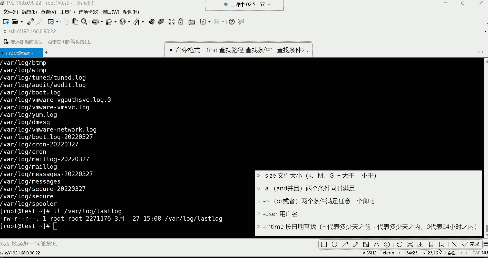

那你说哎呦，我想查找两个小时被改的文件啊，那这个呢你去百度搜一搜。

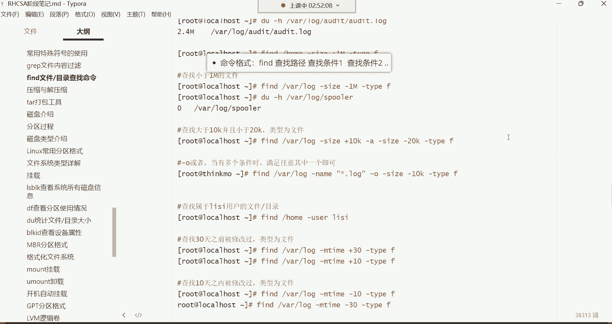

要饭的命令，看看有没有哈，这里边随便找一找嗯，啊你看还可以什么呢，怎么过去几分钟看到了吗，啊过去N分钟内被修改过的文件，那这个不就可以了吗，这个120分钟可不可以两小时来吧。

杠C，C米C米，诶诶诶诶过分了哈，fr下了log杠CSEI啊，最小最小多少分钟了，多少分钟呢，比如120分钟，然后杠，类型是文件的走，你哟好像没有没有哈，我们那个我看一下啊。

我看一下是不是语法有问题啊，C没有问题啊。

这个那我再换一下，我换一下哈，我们换多少呢，换比如说59啊，没有59分钟。

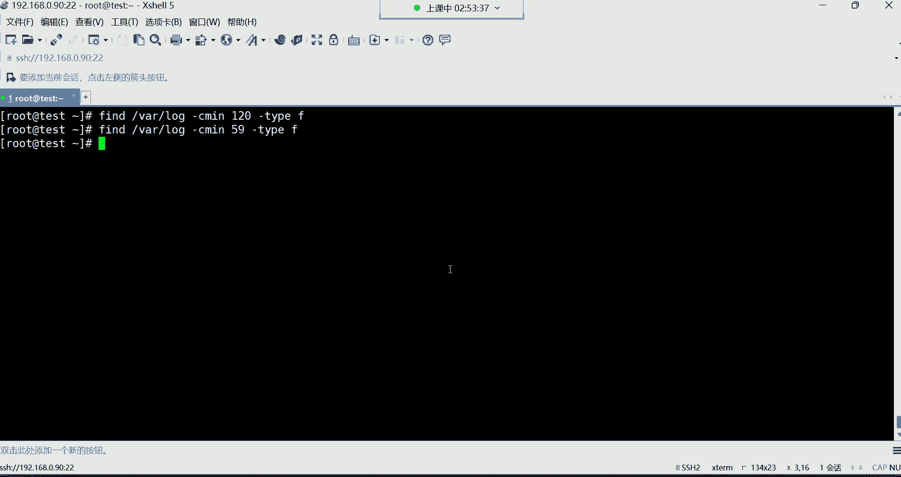

这确实是不怪我们哈。

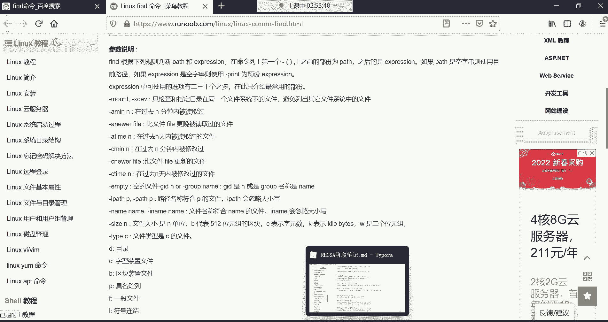

没有符号是吧啊，多少分钟之前多少分钟之内嗯，那我们这样吧好吧，再来个加号吧，是加号是这个多少分钟之前，120分钟之前那一本那减号吧，120分钟之内吧是吧，减号唉哟唉是这样玩的，没错是这样玩的哈。

看看时间对不对哈，诶没有问题啊，这确实是呃俩小时之内是吧，嗯可以啊，这次看到了吗。

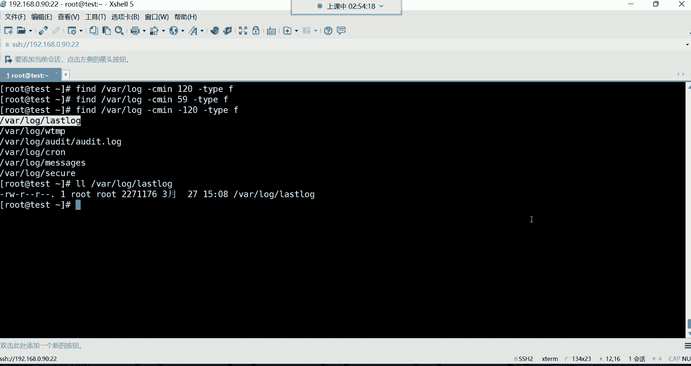

所以这里边呢后期如果你有这种需求啊，可以去网上搜一搜，这种东西都不是什么难的问题了，看到了吧，因为你只要了解它大概的语法，你看一看是不是，如果你觉得这里边好找不到我想要的这个帮助。

你就看看别的帮助是不是，反正呢这里面你只要别看这种广告就行了，你别点着点着，你发现卧槽他妈的点进去以后呢，去看别人广告去了是吧，预览了半天后呢，再报个名啥的，这就犯不上了，哈哈哈哈啊。

所以你得排除这些广告哈，一般头几行都是广告，OK看到了吗，这些都行哈，这些都行好了，这是对find的这个老鸟LINUX可以看吗是吧。

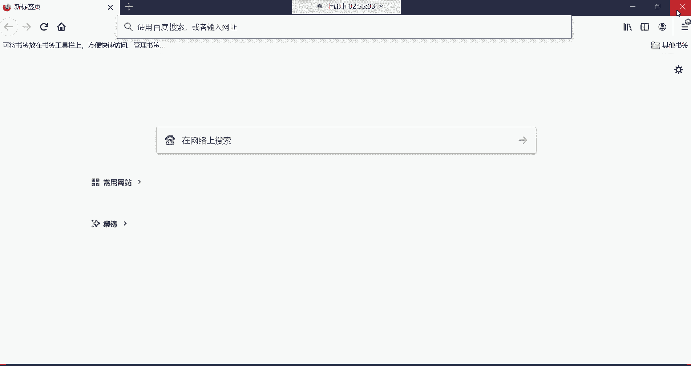

老鸟可以啊，都可以都可以看，可以作为一些额外的一个什么呢，一个扩展吧。

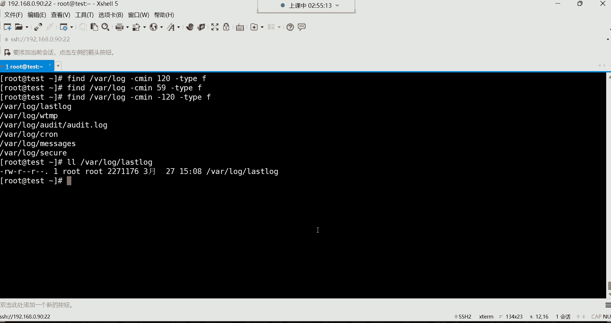

好，那接下来呢我们再来给大家讲讲，它的一个完整命令格式哈，其实它的完整命令格式我们前面在这。

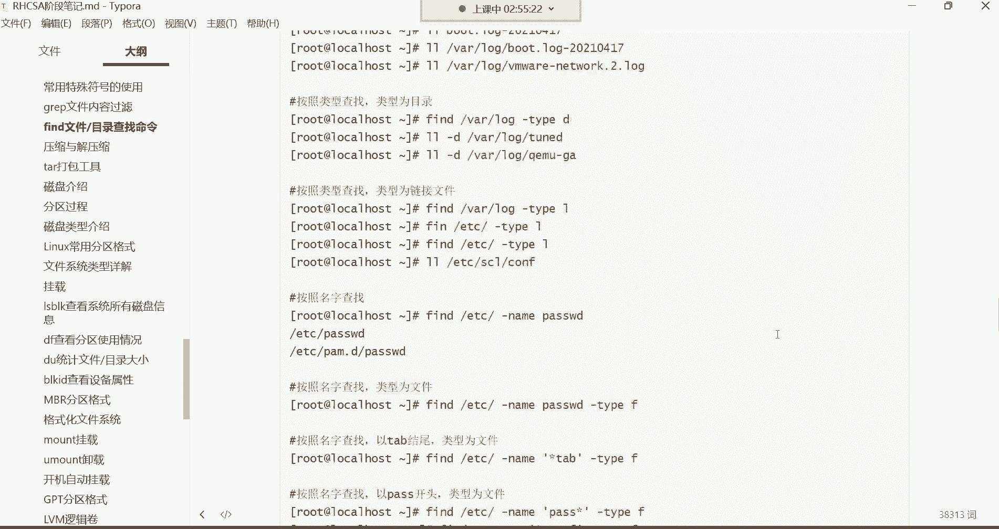

这是它的一个完整命令格式，这是完整的命令格式。

这个完整命令格式呢它有一些操作，这几个操作我们得给大家说一说。

就这几个操作哈，呃他的这几个操作呀，那前面呢我们一直在用是吧，就可以跟很多的查找条件嗯，那是B啊，不是啊，他就是一本书啊，他一本书一本电子书，然后这个呢是什么呢，这个是额外处理。

你就比如说我们现在我条件已经出来了，我这些文件都是两个小时，被两个小时之内被改的，我想做个备份，我想给它拷贝到一个目录里面，给它备份一下，怎么办啊，我们给它备份到哪里了吗，OPAT我们清空一下吧，好吧。

把OPT这个目录给他清空一下，然后呢，我现在就把前面查找出来的这些文件，给它备份到OPT好，那这时候怎么备份，可以接管道吗，CP拷贝到OP t回车，你发现不行，肩井号是吧，Op，你这啥呀。

你这是把文件名，注意，你是把文件名给它保存到这个OPT目录吗，啊哼这哪有这哪有这么操作的呀，你说你这操作他，你这操作你想干嘛，你说你是想把文件名给它，保存到这个OPT目录。

还是想把文件保存到OPT目录啊，这个尖角号这大于号，它这个功能是什么来着，这功能是将输出的结果保存到一个文件里面，是不是唉保存到一个文件里面，那你说你这个尖角号，你直接什么叉叉OO这是什么操作呢。

这是把文件名以及路径，保存到这个文件里面去了，但是我要的是这个吗，不是我要的是文件的内容啊，我要内容，整个文件我做个备份，我可不是说要文件名哈，要文要文件名，你可以这样玩，但是不是这样子的哈。

不是这样子的，所以这波操作不行，哎呦这怎么又来一波啊，找出来了，找出来以后MV吗，好那咱说管道给MV是吧，移动到OPT目录不行，是不是，那你不结合管道肯定不行，你后面不可能接MV的，你发现这就不行了。

是不是啊，唉哟这怎么办呢，有这种需求的话，注意哈，他不犯的命令啊，对管道支持不友好，对对管道的支持不友好，你可以这么去理解吧，可能是开发饭的这条命令的人，跟开发管道功能的这个人。

这俩人可能说有些不太合啊，可能这是汤姆是吧，这是老王开发的，没事经常经常去他家修管道，所以说呢这两人呢就是这个可能说那确实是哈，有有你就不能有我啊，反正不能共存啊，呵呵就这意思啊。

反正饭的跟管道他们两个啊不是很友好哈啊，生死大敌对，那怎么办呢啊所以这个find命令啊，人家开发者，人家也直接给你研究出来这么一个功能啊，叫EXEC，用ESEC可以接额外的命令来处理，他帮你找到的结果。

你不用管道啊，我跟我跟管道符不合啊，所以ex1C就可以了，然后呢，这时候我们就可以后面接额外的命令了哈，那这个命令我就可以接CP啊，给他拷贝拷贝拷贝到哪里呢，注意这个ESEC。

后面跟上一个处理命令以后呢，还要接个大括号，大括号大括号什么意思，就代表犯的查找到的内容，先给你存放在这个大括号里面啊，就找出来这些文件给你放到大括号里面，然后呢我CP命令干嘛呀。

拷贝大括号里的查找到的内容拷贝到哪里呢，拷贝到OPT目录，然后空格注意哈，左斜线分号代表额外处理的命令，结束了，回车就是你再看OP t回车，哎，这文件拷贝过来了，看到了吧，所以你看他这个完整格式。

如果你真的是需要后期处理的话，处理他查找到的结果，就必须得是接这个中括号里的命令哎，ESEC后面就接你想干什么事儿了，然后呢大括号语法格式哈，还是管道好用是吧，其实用习惯也就一样了哈。

刚开始接触的时候可能觉得不好记是吧啊，没关系啊，用习惯就可以了，备份了是吧，唉备份了这就不难了，那后期你说我想把这个文件给它移移走，移动怎么办，那是不是就换命令啊，MV是不是就移动了啊。

你说按删除是不是就换RM没错吧，但你删除后边就不能接目录了吧，是不是删除，就是把大括号里面的查找结果都删掉，就不能接目录是吧，你接个目录，你说这命令他就蒙圈了，这到底什么意思啊，删除以后啊。

给个OPT目录，这到底在干嘛，看不懂了啊，所以删除的时候就不要接目录哈，你要拷贝移动，你后面给个路径啊，这样就可以了，OK啊这是它的一个完整的命令格式是泛的嗯。

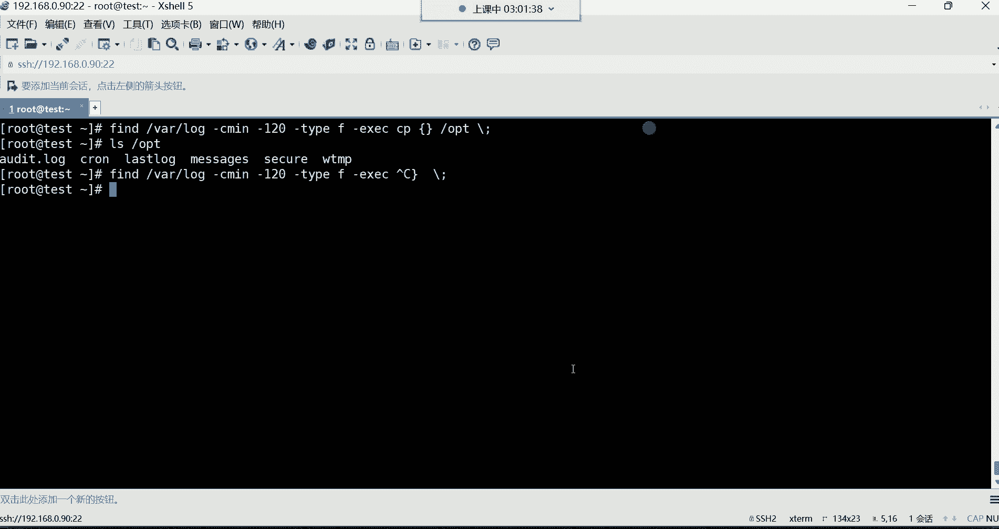

然后呢啊对于这个这条命令来讲呢，我下边呢也是给大家对于find命令，我给大家留了一个题啊，这个题的话呢，这个呢不用说了哈，前面给大家讲过了，如果你想查找etc下面一点康复结尾的文件。

我只要你在etc这一层去找IOS就可以实现了，IOS只在etc这一层跟上新点康复啊，呃，清空日记内容实现不了是吧，不行啊，他对那个大于号啊，如果接echo的话也不行，不允许哈，不允许。

不是说不允许就失效失效哈，如果你说哎我们就要清空一个日志内容。

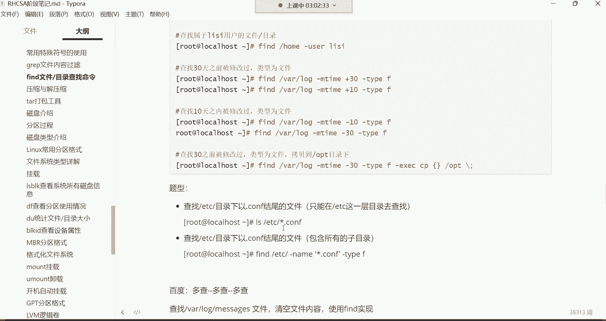

比如咱们找到了，比如说我找一些日志文件哈，办的从RUA下的log去找，找什么呢，找大小杠size大小超过10K的啊，或者说十兆的吧，文件类型是文件的啊，这个十兆太大了是吧，咱们就10K吧。

那就10K吧行吧，这些文件的内容咱们就假设哈啊就非常大，我要给它清空一下了，太占用磁盘空间了，也用不到日志文件嘛，删了也无所谓，那这时候呢找出来以后呢，我想让你把这个内容给我清空一下。

那节约一下我的磁盘的空间怎么办，就是你说文件我是找出来，但是我怎么把文件内容清空，这时候得额外处理了是吧，EXEC啊，这是很多人说了，那我直接来个大于号是吧，我这样，那大号就是什么呢。

就通过echo echo一个空，什么意思呢，就是我EQ接大于号，就是我echo一个空格，apple一个空格就通行，干嘛呀，把文件里的内容给它覆盖掉，因为这个重定向吗，不是具备覆盖的功能吗。

就是我往每个日志文件里面EQ一个空行，然后把这个文件里面也有那种它覆盖掉，有时候这个文件就等于说被我给清空了，就这意思，但你发这种操作它没用，你现在再把这个文件拿过来，你看它大小的时候。

诶是不是还是原先的大小啊，不行，那怎么办，哎它可以让你这样玩啊，你这样不行，它可以让你这样CP拷贝拷贝什么呀，把大括号里面查找结果拷贝到这样啊，我这样我把DV下的一个叫NN的这么一个文件。

内容拷贝到我查找到的每一个文件里面去，注意啊啊这个DV这个目录，这个NN我们后面会讲啊，它叫一个什么叫黑洞设备，这个这是一个什么呢，是一个设备文件，带大家来大家看一下啊，在DV下边，打开DV啊。

有一个N这也是一个文件啊，但是一个黄颜色的设备文件，这个设备文件有个特点啊，是你可以把它理解成是LINUX啊，这个LINUX系统的一个垃圾桶，垃圾桶哈啊，就是比如说我想把哪些数据啊给它扔掉。

你就可以扔到这个垃圾桶里面，一旦一旦扔到这里面，数据就没了啊，是一个无底洞哈，是一个无底洞啊，黑洞黑洞设备啊，你看这个，你看这个太阳系里面有一个黑洞设备是吧，只要一到黑洞里面，这东西就没了消失了。

所以你可以把它理解成一个，这个系统的一个黑洞啊，只要文件内容一扔到这里面就消失了，消失不见了哈，好那我们说这个设备它本身就是空的，这里边没什么东西啊，所以我现在可以这样玩啊。

我CP我把这个文件的内容干嘛呀，拷贝到这个什么呢，查找到的每一个文件内容里面去，这里面本身就是个空的，然后呢我拿了个空文件的内容，覆盖掉这些文件的内容，这样可以，你这样的话呢，你再看A没了，零大小为零。

看到了吗，你现在随便再挑一个文件，你看啊，当然我们说do哈do统计的，你看大小都为零了是吧，唉这样可以，所以如果你想清空一个文件内容，可以调用这个叫黑洞设备就可以了啊，当然这个我们后面也会详细介绍。

因为现在还没有到那个阶段啊，在讲磁盘管理的时候，我们其实还就会给大家介绍这个文件啊，除了这个文件以外，还有别的文件呢，也是类似于这个功能吧，文件只要呃把什么东西扔到这个里边，就消失不见了啊。

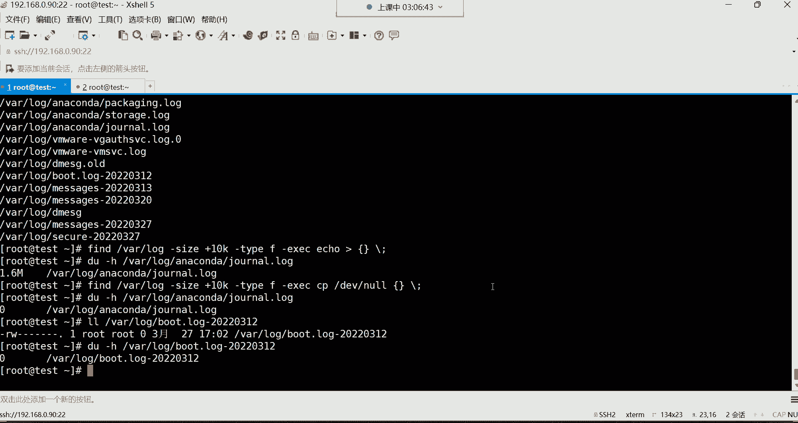

所以这个我呢也是给大家留了这个什么呢，这个这个题哈就是查找查找这个文件，查找以后呢，然后清空文件内容，看他们使用FD实现啊，查找以什么结尾的清空文件内容，用FD实现就是，用利用这个设备文件哈。

可以实现这个这就是饭的已经蒙了是吧，蒙了很正常嗯，一晕计算嘛，不晕怎么能叫云计算呢是吧，然后行了，那今天就讲这么多吧，我就故意再讲，大家也吸收不了了是吧，今天我们这其实我觉得整体没讲太多东西啊。

讲了一些特殊权限，又讲了一些这个特殊符号啊，讲了一些group跟FD这两条命令嗯，这节这节课几十发录屏啊，一会儿下课就发，下课就发，然后今天的内容呢大家要掌握的都有哪些呢，这两个这两个哈。

特殊符号里面的这个星号跟大括号，这个里边哈星号和大括号呢大家要掌握group命令，要掌握，find命令要掌握，这是常用的常用的，然后是把需要掌握的呢。

我们大家下去以后呢要多多练习。

我们要框起来呢，你可以作为一个了解内容，可以啊，可以保留一下哈，这个，对啊，对哈，晚上敲一敲是吧，练一练，然后我也把这个图给大家发到这个什么，发到这个咱们这个大的群里边，好过去了哈行嗯。

这种东西呢就多敲多练，没有什么太多好的方法，你敲他十遍八遍的，你手形成记忆了，你自然而然就记住了，呵呵你看一遍听一遍，你发现哎呦，当时明白了，一会儿就忘好，录屏停掉吧，我们今天就给大家讲这么多。

