# Linux运维教程：P26：开机自动挂载、GPT分区、LVM逻辑卷

## 概述

在本节课中，我们将学习Linux系统中关于磁盘管理的三个核心概念：开机自动挂载、GPT分区以及LVM逻辑卷。我们将重点探讨LVM逻辑卷的原理、创建和管理方法，理解其如何实现存储空间的动态扩展，这对于企业级运维至关重要。

---

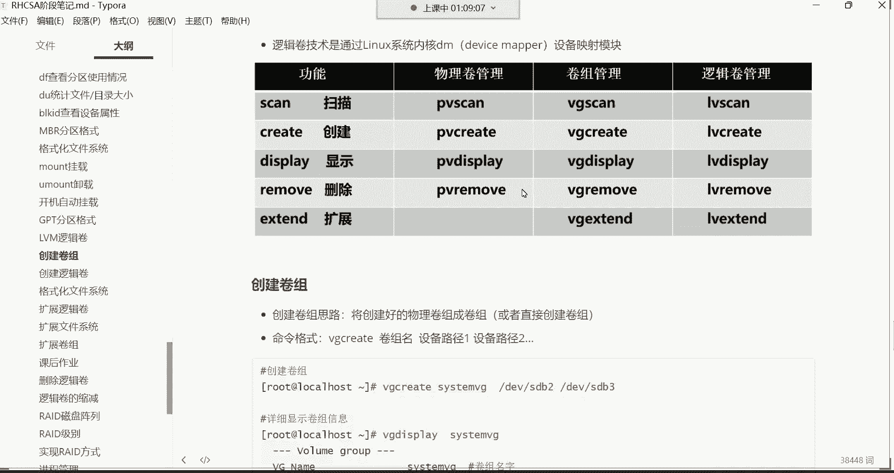


## 逻辑卷（LVM）的核心概念

上一节我们介绍了分区的基本管理，本节中我们来看看更高级的存储管理方案——逻辑卷管理器（LVM）。

逻辑卷是一种虚拟化存储技术。它可以将底层多个物理硬盘或分区整合成一个大的、可灵活管理的“虚拟硬盘”（称为卷组），并从这个“虚拟硬盘”中划分出逻辑卷供系统使用。其最大优势在于**支持在线扩容**，无需格式化现有数据。

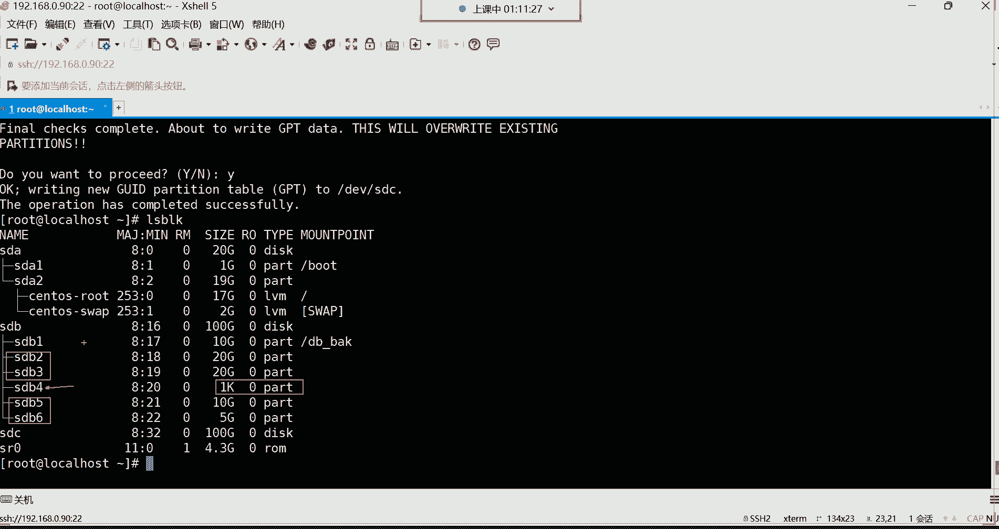

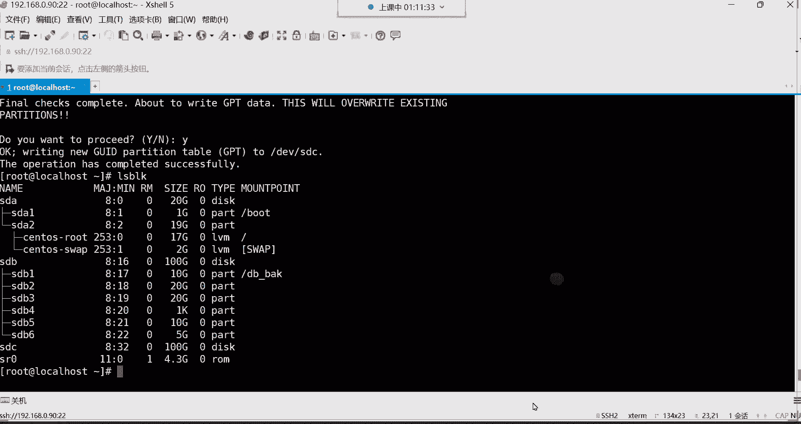

### LVM的组成与工作原理

LVM的架构主要包含三个层次：

1.  **物理卷（Physical Volume, PV）**：这是LVM的基础构建块。它可以是整个物理硬盘（如 `/dev/sdb`），也可以是一个分区（如 `/dev/sdb1`）。PV是底层存储空间的提供者。
    *   **命令前缀**：`pv`
2.  **卷组（Volume Group, VG）**：一个或多个物理卷（PV）可以组合成一个卷组。卷组就像一个大的“存储池”，它汇集了所有底层PV的存储空间。
    *   **命令前缀**：`vg`
3.  **逻辑卷（Logical Volume, LV）**：从卷组（VG）中划分出来的逻辑存储单元。逻辑卷最终会被格式化成文件系统（如xfs, ext4）并挂载到目录使用，对于系统而言，它就像一个普通的分区。
    *   **命令前缀**：`lv`

**工作流程简化版**：
`物理硬盘/分区` -> 加入LVM成为`物理卷(PV)` -> 多个PV聚合成`卷组(VG)` -> 从VG中划分出`逻辑卷(LV)` -> 格式化LV并挂载使用。

**核心优势**：当LV空间不足时，可以从其所属的VG中分配更多空间进行扩展。如果VG空间也不足，可以向VG中添加新的PV（新硬盘或新分区）来扩容VG，进而再扩容LV。整个过程可以在线进行，无需卸载文件系统或迁移数据。

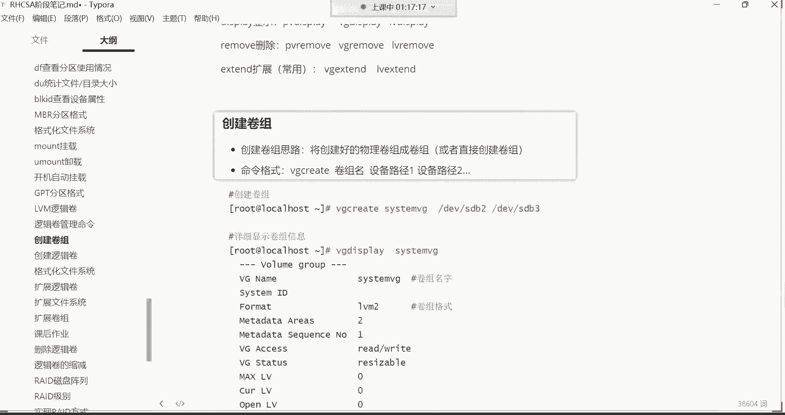

---

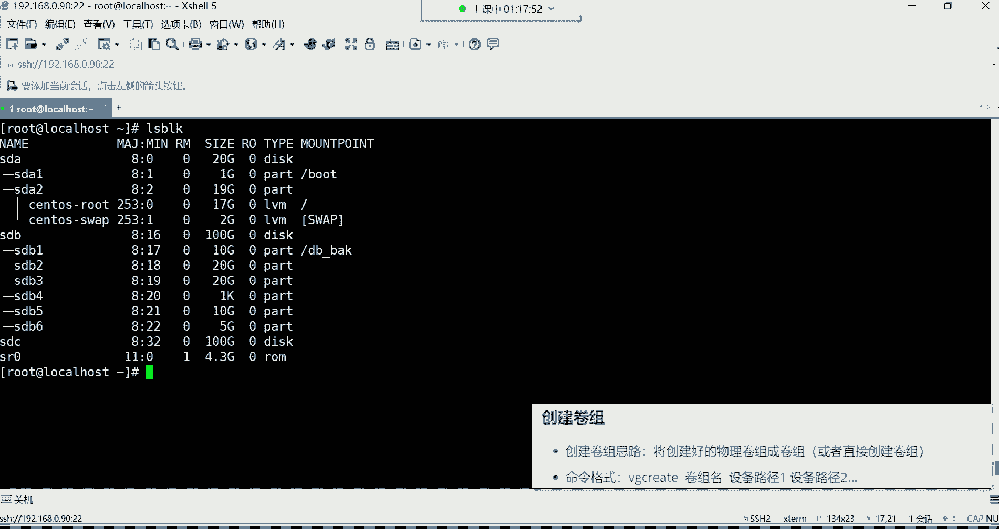

## 创建与管理LVM逻辑卷

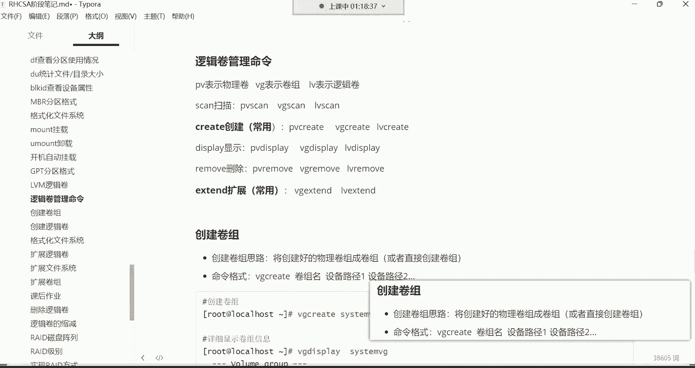


理解了LVM的原理后，本节我们通过实际操作来学习如何创建和管理逻辑卷。在CentOS 7及更高版本中，创建PV的步骤通常可以省略，系统会自动处理，这简化了操作。

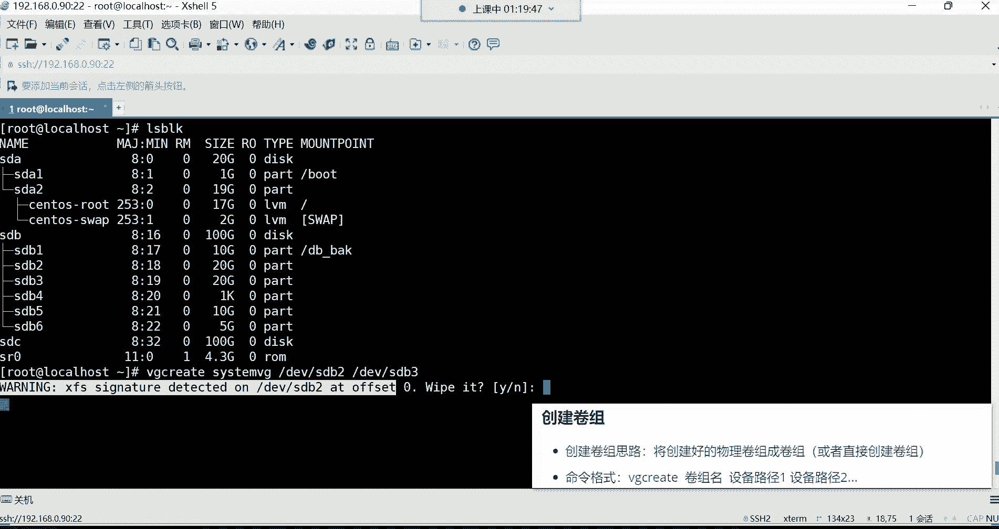

以下是创建LVM的常用命令概览：

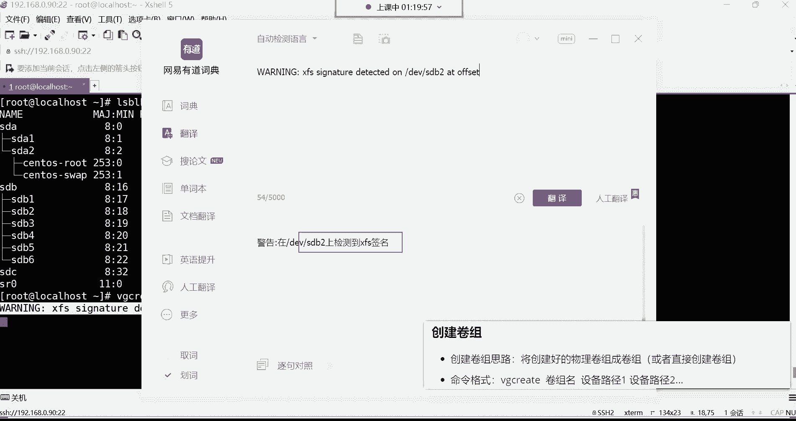

*   **创建类**：`vgcreate`, `lvcreate`
*   **显示/查看类**：`vgs`, `lvs`, `vgdisplay`, `lvdisplay`
*   **扩展类**：`lvextend`
*   **删除类**：`vgremove`, `lvremove`

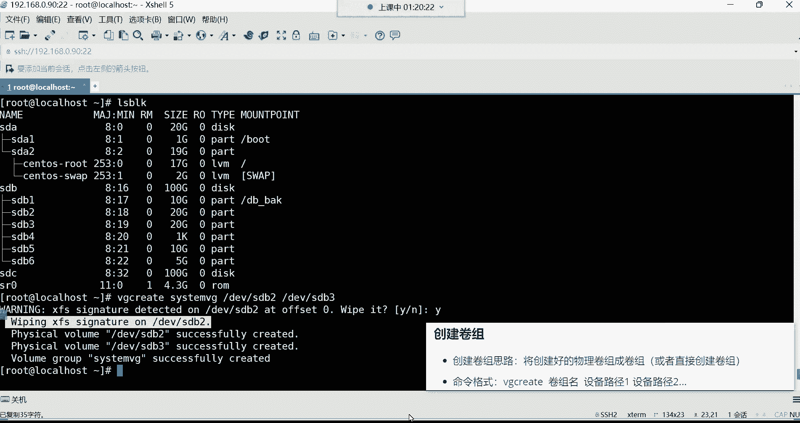


### 第一步：准备物理分区

假设我们有两块空闲分区 `/dev/sdb2` 和 `/dev/sdb3`，我们将用它们来创建LVM。


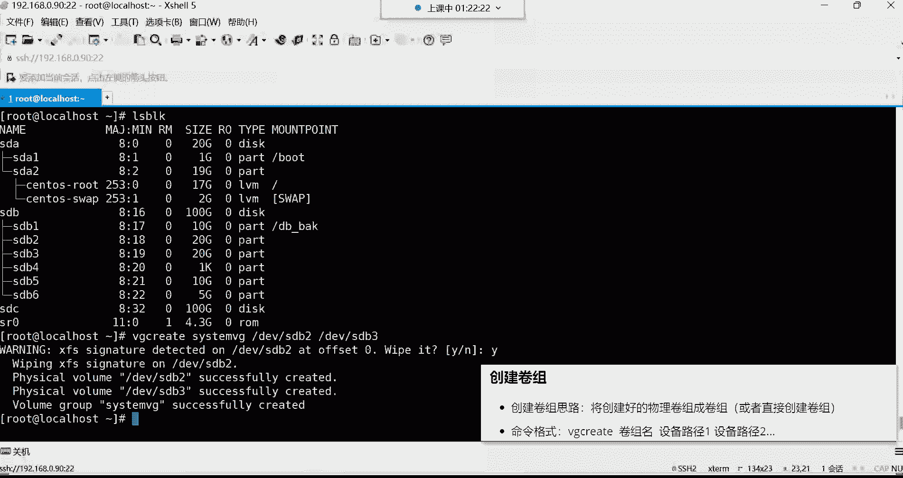

> **重要提示**：将分区加入LVM会清除其上的所有数据，请确保数据已备份或分区为空。

### 第二步：创建卷组（VG）

使用 `vgcreate` 命令创建卷组。其基本格式为：
```bash
vgcreate <卷组名> <物理设备路径1> <物理设备路径2> ...
```
例如，创建一个名为 `system_vg` 的卷组，包含 `/dev/sdb2` 和 `/dev/sdb3`：
```bash
vgcreate system_vg /dev/sdb2 /dev/sdb3
```
执行后，系统会提示检测到文件系统签名并询问是否擦除，输入 `y` 确认。命令成功后，会显示卷组创建成功的信息。

**查看卷组信息**：
*   使用 `vgdisplay system_vg` 查看详细信息。
*   使用 `vgs` 命令可以简要查看所有卷组的状态，更常用。
    ```bash
    vgs
    ```
    输出中，`VG` 列是卷组名，`#PV` 列是包含的物理卷数量，`#LV` 列是逻辑卷数量，`VSize` 是总大小，`VFree` 是剩余空间。

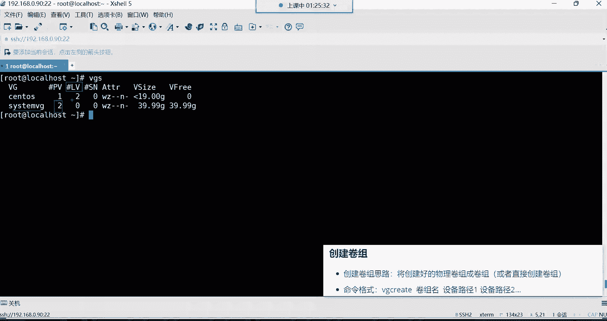

### 第三步：创建逻辑卷（LV）

在创建好的卷组中划分逻辑卷。使用 `lvcreate` 命令：
```bash
lvcreate -L <大小> -n <逻辑卷名> <卷组名>
```
例如，从 `system_vg` 卷组中划分一个20GB大小、名为 `my_lv` 的逻辑卷：
```bash
lvcreate -L 20G -n my_lv system_vg
```


**查看逻辑卷信息**：
*   使用 `lvdisplay /dev/system_vg/my_lv` 查看详细信息。
*   使用 `lvs` 命令简要查看所有逻辑卷。
    ```bash
    lvs
    ```
    创建成功后，逻辑卷的设备文件路径通常是 `/dev/<卷组名>/<逻辑卷名>`，即 `/dev/system_vg/my_lv`。

### 第四步：使用逻辑卷

逻辑卷创建好后，其使用方式与普通分区完全一致。

1.  **格式化**：为其创建文件系统（例如xfs）。
    ```bash
    mkfs.xfs /dev/system_vg/my_lv
    ```
2.  **挂载**：创建挂载点并挂载。
    ```bash
    mkdir /web_backup # 如果目录不存在则创建
    mount /dev/system_vg/my_lv /web_backup
    ```
3.  **开机自动挂载**：编辑 `/etc/fstab` 文件实现。
    ```bash
    vi /etc/fstab
    ```
    在文件末尾添加一行：
    ```
    /dev/system_vg/my_lv /web_backup xfs defaults 0 0
    ```
    添加后，使用 `mount -a` 命令测试配置是否正确（无报错即表示成功）。

---

## 逻辑卷的扩容


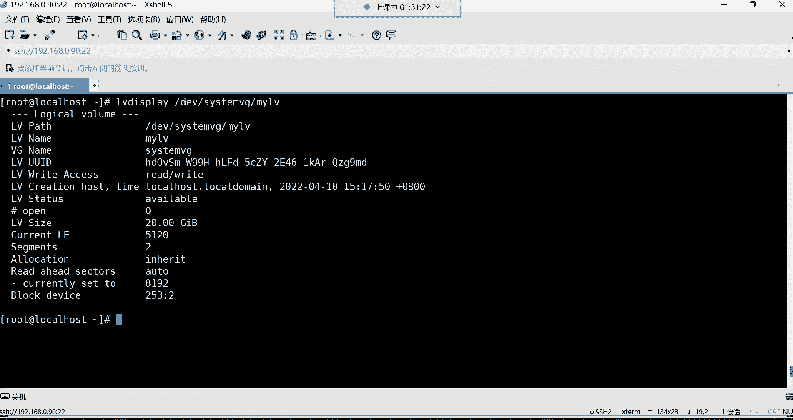

逻辑卷的核心价值在于动态扩容。当 `/web_backup` 目录空间不足时，可以对其进行扩容。

扩容分为两种情况：
1.  **卷组（VG）有足够剩余空间**：直接扩展逻辑卷（LV）即可。
2.  **卷组（VG）空间不足**：先向卷组中添加新的物理卷（PV，即新硬盘或分区），扩展VG，再扩展LV。

### 情况一：直接扩展逻辑卷

假设 `system_vg` 还有剩余空间，我们要将 `my_lv` 再扩容10GB。

1.  扩展逻辑卷大小：
    ```bash
    lvextend -L +10G /dev/system_vg/my_lv
    ```
    （`-L +10G` 表示增加10GB；`-L 30G` 表示设置为总大小30GB）

2.  扩展文件系统：**这一步至关重要！** 扩容了LV的“房子”，还要同步扩大里面的“文件系统”。
    *   对于 **xfs** 文件系统：
        ```bash
        xfs_growfs /web_backup
        ```
    *   对于 **ext4** 文件系统：
        ```bash
        resize2fs /dev/system_vg/my_lv
        ```
3.  使用 `df -h` 检查，会发现 `/web_backup` 的容量已经增加。

### 情况二：扩展卷组后再扩展逻辑卷


如果 `vgs` 显示 `system_vg` 的 `VFree` 为0，则需要先扩容卷组。


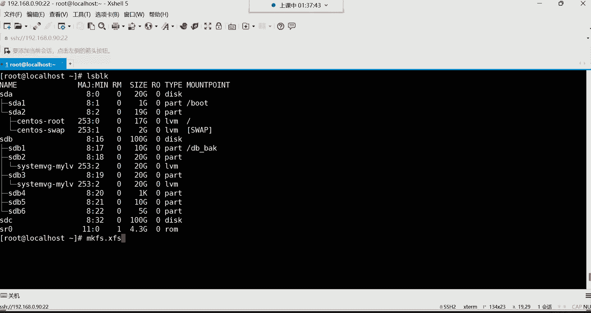

1.  准备新的物理设备（如新硬盘 `/dev/sdc` 或新分区 `/dev/sdb4`）。
2.  将新设备添加到卷组中：
    ```bash
    vgextend system_vg /dev/sdc1
    ```
3.  添加后，使用 `vgs` 查看，`system_vg` 的 `VFree` 会增加。
4.  此时，再按照 **情况一** 的步骤扩展逻辑卷和文件系统即可。

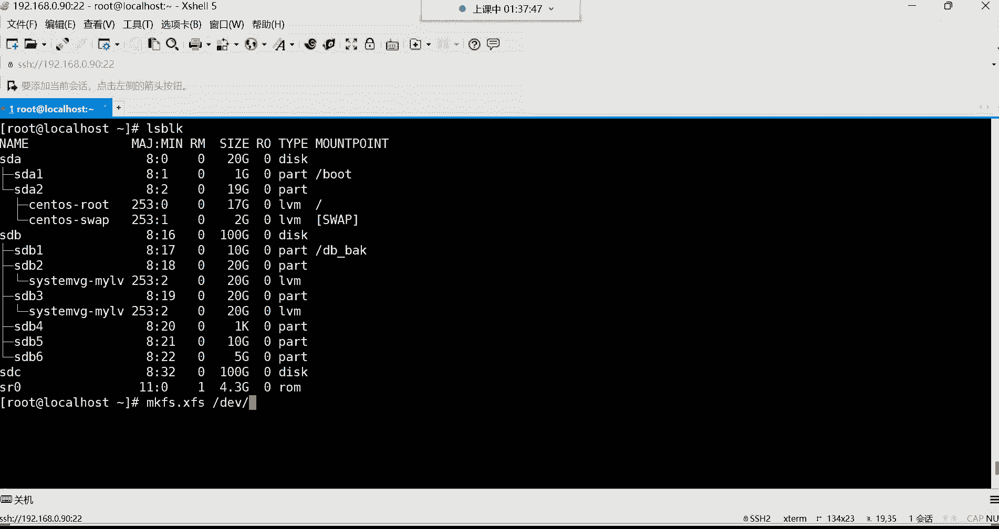


---

## 总结

本节课中我们一起学习了Linux存储管理的高级主题。

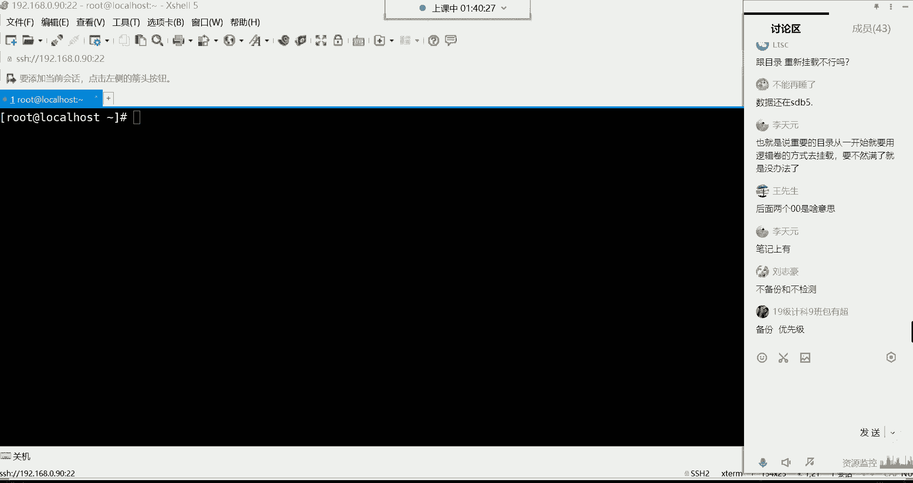

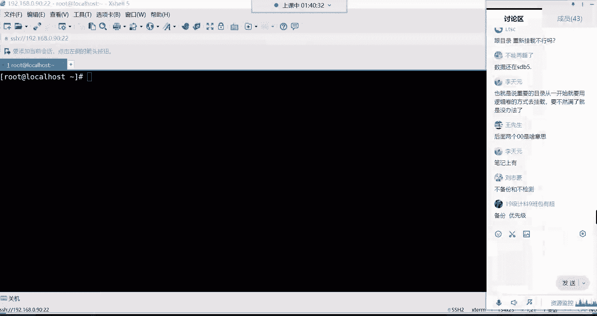


1.  **逻辑卷（LVM）原理**：理解了PV、VG、LV三层结构，掌握了LVM通过将多个物理存储单元汇聚再灵活分配，从而实现存储空间动态扩展的核心价值。
2.  **LVM创建与管理**：掌握了从物理分区创建卷组（`vgcreate`）、从卷组划分逻辑卷（`lvcreate`）、格式化并挂载使用的完整流程。
3.  **LVM扩容操作**：学会了在卷组空间充足时直接扩展逻辑卷（`lvextend`）并同步扩大文件系统（`xfs_growfs`/`resize2fs`），以及在卷组空间不足时通过添加物理设备扩展卷组（`vgextend`）的方法。
4.  **实际应用**：认识到对于像根目录（`/`）这样重要的、需要长期稳定运行且数据量可能持续增长的位置，使用LVM是保障业务连续性和灵活性的最佳实践。

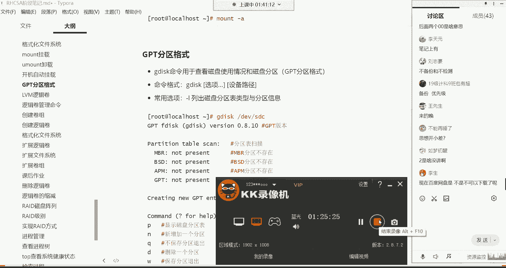

LVM是Linux运维工程师必须掌握的技能，它使得存储资源管理变得像分配内存一样灵活，极大地提升了系统的可维护性和扩展性。