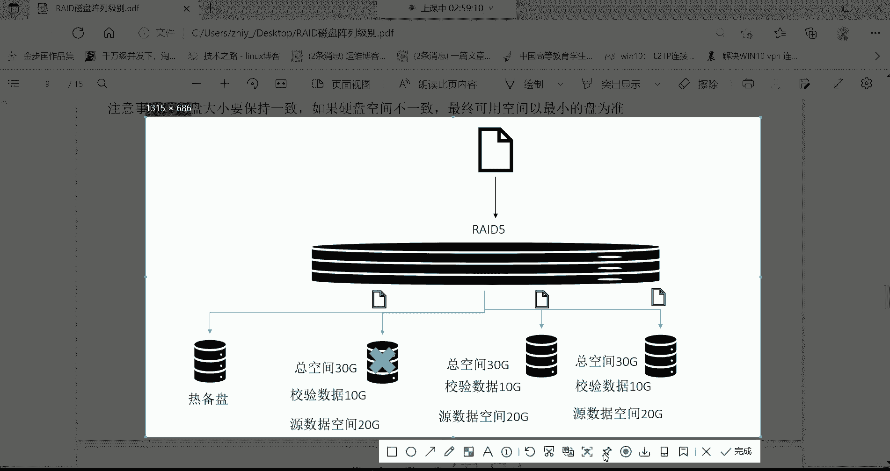
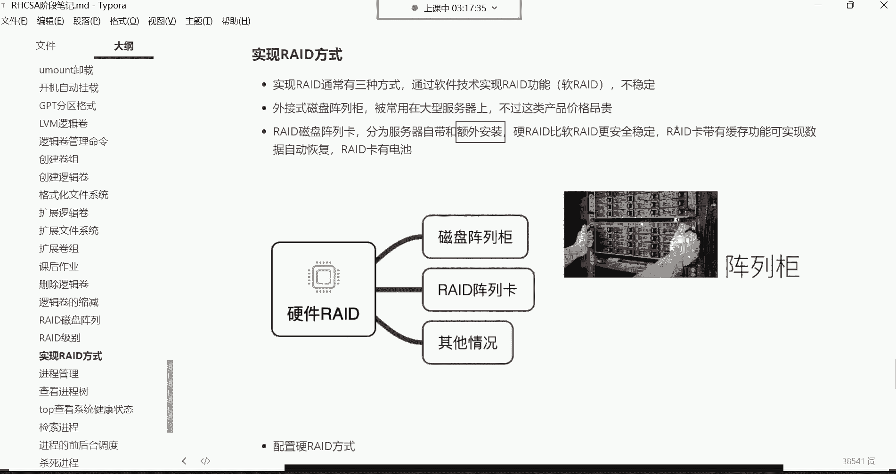

# Linux运维教程：P28：逻辑卷扩容与RAID磁盘阵列

在本节课中，我们将学习Linux系统中两个重要的存储管理概念：逻辑卷的扩容和RAID磁盘阵列。我们将了解RAID的不同级别及其特点，并掌握如何为根分区进行逻辑卷扩容。

## RAID磁盘阵列概述

上一节我们介绍了逻辑卷管理，本节中我们来看看如何通过RAID技术来提升磁盘的性能和可靠性。RAID（Redundant Array of Independent Disks）即独立磁盘冗余阵列，其核心思想是将多块物理磁盘组合起来，形成一个逻辑上的大磁盘，以实现数据备份、提升读写速度或两者兼得。

以下是几种常见的RAID级别及其工作原理：


### RAID 0：条带化阵列
RAID 0至少需要两块磁盘。其工作方式是将一份文件等量拆分，并行写入到不同的磁盘中。

**核心概念**：并行写入。
**优点**：读写速度理论上可以翻倍。
**缺点**：没有数据冗余功能。任何一块磁盘损坏，都会导致数据丢失。
**适用场景**：对速度要求极高，但对数据安全性要求不高的场景。

### RAID 1：镜像阵列
RAID 1同样至少需要两块磁盘。其工作方式是将同一份文件完整地复制一份，存储到另一块磁盘上。

**核心概念**：完全备份（镜像）。
**优点**：数据安全性高。一块磁盘损坏，数据不会丢失。
**缺点**：写入速度没有提升，反而可能下降（因为需要写入两份数据）。可用存储空间只有总磁盘容量的一半。
**适用场景**：存储非常重要的数据。




### RAID 5：分布式奇偶校验阵列
RAID 5至少需要三块磁盘。它将数据条带化分布存储，同时将奇偶校验信息也分布存储在所有磁盘上。

**核心概念**：条带化 + 分布式奇偶校验。
**优点**：兼顾了速度（并行读写）和安全性（允许损坏一块磁盘）。可用空间为 `(N-1)/N * 总容量`（N为磁盘数）。
**缺点**：写入数据时需要计算校验位，对性能有一定影响。
**适用场景**：兼顾性能与可靠性的通用选择，是企业中最常用的RAID级别之一。

### RAID 6：双重分布式奇偶校验阵列
RAID 6是RAID 5的扩展，至少需要四块磁盘。它使用双重奇偶校验算法。

**核心概念**：条带化 + 双重分布式奇偶校验。
**优点**：允许同时损坏两块磁盘而数据不丢失，安全性更高。
**缺点**：校验数据占用更多空间（两块磁盘的容量），写入性能比RAID 5更低。
**适用场景**：对数据安全性要求极高的场景。

### RAID 10：镜像+条带化阵列
RAID 10是RAID 1和RAID 0的结合，至少需要四块磁盘。它先将磁盘两两组成RAID 1镜像对，再将多个镜像对组成RAID 0。

**核心概念**：RAID 1 + RAID 0。
**优点**：既提供了高速的读写性能（RAID 0），又提供了高数据可靠性（RAID 1）。
**缺点**：成本高昂，可用空间只有总磁盘容量的一半。
**适用场景**：对性能和可靠性都有极高要求的场景，如数据库服务器。


## RAID的实现方式

了解了RAID的级别后，我们来看看如何实现它。主要有以下三种方式：

1.  **软件RAID**：通过操作系统层面的软件来实现RAID功能。优点是成本低，但会消耗CPU资源，性能较差，且系统崩溃可能导致阵列失效。
2.  **硬件RAID**：通过专用的RAID控制卡来实现。RAID卡自带处理器和缓存，不占用主机资源，性能好，稳定性高。这是企业环境中最常用的方式。
3.  **外置磁盘阵列柜**：一种独立的外部设备，包含磁盘、RAID控制器和缓存等，通过接口与服务器连接。性能强大，扩展性好，但价格非常昂贵。

对于硬件RAID，通常在服务器开机时，根据RAID卡厂商的提示（如按 `Ctrl+R`）进入配置界面，按照说明选择磁盘和RAID级别即可完成配置。

## 逻辑卷扩容实战

现在，让我们回到逻辑卷管理，并完成一个常见的运维任务：为根分区扩容。假设我们的根分区 `/` 是一个逻辑卷，当前空间不足，需要为其增加40GB的容量。

以下是操作步骤：




1.  **检查当前逻辑卷状态**：首先确认根分区是否为逻辑卷及其所属卷组。
    ```bash
    df -h /          # 查看根分区使用情况
    lvdisplay        # 查看逻辑卷详细信息，找到根分区对应的逻辑卷
    vgdisplay        # 查看卷组信息，确认是否有足够的空闲空间
    ```


2.  **扩展卷组（如果卷组空间不足）**：如果卷组没有足够的空闲空间，需要先添加新的物理磁盘或分区到卷组。
    ```bash
    # 假设新磁盘为 /dev/sdb
    pvcreate /dev/sdb          # 创建物理卷
    vgextend <卷组名> /dev/sdb # 将物理卷加入卷组
    ```


3.  **扩展逻辑卷**：为根分区对应的逻辑卷增加容量。
    ```bash
    lvextend -L +40G /dev/<卷组名>/<逻辑卷名>
    # 例如：lvextend -L +40G /dev/vg_root/lv_root
    ```

4.  **扩展文件系统**：逻辑卷扩容后，需要让文件系统识别新的空间。对于XFS文件系统，使用 `xfs_growfs`；对于ext4文件系统，使用 `resize2fs`。
    ```bash
    # 对于XFS文件系统
    xfs_growfs /
    # 对于ext4文件系统
    resize2fs /dev/<卷组名>/<逻辑卷名>
    ```

5.  **验证扩容结果**：再次使用 `df -h /` 命令，确认根分区的容量已增加。


## 总结

本节课中我们一起学习了RAID磁盘阵列和逻辑卷扩容。
*   我们了解了**RAID 0、1、5、6、10**等常见级别的原理、优缺点和适用场景，其中**RAID 5**在企业中应用最为广泛。
*   我们知道了RAID可以通过**软件、硬件RAID卡和外置阵列柜**三种方式实现。
*   最后，我们通过一个实战任务，掌握了如何为**根分区逻辑卷扩容**的完整步骤：检查状态 -> 扩展卷组（如需） -> 扩展逻辑卷 -> 扩展文件系统。


通过本章学习，你应该能够理解如何利用RAID技术优化存储，并掌握使用逻辑卷动态调整分区大小的核心技能。请务必在实验环境中多加练习，特别是逻辑卷的创建、扩容和文件系统扩展操作。