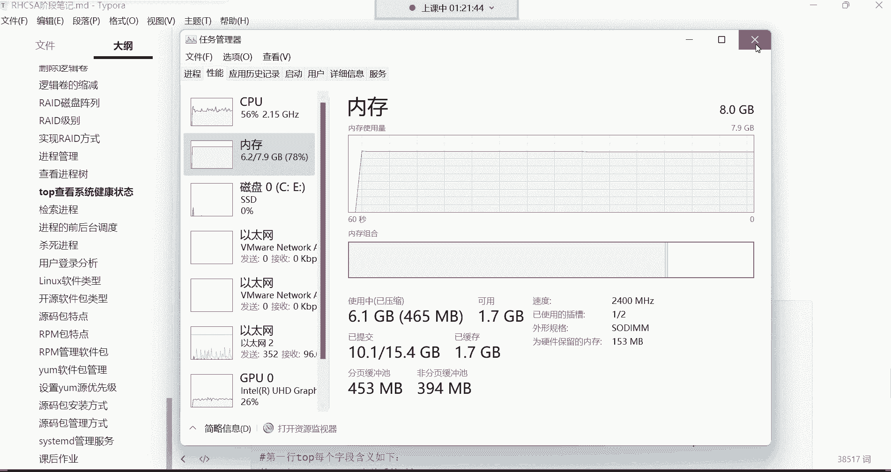
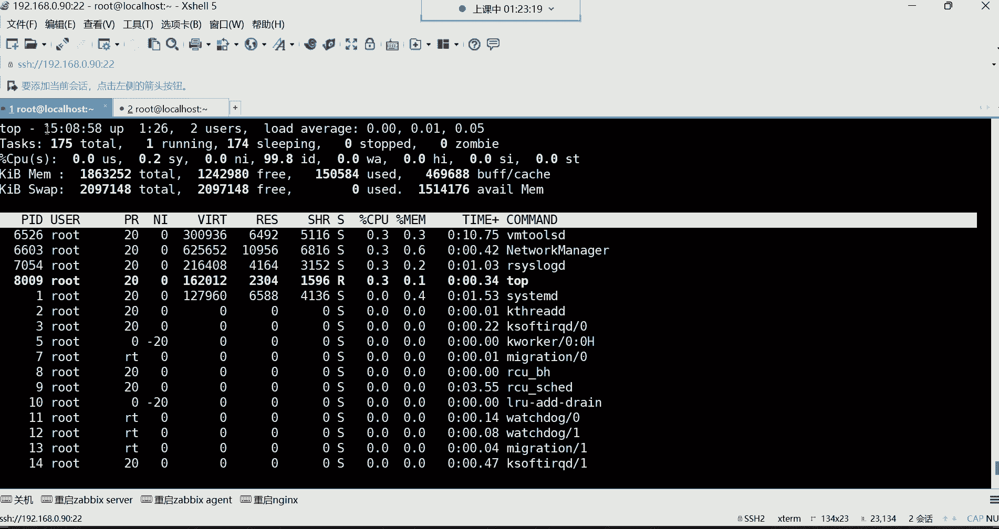
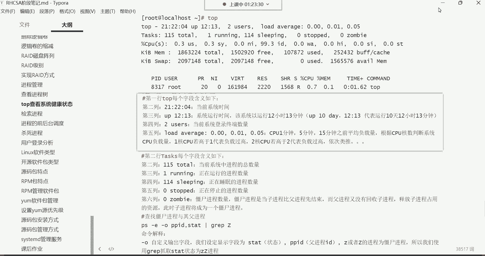
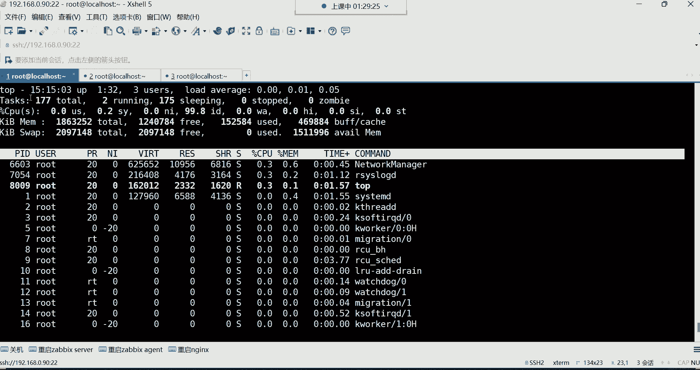
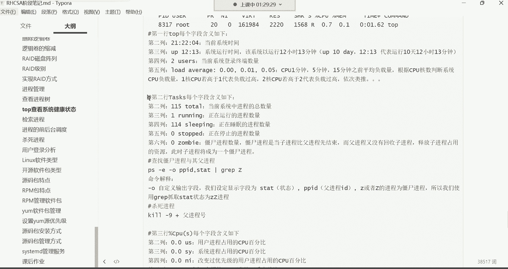
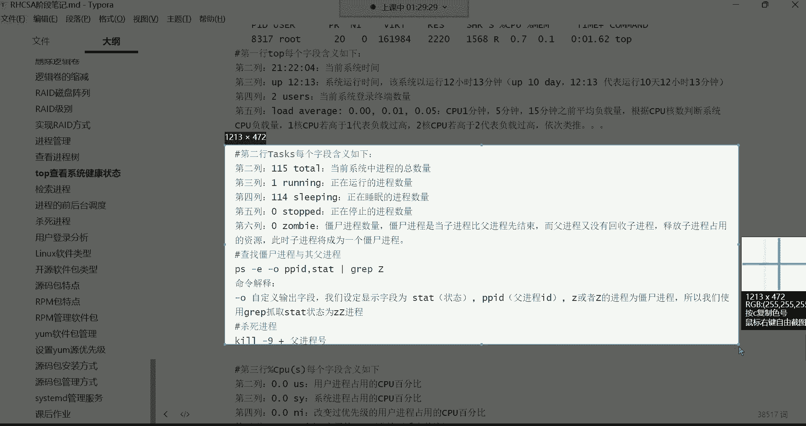
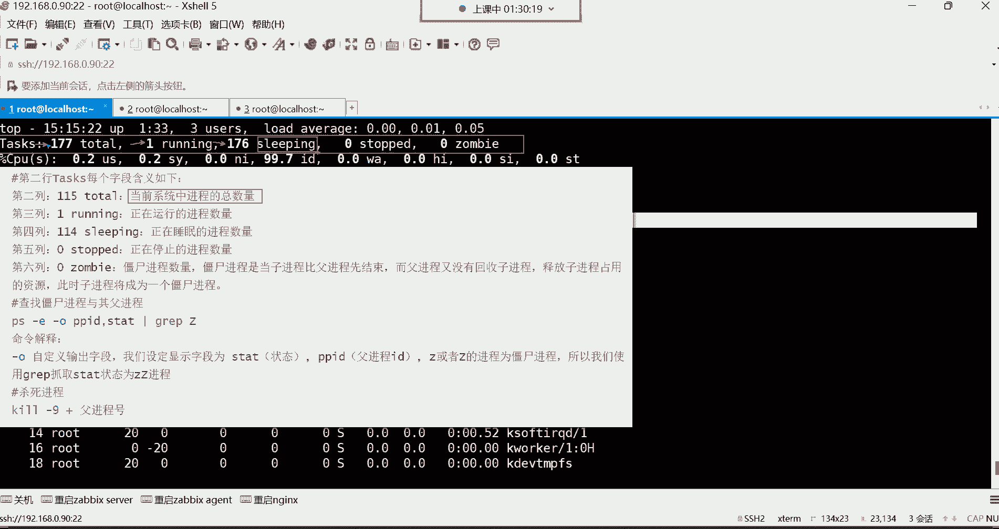
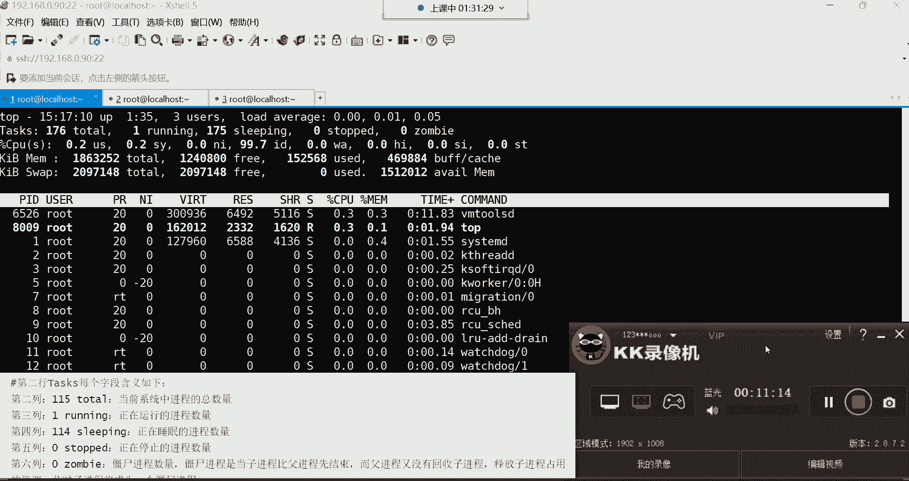

# Linux系统管理：P29：top命令详解与系统健康检查 🖥️

在本节课中，我们将学习如何使用 `top` 命令来动态监控系统的性能和运行状态。`top` 命令类似于 Windows 系统中的任务管理器，能够实时显示 CPU、内存、进程等关键信息，是系统运维中不可或缺的工具。

---

上一节我们介绍了静态查看进程的 `ps` 命令。本节中，我们来看看功能更强大的动态监控工具 `top`。

`top` 命令的主要功能是动态查看系统性能与运行状态。它比 `ps` 命令更强大，因为 `ps` 是静态的，而 `top` 可以实时更新数据，并且能显示更多系统层面的综合信息，如 CPU 负载、内存使用情况等。

在终端中直接输入 `top` 并回车，即可进入其动态监控界面。你会看到屏幕内容在不断刷新，这与执行一次就结束的 `ps` 命令完全不同。

---

## 第一行：系统概况信息

第一行显示了系统的概况信息，从左到右依次是：

*   **当前系统时间**：例如 `15:04:06`。
*   **系统运行时间**：`up 1:27` 表示系统已经运行了 1 小时 27 分钟。在生产环境中，常用天数表示，例如 `365 days, 4:20` 表示运行了 365 天 4 小时 20 分钟，长时间运行是服务器稳定的表现。
*   **当前登录终端数**：`2 users` 表示当前有 2 个终端会话登录到系统。注意，这是终端数量，不是用户数量。同一个用户打开多个终端，这个数字也会增加。
*   **系统平均负载**：`load average: 0.00, 0.00, 0.15`。这三个数值分别代表系统在过去 1 分钟、5 分钟和 15 分钟内的平均负载。**负载值的判断需要结合 CPU 核心数**。例如，对于 4 核 CPU：
    *   负载为 `1.0` 意味着平均有 1 个核心处于 100% 满负荷状态。
    *   负载为 `4.0` 意味着所有 4 个核心都处于满负荷，系统压力很大。
    *   负载为 `2.0` 则表示还有空闲的计算资源。

---

上一节我们了解了系统的整体负载情况。接下来，第二行将展示关于进程的摘要信息。

## 第二行：进程摘要

第二行 `Tasks:` 显示了系统中进程的总体状态：

*   **总进程数**：`177 total` 表示当前系统中共有 177 个进程。
*   **运行中的进程数**：`1 running` 表示有 1 个进程正在 CPU 上执行或等待执行。
*   **休眠中的进程数**：`176 sleeping` 表示有 176 个进程处于休眠（等待）状态。
*   **停止的进程数**：`0 stopped`。
*   **僵尸进程数**：`0 zombie`。僵尸进程是已结束但未被其父进程清理的进程，数量不为 0 时需要关注。

---

本节课中我们一起学习了 `top` 命令的基本界面和其前两行关键信息的含义。我们了解到 `top` 是一个强大的实时系统监控工具，第一行汇报了系统时间、运行时长、用户数和负载，第二行则总结了进程的整体状态。掌握这些信息的解读，是进行系统性能分析和故障排查的第一步。在接下来的课程中，我们将继续深入解读 `top` 命令输出中关于 CPU、内存等更详细的信息。