# Linux运维入门：P2：VMware安装CentOS系统 🖥️

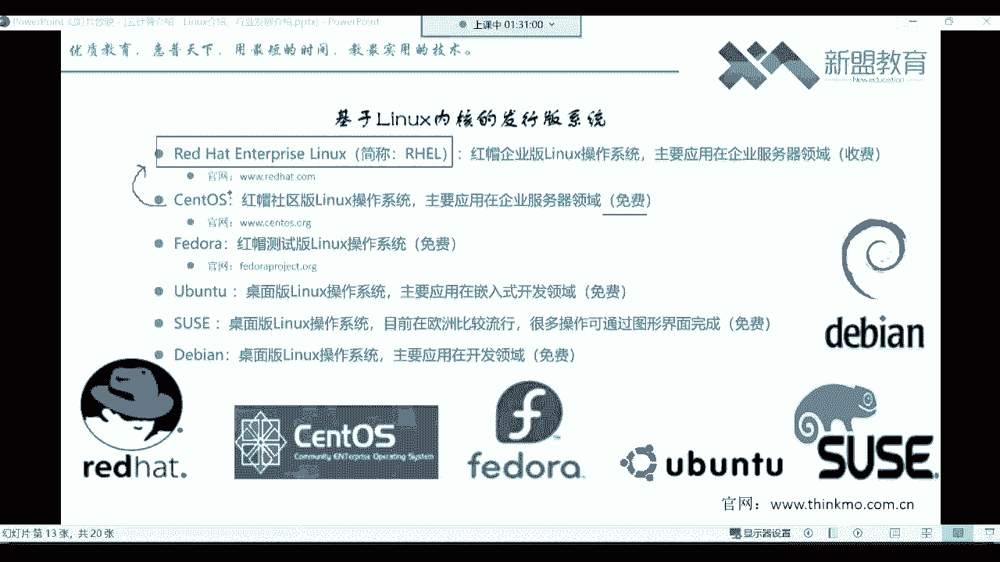

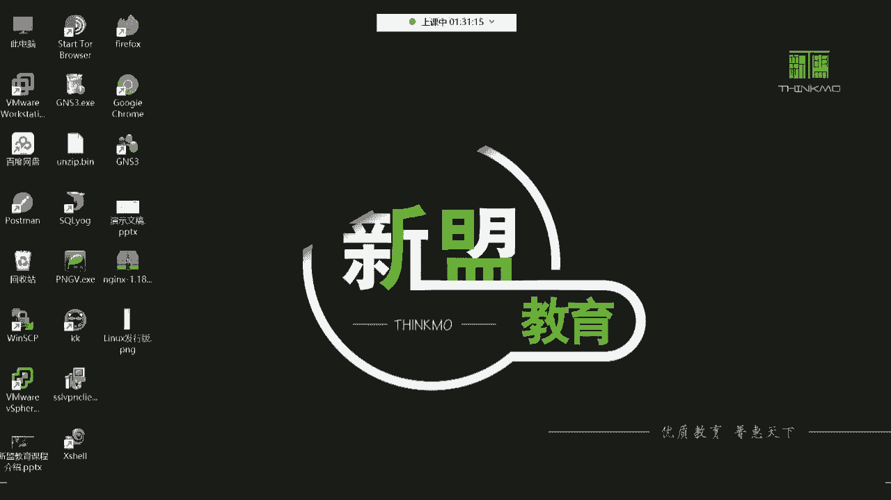

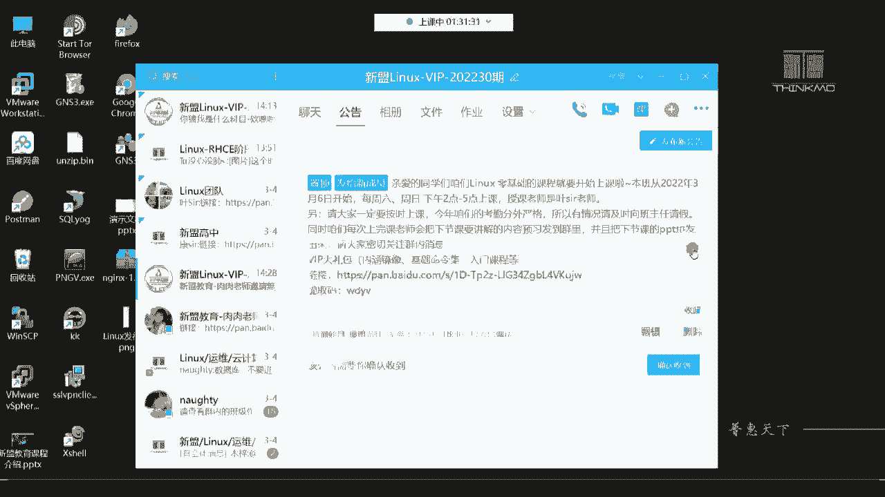

在本节课中，我们将学习如何在VMware虚拟机软件中安装CentOS操作系统。这是学习Linux运维的第一步，我们将从下载必要的软件和镜像开始，一步步完成虚拟机的创建和系统的安装。

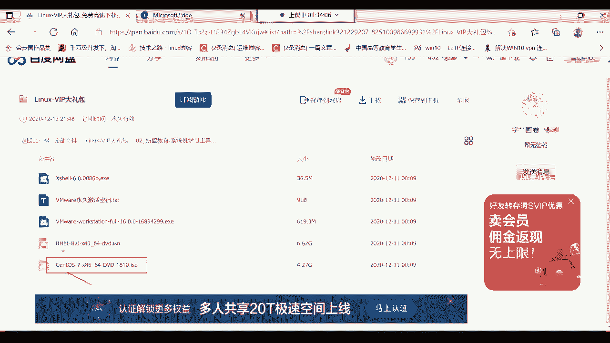

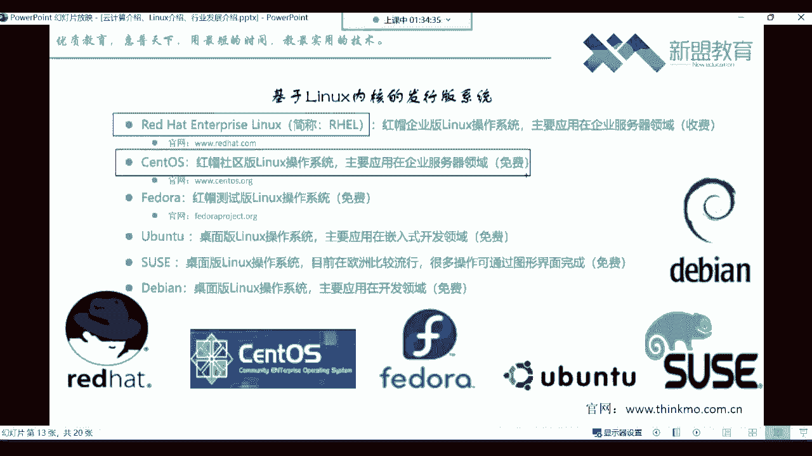

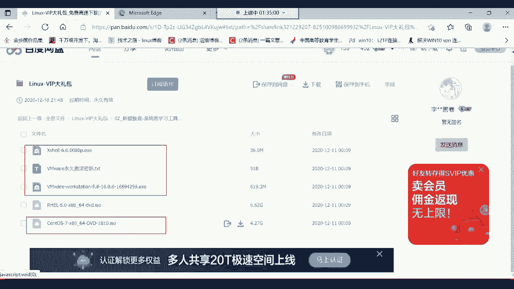

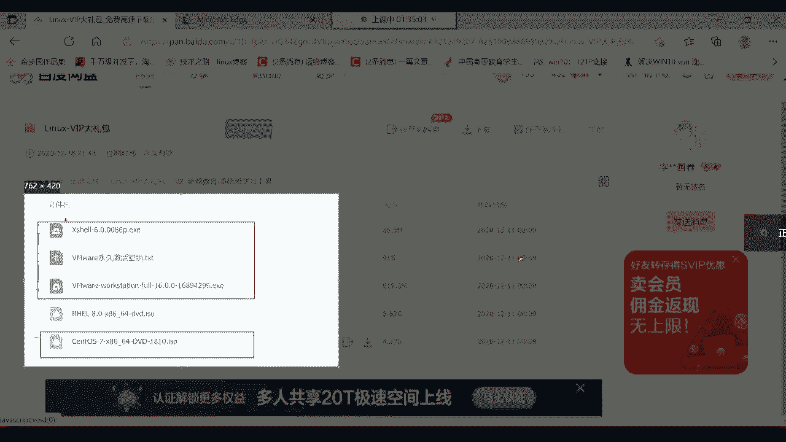

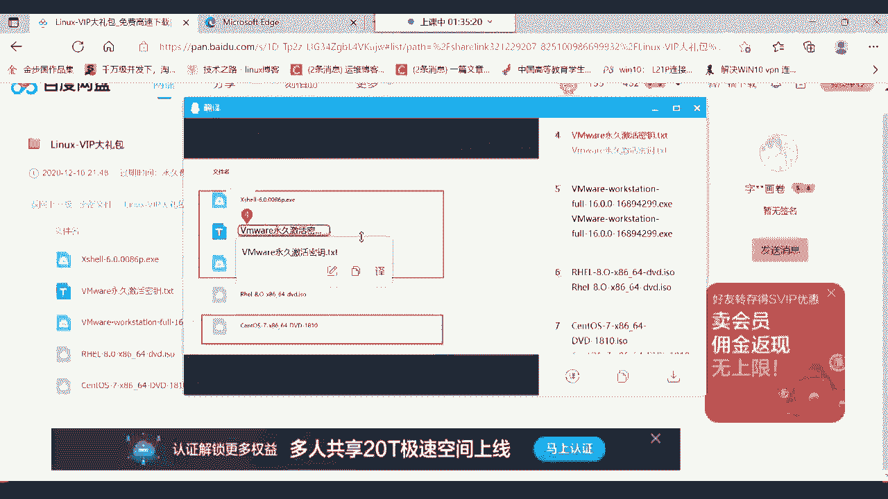

## 系统选择与准备

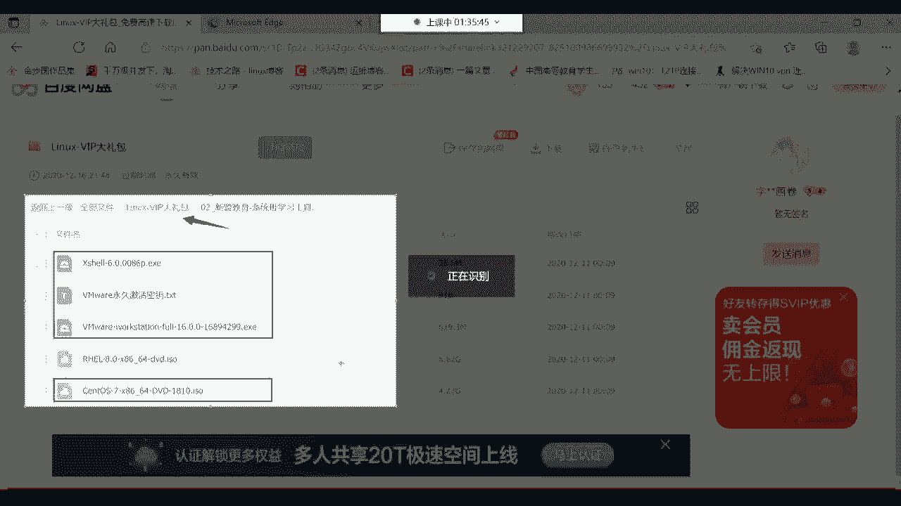

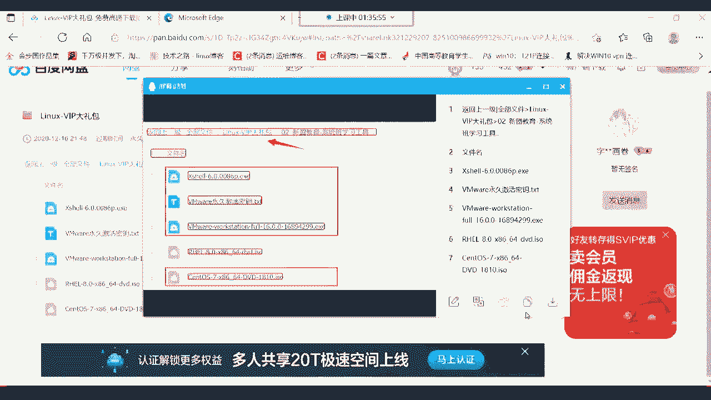

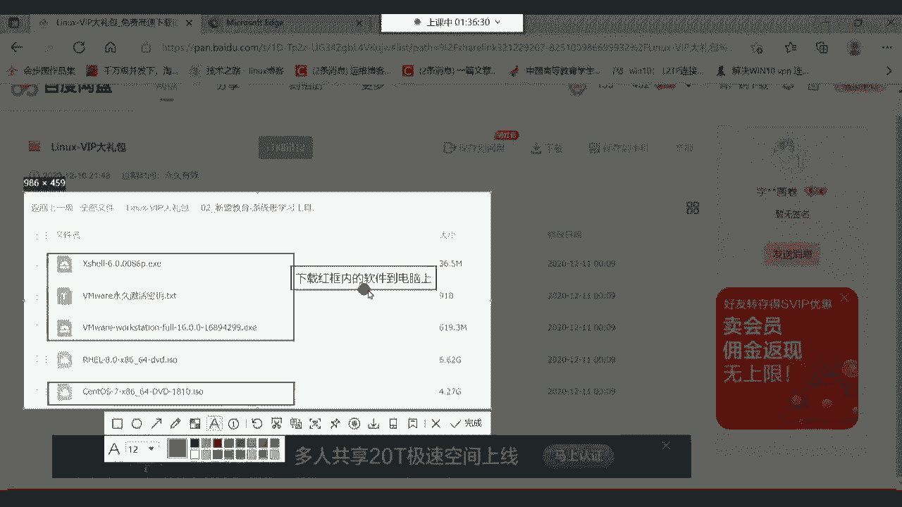

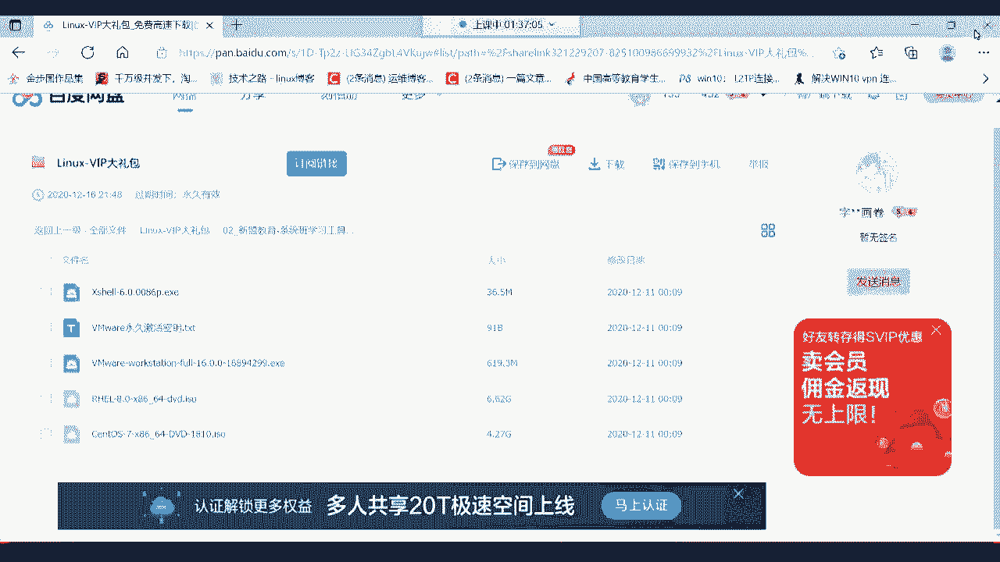

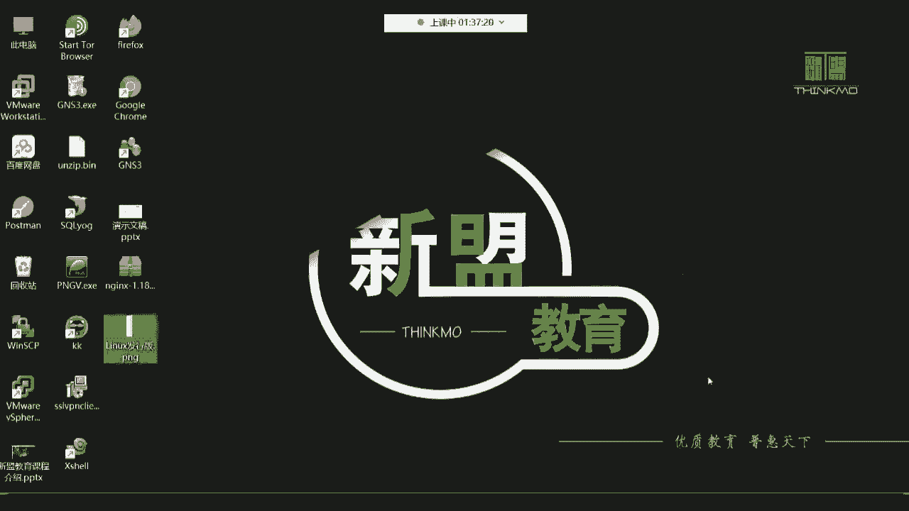

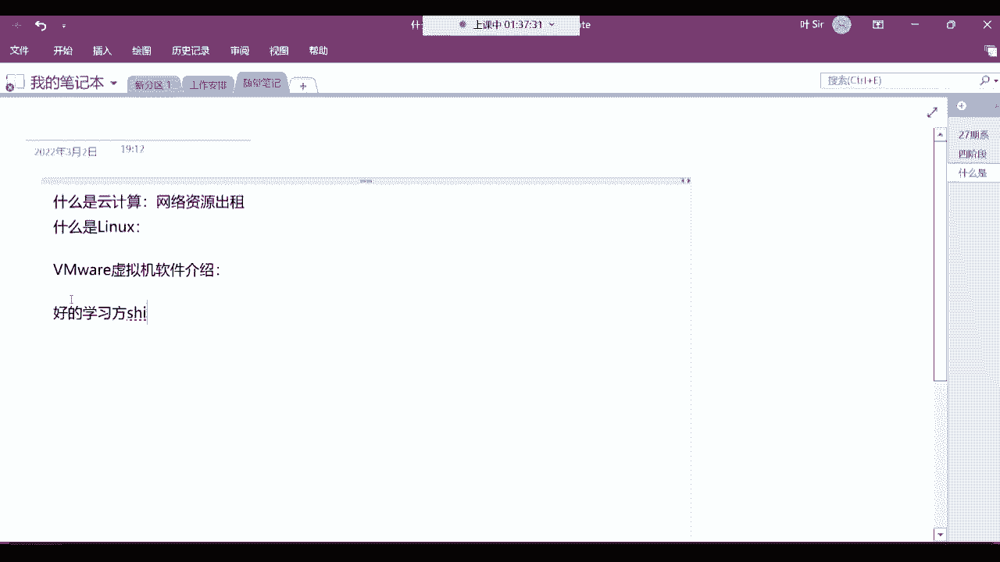

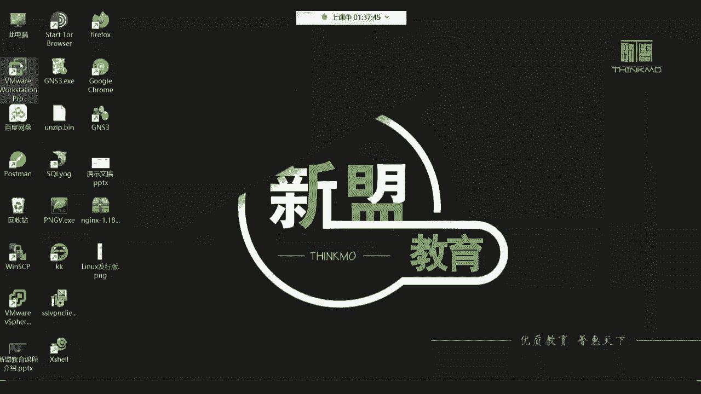

上一节我们介绍了Linux的基本概念，本节中我们来看看如何获取并安装一个具体的Linux发行版。我们将安装CentOS系统。在学习阶段，我们以CentOS为主。

CentOS与Red Hat Enterprise Linux（RHEL）的关系非常密切。你可以这样理解：CentOS是从RHEL克隆而来的。克隆意味着它们使用相同的代码基础。因此，这两个系统在命令和操作使用方面完全一样。你学习任何一个都可以。

我们选择学习CentOS，主要因为它是免费的，并且广泛应用于企业服务器领域。大部分企业倾向于使用免费且稳定的系统。

以下是安装前需要准备的内容，你需要从提供的“VIP大礼包”中下载这些资源到你的电脑上：

*   VMware虚拟机软件及其激活密钥。
*   Xshell远程连接工具（如果你没有其他连接工具）。
*   CentOS 7的系统镜像文件（例如 CentOS-7-x86_64-DVD-XXXX.iso）。建议使用7.x版本，因为CentOS 8已停止维护。

## 创建新的虚拟机

现在，我们开始使用VMware创建一台虚拟机。虚拟机软件的作用是为我们虚拟出一套完整的硬件平台（如CPU、内存、硬盘），以便在其上安装操作系统。

1.  双击打开VMware Workstation软件。
2.  点击“创建新的虚拟机”。
3.  在配置类型中，选择“典型”配置，然后点击“下一步”。
4.  在安装客户机操作系统时，选择“稍后安装操作系统”，然后点击“下一步”。
5.  选择客户机操作系统为“Linux”，版本选择“CentOS 7 64位”，然后点击“下一步”。
6.  为虚拟机命名（例如 `CentOS7-学习机`），并选择安装位置（建议放在空间充足的磁盘，如固态硬盘），然后点击“下一步”。
7.  指定磁盘容量，默认20GB即可。选择“将虚拟磁盘存储为单个文件”，然后点击“下一步”。
8.  在最后一步，点击“自定义硬件”以调整虚拟机配置。

## 自定义虚拟机硬件

在自定义硬件界面，我们可以调整虚拟机的资源分配。

*   **内存**：建议分配2048 MB（2GB）。如果你的物理机内存充足（16GB以上），可以分配更多以提升性能。
*   **处理器**：根据物理机CPU的核心数，为虚拟机分配适当的处理器数量（例如1个处理器，2个核心）。
*   **新CD/DVD**：选择“使用ISO映像文件”，并浏览指向你下载的CentOS 7镜像文件。
*   **网络适配器**：选择“NAT模式”。这种模式允许虚拟机通过物理机访问外网，且不要求虚拟机和物理机IP在同一网段，适合笔记本等网络环境会变化的场景。
*   **USB控制器、声卡、打印机**：这些设备通常用不到，可以选中后点击“移除”以节省资源。

配置完成后，点击“关闭”，然后点击“完成”。至此，一台空白虚拟机就创建好了。

## 安装CentOS系统

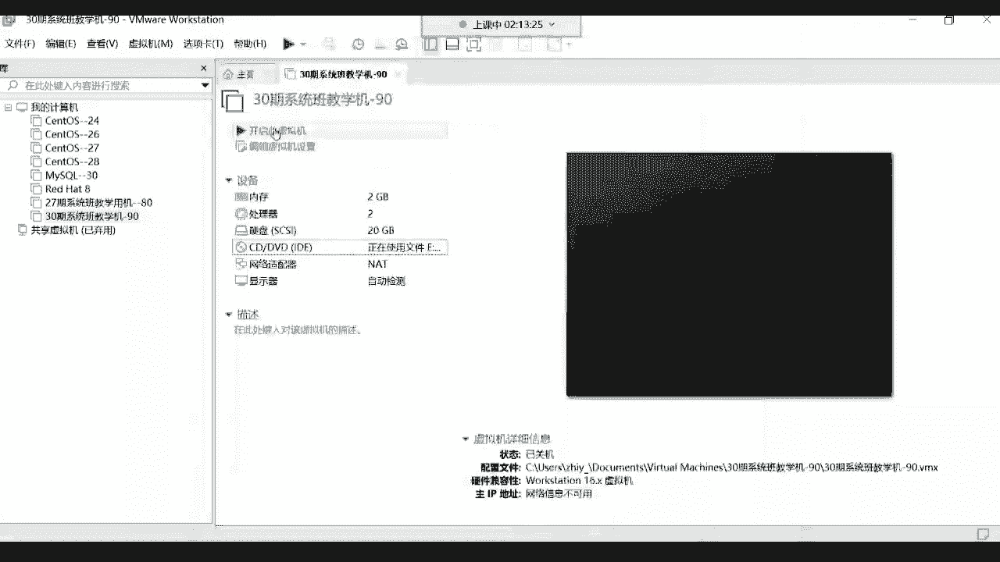

虚拟机创建完成后，我们就可以开始安装操作系统了。

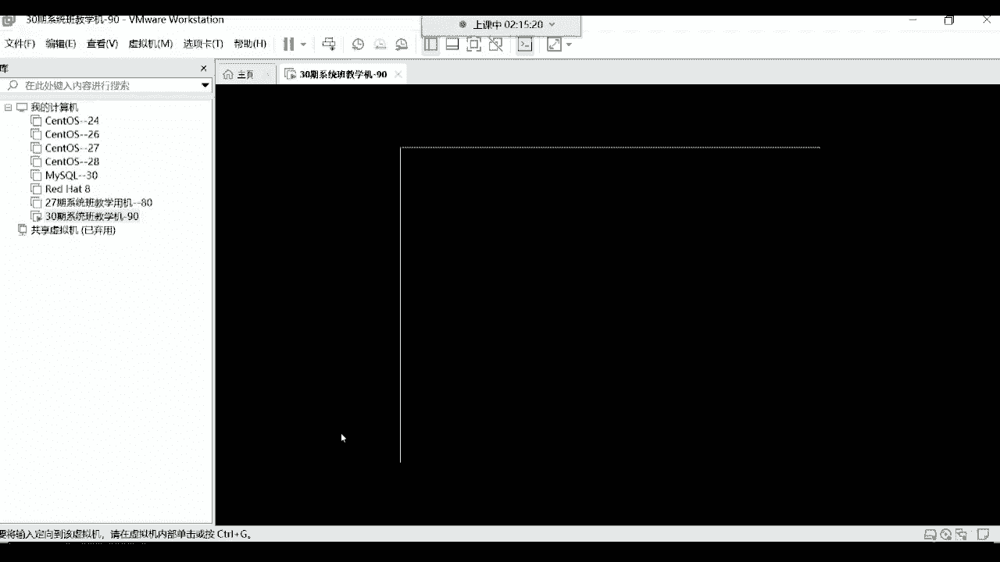

1.  选中新创建的虚拟机，点击“开启此虚拟机”。
2.  虚拟机启动后，会进入安装菜单。使用键盘上下键选择第一项“Install CentOS 7”，然后按回车键。
3.  安装程序启动后，首先选择安装过程中的显示语言，可以选择“中文-简体中文”，然后点击“继续”。
4.  进入安装信息摘要界面，需要进行以下关键配置：
    *   **软件选择**：点击进入。对于服务器和学习环境，建议选择“最小安装”，并勾选右侧的“兼容性程序库”和“开发工具”。这符合企业实际，且需要其他软件可以后续手动安装。
    *   **安装位置**：点击进入。确认在本地标准磁盘上（即我们创建的20GB虚拟硬盘），点击完成即可（使用自动分区方案）。
    *   **网络和主机名**：点击进入。首先在主机名处可以设置一个名称（如 `localhost`），然后点击“配置...”。
        *   在配置窗口中，选择“IPv4设置”选项卡。
        *   方法选择“手动”。
        *   点击“添加”按钮，填写以下网络信息（请根据你的实际网络环境调整）：
            *   **地址**：`192.168.0.90`
            *   **子网掩码**：`255.255.255.0` 或 `24`
            *   **网关**：`192.168.0.254`
            *   **DNS服务器**：`223.5.5.5` (阿里云DNS) 或 `8.8.8.8` (谷歌DNS)
        *   填写后点击“保存”。
    *   **ROOT密码**：点击进入。为系统的超级管理员root用户设置一个密码（如 `1`），点击完成。
    *   **创建用户**：可以点击进入，创建一个普通用户（如用户名 `test`，密码 `1`），点击完成。

5.  所有配置完成后，点击右下角的“开始安装”。系统将开始安装包。
6.  安装过程需要一些时间。安装完成后，点击“重启”按钮。

## 网络模式详解

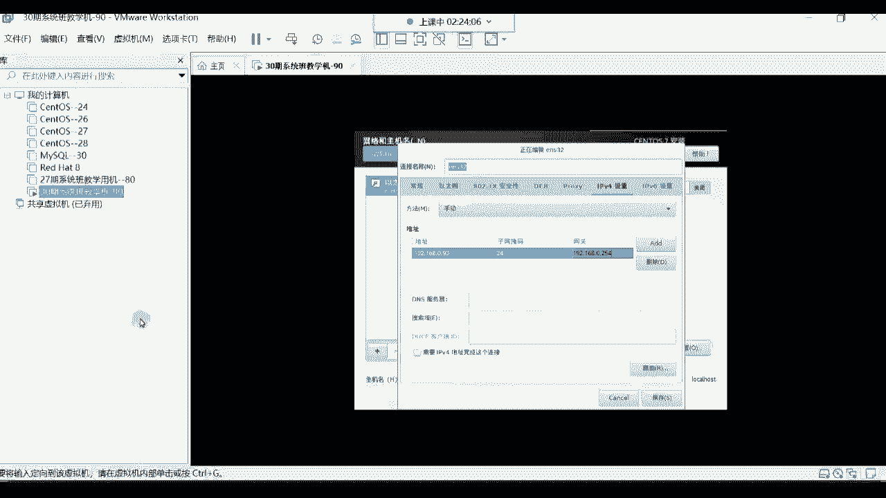

在配置虚拟机时，我们选择了NAT模式。这里简要解释一下VMware提供的三种主要网络连接模式：

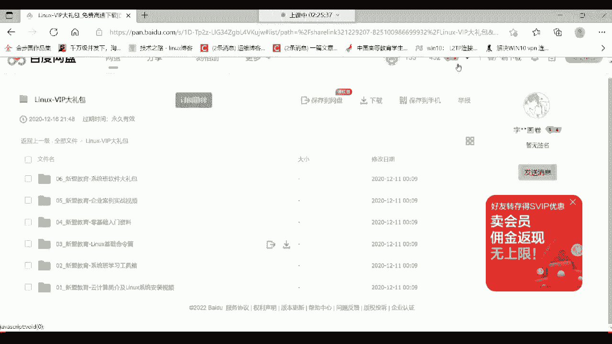

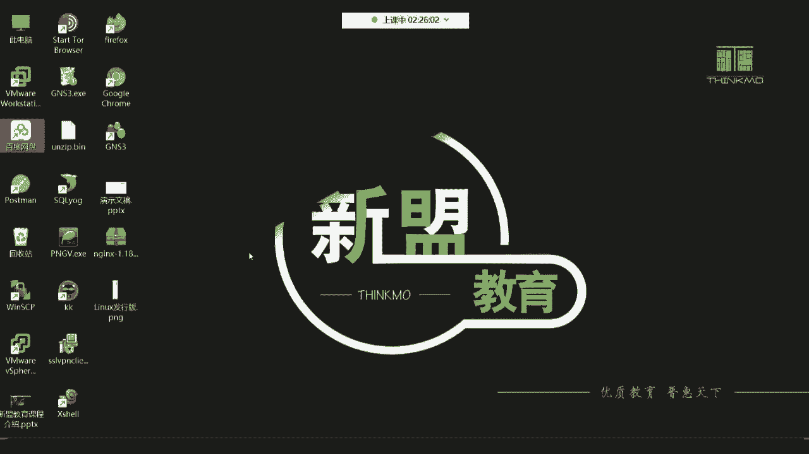

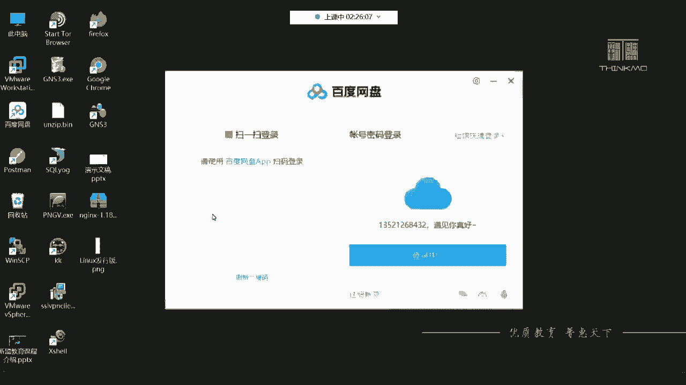

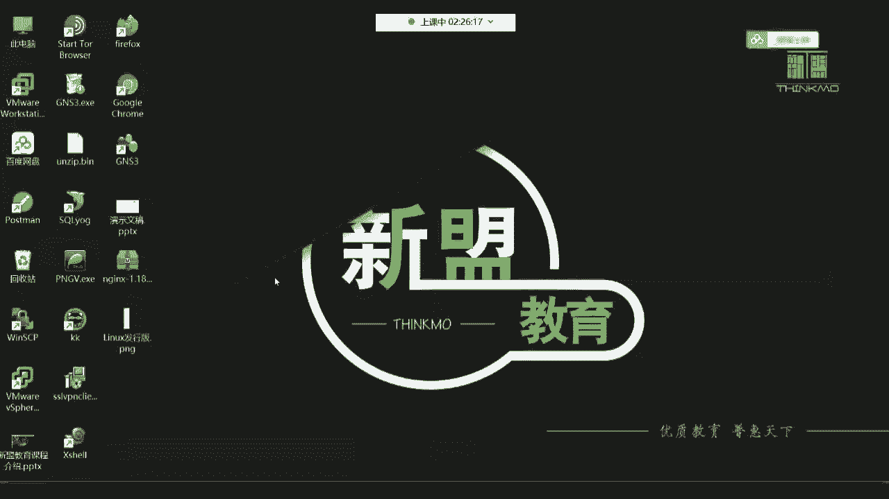

*   **桥接模式**：虚拟机的网卡直接连接到物理网络，就像一台独立的物理机。虚拟机和物理机需要在同一IP网段才能通信。适合台式机或网络环境固定的场景。
*   **NAT模式**：虚拟机通过物理机的IP地址共享上网。虚拟机会通过一个虚拟网卡（如VMnet8）与物理机通信，无需与物理机在同一IP网段。适合笔记本等网络环境会变化的场景。
*   **仅主机模式**：虚拟机只与物理机形成一个私有网络，无法访问外部互联网。适合需要完全隔离的网络测试环境。

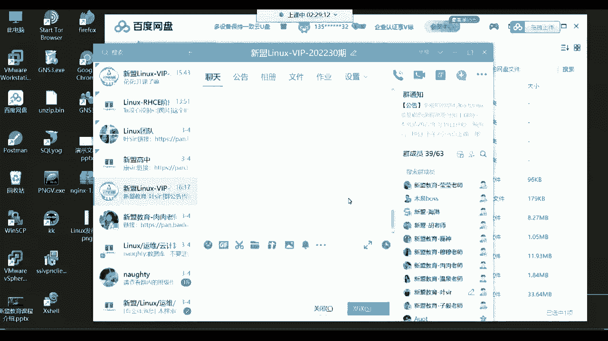

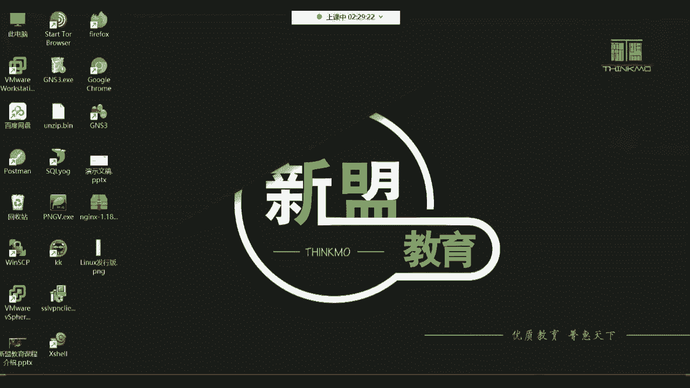

## 课程总结

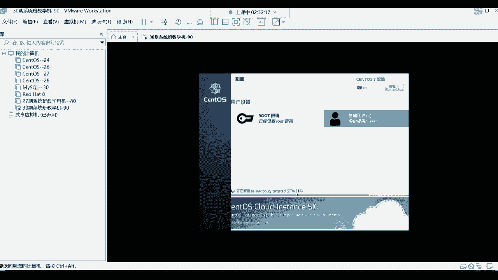

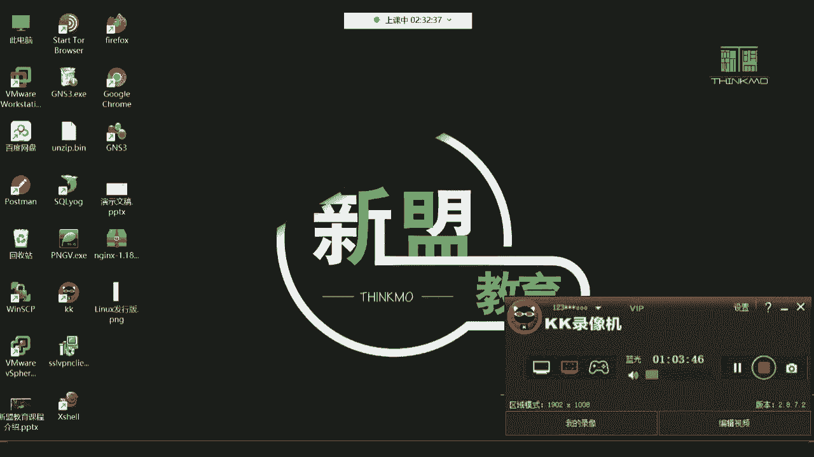

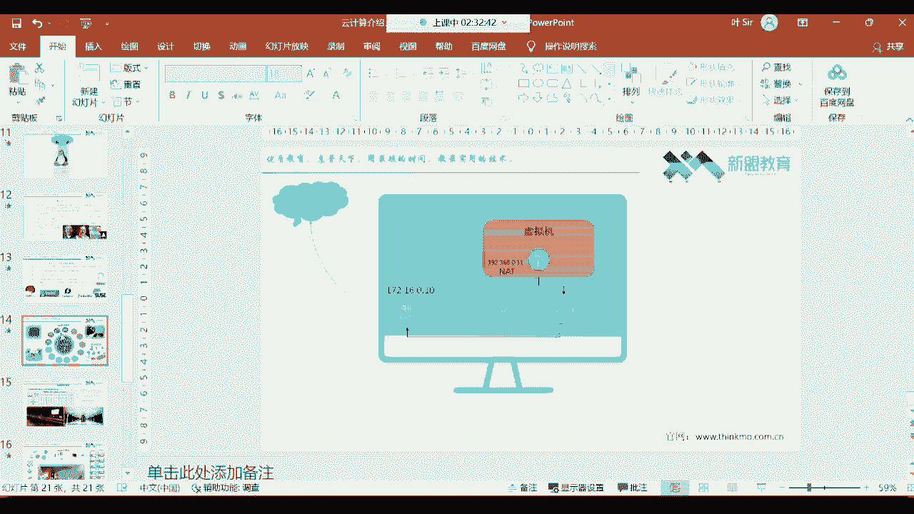

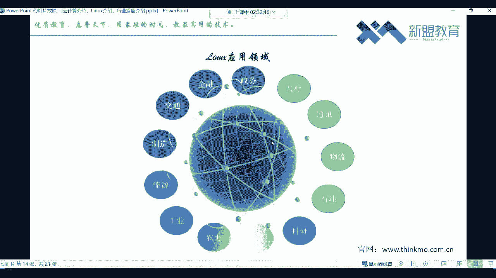

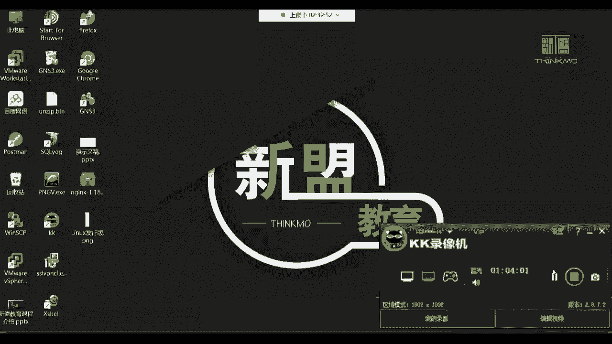

本节课中我们一起学习了如何为Linux学习搭建实验环境。我们首先准备了CentOS 7系统镜像和VMware软件，然后逐步创建并配置了一台虚拟机，最后完成了CentOS系统的最小化安装，并配置了网络和用户。这是后续所有Linux学习的基础，请确保你的实验环境已成功搭建。在接下来的课程中，我们将首次登录这个系统，并开始学习基本的Linux命令。