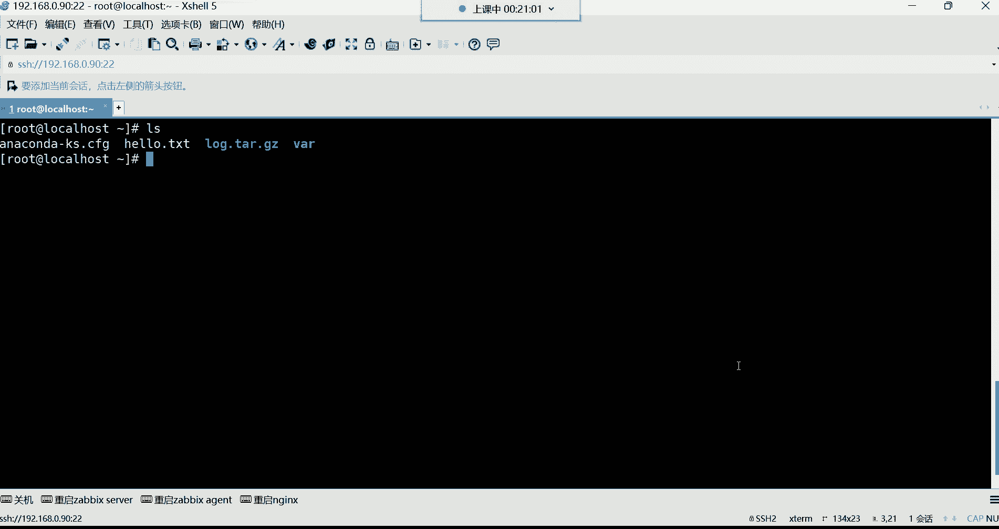
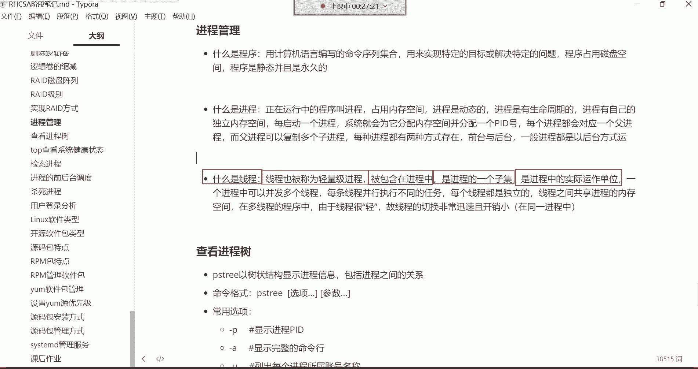

# 【小白入门 通俗易懂】全网最全RHCSA+RHCE教程，一周快速进阶Linux运维 - P30：红帽RHCSA-29.程序、进程、线程介绍、查看进程树 - 网工小程立志不加班 - BV1PN4y1R7uU

好我们开始上课吧，能听到我这边的声音吗，大家听到我这边声音的同学讨论区刷波，一开始我们本周的课程，我们又一周没有见了是吧，有些怀念大家呀，嗯我们上节课讲的内容，不知道大家复习的如何了呀。

把应该掌握的技术，你最起码也得给它练熟练了哈，有些需要了解的呢，咱们说确实是由于这个个人的这个精力啊，或者说学习能力有限啊，这个只需要知道有那么个东西就可以，但是呢一个经常用的命令啊。

这个大家一定要勤练哈，你这个东西啊学习这东西就得什么呢，就得一定要多实践，你不能说这个光靠听啊，光靠光靠这个看，你就觉得啊我已经会了，但是呢你发现你记不住，所以有句话叫什么呢。

有句话呀叫做学过它不等于掌握，所以对于大家学习来讲呢，你千万不要觉得你在课上听一遍，你会了以后，你就觉得这东西已经是你的了啊，这个是最大的一种错误哈，所以要多敲哈，那我们本周呢争取两天啊，两天的课程。

把这些呢都给它结束掉，然后整个IHCC的内容我们就结束了，OK然后我们先来给大家来一段了解的内容啊，不能说是从哪开始呢，可以说是从进程管理，一直到一直到top这个位置的，一直到top这个位置啊。

我们都是一些理论性的东西啊，就是几乎没有什么实操，实操非常的少哈，我先来带领带领大家了解一下在计算机里边，什么叫做应用程序，还有什么叫做进程，什么叫做线程，其实对于这些概念性的东西啊。

我们来给大家说说先说什么叫程序哈，那用计算机语言编写的命令序列的集合，用来实现特定的目标或解决特定的问题，那这句话什么意思呢，其实啊什么叫程序啊。

就是我们拿windows来讲哈，你从软件商店你去下载一款软件。

比如说我要去下载一个聊天工具啊，对其实就是那个app，就那个软件，说白了就是软件哈，软件你在没有下载的时候，它就是软件，你把这个东西下载到你电脑以后啊，它就变成你电脑里的那个应用程序了。

能理解吧啊所以什么叫应用程序，比如我要下载一个玩陌陌这种这个聊天工具啊，好了，这时候我下载下载完了之后呢，那下载完了之后，我们就直接变成电脑里的程序了。

那以后我就可以使用它了，对我说这个是这个说成大白话的话。

就是把软件下载到电脑里边，就是程序，但是这个程序它确实，人家是计算机语言编写的啊，大部分的软件都是用C语言，C加加这些语言编写出来的，然后可以帮我们完成什么呢，可以帮我们完成一些目标，那没错。

他确实帮你完成目标了，你比如说你想去聊天，那他确实可以帮你实现聊天的功能，你想去上网，他也能够帮你实现上网的功能，没错吧啊确实啊，其实就是软件哈，帮我们来实现功能的那程序，它占用的是磁盘空间。

程序是静态，并且是永久的呃，他这个东西你下载到你电脑里边，它占的是你的硬盘里的存储空间啊，但是呢数据的存储啊，它还有一种什么呢，叫做内存，没错吧。

那什么时候才会占用内存空间呢，就是当它运行的时候，我们在这个自己的任务管理器里边，大家看一下哈，我现在在任务管理器里面，可以看到我电脑里面有哪些进程，看到了吗，这是不是叫进程啊，有录像机的。

有酷狗音乐的，有笔记软件的，虚拟机的，看到了吗，唉这些就叫做进程了，那进程它占用的是内存的空间，看到了吗啊它占的是内存空间哈，而程序呢在没有运行之前，就这些东西在没有运行之前，他是不会占用内存空间的。

所以这就是呃为什么说这程序它是静态的啊，它不动啊，它不动哈哈，那什么时候它会动呢，哎就是它一运行它就会动了啊，占用内存的时候。

它就运行起来它就变成动态的了啊，就是不是固定的了一种状态好，那这个进程的话呢是正在运行中的程序，我们就管它叫进程了，就软件一运行就变成进程，那他这样的是内存空间，进程就是动态的，因为它可不是固定的哈。

它是一直在动，那进程是有生命周期的，那这个生命周期啊，我先给大家说说近啊，什么叫生命周期呢，我们就拿了S我们系统里面啊。

你看我们说这个SS它本身是一条命令吧，我一回车在这一瞬间它也会产生一个进程，能理解吗，就这一瞬间它也会产生一个进程，只不过我们看不到，为什么看不到呢，因为这一瞬间这个进程它结束以后呢，它就消失了。

对于这种命令哈，从执行到结束速度非常快吧，啊所以这个进程你几乎是捕捉不到，但是他确实是会给你生成一个进程，所以这个进程呢有的是有生命周期的，这个生命周期它会自己结束啊，他就是你执行的时候，它会生存进程。

然后到时候呢执行完毕以后呢，他自己就把自己的生命周期啊就给结束掉了，那你说那有的进程是这个生命周期。

得需要我们用户自己去手动结束你，比如说就像我电脑里面的这些进程，比如我的KK录像机，那它的进程，它的生命周期就取决于说我什么时候给它关掉，那他就结束了，能理解吧，而有的进程呢他自己就能够结束。

所以我们说像前面给大家讲，这个系统里面有有一些路径，哪个路径呢，就像什么PLC这个目录下面啊，根下的PLC这个目录下边的数据，一般就是占用的是内存里的空间，那在这个里边，有些数据你发现你根本就捕捉不到。

是因为啊它在运行的时候，它会给你生成一个进程，但是结束以后呢，这它就消失了哈，所以你是捕捉不到的哈，所以进城这种东西飘忽不定。

是这个时有时无的啊，然后这就是进程，那每启动一个进程呢，首先啊进程是有自己独立的内存空间哈，进程有自己独立的内存空间，每启动一个进程，系统就会为它分配这个内存空间，并且分配一个pad号。

这个在windows里面看的比较真切一些，在这里边啊，我们看详细信息，在详细信息里边呢，这里边有进程的名称，看到了吧，当然这就是名称，然后以此类推，这里边都有什么呢，还有一个叫做PID号。

这个PID号啊，就像，人的身份证号一样，就这个进程它在系统里面一运行，那系统想识别它通过什么呢，得通过他的id号去识别它，这个id号系统自动分配的，然后到时候呢，系统就会通过这个id号去识别这个进程好。

这是进程的一个身份的一个编号，那下边每一个进程都会对应一个负进程，附近程可以复制多个子进程，这个父子关系啊，其实在这里面也可以看得清楚哈，端口的IU号不是，它不是端口的IU号，它是进程的id号。

它不是端口号，不是哈，端口号是端口号，id号是id号，不是一个东西，我们来看一下，就是咱们说这个进程这个东西呢，每个进程都会对应一个附近程，而附近程可以复制多个子进程。

在这里边我起一个火狐浏览器哈，在里边我起个火狐浏览器。

大家就能够看得出来。

差点睡过头是吧，来看哈，我现在起个火狐浏览器，我直接从任务管理器里面，这这个位置你们看到了吗，现在火狐浏览器起了多少个进程啊，起了非常多的进程，没错吧，好那这里边其中有一个啊。

当然他这个进程呢你只要是结束其中某一个，那可能说所有的进程全都跟着结束了，你比如我结束任务，结束进程，诶再结束哈，结束任务再结束，几个了，结束任务，你发现这怎么结束不了呢，你看结束一个又生成一个是吧啊。

怎么办，结束进程数，嘿嘿嘿，结束任务看了吗，在结束哈，结束任务，我看看我能不能给它结束掉，再来一个结束任务，诶结束任务好，应该没了，还有一个是吧，结束任务啊。

没了，看了吗，他这个就是什么呢，就是这个进程之间的关系，就是如果我刚刚能够找到它的附近程，我把它附近程一结束，所有的紫禁城其实就全都没了，但是我不知道哪个是他的附近程，在这里边看不出来哈，看不出来。

因为我我不是很清楚这个火狐浏览器。

它的一些具体的这个这个是相关的内容，所以一般每个进程呢都会对应有一个附近城，你可以把他列成是他的父亲，然后这个父亲的下边有很多个儿子，那每种进程都有两种方式存在，一个是前台，一个是后台。

但是大多数的进程都在后台运行，就像我们这个windows系统一样，大家也可以看得到，就是很多系统的进程，你看哈很多呢系统的进程就下面这些，它都是在哪运行，在后台运行，在后台哈，看到吗。

大多数都在后台运行。

那包括我们这个系统LINUX来讲，你发现这进程其实大多数都在后台，大多数都在后台在运行着。

因为你在前台，你根本就看不到他，哈哈好，那这是所谓的进程，你就记住哈啊后台都是服务吗，也不能说都是服务啊，因为这个它在后台运行的话呢，有的可能是反正都是可以帮我们提供功能的吧，你这么去理解啊。

那下面呢我们再来给大家讲这县城这个进程啊，大家不要把它理解的太复杂，这种东西没有没有那么复杂，你就知道程序一运行就变成进程了，进程是占用内存空间的，然后每个进程是有自己独立的内存空间的。

那进程呢是有自己的生命周期的，有的进程自己会结束自己的生命周期，有的进程呢是需要我们自己手动去，结束它的生命周期，然后这个每个进程都有一个自己的id号，好就可以了，OK那下面我们再来给大家说说这个县城。

其实县城啊也被称为叫轻量级进程，在LINUX系统里面压根也没有，这个其实没有这现成这一说，在计算机里面也没有现成这一说啊，但是呢呃一般搞开发的时候，这个会会有这个线程这个概念。

其实它它准确来讲叫做轻量级的进程，它是被包含在进程里边的，在进程里他是进城里边的一个子集，然后是进程中实际运作的单元。

那一个进程可以并发多个线程，这个我们怎么去理解这个东西呢。

县城这个东西啊，嗯如果说我们把这个，我相信你们肯定在计算机里面听过一个词汇，什么词汇呢，就是这个比如说这个在买CPU的时候，这CPU它分几何几线程是吧，比如我这个CPU是四核八线程的。

八核16线程的应该都听过吧，我们就拿这个CPU来说，比如我这个CPU就是那个四核八线程四核，然后呢八线程，四核八线程好，那你说我应该怎么理解这个四核八线程呢，好那这一颗CPU，给你们画一图。

这一颗CPU啊，这个四个核你就理解成是有四颗计算的单元，四颗四颗计算的核心，就这个核心就是我们所说的这个计算单元，有四个啊，然后那这个四核八线程什么意思呢，四核八线程，那这个县城呢。

他首先啊是我们说是真正干活的啊，我们就可以把这这四个盒是吧，这是一个和好一个核，一个核总共是四个核心哈，四个核心好，那在每个核心里边，它这个线程怎么分呢，啊，你可以把它理解成是每个核心里面有两个线程。

2468，这样呢就平均分开了，我让它变大一些哈，变大一些，这不行啊，这不行啊，这太low了，行那就这样吧，这字体调小点就行，可以这么理解哈，一个一个和呃，这个每个核心里边有两个计算单元，两个计算单元。

计算单元，好四个核心，每一个和弦里面有两个计算单元，那这个计算单元啊，其实就是我们所说的这个线程啊，这个两个计算单元，就我们说的这个两个线程吧，我们把它列成二线程好吧，二线程这样比较好理解一些。

这一核心是一个计算单元的核心是计算单元哈，嗯一计算单元，然后两个线程，计算单元，好那我怎么理解这个线程，它到底是能够起到什么作用呢，我们可以把这个CPU比喻成一个大工厂，就听哈比喻成一个大工厂。

那我们可以干嘛呢，我可以把这个工厂里面的这个，我们可以把CPU的核心比喻成什么呢，比喻成这个每个生产车间，生产的车间，四个车间，啊有四个车间，这是一个工厂，把CPU比喻成一个大工厂。

然后在这个工厂里面有四个生产车间好，那每个生产车间里边，有几个真正干活的员工呢，啊两个两个哈，每个车间里边都有两个真正干活的员工，你就这么去理解就可以了，诶嘿这应该就不难理解什么叫线程了吧。

所以这个对于县城来讲呢，它也被称之为叫轻量级进程，被包含在进程里面，是进程的一个子集，你就记住后面那句话，这个嗯诶跑哪儿去了，那句话，啊这哈就记这句话吧，是进程中实际运作的单位，这话什么意思呢。

是实际运作的单位，就说白了是真正干活的，真正干活的单位想处理数据，最终谁去真正去处理这个数据，谁去计算这个数据呢，啊是线程去计算，还有一些应用程序也一样，应用程序比如说像网站一些应用的话。

他想要去接收请求，那谁去真正接受用户请求，而是县城真正干活的，能理解吧，啊是这么回事，所以对县城来讲呢，你就这个这么理解就可以，现成在计算机里面就是真正干活的一个什么呢，一个实体啊。

一个实体真正干活的就可以了，好下边呢这些太官方了哈，太官方了，然后就没有必要去读它了哈，没有必要去读他，其实对于运维来讲呢，你对线程的了解不需要去了解太深，你又不想搞开发，搞开发，那你对于现成的知识嗯。

对你如果说对于官方的支持，你就一定要啊，不能说你要对于对这种什么进程啊，线程啊，你要得仔细研究它啊，但是对于我们运维来讲，只需要了解就行，你就知道这个进程是真正干活的，实际运作的就可以了，实际运作的好。

那下面我们再来说说，怎么在这个LINUX下面查看这个进程数，那查看进程数的话呢，有很多种方式，第一种哈不说人话对哈，官方就不说人话，撇除这是以树状的结构显示进程的信息，包括进程之间的一个关系。

这命令格式呢也比较简单，看一下啊。

所以说这人呐你一旦就是阅读这种官方文档，阅读多了以后呢，你发现其实你说话也倍儿也不是官方，就别人听你说话，感觉也有些不太好理解了，能理解吗，那撇子脆直接敲哈，直接敲啊，没有这条命令。

我们系统里面没有装是吧，搜索一下哈，啊没有搜索到啊，我的呃，我的镜像好像掉了，我看一眼哈，etc要么点report，点D有1list，等一下哈，等一下，这里边，我们今天啊呃刚开始这节课的话。

可能就是会有很多的这个理论，但是没有办法，这个理论得讲，这么慢呢，理论好啊，还还喜欢理论是吧啊，有了我再搜索一下，搜索一下哈，你那儿没找到是吗，不可能哈，应该有这个工具。

只要我们现在还没有学习这个看了吗，这不出来了吗，你没找到，你看你的仓库是不是不是这个软件包，没有什么呢，没有这个你的网络问题，可能说他这个没有办法连到仓库，帮你去搜，把这包安装就可以了，看到了吗。

就这包哈，就ym guy in top，给bk安装上，安装好之后呢，再敲这条命令，PST回车好，这个进程数就出来了，看到了吗，这就是一个数啊，这一个树，那树的根在哪呢，树的根儿在这呢，这就是大数的根啊。

下面一个一个的小分叉，看到吗，这每一个分叉就是一个进程，每一个分叉呢它就是一个进程，好了吧，然后这个呢它这个树状结构，可能说你看这master这个进程下边还有什么呢，还有两个子进程。

这就是我们说叫父子关系，看到了吗，叫父子关系哈，那这些进程都是什么进程啊，这都是系统在运行的时候一些必要的进程，你比如像这个SSH这个进程，这可能说大家还是比较熟悉的这个进程啊，为什么呢。

因为这个你想想，我们之所以能够使用这种远程连接工具，我这样SSH连接到我们的这个系统的话，其实就是因为我们服务器里面，起了这个进程了啊，就是SHD这个服务，它在运行着这个进程。

可以让我们远程登陆这个机器能列吧，那还有其他的呃，像什么网络的进程，看到了吗啊，像这种网络的network manager这种，这样我们可以去访问互联网，让我们的机器呢去比如说拥有这个网络啊。

还有这个像其他的就没有必要去认识它了，因为大部分都是系统的进程，还包括防火墙，看到了吗，这firework这是防火墙的进程，然后还有这个crud，这是计划任务的进程。

还有哪些呢啊还有像这些这个这个哈什么system journal，这个这是日志的进程，这日志的进程非常多，看到吗，还有内核的进程看到吗，这是内核的进程，所以这些进程呢我们如果想看的话。

可以通过PS脆这条命令呢，把整个进程数啊给列出来啊，然后这个数字你看这个六后面有个星，是什么意思呢，这个六下面那个星就是代表县城啊，就是我们所说的叫轻量级的进程，也就是说在这个进程下边。

有六个轻量级的进程啊，就线程你就这么去理解一下这个六星，这个星就代表县城的意思啊，六就代表六个，那二星就两个线程在这个进，在这个进程下面有两个县城，那我们这个时候比较少啊，数量你看这一个小树状结构。

这才起了多少进程，那是因为我们在安装系统的时候啊，我们的系统是最小化安装的，所以他这个就，整体就是没有多少进程，没有多少哈，然后我想看每个进程的PID，你就可以在后面加一个P杠。

P杠P是显示每个进程的id号回车啊，那这时候大家可以看到，你看这下边是不是有六个那个线程啊，1234566个线程，如果你不用PID号的话，他这个位置就是星，像我们前面那种这位置就是这个告诉你是六星。

是不是啊，六星，那你如果说加杠P以后呢，他会把每一个进程，或者说现成的pa代号都给你列出来了，好了吗，但是在这个里边，你看我们在windows里面没有办法看它的树状结构吧，但是在LINUX里面。

我们是不是可以以树状的结构，看哪个是它的附近程啊，因为晋城这东西他父子关系嘛，这是他的父亲，这是他的儿子，他六个儿子，这六个儿子如果说有一天我想给他结束掉，怎么办，你把他的老子一结束。

那这六个儿子就也就跟着老子一起走了啊，他是这么回事儿，就是看每个进程的id号，然后这里面呢我给大家说说这个C4，TMD这个进程，这个进程呢这个大家一定要认识他，它是所有进程的一个什么呢，叫做天赋进程。

天赋进程，如果说我们把这个天赋进程给结束掉，什么时候才会结束呢，就是系统关机的时候，这个天赋进程就结束了，因为你想想我们系统一开机，系统首先加载的就是这个天赋进程，然后再用这个天赋进程帮我们去。

比如说去生成网络的进程，这个还有什么SSHD这些进程等等等等，都是由它控制的，所以大家可以把它理解成什么呢，我们说叫做内核的一个管家啊，通过这个管家帮我们去控制整个系统的进程啊。

所以这个SYSTEMD叫天赋进程，然后他的id号呢是1ID号，是一其他的id号呢一般都是系统随机起的啊，但是这不能说系统随机启示某些程序，它自己拥有自己的，这个其实大多数都是系统随机分配吧。

啊这这不像端口，这进程号它不像端口啊，就对于这种东西都是系统随机分配啊，不是固定的，好这是怎么查看进程的PID，然后下面杠A叫显示完整的命令行，这时候呢我们再加一个A这个A的话呢。

这时候你发现它这个显示的好像不太一样了，是吧，好像从这开始哈，什么叫完整的命令行呢，啊在这里面可以看到就是这个进程是看一看哈，看能不能找一个更好的例子，好，如果说我们那个你看，比如说我在这个在这个位置。

你看PS脆在这个位置上，什么叫完整的命令行呢，这个可能说在这看不是很清楚，我们结合杠用这个选项吧，叫列出每个进程所属的账号名称，这样呃再加个U，加个U哈，这样好，这样看自己看的不是很清晰啊，再开一终端。

或者我再用一个账号登录吧，用那个九零啊，用用test这个账号登录一下，那比如说这个test，咱说这个它显示完整的命令行，它可以显示其他用户的完整命令行，那这玩儿怎么玩儿呢。

你比如说这个test的用户都是同一个机器里的哈，比如我现在在自己的家目录，我在编辑一个文件，编辑一个test点TT啊，v i test点TT编辑的文件哈，好那编辑的文件，这个时候我可以这样后面哈。

我PTRA后边呢跟谁呢，跟上那个用户名test，这叫完整的命令行，哈哈杠P是显示进程的pad，杠U的话呢列出每个进程是属于哪一个账号的，然后这时候呢，我们就可以后边再结合一个用户的名字。

然后再加上杠A这个选项，我就可以看test的这个账号，在我系统当中起了哪些进程，唉其实这个U你你也不需要加，油不需要加，因为如果说我们后面已经跟上一个用户名的话，那你还有必要去加这个有了吗，没有必要。

因为我就是看test用户没错吧，但如果你系统里面用户比较多，那你不跟用户名唉，这时候你比如我U回车，那这样我们可以看什么呢，哎我们就他会帮我们显示出来，就这个进程是属于哪一个用户的，看到了吗。

就这个用户，他通过SH这个进程得能够登录到系统，然后登录上来以后呢，他开启一个batch这个解释器，因为他一登录系统就给他分配一个解释器好，然后他干嘛，他在这个解释器下边。

通过vi这条命令再编辑一个test的TIT文件，看到了吧，所以这杠U干嘛，就列出每个进程是哪一个账号开启的，所以这时候你就可以看到test这个账号，开启了一个这些进程啊。

但如果说咱们我已经想看具体的某一个账号了，你是不是就不需要加油了，我直接太子不就可以了吗，这样我就直接指定，我就看test这个账号在我心头里面起了多少进程，这是不是就没有必要加油了呀。

啊我只需要看它这个完整的命令行就行了，看完整命令行，就是我想看看它在系统里面做了哪些事情，他现在正在用vi编辑这个文件的，所以观观察的还是蛮清楚的呀，就是我想看我行动里面，哪些用户现在正在做什么事情。

或者起了哪些进程，你就可以这样去看好，然后当然这个他得是一直这个什么呢，他得是一直用vs打开的文件哈，但是如果他执行LS，你发现如果只有S这边能捕捉到吗，你看它捕捉不到，它捕捉不到啊。

因为LMS它进程有自己的生命周期，那MS多快呀，执行完了以后，那边可能说就已经结束了，太快了，是不是捕捉不到的哈，所以这边就不显示，所以这就是PST这条命令。

它可以干嘛呢，可以查看我当前系统的一个整体的一个进程，的一个树状结构啊，包括进程与进程之间的关系，可以看他们的父子之间的关系，也可以看每个进程的id号，然后也可以看某一个用户。

他在我系统里边起了哪些进程啊，杠U的话，可以看你系统里面的进程的所属的用户是谁啊，这就是PSTRA这条命令，就是看一个进程受的啊，那下面还有个PS这PS这条命令呢。

当然这PS那root用户能不能给它关掉，当然可以了，root用户可以直接给他嗯，可以直接把它经常给他杀掉。

我们后面会讲哈，后面会讲，然后我们来说说这个PS这条命令，PS这个。

当然这P命令不是那个我们所说的那个P哈。

不是那个PHOTOSHOP哈，那PHOTOSHOP那PS我们说跟他简直功能太强大了，Photoshop，可以说是坑了多少，榜一大哥呀是吧，就这玩意儿，我我还有呢，我还有呢。

就他看到了PHOTOSHOP吗，PS吗，专业P图工具，你看现在很多人，你发现这个很多女孩子对于这种PS功能，是这个非常喜欢的，照个小照片是P1下子，然后发个朋友圈，这很多。

很多人一看这小姑娘长得倍儿漂亮啊是吧，你直接就想撩人家，这不就这么回事吗，是不是呵呵，所以这PS坑人哈，那我我们这PS呢他是干嘛呢，他是查看进程的啊，榜一大哥怒删账号，对呵呵。

他可以帮我们查看系统里的所有进程信息，这样哈啊PS当然他这个AUX是三个选项，A的是A，是显示我们当前终端的所有进程，优势与用户格式输出，就是这个进程属于哪个用户的。

X是当前用户在所有终端下的一个进程劲儿，这条命令就可以帮你把系统里的所有进程，给你列出来，但你得结合这三个选项回车，这时候呢你看你发现这就有些多了哈，你看哎呦，这么多信息看到吗。

因为它毕竟是把所有的进程都给你列出来了，所有进程啊，这所有进程当然这进程分为很多种状态，有的进程，有的进程可能是处于那种叫做休眠的状态，有的进程处于正在运行的状态，所以这里边呢它甭管是休眠的还是停止的。

还是运行的，都给你列出来了，那这进程可就多了去了，这就这就有些多了哈，就有些多了，如果统计的话呢，我看能不能统计一下，我们管道给这个WC杠L统计一下，178个，看到了吗。

当然这一一百七十八个进程它的状态都不是，可不都是在运行啊，有的进程是在后台没有运行着呢，休眠，因为进程可以休眠的哈，休眠它也不会占用你系统的一个资源啊，所以可以，那下边呢咱们来说说PS这条命令。

它是以静态的形式查看系统进程，那这时候对于这个P命令。

它显示出来的信息我们怎么去理解呢，对PS你的那么少吗，看一下，PPSAUX啊。

你的系统怎么那么少呢，你的不应该呀，我们系统不应该都一样的吗，P a u x，其他同学呢，其他同学应该跟我差不多吧，因为你确实你那个确实不太一样啊，确实确实很少了哈，195个是吧，你看就他的特别少。

那具体是不是你那个系统的问题啊，对系统跟咱们是不是不一样啊，很奇怪啊，不应该啊，不可能就这么两个进程，因为进程的话他有的进程在后台休眠，它也会什么的，也会给你列出来的。

然后我们来说一说，这个我们现在查看出来的这些含义是什么。

在这里面呢，看哈都Q完了是吗。

我们一个一个人来说哈，唉放在这儿，好放到这儿，我们看PSUS这条命令呢，列出来的这个每一列的信息代表什么意思啊，因为他这一行下面有很多列，所以呢我们从左往右先看第一列，这是属于第一列哈。

第一列这第一列是代表什么意思呢，叫做进程属于哪一个用户的，这个比较好理解吧，就这个进程是哪一个用户是这个在开启的啊，或者说在使用着，那每个进程都有它的PID号，那这个第二列就是代表这个进程的PID啊。

进程的id号啊，第三列是CPU的百分比，就这个进程占用我的CPU的资源是多少，当然他是百分比哈，然后第四列这个百分号M1M就是内存的意思，就是memory内存占用物理内存的一个百分比memory。

然后那这个vs z，这个是进程使用掉的虚拟内存总量啊，就是这个虚拟内存吧，一般这个系统呢会用这种虚拟内存，他也会分配给这个进程，用这个你简单知道一下就行，然后下边这个。

但是他一直他是以字节为单位来帮你去计算的，这个字节如果你统计下来也没有多少，没有多少哈，而这个RSS这是进程占用固定的内存总量，然后你看一下他这种啊这种哈KB哈，这种KB的方式，那如果KB你换算的话呢。

它换算以后是没有没有多大空间的，所以这个你不用去太计较它啊，TTYTTY呢，这是进程在哪个终端运行，这个终端呢它有很多种形式，我们前面就在给大家看DV目录的时候，DV下面你看到了吗。

这TTY其实就代表终端的意思，然后这个终端呢有多少个呢，这个好像是63个，总共好像是这个td by叫远程终端，看一下哈，这里面我写了嗯，如果是内核直接调用的呢，它就显示问号，它没有终端，你看啊。

就我们现在看到的这些进程，他这个位置是不是都显示是问号啊，内核这些调用的哈，就问号来显示了，但是呢如果我们是我们用户自己的呢，你比如我们往下翻一翻，你看如果如果这个进程，是用户在某一个终端起的呢。

你看像这种batch，这batch，还有这个还有这个PSAOX这条命令，是不是我在当前我这个命令行刚刚敲过的呀，你看那这个就是什么呢，就是这个我们所说的这个叫叫叫叫的，这个在这儿哈，拿过来，叫终端了啊。

远程终端或者说本机终端啊，如果是这个TTY，那就表示是本机终端登录用户的进程。

也是在这个位置，我们来能不能看到TTY呢。

TTY这儿呢这儿有就一个TTY是吧，这什么叫本机登录的呢，就是我们从这直接从这个机器这个位置。

登录上去的，这种呢叫做本机的终端。

然后它会以这种TTY的形式呢来给我们显示，那还有另外一种终端叫什么呢，叫PTS呢，这PTS在这里在第一位目录可就没有了哈，没有是不是，那PTS我们就叫做远程终端。

PTSPTS则表示远程终端登录用户的进程。

那我们现在在这看到大家来看一眼。

往上点哈，这个PTS1什么PTS0，这些都是属于远程终端，那我们用这种远程的连接工具连接的系统，这种就属于远程终端啊，从远程连上来的，然后我敲了这个命令了，看到了吗。

就是当前这个命令是在哪个终端运行着的啊，或者说是哪个终端执行的这个进程这条命令，这就是，这就是这个终端的一个含义哈，当然这个命令你比如说我这条命令，我这样执行的，其实他就会给我执行一个。

他就会给我起这么一个进程，能理解吧，你比如说我我敲个IOS，那IOS的进程名也叫IOS，所以你看后边说命令也可以，我们说进程也可以，你包括BT也一样，你比如说我这个系统给我分配一个BH解释器。

那BH解释器的名字也叫batch。

名字都一样，能理解吧，所以这个我们说命令也行，说进程也行，在这个里边哈，就你看后边好，然后我们再往上翻上去，还没说完呢，哈对吧，再继续说这TTY都清楚了吧，然后这个TTY的话呢是如果是远程终端。

是可以从0~255，比如说我们总共这台机器，可以登录255个远程终端，本地终端的63个好像是啊，具体我没有数过哈，但总之一般没有这种需求，一台服务器怎么可能有那么多终端登录。

然后下边这个STAT这叫start叫进程的状态啊，讲这个位置确实容易犯困啊，因为他确实没有什么实操，也没有什么这个所谓的，我们说叫做技术的一个这个跳跃性，就非常非常的乏味啊。

就确实是让人有种想睡觉的感觉，但是这些东西呢是你了解一个系统的一个，健康状态的一些参考数据，参考数据哈，呃其实这条命令的后期，可以帮我们去过滤一些进程啊，过滤一些进程哈。

然后下面我们再来说这是看进程的状态的，这个进程状态它分为很多种哈，你看有运行的状态，还有休眠的状态，还有停止的状态，还有僵尸进程，还有后台运行的建成，是不是很多种状态，那这么多种状态的话，我们来想一想。

就是你们看到了吗，是不是有很多这种S类型的呀，这种S就代表这个进程是sleep休眠的状态，那S后边如果还有个小S呢，唉这小S就代表这个进程里边，他就这个进程啊，这个进程里面是包含紫禁城的啊，包含子进程。

然后下边还有一些啊，我看看能不能啊，还有这种哈，还有这种R的状态，这个R呢就代表运行的进程。

看到吗，R就是running的意思，就这个进程中的运行，那T呢就死stop代表停止的进程，我们现在没有停止的进程，没有哈没有，然后在那边大家需要关注的是什么呢，就这个Z这个Z啊，它叫僵尸进程啊。

你现在就是僵尸状态是吧，这个Z就属于僵尸僵尸进程。

什么叫僵尸进程呢啊到后面还有个加号，就加号是后台进程哈，给大家说说哈，这个R后面是不是有加号，这你看这些都在后台在运行的进程哈，然后你看这个D这个啊不是D哈，这个唉没有D是吧，没有D啊。

这是SHD的那个进程，看了吗，然后我们来说一说啊，这个大家需要关注的在里面，就是这个Z如果你发现有Z啊。

他这个进程的类型就是叫做僵尸进程，那你知道什么叫僵尸进程吗，这僵尸就是你像你看你看电视的时候，你还不知道什么叫僵尸吗，就是他已经死了，就是他已明明已经死了，但是他还能动，它还能动哈。

对也就是说这东西他已经死了，但是他还会占用你系统的资源，一般什么时候会出现这种僵尸进程呢，就是你比如说我们在看这个进程数的时候，我给你们来举个例子啊，撇子脆，我们现在看的是这个进程数是吧。

什么时候会出现僵尸进程，就是这个当，附近程啊，我们可以把它理解成这个附近程，这就是附近程，当这个紫禁城在结束的时候，而复进程并没有真正的回收它的资源，不是说程序还没有结束，是这个。

因为这个僵尸进程一般都是像这种子进程，容易出现这种僵尸的状态，这个紫禁城啊，您就比如说我们拿这个BT啊，我们就假设啊，假设拿他来说，比如就这个进程，就他如果说我们手动给它结束掉了，手动给他Q掉了。

给他杀掉了，但是可能说由于这个种种原因吧，我们没有彻底的给它擦干净，那他就有可能变成僵尸进程，那这个僵尸进程就是这个进程在结束的时候，他的父进程没有成功的把他的资源给他回收，这时候他就变成僵尸进城了。

对所以一般僵尸进程怎么产生的呢，其实归根结底就是它的附近程有问题的，他的父进程有问题，才导致他没有办法回收紫禁城的资源，不是说紫禁城本身有问题，是附近城没有正常的把他的资源给他回收，就证明他有问题了。

是他的脑子有问题了，那他的脑子有问题怎么办呢，那僵尸进程你说我手动杀掉行吗，你想想那僵尸你能杀死吗，你看你看电视的时候，你看那林正英杀僵尸的时候，那多费劲呢，正常杀能杀死吗，正常杀杀不死干嘛呀。

你得杀他老子，你得把他老子给他杀掉，杀掉以后呢，那你说把他老子杀了，那这进程就没了吗，没错这进程怎么没了呢，这个进程他老子就被这个，我们叫天赋进城给回收了，能力吧。

最终得通过他把这个资源给他回收到系统里边，这样就可以了，哈哈是这么回事哈，这么回事，其实他们之间的关系啊是这样子的，你比如说这个进程在正常结束的时候，然后由于他的这个附近程的出现问题了。

没有正常把他的资源给他回收，那没有回收以后呢，我们唯一的办法就是把这个附近人给他杀掉，就把他给干掉，把他一干掉的时候，那C4他们D它会干嘛呢，这时候他就会发现哦，这个进程变成什么进程了呢。

变成孤儿进程了，注意啊，这时候他就会发现他变成孤儿进程了，那它一变成孤儿进程，C4D就自然而然的把他的资源给回收了，能理解吧，是这么回事，他们之间的关系还是蛮复杂的，是吧啊，这个大家知道一下就行了。

咱们这儿没有Z哈，咱们这有Z哈，没有ZUC对多个字母都是代表它的一些状态，都是一些状态，但是大体的状态不都跟你们说了吗，大体状态，那进程无非就这几种状态，要么就运行，要么就睡眠，要么就停止。

无非就这几种状态呗，再不就是僵尸现场，其他的没有太多需要你去研究它的，如果附近城也没有被天赋进程杀死呢，那如果附近程还没有被天赋进程杀死，你就重启一下系统吧，那就证明你的天赋进程也出现问题了。

呵呵呵呵好，这确实是啊，如果真的是，你说天赋进程都没有，把他的这个附近程资源给回收，那就只能是说什么呢，只能是说你的系统有问题了，能理解吧，你的系统就确实出现故障了，好，然后接下来呢。

我们再来这个给大家说说这个这个位置哈，这位置代表进程的启动时间，start什么时间，这个进程几点启动的，看了吗，就是呃是我刚开机的时候吧，就是应该是我开机的时候它就启动了。

然后这个time这个time代表是占用CPU的运算时间，就这个进程CPU为了计算的花了多久啊，001啊，这是前面是秒，右边是毫秒哈，01ms一毫秒吧，可以说一毫秒，然后是哪条命令产生的。

这个进程是user lib systemd下的这个命令，然后呢还有一些选项看了吗，后面还有一些选项哈，然后起的这个进程，那这就是然后他的id号，你看这不就天赋进程吗，这不就是天赋进我们所说的那个C4D。

那个天赋进程吗，就是这就是系统运行以后起的第一个进程，后台进程啥意思，就是在后台运行的，但是他也不一定在后台运行，它有它有可能在后台是一个休眠状态，或者停止状态，能理解吧，在后台就是他没有在前台。

没有在前台，什么叫什么叫前台，什么叫后台啊，你比如我我敲个VM，我敲个vi来一个test点TT，这就属于叫前台了，占用我们前台终端的，一旦占用你前台终端的，你都可以把它理解成叫前台进程VM。

你打开它也会起进程，那VM它就是一个前台的这么一个应用程序，占用你前台终端，这就叫前台，能理解吗，这就叫做前台哈，而有些软件你发现他在后面默默运行着呢。

那咱就比如说拿windows来说windows，你比如说我我现在干嘛呢，嗯我现在这个在系统里面，有很多软件都在后台运行着呢，只不过你是看不到而已，你得通过资源管理器去看内容，就属于后台运营。

后台进程不占用前台，你前台该干嘛干嘛，好，然后这就是PSAOX这条命令显示出来的。

每一个字段的一个含义解释，在这里面呢，大家没有必要去太关注。

一些那些不重要的一些信息，你所需要关注的就是，我们后期会通过PSAUSDETERMINI，去频繁结合grape去过滤一些进程，比如SHD看了吗，这时候他会把所有关于SHD这个进程的信息，给我们列出来。

比如说SHD这个进程，它的一个这个，一个就是状态还有起了多少个进程哦，哪还有就是哪些用户看了吗，哪些用户在哪个终端在使用这个进程，这都可以看得到哈，啊这PTS1是谁，PTS1不就test这个用户吗。

test用户啊，你用这条命令叫who，我们一会讲这who哈，PC用户看自己的远程终端的时候，他就是PTS1这个终端啊，对啊那个S是休眠啊，然后那小S是有个紫禁城啊，都休眠哈，都处于休眠状态。

就是他父亲跟他儿子都在睡觉呢，然后在这位置看到了吗，这是他自己的终端，然后这时候呢我们可以在这里面可以看到，就是呃这个进程是哪个用户在使用，看了吗，哪个用户在使用这PSAUX哈，看到了吗。

这条命令我们后期可以频繁去过滤，我们系统里的一些进程的信息，然后至于对于这个每每一个列，你大体你知道什么含义不就行了吗，你没有必要去深入去诶，这个关注那些没有必要的一些信息哈，啊这是PSAUS。

然后下面还有一个这个PSEFPS杠EF哈，你看前面啊PSAYX它是三个选项，但他这个三个选项，你发现它怎么前面没有小横杠呢，他没有小横杠哈，他没有小横杠，你看下面那个有小横杠。

其实这就是由于不同系统的风格，前面这条命令啊，它没有小横杠，是因为在UNEX那个系统里面，我们在使用命令选项的时候，通常就没有这个小盒，而在LINUX这个系统下边，选项大多数都有这种小横杠。

所以这就是不同系统的风格它不一样，然后我们下面来看看在LINUX这个风格下面，我们想要看系统的一些进程信息，我们可以使用这种杠EF这选项，EFE呢是也是显示系统里的所有进程。

F呢是显示最完整的进程进程信息。

然后加个L长格式输出，那就PS杠ELF看一下哈，其实都一样，你们看到了吗，是不是都一样啊，没什么区别哈，都一样，PSELF那这里边有什么呀，就是你看首先是不是这个，说一下哈，在这里边有这个进程是属属于。

是属于哪个用户的，然后他的id号是多少，然后他的PPID这里面多了一个PPID，这个PPID这个PPID是什么意思呢，就叫做它的附近程的id号，它的附近程id叫pp d。

所以后期我们会比如说我遇到一些僵尸进程，我说遇到僵尸进城，我得杀他的父亲是吧，那我怎么样才能这个找到他的父亲的id号呢，唉对ppp id就可以帮我来过滤泡沫过滤哈。

所以这里面最主要的就是看一个PPID了，那你说哪个最常用，那常用的话还是P杠AUX比较常用，写PSAYX哈。

然后后期如果大家发现，你想过滤这种僵尸进程的话呢，我记得我这里边有一条命令嗯，命令让我放在哪儿呢，在这儿哈，这是查找僵尸进程与其附近城的一条过滤命令，这里面有个杠E，这个杠E的话呢。

就是它会显示一个PPDPPID哈，因为这也就是我们最常用的一个什么呢，一个选项了，就是在过滤的时候过滤PPID的，看到过滤的关键字就是PPID好，这个进程的启动时间，然后再过滤包含这个Z的。

到时候他又把这个有僵尸进程给你过滤出来，我们再来看一下这条命令行执行以后呢。

如果我们系统里面有的话，就直接过滤出来了，如果没有的话，就过滤不出来，没有我的系统里面就没有僵尸进程了，所以这条命令呢是一个死的固定格式，大家记住就可以了，主要就是过滤，因为它在过滤的时候。

它首先主要是以PPIT为主，还有这个进程的一个启动时间，这里面没有启动时间哈，这里面他没有启动时间。

你们看到了吗，所以这条命令啊这个选项啊，它是一个相互结合的啊，这里边呢我们又用杠O啊，杠O到时候呢它会显示这个启动时间，到时候再过滤包含Z的。

其实就等于说只要是主要是这个进程状态里面，包含一个Z的，当然这里面看不清哈，得从这看，只要是这个里面能够包含Z的，我们就干嘛就给它显示出来，然后到时候就给它扣掉就可以了啊，有电流是吧对啊，有电流声音。

等一下哈，喂喂喂啊，电流声音，啊喂喂喂，现在还有现嗯，现在还有电流声音吗，有吗，没有是吧，有的人有有的人没有是吧，现在没了是吧，好啊，现在没有，Ok，所以在这里面呢我们最常用的哈。

我们最常用就是PSAUX管道，给grape过滤某一个进程，这是最常用的一条，这是最常用最常用最常用的一条命令了。

所以啊你们就记这个就可以了，好吧，这EF呢一般就是在查找僵尸进程的时候，我们能用一下，所以大家就记上面那个，上面那个主要还是对每一列，它代表是什么含义呢，简单有个大概印象就行。

然后下边呢还有一条命令叫top，哎呀，对于top这条命令啊，我们得休息一下才才能讲，因为top这个命令太强大了，光top命令啊，我们这个就得讲好久，所以呢我们这个休息一下，休息一下，大家缓解一下吧。

好吧，缓解一下，我们把top再给大家讲讲，休息一下，休息一下，我们休息一个5分钟，你就喜欢理论是吧，哎呦讲理论我也犯困了，声音变小了是吧，那我把增益给它关掉吧，现在不小了吧。

因为刚刚我这个因为你们说有那个杂音，我就把这个麦啊调了一下。

上周录屏没有发吗。