# Linux运维入门：P38：编写脚本、脚本执行方式 🐧


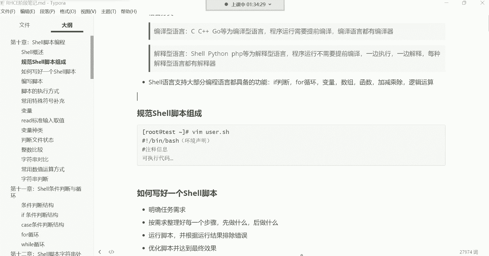

在本节课中，我们将学习如何编写和执行Shell脚本。这是自动化运维任务的基础，通过将一系列命令组合成一个脚本文件，我们可以让系统自动完成复杂的工作流程。

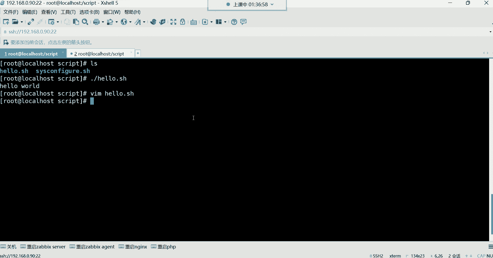

上一节我们介绍了Shell脚本的基本概念，本节中我们来看看如何具体编写一个脚本，并了解脚本执行的不同方式以及编写时的注意事项。

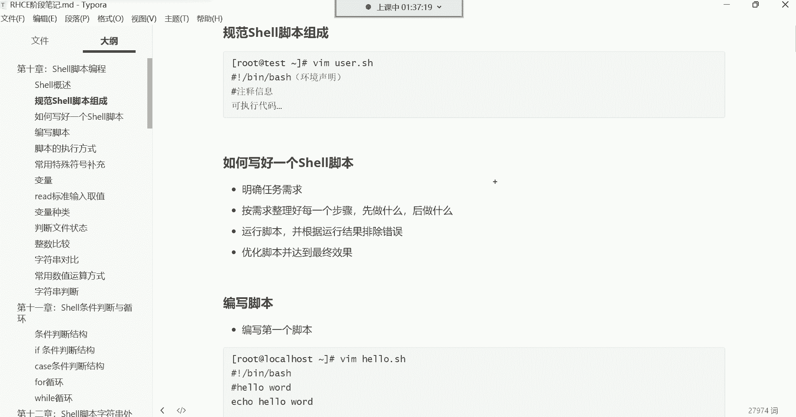

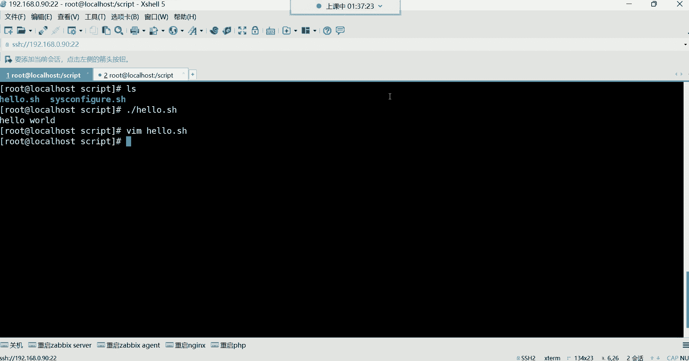


## 脚本编写的基本流程

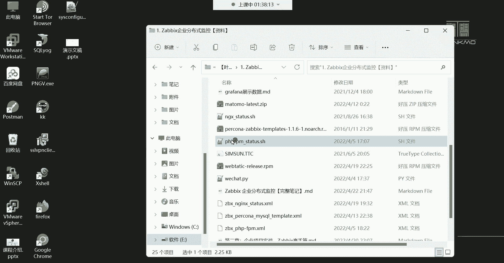

编写一个有效的Shell脚本需要遵循清晰的逻辑。以下是编写脚本的一般步骤：

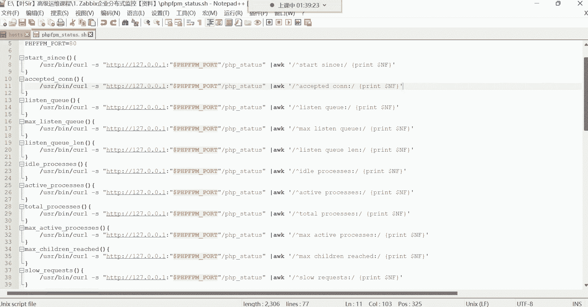

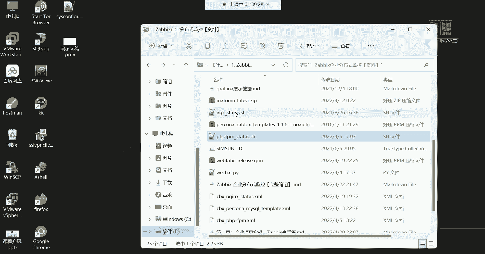

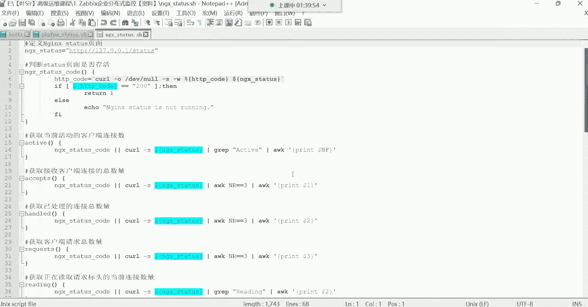

1.  **明确任务需求**：首先确定脚本最终要完成什么目标，例如搭建一个软件环境或备份数据。
2.  **整理实现步骤**：将大目标分解为一个个具体的、可执行的命令步骤，规划好先做什么，后做什么。
3.  **编写与测试**：将命令写入脚本文件，并运行脚本以测试其功能。
4.  **调试与优化**：根据测试结果修改脚本中的错误，并优化其逻辑和效率，直至达成最终效果。

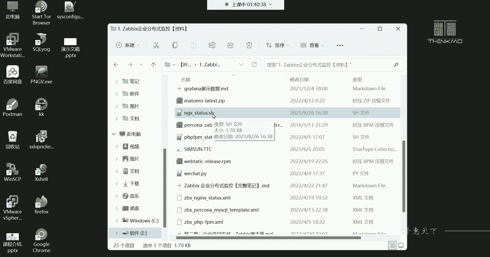

## 编写入门脚本：输出信息

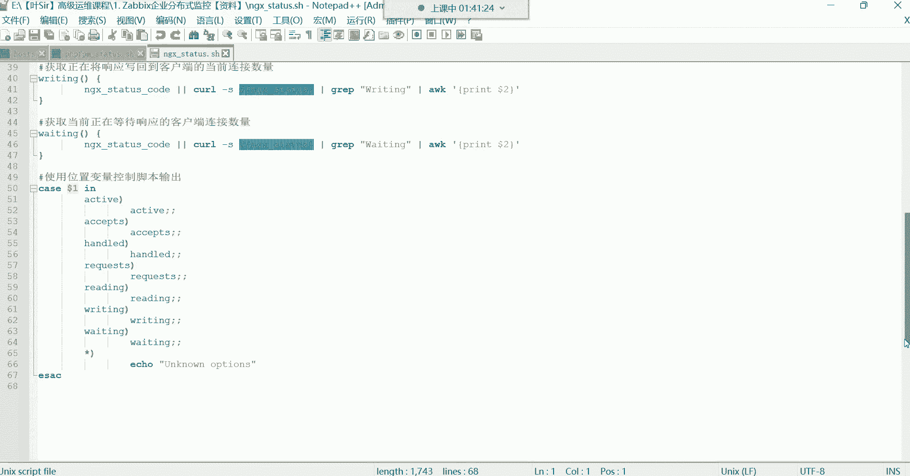

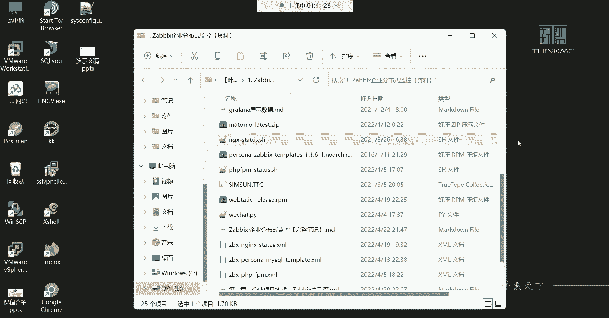

我们从最简单的脚本开始。以下是一个查看系统信息的脚本示例。

```bash
#!/bin/bash
# 这是一个查看系统信息的脚本
echo “第一步：查看系统版本信息”
cat /etc/centos-release
sleep 3

echo “第二步：查看内核版本信息”
uname -rs
sleep 3

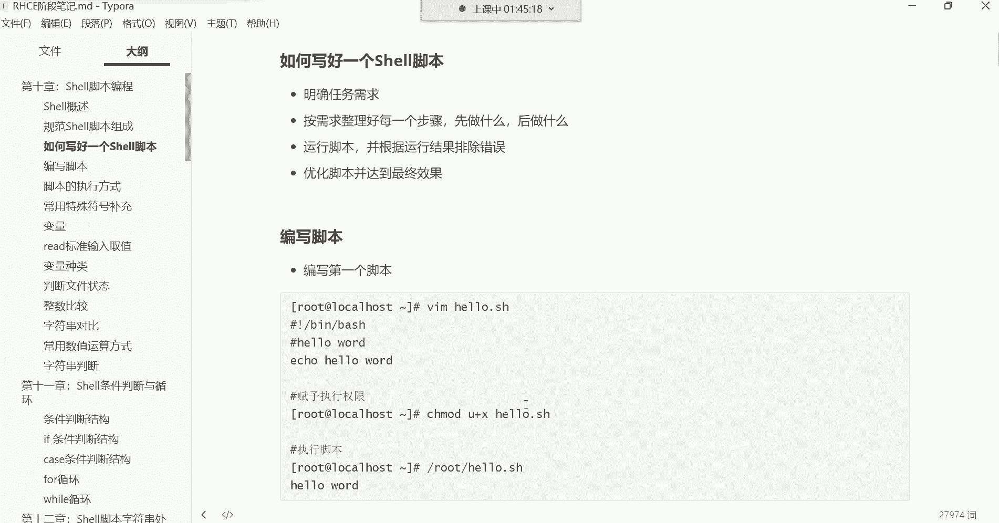

echo “第三步：查看根分区使用情况”
df -h /
sleep 3
```

**代码解释**：
*   `#!/bin/bash` 指定脚本使用的解释器。
*   `#` 开头的行为注释，用于说明脚本功能。
*   `echo` 命令用于输出提示信息。
*   `sleep 3` 让脚本暂停3秒，增强可读性。
*   其他命令（`cat`, `uname`, `df`）用于获取具体的系统信息。

**执行脚本**：
1.  保存文件，例如 `sys_info.sh`。
2.  赋予执行权限：`chmod +x sys_info.sh`
3.  运行脚本：`./sys_info.sh`

## 脚本编写的核心注意事项

在编写脚本时，有一个至关重要的原则需要遵守。

**避免使用交互式命令**：脚本应能独立运行，无需人工干预。像 `passwd`（设置密码）、`vim`（编辑文件）这类需要用户输入的命令，会直接导致脚本执行卡住。

**解决方案**：对于必须使用的交互命令，需找到其非交互的替代方法。例如，使用 `echo` 和管道为非交互式设置密码：

```bash
#!/bin/bash
# 创建用户并设置密码（非交互式）
useradd user1
echo “123456” | passwd --stdin user1
```

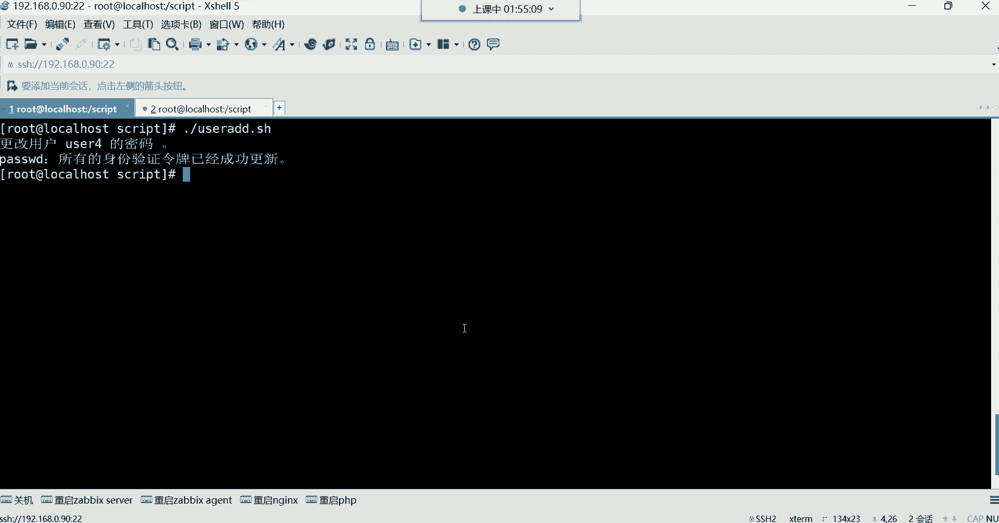

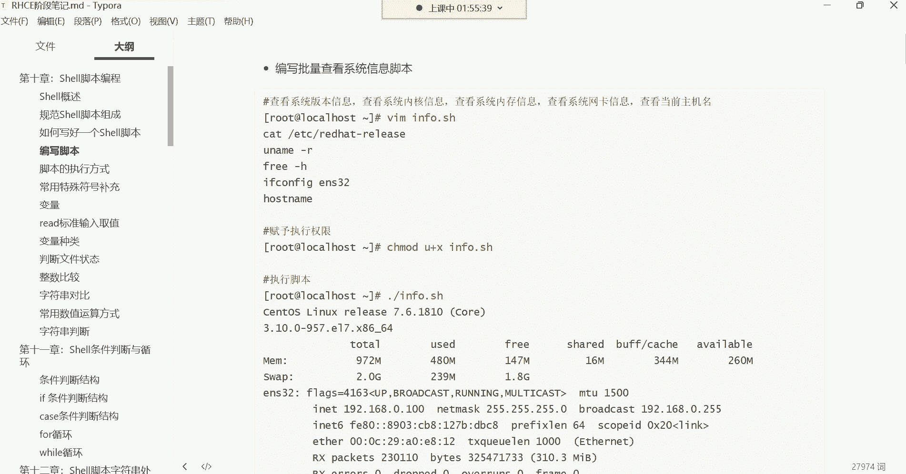

## 脚本的执行方式

脚本写好后，有多种方式可以执行它。以下是常见的脚本执行方法：

1.  **使用绝对或相对路径执行**：前提是脚本必须有执行权限 (`x`)。
    *   `./script.sh` （相对路径）
    *   `/home/user/scripts/script.sh` （绝对路径）
2.  **使用解释器直接执行**：即使脚本没有执行权限，也可以通过指定解释器来运行。
    *   `bash script.sh`
    *   `sh script.sh`
3.  **使用 source 或 . 命令执行**：这种方式会在当前Shell环境中执行脚本，脚本中设置的变量会影响当前终端。
    *   `source script.sh`
    *   `. script.sh`

## 编写实用脚本：搭建本地YUM仓库

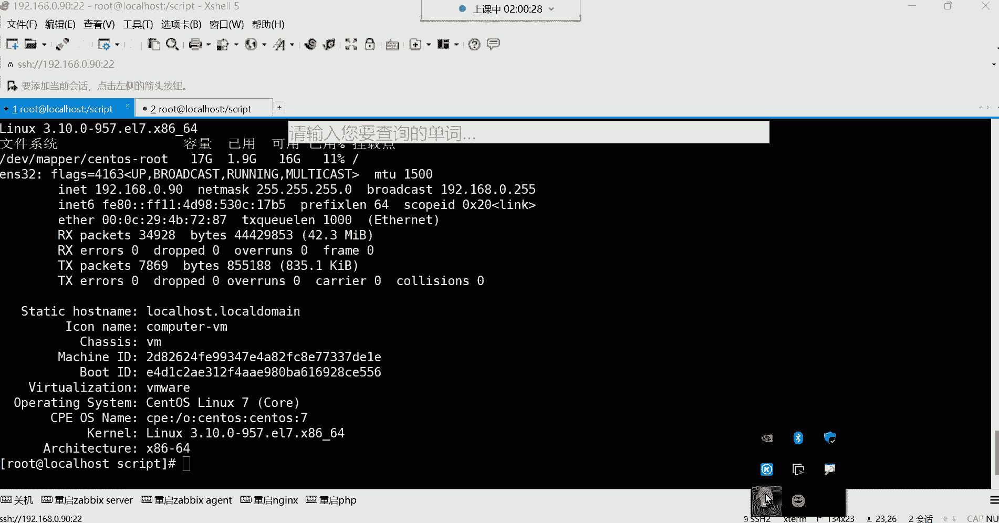

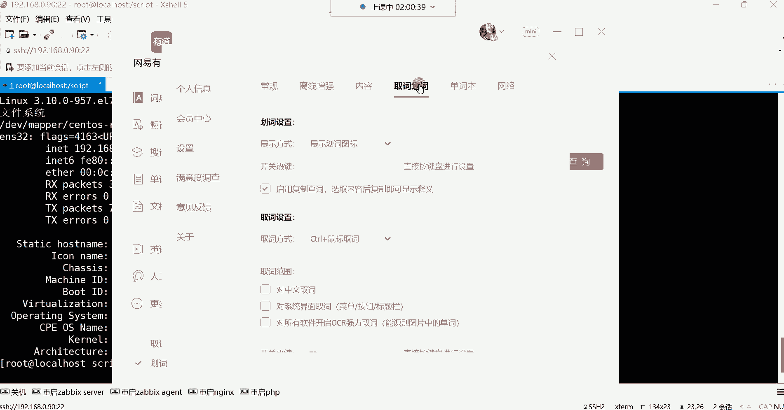

让我们结合一个实际任务来编写脚本。以下是一个自动化搭建本地YUM仓库的脚本框架。

```bash
#!/bin/bash
# 功能：配置本地YUM仓库并安装常用软件包

echo “开始配置本地YUM仓库…”
# 1. 挂载光盘
mount /dev/cdrom /mnt > /dev/null 2>&1

# 2. 创建仓库配置文件
cat > /etc/yum.repos.d/local.repo << EOF
[local]
name=Local Repository
baseurl=file:///mnt
enabled=1
gpgcheck=0
EOF

echo “YUM仓库配置完成。”
echo “开始安装软件包组…”

# 3. 安装软件包（例如开发工具）
yum groupinstall “Development Tools” -y

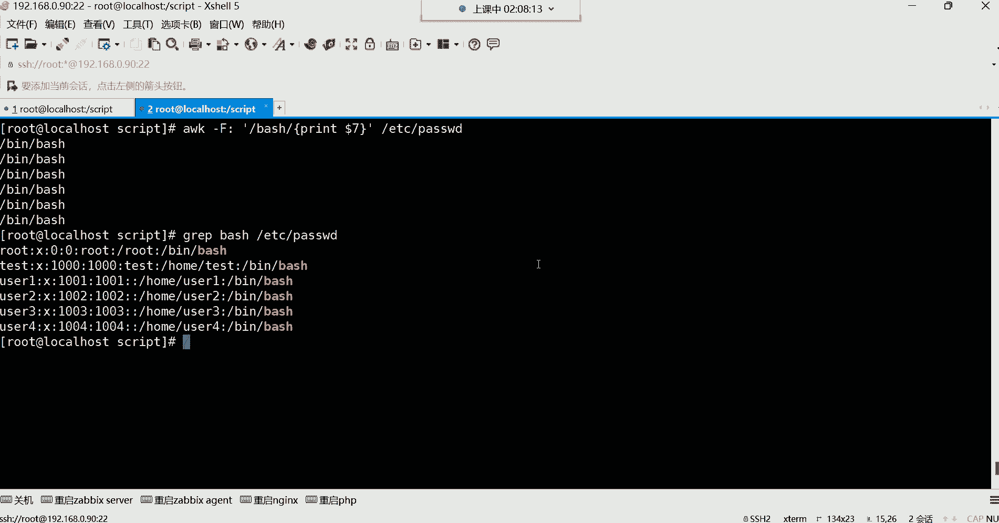

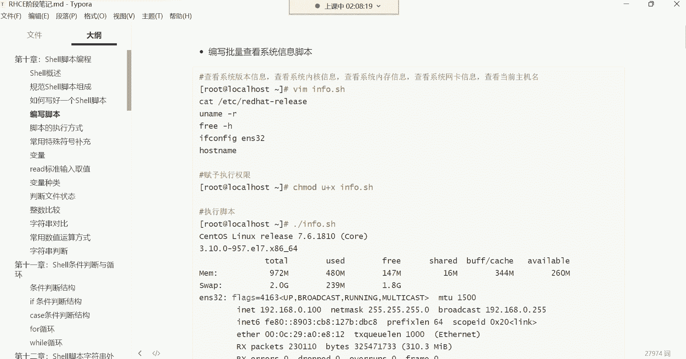

echo “软件包安装完毕。”
```

**代码解释**：
*   `> /dev/null 2>&1` 将命令的输出和错误信息重定向到空设备，即不显示任何输出。
*   `cat > file << EOF … EOF` 是一种向文件写入多行内容的方法（Here Document）。
*   `yum -y` 中的 `-y` 参数表示自动回答“yes”，避免安装过程中的交互确认。

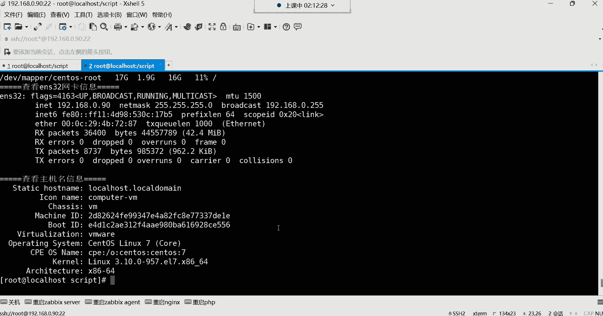

本节课中我们一起学习了Shell脚本的编写与执行。我们掌握了编写脚本的基本流程和核心原则——避免交互式命令，并实践了信息输出、用户管理、系统配置等常见任务的脚本编写。记住，脚本的本质是命令的集合，目标是实现自动化。随着学习的深入，你将能编写更复杂、更强大的脚本来管理Linux系统。