# Linux脚本编写与执行：P39：编写脚本、脚本执行方式 🐧

在本节课中，我们将学习如何编写一个实用的Shell脚本，并了解脚本的执行方式。我们将通过一个“搭建本地YUM软件仓库”的实例，来掌握脚本编写的基本思路、常用命令以及如何优化脚本以提升可读性和用户体验。

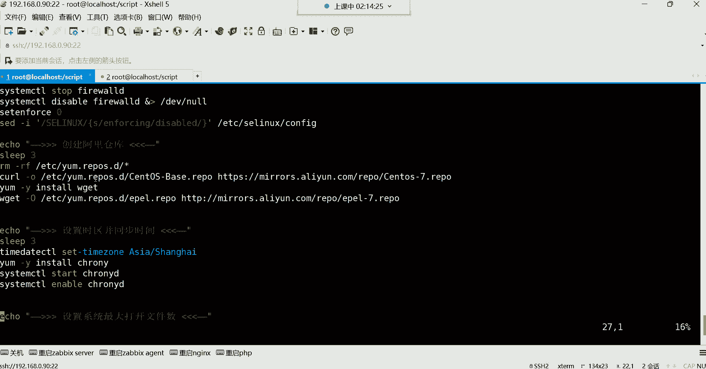


## 脚本编写基础

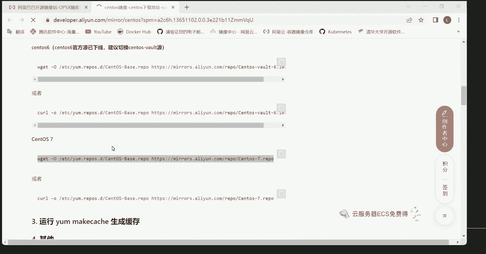

上一节我们介绍了脚本的基本概念，本节中我们来看看如何将一系列命令组织成一个脚本。

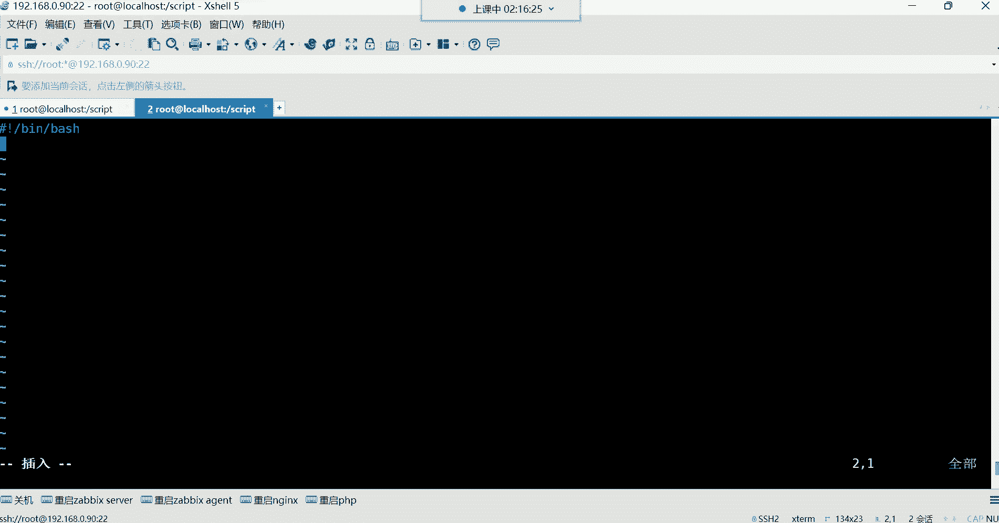

脚本的本质是将需要手动重复执行的命令，按照逻辑顺序写入一个文件中。这样，每次需要执行这些操作时，只需运行这个脚本文件即可。

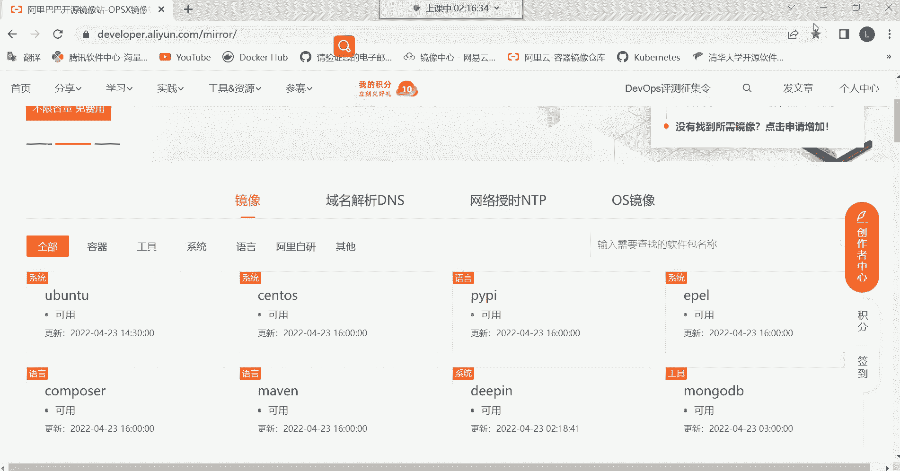

以下是编写一个基础脚本的步骤：

1.  **创建脚本文件**：使用 `vim` 或 `cat` 命令创建一个新文件，通常以 `.sh` 作为扩展名。
2.  **指定解释器**：在脚本的第一行写入 `#!/bin/bash`，这告诉系统使用哪个Shell来执行此脚本。
3.  **编写命令**：在后续行中，按顺序写入需要执行的Linux命令。
4.  **添加注释**：使用 `#` 符号添加注释，说明脚本的功能或某行命令的作用，这有助于他人或自己日后理解。
5.  **保存并赋予执行权限**：保存文件后，使用 `chmod +x 脚本名.sh` 命令为脚本添加可执行权限。
6.  **执行脚本**：可以通过 `./脚本名.sh` 或 `bash 脚本名.sh` 等方式来运行脚本。

## 实例：编写本地YUM仓库搭建脚本

让我们通过一个具体的例子来实践。我们的目标是编写一个脚本，自动完成挂载光盘、清理旧配置、创建本地YUM仓库配置文件并验证仓库是否可用的全过程。

### 1. 脚本内容规划

首先，我们规划脚本需要执行的命令序列：
*   挂载光盘到 `/mnt/cdrom` 目录。
*   清理 `/etc/yum.repos.d/` 目录下的旧配置文件。
*   在 `/etc/yum.repos.d/` 目录下创建新的仓库配置文件（例如 `local.repo`）。
*   使用 `yum repolist` 命令验证仓库是否可用。

### 2. 使用 `echo` 写入文件（基础方法）

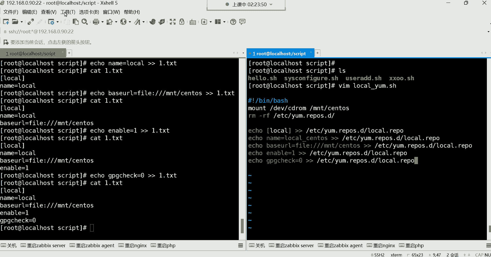

我们可以使用 `echo` 命令配合重定向符 `>`（覆盖）或 `>>`（追加）来向文件写入内容。这是一种直观但繁琐的方法。

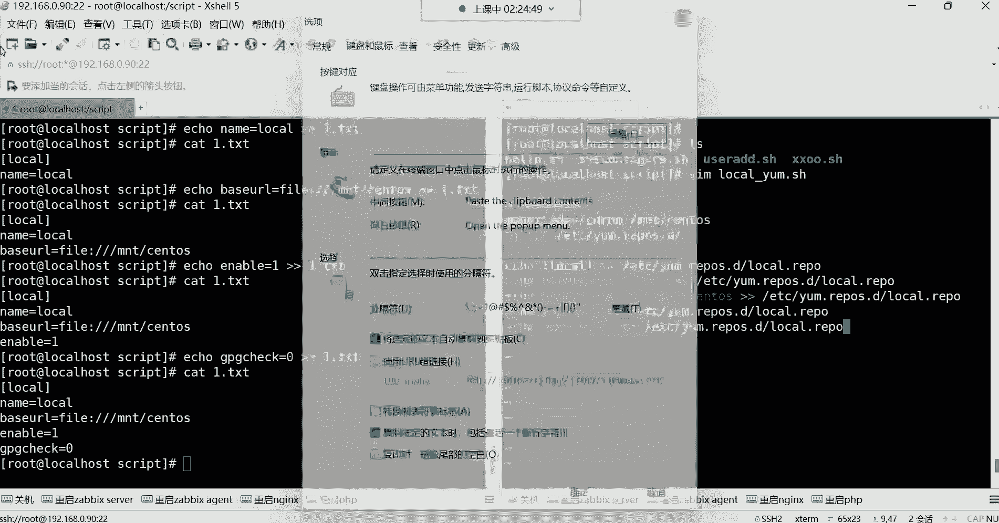

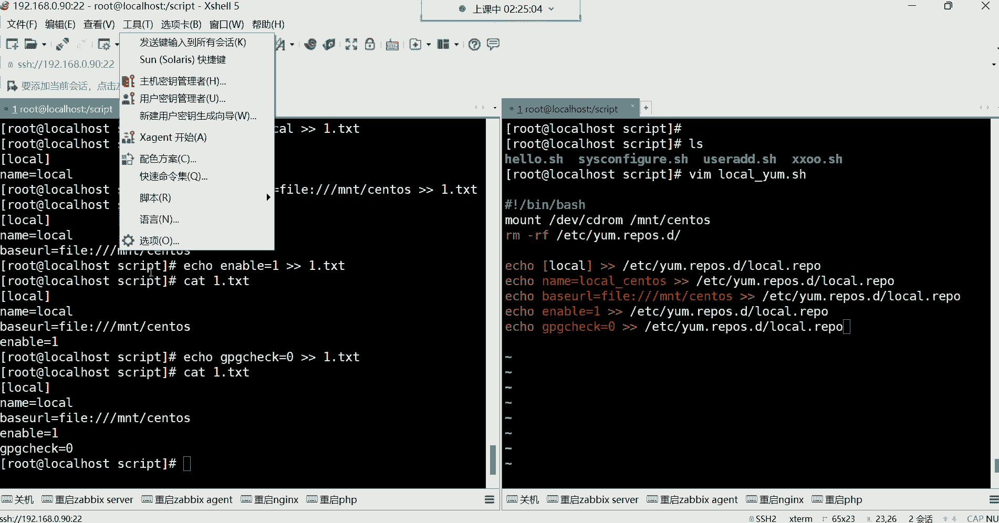

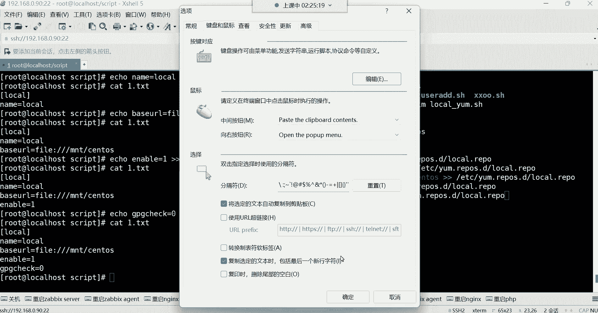

```bash
#!/bin/bash
# 这是一个搭建本地YUM仓库的脚本示例（基础echo方法）

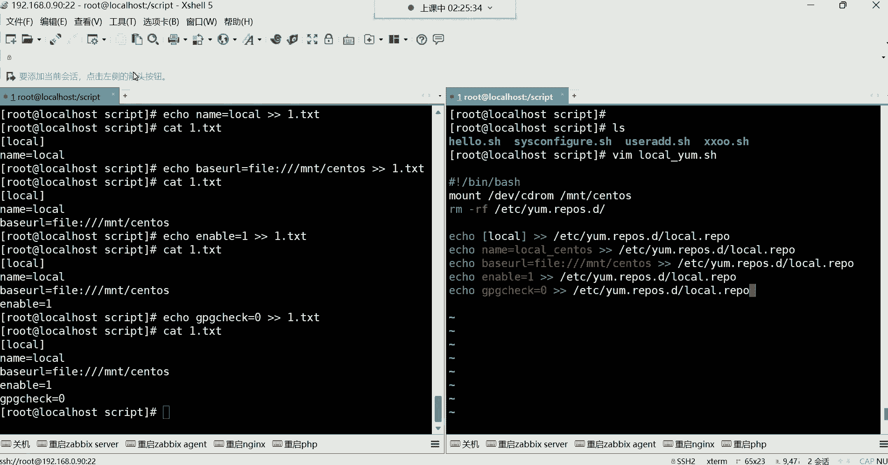


echo “正在挂载光盘...”
mount /dev/cdrom /mnt/cdrom

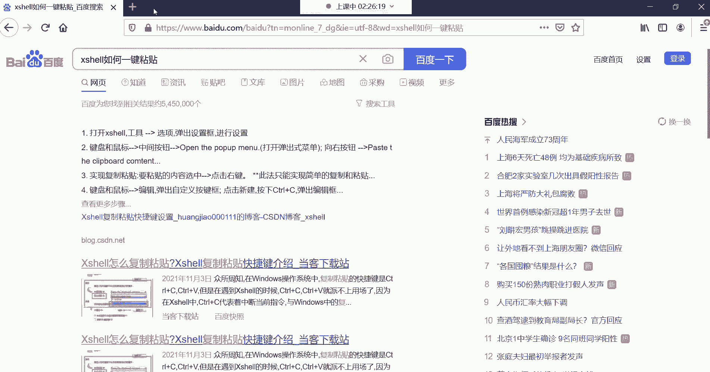


echo “正在清理旧仓库配置...”
rm -rf /etc/yum.repos.d/*

echo “正在创建本地仓库配置文件...”
echo “[local]” > /etc/yum.repos.d/local.repo
echo “name=Local Repository” >> /etc/yum.repos.d/local.repo
echo “baseurl=file:///mnt/cdrom” >> /etc/yum.repos.d/local.repo
echo “enabled=1” >> /etc/yum.repos.d/local.repo
echo “gpgcheck=0” >> /etc/yum.repos.d/local.repo

echo “正在验证仓库...”
yum repolist
```

**代码解释**：
*   `echo “[local]” > ...`：创建文件并写入第一行。
*   `echo “name=...” >> ...`：向已存在的文件末尾追加新行。

### 3. 使用 `cat` 和 “Here Document” 写入文件（推荐方法）

“Here Document” 是一种更优雅、更高效的多行文本输入方法，特别适合在脚本中生成配置文件。

```bash
#!/bin/bash
# 这是一个搭建本地YUM仓库的脚本示例（使用cat和Here Document）

echo “正在挂载光盘...”
mount /dev/cdrom /mnt/cdrom

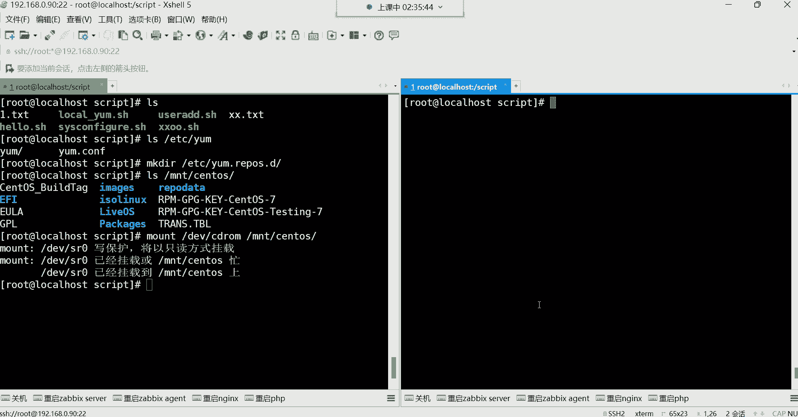


echo “正在清理旧仓库配置...”
rm -rf /etc/yum.repos.d/*

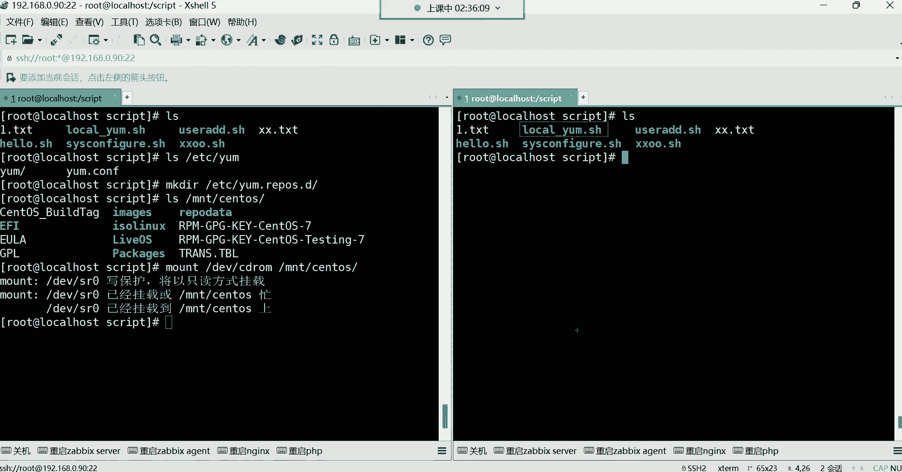

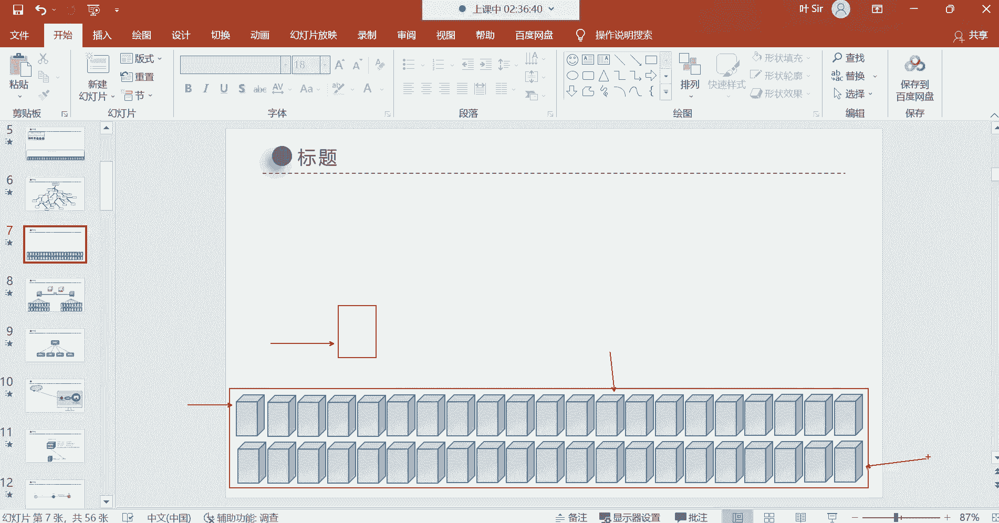

echo “正在创建本地仓库配置文件...”
cat > /etc/yum.repos.d/local.repo << EOF
[local]
name=Local Repository
baseurl=file:///mnt/cdrom
enabled=1
gpgcheck=0
EOF

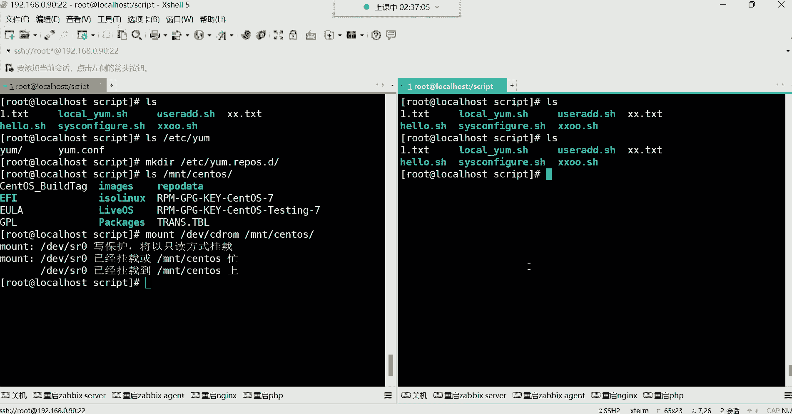

echo “正在验证仓库...”
yum repolist
```


**代码解释**：
*   `cat > 文件名 << EOF`：`cat` 命令将后续输入重定向到指定文件。
*   `EOF` 到 `EOF` 之间的所有内容（包括换行）都会被写入目标文件。`EOF` 是一个标记，可以用其他单词代替，但需前后一致。
*   这种方法结构清晰，易于维护，是脚本中生成文件的常用方式。

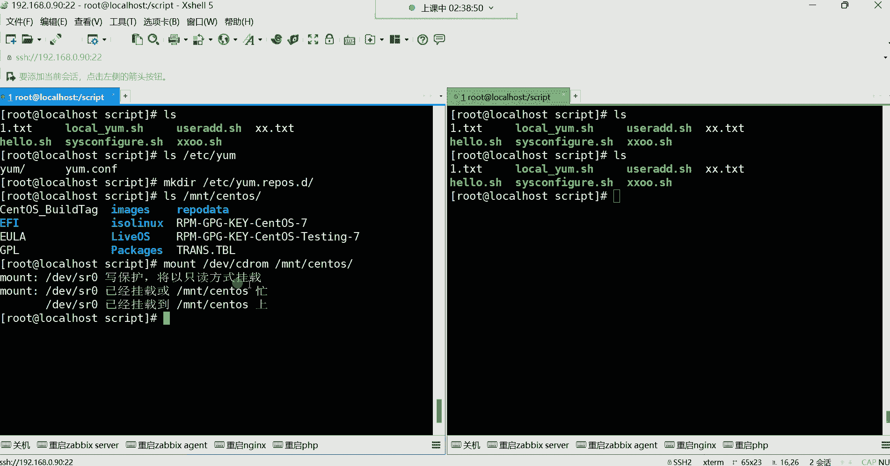


### 4. 脚本优化与增强

一个优秀的脚本不仅要能正确运行，还应具备良好的可读性和用户体验。

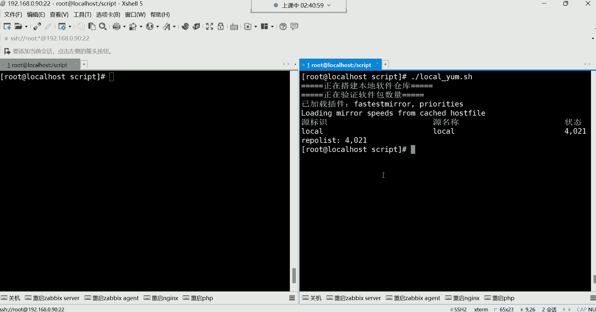

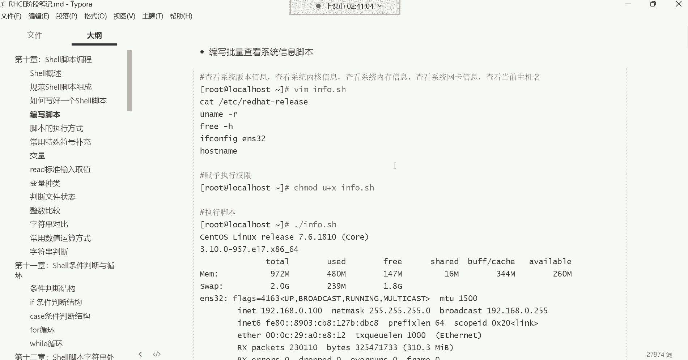

**添加提示信息与延迟**：使用 `echo` 输出当前步骤，并用 `sleep` 命令暂停几秒，让用户看清输出。
```bash
echo “脚本开始执行，正在搭建本地软件仓库...”
sleep 2
```

**优化命令输出**：默认的 `yum repolist` 输出信息较多。我们可以使用管道 `|` 和 `grep` 命令过滤出关键信息。
```bash
yum repolist | grep repolist
```
这样只会显示包含 “repolist” 的行，即仓库列表的摘要行。

**使用变量存储结果**（进阶）：为了使输出更友好，可以将命令结果存入变量，然后组织成更易懂的语句。
```bash
package_count=$(yum repolist | tail -1 | awk ‘{print $2}’)
echo “本地仓库可用软件包总数量为：$package_count 个”
```
**代码解释**：
*   `$(命令)`：称为“命令替换”，会执行括号内的命令，并将其输出结果替换到当前位置。
*   `package_count`：这是一个变量，用于存储后面命令执行的结果（即软件包数量）。
*   `echo “...$package_count...”`：在字符串中引用变量值。

**增加“进度条”效果（趣味性）**：虽然不反映真实进度，但能提升交互体验。这是一个简单的实现：
```bash
echo -n “正在处理 [”
for i in {1..20}; do
    echo -n “#”
    sleep 0.1
done
echo “] 完成！”
```
**代码解释**：
*   `echo -n`：输出不换行。
*   `for i in {1..20}; do ... done`：一个循环结构，执行20次。
*   每次循环打印一个“#”并暂停0.1秒，模拟进度增长。

## 脚本执行方式

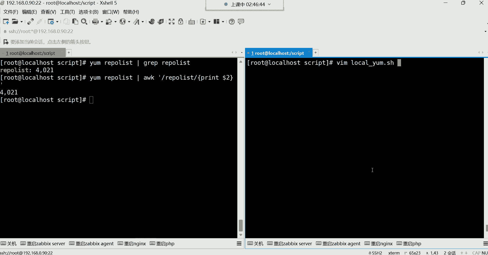

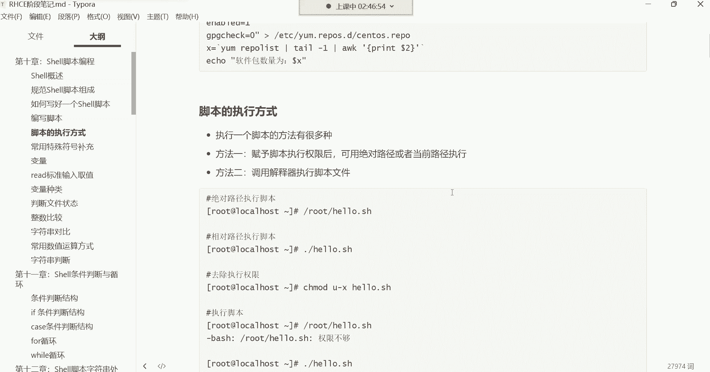

编写好脚本后，有几种方式可以执行它：

1.  **使用 `bash` 或 `sh` 解释器直接执行**：
    ```bash
    bash script_name.sh
    sh script_name.sh
    ```
    这种方式无需给脚本文件赋予执行权限。

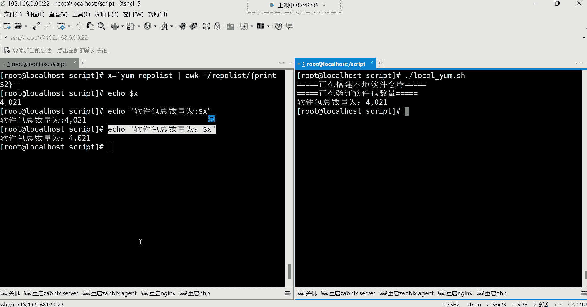

2.  **作为可执行文件运行（需先赋予权限）**：
    ```bash
    chmod +x script_name.sh  # 添加执行权限
    ./script_name.sh         # 执行脚本
    ```
    这是最常见的方式。`./` 表示执行当前目录下的文件。

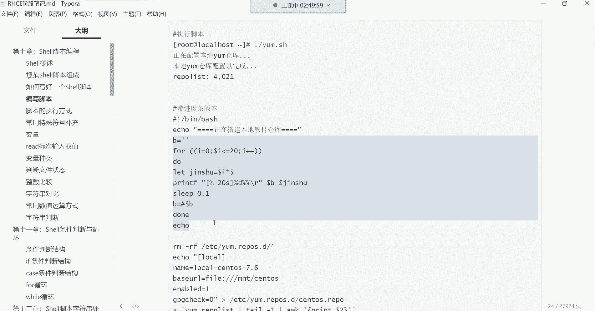

3.  **使用 `source` 或 `.` 命令执行**：
    ```bash
    source script_name.sh
    . script_name.sh
    ```
    这种方式会在当前Shell环境中执行脚本，脚本中设置的变量和环境会影响当前终端。与前两种（启动子Shell执行）有所不同。

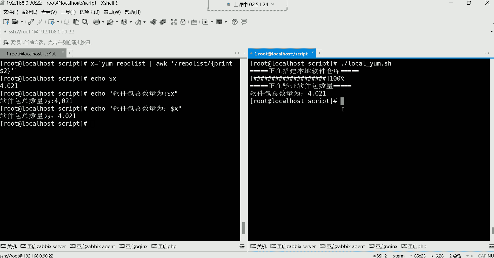

## 总结

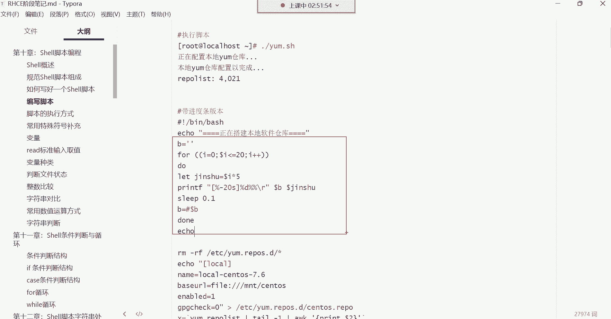

本节课中我们一起学习了Shell脚本的编写与执行。我们从创建一个简单的本地YUM仓库搭建脚本入手，逐步深入，掌握了以下核心技能：

*   **脚本结构**：理解了脚本文件的基本构成，包括解释器声明、命令序列和注释。
*   **文件操作**：学会了在脚本中使用 `echo` 和 `cat`（配合 Here Document）两种方式向文件写入内容，后者是更专业的选择。
*   **脚本优化**：了解了如何通过添加提示信息、使用 `sleep` 命令、过滤命令输出以及利用变量来提升脚本的可读性和用户体验。
*   **执行方式**：熟悉了 `bash script.sh`、`./script.sh`（需权限）和 `source script.sh` 三种执行脚本的方法及其区别。

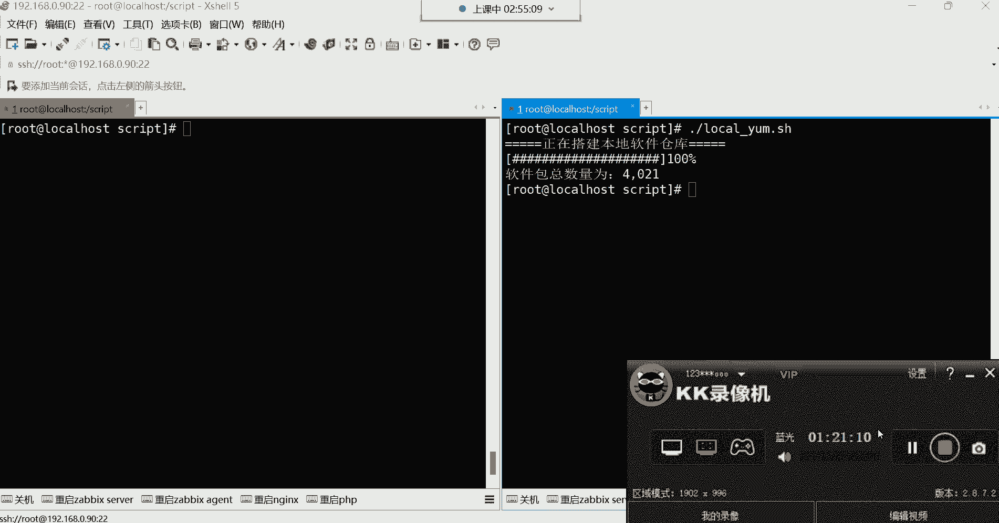

脚本是自动化运维的基石。通过将重复、繁琐的命令流程固化到脚本中，可以极大地提高工作效率和准确性。现在，你可以尝试将日常管理中的一些固定操作编写成脚本，并不断优化它了。