# Linux运维入门：P3：虚拟机网络配置、远程连接与Linux岗位介绍 🖥️

在本节课中，我们将学习如何配置虚拟机的网络，以便使用远程连接工具登录系统。同时，我们也将了解Linux系统的应用领域以及相关的IT岗位，帮助你明确未来的学习和发展方向。

## 系统登录与初步操作

上一节我们完成了系统的安装。系统安装好后，需要重启。选择重启选项，让系统重新启动。

重启后，我们会进入一个命令行登录界面，提示“localhost login”。由于我们安装的是最小化系统（无图形界面），因此需要在此输入用户名和密码进行登录。

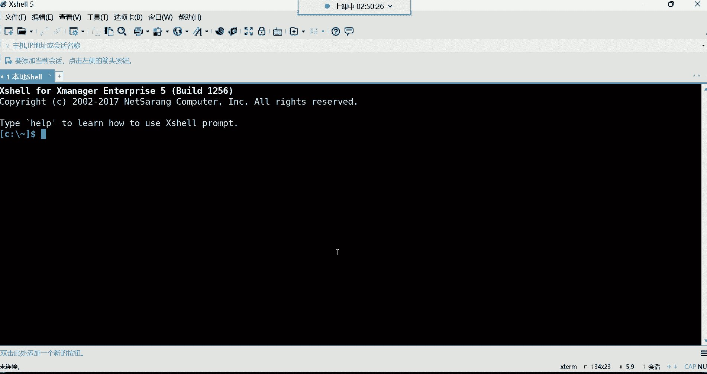

输入用户名 `root` 并回车。随后输入密码（输入时屏幕不会显示字符，这是出于安全考虑），输入完毕后按回车即可登录系统。登录成功后，命令行提示符会发生变化。

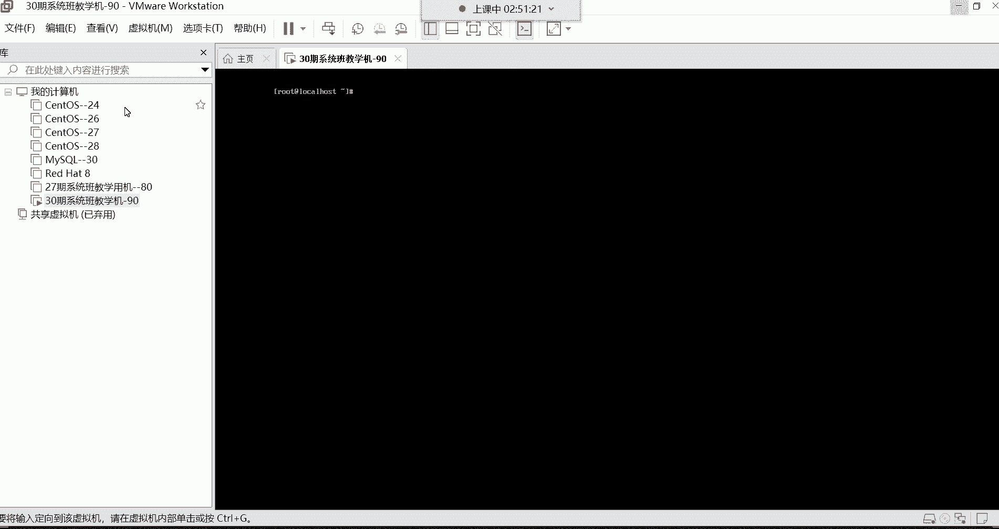

## 配置虚拟机网络以进行远程连接 🔌

目前我们是在虚拟机窗口内操作，这在实际工作中并不方便。通常，我们需要通过远程连接工具来管理服务器。为了实现远程连接，必须先正确配置虚拟机的网络。

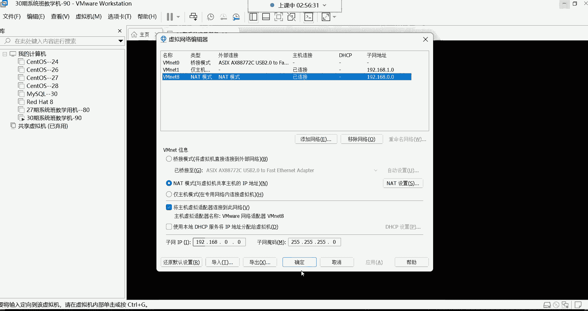

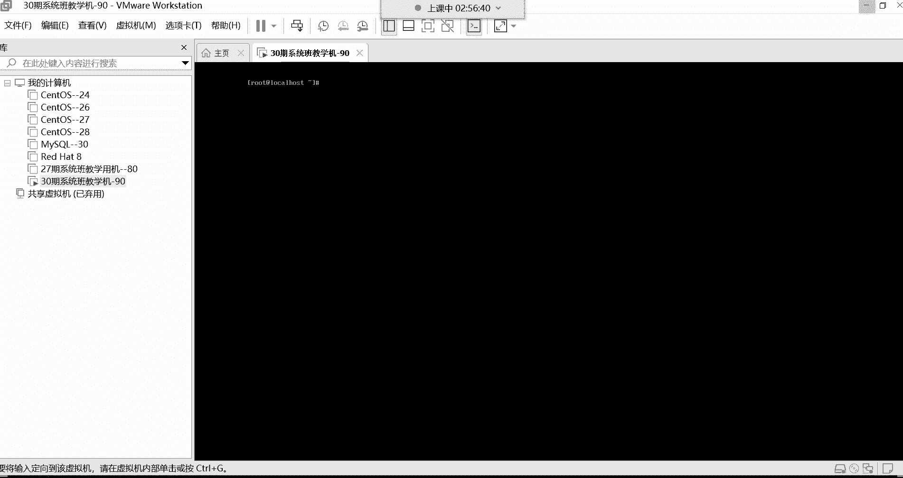

以下是配置虚拟机网络的关键步骤，请确保每一步都设置正确，否则可能导致无法连接。

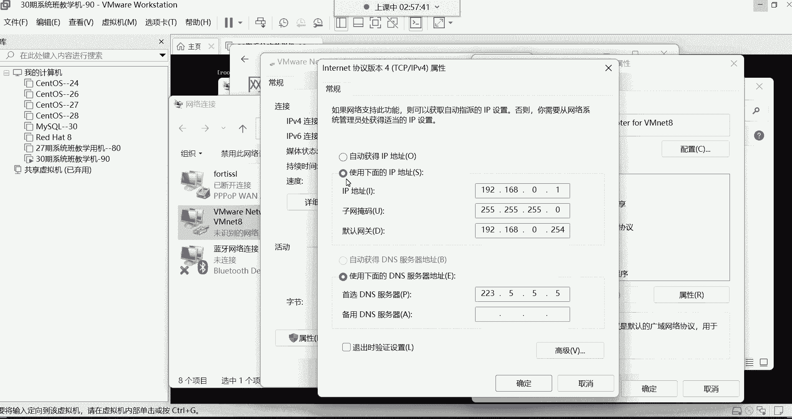

### 1. 配置VMware虚拟网络编辑器

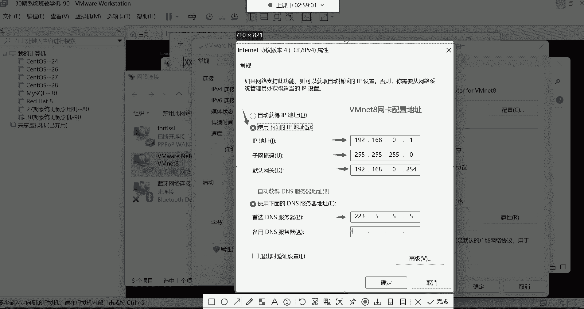

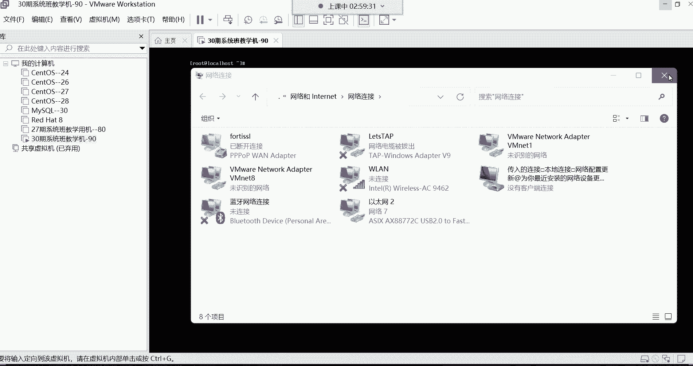

首先，需要在VMware软件中配置虚拟网络。

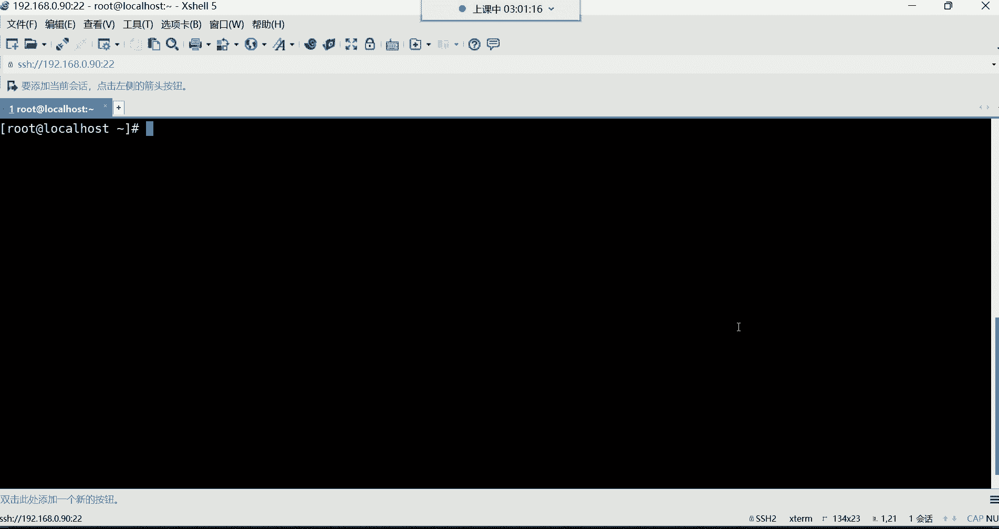

1.  打开VMware，点击顶部菜单栏的“编辑”，选择“虚拟网络编辑器”。
2.  在弹出的窗口中，选中“VMnet8（NAT模式）”，使其高亮显示。
3.  取消勾选“使用本地DHCP服务将IP地址分配给虚拟机”选项。这一步非常重要，目的是禁用自动分配IP，以便我们使用手动设置的固定IP。
4.  查看并记录“子网IP”地址，例如 `192.168.0.0`。子网掩码通常为 `255.255.255.0`。
5.  点击“NAT设置”按钮，查看并设置网关地址，例如 `192.168.0.254`。请确保此网关地址与后续步骤中配置的保持一致。
6.  点击“确定”保存设置，然后点击“应用”。

### 2. 配置主机VMnet8网卡

虚拟机网络配置好后，还需要在您电脑（主机）的网络上进行相应设置，使主机能与虚拟机通信。

1.  打开您电脑系统的“网络和共享中心”或“网络连接”设置。
2.  找到名为“VMware Network Adapter VMnet8”的虚拟网卡，右键点击并选择“属性”。
3.  在属性列表中，双击“Internet协议版本4 (TCP/IPv4)”。
4.  选择“使用下面的IP地址”，并填写以下信息：
    *   **IP地址**：设置为与虚拟机同一网段的地址，例如 `192.168.0.1`
    *   **子网掩码**：`255.255.255.0`
    *   **默认网关**：填写之前在VMware中设置的网关地址，例如 `192.168.0.254`
    *   **首选DNS服务器**：可以设置为 `223.5.5.5` 或 `114.114.114.114`
5.  点击“确定”保存所有设置。

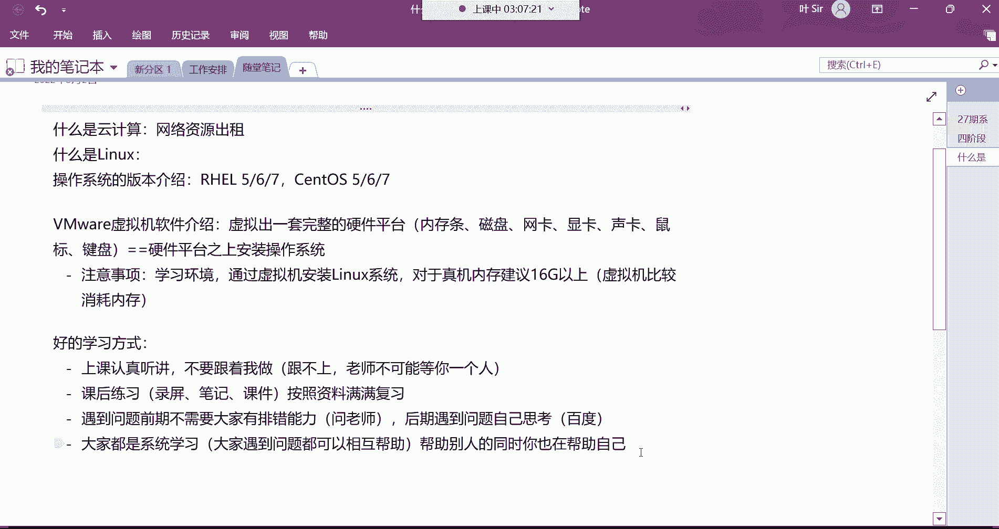

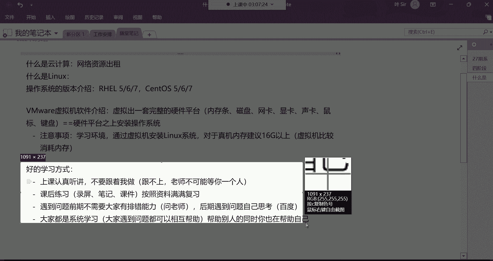

完成以上两步后，虚拟机和您的主机就处于同一个网络环境中，为远程连接做好了准备。

## 使用远程连接工具登录系统 📡

网络配置妥当后，我们就可以使用专业的远程连接工具来登录和管理Linux系统了。这里推荐使用Xshell。

*   **获取Xshell**：您可以从腾讯软件中心等网站搜索“Xshell”进行下载和安装。
*   **连接虚拟机**：
    1.  打开Xshell，点击“新建会话”。
    2.  在“主机”栏中输入您虚拟机的IP地址，例如 `192.168.0.90`。
    3.  协议选择“SSH”，端口保持默认的22。
    4.  点击“连接”，首次连接时会弹出“SSH安全警告”，选择“接受并保存”即可。
    5.  在登录界面中输入用户名 `root` 和密码，即可成功登录。

现在，您就可以在这个更便捷的Xshell窗口中对Linux系统进行操作了。例如，可以使用快捷键 `Ctrl + L` 来清屏。

## Linux应用领域与岗位介绍 💼

系统安装和远程连接是操作的基础。接下来，我们来了解一下学习Linux后广阔的应用前景和职业选择。

### Linux系统的广泛应用

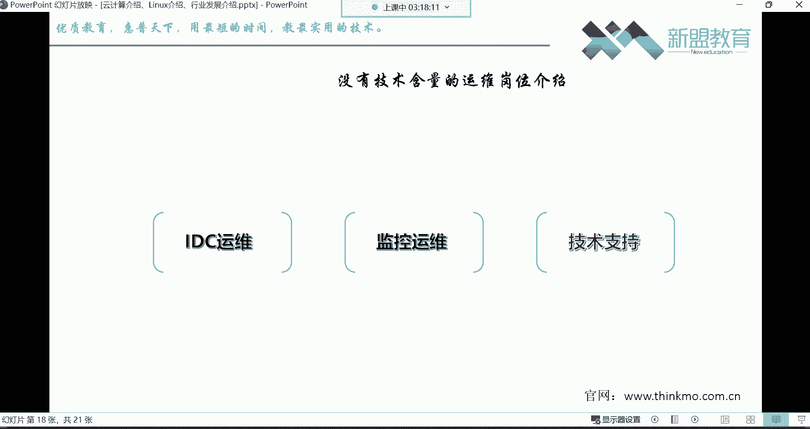

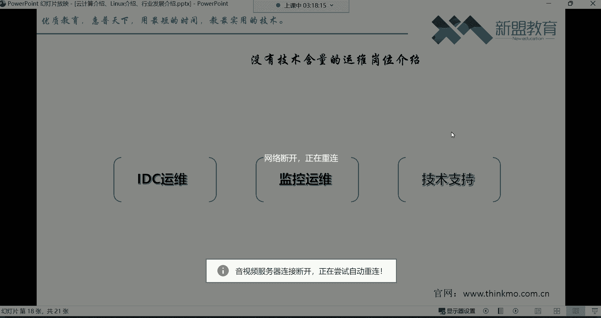

Linux系统已经渗透到我们生活和生产的方方面面：
*   **基础服务**：金融、政务、通信、医疗、物流等行业的后台服务器。
*   **前沿技术**：云计算、大数据、人工智能领域的核心平台。
*   **超级计算**：全球500强超级计算机绝大多数都运行Linux系统，我国的“神威·太湖之光”、“天河二号”也基于Linux。
*   **日常生活**：我们使用的手机（Android系统基于Linux）、网上购物、移动支付、社交软件、在线娱乐等服务的背后，都有成千上万的Linux服务器在提供支持。

### 可供选择的IT岗位

学习Linux运维后，您可以向多个技术岗位发展：
*   **运维工程师**：入门首选岗位，负责服务器和业务的日常维护。
*   **进阶方向**：随着经验积累，可向**容器/K8s运维工程师**、**云平台运维工程师**、**DBA（数据库管理员）**、**自动化运维工程师**、**系统架构师**等方向发展。

这些岗位薪资可观，入门级运维工程师薪资通常在8000元至10000元以上，且市场需求量大。

### 需要谨慎选择的岗位

在求职时，请注意区分一些技术含量较低、发展空间有限的岗位，它们通常是第三方外包：
*   **IDC运维**：主要工作是机房巡检，负责检查温度、电力等，与Linux技术关系不大。
*   **监控运维**：负责看守监控系统，发送告警信息，技术含量低。
*   **技术支持**：类似客服，处理用户工单，将技术问题转交后端工程师。

### 运维岗位的优势

与其他IT岗位相比，运维岗位有其独特优势：
*   **开发岗位**：薪资高，但门槛高（学历、专业、逻辑思维要求高），压力大，职业生命周期相对较短。
*   **测试岗位**：需要一定的编程和数据库基础，技术含量不低，且通常只有大公司才设专职岗位。
*   **运维岗位**：
    *   **门槛友好**：零基础可以入门，对学历要求相对宽松（大专即可）。
    *   **寿命长久**：职业生命周期长，经验越丰富越有价值。
    *   **需求量大**：任何公司都需要系统维护人员，工作机会多。

成功的关键在于**坚持**。学习过程中会遇到困难，保持耐心，课后勤加练习，多与同学交流互助，是快速成长的不二法门。

## 总结与学习建议 📚

本节课中我们一起学习了：
1.  如何登录新安装的Linux系统。
2.  如何逐步配置VMware虚拟网络和主机网卡，以实现网络互通。
3.  如何使用Xshell远程连接工具登录和管理虚拟机。
4.  了解了Linux系统广泛的应用场景和相关的IT岗位，明确了运维岗位的发展路径和优势。

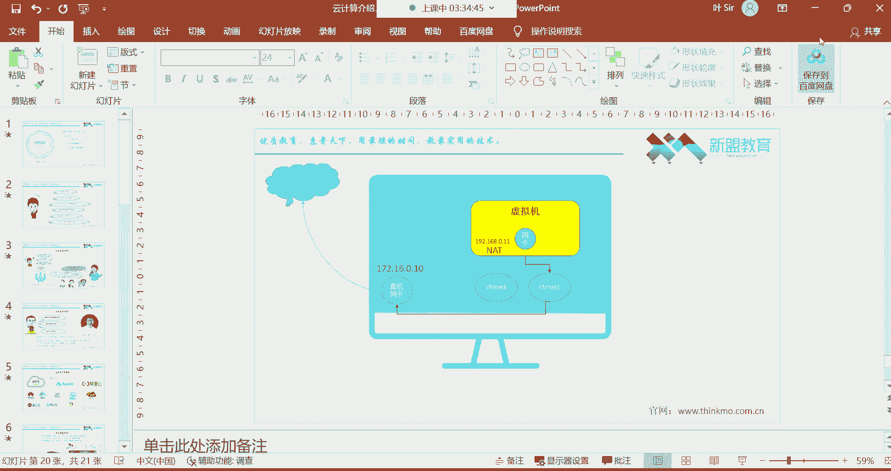

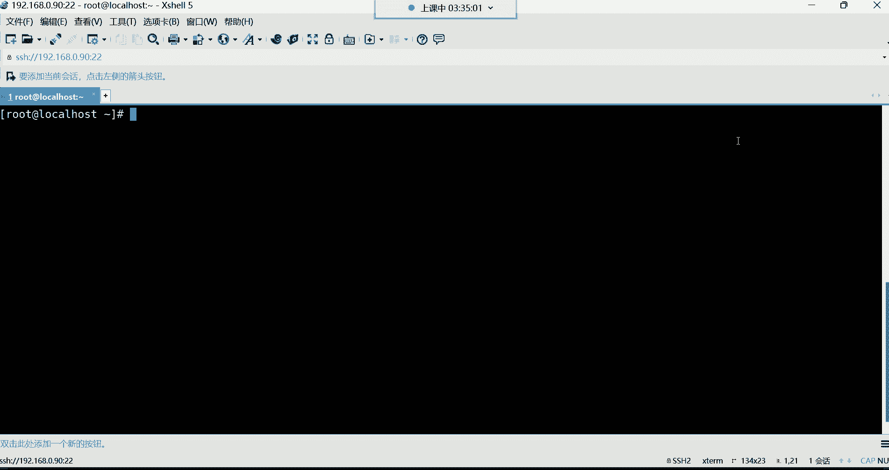

对于学习方式，建议：
*   **上课时**：以听懂、理解为主，不要急于同步操作，以免跟不上节奏。
*   **下课后**：利用录屏、笔记等资料反复练习，巩固知识。
*   **遇到问题**：前期可多请教老师，后期应尝试自己搜索（百度/谷歌）和思考解决方案，培养排错能力。
*   **交流互助**：在群内积极帮助同学解决问题，教学相长，也能加深自己的理解。

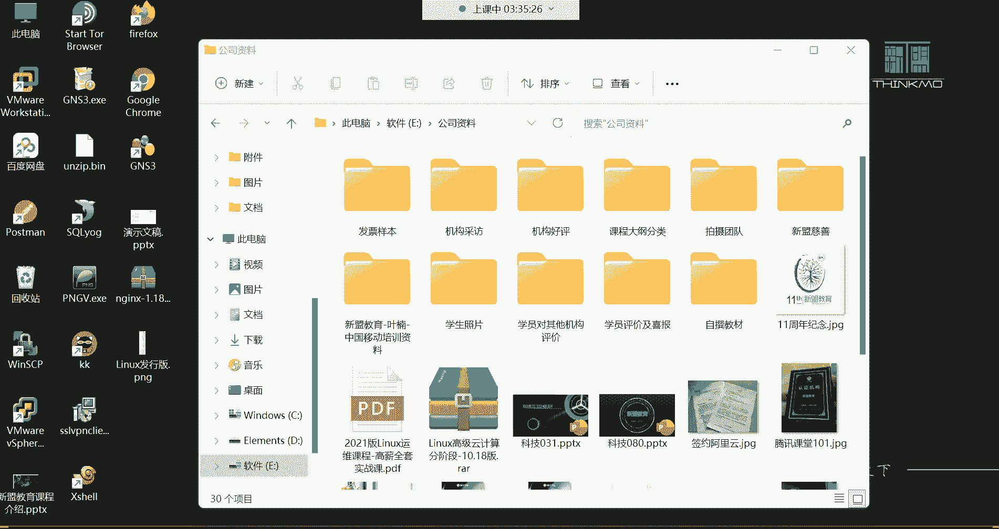

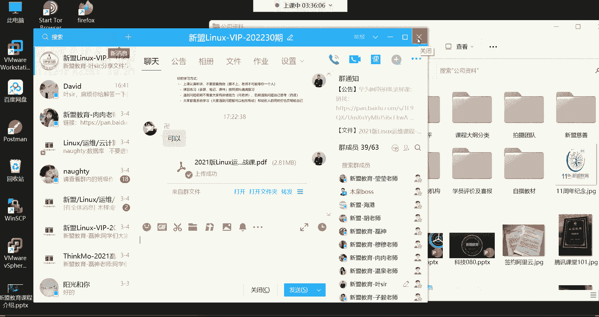

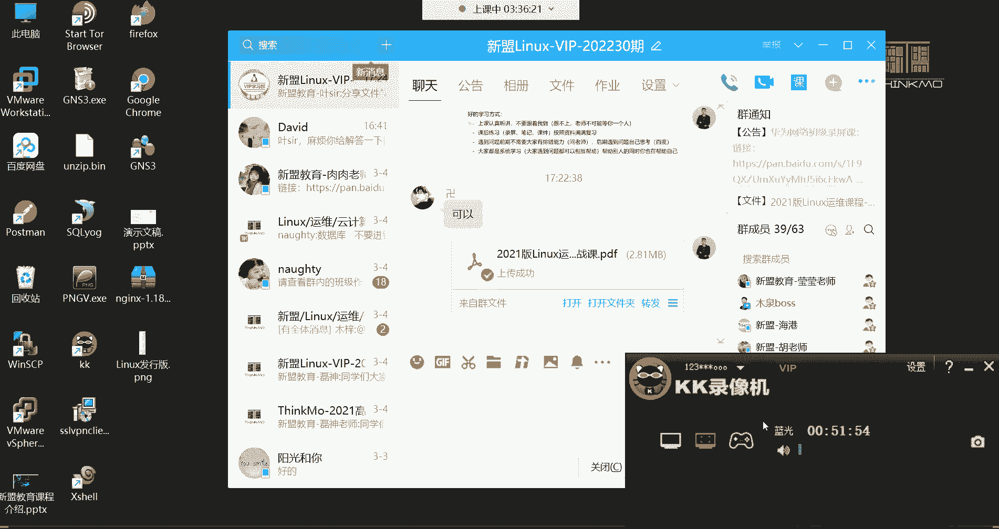

坚持是通往成功的唯一捷径。下周我们将正式进入Linux命令的学习，请大家做好预习。