# Linux运维教程：P40：常用特殊符号补充

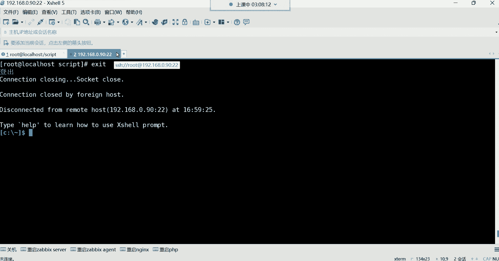

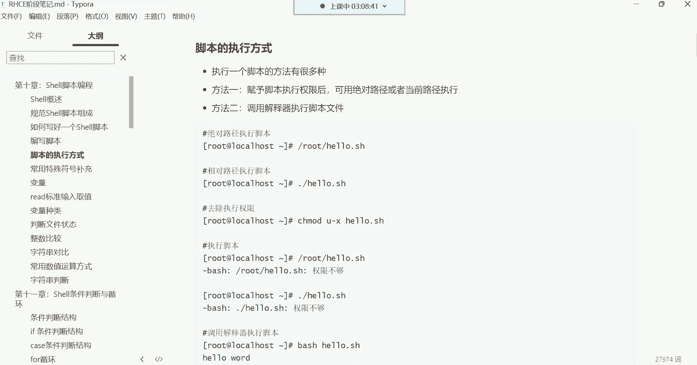

在本节课中，我们将学习Shell脚本的几种执行方式，并深入理解几个在脚本中常用的特殊符号，包括引号和四则运算符号。这些知识对于编写和理解Shell脚本至关重要。


## Shell脚本的执行方式


上一节我们介绍了如何编写Shell脚本，本节中我们来看看如何执行一个写好的脚本。执行Shell脚本主要有两种方式。


以下是两种主要的执行方法：

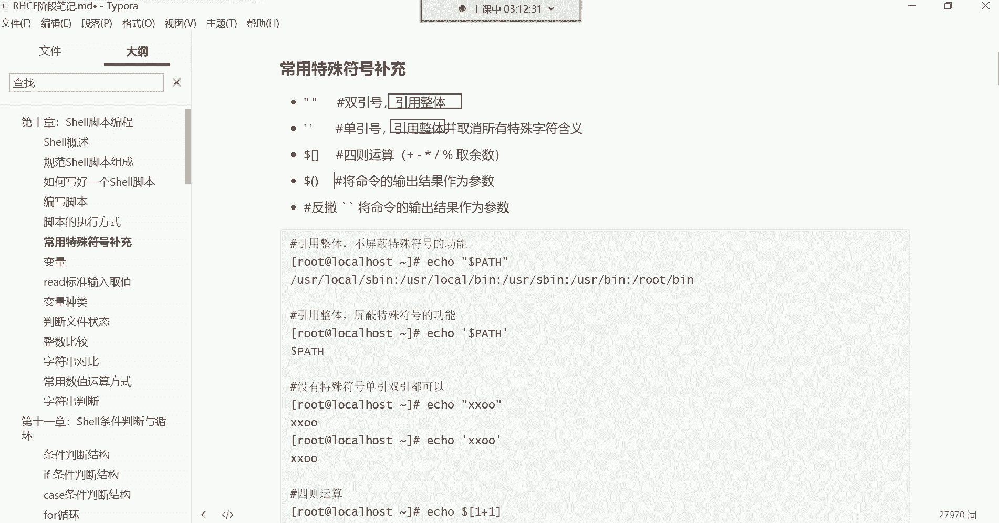

1.  **赋予脚本执行权限后执行**
    这是最常用的方法。首先使用 `chmod` 命令为脚本文件添加执行权限。
    ```bash
    chmod +x script_name.sh
    ```
    之后，可以通过绝对路径或相对路径来执行脚本。
    *   **相对路径执行**：需要在脚本名前加上 `./`，以告诉系统在当前目录下寻找该文件。
        ```bash
        ./script_name.sh
        ```
    *   **绝对路径执行**：直接指定脚本文件的完整路径。
        ```bash
        /path/to/your/script_name.sh
        ```

2.  **调用解释器直接执行**
    这种方法无需给脚本文件赋予执行权限。直接使用 `bash` 解释器来运行脚本。
    ```bash
    bash /path/to/your/script_name.sh
    ```
    或者使用相对路径：
    ```bash
    bash ./script_name.sh
    ```

## 常用的特殊符号：引号

理解了脚本的执行方式后，我们来看看Shell中几个关键的特殊符号。首先介绍引号，它们的主要功能是**引用整体**。

“引用整体”意味着将引号内的所有内容（包括空格、特殊字符）视为一个不可分割的整体。

以下是引号功能的示例：

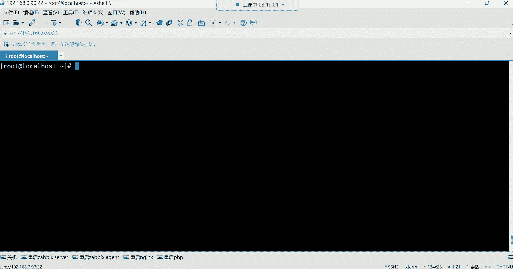

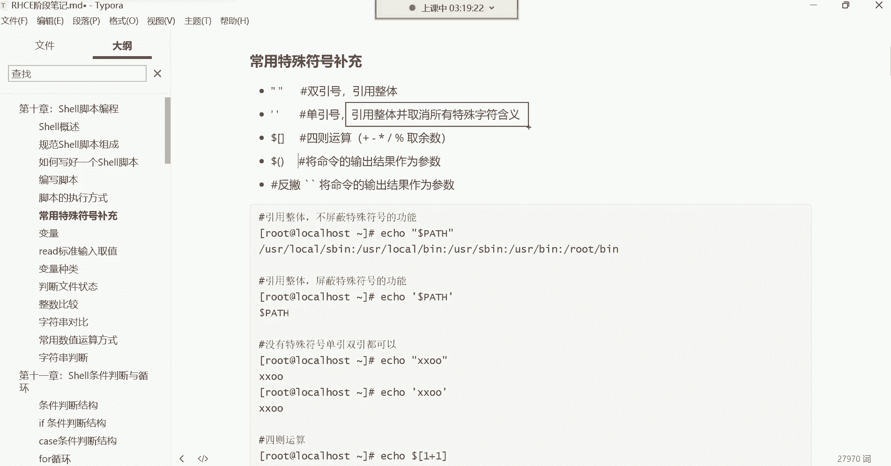

*   **创建多行文本**：使用引号可以一次性输入多行内容，`echo` 命令会将其作为一个整体输出。
    ```bash
    echo ‘第一行
    第二行
    第三行’
    ```
*   **创建含空格的文件名**：如果不使用引号，`touch A B` 会创建两个文件 `A` 和 `B`。使用引号则可以创建一个名为 `A B` 的单个文件。
    ```bash
    touch “A B”
    ```
    注意：如果文件名以空格开头或结尾（如 `” hello.txt “`），在管理时容易造成困扰，因为视觉上不易察觉。

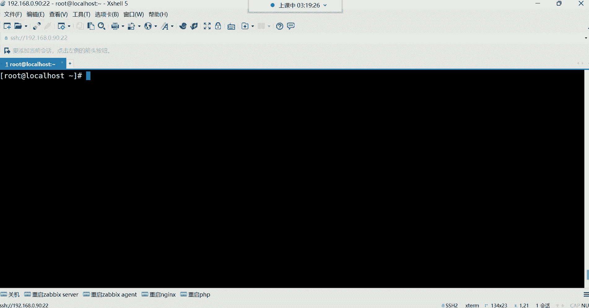

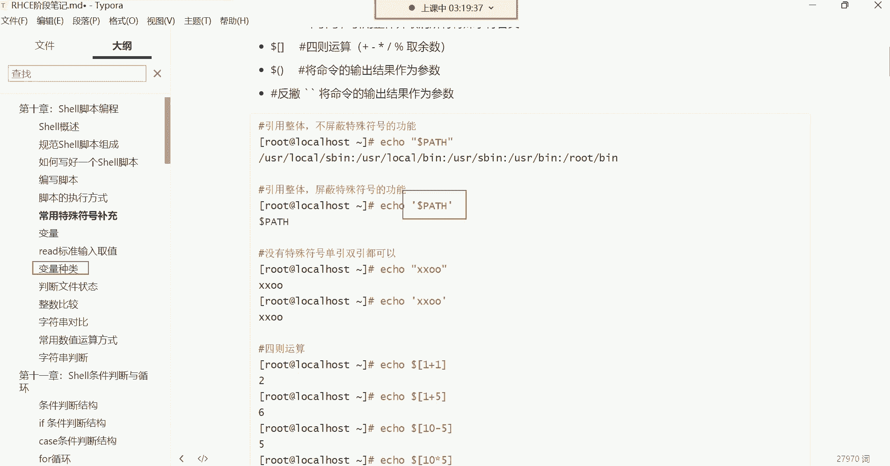

### 双引号与单引号的区别

虽然双引号(`” “`)和单引号(`’ ‘`)都能引用整体，但它们有一个核心区别：**对特殊符号的处理方式不同**。

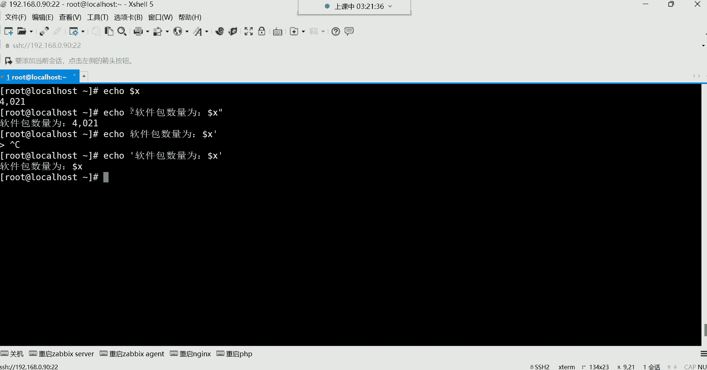

*   **双引号**：会保留大部分特殊符号（如 `$`， `\`， `!`）的原有功能。
*   **单引号**：会取消所有特殊符号的功能，将其视为普通字符。

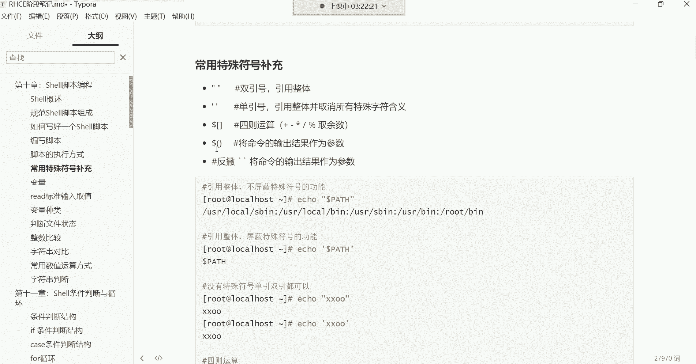

我们用一个变量例子来说明。假设我们定义了一个变量 `X=10`。

```bash
# 使用双引号，$X 会被解析为变量的值
echo “软件包数量为：$X”
# 输出：软件包数量为：10

# 使用单引号，$X 被当作普通字符串
echo ‘软件包数量为：$X’
# 输出：软件包数量为：$X
```

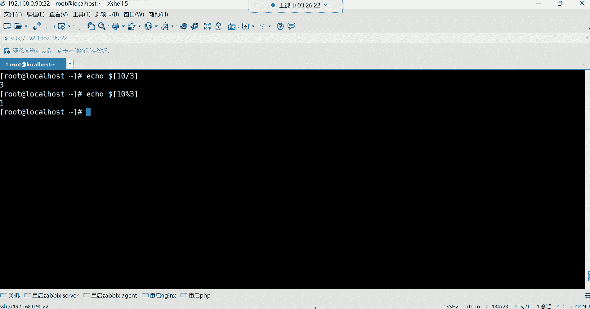

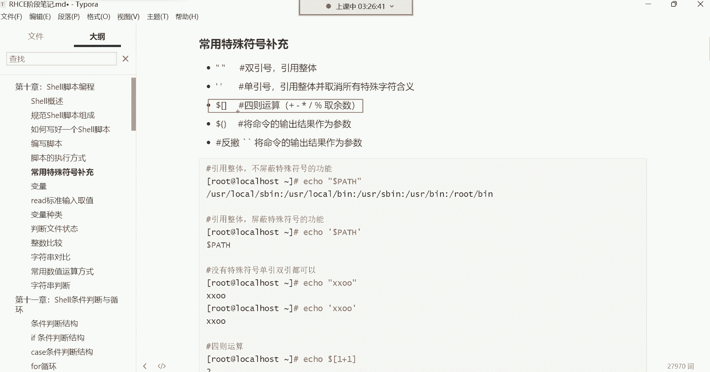

因此，当你需要引用整体，并且希望其中的变量或特殊符号生效时，使用**双引号**；当你希望所有内容都原样输出时，使用**单引号**。

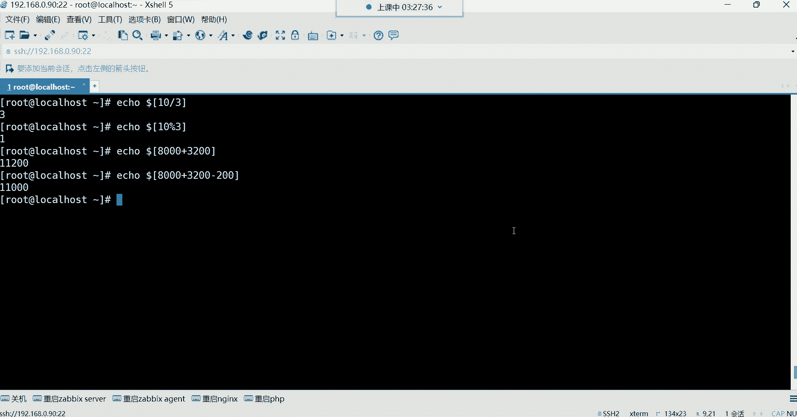

## 常用的特殊符号：四则运算

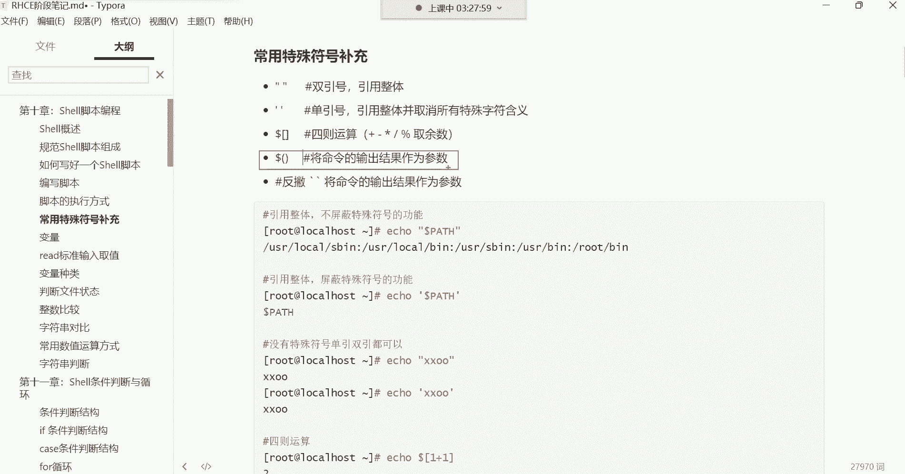

在Shell中，我们也可以进行数学运算。最常用的一种方式是使用 **`$(( ))`** 结构。

以下是基本的四则运算示例：

*   **加法**：`echo $((1+1))` 输出 `2`
*   **减法**：`echo $((2-1))` 输出 `1`
*   **乘法**：`echo $((2*2))` 输出 `4` （`*` 是乘号）
*   **除法**：`echo $((10/3))` 输出 `3` （只取整数部分）

除了基本运算，还有一个重要的运算符：**取余（%）**。

*   **取余运算**：用于获取除法运算后的余数。
    ```bash
    echo $((10 % 3))
    # 输出：1
    ```
    这个运算符在后续控制循环、生成序列等场景中非常有用。

## 常用的特殊符号：反引号与 $()

本节我们来看看一个非常强大的功能：**将命令的输出结果作为参数**。这可以通过反引号 **`` ` ``** 或 **`$()`** 来实现。

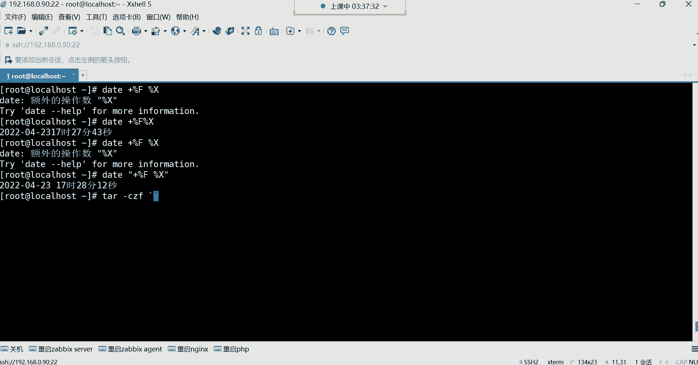

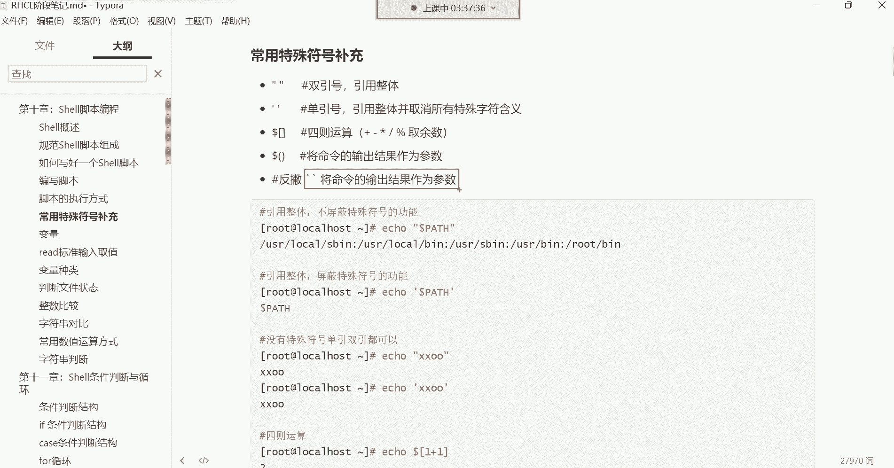

它们的核心作用是：先执行反引号或 `$()` 内部的命令，然后将其**输出的结果**替换到外部命令的相应位置。

一个典型的应用场景是：在备份文件时，将当前系统时间作为文件名的一部分，以确保每次备份的文件名唯一，避免覆盖。

假设我们想备份日志文件，并希望文件名包含备份时间。

**错误示范**：直接拼接命令是无效的。
```bash
# 这会把 “date +%F” 这个字符串本身作为文件名的一部分，而不是命令执行的结果
tar -czf backup_‘date +%F’.tar.gz /var/log/*.log
```

**正确做法**：使用反引号或 `$()` 获取命令结果。
```bash
# 使用反引号
tar -czf backup_`date +%F_%T`.tar.gz /var/log/*.log

# 使用 $()，这是更推荐的方式，因为它更清晰且易于嵌套
tar -czf backup_$(date +”+%F_%T”).tar.gz /var/log/*.log
```
执行后，会生成一个类似 `backup_2023-10-27_14:30:25.tar.gz` 的文件。每次运行都会生成不同的文件名，完美解决了备份文件被覆盖的问题。

**`$()` 和反引号的功能完全相同，但 `$()` 更易于阅读和嵌套，是现代脚本中推荐使用的写法。**

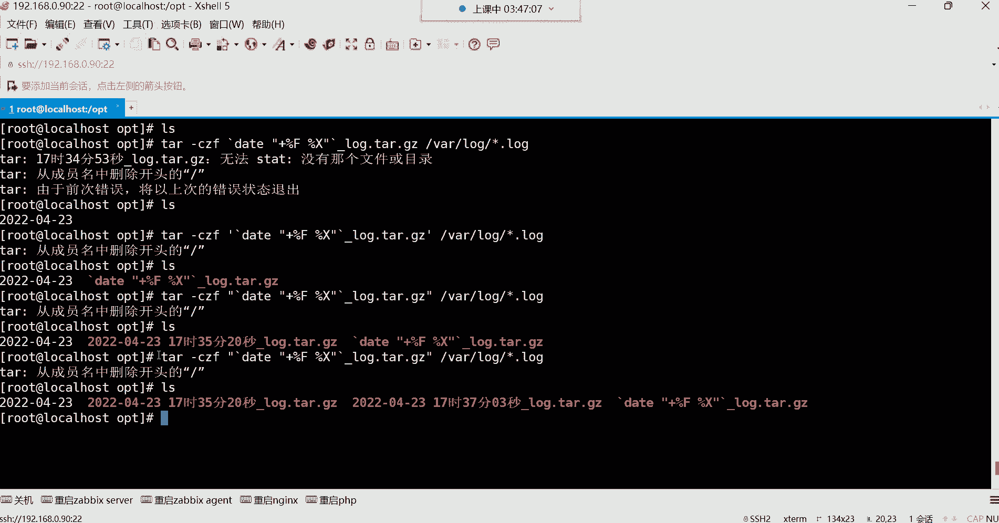

---

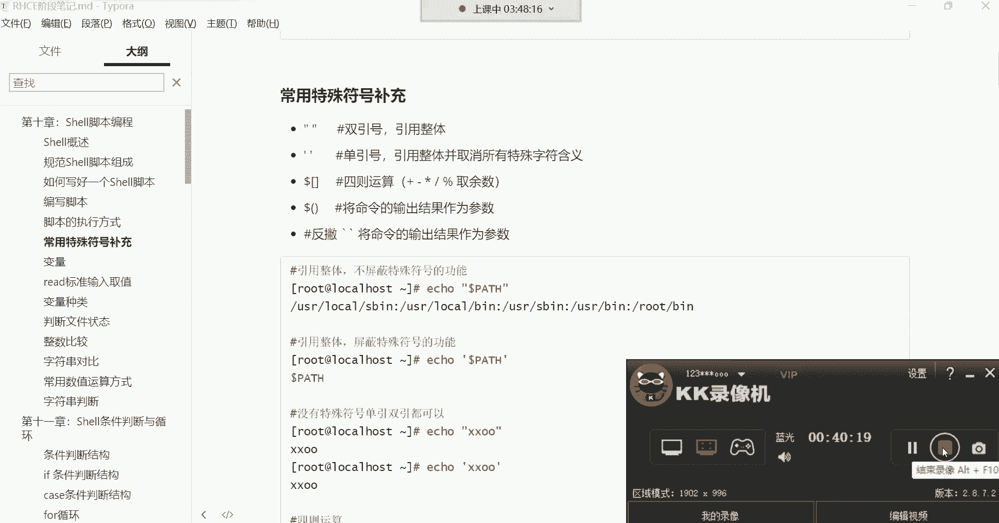

本节课中我们一起学习了Shell脚本的两种执行方式，并深入探讨了引号（单引号、双引号）、四则运算符号（`$(( ))`、`%`）以及命令替换符号（反引号、`$()`）的功能与用法。理解这些特殊符号是编写高效、可靠Shell脚本的基石。