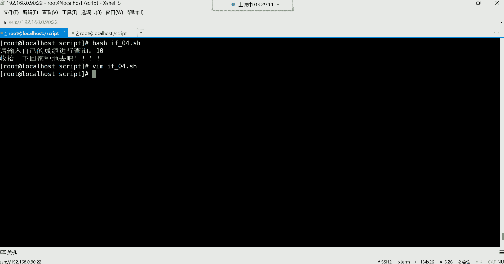

# 【小白入门 通俗易懂】全网最全RHCSA+RHCE教程，一周快速进阶Linux运维 - P42：红帽RHCE-6. if判断、if单分支、if双分支、if多分支 - 网工小程立志不加班 - BV1PN4y1R7uU

好接下来呢我们就开始讲这个讲这个if判断了，那if判断跟我们填前边讲的那个这个条件判断，其实他们干的事是一个事儿，当条件满足的时候，他执行什么操作，条件不满足的时候，他又去执行什么样的操作。

那么来看看if，那if的话呢，它比前面的那个前面这种条件判断啊什么，并且或者它比较简单，哎它的功能呢就是有限，适合去一些简单的逻辑，你可以用它去什么呢，去实现简单的逻辑啊，如果复杂的逻辑的话呢。

那这个我们就得用这个if了，那这个时候我们这个对于这个义务判断的话，来了解它的三种语法，第一种呢第一种语法结构叫什么，叫做if的单分支判断，那单分支它的特点就是只能判断对，不能判断错哈哈。

那这个有点意思是只能判断对，不能判断错啊，也就是说只能在条件成立的时候，他才能帮你去执行他的语句，能理解吧，如果你的条件失败呢，那就不执行了，好来看一下它的语法，if单分支的语法哈。

if然后呢这个位置是你的条件，你的条件放到中括号里面，因为我们前面学过很多的什么，判断文件状态是不是啊等等等等，什么做数字对比，这些都可以当做if的条件啊，比如说我看一些这个什么呢，看一些这个文件啊。

比如这个文件如果存在的话，那我做什么事情，如果文件不存在，我做什么事情，这就是你的条件了。

然后它的语法后面的那个燃啊燃，我们来把这语法拿过来哈。

来演示一下这单分支啊，两种语法。

然后我们回到我们的那个路径是script路径，然后进来之后呢，我们自己编写一个啊判断啊，if一点SH啊，if零一点SH好，在这里边井号叹号杠定下的batch if，然后空格条件。

判断条件是不是在中括号里面判断呢，啊一般我们怎么判断呢，比如杠F判断一个文件啊，哪个文件呢，比如我看OPT下边，这个文件有没有一个叫什么呢，叫啊我看我第一个是怎么判断的哈。

来一个入门级别的啊，判断这个文件在不在，然后给我输出一，然后给我EQ优化，也可以看phone etc下的pass wd的文件。

我们是不是判断这个文件它的状态呀，这个文件存不存在呀，如果存在的话，是不是条件就成立了呀，成立以后呢，它的这个语句看哈，你可以这样写，后面呢这个然然不就是然后吗，然后做什么事情。

然后就是你要执行的命令了，这里边缩不缩进都可以，为了语法的美观，我们做个缩进EQ一个EQ什么存在存在，然后接下来判断结束了，判断结束的话就是FI代表语句的结束啊，if代表语句的开始。

然后FI代表语句的结束，然后这里边有我的判断的条件，如果条件成立了，咱啊咱就是然后的意思就这个条件成立了，然后我执行这条命令，然后我的判断就结束了，那那这个第二种语法是这样写的，if中括号啊。

这是你的判断etc的pass dd，然后第二种语法你可以怎么写呢，这样把咱写到这个位置，好那你说我写到这个位置，前面那个空格干嘛，有什么意义吗，没有意义，你加不加缩进都行，但是我们为了语法的美观。

一般搞个缩进能理解吧，搞个缩进，然后接下来，然后就开始执行你的操作呗，那就你要执行的命令，啊echo就是说存在，然判断结束了，那你们觉得哪个语法，就是让我们看起来更加的呃，觉得更加的舒服一些。

他这不是两种语法结构吗，是啊第二个吗，你们觉得啊第二个看着舒服点是吧，好习习惯用这第二种是吧都行，效果都一样都一样哈，嗯都行都可以哈，缩进怎么缩都可以嗯，还有人说第一种是吧，没关系啊。

其实最常用的是第一种，知道吧，最长的是第一种哈，然后咱们保存退出，然后来看一下，执行一下，好点杠，if f01回车，看到了吧，是不是存在呀，那如果我给它改一下，怎么改呢，好亮，我换一个不存在的文件。

你看他还能给你判断吗，比如说ABCD，回车诶，你看他没执行，什么意思呢，就是条件不对，条件不对，它就不执行，所以这种预if单分支它只能帮你去干嘛呢。

判断队不能判断错，那你说这东西哎哟那不行啊，那你光判断对不判断错，那是肯定不行的呀，是不是啊，嗯所以有的有的时候，你就比如说我们前面安装软件包的时候，你说我安个包，如果用if的话。

是不是我先去看一下这包到底在不在，如果在的话，你再给我去安装后面的这个在过，执行后面的操作是吧，如果不在的话呢，呃那又该做什么样的操作，那if哎它可以实现，就在在条件成立的时候，我做什么操作。

在条件失败的时候，我在做什么样的操作，这个我们得用它的第二种语句叫做双分支，诶，等一下哈，怎么卡了呢。

我跟你们讲哈，现在对于室友脚本来讲，你们学习是有脚本，大多数都是去改别人的脚本，没有没没有多少脚本是需要你们自己去写的，为什么呢，因为大多数脚本别人已经都有现成的了，你们只需要去根据自己的需求去改吧。

改吧就可以，你就比如说我昨天刚写一个脚本。

我昨天写了哪个脚本呢，就是一个自动发布项目的一个脚本啊。

当然这是在后期你们会这个学到的一个内容，那个内容叫什么呢，叫做CACD啊，就叫持续集成与持续交付，哎这里边我昨天写了一个脚本，这个脚本呢非常的简单啊，这个这个脚本叫JENDEPLOY，点SH。

这个脚本呢其实后期大多数大家都是去改，都是去改哈，你看这脚本就非常的简单，怎么简单呢，前面应该都能看懂吧，是不是啊，然后接下来呢这是什么呀，变量变量名是吧，叫web dr，那这个变量名里面装的什么呀。

唉装的是路径啊，装是装的是一个路径，那第二个呢是不是也是变量名啊，好那这个变量名这个变量名里面装的什么呢，哎也是一个路径，看到了吧，然后那下边这儿还有一个变量名，这个变量命中也装的是什么呀，唉也是啊。

这是一条命令，这个命令是获取什么呢，系统时间的获取时间以后把时间存起来，存到变量里面了是吧，然后接下来看命令开始切换，切换到哪里呢，切换到这个变量名定义的这个路径下边，是不是。

你看我说切换到这个路径下面，其实不就是等于说切换到这个路径了吗，是不是啊，哎切换之后干嘛，并且并且啊只有切换成功之后，我才能执行后边的命令吧，哎得先进去，然后再执行打包看了吗，他打包干嘛呀，打包哈。

对文件内容打包，点星代表当前路径的所有啊，把所有内容给他打包，然后打包到哪里呢，达不到一个路径下边，然后打包以后叫什么名字叫Y吧，然后呢什么呀，哎每道菜每道菜是谁呀，是他是不是，那它不就是一个时间嘛。

这个时间就是获取当前系统的一个年月日小时，分钟秒的一个时间啊，比如说我这个打包以后的文件名字，要附带我当前的系统时间，然后点ta点TZ，这是文件的名字是吧，你看这里面是不是变量。

然后接下来呢for循环啊，这里面有个有for循环，我没有讲到for循环是吧，for循环我们后面会讲for循环，就是开始帮我循环执行这里面的语句，看到了吧，这里面的语句，那SSH去连连哪个机器。

这里面哈连哪个机器，然后做什么操作CD，然后切换到路径，然后创建目录，看到了吗，这些一系列的东西，其实后期就是你改你改别人的东西，不是说让你上去就噼里啪啦自己敲，你很你学脚本，我跟你讲哈。

在你近几在你对于脚本来讲。

近几年你都不会能够写出一个非常香的脚本来，知道吧，嗯也用啊，不用引用。

就是这种东西你就满满足你的需求就可以，嗯一般shell脚本在哪里找是吧，有资源网站吗，没有资源网站，没有资源网站，等你自己去网上搜吧，用什么脚本去百度，去百度搜，那没有办法呀，是不是啊，那那有什么办法。

啊那也有办法，也不是没有，后期呢嗯我也会给你们嗯，后期我也会给你们发一些脚本，这些脚本都够你们用的了，这这些脚本都是我从网上扒来的啊，但是这个都是非常实用的，改吧改吧就行啊。

这里面有109个shell脚本合集，看了吗，109个，这109个的话，你想想那平时我们说工作中能不能用得到呢，当然能了，你看这里边是吧，都有什么呢，叫DDOS攻击防范的自动屏蔽攻击IP地址，看到了吗。

这里边你比如说有人攻击你了，有人有人攻击你们公司的网站了，你看上来这脚本是吧，别赖名里边是什么呀，不就是时间吗，是年月日小时分钟秒啊，但是他那没有年月日啊，就是小时分钟秒，然后说变量变量里面定义什么呢。

一个文件哪个文件，access的log叫访问日志的一个文件啊，接下来下边这个变量名是吧，这是不是都是变量名啊，然后里边什么取命令结果是不是啊，你看每刀小括号是不是一直一直到这儿。

是不是要取这个命令结果呀，那取这条命令结果存到这个变量里边，是不是啊，接下来开始做什么呢，唉开始去循环啊，循环里边会调用一些这个变量啊，做一些事情啊，下边等等等等这一系列的东西哈，后期你学完以后。

你只要能看得懂就可以了，然后再改，然后去改吧，改吧别人的脚本，这就算是不错了，你能改明白对，你能改明白就不错了，但是呢没关系，慢慢改呀是吧，改多了不就会了吗，你刚开始你说好，我改不明白，那后期你改多了。

自然而然不就会了吗，是不是啊啊所以这些东西后期我发给你们，你们参考啊，工作中，比如说这个有哪些需要用的啊，到时候可以去参考参考行吧，嗯参考参考，看了吗，这里面哈查看网卡实时流量的。

这里面叫查看网卡的实时流量，那这脚本我们能不能用呢，我也不知道是不是拿过来，我先看一眼，复制，复制呢，这怎么不能复制呢。

CTRLC啊，然后拿过来我们搞一下试试哈，叫这个什么呢，这个叫让它叫network network，点SH粘进去啊，粘进去，然后在里边改一改啊，改什么呢，它过滤网卡流量，是不是啊。

你看这里面等于等于DOTA1，那这DOTA1是不是，他得让我们给他输入一个什么呢，一个值啊啊，然后echo gue啊，什么in跟ALIN就是入out就是出啊，就是入口跟出口。

然后where true开始循环循环过滤过滤谁呀，哎过滤这个变量名是不是啊，那这个变量名里面存的是DOTA1，那这个dollar1啊，这刀了一这dollar1我们应该怎么给是吧啊，我看怎么给哈。

这DA1他肯定是过滤这个网卡的入口流量，出口流量啊，我看一下哈，这玩意儿怎么给呢，嗯先执行一下哈，给他一个执行权限，加个X啊，有了执行权限了，我先执行这个脚本network，然后后边跟一个，我看看啊。

那个叫，这个，if config e n s32啊不行。

它不是这样用的啊，我看它里面有没有告诉怎么用怎么用啊，这玩意儿。

嗯啊直接跟名字看一眼哈，直接跟名字呃，直接跟名字，那就不用敲命令了，ENS32回车啊，可以你看是不是可以用这过滤网卡的入口流量，这是出口流量，我们这有吗，没有啊，入口出口，但它是一直循环啊，它是死循环。

它不停一直一直在帮你过滤，看到一秒钟过滤一次，一秒钟过滤一次，然后这样你可以看到我网卡的好in就是入口，然后这个out就是出口，看到了吧，这种东西以后，比如说我们公司服务器，我发现这流量啊被占满了。

是不是啊，那到时候看一看现在的带宽啊，到底是达到多少了啊，每秒吗，你看每秒的入口流量能达到多少，每秒的出口流量能达到多少，是不是可以这样看一看呢，啊但是我们现在没有任何的支出啊。

所以你看脚本这东西你到时候可以干嘛呀，是不是咱们说就是看看别人这个东西它怎么用，是不是啊，然后自己不就借鉴一下，不就完事儿了嘛，不是那这种东西你要自己想写出这么一个东西，其实那可能得需要点时间啊。

也可以，但是得需要点时间，能理解吧，呵呵啊，但是他这个E啊，我直接输入网卡名，那它是我看他这里面怎么获取的AWK，嗯VR true wk打印啊。

它是直接获取的网卡啊，行简单了解一下哈，就是这种东西，你们知道。

你以为你们学完以后，你们自己可以写脚本了啊，那是不可能的，知道吧啊那是不可能的，就是借鉴别人的，然后拿过来改吧改吧，那你说就像刚刚那脚本，拿到别的服务器可以用吗。

你发现这拿到别的服务器是不是也可以用啊，是不是拿给别人也可以，也可以打击到你了是吧。

不很正常，这东西就是很正常，你只要会改就行，你不需要去自己去写，能理解吧啊这好，那接下来我们再来说这个if的双分支，if双分支的话，在这个里边它既能判断对，又能判断错，然后它的语法格式。

是这样子的。

我来一个if02哈，if vm if02点井嗯，井号叹号杠并下的batch，然后接下来if条件，我这个条件是什么呢，还是判断那个文件杠F判断哪个文件呢，OPT下面的ABCD点TIT点TT啊啊。

接下来是我判断这个文件存不存在呀，啊那这个判断以后是不是会有两种结果，第一种就是存在，那存在的话呢，存在的话它就执行这个than后面的语句，那than里面的语句你写什么呀，比如我EQ一个存在，存在好。

那第二种结果，这文件就是不存在，不存在怎么办呢，好不存在，我们，这个让它美观一些哈，我们做几个缩进，如果不存在呢，加一个叫else else，就是当条件不成立的时候，它会执行else里的命令。

如果条件成立，执行than里面的命令，所以你发现if if单分支的时候，他没有else，所以说就是他只能判断对，不能判断错，只有条件成立的时候，它执行then里面的语句啊。

所以咱这个东西就是条件成立的时候，它会执行的命令，它是执行咱里边的命令哈，如果这个失败了，那就执行else里面的命令，他是这样子的，所以说我现在再加一个条件，else else就条件失败怎么办啊。

条件失败，我们建文件touch，可不可以在OPT给我建一个ABCD，点TT出来是吧，然后FI结束，这样你看就是如果这个条件是成立的，那就执行这条命令，如果不成立，那就执行这条命令。

那你说这个命令只能执行一条吗，不是这完以后还可以接完写哈，你自己再加个echo，比如说我在echo一个文件创建成功嗯，文件创建成功，是不是可以哪个文件啊，就是这个ab abcd点tat，文件创建成功。

然后来看效果哈，存储mod if02，加一个X，好然后接下来执行它if02回车是吧，那你看OPT有没有内文件呢，是不是ABCD点TT啊啊，我们再这样再把这个OP的目录给它，清空OPT下的星。

然后接下来再执行这个脚本哈，if02回车，你看那他现在，嗯对现在就是编程啊，现在就是编程，你看他现在就是在干嘛呢，就是在判断呢是吧，判断这个路径下的文件到底在不在呀，是不是。

那他判断以后他发现诶这个路径文件不在呀，不在的话，这条这条这个栏里面的语句，是不是就没有执行呢啊，那没有执行怎么办，没有执行没关系，唉如果条件失败的时候，哎你给我执行else里面的语句，给我去创建它。

那那有了衣服的话，那它比前面的那个简单的条件判断要给力的多，上来，我想干嘛呀，嗯我先我想安装软件包，如果说有了双分支的话。

我想安装软件包的话，那这里边哎这个安装软件包。

那其实就方便的多了，我现在想安包，那我不知道这包在不在是吧，那这时候怎么办，判断一下吧，是不是可以判判断哪一家呀，怎么判断呢，rpm杠Q啊，查vs FTP，查他诶，那你说这样查，我把命令放到这儿可以吗。

我们来看看啊，这里边来查询这包啊，存在啊，如果失败，我们echo一个，我们先先先先不做别的事情，我们就先这样，我们就EQ一个啊，第一个是存在，第二个是如果失败的时候就不存在呀，啊不存在不存在啊。

保存退出，我看这样可不可以执行哈，你看可以你看哈哈哈还可以哈，你看他把那个命令也给你执行了一下，把哪个命令呢，他把if判断里的命令也给你执行了一下，看到了吗，把这个包给你显示出来了，是不是。

比如说这里边后边也不是说只能放条件吧，啊也可以放命令，但一般我们放命令也不这么放，怎么放呢，我可以这样玩，就是哎把命令也放到条件里边，放到条件里哈，那放到条件里边，这东西怎么玩呢，我们做对比做对比哈。

就是这个我先把这个命令的结果给它引起来，给它引起来，这里边放命令没有任何问题，引起来啊，引起来之后我这边当然留空格啊，这部分要留空格，我引起来之后我这样啊，我判断怎么判断呢，杠这个EQEQ是不是等于啊。

等于什么呢，等于零等于零等于零的话是什么意思呢，就是这条命令执行完以后，如果等于零，是不是就等于查出了这个包，它是存在的呀，没错吧，那这时候他是不是这个命令就不会显示出来，它的结果了呀。

唉我自己却在内部判断看效果哈，好这个时候来执行一下哈，这是我看一下哈，第二行什么意思啊，这是rpm杠Q啊，取出来的结果，啊那我不这样玩了哈，我不这样玩，最好的方法怎么玩呢，放变量不放变量哈。

不那样玩了哈，这样比如说那个什么呢，这个随便啊，就是这个I等于把命令结果先给它取出来是吧，RPM杠Q是吧，vs FTP d取出来啊，取出来之后呢，我再这样用谁呢，用每到I哎，每到I杠1Q如果等于零的话。

这样是不是可以啊，哎我这里面不直接放命令了，我把命令结果存到这个变量里面，然后我直接用变量的值跟他做对比，是不是可以，啊那这个值不对呀，这个值的话我是不是还得问他一下呀，问他以后才能对呀对啊。

所以这里边在echo啊，就直接每到问就可以到了，问，啊不是啊，这玩意儿，我看哈这个上边这个命令是这样的，并且这样，然后每到问号是这样的哈，啊执行完命令以后，我再问一下它的结果，那么这时候再没到A，到A。

唉唉呀，这也不行吗，这这这这这这这也不让吗，你看这语法多，这语法多，别人呢，是不是啊，那这样问吧是吧，那就这样问啊，那不行，你在问谁呀，啊问I吗，嗯这样逻辑对吗，你们觉得，哈哈你看他真行，他说存在。

你看了吗，其实他问的这样，他也是在问谁呢，就问善意条命令，啊但是这样不是很准确，如果你上边你说我们再有一些其他的命令存在，怎么办呢，再有其他命令存在，它可不一定是问这条命令了。

有可能是问他的上一条命令是不是就这样，不是很准确哈，不是很准确，最好就是嗯，刀了问，然后这里边我们再想办法让他干嘛呢，让他直接针对于每到I去问，是不是啊，针对于每到I问，每到I，对那行，先不研究它了啊。

先不研究它了，先不管它了，这里边儿你发现一个小小的判断能给你搞蒙了，很复杂的，这里边儿好，我们说这个继续说这个双分支哈，哎这双分支，然后你看下面的话呢。

这里边是不是它既能判断对，又能判断错呀，没错又能判断对，就能判断错，那接下来我这里边好，我们现在有个需求，比如我想编写一个猜数字的脚本，猜数字什么意思呢，就类似于那种这个比如说你这个猜奖一样啊。

如果猜对了的话啊，我给你干嘛呢，给你输出一些内容，猜错了我再给你输出一些内容，那这时候我们怎么办啊，怎么写这个脚本，那如果你想实现这种猜数字的话，那其实呢啊就是主要是练习一下我们这个if啊。

它的一些判断，这时候我们得猜数字，我得需要一堆数字，是不是啊，哎我得先干嘛呢，我得先让计算机产生一个随机数。

那随机数的话，比如说我就我把这个数字控制在0~9范围内，0~9的范围内，那这个范围我怎么控制啊，这个范围，而且每次它产生的数据产生的数，0~9是随机的吧，你不能控制一个固定的数。

是不是唉每次随机随机的去给我输出，0~9之间的某一个数字，那这个怎么来获取这个随机数呢，所以在系统里边它有一个叫做random啊，有个环境变量，因为，Random，我们找一找哈，这里面能不能看得到啊。

过滤一下哈，NV管道给grape，random啊，怎么没有呢，那就在div下边，然后，random啊，那就是它啊，它是一个什么呢，它是一个设备文件，这个设备文件它的功能是什么呢。

它的功能是会帮我们输出随机数啊，这个随机数它有一个变量名，环境变量里面有一个叫做random啊，这里面没有看到啊，啊没有看到，算了吧啊，其实如果你想看的话，还有一个命令叫set，Set。

set是看系统里边这个所有的变量的，这里边能看到那个random random，过滤一下，过滤一下prep，Random，嘿random呢，random呢，诶奇了怪了，算了不找他了，echo每刀。

random回车，看到了吗，你看你一输出的话，他干嘛呢，它会帮我们产生一个随机数，你看我每次输出，你发现这数它不固定，看到了吗，有有大有小吧，是不是啊，诶对它不固定，那这个数不固定的话。

那这时候就是它最大可以到多少呢，它最大可以到6万5535，6万5535哈，那这时候那数字太大了，你让别人猜，那这别人怎么猜呀，是不是，那简直就是这个1/60000的概率，这这几乎不太现实哈。

所以这时候我要控制它的范围，把它控制在多少呢，控制在十以内啊，0~9，那怎么样才能控制到十以内呢，哎我对这个每次产生的随机数干嘛呢，哎取它的余数，是不是可以把它的余数给它取出来，没错。

那这时候怎么取余啊，就是我们那个加减乘除里的那个dollar符，是不是啊，然后取于百分号取，那这个鱼我对它取看看。

这时候你得指定他每次产生的数，他每次产生的数，然后针对于谁去取呢，哎十没错哈，针对于十，所以这个后边你要写十。

这时候你在每次获取数的话看到了吗，你看他每次是不是都是随机的呀，但是他这个范围是不是从0~9之间了呀，哎你说为什么他不超过十呢，为什么不超过十呢，因为呀他如果一旦超过十了，是不是就除开了呀。

是不是就变成零了吧，是不是，那它取的是除除不尽的余数啊，嗯是不是啊，所以这里边你要明白一个道理，就是它取出来的这些余数，它永远都是要小于它的这个被除数的，那它的余数永远小于它的这个被除数。

如果等于如果等于这个十的话，是不是就除开了，除开的话是不是就应该是零了呀，是不是啊，啊所以它永远是小于被除数啊，那也不可能大于，好，那接下来我们就通过这种方法，是不是就可以取出控制这个随机数的范围了呀。

那控制之后呢，那这脚本怎么写啊，这里边参考一下哈。

在那边这是好久以前写的了。

这个时间不长，也容易忘了这种东西，时间不长，我跟你讲脚本这个东西啊，它就像我们平时学习命令其实是一个道理，命令你时间不时间长不敲，你发现哎呦容易忘是吧，记不起来脚本也一样，脚本时间长不写。

你也这个逻辑也跟不上啊，接下来这个思路就是什么呢，第一用瑞杠P，我们是编写一个让别人猜数的脚本，那这时候这数字是不是得让别人猜啊，那让别人猜的话，这里边你得获取用户的键盘上输入的那个数。

所以瑞的钢P让他自己输read杠P，你自己输入输入字就行了，然后我告诉你哎，范围请输入0~9之间的一个数字嗯，数字，然后接下来啊，如果，猜对了嗯，奖励啊，奖励什么呢，奖励哇塞女孩儿是吧。

哇塞女孩是不是可以啊，哎这样别人才有这个才有什么呢，才有这个兴趣去猜，然后number啊，数字让别人他拆完以后，是不是把这个值扔到这里面了呀，啊他猜什么，这个里面就是什么，接下来判断啊，条件判断。

先把语法结构给它写出来，WIFI那这里边，我们判断什么，我们现在要判断用户的数，跟我每次的随机数是不是相等，是不是啊，那上边还得再来一个什么呢，变量名是吧，嗯number1等于等于什么呢。

就是命令行里面的那个随机数，每次我是不是得把这个随机数存起来呀，你看每次他对十取余的数，我存到变量里面，那接下来我拿这个变量里的数，跟用户的这个输入的这个数做对比做判断，那这时候是不是就比较简单了呀。

哎这里面就是刀了，然后再跟谁做对比呢，哎再杠EQ再跟这个刀了number1做对比是吧，如果它俩相等，EQ是不是就等于啊，如果相等的话，那干嘛呢，哎我们就给你EQ一个，你猜对了，嗯就是恭喜中奖，恭喜中奖。

嗯然后奖励哇塞女孩儿，是不是啊一个啊作为嗯奖励瓦特女孩，作为做一天嗯，所以一天的一个，恭喜中奖啊，奖励哇塞女孩呵一天，嘿嘿嘿嘿啊，可以使用一天，他说那好，这第一个哈奖励一半女孩天使用一天随便哈。

哇塞女孩一枚啊一枚吧，是不是，那他如果没猜对呢，没猜对怎么办呢，说一这个else，else对这这就是说白了就否则了是吧，你猜对了我然后是吧，你猜不对我就否则了，否则我就echo一个猜错了，猜错了。

猜错了，然后这个嗯啊哇塞，女孩正在等着你，正在等着你，是不是请继续努力，继续努力努力，唉哒哒哒，当当当好说可以，然后要不要告诉他正确结果呢也可以，下边你再把正确结果告诉人家一下。

不然人以为你这里边有一些猫腻呢是吧，好echo告诉你一下啊，就是本次嗯对本次猜奖，猜想的正确结果为有多少呢，为每到number1是吧，是不是它呀，它产生的数就是正确结果，然后他们两个做个对比，是不是。

然后好保存退出，让我们来看效果哈，给他一个，我们就不给执行权限了，直接batch执行了，if03好回车，这时候现在是不是开始猜了呀，啊0~9之间的数字猜对了就奖励哇塞女孩，接下来我现在来一个八回车。

猜错了啊，这是与哇塞女孩无缘呢，好那再来一遍，再猜猜几猜六回车啊，又猜错了是吧，没看到吗，又猜错了，这又与它无缘，是不是，哈哈哈哈哈啊，回车，看来今天是雨霸三女，看来今天是与哇塞女孩确实是无缘哈。

五哎哟，中奖了，看了吧啊，但是这个确实是得需要靠次数才可以了哈，这就是呃通过什么呢，通过义务判断啊，主要就是演示一下，他能判断对，也能判断错，是不是挺不错的。

判断对，有判断错，然后这里面又掺杂了一些，我们前面讲的那个什么呢，这个一些这个就是条件判断，然后除了条件判断以外呢，又掺杂了一些我们前面讲的这个就是加减乘除，取余啊，他们的一个应用啊。

都可以放在脚本里面，所以条件判断是，所以说if判断它是离不开这个你给定的条件的，然后你给定条件的时候，我们最方便的就是通过变量能理解吧，哎把你要这个判断的东西放到变量里面。

然后到时候通过变量去帮你判断啊，所以这个你看我们前面学的那些零零碎碎的，是不是到这里边就感觉诶派上用场了啊，好然后这是我们这个参数是吧，这里边哎呦这个删掉吧，这种东西一看这雨哇塞。

女孩这缘分太浅哈哈太浅哈啊，然后下边哎这个安装软件包啊，我看我上次是怎么写的哈，刚刚没实现啊，这时候你看我就是把命令放到这个，放到这个条件判断里了，然后是这样子的啊啊啊是这样的啊。

ICO的一个美到问看到了吧，那那其实是可以这样玩儿的。

就是我们像我们前面写了一半是吧。

感觉这逻辑上有点过不去了，那我们再回到刚刚的那个if02这个脚本，我们现在比如说我就想去编写一个，安装软件包的一个判断脚本，那这时候我这里面是直接把命令写到这个，判断里面了。

那你我们也可以直接搞一个什么呢，呃就搞一个这个搞一个变量rpm啊，或者说那个叫叫什么都行哈，啊就rpm吧，等于这条命令判断这个包我在不在那，判断完之后，这结果呢一般不要啊。

不然他把结果嗯啊其实也可以这样，唉那就简单了哈，我们可以这样，各位你看咱们前面这里边写命令了，是不是，然后他把命令给我输出出来了，我不要输出是不是RPM杠q vs FTP d，然后干嘛呀，唉结果不要。

不然他把结果给你输出出来，那我们不想用那个结果扔掉，扔到DV的黑洞里面，是不是啊，是扔到黑洞之后呢，你看这里边我用个分号啊，我是用分号隔分号隔开了，啊那这样还是相对简单一些吧。

然后接下来呢就echo每到问每到问问结果呗，啊那这个也不行，他们是一起的哈，都引到一起，每到问号，然后问我的上一条命令，它的执行结果是不是啊，啊，那一直到这，就是说这条命令其实我是不是可以放在前面。

定一定一个变量啊，没错吧啊其实可以给它定一个变量，如果你觉得这样看起来有些不美观的话，就这样，rpm等于还这样，然后这里边儿判断的话呢，我们让它变得简洁一些好，那这时候我在干嘛呢，在判断啊。

如果说这个rpm嗯，杠EQ如果等于零的话，然后是不是就这个存在或者说不存在，这样是不是就可以了呀，没错吧，哎这样就可以了，然后来看一下效果哈，执行if02回车，哎你看是不是可以，那我现在把包给他卸掉。

杠e vs f t v d，我在执行啊，回车还不存在，是不是，这个括号。

啊括号是做条件判断的，咱们前面学了这么多判断，你看什么字符串，判断是不是全都在这个中括号里面执行的呀，你不带中括号，它就是所有的判断都得放到中括号里面。

但是你这里边中号里边你的判断放什么，那是不是我们最终就看自己的情况了，那这里边我是不是可以用变量啊，没错吧，其实也可以直接去引用命令，但是呢引用命令不美观啊，所以还不如像这样，像我这样哈。

像我这样直接干嘛呢，唉直接去通过变量名称，在这里面看起来更加清晰一些判断，那这时候我判断之后，你看那存在不存在，那不行干嘛呀，哎我们要实现一个就是给我安包，没错吧，如果存在的话，是不是就不选A了。

如果不存在呢，不存在的话，那下面我们来开始哈安装软件包，EO一个，告诉他哎正在安装软件包vs FTP d软件，那接下来我们是不是就在这用YM杠y in套，安装vs f t v t，是不是安装完以后。

接下来呢再把服务起来是system mtvs f t v t，然后再给它设置成随机字写，那这里边我可以这样啊，并且是不是可以这样，那这命令是不是可以放到一起了呀，是吧，安包并且起伏，并且。

是服务随一字起，没错吧啊就这样，然后再并且看服务状态，然后FI结束，FI结束，那这些结果我是不是可以不要，我是不是啊，咱留着吧，看一看是不是看看结果，来啊执行一下1F02回车，唉，不存在是吧，不存在。

就正在安装，然后就来开始给我安，按完以后，你看起服务是不是连服务都起来了是吧，看状态，啊这就是这个我们说的这个判断啊，判断就是你看我这里边，如果说第一步其实存在的话，我这里边是什么呢，直接起服务了。

那如果第一步判断成功了，就是这包存在的话，是直接起服务，设置服务随机自启，然后这些结果呢就不要，然后最后我们echo一个叫软件包已安装，并设置随机自启阵容也可以，只不过这种事更加人性化一些，你看哈。

如果我们是这样的话，如果这包存在的话，但是呢他可能没有起伏，是不是啊，哎我们可以在在这里边看执行一些啊，就是他这个存在的一些相关命令，它存在以后，我希望干嘛呢，我把这个命令拿过来启动它的服务。

并设置随之起，这样是不是可以啊，但是这个结果我都不要啊，每次执行完命令之后啊，什么启动服务，启动服务一般没有返回啊，事服务随之起，一般它会有一些返回值啊，那要不要呢，不要扔掉，扔到第一V的黑洞里面。

然后接下来啊再看状态，那就别看状态了，是不是就变成状态了，就直接下边再告诉别人EO一个嗯，这个软件包啊，这个服务已启动好，vs FTP d服务以启动，然后下边那如果不存在呢是吧。

不存在就告诉别人正在安装软件是吧，然后下边就开始安倍安的话，这结果要不要呢，这结果也不要太多了是吧，直接扔走，扔到DV下的黑洞里面，然后再去给我起服务，设置服务随机自启，那看状态，状态也不看啊。

最后呢再告诉别人，唉这个服务已启动，是不是可以，啊为了美观，我们可以干嘛呢，唉可以让它缩进对齐，是不是啊，这样就可以了，OK然后保存退出，我们现在给他包卸掉，rpm杠1vs FTP，好然后开始整脚本。

if02走，你啊正在安装是吧，那这个过程是不是没有什么输出啊，这里面有个，有一个输出输出，我们可以也不要哪个呢，就是随机自启，这个随机自启有个输出也不要DV的黑洞，是不是啊，然后杠一卸掉。

啊这是在执行好啊，正在安包，啊是不是你看正在安装，然后服务已启动，这样就可以，啊可以套衣服嗯可以套衣服，然后对中括号就是判断的if可以哈，衣服里边套衣服，但是你刚开始的时候，你你逻辑是乱的。

你可能不是很好理解，能理解吧，那如果有报错也没提示，如果有报错，他也不提示了，这种的话，我们把所有的输出是不是都扔了呀，那有报错它也不提示了，但没关系，你最后如果你担心的话，你可以干嘛呀。

咱们看个状态是不是，并且看个状态，EQ以后，那你说我echo以后，这里边我是不是就可以在干嘛呀，再去这个system mo TTS，然后看一个状态，这样是不可以就放心了吗，啊这样这样也可以看状态是吧啊。

但是他已经启动了哈，这是第一个if里的语句，我们卸掉，是吧，这样就没有问题，看个状态来看running了，好可以了，就这样。

啊这是一双分支，双分支就是既能判断对，又能判断错，那接下来还有什么呢，还有一个叫多分支，这是双分支，是不是啊，然后我们可以自己去玩一玩，编写一个参参数的，然后呢如果是这个练习的话呢，可以自己去想想啊。

如果安装软件包，我们这种东西你看可以怎么玩，结合变量再结合判断，是不是，那我说最常用的是不是就是这个每到问号啊，唉然后还有这些做数字判断的，这些是比较常用的啊，今天就这样吧，把多分支讲完呢。

哼把多分支讲完呢，呵呵然后这个多分支的话呢，对我们来说一说啊，他呢就是有点复杂了，你看哈他是就是可能说我有很多个条件，我这个条件非常多，就是不是说在对的时候过执行什么操作，或者在错的时候执行什么操作。

可能说我有很多个条件，那第一个条件错了好，那你没给我执行，那我还有第二个条件，第二个条件如果错了，那我还有第三个条件可不可以呢，可以可以哈，嗯就是感觉结果挺好的是吧，对这里边来看看啊啊来看一下哈。

就是我可以放很多条件，第一个条件如果成立了好，我就执行第一个条件里的语句能力吧，好然后那如果第一个条件人家就没成立呢，失败了呢，哎没关系，这有个叫l if啊，l if就是可以继续再加条件啊。

再来个条件二，如果条件二成立呢，就我执行条件二里的这个语句好，那如果条件二也没有成立呢，也失败了，那怎么呢，你可以继续无限下去啊，继续条件三看到了吗，然后条件四条件五无限下去。

那如果以上所有条件都没有成立呢，如果条件都失败了，最后else这就否则了，就否则了，否则就最后执行这个操作，你看它这里边if条件判断是不是判断成功了，然就是，然后所以他这里边怎么理解呢。

你看如果条件成立了，然后我就执行这里的语句，那如果失败了呢，啊对l if，二一步是什么意思啊，如果翻译过来，是不是就是这个那个叫，嗯如果呀是不是如果呀，如果条件二成立了，然后执行这个操作。

如果条件三成立了，执行条件三的指令，但这不是否则吗，这这是否则吧，然后否如果条件都不成立，否则啊，给我执行这个例子命令。

那这里边下边呢，我这里边还有一个编写成绩的一个脚本，这个会用到这个多if这个多if的话。

在这里边如果写的话，你比如说我们编写一个判断成绩的脚本，那这种东西虽然说我们不这种东西，这活虽然说不是我们干的哈，但是用shell也可以实现shell，004点SH井号叹号杠，并且到位置。

那在这里边如果说猜成绩的话，对底下不走了哈，哎我写这个脚本，你们就没，你就明白他这个多if它的一个逻辑了啊，看哈read杠P干嘛呢啊，让别人输数啊是吧，输入自己的成绩啊，啊请输入自己的成绩进行查询。

这时候搞个变量是吧，Number，然后接下来呢开始判断，这时候怎么判断呢，唉这时候我们就是如果用户的那个输入的数，这个如果杠EQ啊，这时候不不能杠EQ了哈，这时候就得，哎呀这是记忆啊啊大于等于啊。

那么就记忆大于等于90，然后，就echo啊，你的成绩非常优秀，成绩非常的优秀啊，这么优秀的孩子，我们奖励啊，一个，这样一个哇塞女孩是吧，哎哇塞女孩，行哈嗯啊奖励一个吧台女孩。

那那如果这个人他的成绩没有达到90分呢，你看我这是记忆啊，是大于等于，就是你看他的成绩是大于90分也可以，或者说等于90分也可以，但是这个人他成绩没有达到90分，比如80分怎么办呢，那如果80分呢。

那是不是这个条件就失败了呀，他不会echo这个命令了吧，是不是啊，那接下来唉多条件的时候啊，e l if叫l if，我们再给你来个条件，那这个条件就是如果说他的成绩，如果说大于等于多少呢，80哎。

那你看这样能跟80匹配了吧，你看大于等于就是80也行，大于80也行，但是他没到90，没有到90啊，那这时候唉然后我echo你的成绩比较优秀，对你的成绩比较优秀嗯，但是没有哇塞女孩，但是唉离。

离是哇塞女孩儿的奖励仅差一步，仅差一步，有点伤心了是吧，然后那接下来，那如果这个人他确实是连80分也没有达到，怎么办呢，那是不是这个条件也失败了呀，那这个语句是不是也不执行啊，好那还有if再来一个条件。

那如果这人比如我考了70多分呢好，那如果他的成绩，他说的成绩是大于等于70分的啊，也包含70，是不是啊，那然后我就echo你的成绩比较比较一般成绩，比较一般啊，还需还需努力还需努力。

这离哇塞女孩儿还差很远，还差很远的距离好，然后接下来，那如果这个人他考了连70分都没有呢，啊，考60分好number，如果大于等于60，那这时候是不是60分勉强及格啊，是不是啊，哎这叫勉强及格。

勉强及格，这就，勉强及格，好那没那60分都没有呢，连及格都没及格的好，那最后50多分，40多分，30多分，20多分都归类到哪里呢，啊最后else这边，但这里边我们一般干嘛呢，哎做两个缩进哈。

else这里边就没有条件了，else就没有条件了，直接echo对你收拾一下啊，回家种地去吧，都没及格，还在城里混啥呀，是不是啊，城里这套路这么深，不太适合你，FI结束好。

那现在来看执行一项PHEF04回车，请输入自己的成绩查询是吧，我输入多少呢，比如我现在输入，你看现在问题来了，我这个脚本里面我这么多条件，他是不是得从第一个条件开始帮我去判断呢，第一个条件是不是。

然后第二个条件报警判断，那如果说我输入的条件是80的话，是不是第一个不满足啊，没错吧，然后第二个满足了他执行第二里的语句，没错吧，那下边还执行吗，下面这两个还执行吗，不它不执行了，它不会执行了哈。

看一下哈，我输入80，我输85回撤，你看是不执行了呀，它这里面就是谁成立，我就执行谁里面的语句，接下来就完事儿了，就下面就不会再去看了，好厉害吧，他下面就不会再去看了，啊他是这个道理，他不是说哎呦。

那这个如果执行完以后，那下面还执行吗，下下面他不执行嗯，他不执行啊，对那这时候你看我在执行好，有时候70回撤，那70的话是不是就跟这个条件匹配了呀，哎没错，跟着条件匹配，因为前边不匹配呀。

是不是跟他匹配了，就执行它这里面的语句啊，别的就不管了，那你说我这个输入77可以吗，我输入77，那77是不是也跟这个条件匹配啊，为什么呢，因为它是大于等于呀，你77是大于70，没错吧，那是不是满足啊。

也就是说只要是在70~79这个范围内，我这个条件是都成立的，因为大于等于啊啊，所以你看这样范围控制的还是比较什么呢，比较合理的，那如果说我就我的真人的成绩，比如我就50分回车啊，这50分怎么有问题呢。

我看一眼哈，else没问题啊，Echo，Wifi，没有问题啊，这为什么会报一个呃什么第九行，我再试一下哈，40，嘿他他也执行了，然后他报个错是吧，哪里有问题吗，你们看到是哪里有问题了吗，没有问题啊。

这边，啊啊这哈哈这是吧，这这是不是对，这没空格，你看了吗，哎嘿对，这样就好了啊，我说这这简直是考验我们的这个眼力，是不是，所以有时候你你你们有时候也会出现这种情况，什么情况呢，就是哎呦自己写完胶呗。

发现没啥毛病啊，但是就是有一个报错，唉就找啊，各种找啊，看不出来哪里有问题啊，能理解吧，啊自己写的时候嗯哼自己写的时候写着写着，你就这个会有一些小问题，然后自己排错的时候自己找不到啊。

这是我们所说的自己看自己的问题，永远发现不了啊，得让别人看。

唉这是if多分支多分支，然后在里边多分支的话就可以结合多个条件，这个跟前面就都一样了，嗯然后嗯行，我们今天就讲这么多吧，行吧，讲那么多，因为今天的内容确实有些杂，然后你们下去好好去嗯。

来说说哪些事需要你们，其实我们学到if if判断的时候，你应该就知道我们前边，哪些东西是比较常用的了，是不是啊，比如这种这种东西是不是比较常用的啊，但这里边常用的其实也就是什么呢，这个EQ啊。

但是这里面其实写脚本的时候，可能说都能用得到，都能用得到哈，啊字符串对比这种东西呢，嗯后边也会用数值运算，这种东西用的比较少，主要就是什么呢，唉主要就是这种用的比较多一些，这种中括号在if里边。

就是所有的条件都在中括号里面做判断，看到吗，不管是判断文件的状态还是做比较，做比较也都是在中括号里面，然后每一部分都要有空格，每一部分都要有空格，甭管是做判断还是做对比，都是用这个什么呢，用中括号。

如果你中括号里面是有变量的话，变量名前面不要加了，不要忘了加美刀啊，所以这里边就是中括号是最常用的，然后剩下的就是所有的判断跟对比，都在中括号里面进行就行了，每一部分有空格。

然后呢有变量名加密刀就可以了啊，你把这个给他记住就行了，因为我们学的这个东西太多了，看到了吧，但是甭管怎么样，你们别乱它的格式，你知道到时候通过中括号来实现就可以了，而这个如果我们做运算的话。

那没有办法，那这里边这个也比较常用，这个也比较常用，这个呢大家下去多多练一下啊，判断判断这个呢一般啊也还行也还行，但用的不是很多，然后下面就是条件判断这几个，这几个都是比较常用的，if也比较常用好。

这是我们简单梳理一下行，那看看还有什么问题吗，然后没有问题，我们今天就给大家讲到这儿吧，行吧。

嗯没有问题。