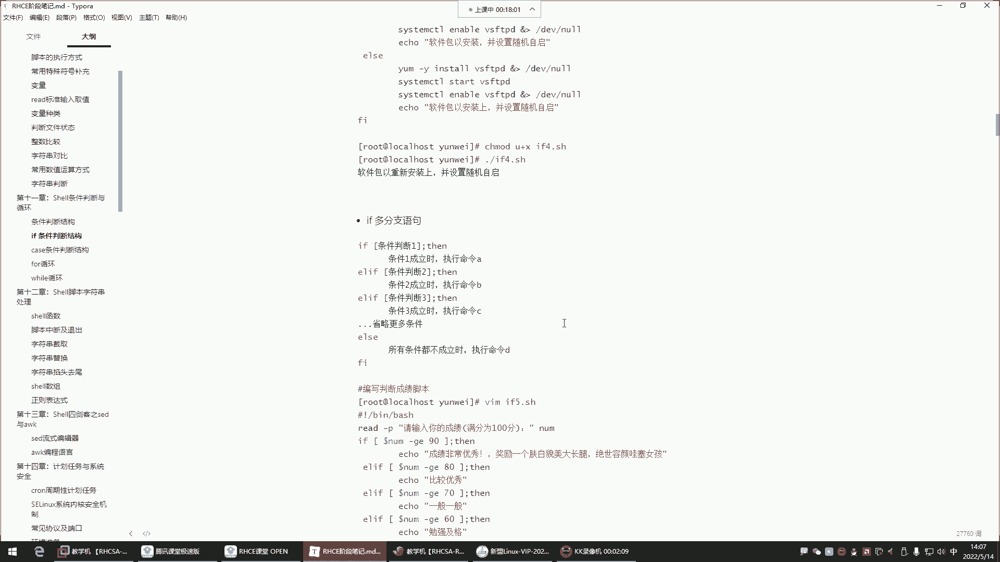
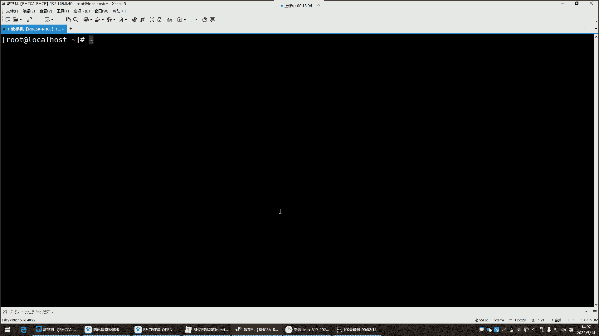
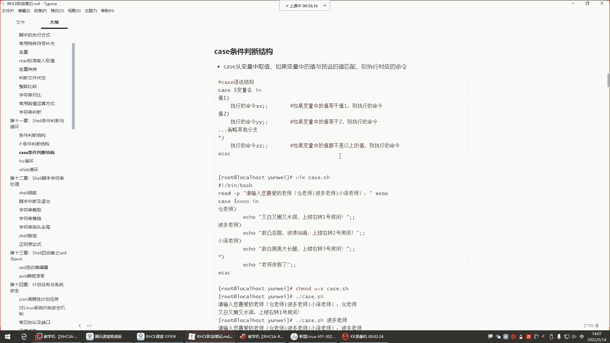
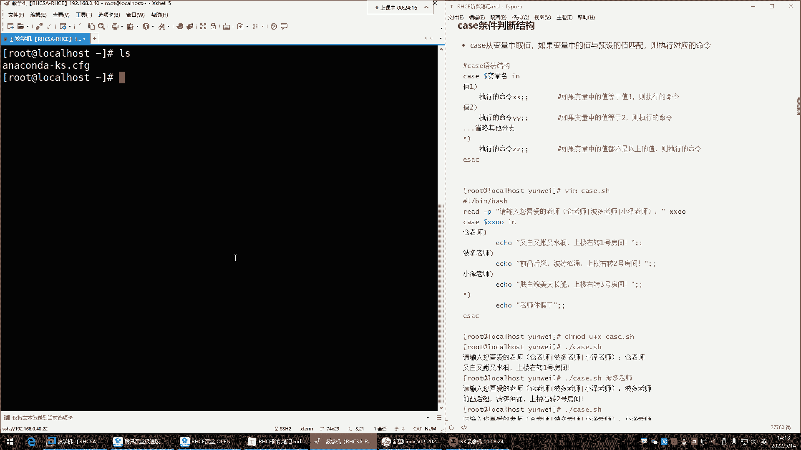
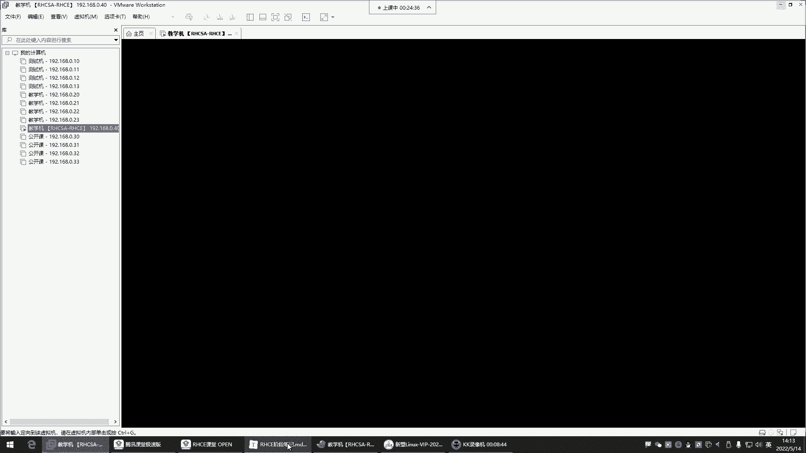
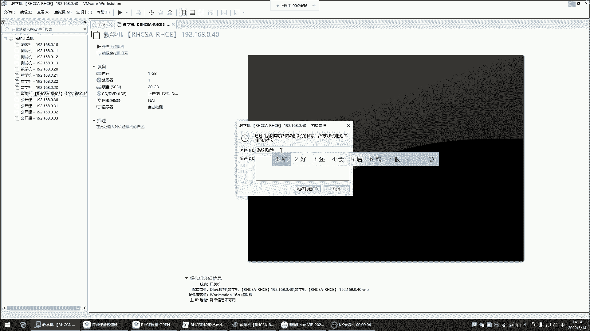
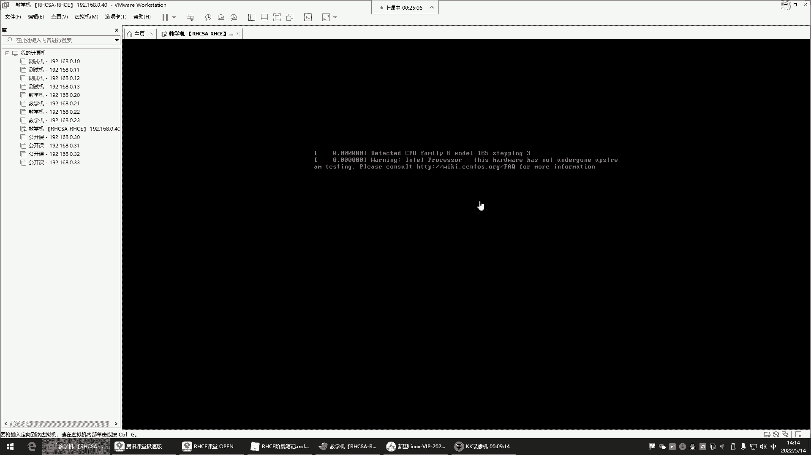
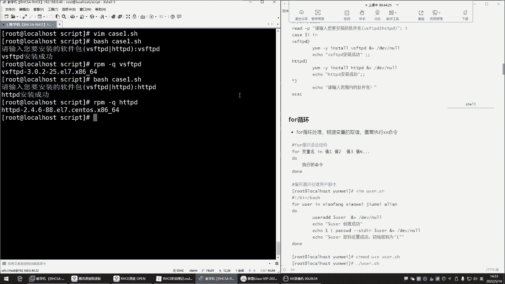
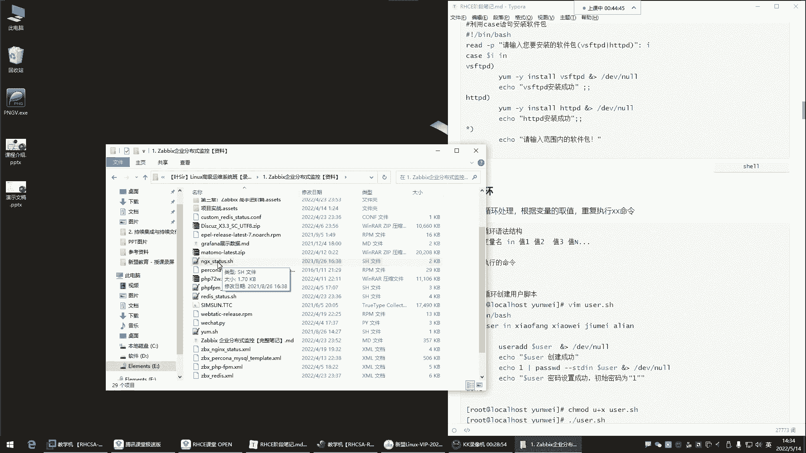
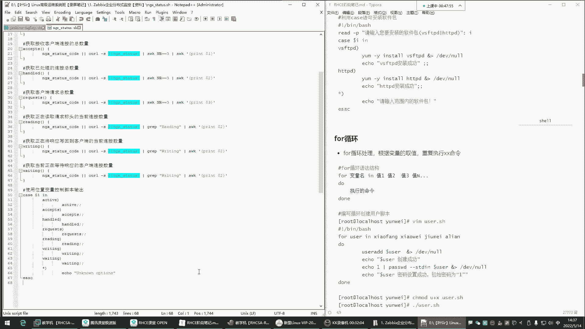

# Linux脚本编程：7：case条件判断与for循环

在本节课中，我们将学习Shell脚本编程中的两个重要结构：`case`条件判断语句和`for`循环语句。我们将通过简单的例子来理解它们的语法和应用场景，让初学者能够轻松掌握。





## 概述



上一节我们介绍了`if`条件判断语句，本节中我们来看看另一种条件判断方式——`case`语句，以及用于重复执行任务的`for`循环。`case`语句在处理多分支选择时更加简洁，而`for`循环则是自动化重复任务的有力工具。

## case条件判断

`case`语句是一种多分支选择结构，它根据变量的值匹配预定的模式，并执行相应的命令块。其功能虽不如`if`强大，但在特定场景下更加简洁明了。

### 基本语法

`case`语句的基本语法结构如下：

```bash
case 变量名 in
模式1)
    执行命令1
    ;;
模式2)
    执行命令2
    ;;
*)
    默认执行命令
    ;;
esac
```

*   `case` 以 `case` 关键字开始。
*   `变量名` 是需要进行判断的变量。
*   `in` 关键字后开始列出匹配模式。
*   每个模式以 `)` 结束，对应的命令块以 `;;` 结束，表示该分支结束。
*   `*)` 是默认模式，可以匹配任何值。
*   整个结构以 `esac`（`case`倒过来写）结束。





### 应用示例





以下是`case`语句的一个简单应用示例，模拟一个选择场景：

```bash
#!/bin/bash
read -p "请输入你喜欢的老师名字：" teacher
case $teacher in
"苍老师")
    echo "苍老师特点：又白又嫩又水润。上楼右转一号房间。"
    ;;
"波多老师")
    echo "波多老师特点：前凸后翘，波涛汹涌。上楼右转二号房间。"
    ;;
"小泽老师")
    echo "小泽老师特点：肤白貌美大长腿。上楼右转三号房间。"
    ;;
*)
    echo "$teacher 老师今天休假。"
    ;;
esac
```

执行此脚本时，会根据用户输入的名字输出对应的信息。如果输入未在预定模式中，则执行默认分支。

### 注意事项

*   模式匹配是**顺序执行且匹配即停止**的。一旦某个模式匹配成功，就会执行对应的命令块，然后跳出整个`case`结构。
*   命令块最后的 `;;` 不能省略，它标志着该分支的结束。
*   默认模式 `*)` 通常放在最后，用于处理未预料到的情况。

## for循环

在编程中，经常需要重复执行某些操作。`for`循环就是用来处理这类重复性任务的。它能够遍历一个列表中的每个项目，并对每个项目执行相同的命令序列。

### 基本语法

`for`循环的基本语法有两种常见形式：

**形式一：遍历值列表**
```bash
for 变量 in 值1 值2 值3 ...
do
    执行命令
done
```

**形式二：C语言风格（常用于数字序列）**
```bash
for (( 初始值; 条件; 步进 ))
do
    执行命令
done
```

### 应用示例

**示例1：遍历固定列表**
以下脚本会依次打印出列表中的水果名：

```bash
#!/bin/bash
for fruit in apple banana orange
do
    echo "水果有：$fruit"
done
```

**示例2：遍历命令执行结果**
`for`循环可以遍历一个命令输出的每一行。例如，列出当前目录下所有的`.txt`文件：

```bash
#!/bin/bash
for file in $(ls *.txt)
do
    echo "找到文本文件：$file"
done
```

**示例3：C语言风格循环**
这种格式非常适合进行数值计算或固定次数的循环。例如，计算1到5的和：

```bash
#!/bin/bash
sum=0
for (( i=1; i<=5; i++ ))
do
    sum=$(( sum + i ))
done
echo "1到5的和是：$sum"
```



### 循环控制



在循环体内，可以使用两个关键字控制循环流程：
*   `break`：立即终止整个循环。
*   `continue`：跳过本次循环中剩余的语句，直接开始下一次循环。

## 总结

本节课我们一起学习了Shell脚本中两个非常实用的结构。
*   **`case`条件判断**：适用于多分支选择场景，通过匹配变量值来执行不同的代码块，语法比多层的`if-elif`更清晰。
*   **`for`循环**：用于重复执行任务，可以遍历一个项目列表或执行指定次数的循环，是自动化脚本的基础。



理解并掌握这两种结构，将极大地提升你编写Shell脚本处理逻辑判断和批量任务的能力。