# 【小白入门 通俗易懂】全网最全RHCSA+RHCE教程，一周快速进阶Linux运维 - P44：红帽RHCE-8.case条件判断、for循环 - 网工小程立志不加班 - BV1PN4y1R7uU

你是不是应该能够大体的理解啊，这是一个case语句啊，case判断啊，然后你看到每到一的时候，你应该知道啊，这个每到一是什么呢，是在执行脚本的时候应该给它一个值啊，给他值了以后的话呢，他干嘛呢。

哎他就可以帮我去执行我的这个里面的指令，嗯好对，先简单作为了解哈，这种东西呢是什么时候用，咱们什么时候再说。

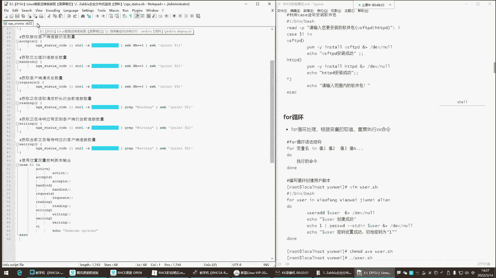

它这个数组看起来好像函数啊，sorry哈我我说错了，刚刚就是函数不是数组哈，啊对就是函数哈，刚刚那就是函数不是数组。

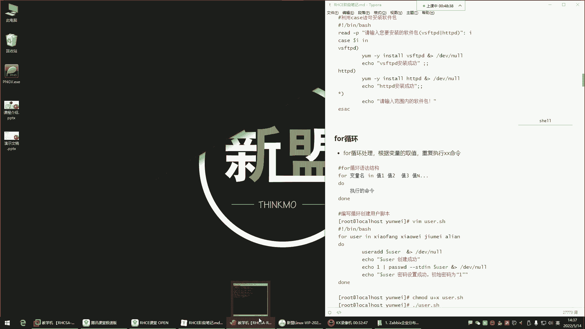

函数是给一堆命令定义别名，好那接下来呢我们了解了这个case了，是不是后期也可以用得到啊，所以你到时候你能够看得懂别人的脚本的时候，你就知道它可以干嘛，用做判断的，就是做判断条件，成功帮你执行命令。

条件失败就不帮，不帮你执行这个命令，能理解吧，好那下边for循环，for循环的话呢是什么叫负循环呢，for循环就是帮你重复去做一些事情，for循环叫循环处理，根据变量取值重复执行某些命令。

那这个东西的话呢，我们呃对于for循环呢，我们先来演示一下演示是什么呢，来先写个小脚本啊，这个写一个优点，SH这是创建用户的脚本，把这个拿过来，咱们先不讲它的一些功能。

我们就来看一看这东西可以怎么玩好吧，现在，来看啊，我要执行这个脚本了，这个脚本叫啊，是优色点SH改个名，把右侧点SH给它改成叫for，然后优色点SH啊，标记一下，这是for循环的一个创建用户的脚本。

什么意思呢，就是循环帮我去创建用户来执行，看看效果哈，唉b for u侧点SH回车，看到效果了吗，这个效果是什么呢，哎他帮我创建了好多用户，然后又给这个用户设置密码是吧，小方创建成功，小方密码设成功。

小V创建成功，小V密码设成功是吧，这是九妹，这都是拼音哈，九妹穿越成功了，阿联是我们中国的四大村花，我创建好了诶，那你发现这东西有点意思是吧，啊那这个东西啊就是循环，什么叫循环呢。

就是帮你重复去执行某些命令，那这个怎么执行命令的呢，它的语法是这样的，For，然后呢变量名in，然后注意啊，他这个里边for循环对谁循环，对变量名里的值做循环，然后那这个值从哪来啊，是在in后边。

你给它定义的，所以你看我这里面的语法就是什么呢，for然后我这个变量名随便取，让它叫user好，那它是对变量名里的值去循环，只要你变量里面，只要你这个变量名里面有值，他就帮你执行什么呢，度跟当理的语句。

也就是说这一部的语句是你具体执行的命令，但是他帮你重复执行，那怎么样重复执行，或者说它会执行多少次呢，要看你的变量名里边什么时候没有值了，那这里的命令它就不执行了，所以说你这个值是定义在这个in后边的。

你写多少个值，那它每次循环的时候，第一次循环，它会把小方给我附到这个变量里面去，然后附到变量里面的小，这个变量名是不是里面就有值了呀，有值之后它就执行度跟葬礼的这个语句好，那这个语句你想干嘛。

你就写什么命令就行了啊，我想创建用户，那这时候你就UCUC的谁啊，UC的这个变量名，这个变量名里面存的是小方，是不是啊，那我就创建小方，然后呢这个时候我结果不要扔掉，因为这条命令啊。

它甭管是成功还是失败，总之他都能给我创建出来，是不是不存在就创建呗，如果存在呢存在是不是就是他也不会报错呀，所以结果不要，那接下来那创建用户以后，我呢直接EQ一个告诉我这个用户创建成功了，是不是啊。

IO变量名，因为变量名里面不就是小方吗，接下来那给他设置密码，密码的话，我是echo一个一，然后呢通过这条命令给他设密码，给谁啊，给变量命令的值设置密码，这里的值就是小方，是不是啊。

那这时候给他设置密码，但是结果也不要，接下来呢我告诉用户啊，我的你的这个用户密码设置成功了，密码是一啊，这是第一次循环，第一次循环就是因为这里的值是存的是小方，是不是啊，那只要这里有值。

他就帮我执行这里的指令，那下边看看在下边嗯，怎么还能执行下面的密码啊，不是这个注意哈，我们执行命令是输出结果，注意哈，我们扔的是输出的结果，可不是把密码扔掉了啊，就是你执行命令，你执行命令以后。

比如我UZI的，我现在再建一个小方回车，这是不是一个命令的输出结果呀，他告诉你什么用户已存在，是不是啊，这叫输出结果，我不要啊，输出结果扔掉哈，不是说把密码扔掉了，这密码你扔不掉的。

所以这个位置别搞混了哈，啊就是这个你设置密码他不是有些输出吗，你EQ一个密码，123给这个管道给pass w d给杠杠杠杠，STDIN给小方式密码回车，你看这不是有一些输出吗。

是不是告诉你什么更改这些输出，这些输出我不关注，不关注的话，我就不要了，扔掉了啊，啊，把输出结果给它重定向到这个黑洞设备列表啊，它是这样子的，OK然后那这个里边有值的时候，是不是就开始执行这里的语句啊。

那第一次循环，他把所有的命令给你执行完毕之后，注意哈注意哈，他把所有的命令给你执行完以后，那这个循环他干嘛呢，他结束了吗，哎是本次循环结束了，注意啊，是本次循环结束了，那接下来他还要再回过来再看什么呢。

再看这个in后边还有没有值，第一次他已经把小方给他干嘛呢，给他传递到这个变量里面了，然后开始执行语句是吧，那第二次他还要回来干嘛呢，还要回来看小方后边还有值吗，有小V，如果有小V，他把小V也要干嘛呢。

传到这个变量里面去啊，传到变量里面以后，那这个变量里面是不是又又值了呀，那只要这个变量里面又直的话，它就又开始执行这里的语句了，哎开始帮你创建谁啊，创建小方啊，然后执行这里的语句。

那这个是不是就是帮我们重复执行了，执行命令了呀，没错吧，好那第二次循环结束之后，接下来那这个循环也是本次循环结束了，那接下来他还要再回过头来再看啊，那这个小方后边还有值吗，一看还有一个九妹。

那接下来干嘛把九妹再往这个变量里面穿啊，扔到变量里面，那这个变量里面又直了又直，又开始执行这里的语句，又重复执行这里的命令了是吧，好那接下来这个命令执行完以后，他再回过头来再看谁呢。

哎再看这个九妹后面还有值吗，有阿联把阿联再往这个变量里面传好，那一看这里又直了，又循环，那循环完成之后呢，他再回过头来看看什么呢，看阿联后边还有值吗，一看阿联后边没了啊，那接下来整个循环结束了。

脚本就退出了，他是这样子的，能理解吧，所以现在我说这重复执行某些命令，哎我现在有一堆命令要执行，那你通过for循环，它可以帮你干这个活，能点吗啊，那能不能了解这个思路呢，没关系，不了解的话。

大家可以下去自己演示演示自己演示演示好，那接下来下边有一个小例子来给大家看一下，这个for循环可以干嘛，用这个for循环，可以帮你测试企业服务器的一个连通性啊，这个联动性就是你们企业现在有一排服务器。

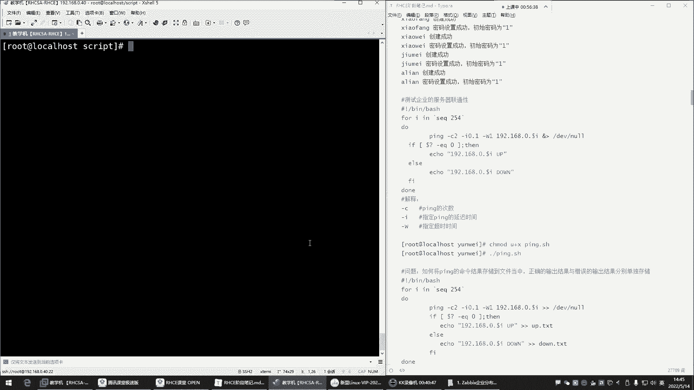

有一堆服务器哈，那这一堆服务器呢对于你来讲呢，你是一个维护者，这里的话就让你想再多。

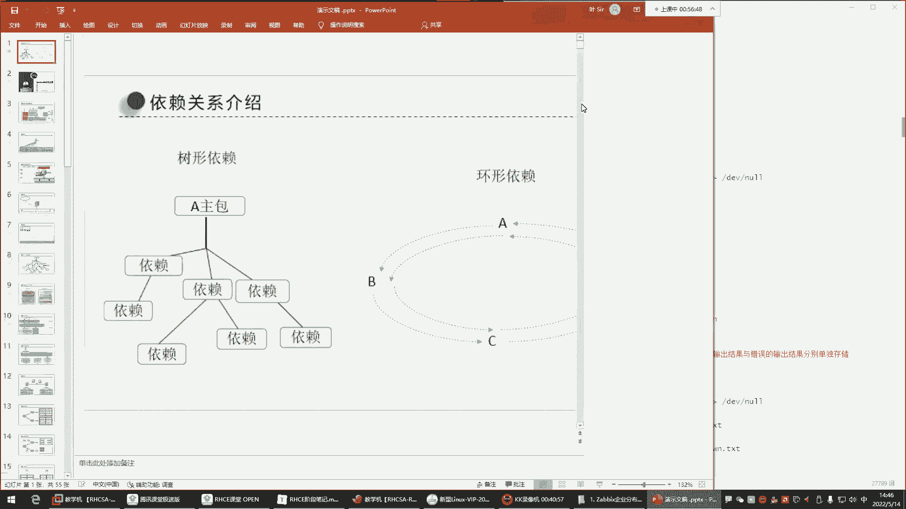

哎只能这样吗，好吧，那就这样吧，啊你是这一群服务器的一个维护者来了。

哎我找个梯子干好，那现在要干嘛呢，现在比如说我们啊发现我这一群服务器里边呢，哎呦有其中有几台机器呢，它宕机了，关机了，但是我现在无法判断是哪台机器，那怎么办，哎我让你给我去测试一下。

到底是哪台机器关机了，那怎么测呀，我怎么样才能知道这个机器到底是开机的，还是关机的呢是吧。

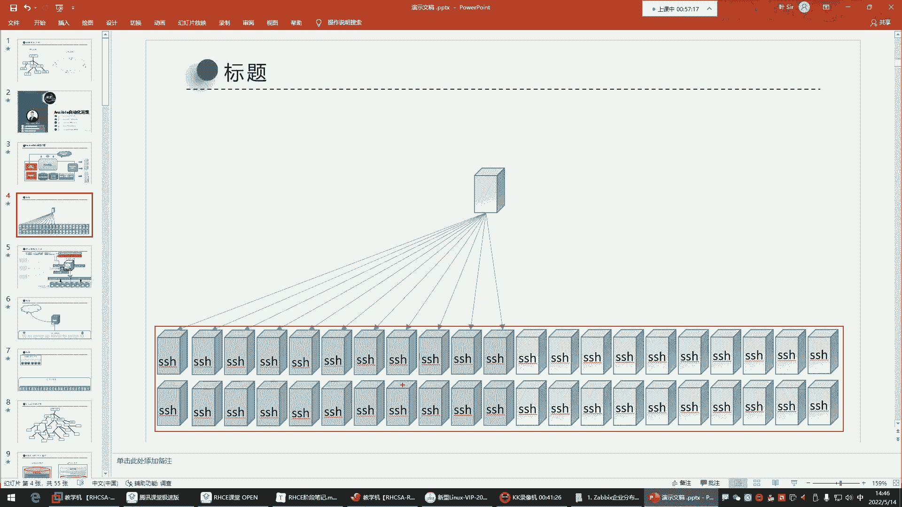

就比如说我想看看百度服务器他的状态是吧，我可以拼3W点百，百度点com，但是我这个机器网络有点问题哈，网络有点问题。

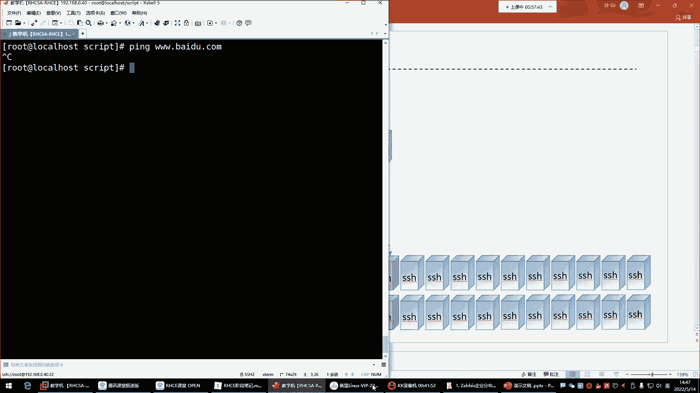

我现在先不管它哈，下去我到时候看一看虚拟机的问题啊，应该是在编辑器里面有点问题。

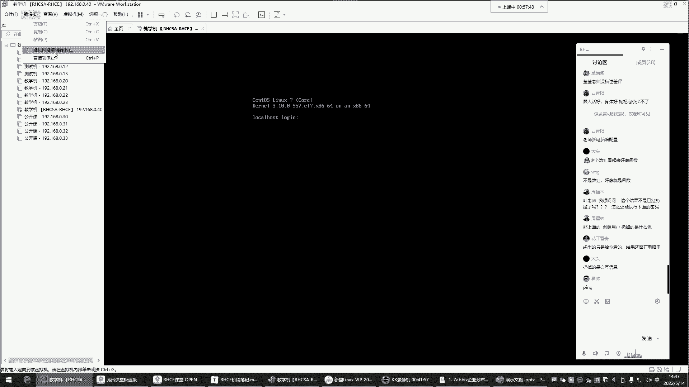

202254也没啥毛病，把这个工具人的工资来。

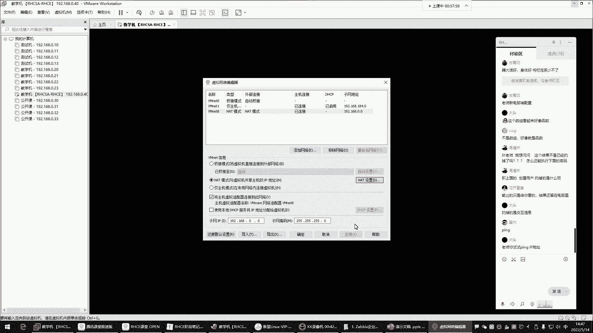

接下来是给我们的改变，没啥毛病哈。

等会哈看看嗯，后面还有一个特点啊，这边呢40啊，40行行行行，0。1。

算了我先不管它了哈，先不排了，拼不通就拼不通吧。

你们知道我想测试服务器的联动性，我先批评自己哈。

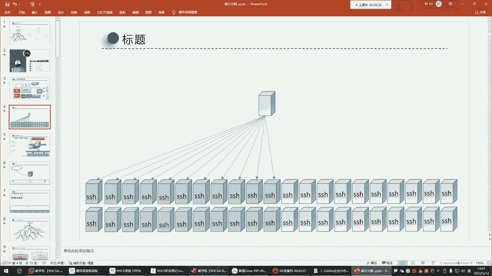

我先批评批评自己的网关吧，拼192。168。0。0点254回车啊，这能拼通，那可能是我的网络问题哈，网络问题先不用管它，先不用管这些啊，不是啊，host3W点百度点com未找到命令，然后NS没有命令。

那算了，不安了哈，先不管它，先不管它，你就知道我们自己在自己环境里面，能拼通就可以啊，能拼通这个地址，我们一会就可以给他演示了，那接下来我们现在就要需要你干嘛呢。

测试这一群服务器的联动性，那怎么测就拼它哎，哪个机器能拼通，就证明哪个机器是开机的，哪个机器拼不通就证明哪个机器是关机的，那接下来啊，接下来我现在就干嘛呢，嗯我现在就可以用拼去测试，但是如果拼测试。

你说我们机器啊这么多，是不是，我不能说在命令行里面这样一台一台拼吧，拼192的168。0。1啊，拼完这个呢再拼，再拼192。168。0。2，然后再拼192。168。0。3，我能这样一直拼下去吗。

拼到254，这不太现实，是不是啊，这不太现实哈，所以怎么办呢，所以哎咱们通过复循环让它循环帮我去拼，让它自动的循环冒拼，一直拼到254，哎这样就好了，所以for循环它可以帮你重复去干一些事好。

那这时候来看一下怎么玩这东西啊，这东西啊有点不理解了哈。

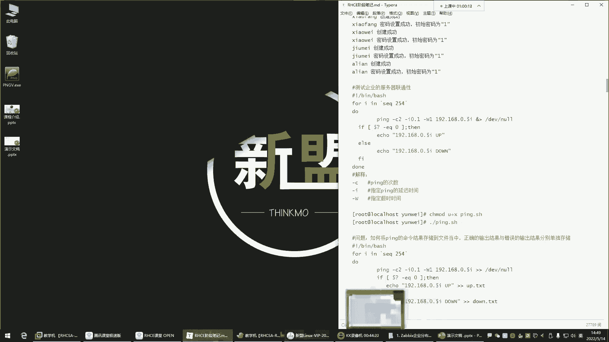

我们先来搞个脚本，叫拼点SH就拼点SH吧，在里面井号叹号杠并一下的Y值，然后我们上来要拼命了，那要拼别人的话呢，我现在要做哪些事情呢，就是for i in，把语法先写出来，do当这是语法是吧。

这里面是写命令的好，那接下来来看一下我这个这是啊，这个比如说变量名叫pk，那接下来我这个值怎么定义，我怎么给的值，这值怎么给呢，我要拼120啊，要一直拼到254，反正不反对就会有很大范畴。

你在后方就有一个人啊，是不是啊啊没事儿，一会儿改个名，那接下来我现在就得干嘛呢，我现在就得定义数字了，这数字怎么定义，我再去，现在问题来了，这啊对有人出了大括号是吧，可以把你匹配一点点254啊。

可以没错，可以好一点点，254是不是从1~254啊，那接下来我的命令干嘛呀，就拼谁呀，是我拼这个拼变量啊，拼变量唉，就这样玩，是不是就拼他们回车来哈，执行的脚本哈，改个名，将拼点SH给它改成for。

然后拼点SH改名了，然后接下来呢执行它for拼点SH回车，嘿嘿嘿嘿，你看这怎么报错了呢，是不是啊，怎么成这样了，什么无效的参数是吧，然后打开，那这时候你看我们这样定义是不是啊。

你这它是帮你拼12345678啊，他怎么玩的，你看这变量里的值是啥呀，变量里的值第一次应该是一是吧，然后他进来呢就帮你拼拼一去，是不是啊，哎帮你拼一呵，那这你这他帮这一不是IP地址啊，这数字啊是不是啊。

所以他说这无效的参数啊，啊这拼命令他不认识啊，这啥呀，是不是这拼了一辈子，这怎么会有突然间一个数字了呢，是不是啊啊这很很奇葩，他不认识了，无法理解了，他超出他的认知范围了。

所以你这边在定义的时候怎么定义，我们是不是可以商量这个什么呀，对我们可以这样玩，就这样看，192。168。0。1到254，是不是可以唉或者说你定一个变量也行，是不是啊，唉怎么着都行。

那最好就是这样比较坚明之一哎，192。168。0点，然后一点点254，那这样他第一次拼的时候是拼谁呢，来看一下效果，执行它哈，执行回车，哎你看这样就对了，哎他第一次拼拼谁呀，192。168。0。1。

是不是哎你看这样是对的，没错吧，好，诶这怎么不动了呢，你发现他他怎么卡在这儿了，死刑完了是吧，死了没错，嘿嘿这拼的命令啊，他就这样，对于拼这条命令，它的特点是啥呀，就是哎呦。

我一旦你看我一旦拼上拼某个主机，我告诉你哈，一旦拼某个主机，你看了吗，他现在拼谁呀啊怎么拼到一角，二等于68。0。40去了呢，拼自己去了，现在你看看取消掉哈啊又变成0。3了，哎呀0。4。

你看我每次CTRLC也就是说呀，每次一旦他拼不通某台主机的话，你看他变成这个样子了，我觉得有点问题啊，他一直拼，他停不下来，看到了吗，听听回来，一直在拼0。40，他拼着他拼自己呢，拼自己哈，这有问题。

看到了吗，我CTRLC的时候，他才结束本次的拼音，然后再进入下一次的拼，拼谁呢，你看我一结束拼0。10，再结束0。11，那你说我能这样一直我能每次都Ctrl c or，是不是啊。

能看这不太现实吧啊这有问题哈，我们得给他结束掉，现在正常结束已经无法结束了，这进程已经无法结束了，我觉得这机器有点问题，我这机器啊，这机器有点问题，连年倍儿费劲，倍儿费劲，这机器有点故障。

我觉得这不是哪年交100万，在零二来了，那接下来干嘛呢，这个进程一直在什么呢，一直在进程在运行着呢，我得给他结束掉，它有问题，现在啊他这个问题我们这样哈，我安个包啊，主要是没有这条命令。

没有PS trick这条命令我看有没有啊，杠AP然后过滤这个拼啊，他没有找到命令，是不是他说未找到YM杠Y因此P退啊，那是PSIMPS是MISC，这个包好像是是这个报名吧，还是PSPS啊，是叫这个名字。

PSMISCPSTRA杠AP过滤谁呢，过滤拼啊，也不是这样过滤的，那我是PAUS过滤偏，这什么玩意啊，PAUS管道给grape品好，有问题是吧，是我的语法有问题是吧，没有grab啊。

现在啊这个在运行着呢哈，这不行，得给它结束掉哈，P rap，那叫ee rap吧，E graph，然后我想找他的id哈，1rap啊，不是是这个p grip哈，p rap过滤进程的，把这进程号给他杀掉哈。

Q，啊Q2吧，直接杀就拼的进场回撤，所有这边看杀死了吗，还以已终止了是吧，没有杀死，劈过来法过滤拼，这还活着呢，这不行啊，多顽强啊，先杀id号，在Q2拼，杀死了吗，还没杀死，我的天哪。

嗯PSTRA杠AP管道给GRP拼啊，还运行着呢，看到了吗，哪个是他的id号啊，这个现在相当于啊，我们把这脚本直接给他结束吧，是吧啊，把这脚本因为这个结束进程没用，脚本一直运行着呢，看到了吗，不是杠九。

是这样哈，这样我们把这脚本给它解除掉，你看是不是把脚本id号给他删掉，应该就可以了，哎Q咱加个杠九强杀回车，杀死了吗，啊可以了，杀死了哈，哎呦这太完哎呀，你看你们看哈，这好了吗，还不行呢。

那杀完脚本再杀进程，QQ2晋城名拼，你看看到这个拼哈，杀他太顽强了，哎呦这算好了，这算好了哈，哎终于给他杀死了，这脚本写的有问题，这脚本不能这样玩哈，病毒一样没错，你看这杀个进程倍儿费劲。

那接下来这脚本我们应该干嘛呢啊，应该不能那样玩哈，所以你们看写个脚本呢，你得思考，你不思考的话，你上去就说哎呦，那我就这样写完，这简单的思路可以啊，没没毛病啊，是你发现不行。

你要了解这个命令他的一些什么呢，它的执行后的一些特点，你发现这个特点就是一直把你拼死，要么就是把你拼死，要么就是我自己拼死，只要甭管是通还是不通，它不停，他是不会停下来的，就是一个风格啊。

所以这时候呢我们干嘛呀，哎你得控制它的次数了，所以这时候我们在这哈，哎杠C指定拼的次数，那这时候拼几次唉，杠在这哈，在这边我们来控制次数，各方面的后来杠C拼几次呢，呃我们拼两拼，拼两次有点多吗。

就拼一次吧，速度快一点是吧，哎就拼一次，杠C后边不用加空格，然后那下面还有一些这个可以提，提升拼速度的杠I啊，指定拼的延迟时间啊，默认的话它延迟也有点高，杠A延迟呢我们给它改成多少呢，这0。

1给它改成0。10。1延迟，然后杠W指定超时时间啊，就他拼完以后拼不通啊，他一直卡在那儿，他超时能理解吧，一直卡在那儿，它不动没关系嗯，杠W别超时，怎么就超时的话，也是一秒钟就结束了。

知道吧啊然后这里边拼几次拼一次啊，延迟时间0。1秒，超时时间一秒，好OK啊，拼谁就拼这个地址，那这个时候我们再看一下效果好吧，bh for拼回车，看到了吗，这样说不可以，你看他现在是一个一个拼的。

是不是很快呀，你发现你看PC19等于18。0，那是不是你看十十一十二十三，这样你是不是就可以清楚的知道哎，哪个机器是通的，哪个机器是不同的呀，是不是我不是这样，但是这是通还是没通过，就通了吗。

感受不到是吧，拼一次这拼一次好像不行啊，我们再给他杀掉哈，杀掉这不行啊，过滤一下进程p grape啊，然后杠AP对p rap是不是过滤进程的呀，拼啊不是哈，是撇子脆哈，撇子脆用PS脆看进程数。

然后APA是过滤整个什么呢，整个哪条命令产生的进程，P是显示它的PID，然后再什么呢，再过滤来包含较拼的这个进程回车，那现在是这条命令产生的进程，是不是啊，然后这个进程他现在pad是多少。

那接下来对这不行啊，一次不行，一次不行，我们要改一改次数，一次太长了，一次频率太快了哈，所以现在给他杀掉Q，然后杠九先把这个脚本给他结束掉，脚本的PAD先给他杀掉，然后再Q2，再把叫拼的建成名给他干掉。

回车哎，没了结束了哈，应该是杀死了，看了吗，还是这个狠是吧，你看直接就杀死了，直接把脚本一杀死，停了，改一下哈，改four，拼这一次不行了哈，得拼两次，拼两次，OK那拼两次，我们来看一下啊。

其实你现在我们已经能够感受到了，感受到什么呢，你在执行这个脚本的时候，他到底是成功还是失败了呀，肯定失败了，肯定是失败了啊，它成功它不是这样的成功他会有什么呢，有数据包，这里面没有数据包。

所以那大多数都是拼不通的，但是也很快了是吧，你看二十二十一二十二二十三二十四，是不是不是就已经很快了呀，已经很快了哈，这里面然后那快归快，但是这样的话呢，我们让它在屏幕上面太乱了呀。

我们能这样看吗，太乱了，是不是多乱呢。

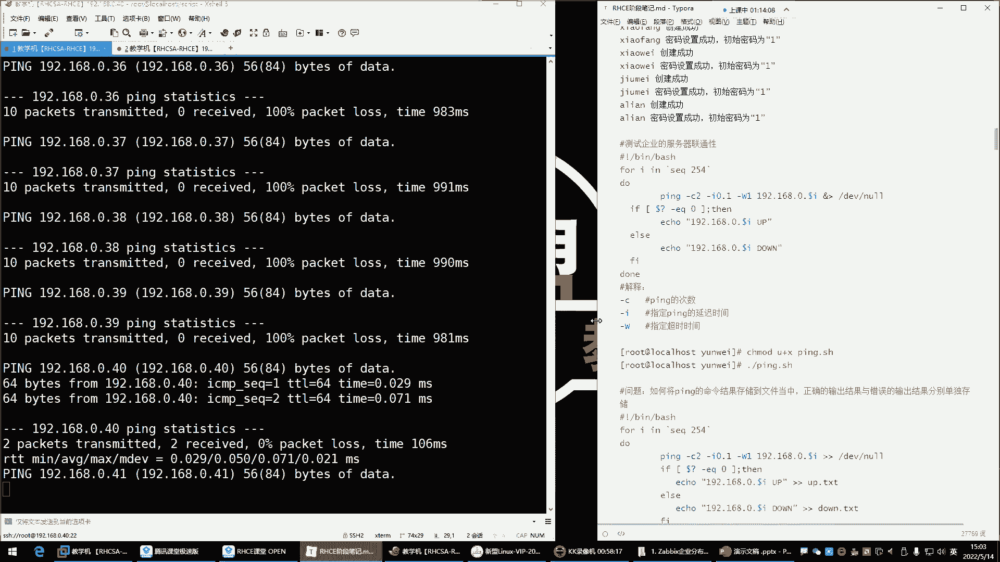

你发现搞得满屏都是，所以我们一般也不这样玩，也不这样玩哈，所以现在再把它进程杀掉，这时候他的id号叫8164了，Q杠九枪杀8264回车，死了吗，死了好死了哈，已杀死，那接下来这个脚本还要改好改哈。

改four拼，这要怎么改呢，这时候我们对于它的输出结果做一些处理，结果太多了，不要了啊，输出结果太乱了是吧，扔掉扔到DV的黑洞设备里面，好的，你说你把结果扔了，我怎么知道它是通还是没通啊，是不是啊。

你看那本来我们是通过输出结果可以看到，那这个机器到底有没有拼通，是不是好，那你说你结果扔了，我怎么知道痛而没通啊，没关系，哎我们判断知道吧，if我做条件判断判断什么呢，上来你看我那右边哈。

每到问每到问问谁呀，哎问上一条命令通了吗，是不是啊，所以说就问他，如果他的结果杠EQEQ是不是就是等于的意思啊，如果它的结果等于零，那然后干嘛呢，唉然后我就echo echo谁啊，echo192。

168。0点美刀，啊其实不应该用拼啊，应该是IP哈，这位是IP，拼谁啊，拼IP，对IP我觉EO这个IP的什么呢，它的状态是什么样，当然用引号引起来，这里面我要啊啊引起来代表是个整体啊。

它是意思叫做up的，up就是这个活跃的状态好，那这种是拼这个拼通的情况下，我们做了一个判断是吧，比如说条件成立了，那这个主机如果是活跃的状态，我就ACO这个机器是up的。

那如果这个机器它不是活跃的状态呢，那这时怎么办呢，是不是还得来一个，否则呀啊else否则干嘛呀，哎否则我再EQ一个，每天做一个，告诉你一下，这个机器192。168。0。2，每到IP它是is down的。

也就是说如果他的数，如果上一条命令的返回的结果不等于零，那这个机器肯定是没拼通，是不是啊，哎那这个时候这怎么它怎么红了呢，你们看到了吗，他怎么红的呀，为什么红啊，唉你的语法里面少一个什么呢。

少一个FI没有关注啊，还少一个人，是不是，你看这里边儿你这语法写的是不是哎，少一个还少个FA哎你看你补上它就什么呢，就颜色就对了，对你要这里边你但凡少一个语法，他给你检测到了不对，你的语法有问题。

看到了吧，所以你们写的时候，你们如果语法错，你看颜色也行，哎FI是吧，如果你说我这不加蓝，唉，这你发现它检测不到啊，检测不到是吧，所以说这也不是太智能不太智能哈，OK保存退出，那这时候我们来看一下。

回车哎，当你看零一诶，不对啊，一角色得有点问题哈，这怎么输出有问题呢，杀掉哈，你们发现啊，你看了吗，他这IP地址是192。168。0点，什么，是不是过滤一下，这是我们写的问题了哈，嗯这个Q杠九强杀他。

杀这个pad的，回车好，杀死了是吧，脚本有问题哈，脚本哪有问题呢，是这192。168。0。5的IP吗，一角等于168。0。1，没错啊，W啊，不是这没到IP啊，也对，没毛病，echo就不要EQ加这个了。

就没到IP了，这个哈，因为这个这个变量名里面存的，就是一个完整的IP地址，是不是啊，所以这位置来保存退出，那你发现我这个写的跟我的笔记里面有，他有些不太一样，是不是不太一样，four拼回车哎。

这样就对了，告诉你这个地址是down的，down都是down是吧，没错我们这个环境里边确实在这个范围内的，在我这个机器里面都是down的嗯，对杠1Q杠1Q是什么呢，做比较的不是判断，是做数字比较的。

数字之间的对比，啊前面的话呢我们在讲众多的数字对比的时候，叫做整数比较，这个EQ是用来做等于的啊，等于所以我们这个位置就是在for循环的时候啊，我就得问问什么呢，唉上边的命令的返回结果它等于零吗。

问他一下嗯，对是否等于是否等于零，这个有文化的，那你看这里边是不是我我哎不对啊，40是up的看的吗，这是谁啊，哼40up的，这40是谁啊，40是我自己本机嗯，这是我自己啊，这这是我自己本机是up的哈啊。

所以你看是不是哎，他对他是不是拼自己发现自己通的呀，嘿嘿嘿，得拼自己自己不通，那就成僵尸了，是不是呵呵呵，自己都是一个死机状态啊，但是别的机器都是down的哈啊，那演示一下就可以了，它会一直拼到多少啊。

是不是他一直拼到254，一直拼到254，那一直拼到254的话，那这时候我们就别让他拼太久了哈，杀掉他，杀掉他，演示一下，能看到效果就行，它会一直拼到254，那现在就是我们对于这个输出结果。

我们一般都不让它显示在屏幕里面，注意啊，就这个输出不要让它在屏幕显示太多了太多了，我们一般干嘛呢，放到一个文件里面去，这种输出结果这么多，先把进程杀掉杀掉，你想这一堆输出结果你在屏幕里面显示。

你的屏幕也非常乱呢，我们虽然说感，感觉在屏幕里面看的也比较清晰是吧，但是我们是不是可以这样啊，我们可以我们可以这样玩哎，把什么呢，把up的，如果说这个我只关注哪些主义是down的。

我是不是可以直接把那些down的主机，把它的结果给它输出到一个文件里啊，比如OPT的什么呢啊，叫做这个网络嗯，叫night，然后down点TT里面是不是可以，那up呢，如果你想收集。

是不是net代表网络的意思，up就是这个机器是开启的状态，是不是啊，哎如果这个机器是up的状态，就收集到这个文件里面，如果这个机器它是关机的状态，就收集到这个文件里面，是不是啊，这样是不是可以啊。

哎没错，哎这样，然后呢，那我们在执行脚本的时候怎么执行啊，哎我不在前排了，干嘛呀，让他在后台执行，扔到后台回车，诶，那你看我前台不影响是吧，对你看他现在在后台，是不是我们这样啊啊GOBS杠L看一眼。

这时候看后台进程啊，好回车，哎你看它在后台运行中是不是运行中的啊，脚本的名字是吧，就这个名字运行了，那他现在不就在后台默默的拼了吗，是不是啊，那你现在看默默的拼，你现在看OPT就可以看到文件了。

现在都是down的文件，是不是你现在看文件里的内容也都是net down点TT，你看这都是down的，是不是以后你说我想看哪些主机是关机的，打开这个文件就行了，你不打开。

说白了我们用它过滤是不是也可以啊，但一般我们都是看一看啊，看一看哪些主义是脏的，那生产环境可能说有那么多，有那么多主题都是脏的吗，不可能吧，哈哈啊，up也出来了啊，那我现在看看哪些主义是up的状态是吧。

就打开这个文件看net不是net了哈，是啊是net，然后up回车只有自己是up的。

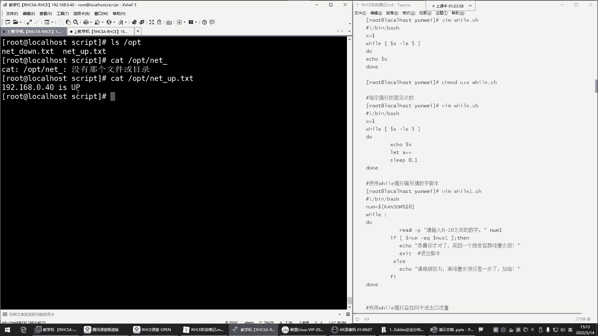

是不是哎那你看那有了这脚本，你写完以后，你们公司说去给我看一下，咱们公司哪个服务器现在是被雷给劈了是吧，现在都关机了，那这时候一拼发现诶，这个机器是不是这个机器是处于关机状态。

那你就你告诉你们领导说这个机器是吧，昨天晚上下雨是吧，被雷给劈了，那没有办法是吧，那这你不能怪我为护不当，是不是啊哈哈换服务器。

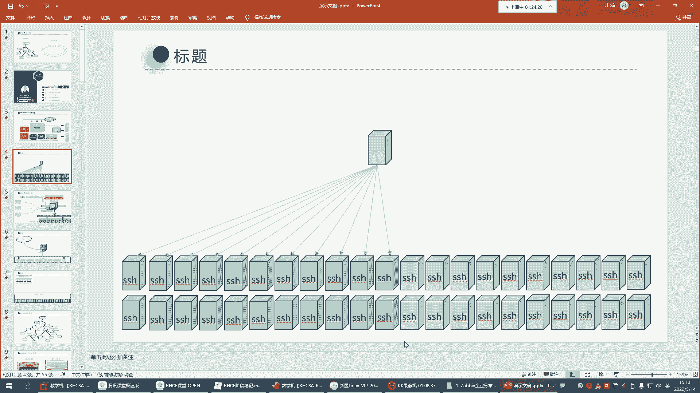

再比如这个怎么去拼他们吗，拼他们好，这是这个通过这个什么通过循环啊，写了一个脚本，是不是比较简单的，比较简单哈，然后我这里边写的这里面不太一样，你看我我是这样写的。

我说上面的是来一个s e q sq是什么呀，sq啊，其实就是什么呢，就是这个大括号的另外一种实现方式，大括号我是一点点254，是不是，那sq呢，你不用大括号，你直接反撇引结果啊，SSEQ他们也是干嘛的。

你给他一个254，他就干嘛呢，帮你去从一开始拼到254，你说我不想拼到254，比如说我想从100拼，那就100杠254啊，他就从100开始帮你什么呢，帮你执行，那跟大括号是不一样啊。

你说我大括号我想干嘛呢，从100一直给我拼到254，是100点点，254能理解吧，所以他们两个的实验方式是一样的，哈是一样的哈，所以用哪个都行，我这里面是用SQ啊，我主要是为了给大家讲一下。

就是我们如果说这个你看到以后，有人通过这种方式去什么呢，定一些数字的话啊，他就是大问号的另外一种实验方式，然后我这里边是干嘛呢，在拼的时候啊，我是干嘛呢，哎直接把IP地址写到这个什么。

拼这个命令的后边了，然后在调用变量名，那这时候变量名里面第一次循环它的数字是一，是不是，那我就拼192。168。0点，那第二次循环这里的值就是二是吧，那我就拼谁呀，192。168。0。2啊。

他是这样子的，那其实如果像我刚刚写的不就是192点是吧，192。168。0点，那你这块就直接不能用IP了，是不是嗯就这些干嘛，哎就直接拼这个变量名称就行了，那这个变量名里面是不是就是什么。

就是192等于68。0点，然后1~254，那下边你在IG的时候，是不是也就直接像我那样，echo这个变量名就行了呀，啊效果是不一样的，没错哈，嗯你咋放不了后台哦，你放不到后台吗，那为啥我能呢。

呵呵你看他说他放不到后台，你看到他说他放不到后台啊，自己跳出来了是吧，那你这你这啥系统啊，跟咱们系统一样吗，你咋这么诡异呢，你看你那是不是哈哈哈哈，这你说你这啥玩意儿啊，这很奇怪是吧啊，一样的那一样的。

你看我我这单就它就在后台运行啊，你看完成了，执行完了，这不很这不很奇怪吗，是不是，那你看是不是和我这里面写的有点不太一样啊，嗯好啊，这是怎么把它的输出结果给他追加走啊，对压到文件里面，OK啊。

这是for循环啊，歇会儿歇会儿回来给大家讲讲什么，讲讲下边的这个view循环，这是一个死循环，一会儿回来讲哈。

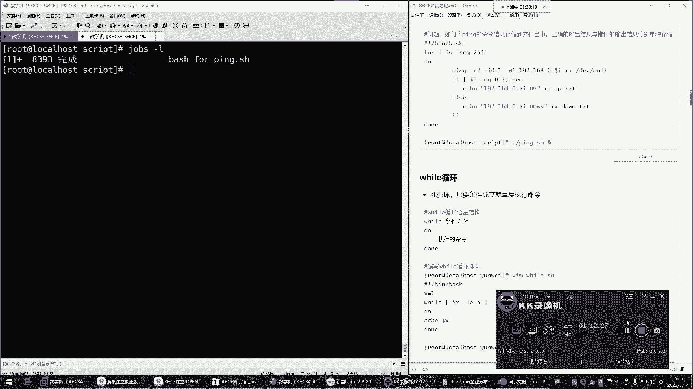