# Linux脚本编程：P44：case条件判断与for循环

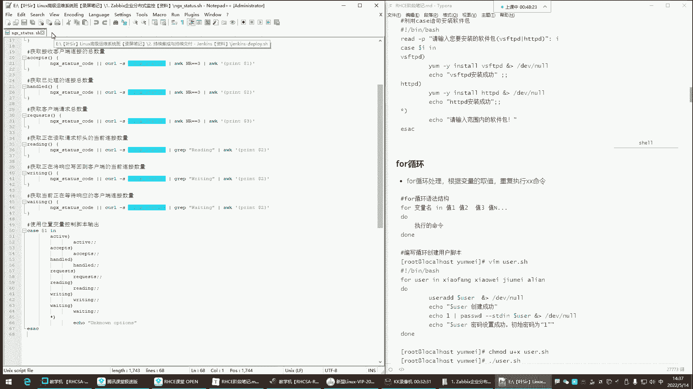


在本节课中，我们将学习Shell脚本编程中的两个重要结构：`case`条件判断和`for`循环。通过学习，你将能够理解它们的基本语法和典型应用场景，例如使用`case`进行多分支判断，以及使用`for`循环自动化重复性任务。

## case条件判断

上一节我们介绍了基础的`if`条件判断，本节中我们来看看`case`语句。`case`语句用于进行多分支的条件判断，其结构比一连串的`if-elif`语句更清晰。

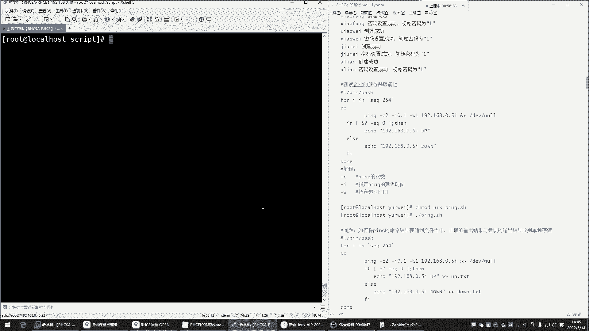

**case语句的基本语法如下：**
```bash
case 变量 in
模式1)
    命令序列1
    ;;
模式2)
    命令序列2
    ;;
*)
    默认命令序列
    ;;
esac
```
当执行脚本时，需要给`case`后面的变量一个值。`case`语句会将该值与各个模式进行匹配，如果匹配成功，则执行对应的命令序列。条件成功则执行命令，条件失败则不执行。

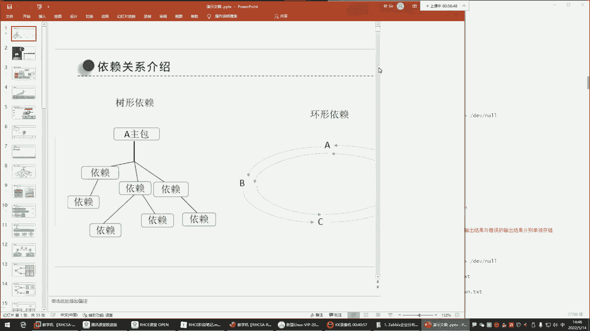


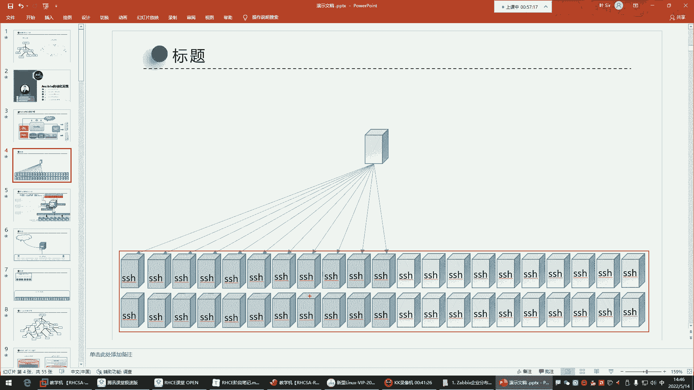

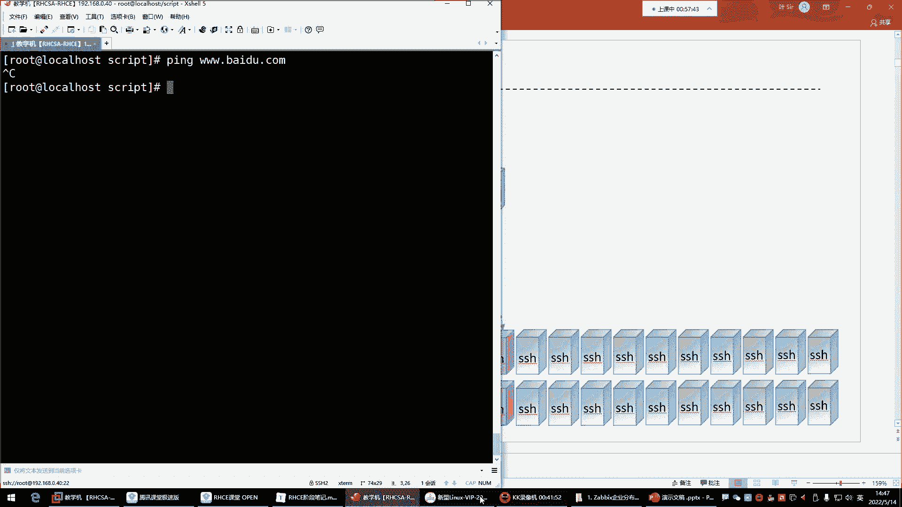

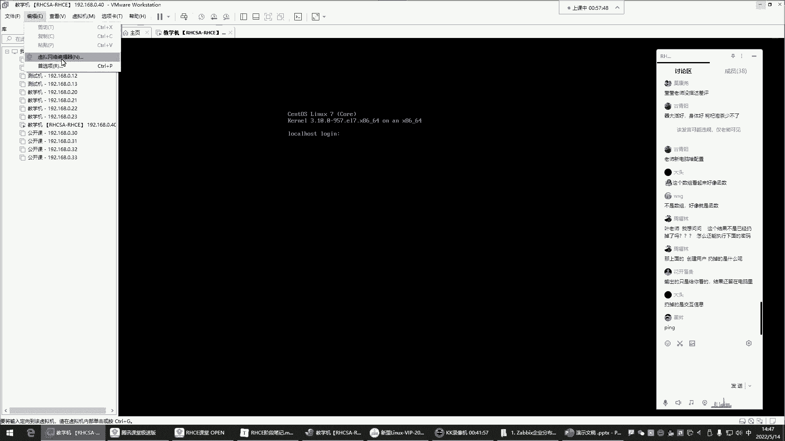

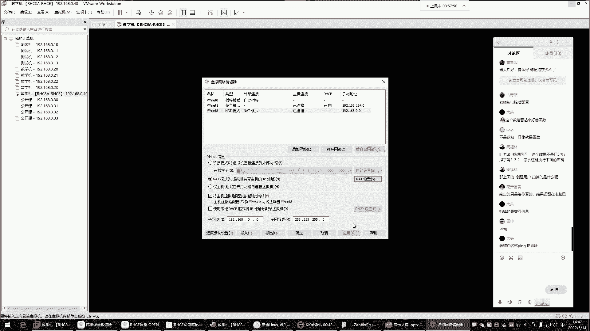

以下是`case`语句的一个简单示例，它根据用户输入执行不同的操作：
```bash
#!/bin/bash
echo "请输入一个选项 (1/2/3):"
read choice

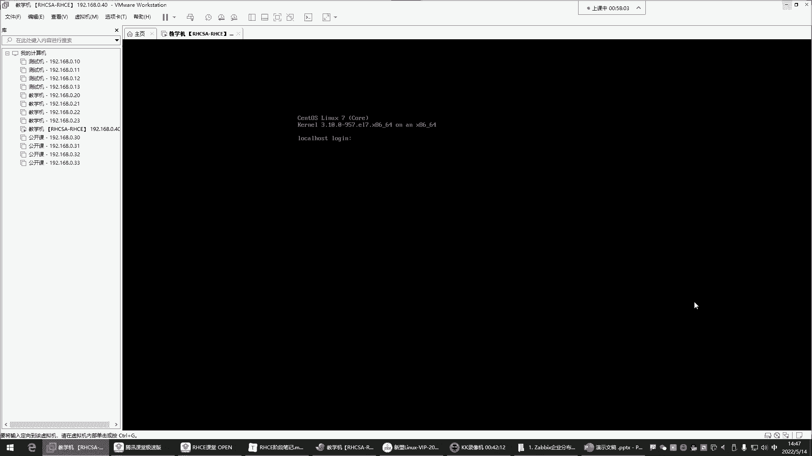

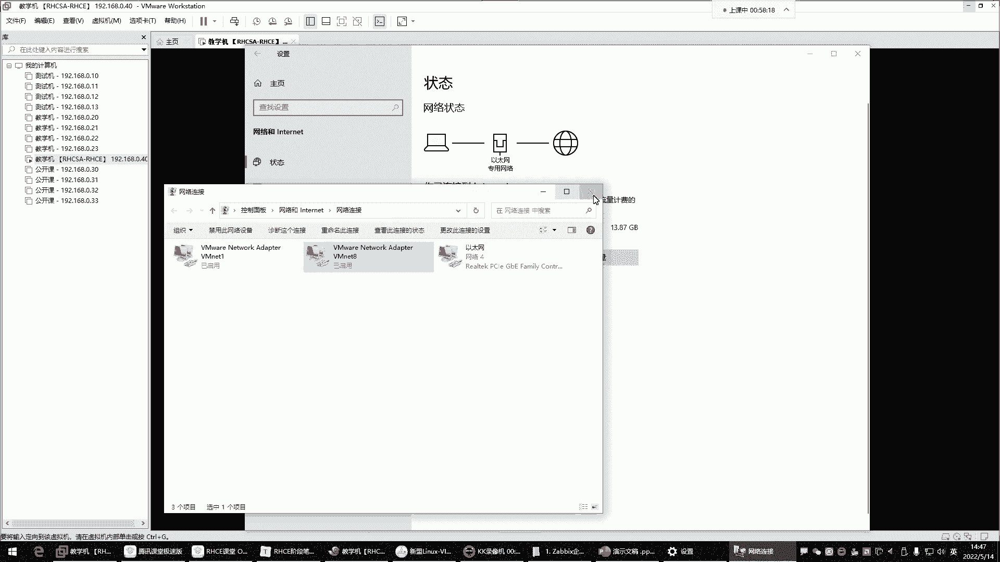

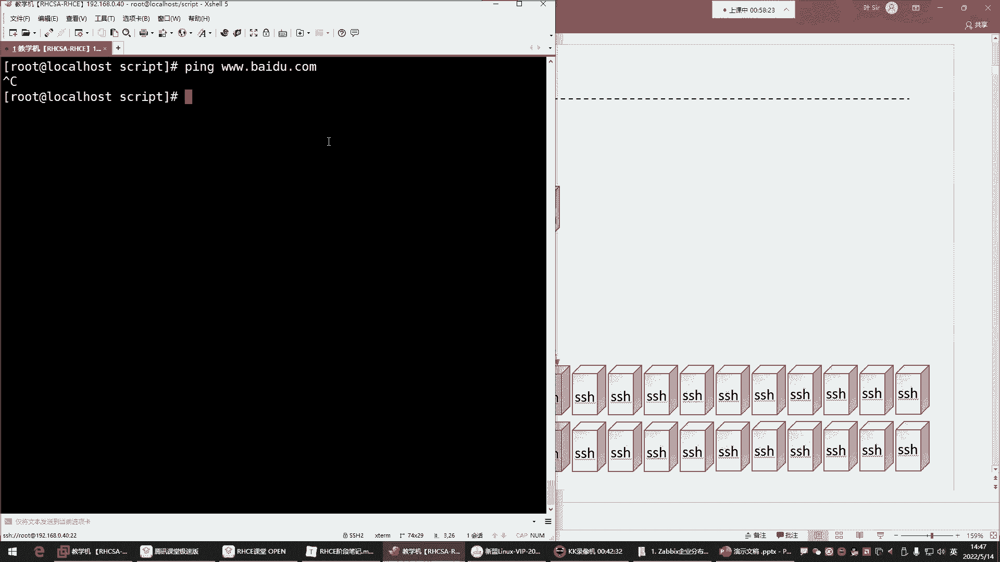

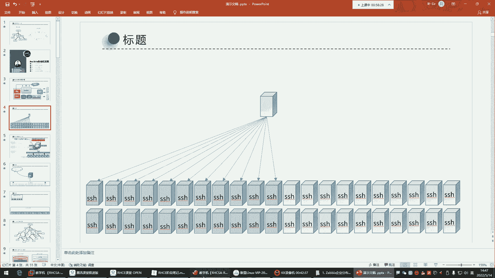

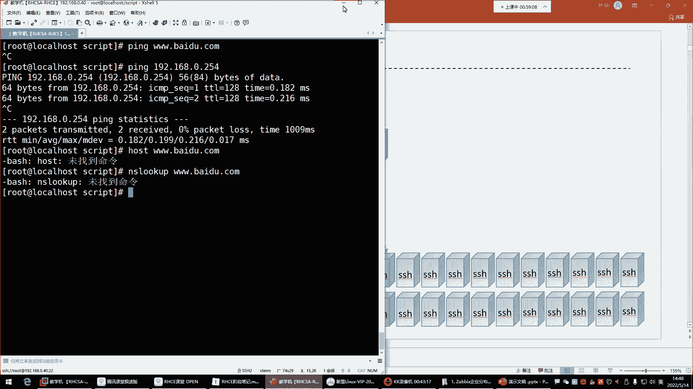

case $choice in
1)
    echo "你选择了选项1"
    ;;
2)
    echo "你选择了选项2"
    ;;
3)
    echo "你选择了选项3"
    ;;
*)
    echo "无效的选项"
    ;;
esac
```


## for循环

了解了`case`判断后，我们来看看`for`循环。`for`循环用于重复执行某些命令，它根据变量取值来重复执行命令序列，非常适合处理批量任务。

**for循环的基本语法如下：**
```bash
for 变量名 in 值列表
do
    要重复执行的命令
done
```
循环会对`in`关键字后面定义的值列表进行遍历。每次循环，都会将列表中的一个值赋给变量，然后执行`do`和`done`之间的命令。当列表中的所有值都被遍历后，循环结束。

为了更直观地理解，我们来看一个创建用户的脚本示例。

以下是使用`for`循环批量创建用户的脚本：
```bash
#!/bin/bash
for user in xiaofang xiaowei jiumei alian
do
    useradd $user &> /dev/null
    echo "用户 $user 创建成功"
    echo "1" | passwd --stdin $user &> /dev/null
    echo "用户 $user 的密码设置成功，密码是 1"
done
```
在这个脚本中：
1.  第一次循环，变量`user`的值为`xiaofang`，脚本会创建用户`xiaofang`并设置密码。
2.  本次循环结束后，脚本会回到`in`后面查看下一个值`xiaowei`，并开始第二次循环。
3.  此过程会一直重复，直到列表`xiaofang xiaowei jiumei alian`中的所有值都被处理完毕，整个循环结束。

## for循环的实用案例：测试服务器连通性

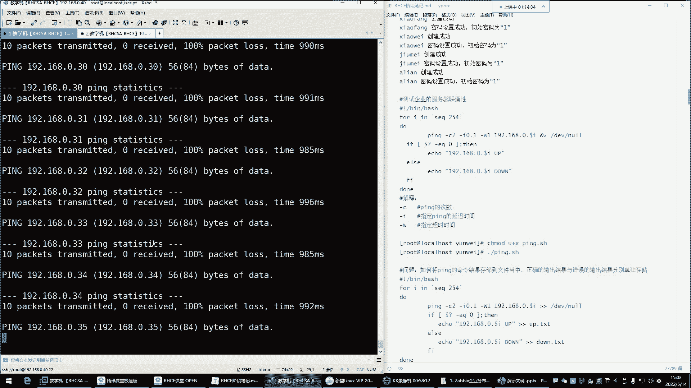

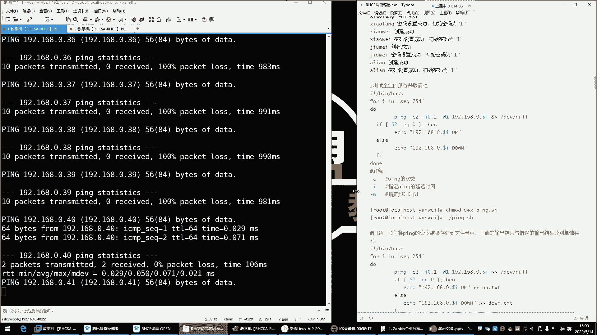

`for`循环的一个典型应用是自动化运维任务，例如测试一批服务器的网络连通性。手动逐一测试效率低下，而`for`循环可以轻松解决这个问题。

假设我们需要测试`192.168.0.1`到`192.168.0.254`这个网段内所有主机的连通性，我们可以编写如下脚本：

以下是测试服务器连通性的脚本：
```bash
#!/bin/bash
for ip in 192.168.0.{1..254}
do
    ping -c 2 -i 0.1 -W 1 $ip &> /dev/null
    if [ $? -eq 0 ]; then
        echo "$ip is up" >> /opt/net_up.txt
    else
        echo "$ip is down" >> /opt/net_down.txt
    fi
done
```
**脚本解析：**
*   `192.168.0.{1..254}` 是一个花括号扩展，它会生成从`1`到`254`的数字序列，等价于 `seq 1 254`。
*   `ping -c 2 -i 0.1 -W 1 $ip` 命令用于ping测试。`-c 2`表示发送2个包，`-i 0.1`表示间隔0.1秒，`-W 1`表示超时时间为1秒。`&> /dev/null`将命令的输出丢弃。
*   `$?` 是一个特殊变量，用于获取上一条命令（这里是`ping`）的退出状态码。状态码为`0`通常表示成功（即ping通）。
*   `[ $? -eq 0 ]` 是一个条件判断，`-eq`用于比较两个整数是否相等。这里判断`ping`命令是否成功。
*   根据ping的结果，将信息追加写入到不同的文件中（`/opt/net_up.txt` 或 `/opt/net_down.txt`）。

执行此脚本时，可以将其放入后台运行，这样就不会占用前台终端：
```bash
bash for_ping.sh &
```
之后，可以通过查看`/opt/net_up.txt`和`/opt/net_down.txt`文件来快速了解哪些服务器在线，哪些离线。

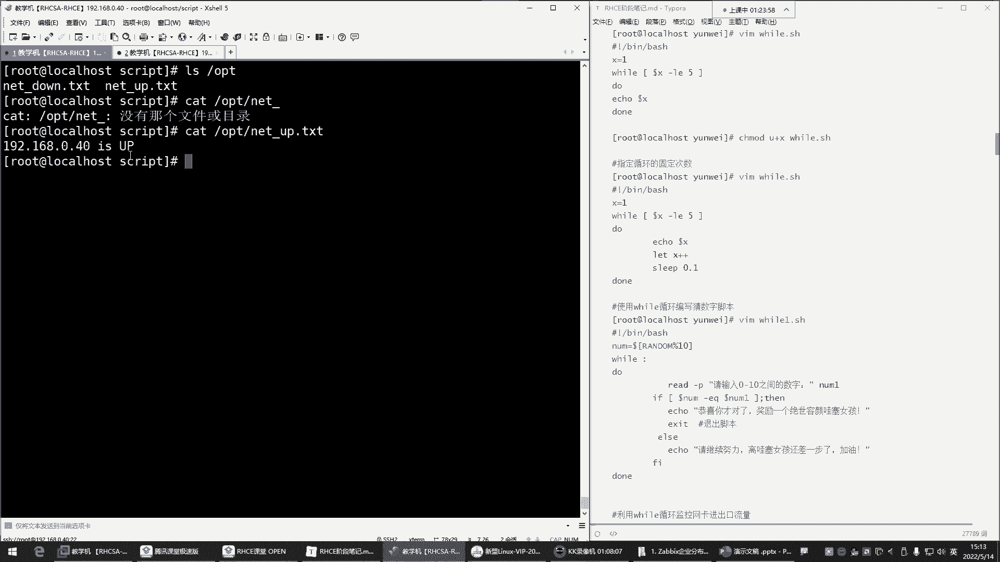

## 总结


本节课中我们一起学习了Shell脚本中两个强大的结构。
1.  **`case`条件判断**：用于多分支选择，语法清晰，适合替代复杂的`if-elif`链。
2.  **`for`循环**：用于重复执行命令，通过遍历值列表来实现自动化任务，例如批量创建用户或测试网络连通性。

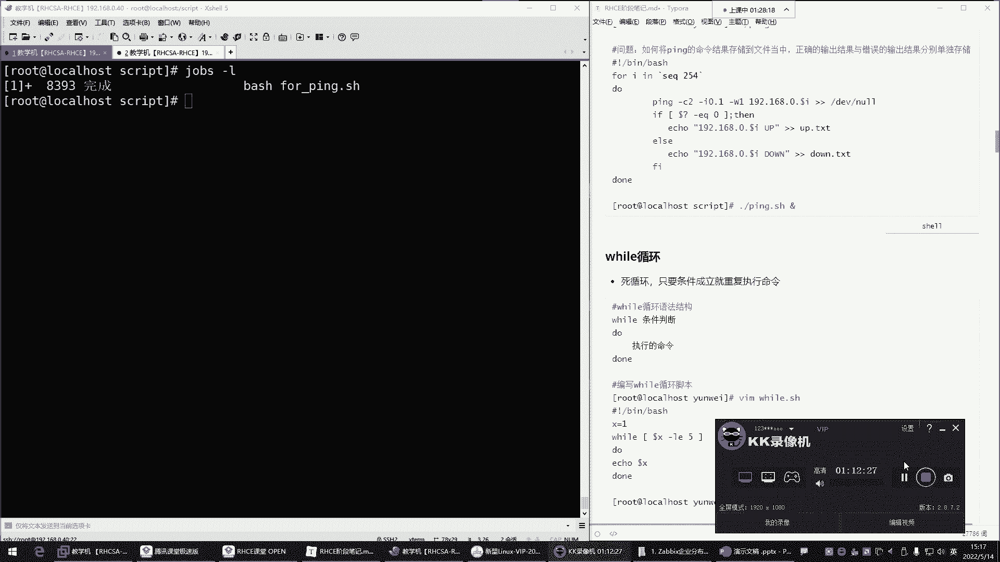

理解并掌握这两种结构，将极大提升你编写自动化脚本的能力，简化日常的系统管理和运维工作。