# Linux脚本编程：P46：Shell函数、脚本中断及退出、字符串处理 📚

在本节课中，我们将学习Shell脚本编程中的三个核心概念：**函数**、**脚本中断与退出控制**以及**字符串处理**。这些知识能帮助你编写更高效、更智能的脚本。

---

## 概述

本节课程将深入探讨如何利用`while`循环进行持续监控，如何通过函数封装重复代码以提升脚本的可读性和效率，以及如何使用`continue`、`break`和`exit`命令来控制脚本的执行流程。最后，我们还会简单了解字符串截取的基本操作。

---

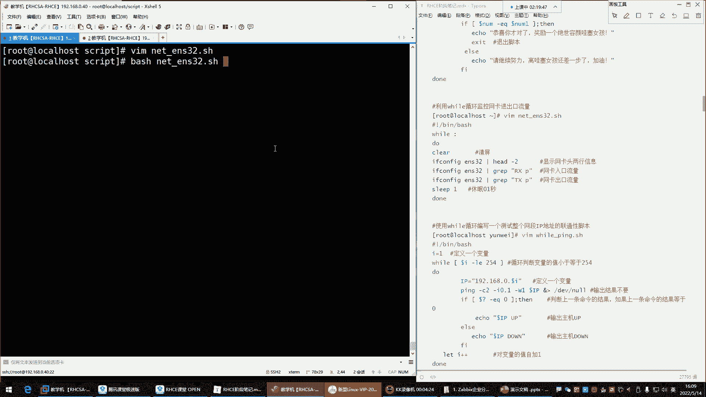

## 利用`while`循环进行持续监控 🔄

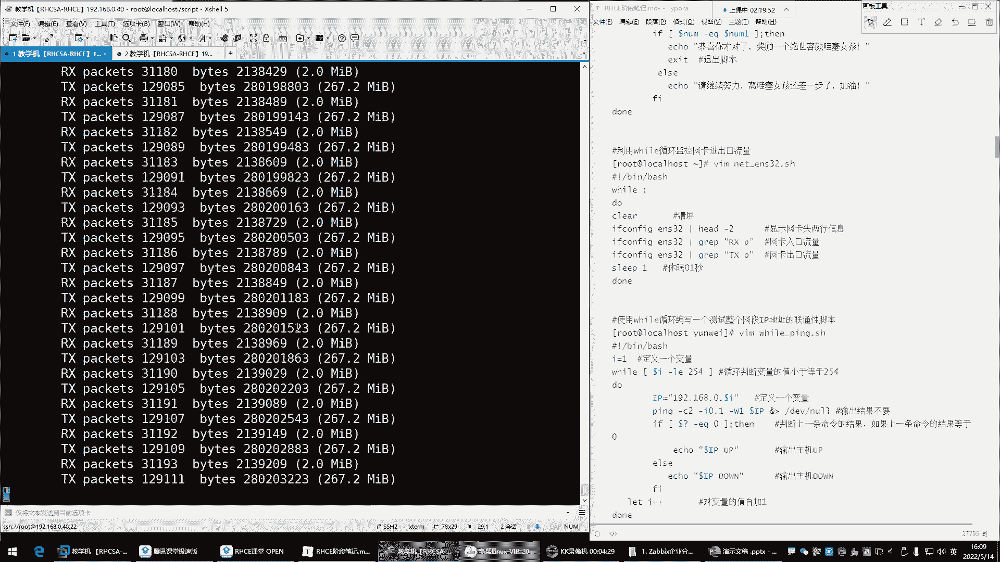

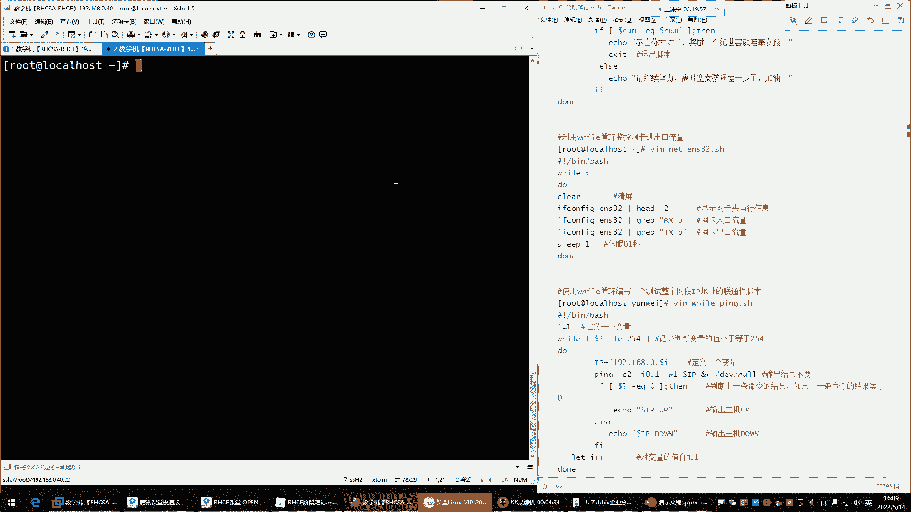

上一节我们介绍了`for`循环，本节中我们来看看`while`循环，特别是如何用它来实现持续监控任务。

`while`循环非常适合需要不间断执行的任务，例如监控网络流量、CPU或内存使用率。其基本语法是创建一个“死循环”。

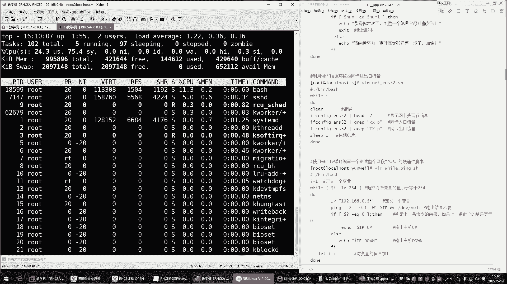

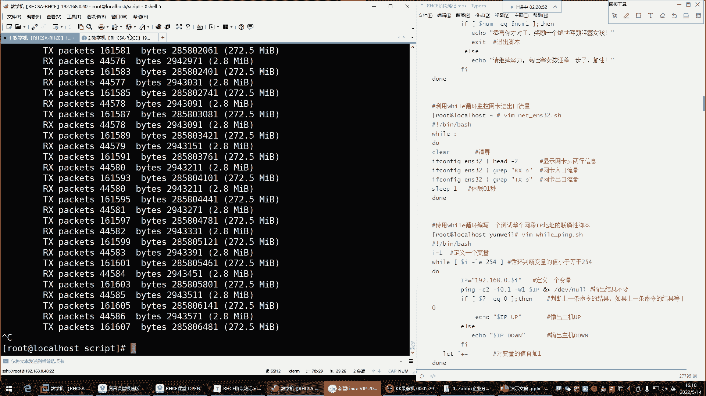

以下是`while`死循环的两种常见写法：

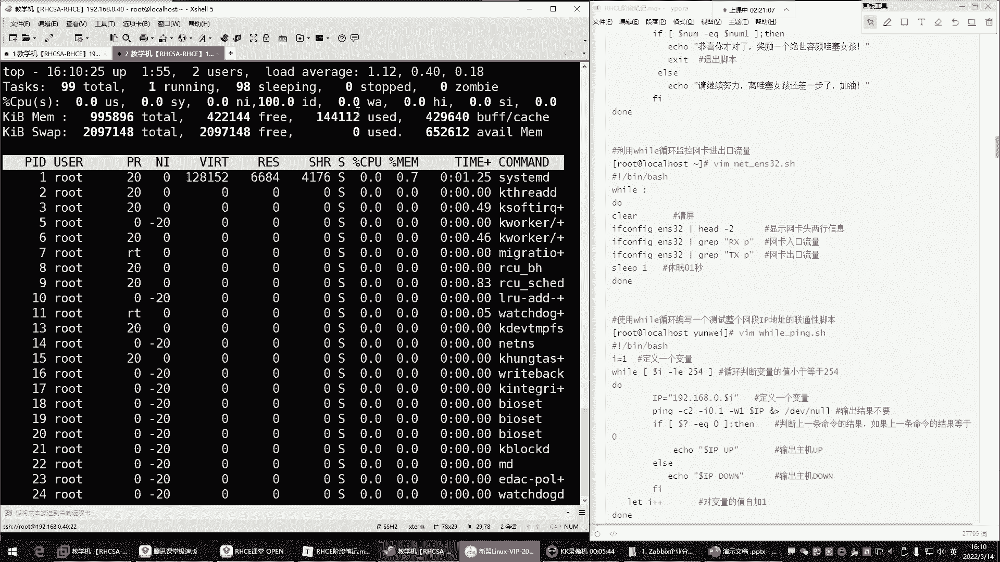

```bash
# 方法一：使用冒号
while :
do
    # 要执行的命令
done

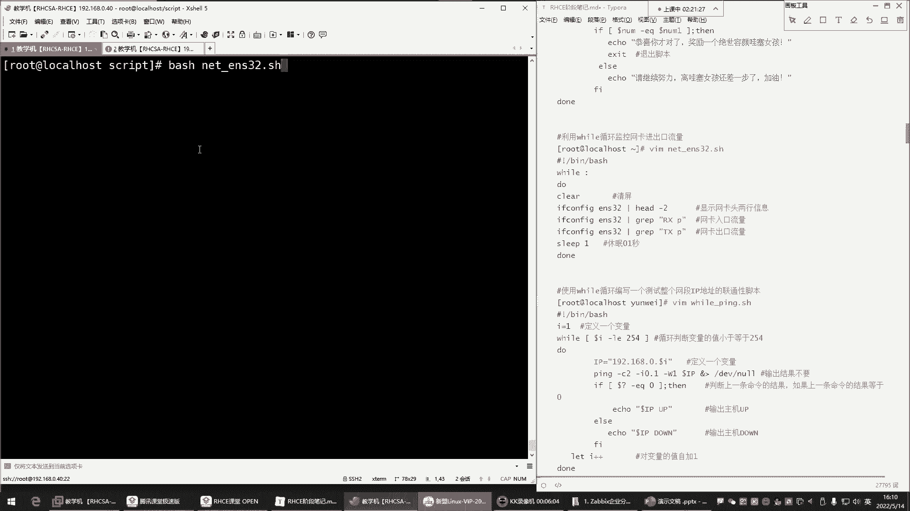

# 方法二：使用 true 命令
while true
do
    # 要执行的命令
done
```

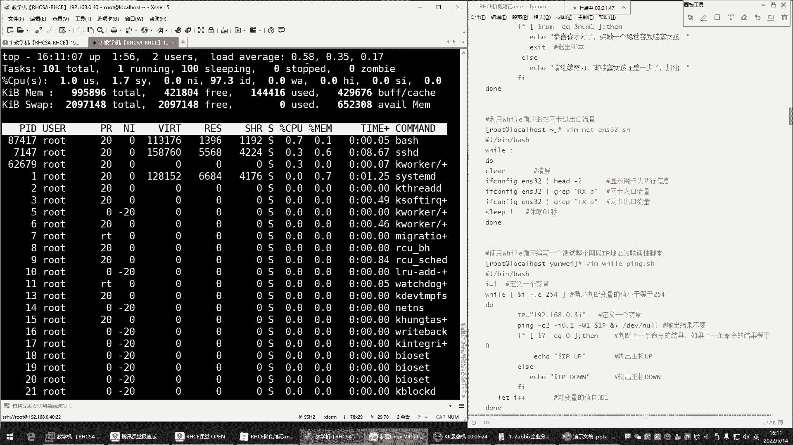

### 监控网卡流量示例

假设我们需要持续监控网卡`ens32`的入口（RX）和出口（TX）流量。

首先，获取流量的命令如下：

```bash
# 获取入口流量
ifconfig ens32 | grep “RX packets”

# 获取出口流量
ifconfig ens32 | grep “TX packets”
```

我们可以将这些命令放入一个`while`死循环中：

```bash
#!/bin/bash
while :
do
    ifconfig ens32 | grep “RX packets”
    ifconfig ens32 | grep “TX packets”
done
```

**注意**：纯粹的`while`死循环会疯狂消耗CPU资源。使用`top`命令观察，会发现CPU使用率很快达到100%。

为了解决这个问题，我们可以在循环中加入`sleep`命令，让脚本每次执行后“休息”一会儿。

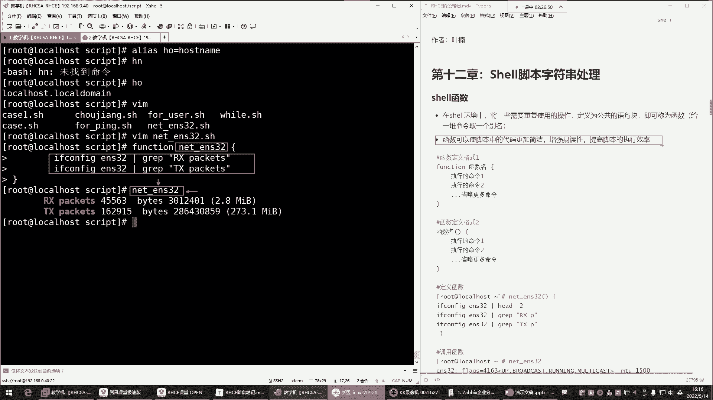

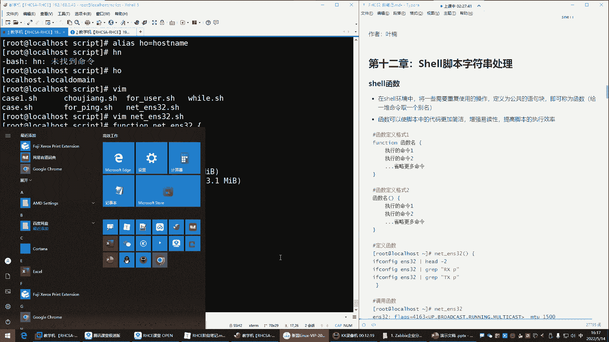

```bash
#!/bin/bash
while :
do
    clear # 清屏，让输出更清晰
    ifconfig ens32 | grep “RX packets”
    ifconfig ens32 | grep “TX packets”
    sleep 0.2 # 休眠0.2秒，大幅降低CPU占用
done
```

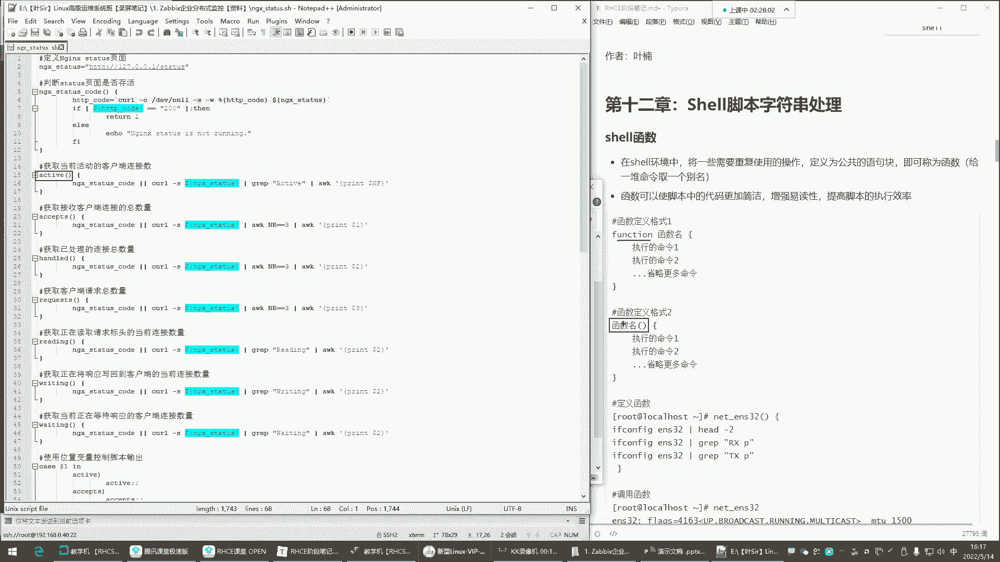

这样，我们就实现了一个对用户友好且不耗费过多系统资源的持续监控脚本。

---

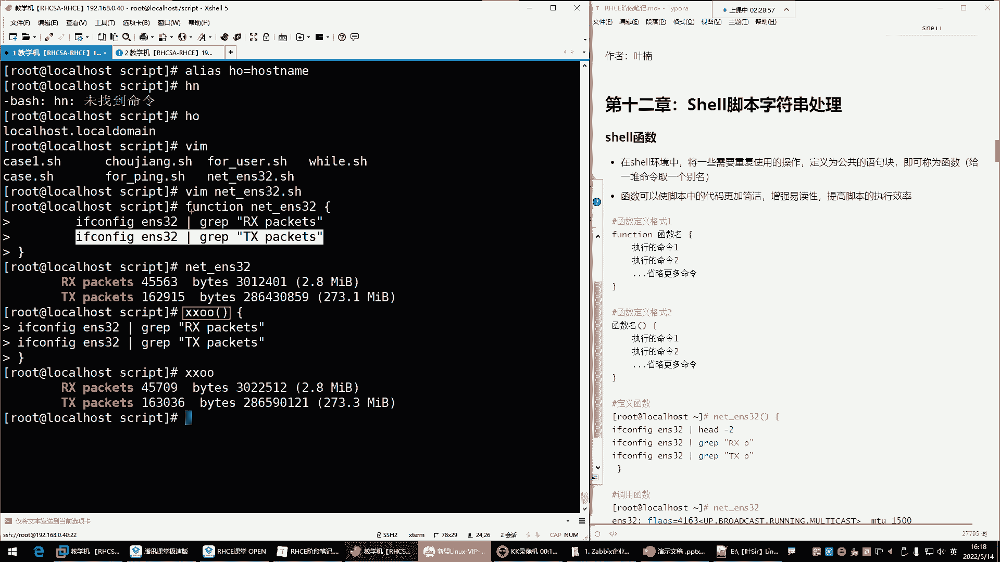

## Shell 函数：封装代码块 🧩

在编写复杂脚本时，我们经常需要重复执行同一组命令。这时，Shell函数就派上用场了。

你可以把函数理解为**给一堆命令取一个别名**。之前学过的`alias`命令只能给单条命令起别名，而函数可以封装任意多条命令。

### 函数的定义与调用

以下是定义函数的两种语法格式：

```bash
# 方法一：使用 function 关键字
function 函数名 {
    命令1
    命令2
    # ... 更多命令
}

# 方法二：省略 function 关键字（更常用）
函数名() {
    命令1
    命令2
    # ... 更多命令
}
```

定义后，通过输入**函数名**即可调用其中封装的所有命令。

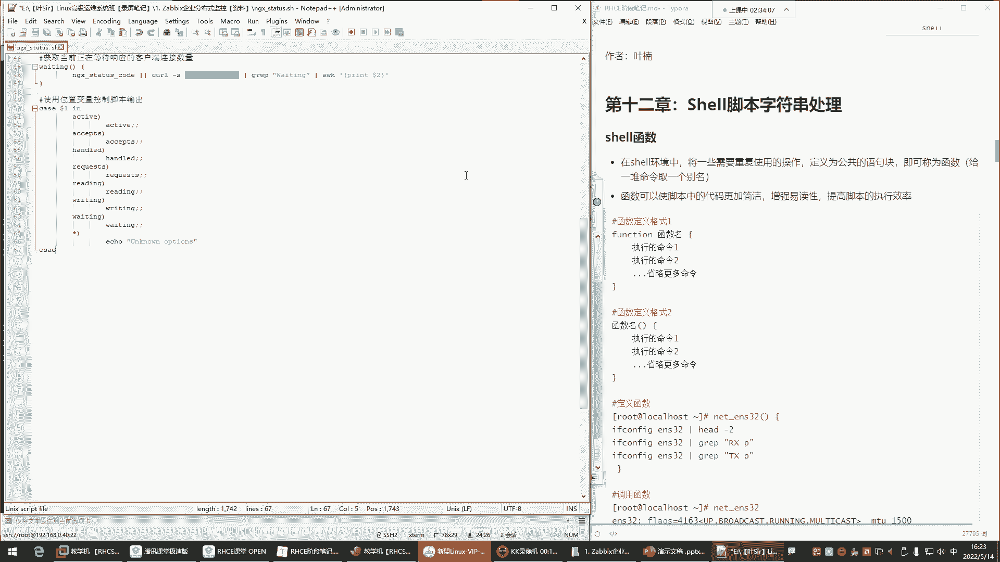

### 函数应用示例

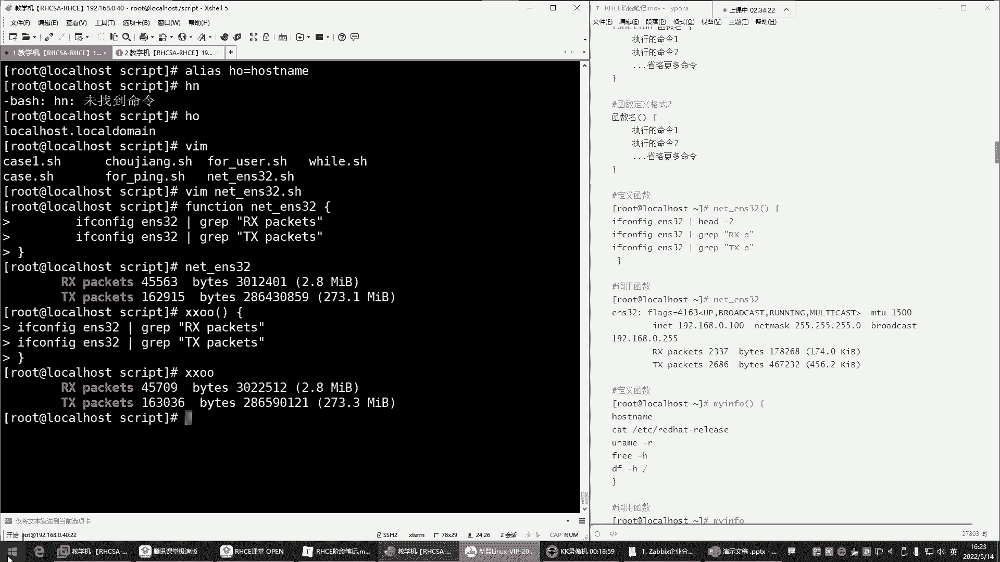

例如，定义一个用于查看系统信息的函数：

```bash
sysinfo() {
    hostname
    cat /etc/redhat-release
    free -h
    df -h /
}
```

调用时，只需输入：

```bash
sysinfo
```

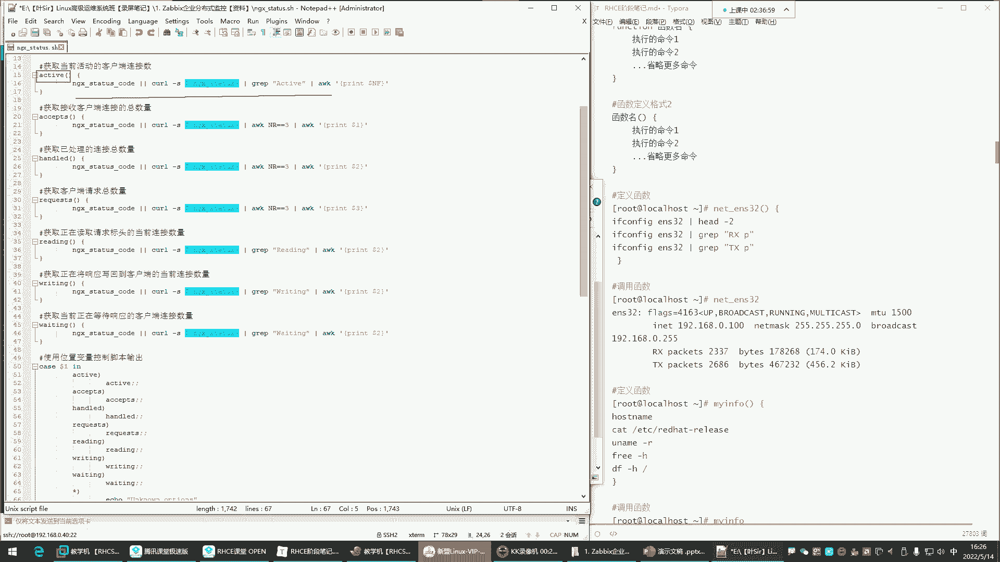

函数让脚本代码变得更加简洁、易读，也便于维护。在复杂的脚本中，你可能会看到函数内部又调用其他函数，形成清晰的模块化结构。

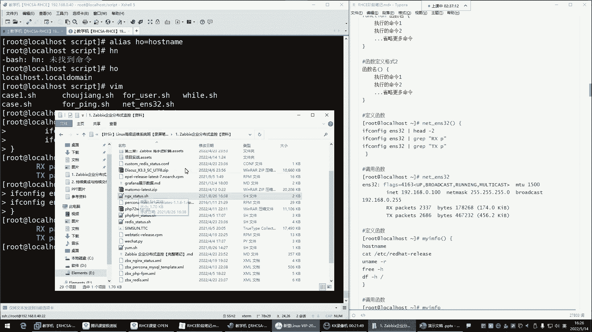

---

## 脚本中断及退出控制 ⏹️

在脚本执行过程中，我们有时需要根据条件跳过某次循环、提前结束循环，甚至终止整个脚本。

这就需要用到三个控制命令：`continue`、`break`和`exit`。

### 三者的区别

以下是三个命令的核心区别：

*   **`continue`**：**结束本次循环**，跳过`continue`之后、本次循环结束之前的所有命令，直接进入下一次循环。
*   **`break`**：**结束整个循环**，跳出当前所在的循环体（如`for`、`while`），继续执行循环体之后的命令。
*   **`exit`**：**退出整个脚本**，脚本立即停止，后续所有命令都不再执行。

### 控制命令应用示例

假设我们有一个循环，但希望跳过对特定IP（如`192.168.0.3`）的操作：

```bash
#!/bin/bash
for ip in 192.168.0.{1..5}
do
    if [ “$ip” == “192.168.0.3” ]; then
        continue # 遇到 192.168.0.3 则跳过本次循环，不执行下面的 ping 命令
    fi
    ping -c 1 $ip &> /dev/null && echo “$ip is up”
done
echo “Over”
```

如果将`continue`替换为`break`，则循环在遇到`192.168.0.3`时会**直接结束**，后续的IP都不会再处理。

如果将`continue`替换为`exit`，则脚本在遇到`192.168.0.3`时会**立即停止**，连最后的`echo “Over”`也不会执行。

---

## 字符串处理 ✂️

在处理命令输出或进行条件判断时，经常需要从字符串中提取特定部分。Shell提供了简单的字符串截取功能。

### 字符串截取语法

基本语法格式如下：

```bash
${变量名:起始位置:截取长度}
```

**注意**：起始位置从**0**开始计算。

### 字符串截取示例

定义一个变量并截取其中一部分：

```bash
phone=“13800138000”
echo ${#phone} # 输出：11，获取字符串长度

# 截取前三位（从位置0开始，截取3个字符）
echo ${phone:0:3} # 输出：138

# 从第4位开始，截取4个字符（位置从0算起，所以第4位是索引3）
echo ${phone:3:4} # 输出：0013
```

字符串处理在需要精确解析文本输出的高级脚本中非常有用，是文本处理的基础技能之一。

---

## 总结

本节课我们一起学习了Shell脚本编程中的三个重要部分：

1.  **`while`循环**：用于创建持续运行的任务（如监控），并通过`sleep`控制其资源消耗。
2.  **Shell函数**：通过将多条命令封装成一个可调用的名字，使脚本结构更清晰、更易维护。
3.  **脚本控制命令**：使用`continue`、`break`和`exit`可以灵活地控制循环流程和脚本的生命周期。
4.  **字符串处理**：掌握了使用`${变量名:起始位置:长度}`的语法来截取字符串的子集。

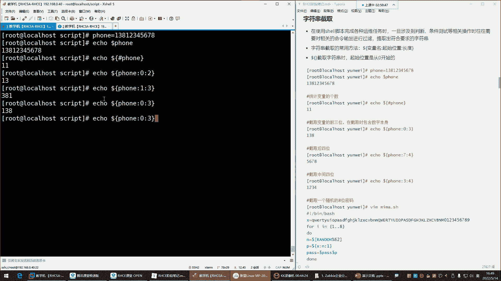

理解这些概念能帮助你从编写简单的顺序脚本，进阶到编写结构良好、功能强大的自动化脚本。