# Linux运维教程：P48：Shell数组与正则表达式

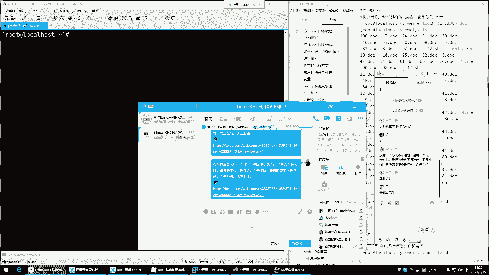

## 📚 课程概述

在本节课中，我们将要学习Shell脚本中的两个重要概念：**数组**和**正则表达式**。数组是变量的高级形式，允许我们在一个变量名中存储多个值。正则表达式则是一套功能强大的符号系统，主要用于文本数据的搜索与过滤。掌握这两项技能，将帮助你更高效地编写脚本和处理文本数据。

---

## 🔢 Shell数组

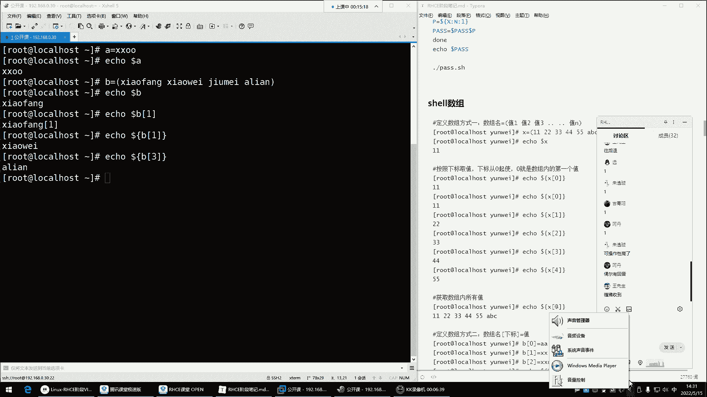

上一节我们介绍了变量的基本用法，本节中我们来看看它的“升级版”——数组。数组可以理解为一个能存放多个值的变量。

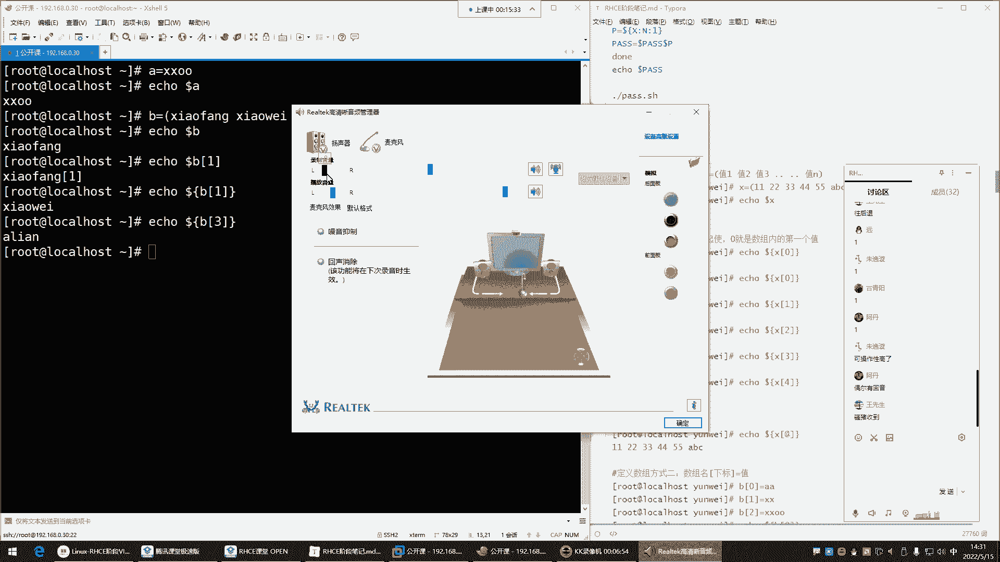

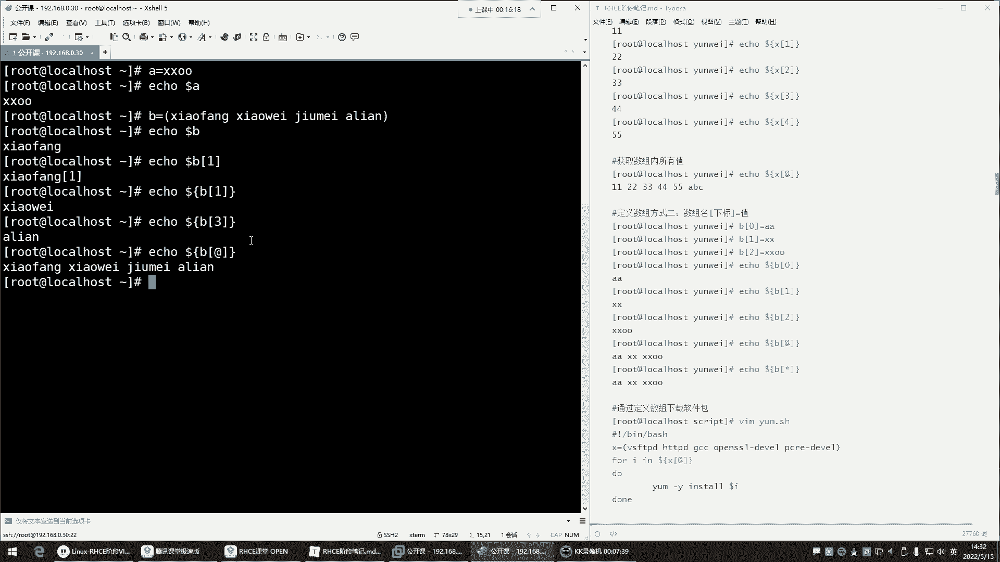

### 数组的定义与取值

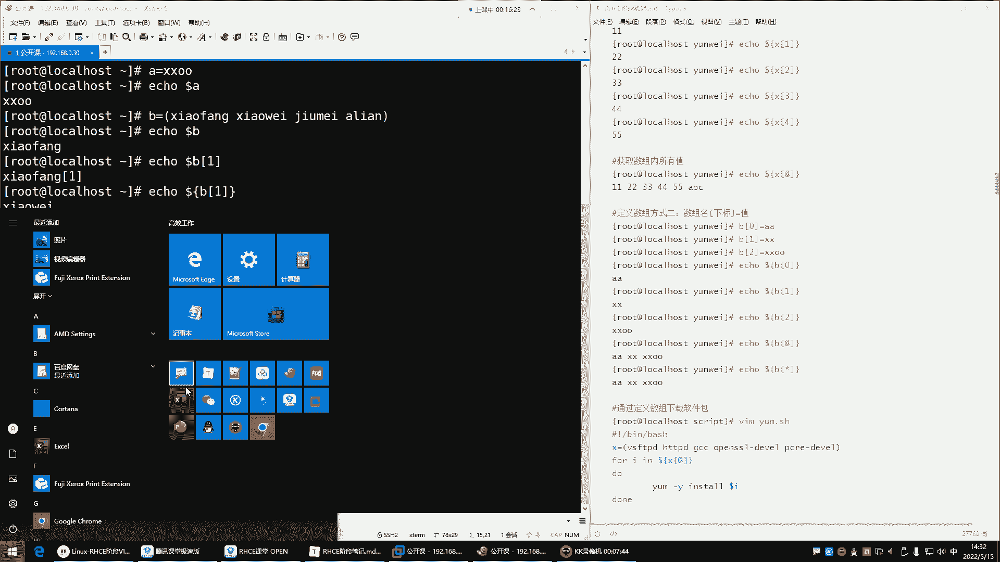


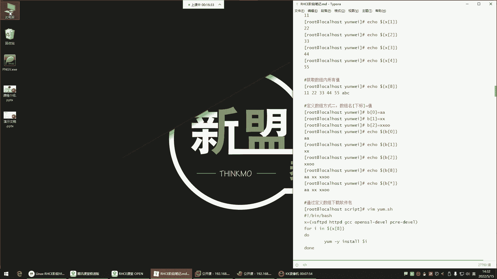

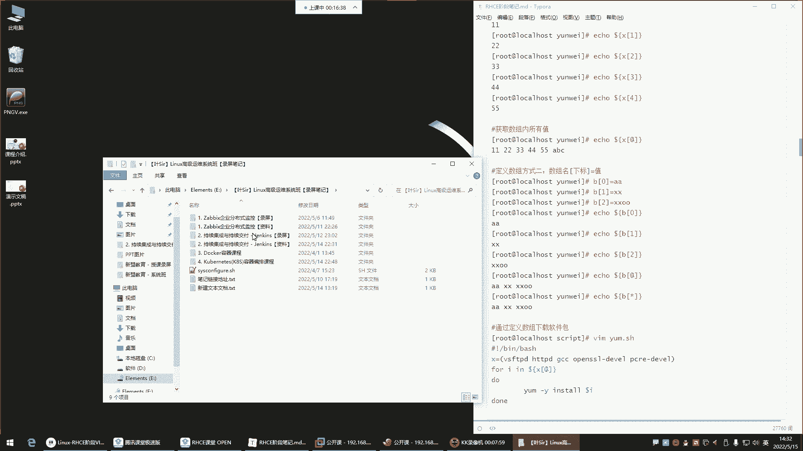

定义数组的语法与变量类似，但值需要用括号括起，值之间用空格分隔。

```bash
数组名=(值1 值2 值3 ...)
```

例如，我们定义一个包含多个名字的数组：
```bash
B=(小方 小V 九妹 阿联)
```

取值时，我们需要通过**下标**来指定获取哪个值。**数组的下标从0开始计数**。

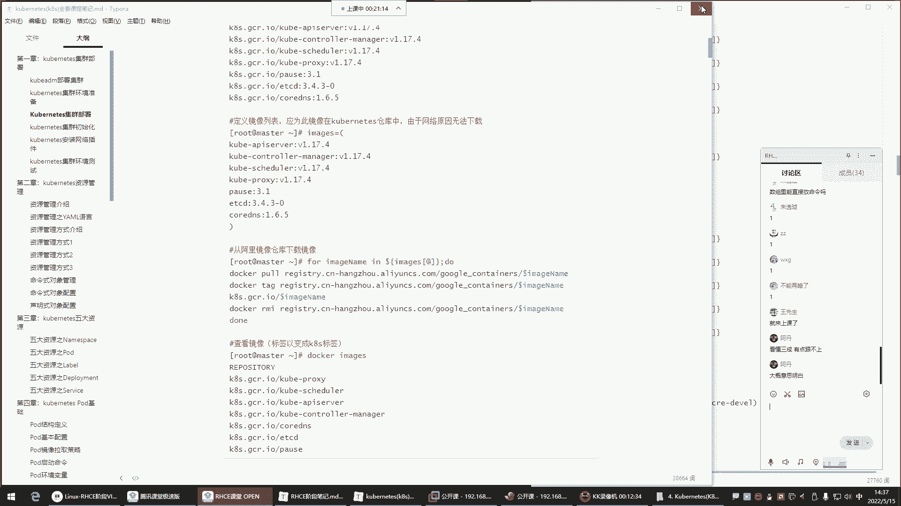

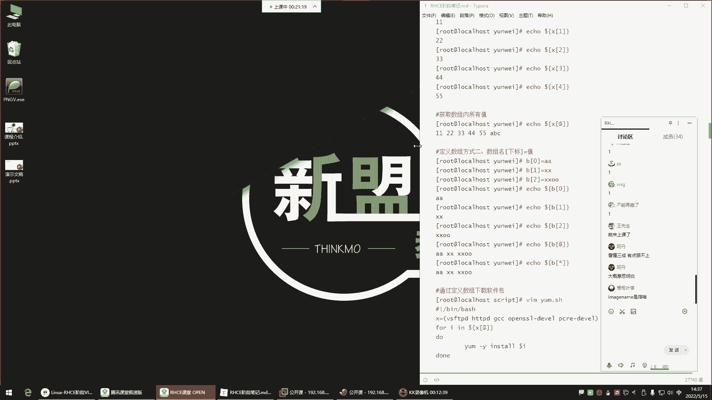

*   `0` 对应第一个值（小方）
*   `1` 对应第二个值（小V）
*   以此类推...

以下是取值的语法，注意需要**使用大括号**：
```bash
${数组名[下标]}
```

因此，要取出“小V”（第二个值），命令如下：
```bash
echo ${B[1]}
```

如果你想取出数组中的所有值，可以使用 `@` 符号：
```bash
echo ${B[@]}
```

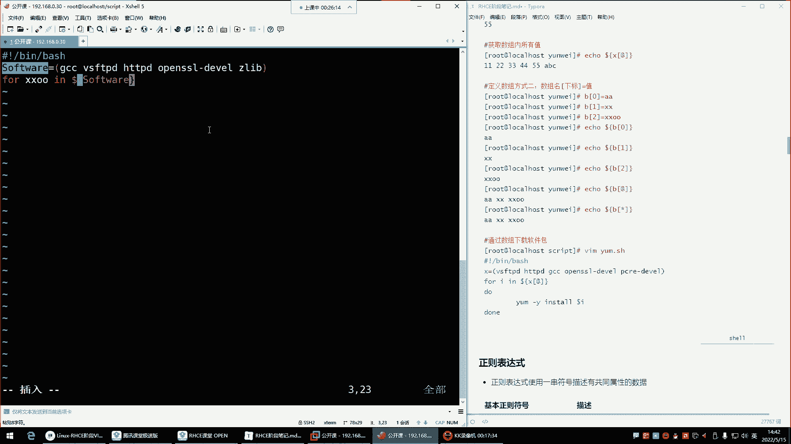

### 数组的实用场景

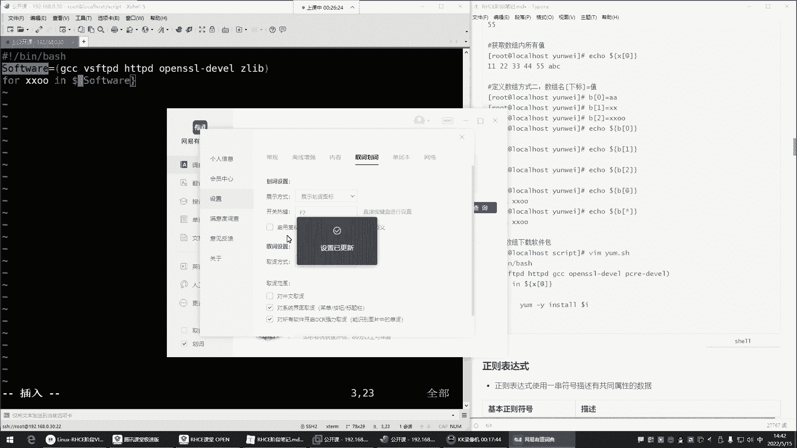

数组常与循环结合使用，用于批量处理任务。例如，在脚本中定义需要安装的软件包列表，然后用循环逐一安装。

以下是一个示例脚本 `for_array.sh`：
```bash
#!/bin/bash
# 定义一个软件包数组
SOFTWARE=(gcc vsftpd httpd)
# 使用for循环遍历数组并安装每个软件包
for pkg in ${SOFTWARE[@]}
do
    yum -y install $pkg
done
```

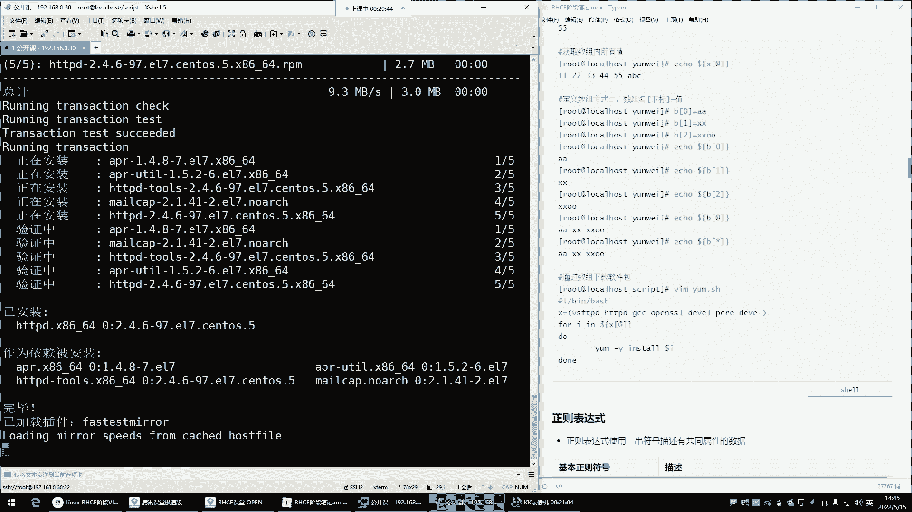

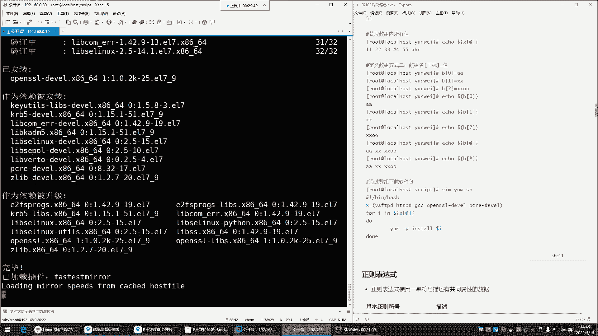

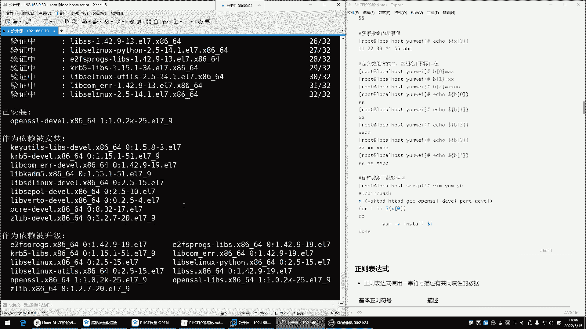

执行此脚本，它会自动安装数组 `SOFTWARE` 中定义的所有软件包。

### 向数组中添加元素

如果数组已存在，我们可以直接通过指定新下标的方式来添加值。

例如，向数组 `B` 中添加第五个元素：
```bash
B[4]=波多
echo ${B[@]} # 查看所有元素，会发现“波多”已被添加
```

**总结来说，数组就是一个可以存储多个值的变量，通过下标访问特定元素，使用 `@` 获取所有元素，并能方便地与循环结合实现批量操作。**

---

## 🧩 正则表达式

接下来，我们进入正则表达式的学习。正则表达式通过一系列特殊符号来描述字符串的匹配模式，它在文本搜索、替换和验证中极为常用，且在各种编程语言中语法相通。

### 基础元字符

以下是几个最常用、最核心的正则表达式元字符：

1.  **`^` (尖角号)**：匹配行首。
    *   `grep ^root /etc/passwd` 只匹配以 `root` 开头的行。

2.  **`$` (美元符)**：匹配行尾。
    *   `grep bash$ /etc/passwd` 匹配以 `bash` 结尾的行，常用于查找可登录用户。

3.  **`.` (点号)**：匹配任意**单个**字符（字母、数字、符号等）。
    *   `grep r..t /etc/passwd` 可以匹配像 `root`、`rapt` 这样的字符串。

4.  **`*` (星号)**：匹配前一个字符出现**任意次数**（包括0次）。
    *   `grep ro*t /etc/passwd` 可以匹配 `rt`、`rot`、`root`、`rooot` 等。

5.  **`[]` (中括号)**：匹配括号内的**任意单个**字符。
    *   `grep [abc] file.txt` 会匹配包含字母 `a`、`b` 或 `c` 中任意一个的行。
    *   `[0-9]` 匹配任意单个数字，`[a-zA-Z]` 匹配任意单个字母。

6.  **`[^]` (中括号内加尖角号)**：对集合取反，匹配**不在**括号内的任意单个字符。
    *   `grep [^0-9] file.txt` 匹配包含任意非数字字符的行。

### 扩展正则表达式

一些更强大的符号属于“扩展正则表达式”，使用时需要在 `grep` 后加上 `-E` 选项，或者直接使用 `egrep` 命令。

1.  **`+` (加号)**：匹配前一个字符出现**至少一次**。
    *   `egrep ro+t file` 匹配 `rot`、`root` 等，但不匹配 `rt`。

2.  **`?` (问号)**：匹配前一个字符出现**零次或一次**。
    *   `egrep ro?t file` 只匹配 `rt` 和 `rot`。

3.  **`|` (竖线)**：代表“或”，匹配其中任意一个分支。
    *   `egrep (root|test) /etc/passwd` 匹配包含 `root` **或** `test` 的行。

4.  **`()` (小括号)**：将模式组合为一个整体，常用于与 `|` 配合，或用于后续引用（分组捕获）。
    *   `egrep “(oo)+” file` 匹配包含一个或多个 `oo` 连续出现的字符串。

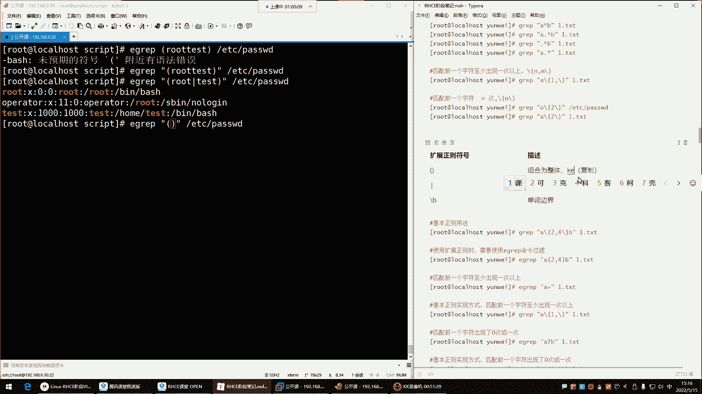

### 正则表达式应用示例

正则表达式主要与 `grep`、`sed`、`awk` 等文本处理工具结合使用。

*   **查找特定服务端口**：`grep ^ftp /etc/services`
*   **查找非空行**：`grep -v ^$ file.txt` （`-v` 表示反向选择，`^$` 匹配空行）
*   **匹配电子邮箱格式（简化版）**：`grep -E “[a-zA-Z0-9._%+-]+@[a-zA-Z0-9.-]+\.[a-zA-Z]{2,}” file.txt`

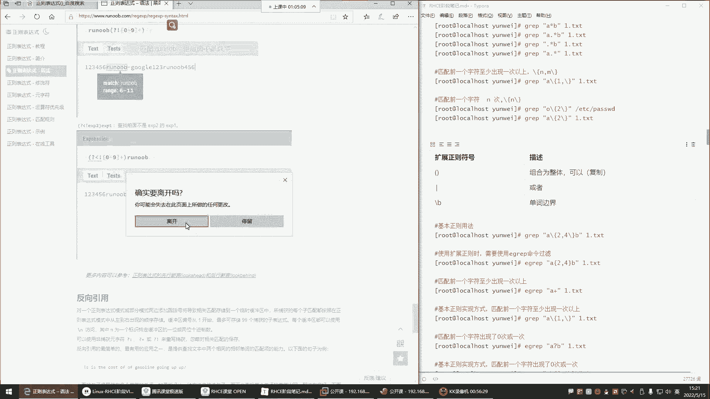

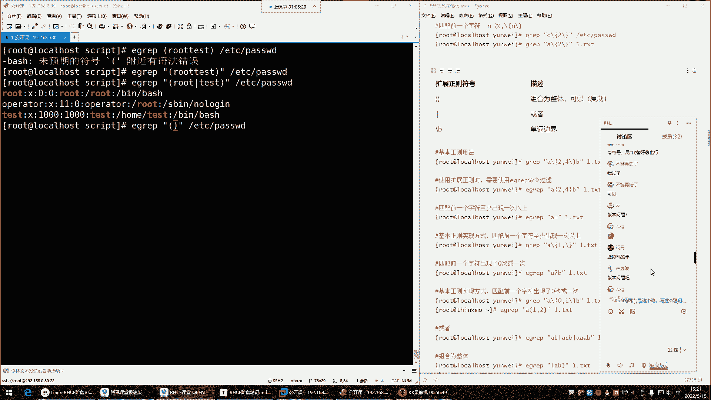

**对于初学者，不必一次性记住所有符号。建议先掌握 `^`、`$`、`.`、`*`、`[]` 这几个最常用的，在后续实践中逐步熟悉其他符号的用法。**

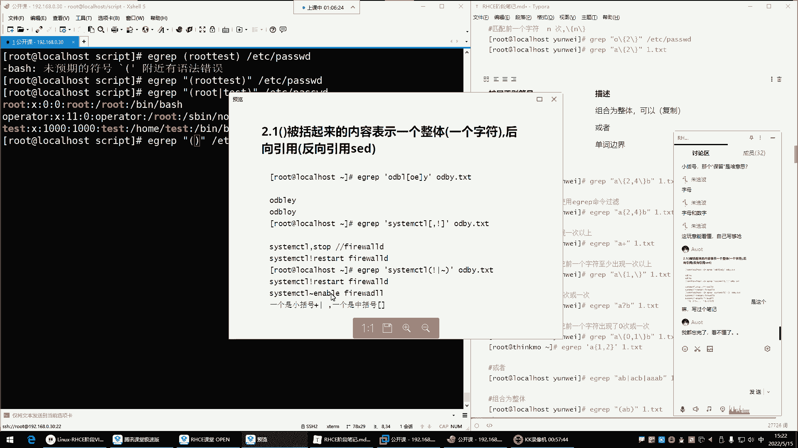

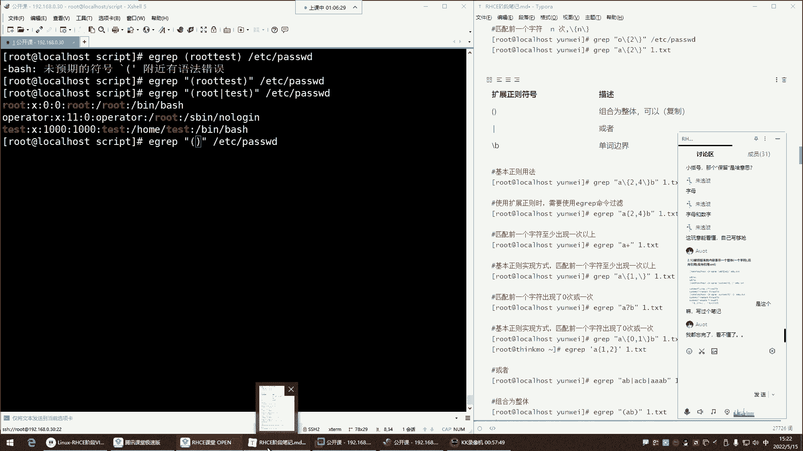

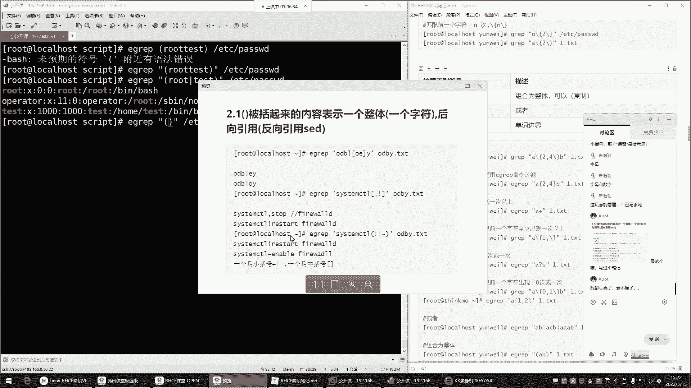

---

## 📝 本节总结

本节课中我们一起学习了Shell脚本中的数组和正则表达式。
*   **数组**是增强型的变量，用于存储多个数据，通过下标访问，极大地便利了批量数据处理。
*   **正则表达式**是一套精炼的符号语言，用于定义复杂的文本搜索模式，是文本处理中不可或缺的工具。

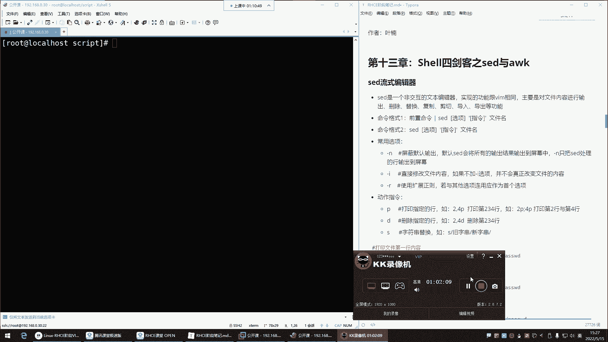

理解数组的结构和正则表达式的基础元字符，是你迈向编写高效Shell脚本和熟练进行文本分析的重要一步。在后续课程中，我们将看到它们在实际运维场景中的强大应用。