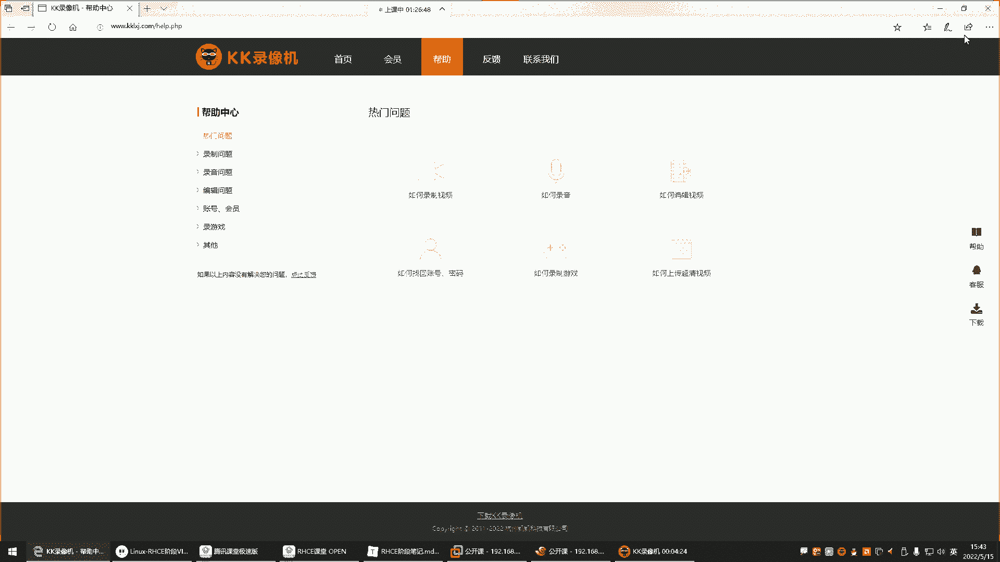

# 【小白入门 通俗易懂】全网最全RHCSA+RHCE教程，一周快速进阶Linux运维 - P49：红帽RHCE-13.Shell四剑客之Sed编辑器 - 网工小程立志不加班 - BV1PN4y1R7uU

喂喂喂，都回来了是吧，好这个哼这歌，这歌挺好听是吧，也比较喜欢嗯，分享一下，这也不能分享，这不在课程范围内啊，这个。

嘿嘿歌单是吧，诶歌单这玩意咋分享啊是吧。

截图吧嗯截图，我这里的歌哎呀都是一些老歌。

这个八零后八零后喜欢听的哈。

好继续了哈，接下来呢来看看这个设有四间客，里的seed跟aw k啊，这玩意儿它我们会用得到啊，但是用的多不多呢也还行，先来看C的C的专业名词叫流式编辑器，这个通俗点来讲，就是VM的一个另外一种实现方式。

为什么呢，因为要VIM我们在改文件的时候，VIM我们前面讲过不能放到脚本里面是吧，VM是交互的，你vim打开任何一个文件，我要改的话，你想想那是不是脚本没有办法去帮你，去这个对VM做后续的操作了呀。

他脚本就能帮你把文件打开，是不是脚本就能帮你把文件打开，然后呢那别的功能那得靠你自己手动了，但有的时候呢唉我要改文件，但是我不想去那个什么呢，不想手动改，也这个也想通过脚本来实现。

那seed是一个非交互式的一个VM啊，就是文本编辑器，所以它主要对文件内容进行增删改查，那VM不就是增删改查的吗，是不是啊，所以C的他就是跟VM的功能是一样的，只不过它是非交互的好。

那这玩意命令格式呢也比较这个也比较多，主要是它的用法呢比较多，花里胡哨的，第一种前置位定管道给C的，然后这是第一种和第二种C的，你直接对文件去处理就行了，那我们呢一会再说说这两种格式。

先说这条命令C的后边的选项啊，选项的话呢有杠N就是这个杠N的话呢，我们一会用的时候再说杠A杠R这些选项，那动作指令什么杂音删除替换好，来演示一下怎么用C的，我现在想去查看一个文件，VM可以打开一个文件。

C也可以打开一个文件，那它打开的话呢不是在一个交互式的界面，是直接给你显示的命令行了，所以C的我现在啊想看这个文件，那你就跟上etc的pass wd c的，加N啊还不是啊，C的不是平民模式输出啊。

来看一下啊嗯P，C的这点感有点陌生了哈，好久不用了，C的杠N打印，etc下的pass wd，我记得它可以用，不是这样也可以用啊，非得这样吗，加个P，这这这就是开了哈。

录屏开了哈。

啊对对对对对哈，不是加N哈对诶，我记得我记得这玩意不用加P是可以直接用的，但你看你要不加P他就报你语法错，那就必须得加个P回车就可以了，但P不一定引不一定非得引起来啊，这P是干嘛用的呢。

P就是给你打印的，给你打印，默认情况下你就C的PP就是print，print打印的意思回车，但是你输入print不行，他不认识，你就得P这样就可以了，那是不是跟YM一样啊，就直接把这个文件给你打开了。

看到了吧，哎但是这个文件里面怎么这么多内容啊，你发现重复了，是不是重复了哈，你看每一行都给你重复输出了，是不是啊，nobody是吧，输出两行，我我我们一般不用，我们一般是不是这样打印的，一般怎么打印呢。

哎指定打印的行，它这玩意就比较智能，怎么智能呢，你在P的时候看来你加个11P诶，不对劲，诶，你看这1P是啥意思呢，再来个3P3P回车，嘿嘿这3P也不行是吧，这玩意儿怎么都把这文件给你输出出来了呢。

好他这玩意是这样子的啊，要加个N更N3P这样就可以了，这样打印的是这个文件的第三行，我想打印文件的第六行，那就六批，这就是文件的第六行，看到了吗，是不是这玩意是不是比较给力啊，你给给定一个数。

他就给你打印，所以说这P是打印指定的行，那如果你不加P回车，那这时候就打印所有，但是你不加N，它有个毛病，不加N的话，你看它内容给你重复打印了，看了吗，是不是重，是不是重复了呀啊。

所以这个N1定要加叫做屏蔽的，屏蔽你的默认输出，默认C的会将所有的输出结果输出到屏幕杠，N是只把C的处理的行输出的屏幕，你不加杠N，你发现它给你打印的也都是很多重复的，所以这个N是精髓所在。

打印的时候这叫加N加N的话，他才会给你输出你想打印的内行，如果你不加N，你比如说你不讲你一批回车好文件的所有是吧，哎那你加N回头，你发现就只打印了文件的第一行，看到了吧，唉这个就是我们所说的嗯。

可以帮你屏蔽那些你不想看的那些输出，哎只把什么只把我想看的那个给我输出的屏幕，我想看谁呀，我想看第一行就只给我打印，第一行是这样子的，OK那下面我们再来看这个，这P都没什么问题吧。

那下面我们再来看这个P还可以怎么用呢，哎加逗号二逗号4P，二逗号四批逗号哈，4P啊，两到四个人来回车，这是啥意思呢，这个就是二逗号四，就是答案几行啊，234是不是啊，这是文件里的234。

那就是打印234行，我想打印，那么这个文件的6~10行，那叫六逗号十，那总共几行啊，啊6789十看了吗，在这嗯，678是五行，这就是打印啊，用逗号可以帮你打印一个连续的行，然后那如果我不想连续呢。

我就想看就想看第六行跟第十行啊，不是6~10，那这时候就，看看英文的冒号啊，不是啊，不是用的冒号啊，对不是英文冒号，冒号不行，是分号，分号是啥呀，就是它们之间没有任何的关系，但是这为什么说还报错了呢。

说什么遗漏的命令是吧，他要演起来，啊没有加个P，我看不演哈，不引这少个P哈，因为他们没什么关系，所以它无法识别你到底要干嘛，你看这六冒号十就打印第六行和第十行，那为啥卡在这儿了呢，啊这样可以。

所以一般我们要给它引起来，不引的话，他有的时候就有问题，所以C的你在用的时候，你就注意我前面给你们演示了那么多，没有瘾是吧，你那尽量都引起来不引就是有问题，所以你们就在用的时候。

就已就需要就要习惯使用引号，打印多少行，给它引起来就行了，你不演，有些特殊符号被系统会识别为，是一些特殊功能的符号，而且对于C来讲，它也无法识别啊，这是这个是第六行，这是第十行，能理解吧，总共两行啊。

因为这个分号前面讲了是吧，他们之间没有任何关系，就比如说我想建个文件，Hello，点TT分号，我想安个包，YM杠外套，前面命令跟后面命令没有任何关系，对这里这里打印的意思是输出到屏幕没错。

并不是真的用打印机打印没错，你的理解是对的哈，他不是用打印机给你打印，不是给你这个不是给你直接打印一张纸出来，不是哈，就是给你输出到屏幕啊，就是我们如果说打印的话，大家无法理解。

就输出是不是哎你们到时候自己改一改是吧，你们手里不也有笔记吗，哎叫输出啊，咱们但是呢因为官方是这样解释的，就输出，输出哈，这样能理解了好，那下边，我们再来看是不是想打印几行，就输入数字就可以了呀。

好接下来我们在演示什么呢，再演示这个删除删除我想删，那我们拿这个文件来演示哈，删这个文件现在多少行呢，这个文件现在我们看一下WC统计一下，等L统计pass wd21，好好，那我现在用C的要删除文件。

C的杠D注意这时候不是输出了，是删除了啊，删第几行，单眼双眼都行哈，删第几行呢，删文件的第六行三第六行，那这个是N屏蔽默认输出，然后6D跟上那个文件名或者，怎么没有输出呢是吧，没有输出。

为什么没有输出呢，因为他给你删了，你删了的话，他怎么给你输出啊，是不是啊，他你看不到哈，删了以后你是看不到的，然后那你说那他真的，那我自己再过滤一下不就行了嘛是吧，WC杠L回车，诶，不对啊，还是21行。

为啥呢，没删，不是是注意哈，我们这个删除和替换的操作，它不是真的生效了，是怎么样呢，是你得用更I这个选项，I是直接修改文件的内容，否则在命令行里面这种完全是啥呢，就是演练啊，这叫演练。

如果真涉及到实操的话，这个选项不能杠N你平不平平，不屏蔽，不能输出，没啥意义，没有意义哈，因为它不是真的对文件做修改，所以杠I6D回车6D就是删除第六行啊，这时候我们再WC杠L原先是多少行。

21行是不是哎，变成20行，你再删删5D，删除第五行回车，当然我们就下删哈，加下删，管它第一行呢我就想看看真的删除了吗，哎变成十一五行了，是不是啊，所以你发现这玩意儿是不是就是VM啊。

如果你用VM删怎么删VM，打开文件是不是发文件，我要删第一行，删除第五行12345DD，然后再保存退出，麻不麻烦，是不是麻烦，那用C的呢，哎C的杠I删除第几行，第五行五帝，然后文件名回车没了。

WC杠也统计一下没了，是不是啊，你看这干的事不就是vim的事吗，只不过他在命令行里面直接不用进到文件里面，直接命令行里面就给你操作了，你说要删第几行，你支撑啊，他就直接干嘛呢，给你删了，比较给力是吧。

然后大家在删之前，比如说我想删这个文件的第五行尽量先干嘛呢，先C的杠N屏蔽默认输出，先看一看第五行是不是你想删的那个，给我看第五行啊，这个确实是我想删的，那这个时候你在干嘛呢，哎在直接改源文件。

你别上去就删5D回车，哎那这样的话呢是非常的精准啊，我一看啊，这确实我想删的内容，那这时候再直接改源文件，前面先看一看，下边再去删，能理解吧，好，然后，那我们这种命令是不是。

就是直接用C的对文件去操作的呀，命令格式二是C的选项，指令选项我们用哪些选项呢，有杠N最常用的屏蔽公式输出是吧，主要就是只把C的处理的给我显示出来，然后杠I杠I这个选项是直接对原文件做修改。

如果不加杠A选项，并不会真正对文件的内容造成实质的改变，然后那杠杆呢使用扩展正则啊，这个很好用很好用啊，这玩意儿，然后就这两个是最常用的啊，那就指令指令的话，对前面是选项是放在C的后面的。

你到底是输出还是直接针对源文件操作，最最常用的选项，那指令这里边哎有打印，有删除，有替换，那我们一般就是如果你想查看文件内容的话，就用P这干嘛呢，哎他就你用杠N把默认输出给他屏蔽掉。

然后只打印你想查看的那个行，然后D就是删除删除就没有必要加这个杠N了，为什么呢，删除的话是要直接对文件改的，因为你删的话，你是看不到的，他直接就给你删了，也不给你显示，所以你在删的时候。

就像我前面那种给你们演示的时候，你发现你就是删你加杠N没意义，C的你杠N屏蔽没人输出是屏蔽了，然后你比如说我5D删第五行回车，那默认输出屏蔽以后删了它也不给你显示，所以这个就没有意义了，你想删的话。

还是前面那种干嘛呀，先打印啊，就是我们杠N杠N先打印，打印第五行，看是不是我想删的，然后再什么呢，哎再杠I35D回抽能理解吧，所以你看这里面这杠N主要是不是，就是你在打印的时候是最常用的呀。

那把你把他的那些默认的输出，我不想看的输出给我屏蔽掉，那如果我想对文件的内容做一些实质的修改呢，那是不是就是杠I再结合下面的指令，什么D跟删除或者替换呢，那我们用C的，无非不就是对文件内容做修改的吗。

要么就是删，要么就改是吧，要么就替换啊，但是主要还是替换为主，你改就是替换山替换也可以实现，是不是啊，所以这玩意儿它跟它俩结合着用嗯，往文件里面添加东西，添加东西EO啊，echo增加，嘿嘿，是不是呵呵。

我往文件里面增加一行啊，echo a b CD到这个文件是不是追加进去，是不是cat，这不就是ABCD吗，是不是，那接下来我们这些都演示了是吧，N跟IN跟P连用，A跟D和S连用，那D呢我们也演示了。

这都比较简单了，主要就是C的，比如我想删个连续的杠I啊，删就那这时候先打印一下啊，我也不确定是吧，先打印一下，我想删的是，逗号七啊，第五到第七行先给我打印一下，回车看看这三行567是不是我想删的好。

是那在干嘛呢，seed换成I直接对源文件修改，那这时候就不要P了吧是吧，就D了，删没错，这就删了，唉来这个位置有没有问题，这个选项跟质量没问题，没问题的，给我刷个一，比较给力是吧，比较给力哈。

这玩意这就是直接不用进到文件里面啊，就改它啊，那接下来我们来说说替换替换嗯，对咱们说替换怎么玩，那VM替换怎么怎么替的呀，打开文件是吧，英文的冒号来到底线命令格式，然后百分号是不是替换替换符旧内容。

比如我想把ABCD替换成XXOO是吧，回车诶，没有加S哈，没有加S百分号S回车，你看是不是变成叉烧了呀，那C的怎么替换呢，哎类似C的，现在你替换的时候可以先干嘛呢，看一看杠N哎。

先看看它是否是你想替换的那个嗯，有种感觉是吧啊，C的更N，然后呢要替换了，那替换里边也是S来表示，替换也是斜线作为替换符，然后我想把文件里的什么呢，叉叉OO替换成哈哈好，哪个文件，这个文件回车。

怎么没有打印是吧，这哈哈回车你看是不是把插槽替换成哈哈了，是不是变成hello吧，好那一看可以替换成功，但是这时候源文件我们是用P打印的，是不是不是修改呀，那接下来诶再去对它做修改C的杠I。

然后我们在对文件内容做真正的替换了，S哎什么呢，把叉叉OO替换成哈哈，那这时候还是P了吗，不能是P了吧，因为前面你已经指定替换了，是不是啊，然后跟文件名就行了，回车看文件变成哈哈了，看了吗，是不是啊。

变成哈哈了，这就是唉你在替换的时候，你可以先确认一遍，就像我们前面在删除的时候，先给他打印一下，看看这到底是不是我想删的，你在替换的时候，你也先打印一下，看看是否是你想替换的，哎你看这玩意儿是不是。

但是你不需要进到文件里面的那VM，你想想你我们还得跑到文件里面去，麻不麻烦，非常麻烦吧，啊非常麻烦，像我前面写的创建用户的脚本，每次都得跑到文件里面去改它的名字是吧，那以后有C的，是不是你直接指定SE。

我把文件里的直接是吧，杠I，比如说如果文件里面，我需要把哪些内容给它替换掉，是不是就S去匹配啊，在这S匹配啊，比如说我想把变量名里的那个小方，替换成小泽好，然后跟上那个脚本啊，优色调SH。

那是不是直接就把变量名写的小方，替换成小泽了呀，你都不需要跑到文件里面去了，没错吧，好我想把这个文件里的root替换，这root替换来看一下，我先干嘛呢，先看一看杠N杠N，咱们先看一看啊。

我要把那个文件里的root替换一下，把root替换成谁呢，哎替换成AME，回车没有打印没有打印哈，回车啊，那你看射板root直接贴换成我的命令，没错吧，哎那好像有点不太对劲儿，哪里不对劲呢。

就是这后边的怎么没替换呢是吧，我想实现一个叫全文替换，只要是root的都替换，那这时候加个G，G代表全文，VM里边是不是也是G代表全文，这叫全文替换，你看那就是告诉你了啊。

我帮你把这个这一行给你替换了啊，你看看是不是我们想替换的，你看啊，是确实是啊，我要把所有的root替换成admin，那这是不是就相当于改了呀，是不是啊，你替换不就是修改吗，好那这时候你再这样杠爱杠爱。

真正去修改源文件替换，那修改的时候还打印吗，不用打印了吧，前面不是已经打印了吗，是不是也看了效果了，哎回车，那这时候就变成鹅的名字，看了吗，是不是就听完之后我的命令，这个替换有啊，有有没有问题嗯。

没有问题的，给我刷个一，是不是比较好理解，这玩意儿就你VM怎么替换的，就它类似就类似哈，替换啊，那我们再往文件里面再增加一行，增加一行哈，我们再把这个我们怎么演示呢，嗯再把这个再给他增加到文件里面去。

打开这个文件啊，打开这个文件，在咱俩在这儿插入一行，插入一个，然后略微改一改，给他改成，不是随便改哈，随便改，那我刚刚添加的是谁呀，这个是吧，是他好，那我现在过滤这个demo，过滤代码用C的也一样。

C的，然后杠N它支持正则，这样支持正则哈，先匹配一下正则，给我匹配一下匹配，如果哪一行包含demo的，给我打印回车，嘿你看这玩意儿哎，你可以不通过这个指定行，你可以用正则，正则一定要放到这个什么呢。

这个斜线里边，否则无法识别，你不能这样啊，不能直接demo p看了吗，不行，你放到这个里边，就是代表我你去给我过滤这个包含demo，然后打印，还可以根据指定的字符串或者说关键词去打印。

也可以直接指定行数去打印，但有的时候我们会有一些需求啊，我就想从文件里面去干嘛呢，哎去做一些查找，啊对呀，这个两根斜线就代表是正则了，两根斜线哈表示正得了，这里面利用正则表达式可以去什么呢，去做匹配了。

但是正则表达式要在两根斜线里边，就在这里边也可以加一些符号，就是你想去过滤的话，你可以加正则表达式，但是一定要放到这个两根斜线里面，哎这样它就识别了啊，原来是用正则表达式的方式去过滤，是这样好。

那接下来我们过滤出来了是吧，那现在两行都一样，我想替换的是谁呢，哎是他，但是现在他把这两行啊都给我匹配出来了是吧，那我怎么替换呢，我想把所有的demo替换成别的是吧，那这两行怎么替换呢。

这时候就得这样搜索，哎这样搜索，搜索出来了，然后干嘛呢，替换先搜索啊，或者是这样啊，我看看这是不是搜索出来的，然后S替换调成什么呢，那你这样两行是不是都替换了呀，那你可以区分一下，区分一下。

啊这个哈我看一看，啊看这玩意儿应该，这时候应该怎么实现这个功能呢，嗯如果是这样的话，我们可以看一下它得多少行啊，看一下行号，我们看这个行号怎么来实现哈，这个这个，等于号，我们先把这个命令还是这样拿过来。

正则正则，然后干嘛呢，这个位置放个等于号，嗯这样可以吗，不行啊，嗯那就等一号，我看看怎么放哈，嗯这样这样放也不行啊，他这玩意儿这样放啊，这也不行，诶，嘿这个这样的啊，看看管道一下，管道给管道给谁呢。

看这时候诶，有没有什么方法把这个行号给他显示出来啊，有啊，如果你不加P的话，它是这样用，等于号可以啊，那这样看的话，可能说看的不是很精准，唉你看有人说了，是不是啊，拜指结尾是不是啊啊那我们试一试啊。

试一试他这种方法啊，他这种方法他说哎来试一试，这个可以吗是吧，哎咱们试一试，C的杠I是正则表达式，但是引起来引起来哈，In fact，但是先干嘛呢，先杠N1下，输出一下，看他这种语法分析分析。

唉可以你看他这个可以，是不是啊，这种方法就先过滤败指结尾的，然后如果你替换的话，我们在这儿就加个G全文替换，然后这个位置我觉得可以的话，我在干嘛呢，我在杠I是不是哎他这种方法也行，也可以是吧。

那如果你觉得其实有很多种方式，下面这种我先给它过滤出多少行也行，第七行是不是啊，你看这个跟这个这是在第七行，那C的杠N，然后他这玩意儿可以，前面指定行号是指定行号，指定行号，指定行号呢。

这是直接指定行号在这第几行，第七行，然后我对第七行做替换替换，把第七行的这个demo替换成叉叉O然后打印一下，也行是吧，看到吗，替换了吧，然后全文替换哎也行，唉然后或者说就像他刚刚那种。

哎咱们不指定行数，我先匹配一下正则表达式，匹配demo，匹配完了之后替换全面替换，但是要加个BH结尾哈，不是要匹配BH结尾的batch结尾，哎，拜师结尾的好，然后替换，你看这玩意这里是不是这个同一种。

就是你想实现同一个功能的方法可以有很多种，唉就是这姿势有很多种啊，就看你喜欢用什么样的姿势啊，但是姿势要正确不正确，那最终不行，干啥事姿势得对是吧，好这是替换啊，结合正则表达式啊。

前面也可以指定行数行数，这个位置有没有问题，这个位置都没问题吧，嗯嗯没问题嗯，然后这里面有很多的例子，大家可以下去练一练好吧，可以练练，因为就这玩意儿，我这里面的例子还是蛮全的啊，你们如果自己没有思路。

就看我的这个笔记啊，笔记里面怎么敲的，那你就先给他过一遍，过一遍哈，C的位置有没有问题，没有问题，啊那剩下前置命令管道给C的啊，这个一般就是用的比较少一些，还是这种直接C的处理文件用的比较多一些。

那前面前面管道的话呃，你这个就是你给什么命令，你需要用C的帮你处理一下，也可以也可以，我看我这里边没有眼神，但是用的比较少哈，那种方法主要还是直接用C的，只用C的，没有没有什么演示，因为用的不多。

用的不多，你像管道这东西，管道这些东西啥啥都能传递，是不是啥都能成立，那以后说别人有需要的话啊，比如说我需要这个对我的前面的命令的结果，交给seed，再去处理一遍也行也行。

比如说哎我先这个先grape啊，过滤一下文件，过滤谁呢，过滤root或者admin，过滤从文件里面过滤了是吧，过滤出来之后干嘛呢，管道给seed，seed给我替换一下，替换替换什么呢啊。

这是想想怎么处理，就看情况啊，或者直接给我删掉啊，如果说是bin的C的杠I，然后直接过山，这山就直接D啊，我看这样行不行哈，C的杠D回车啊，没有输出，没有输入文件不行，这样玩不行，这样玩不行哈。

这种这种比较少还更麻烦了，你还不如用C的，我直接去匹配了，是不是啊，干嘛还用grip，是没有这样玩的，一般这种用的太少了哈，主要就大家聊一下就行了，这种命令格式有这是seed。

然后你看我这里面是不是有很多例子啊，大家可以去列列列列哈，哎做比如说将文件里的所有数字都给他替换了，怎么表达所有数字0~9，将文件里的所有的英文字母给我替换了，怎么表达所有的英文字母A到Z。

小写A大写的Z就是小写字母也包含了，大写字母也包含了，然后全文替换，这里面下去练一练哈，这里面C的这种这种练习的还是什么的，还是非常能够开发你们对seed的一些，这个就是比如说它的各种花里胡哨的玩法。

前面没有来听，你都听好几遍了，好然后接下来AWKAWK是干嘛的呢，AWK是一门编程语言，诶嘿这边编程语言啊，不是很不是很这个什么呢，不是用来去写程序的，你像什么c shell是java这些编程语言。

AWK也是AWK也是一门语言，那我们用AWK这边语言干嘛呢，唉做数据过滤，实现一些grape无法完成的功能啊，我们就是用AWK做数据过滤啊，这个AWK为什么叫AWK，这个名字很奇怪。

是不是因为它是由三个人开发出来的这个语言，这三个人的名字首字母AWK啊，所以这门编程语言就是a wk，啊你不用认识的哈，你知道一下就行，为什么叫AWK，然后这个东西呢它就是干的事。

grave的事基于模式去匹配检查输入的文本，逐行处理并输出，获取指定数据，说白了就是数据过滤的，主要就是我们学的就是数据数据过滤，然后它过滤跟grab区别在于哪里呢，grape我想过滤的命是吧。

那AWK也可以AWK过滤admin，但是AWK啊语法有些复杂，语法有些复杂啊，你看一下grip比较简单，是不是啊，啊AWK呢它的语法他也啊，AWK可以结合前置位定用的比较多一些，C的用的不多。

然后他这个看哈AWK有选项，然后条件指令，条件指令简单的演示就是AWK，你在过滤的时候，他是这样的，要通过指令指定print print打印打印谁，你可以像seed一样匹配打印ADM，给个文件。

看到了吗，是不是效果是一样的呀，哎也是放到两根斜线里面去，指定你要打印的内容，如果你不指定的话，它是回车，所有把所有内容给你打印出来了，看到了吧，所以你想过滤的话，就是要匹配好，是这样的。

那我们经过这一条命令的演示来说说它的语法，AWK使命令本身，然后这个，我想去从文件里面过滤的话啊，最常用的就是两根斜线里面去放，你想过滤的关键词，然后选项没有用，是不是啊啊选项是指定分隔符的。

那这个分隔符就是你想对于这个文件的内容的，每一行之间以什么作为风格才给你打印，如果默认不指定的话，它是以空格作为分隔，如果不指定分隔符，默认以空格或tab键作为它的分隔符，分隔每一列。

注意它主要是能够支持叫列输出，一会儿给大家演示啊，所以杠F呢，你可以自己手动指定，每一列之间的分隔符是什么，然后条件条件是什么，条件就是这个就是我的条件，我要过滤我的命，这是我的条件指令指令。

这里边最常用的指令就是print，是打印，因为它本身不就是做数据过滤吗，是不是啊，那你如果不加print可以吗，我就直接过滤回车也可以，这有点那意思了是吧，唉grap admin是吧，Awk，命不行。

为啥呢，嘿你给这样，他不然他不认识，看了吗，不加引号也行，但是一定要干嘛呢，唉放到斜线里面他就知道了啊，原来你想设过滤的是这个呀，这个关键词赢了没意思了是吧，唉用起来跟rap一样，你发现一样啊。

那接下来呢你说我如果说用它跟GRP一样，我还不如用group了，我用它干嘛呀，他比GRP还更复杂一些，所以我们用AWK不是想实现group的相同功能，那就没有意义了。

我们用它是实现group无法实现的功能，group无法实现的功能是什么呢，就是我想看这个文件里的具体的某一类，比如说第一列用户名跟最后一列用户的解释器，中间呢，我不关心，我就想看这两列可以不诶。

他就可以，group就不可以，AWK可以，所以AWK他给力就给力，在它可以帮你打印某一列，那这玩意怎么指定列呢，AWK的内置变量刀了一就代表第一列，到了二就代表第二列，以此类推。

到了100就代表100列，那这个时候我们在用它的时候，刚好我就可以指定刀了一刀了一，但是这样的话它不识别，为什么呢，因为这个文件这一行里边好像没有，他识别的分隔符，默认它是以空格和tab键作为分隔符的。

那这一行里面有空格吗，没有有tab键吗，没有是不是，那怎么办呢，唉杠F指定他的分隔符AWK选项，最常用的杠F指定分隔符，分隔符是什么，英文的冒号回车诶，这怎么未识别呢，杠F指定分隔符。

嗯以冒泡这分隔符打印第一列，Let me，第一列跟这没啥关系，以冒号分隔啊，指定分隔符，然后你看他这样不行，为什么呢，唉这样不行哈，这样它无法识别了，大括号放到print里面，201推车语法错。

为啥这时候得引起来了哈，在这回车诶，这样可以，是不是这样可以，嗯对，前面我看，前面这个哈哈叉叉O对，这个就是把D啊对把第一行替换成叉叉O没错，然后你看他这不是是不是复制我笔记里的呀，复制我笔记里的是吧。

对在这里边啊，TT它这里面来看一下哈，我们直接把它这个拿过来，回车看他这是啥呢，就是，就是用那个，就是用AWK杠F指定了一个分隔符，是不是冒号作为每一列的分隔符啊，那这时候比干啊，对比根是什么呢。

比in在AWK里面代表，它的完整的命令格式，在这，别跟别跟别跟哎嗯，别跟，这儿呢哈比跟它的命令格式里面包含笔根，笔根是读取文件内容之前执行的指令，指令执行一次横线处理，就是说他在对这个文件打印的时候。

输出的时候，他先执行比格里的这个指令，它的指令你看了吗，干嘛呀，就是随便EQ一个啊，或者说随便打印了一个，打印什么呢，就这个用户名跟解释器，这T就是中间这部分空格就一个tab键。

这个T就是就是他的那个tab键，知道吧，你按一下tab键，其实在这里面是左斜线T来表示的，它几个tab键呢，两个tab键，这个它是输入了两个tab键，这样看起来会更加规整一些，你不加tab键。

他这玩意儿就是这样，你不加tab键回车看了吗，贴上了，这不是能理解吧，所以他是加了个tab键用户名啊，但是tab键你得左斜线告诉他左斜线，两个T就两个tab键，三个T就三个tab键，这样就可以了啊。

它下边搜索打印也都是加了两个tab键，看到吗，这样会更加的规整一些，增加规整线，但这个配件你发现它就因为这个名字有点长，中间tab键有点啥了吗，有点那个不是很规整的，所以上来先输出一个啊。

就是用户名和解释器，接下来呢在print不能打印，打印谁啊，打印第一列是不是每到一第一列不就用户名吗，那个那个文件里面你分分号作为分隔符的话，那第一列就是用户名，然后打印用户名之后再干嘛啊。

再来两个tab键，一个tab键，两个tab键，然后再打印第几列，第七列，第七列不就是用户的解释器吗，诶那呃这个位置能看懂吗，嗯有问题吗，没能看懂的，给我刷个一上来，你看我这一的拆解是吧。

拆解以后是不明白他这语法了呀，看看不懂的刷二，看懂的刷一，看不懂的刷二，嘿嘿嘿，家人呐啊，怎么让他们对齐，那没办法，那名字有长有短，那没你这名字有长有短啊，那没有办法呀，有的名字比较长啊，好这个哈。

啊那他又他又来了一个是吧，他又来了一个，嘿嘿嘿嘿开心啊，这个告诉你啊，一共20一个用户啊，这玩意儿这玩意儿是怎么输出的呢，唉这玩意儿叫N哎它这里边又多了一个N的啊，前面没有那个N的是吧，那N的是啥呀。

哎这N的这他他在这发，我们给他拆解是吧，这个N在这个里边是读取文件，内容结束以后执行，但也是只执行一次，也就是说他前边你看这个只输出一次，这个begin叫前置命令，唉在这里的命令print只输出一次啊。

就告诉你啊，我输出一个用户名跟解释器啊，那中间这个print是干嘛呢，读取文件的过程中，执行中间的这个大括号里的指令，啊那这个指令是逐行执行的，什么意思呢，就是他读一次。

这个他对文件里的每一行都要去打不打，都要去打印，都要去打印，咱什么打印这个文件的每一行的第一列，每一行第一列，然后呢注意啊，这个是逐行执行，每一行都打印第一列好，直到把这个文件的所有内容给你打印出来啊。

那这就是逐行执行的这些内容，看了吗，左上执行，而前面这个就是，比in只执行一次啊，输出一个用户名跟解释器啊，这里的指令是对文件的每一行都要去输出，然后那N这里的指令干嘛的呢，哎读取文件内容结束以后。

也就是说呀哎他中间的大括号里的指令，把文件的内容都读完了啊，都处理完了，最后呢再执行N里的指令，end不就结尾了吗，是不是结尾呢，接下来呢他也给你执行一次安德里的指令，但也是只执行一次，哎开头执行一次。

结尾执行一次，那结尾执行干嘛呀，哎他拿一个又是自己输出了一个什么呢，叫做一共NR个用户，那NR在这里边干嘛用的NR在前边，叫做文件当前的行号，嗯这玩意儿叫当前的行号，你用AWKAWK。

然后你去print的时候，Print，然后这样哈NR，回车这叫什么，这叫行号，这文件里面总共多少行，多少行啊，14行，那你如果再来一个NF，换个NF回车，这是什么呀，这叫列这文件多列呀，每一行就一列。

为啥呢，因为我们没有指定分隔符啊，如果你指定好以分号作为分隔回车，每行有七列，看了吗，七列，所以他那个语法是啥呢，就是最后给我print一下，这个文件里面总共有多少行，然后呢我统计一下有多少行。

不就有多少个用户吗，是不是啊，然后下边就是哎一共20一个用户，可以按R，可以唯一可以指定，是一回车诶，嗯当前行号嗯，用用波浪号哈批评一下，啊语法错了，他告诉你语法错，哎，那这样一哎，那招怎么用来着。

一那不行不行哈，哎可以指定我给忘了，我也忘了哈，啊一那不行那不行那不行，OK这就是他的那个语法，是不是，所以AWK你发现唉，它这里边就是这里边常用的，就这些都给大家讲了哪些呢，那就是有一个选项啊。

杠F是指定分隔符的，然后它的内置变量啊，print打印，因为它本来就不是它本身不就做数据过滤嘛，啊就是为了打印啊，所以print最常用，当F在杂音的时候指定一下以什么作为风格，我要看第几列哎。

当乐符就是代表列数，那NR代表当前文件里的行号，NF文件的每一行的列数，然后接下来我们来看看这里面的一些例子啊，就是是这个看一下哈，那如果我们写一个相差那样的，你看我们自己写的话，这里边。

我还是结合了一些正则表达式在这里面哈，结合正则表达式，我给大家演练一遍啊，AWK嗯，等会儿，这个AWKAWK杠F，然后这时候我们如果想做一些过滤的话啊，就正则匹配啊，比如说以root开头的啊。

没有root了，admin admin开的时候的，这里面那个尖角号的in开头的，然后如果满足条件给我去打印它嗯，print打印打印他的这个第几列呀，唉打印它的第一列，然后逗号隔开指定多个列数加第七列。

对这个文件，好那这时候是不是就是用户名跟解释器啊。

