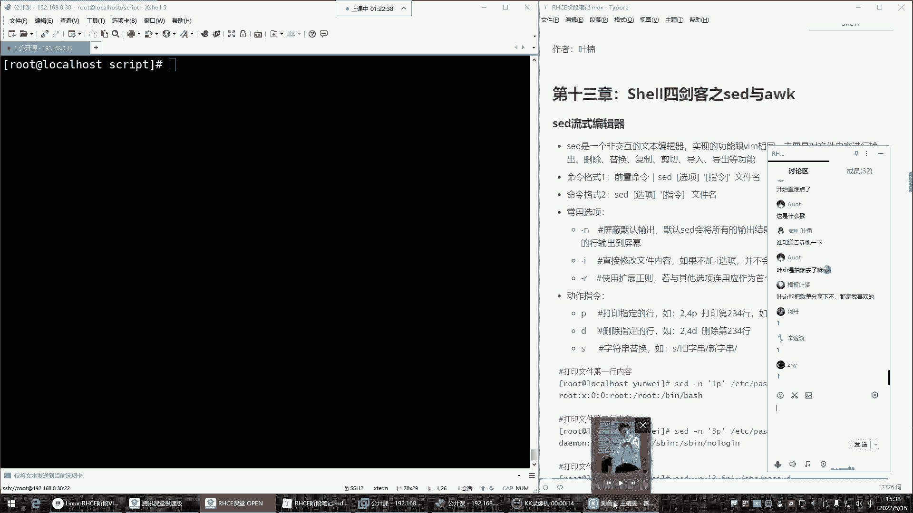
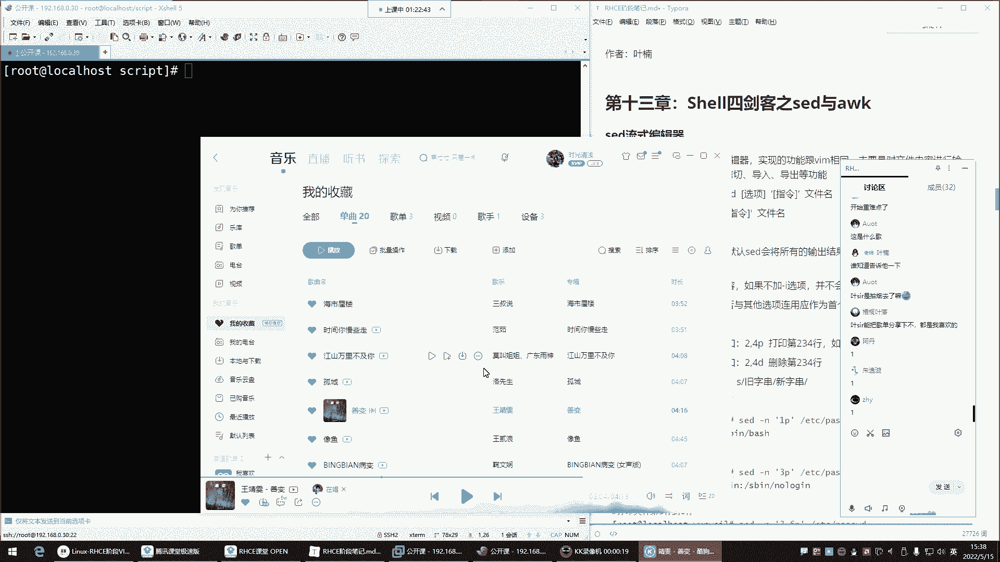
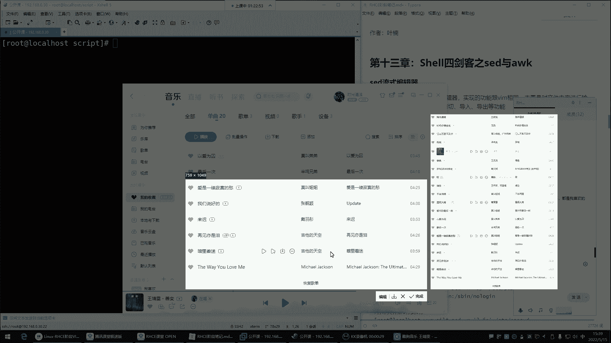
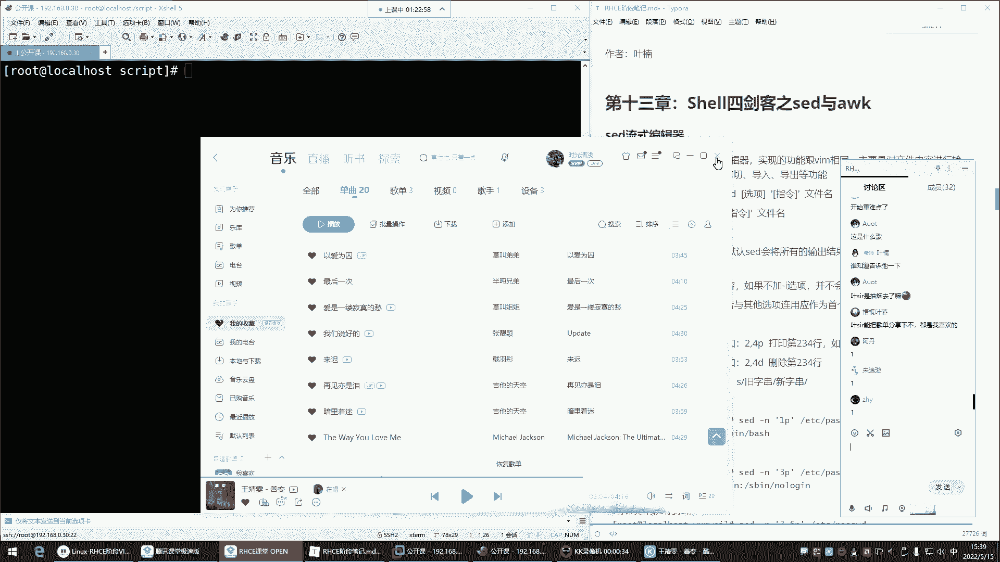
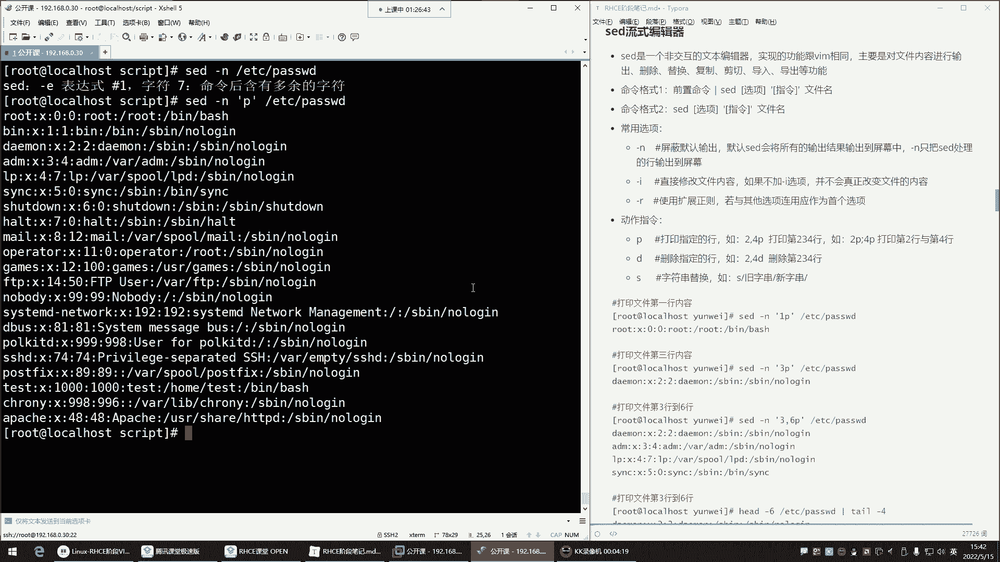
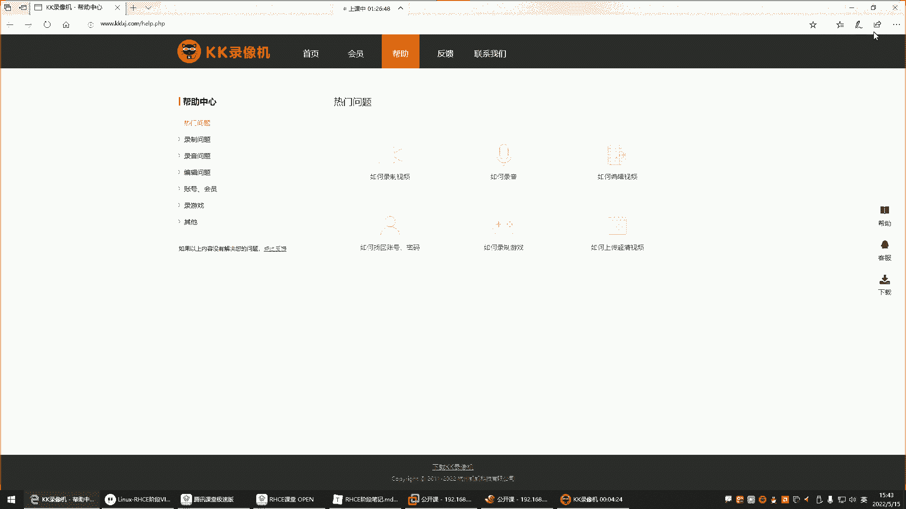
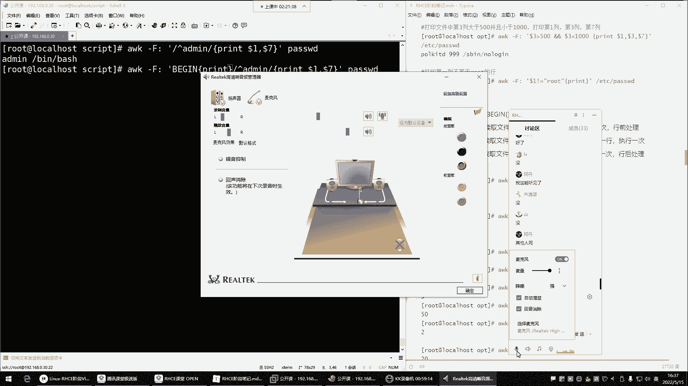
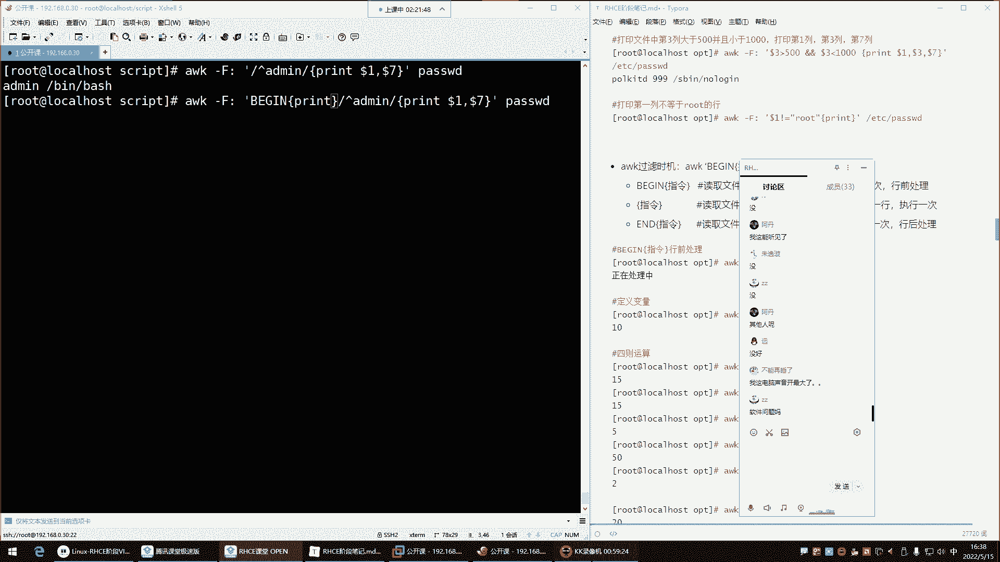

# Linux运维教程：P49：Shell四剑客之Sed编辑器 🛠️









在本节课中，我们将学习Shell四剑客中的Sed编辑器。Sed是一个强大的流式文本编辑器，它允许我们在命令行中非交互式地编辑文件内容，非常适合脚本自动化操作。

---





## Sed简介

上一节我们介绍了Shell四剑客的概念，本节中我们来看看Sed编辑器。Sed的专业名称是“流式编辑器”。通俗来讲，它是Vim编辑器的另一种非交互式实现方式。Vim是交互式的，无法在脚本中自动执行后续编辑操作。而Sed可以在不打开文件的情况下，通过脚本对文件内容进行增、删、改、查。

## Sed基本用法

Sed的命令格式主要有两种。第一种是通过管道将前置命令的输出传递给Sed处理。第二种是Sed直接对文件进行操作。我们先介绍第二种更常用的格式。

Sed命令的基本结构是：`sed [选项] ‘指令’ 文件名`。常用的选项有 `-n`（屏蔽默认输出）和 `-i`（直接修改源文件）。指令则包括打印（p）、删除（d）、替换（s）等。

### 打印文件内容

首先，我们学习如何使用Sed查看文件内容。这与用`cat`或`vim`查看不同，Sed是在命令行中直接输出。

以下是使用Sed打印文件内容的几种方法：

*   **打印整个文件**：`sed -n ‘p’ /etc/passwd`。`-n`选项用于屏蔽默认输出，`p`指令表示打印。如果不加`-n`，每一行内容会被重复输出。
*   **打印指定行**：`sed -n ‘3p’ /etc/passwd`。这条命令会打印文件的第三行。
*   **打印连续行范围**：`sed -n ‘2,4p’ /etc/passwd`。这条命令会打印文件的第二到第四行。
*   **打印不连续的多行**：`sed -n ‘6p;10p’ /etc/passwd`。这条命令会打印第六行和第十行。注意多个指令之间用分号隔开，并且整个指令部分建议用引号括起来。

### 删除文件内容

接下来，我们看看如何使用Sed删除文件中的行。**请注意，在对文件进行实质性修改（如删除、替换）前，建议先用`-n`选项配合`p`指令预览要操作的行，确认无误后再使用`-i`选项执行。**

以下是删除操作的步骤：

1.  **预览要删除的行**：例如，想查看并确认第五到第七行，使用 `sed -n ‘5,7p’ 文件名`。
2.  **执行删除操作**：确认后，使用 `sed -i ‘5,7d’ 文件名` 来删除这些行。`-i`选项使修改直接生效于源文件，`d`指令表示删除。

**对比Vim**：在Vim中，你需要打开文件，定位到行，然后输入`dd`命令删除，最后保存退出。而Sed只需一行命令即可完成，效率更高。

### 替换文件内容

最后，我们学习Sed最强大的功能之一：文本替换。其逻辑与Vim中的替换命令非常相似。

替换的基本格式为：`sed ‘s/旧内容/新内容/修饰符’ 文件名`。其中`s`表示替换，斜杠`/`是分隔符（也可用其他字符），修饰符常用`g`表示全局替换（一行中所有匹配项）。

以下是替换操作的步骤：

1.  **预览替换效果**：例如，想把文件中所有的“root”替换为“admin”，可以先测试：`sed -n ‘s/root/admin/gp’ 文件名`。这里`-n`和`p`是为了只打印发生替换的行，方便检查。
2.  **执行替换操作**：确认替换规则正确后，执行 `sed -i ‘s/root/admin/g’ 文件名`，即可直接修改源文件。

**进阶示例**：结合正则表达式可以实现更复杂的匹配和替换。
*   将所有数字替换为“X”：`sed -i ‘s/[0-9]/X/g’ 文件名`
*   将所有字母替换为“#”：`sed -i ‘s/[a-zA-Z]/#/g’ 文件名`

---

## Awk简介

在了解了Sed之后，我们简要介绍另一个强大的文本处理工具：Awk。Awk不仅仅是一个命令，更是一门编程语言，常用于复杂的数据提取和报告生成。它得名于其三位创始人（Aho, Weinberger, Kernighan）姓氏的首字母。

## Awk核心概念

Awk擅长处理结构化文本（如表格数据）。它将输入文本的每一行视为一条记录，默认以空格或制表符为分隔符将每行分割成多个字段（列），并允许你轻松操作这些字段。

### 基本语法与内置变量

Awk的基本命令格式为：`awk ‘模式 {动作}’ 文件名`。当某行文本匹配指定的“模式”时，就执行对应的“动作”。最常用的动作是`print`，用于打印输出。

Awk提供了方便的内置变量来操作行和列：
*   **`$1， $2， … $n`**： 代表当前行的第1， 2， … n个字段。
*   **`NR`**： 代表当前处理的行号（Number of Records）。
*   **`NF`**： 代表当前行的字段总数（Number of Fields）。

### Awk常用示例

以下是Awk的一些典型用法：

*   **指定分隔符并打印特定列**：`awk -F ‘:’ ‘{print $1， $7}’ /etc/passwd`。`-F`选项指定冒号`:`为字段分隔符，然后打印每行的第1列（用户名）和第7列（解释器）。
*   **结合模式匹配**：`awk -F ‘:’ ‘/^admin/ {print $1， $3}’ /etc/passwd`。这条命令会打印以“admin”开头的行的第1列和第3列。
*   **使用`BEGIN`和`END`块**：
    ```bash
    awk -F ‘:’ ‘BEGIN {print “用户名\t\t解释器”} {print $1， “\t\t”， $7} END {print “总用户数:”， NR}’ /etc/passwd
    ```
    *   `BEGIN`块在处理任何行之前执行一次，常用于打印表头。
    *   中间的动作块`{…}`对每一行都执行。
    *   `END`块在处理完所有行之后执行一次，常用于打印汇总信息。

---





本节课中我们一起学习了Shell四剑客中的Sed和Awk。Sed是一个非交互式的流式编辑器，专注于对文本进行增删改查，尤其擅长替换操作，是脚本中替代Vim进行自动化编辑的利器。Awk则是一门功能丰富的文本处理语言，特别擅长基于行列结构的数据提取、过滤和格式化报告。掌握这两个工具，将极大提升你在Linux命令行下的文本处理能力。