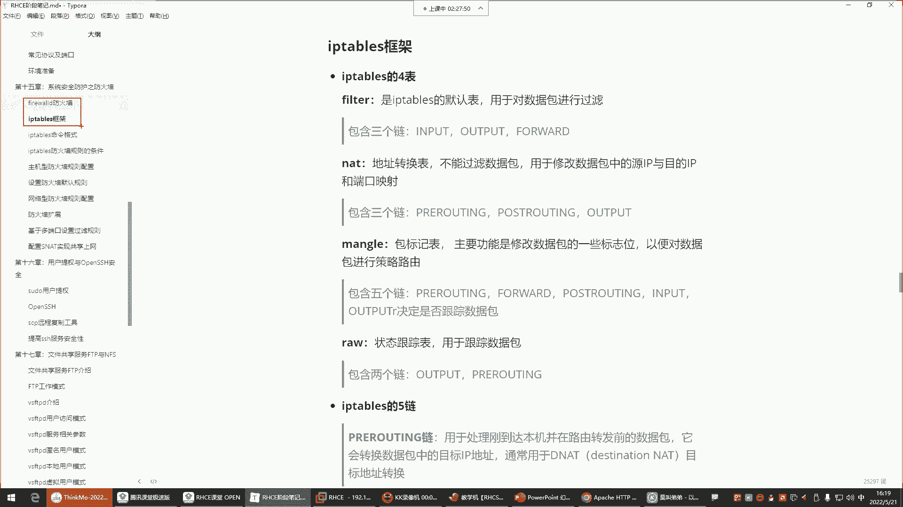
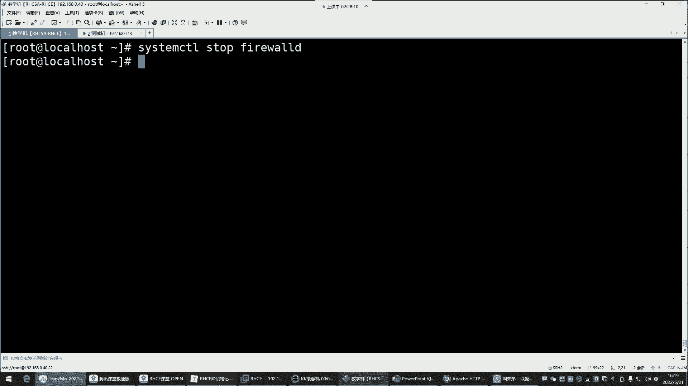
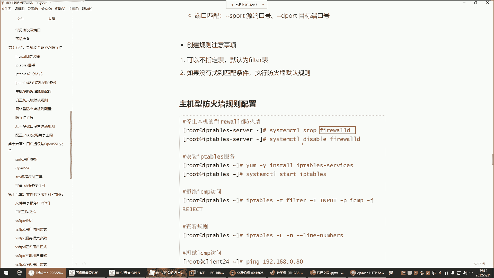
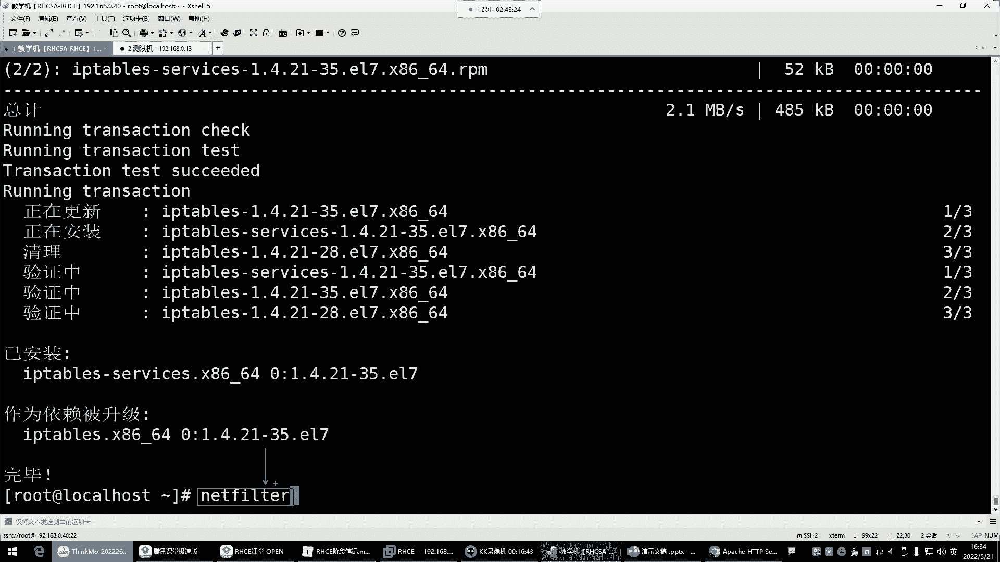
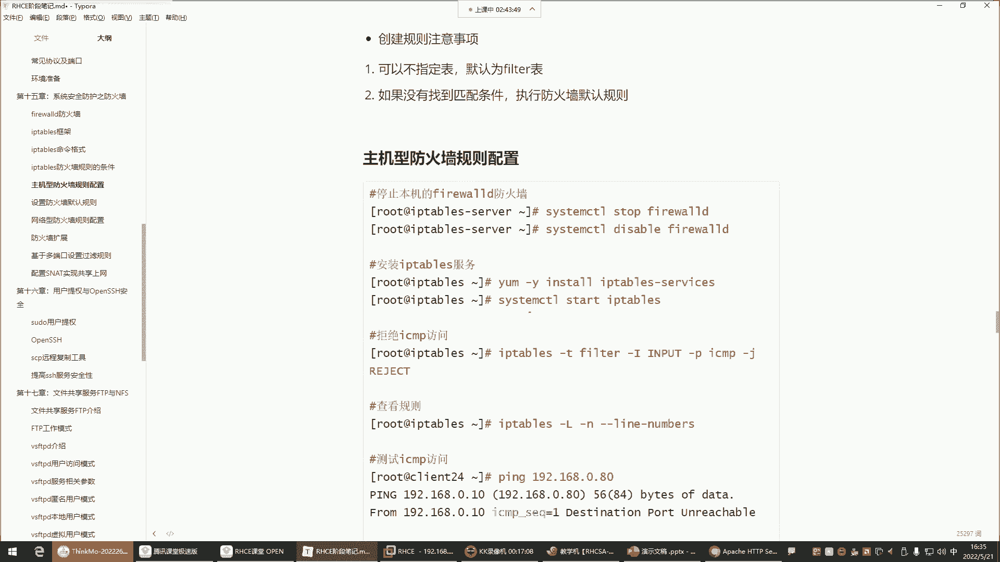
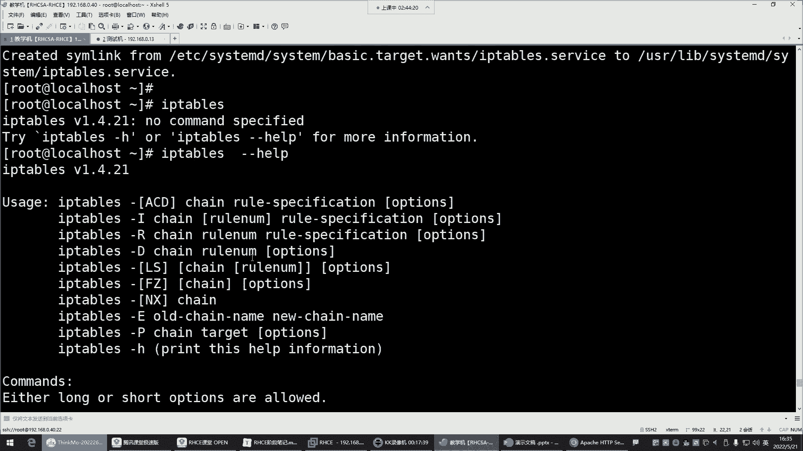
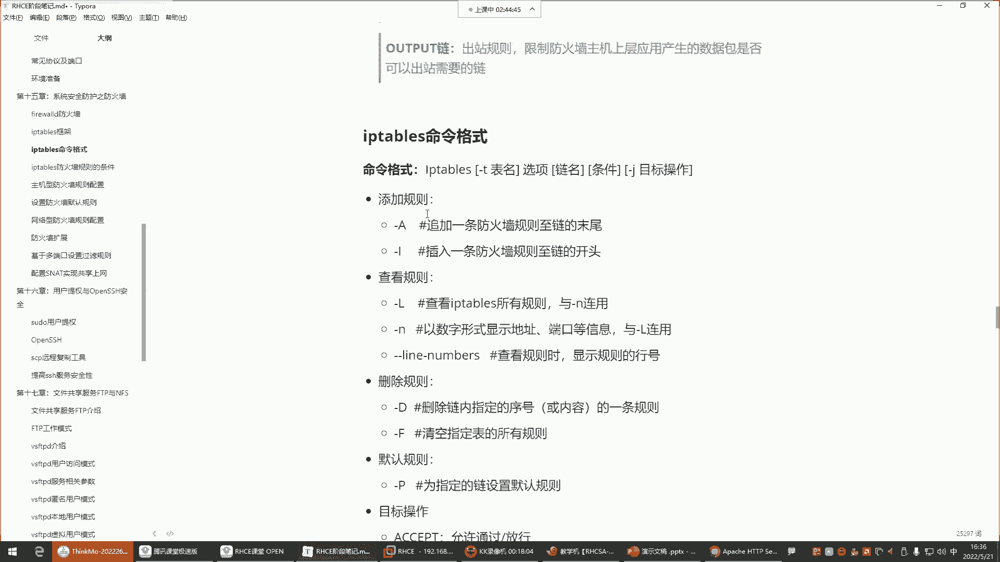
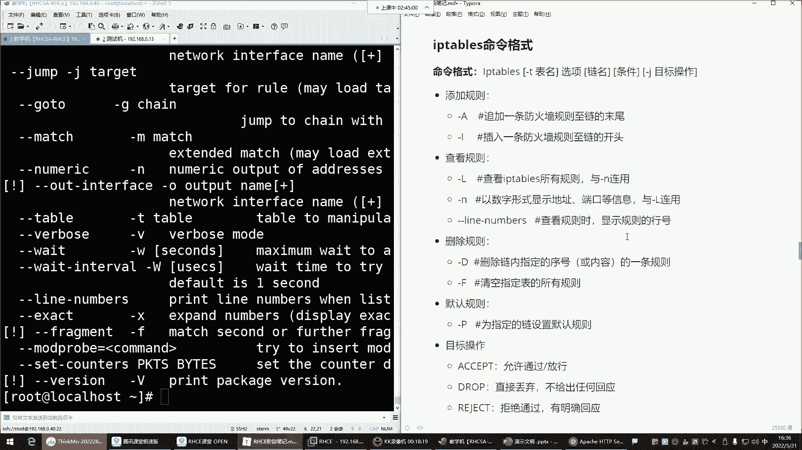

# Linux防火墙管理：P53：iptables四表五链详解

在本节课中，我们将学习iptables防火墙的核心概念——四表五链。理解这些概念是掌握iptables配置的基础。我们将从基本定义开始，逐步深入到每个表和链的具体功能与应用场景，确保初学者能够清晰理解。



## 四表与五链的基本关系



iptables防火墙的管理基于“表”和“链”的结构。表是规则的容器，用于实现特定功能；链则位于表内，是规则实际生效的位置。规则配置在链中，用于决定数据包的命运（如允许或拒绝）。

**核心关系**可以概括为：`表` > `链` > `规则`。

上一节我们介绍了iptables与firewalld的关系，本节中我们来看看iptables自身的架构。

## 详解四张表

iptables包含四张功能不同的表。以下是每张表的主要功能：

1.  **filter表**
    *   **功能**：这是iptables的默认表，核心功能是**数据包过滤**。它就像网络流量的“安检口”，决定哪些数据包可以进入、离开或经过主机。
    *   **类比**：如同地铁站的安检，检查乘客（数据包）是否携带违禁品。
    *   **重要性**：这是我们学习和配置的重点，绝大多数防火墙规则都定义在此表中。

2.  **nat表**
    *   **功能**：用于**网络地址转换**。主要修改数据包的源IP地址或目标IP地址及端口。
    *   **应用场景**：例如，让内网使用私有IP的电脑共享一个公网IP访问互联网（SNAT），或将公网请求转发到内网服务器（DNAT）。

3.  **mangle表**
    *   **功能**：用于**修改数据包**的标记位。通常用于高级路由策略，如基于条件选择不同的出口网卡。
    *   **应用场景**：使用较少，一般在多网卡或复杂网络策略中才会用到。

4.  **raw表**
    *   **功能**：用于**数据包状态跟踪**。可以决定是否对数据包进行连接追踪。
    *   **注意**：全程跟踪数据包消耗系统资源，在企业生产环境中通常不启用此功能。

> **学习重点**：对于初学者和大多数运维场景，主要掌握 **filter表** 和 **nat表** 即可，`mangle`和`raw`表使用频率极低。

## 详解五条链

链是数据包传输路径上的“检查点”。数据包会依次经过这些检查点，并匹配链中的规则。五条核心链如下：

1.  **INPUT链**
    *   **作用**：处理**进入本机**的数据包。
    *   **应用**：用于配置**主机型防火墙**规则，保护本机上的服务（如SSH、Web服务）。
    *   **示例规则**：`允许所有IP访问本机的80端口（Web服务）`。

2.  **OUTPUT链**
    *   **作用**：处理**从本机发出**的数据包。
    *   **注意**：此链通常不配置严格规则。就像地铁只检查进站，不检查出站一样，一般信任本机发出的流量。

3.  **FORWARD链**
    *   **作用**：处理**经过本机转发**的数据包。
    *   **应用**：用于配置**网络型防火墙**规则。当Linux主机作为网关或路由器时，保护其背后的内部网络。
    *   **示例规则**：`允许内网用户通过本机访问外网`。

4.  **PREROUTING链**
    *   **作用**：在数据包**进入路由决策之前**进行处理。
    *   **常用表**：主要在`nat`表中使用，用于**目标地址转换**。
    *   **应用场景**：DNAT，将到达防火墙公网IP的请求，转发给内网的某台服务器。

5.  **POSTROUTING链**
    *   **作用**：在数据包**离开路由决策之后**进行处理。
    *   **常用表**：主要在`nat`表中使用，用于**源地址转换**。
    *   **应用场景**：SNAT，让内网多台设备共享一个公网IP上网。

## 表与链的对应关系

并非每条链都存在于所有表中。下表总结了主要的对应关系：

| 链名 | 主要存在的表 | 主要功能 |
| :--- | :--- | :--- |
| **INPUT** | filter | 过滤进入本机的数据包 |
| **OUTPUT** | filter, nat, mangle | 过滤/修改本机发出的数据包 |
| **FORWARD** | filter | 过滤转发的数据包 |
| **PREROUTING** | nat, mangle | 在路由前修改数据包（如DNAT） |
| **POSTROUTING** | nat | 在路由后修改数据包（如SNAT） |

> **关键规律**：一个表的功能决定了其内部链的功能。例如，`filter`表内的链（INPUT, FORWARD, OUTPUT）都用于**过滤**；`nat`表内的链（PREROUTING, POSTROUTING, OUTPUT）都用于**地址转换**。

## 基础环境准备与命令格式

在开始配置iptables规则前，需要确保使用正确的工具并了解基本命令格式。

### 1. 切换至iptables

由于`iptables`和`firewalld`都是管理`netfilter`内核模块的工具，二者冲突，不能同时启用。

以下是切换到iptables的命令：
```bash
# 停止并禁用firewalld
systemctl stop firewalld
systemctl disable firewalld

# 安装iptables服务（如果未安装）
yum install -y iptables-services

# 启动并启用iptables服务
systemctl start iptables
systemctl enable iptables
```



### 2. iptables命令基本格式



查看iptables规则的基本命令格式如下：
```bash
iptables -t <表名> -L
```
*   `-t`：指定要操作的表，如`filter`、`nat`。省略时默认为`filter`表。
*   `-L`：列出指定表和链中的规则。



例如，查看filter表所有规则：
```bash
iptables -t filter -L
# 或简写为
iptables -L
```



查看nat表规则：
```bash
iptables -t nat -L
```





本节课中我们一起学习了iptables防火墙的“四表五链”核心架构。我们明确了`filter`表是数据过滤的核心，`nat`表负责地址转换；并理解了`INPUT`链用于保护本机，`FORWARD`链用于保护网络，`PREROUTING`和`POSTROUTING`链主要用于NAT功能。掌握这些概念是后续编写具体防火墙规则的基础。下一节，我们将开始学习如何在这些链中添加、删除和修改具体的规则。