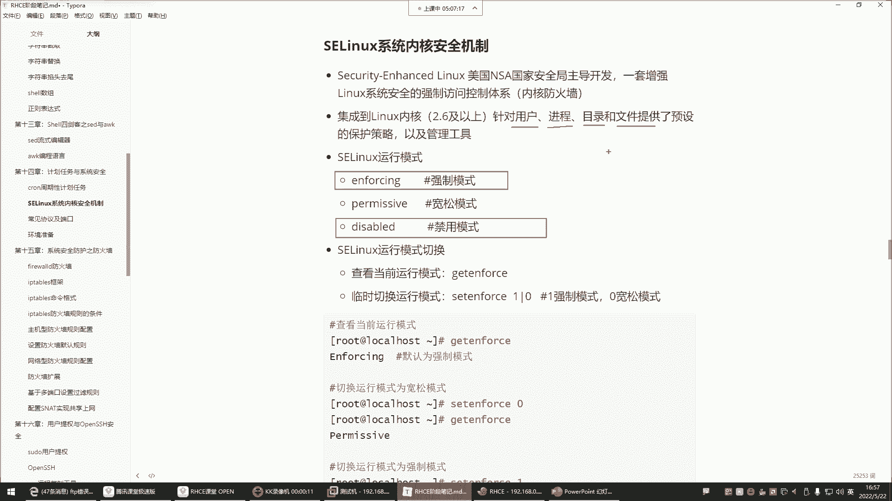
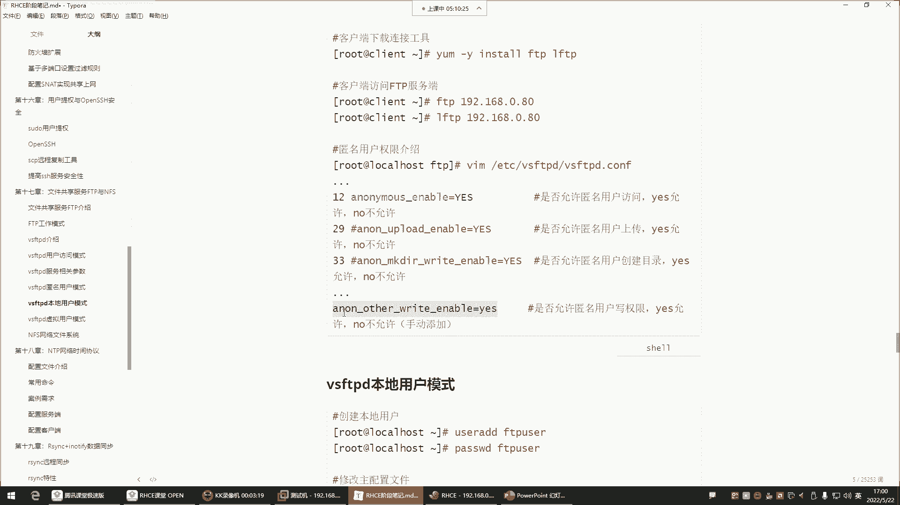
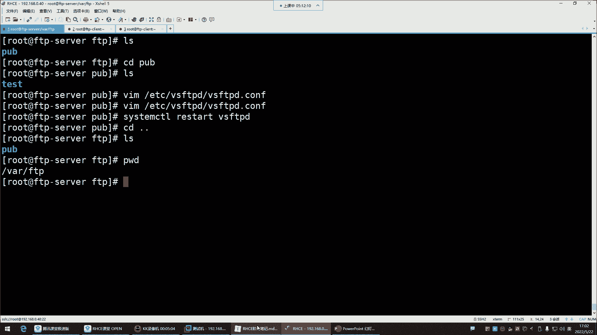

# 【小白入门 通俗易懂】全网最全RHCSA+RHCE教程，一周快速进阶Linux运维 - P57：红帽RHCE-21.FTP排错 - 网工小程立志不加班 - BV1PN4y1R7uU

我们来看看这个问题哈，对这个东西啊。

就像我前面给你们所讲的，我说S1LINUX，这东西为啥在企业里边都给他禁用掉呢，他在强制模式下，我告诉你，他什么都管，用户进程目录文件没有他不管的。

所以你看他现在是什么模式，叫enforcing，enforcing是强制模式，强制模式就是好，你虽然说权限什么都给足了，但是啊我也不让你建文件，告诉你你没有创建文件的，就是说白了你创建失败，看到了吗。

所以这玩意儿他倍儿坑人，看了吗，关掉，改成零改配置文件，这里静静，所以，你看这东西是不是就无形之中，你都不知道问题出在哪，是不是，那你说这我们这时候你再见，没有任何毛病，你看是不是。

所以说这配置没问题的时候，还是得多看看防火墙，看看S1LINUX进去给他共享个文件，pa先上传，能创建了上传put，上传了是吧，就是现在感受到这感受到他的一个什么呢。

它的一个这个存在的时候的一些这个功，它的功能了吗，嗯也算帮同学们排错了是吧，从来没有想过他的问题，我S1045记得我都给关掉了，好接下来呢看看哈，就是如果说你想去这个上传，那就得开启upload权限。

想让他创建就开启make dr这个权限啊，这个也可以创建目录，也可以创建文件都可以哈，然后还有一个如果你想让它具备写权限，要把这个给他加进去，默认是没有写权限的。

这个写权限就是对一些删除的操作删除哈，RM和RF注意啊，你看我们那个配置文件我添加了一个啊，我好像没有添加那个写权限，最后没有写权限哈，没有加没有加呢，他比如现在他想做一些删除的操作。

比如RM和RF删不了，看到了吗，你以为他真的删了吗，没有还在呢，改个名，比如把这个名字改成叉叉点CH啊，他说你权限不足，看了吗，说你的权限不足是吧，改也改不了，删也删不了，但如果你希望他具备这些权限。

你怎么办呢，那你就在这个配置文件里面跑到最后一行，然后再另起一行。

把这个参数给它写进去。

放到这个文件里面写进去，写进以后保存退出，重启服务，啊这时候他在做，比如说他想改名MV，把这个改成叉叉O查抄older s h，那叫重命名成功，好吧对，这是FTP服务哈，FTP想删也可以删。

test回车删了。

所以呢我们经过一系列的总结，对于这个FTP服务器，FTP服务器默认的，它启用的是匿名用户的访问模式，那这个所谓的匿名还真还不是真正的匿名，是什么呢，默认是用这个FTP那个账号去访问的FTP服务。

然后呢访问以后的话呢，呃权限的话默认都有哪些呢，查看下载是可以的，但如果你想让它具备一些，比如说修改删除创建的操作，那或者说上传，你都要去在配置文件里面去给他开启这些权限，但是开启权限之前也不要忘了。

针对于他的一个什么一个共享目录，我们一般都是什么呢，我们一般是不会直接把他的这个VH的FTP，这个共享目录给他打开权限的，都是在这个目录下去给他单独建一个目录，作为所有的账号的这个什么呢。

是所有匿名账号的一个共享数据的一个地方，在这里边你想怎么做都行，但是在这个目录你别动能理解吧，你别动，OK这就是我们所说的什么呢，哎我们所说的那个叫做FTP，那以上给大家讲解的权限都是针对于谁的呢。

匿名账号，匿名账号是不是可以具备增增删改查了呀，那咱企业里面一般不给这么大权限啊，咱企业里边就是让它下载，所以这些删除的权限不给，创建的权限也不给，还有这个上传的权限也不给，为什么不让上传呢。

你比如说你一个百度网盘账号，你希望别人往你的百度网盘里面，能够随便上传东西吗，是不是也不希望啊，那我们用网盘干嘛呀，就是我想把什么东西共享给你，你来我这下载就可以了，是不是，怎么你还能往我这里上传呢。

是不是，那就更别说什么修改删除了，这是坚决不允许的吗，所以这个也一样，我们这边也是哈，都是这个对于他们来讲就不给他们修改删除，也不给他们创建的，也不给他们上传的权限，就让他干嘛呢，就让它默认权限就行。

所以一般我们对于这个匿名账号的权限，不给那么大哈，不给那么大注释掉，注释掉这种修改删除的注释掉前边这种，什么make dr，这些都是针对于匿名账号的，你看前面只要是DK带这种any。

就是匿名账号的权限注释掉再重启，好那他们就不能做这些操作了，你看他现在再想改名，改成ABC点C是他没有权限了，他想删除删不了了，还在是吧，他俩上船push诶什么啊，put哈，put回车权限不足是吧。

但他俩下载没有任何问题啊，get下载，啊有这个，因为文件名是一样的哈，所以重复了失败了，看了吗，他说嗯，删掉哈，诶下载怎么也没了呢，Get，失败了，无法对打开文件，无法打开文件，啊权限的问题。

这个文件权限改变了哈，还拉了看pop下载查收，读写FTP读写，我看是不是这个问题啊，Mod，U等于777，怕怕下载文件，啊sorry啊，这哪有这么玩的呀，是吧，这哪有这么玩的，就是U等于U等于什么呢。

RWX哈，嘿嘿嘿嘿嘿好，接下来再试试哈，get诶，有点意思了哈，那趁着mod777试试，啊这可以了，你看权权限的问题啊，其实他不是重复，我刚刚以为是我刚刚认为是这个，可能说换个名字，他是识可能识别到了。

这个光是名字换了，可能说这个文件它的类型可能是重复的吧，我以为是会出现这种情况，但不是权限问题啊，你改成七七啊，它就可以了啊，但是一般正常来讲，这个文件是他自己改的名，一般是会出现这种情况，能理解吧。

就是我们如果给他共享文件，它是没有权限去改这东西的，怎么没有删除，你比如我现在正常来讲啊，对于这种文件，你说我们会会会给他七七全新文，其实也不会，你比如说你把这东西给删了。

我们比如我我想给他共享什么东西，我touch一个hello，点TT好，那在它本地好像也有一个文件，删掉哈，你比如说我想给他共享什么东西，那这个时候你都是你放到这就行了，这文件什么权限正常啊。

就是可能说他得需要其他人具备读权限才可以，然后这边看一看呢，它可以看退出，重新登录CD到pop他就可以看了，这get就可以了，默认权限就可以下载，能列吧，你看默认它就可以下载，Hello，大家贴贴。

只不过由于他改文件名权限就发生变化了，就没有那个那两个读了没，有两个读它就下载不了，所以正常的使用的话呢，是你是不需要特殊去改这个文件权限，给它改成什么777哈，不用正常来讲。

他们是可以是都是可以正常去下载去查看的啊，这是FTP的什么模式呢。

叫做本地用户模式啊，不是不是啊，这个叫做匿名用户模式，我发现我们现在可能说由于这个课程讲的太久，是不是有点已经这个头脑，你是不是已经有点这个思维混乱了呀，那我发现我说的话好像都已经有点这个，这什么呢。

有点这个没有头绪了，歇会儿吧。

