# Linux运维教程：P57：FTP服务排错指南 🔧


在本节课中，我们将学习如何排查和解决FTP服务中常见的权限问题，特别是与SELinux相关的配置。我们将通过一个实际案例，演示如何调整配置以确保FTP服务正常运行。

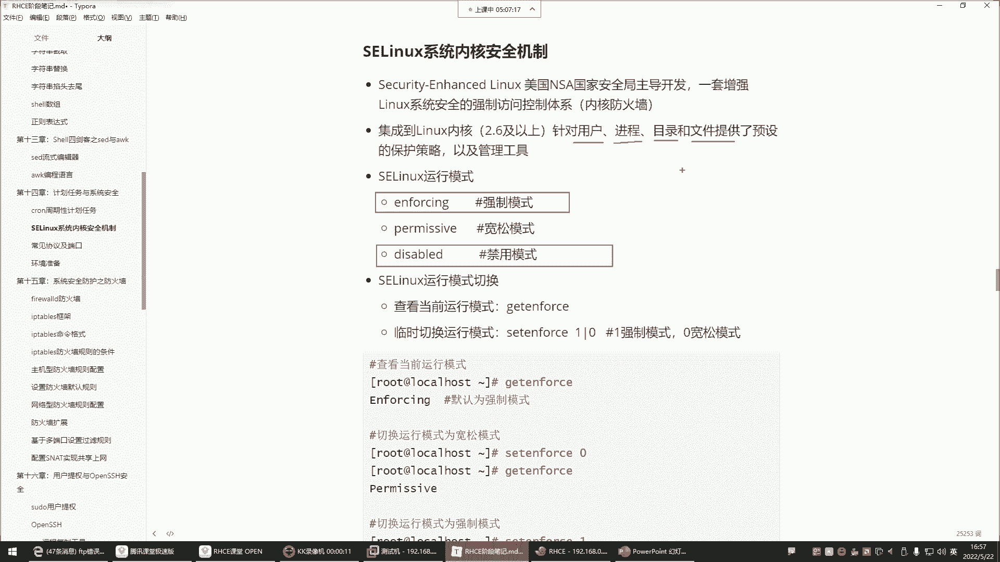

---

## 概述：SELinux强制模式的影响

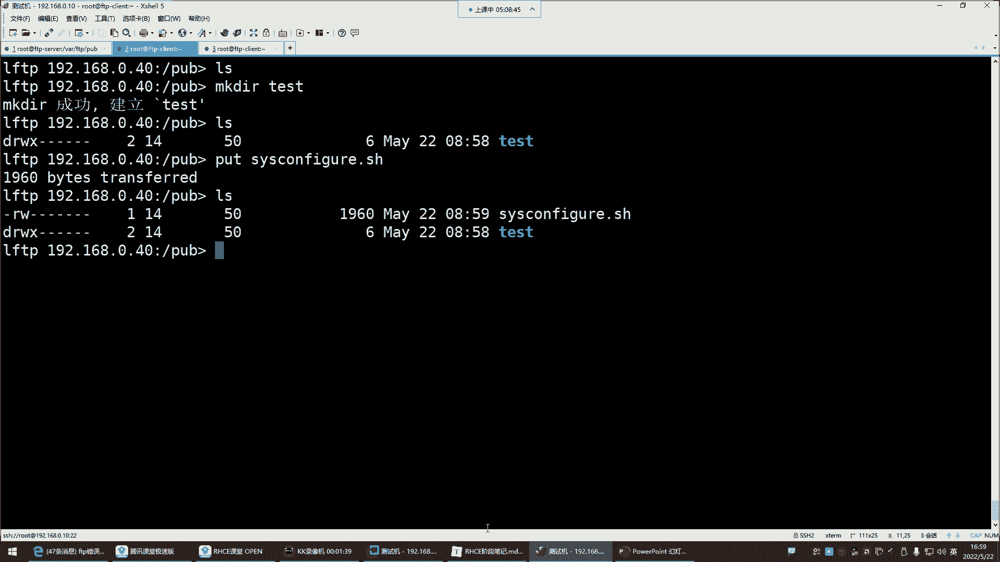

上一节我们介绍了FTP服务的基本配置。本节中我们来看看一个常见的“隐形”障碍——SELinux。SELinux在强制模式下会严格管控所有系统资源，包括用户、进程、目录和文件，这常常导致即使文件权限设置正确，操作也会失败。

例如，当SELinux处于 **`enforcing`**（强制）模式时，即使用户拥有目录的完全读写权限，也可能无法创建文件。解决方案是临时将其设置为 **`permissive`**（宽容）模式或修改其策略。

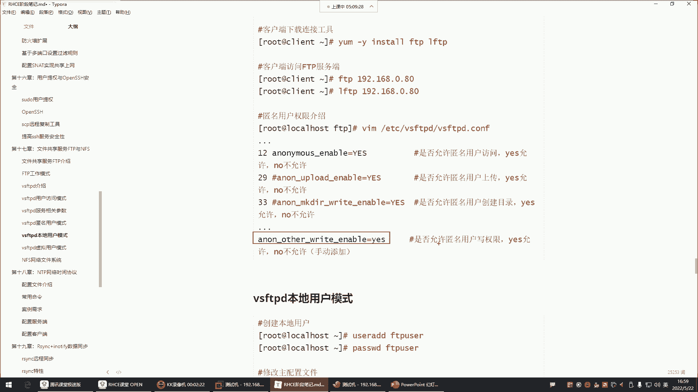

**核心操作：**
```bash
# 临时将SELinux设置为宽容模式
setenforce 0
# 或永久修改配置文件 /etc/selinux/config，将 SELINUX=enforcing 改为 SELINUX=permissive
```
修改后，之前失败的文件创建操作通常就能成功。这个问题非常隐蔽，因此在进行FTP配置时，除了检查常规权限，还需留意SELinux和防火墙的状态。

---

## FTP匿名用户的权限配置

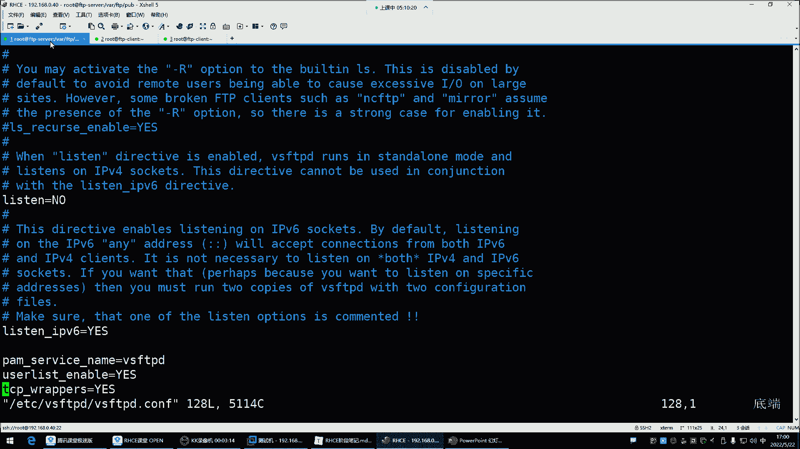

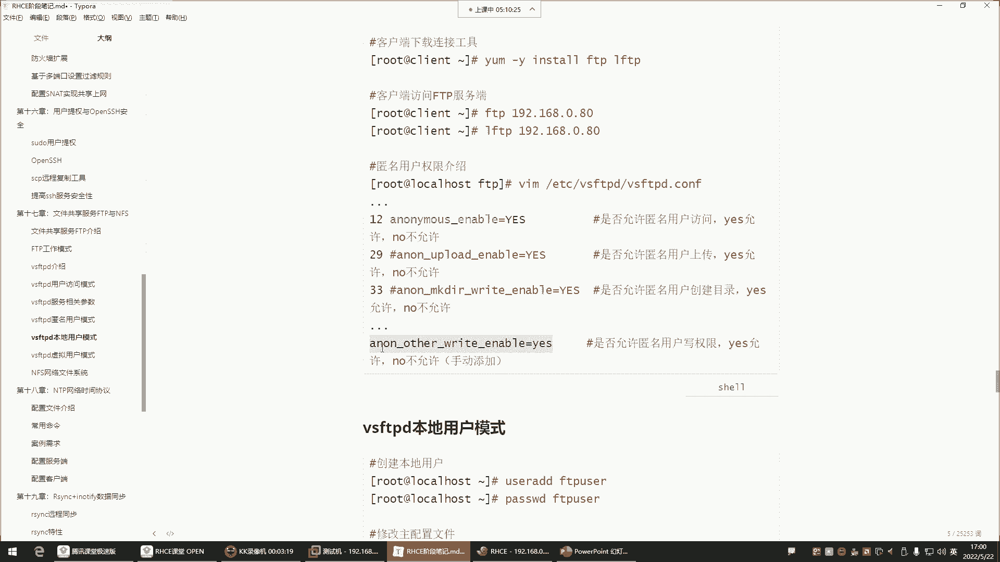

在解决了SELinux的干扰后，我们回到FTP服务本身的权限配置上。FTP匿名用户的默认权限是受限的，我们需要在配置文件中显式开启特定功能。

以下是FTP匿名用户可配置的权限参数及其作用：

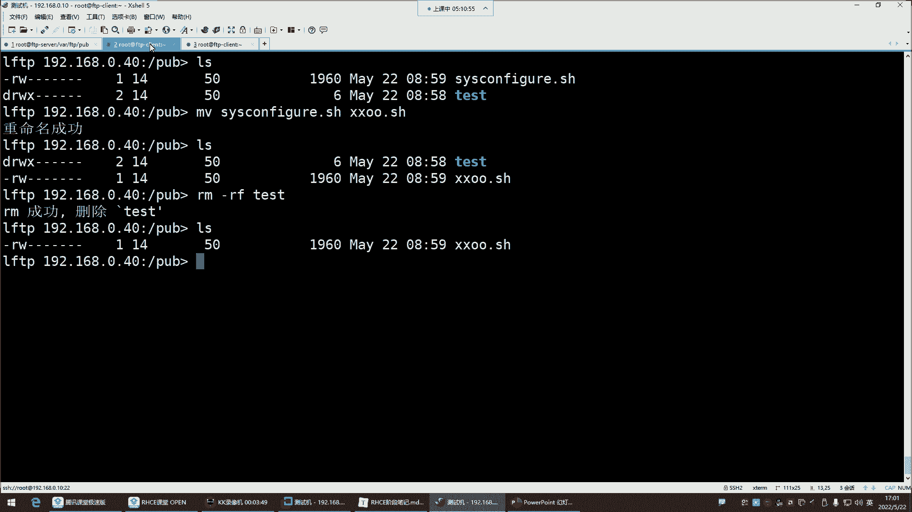

*   **`anon_upload_enable=YES`**：启用匿名用户的上传权限。
*   **`anon_mkdir_write_enable=YES`**：允许匿名用户创建目录和文件。
*   **`anon_other_write_enable=YES`**：授予匿名用户更高级的写权限，包括**删除**和**重命名**文件。

默认配置不包含 `anon_other_write_enable` 参数，因此匿名用户无法执行删除(`rm`)或重命名(`mv`)操作。如果需要这些权限，必须在配置文件 **`/etc/vsftpd/vsftpd.conf`** 末尾添加相应参数并重启服务。

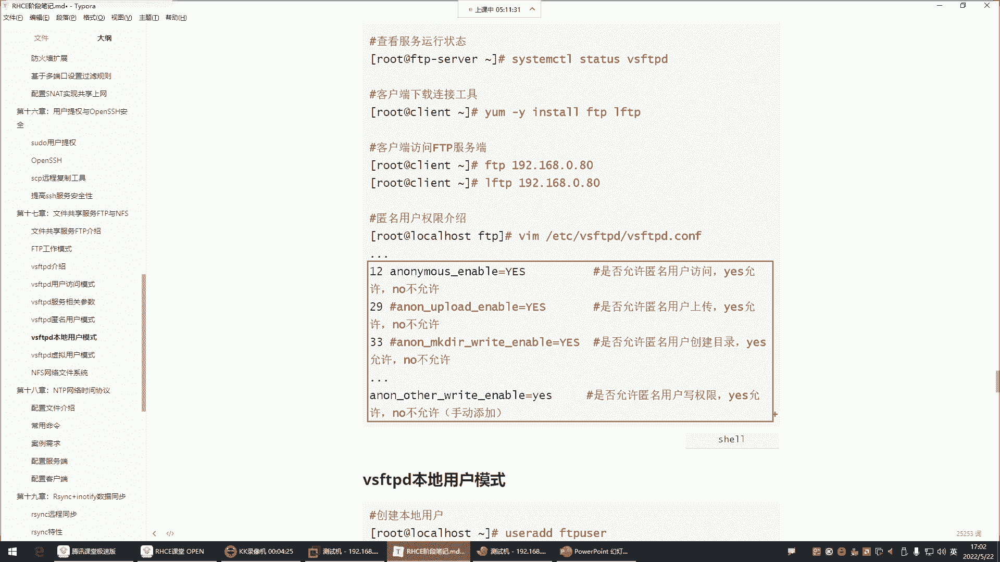

**配置文件修改示例：**
```bash
# 编辑vsftpd配置文件
vim /etc/vsftpd/vsftpd.conf
# 在文件末尾添加
anon_other_write_enable=YES
# 保存退出后重启服务
systemctl restart vsftpd
```
服务重启后，匿名用户即可进行重命名和删除文件等操作。

---

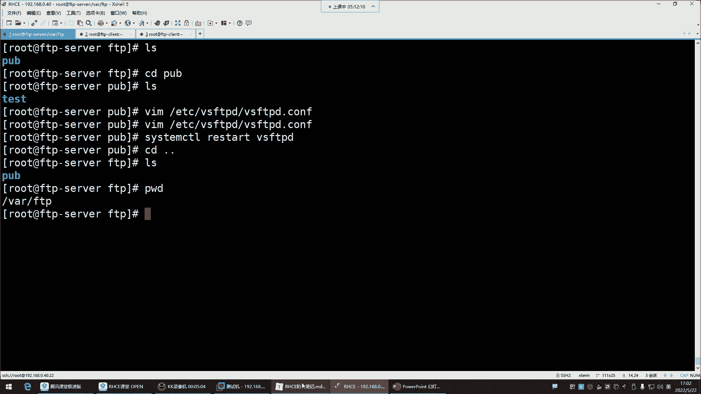

## 企业环境下的FTP权限管理原则

经过一系列的配置和测试，我们对FTP服务器有了更深的了解。FTP服务默认启用匿名访问模式，此处的“匿名”实际上是通过系统内置的 **`ftp`** 用户账号来访问服务。

在企业生产环境中，出于安全考虑，通常会对匿名用户的权限施加严格限制：

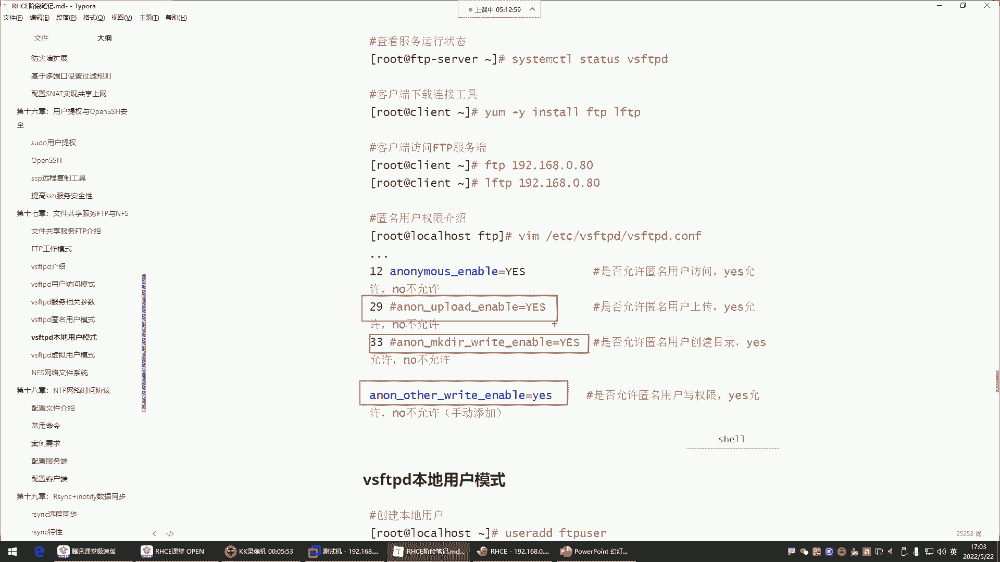

1.  **共享目录隔离**：我们通常不会直接开放FTP的默认根目录（如 `/var/ftp/pub`）的写权限。最佳实践是在其下创建子目录（例如 `/var/ftp/pub/share`）作为匿名用户的数据共享区，仅对该子目录进行权限配置。
2.  **最小权限原则**：企业场景下，匿名FTP通常仅用于文件分发（下载），而非收集文件。因此，类似百度网盘，我们只希望他人从我们这里下载文件，而不允许他们随意上传、修改或删除服务器上的内容。
3.  **权限收紧**：基于上述原则，应注释或删除配置文件中为匿名用户开启的 **`anon_upload_enable`**、**`anon_mkdir_write_enable`** 和 **`anon_other_write_enable`** 等参数。重启服务后，匿名用户将仅保留查看和下载文件的默认权限。

**权限还原操作：**
```bash
# 在配置文件中注释掉相关行
# anon_upload_enable=YES
# anon_mkdir_write_enable=YES
# anon_other_write_enable=YES
systemctl restart vsftpd
```
调整后，匿名用户尝试上传、创建、删除或重命名文件时，都会收到“权限不足”的提示。

---

## 关于文件下载权限的补充说明

有时，即使服务配置正确，下载文件也可能失败，这可能是由于共享文件本身的系统权限不足导致的。FTP匿名用户（映射为系统用户`ftp`）需要对待下载文件至少拥有**读(`r`)**权限。

例如，如果匿名用户重命名了一个文件，新文件的所有者和权限可能会发生变化，导致无法读取。此时，文件所有者需要调整该文件的权限。

**修正文件权限示例：**
```bash
# 在服务端，为文件添加其他用户(O)的读权限
chmod o+r filename
# 或者（谨慎使用，仅作示例）
chmod 644 filename
```
在正常的运维流程中，管理员将文件放入共享目录时，应确保文件权限允许其他用户读取（如 `644`），这样匿名用户无需特殊配置即可顺利下载，无需将其设置为 `777` 这样不安全的权限。

---

## 总结

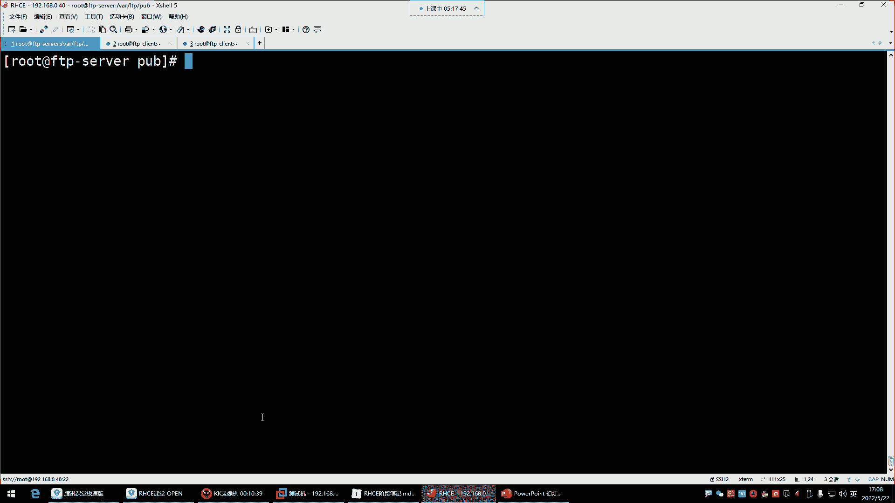

本节课中我们一起学习了FTP服务的核心排错方法与权限管理原则。关键点包括：
1.  **排查SELinux**：在强制模式下，SELinux可能阻止FTP操作，需调整模式或策略。
2.  **理解匿名权限**：通过 `vsftpd.conf` 中的 `anon_*` 参数控制匿名用户的上传、创建、删除等能力。
3.  **遵循安全实践**：企业环境中应为匿名FTP遵循“最小权限原则”，通常只开放下载功能，并采用目录隔离策略。
4.  **检查文件系统权限**：确保共享文件本身对 `ftp` 用户可读，是保证下载功能正常的基础。

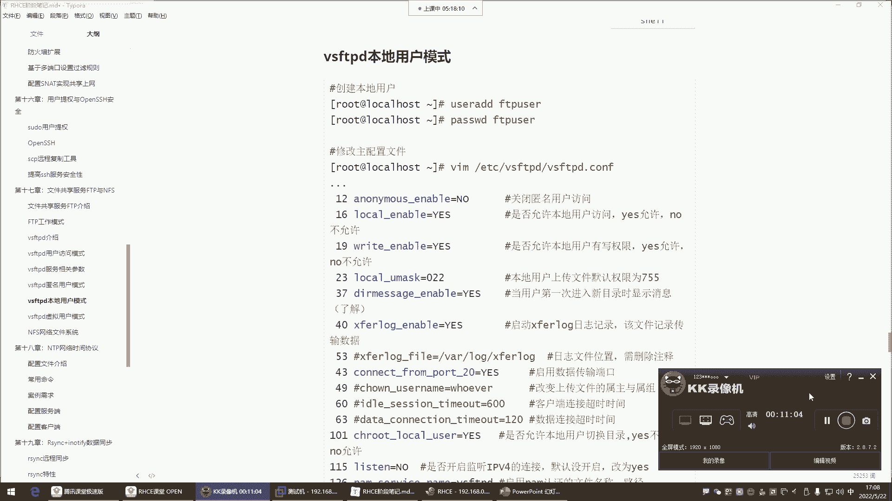

通过掌握这些知识，你能够有效地部署、配置和排查一个符合安全要求的FTP文件共享服务。