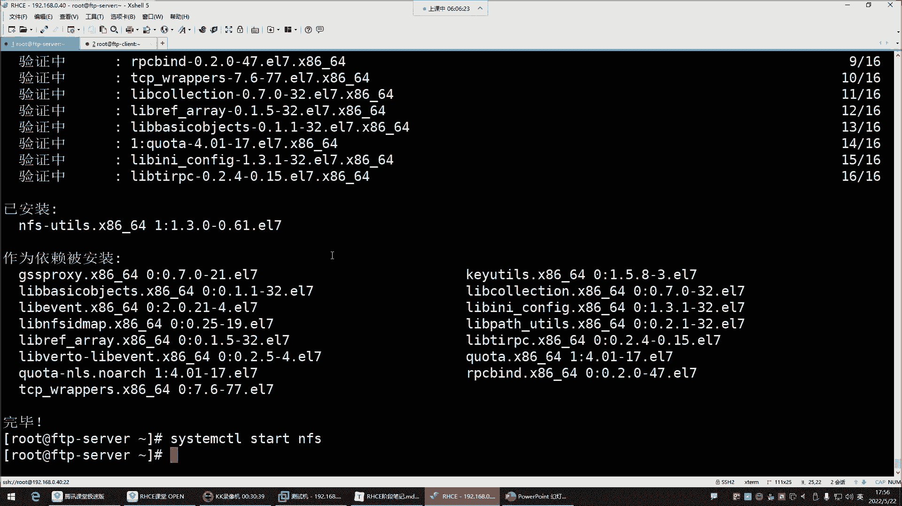

# 【小白入门 通俗易懂】全网最全RHCSA+RHCE教程，一周快速进阶Linux运维 - P59：红帽RHCE-22.vsftpd本地用户访问模式、NFS网络附加存储 - 网工小程立志不加班 - BV1PN4y1R7uU

啊喂喂喂好，那咱们接下来呢讲什么呢，接下来我们这个前面是给大家讲的是什么呢，叫做匿名用户哈，我们前面是vs FTP d的匿名用户的模式，那匿名用户呢就是比较宽泛一些，就是谁都可以使用那个匿名方式。

去访问这个服务器，但是有的企业呢他可能说哎呀，我们需要做一个本地用户，就只允许这些用户去访问，那怎么办呢，那他就不开启匿名用户了。

它一般呢就让你把匿名用户给他禁掉，怎么进呢，就是打开它的配置键，e t c vs FTP d vs FTP d点康复，把这个注释掉就可以了，把这个哈看到吗，这个这默认不是匿名账号的访问吗。

注释掉就可以了，注释掉，或者说你不注释给它改成NO，然后其实你不能注释，因为注释默认就是匿名，给大家说一下哈，这位置尽量别注释，他这边说了啊，他说注意，如果你注释掉，它默认是允许的，看到了吗。

所以别注释，如果说你不希望匿名用户访问这位置，改成NO，不然你会发现我注释了，为什么匿名还可以访问呢，哼其实它默认就是允许的，能理解吧，所以这个位置哎改成NO，然后重启服务，那这边你这时候他在敲命令。

它就完了啊，退出X的，再连40S开了吗，这就是匿名用户，现在就连就已经连不上去了，连忙去了哈啊，这要怎么禁用这种匿名用户模式，那他只能退出，OK所以有的企业他说哎呀咱们别什么呢。

别这个用匿名了，觉得这个匿名啊，这个太宽泛了，我们就是只允许哪些用户访问，咱们呢就用这种本地用户来实现就行了，我希望哪个账号访问，咱们就给他建个账号就可以，所以这种就比如说拿FTP这个账号来讲。

你比如说我们希望FTP这个账号，这个可以去访我的服务器，那咱们就在本地给他建个账号，然后让其他的人去使用这个账号去访问。

也可以吗，就是也可以可以哈，那这时候呢我们账号是不是接了呀，d FTP user用户建好了，那接下来呢我们就得说说，那其他的人怎么使用这个FTP user去访问呢，一样LFTP指定用户名。

杠U用户名是LFTP或者是FTP u er好，然后接下来呢指定IP地址，192。168。0。40回车，口令口令是谁呢，就是这个账号的密码，这个账号在服务端的密码是多少，你得输入密码一回车，这就连上来了。

4a4，怎么什么都没有呢，阿四看了吗，呵呵这怎么什么都没有呢，我告诉你哈，但为什么什么都没有哈，你要知道他连上去以后，它跑哪去了呢，他连去以后，他是跑到了根下的home下的FTP user目录了。

你看这目录有数据吗，没有，所以他在这边啥也看不到，啥也看不到哈，所以说由此可见。

对于这个FTP来讲，你就算是本地，我们用的是本地用户去访问，然后输入这个用户名跟密码，那你知道那我们连上去以后进到哪了吗，进到了这个用户在这个服务器的那个，他的加目录了。

那如果现在我们去这个它的加工中，给他建个文件，你看我们现在去他家门口建一个，比如说建一个什么呢，建一个hello，好那这时候他再看，看就能看到这个hello文件了，是这样子的哈，所以本地用户它也一样。

都是进到了他的家目录，你用谁登录的就进到了谁的家目录了，你想给他共享什么东西，就把数据放到他的家目就行了，那这时候FTPU4就可以get下载了，下载hello文件到本地下载了吗，看一下看到吗。

hello文件下载下来了，能领了吧，啊这就是本地用户，那本地用户来讲，那你说我们如果希望它具备一些权限的话。

那怎么办呢，那这个权限本地用户的配，咱本地用户在配置文件里面，它的相关参数就比较多一些，但这些的话呢大体来讲你甭管是什么用户，我还是那句话，就是他跟这种匿名用户啊，你说他能差到哪儿啊，差不了哪。

本地用户，我们也是希望他干嘛呀，就说白了默认权限就是只可以进行下载跟查看。

那默认情况下它想上传可不可以呢，我们可以看一下，Put，可以看到了吗，看到创建mdr test，诶可以，他想改名等等一系列的东西，他都能操作，想删除删除，hello回车。

你看那为什么本地用户的权限怎么这么放肆呢，对本地用户访问的是自己资源，那你发现为什么他这么放肆呢，啊你看他配文件就行了，首先我们要知道，你想想本地用户，它首先就是在自己家里面做的操作，没错吧，你看他的。

你看本地用户他是进到自己家了，他自己家的目录，你这个权限，是不是就不需要去做额外的改动了呀，本身这个加目录就是他自己的，他自己的权限就是RWX，是不是目录权限默认人家具备了。

那还有一个就是配置文件的权限，那这个配置文件的权限，那我们也没给啊，这个不用你给啊，在这个文件里边，叫取消注释以允许本地用户登录，那这个注释取消了吗，取消了呀，默认就没有注释。

所以这就local代表本地的意思，enable就是启用本地启用就是现在默认就是哈哈，当S04强制检查时，他已经提示了，说这个C4可能说会影响强S04，如果强制检查时可能说好，当S104强制模式下。

它会检查什么呢，他的FTP的home的节目录，所以给它关掉就行了哈，所以默认本地用户就已经开启了，开启以后的话呢，那本地用户的权限取消注释，已启用任何形式的FTP写命令。

这个权限是针对于本地用户的这个哈，white一定不等于意思就是写权限，为什么它可以具备什么创建修改删除的操作，是因为默认本地用户就具备这种white，写写的权限啊，这权限的掩码，这个掩码的话。

就跟我们前面讲的u mask是没啥区别的，u mask掩码目录的页码，u mask回车啊，什么0022002，什么意思啊，就代表对于所有者来讲，它的特殊权限没有去除，是不是啊，然后呢这第一个是特殊权限。

第二是所有者的权限没有做任何的去除，然后这个呢是搜索组权限去二去二是哪个呀，二不就是那个W吗，写权限啊，这个也是其他人也去掉了一个二权限，这个作为了解就行哈，这个your mask不用去动它。

然后其他的还有哪些呢，在这个配置文件里面，对于本地用户来讲哈，本本地用户它它有个特点。

什么特点呢，它凉了以后啊，他可以随便看阿莱斯跟你看，对本地用户啊，他就是这样不好，就是它可以在这个系统里面，随便的进行一个叫什么呢，叫做游走，比如说他现在看到了根目录，有这么多的目录是吧。

他想切换可不可以呢，可以你看它可以直接CD到任何一个目录，CD到哪呢，你看他现在就已经在OT目录了，是不是跟下到P他想切换到哪呢，他看OPT有数据啊，他想切换到etc，你看他就在etc。

他可以看etc下的所有内容嗯，他想干什么事，现在没有控制他的，现在是不受控制哈，所以对于这种情况下呢，你说我们希望他这样吗，如果真的是用本地，如果真的是开启中本地用户模式，我们还真不希望他这样，不希望。

为什么不需要呢，因为对于这种情况，如果是本地用户，我希望它的活动范围是哪是哪啊，是不是就他自己的家呀，自己的家目录是不是啊，所以我们可以干嘛呢，就是对可以控制它的活动范围哈。

如果你想控制控制它的活动范围，在配置文件里面有叫陈root撑住它，沉入它就是切根的意思，嗔入它是切根。

切根哈，这条命令可能大家没有玩过陈root的命令哈，我给你们建个目录，Midr，随便建一个，再跟一下建一个嗯，up建一个upload目录，结尾以后甚至root r o o t指定啊，陈root诶。

趁root。

这怎么用不了呢，fire command失败了，没有这个命令，命令执行失败啊，没有这个目录，好我先CD到CD到这个upload里面，陈root指定更新的up load，这命令好久不用了哈，算了不玩了。

这命令哈好久不用了，它切根啊，它可以把你的根给改变了，正常来讲，我们的根目录是不是不是这个斜线呢，哎但参入的可以改变一个用户的根目录的，而且他而这个就是它一旦改变了根目录了，就是你进入系统以后。

你你的根的范围就是在根下边，随着沉入它，我们也可以改变那些普通用户的加，或者说它的根目录，它的根目录，我如果说就是最大给他给它扩散到哪里呢，最大为了宽限到它的加目录。

那他最多只能看自己加工录的下面的内容，就像我们在系统里面，我们的根目录是这根斜线，那我们能看到的东西，只是这根根目录下的所有内容，是不是，那如果我把用户的家目录我给他局限到哪呢。

就他自己的家目录home下的FTP user，那是不是就等于说他以后再看，只能看自己家目录下的那些内容了，而他加目录以上的那些目录它能看吗，他不能看了，是不是啊，就你的活动范围只在你的家目录下边。

所以趁着root是可以改变它的根目录的，但这命令好久没用了，但是正常来讲就那样切，没有没有任何问题，不知道为啥切不了了，OK那接下来呢咱们就来说说哈。

这个称root我怎么控制它的活动范围在里边呢，就是是否允许本地用户切换目录，Yes，是不允许，NO是允许。

就等于说哎他允不允许，就是控制它的活动范围了，turn root在下边在多少行呢，搜索一下哈，这儿呢看到了吗，这哈然后嗯，好来看一眼，现在呢这个陈root。

然后local user说白了就是限制他本地的什么呢。

一个活动范围在这里边，你给它注释取消就行了，把注释取消哈，就是是否允许本地用户切换目录，Yes，是不允许它本身不就是yes吗。

Yes，就是不允许它切换目录了，但是呢它是被注释了，所以你把注释删掉就行了，删掉诶，删错了哈，删井号，然后保存退出重启服务，好，重启服务以后，这边他刚刚还能无限的游走是吧，现在L4L4根不行。

他得退出再重新登录，啊他就是再重新登录阿拉斯，诶不行，你发现他又出提示了，他说什么嗯，拒绝称root中使用可可写跟运行什么意思呢，这个提示可能说呃，你一旦是就是限制了用户的活动范围了。

那你说它的活动范围里面，是不允许它具备那个写权限的，就它在它的这个这个根目录，是不应该让它具备这种写权限，那这个权限内从哪儿看呢，你得看它的加目录，你看home下加个杠D哈，home键。

然后FTP user默认情况下，FTP他对这个目录是具备写权限的，所以说他说你如果一旦是让它的活动范围，它的根变成了这个目录的，那这个目录是不应该让他拥有写权限，那怎么办呢，哎你把全写全给它去掉就行了。

就是是U减W对这个目录剪完以后的话呢，这时候他再小米令哎你看就可以了，看了吧，这里面都是全线把控的非常严格，而且很多东西都是让你摸不着头脑，所以你看很多事情，如果你自己去看这种报错。

你可能说哎呦这为什么会出现这样的报错呀，你说白了你就是你把头发薅没了，你都想不到啊，原来是不让他对自己的家目录拥有写权限，看到了吧，是不是很奇葩，那你说不让他拥有写权限，那这玩意怎么玩啊。

其实他就跟我们前面所说的那个mars的FTP，这个共享目录其实是一个道理，为什么我前面并没有说，直接让那个FTP的账号具备，对FTP这个共享目录拥有这种写权限呢，你一旦让他拥有写权限了。

FTP0呢也是也是刚刚的效果，也是就直接告诉你登就直接登录失败了，所以说FTP呢它的这个限制，就是任何的账号都不让他对他的一个什么呢，加目录具备这种W权限，所以你看对于外线FTP你也不能干嘛呢。

你也不能直接给他写权限，刚D哈，root写权限没事，但是FTP是不能拥有写权限的，所以说他这种特点就是什么呢，就是你还是如果希望那个匿名用户，具备一定的权限，你就进到这个目录。

再给他建一个共享目录就行了，能理解吧，比如说给他建一个MIDR，建一个什么呢，建一个upload啊，或者PBPUB就是public的意思，p u b public l i c public建好以后。

这个目录谁建的就属于谁，那不行啊，啊我CD到那个诶建哪去了啊，阿拉老杠D，错了是吧，名字错了，改个名，这玩意儿谁谁建的就属于谁，但是属于root不行啊，属于root，那你到时候我们用FTP这个账号。

你连进去他也没权限，你登上去，密码一，你给他搞一个pua lake这个目录，那他进到这个目录他也没权限呢是吧，他想建文件，比如MIDR建目录，或者说呃他想做一些上传的时候，put的时候他也没权限。

没有创建的权限，那这个权限你发现诶，这怎么跟前边的那个SELINUX1模一样啊，不允许创建是吧，是因为这个它是属于root的，所以他没权限，然后这时候呢，你再把这个目录。

它的归属关系改成FTPU侧就行了，所以这时候甚至onner FTP user，FTP user回车，这样就可以了，这时候他就对这个目录，是具备一个所有者的权限，具备所有者权限。

那他现在在这想创建就可以了，上传啊，这样可以看到吗，这样是可以的，想建目录，MCDR建一个叉叉叉叉叉也都可以看到吗，想删叉叉叉叉也可以都可以，所以在这里边是什么，在这里就是你要明白他这个本地用户。

最终注意事项，就是你想限制它的活动范围，就把它沉入它干嘛呢，给它开启啊，这样一开启的话，就它就不允许它什么呢，不允许他来回的切换，来回的游走了，但是呢你一旦把嵌入的开启了，那它首次连接。

或者说你如果开启以后，他对自己的家目录他一旦具备写权限，那也不行也不行，所以呢把它的加目录显示先给它去掉，然后呢再去干嘛呢，哎再去给他单独建一个共享目录，让他们去做一些操作，这样才可以，那剩下就什么呢。

剩下就跟那种这个我们所说的这个匿名用户。

其实就差不多了，差不多了，后期你想限制它的权限，你就可以在这个配置文件里面去控制它。

一旦沉root了是吧。

然后剩下你控制什么权限，那你就比如说我不希望它具备写权限是吧。

把血线给它注释掉，不然它就被写权限，改名ABC点SH看了吗，没有权限了，删除，删了吗，没有接不住呢，test没有，看到了吗，就是你想控制你想控制这些匿名账号的权限，就直接就改一个配置就行。

就这个外套一类不等意思，但是它能下载吗，能它能下载哈，因为我们并没有并没有控制它下载，你想他都能查看，他可能下载，所以这边呢你把这个把本地的文件删掉，你再看看它能不能给它下载下来，来看get啊。

下载没有问题，下载哈，这是可以的，删了又有了是吧，下载下来了，能理了吧，这是本地用户哈。

所以本地用户如果你想开启的话，你得知道怎么限制他，这里面是否有些本地用户拥有写权限，如果你不希望的具备，就像匿名用户一样，我就允许你看，允许你下载，那是不是就把这个给它注释掉了，其他没什么了。

其他就是配其他的，就是这个配置文件里面一些这个呃，一些什么毫无相关的一些内容，这个好啊，还有一些这个黑名单，黑名单，白名单，黑名单白名单的话，这个一般用不到用不到哈，你为什么用不到呢。

因为对于这个FTP来讲，就是你允许谁访问，你就给人去建账号就行了，如果你说你不允许他访问你这个账号，直接删掉就行，所以一般用不到这个黑白名单，所以这大家注意了解就行了，他哪个是黑白名单呢。

在他的etc vs FTP这个路径，这是他的黑名单文件，你只要是把账号写到这个文件里面了，这账号就不能访问了，所以你看这文件里面都有谁呢，第一个就是root哈，是不允许root访问的。

下面就是一些系统账号了，都不能，他们都不能访问，为什么root不让访问呢，因为root权限太大了，root权限有点大，哎呀不允许通过FTP登录的用户看了吗，就这个全都在里面，不让你登录。

不允许通过FTP登录的用户，这是黑名单文件，那需要动吗，不用动，还有一个user list，user list这个文件啊，他，只允许此文件中的用户访问，啊永远不允许用户进入这个文件，什么意思呢。

就这个文件我告诉你他呢可是可以既当黑名单，又可以当白名单使用的一个文件。

如果说这个文件你想让他当什么呢。

我想让他当黑名单，那也是说在这个文件里的账号，在这个文件里的账号就不能访问了，那这个文件就变成黑名单了，那怎么样才能让它变成黑名单呢，就是让你去把这个参数写到配置文件里面。

这个参数复制粘贴到配置文件里面好了吗，比如说我希望那个user list文件是黑名单文件。

你要在配置文件里面启用它，它里面并没有告诉你怎么启用。

但是呢我这笔记里面，到时候你把这个USLIST以内部等yes给它开启啊。

不是这个配置文件里面就有这个参数啊，默认就有vm e t CV vs FTP d vs f t d点com，拉到最后看了吗，user list inb等于E这个文件包就开启了，默认已经开启了。

但是这文件开启以后，那这文件到底是黑名单还是白名单，你得自己指定，我希望它是这个USLY的DNA等于NO。

那它到底是什么名单，如果说DNA等于NO，就是叫拒绝这个文件中的用户登录，那它就变成黑名单了，注意哈，如果这个user list deny等于NO啊，又yes是拒绝哈，NO是允许，NO是变成白名单了。

所以这里边，一旦变成NO，告诉你这样只允许此文件中的用户访问，如果变成yes呢，变成yes就是永远不允许这个文件中的用户访问，所以如果你希望这个文件变成human的二，那就把这个放放进去，把这个删掉。

但是有那个必要吗，没啥必要能理解吧，没有必要，因为它因为它已经有一个黑名单文件了，所以你就不用再去多此一举了，就不用这个，就不用去指定这个命令到底是黑名男孩，白名单了，能理解吧。

所以这个就不用动，所以这玩意儿一般也不用配套，你知道一下就行啊，然后剩下就是配配，剩下的就是这个配置文件里面一些哎，可可有可无的，大家最为了解的参数就行了，其他没啥嗯，然后下边这个是NFS。

NFS这个内容的话呢，我们啊可以直接介绍给他讲了吧哈，嗯NFS这个他跟FTP哈啊，先等一下我问一下你们啊，就是对于我们前面的FTP这个内容，有没有什么疑问，没有疑问的给我刷波一我们讲NFS，有疑问吗。

你们，都木了是吧，马上结束了哈，对，FTP的话呢，你们只需要不我跟你们讲哈，对FTP，现在你们只需要知道，它是一个文件共享服务就行了，我们可以使用FTP，给企业里面搭建一台文件共享服务器，你到企业里边。

因为很多企业它已经有这个服务器了，就不用你搭建了，如果没有的话，那很多企业说啊，咱们不用这东西，我们可以用其他方法，那没关系，那这东西也不用你搭建，但如果真的有一天你到企业里边。

人家说咱们就需要一台自建的FTP服务器，那这个你就得知道唉，你可以用哪些软件去搭建它，就没有说非得让你现在必须把它给掌握了，因为这东西你即便现在掌握了，你时间长，不用你也记不住，能理解吧。

你现在主要是知道有这个东西就行，这个东西能帮你实现什么功能，这是主要的哈，不是说你现在必须得这个拼了命的把它给学会，不是哈，对忘是很正常啊，你什么东西你学一遍，你会你包括你学两遍，你也记不住啊。

是不是啊，所以就现在是了解这个行业里面有这个技术，能干嘛就可以，然后下面NFS网络文件系统啊，NFS我看看啊，SPNFS我们快哈，我估计10分钟能讲完，那NFS呢它跟FTP也差不多。

N这个NFS他也是做文件共享的，注意哈，你看它主要的功能就是文件共享服务，FTP也一样，都差不多，只不过N了，这个只不过这个NFS呢它主要用场景用，用在哪呢，用在数据备份方向。

数据备份领域比较喜欢用NFS，FTP呢用于做文件共享，但是FTP也可以做文件备份，只不过大家比较喜欢用NFS，因为N因为NFS做数据备份非常简单，FTP呢它有点麻烦，权限比较多。

所以这时候呢我们对NFS来讲呢，它主要是应用在什么呢，在数据备份领域，概念性的东西没有什么太多可介绍的，噼里啪啦搞搞这么一大堆概念没用，咱们就说这东西它怎么用端口呢，大家也不用去管它，也不用去配它。

也不用改它，首先软件包呢系统自带的叫NFS啊，ut list服务名就叫NFS，这个包的话系统有没有呢，你看一眼报名这波如果没有。

你自己按一下，我们还是拿这个机器来给大家演示，像这种就是搭建类型的技术，就是你上去就得配，然后再了解他的一些原理，这种东西没有必要去太多搞他的理论，你上去开整就行，搞废话一大堆，搞那个搞那个理论没用。

上来呢，看包，NFS杠ut list有吗，没有没有，就安一个。

按完以后起服务，他的服务名就叫NFS。

看状态，running了好。

那接下来呢这玩意儿怎么用呢，好端口的话呢，你也不用改端口，2049，然后还有一个叫RPC，RPC这个东西呢，大家简单了解一下叫做什么呢，RPC这玩意叫做哎，RPC叫过程调用机制啊，叫远远程过程调用机制。

这玩意就是帮NFS去什么去传输数据的，他们两个关系你就这样理解就行了，NFS本身不具备数据，它本身不具备数据传输能力，它只能帮你去存储文件，只能帮你存储文件，而RPC呢是帮你实现远程的存取的。

他们两个一个是存，一个是帮你存文件，一个是呢帮你做文件之间的一个传输，他们两个是这个什么呢，你只要把NFS安装好，那RPC也有了，所以你到时候你过滤RPC的时候。

它包名叫RPC版的，pm杠Q啊，RPC版的看了吗，这就自带了哈。

自带了，所以它的端口是111，它的端口是111，到时候你可以自己去过去看一看。

然后接下来呢怎么用呢，直接创建目录就行了，创建和共享目录，make dr跟一下创建一个，比如NFS4下划线，upload ul o AD回车，建好了，建好以后就直接打开，就直接干嘛呢。

把共享的文件放到这个目录就行了，或者你不用放文件也行，你就直接把目录共享给别人，别人就可以用了，哼怎么共享呢，找它的配置文件，Etc ex power4，这是他的配文件，打开以后你就可以共享了。

怎么共享指定本地根下的NFS，好共享给谁，共享给哪个机器，1。2。168。0点多少啊，那是一零，这个记忆地址是1010啊，啊，也就是说我要把我本地的这个文件夹，共享给这台主机，让他可以去用存储数据。

所以说NFS为什么他因为在数据备份的领域呢，因为非常简单的好啊，那我把这个文件夹共享给了他的权限是什么。

权限在这里边你要加一个什么呢，加一个RW代表读写权限。

好好在里面就加一个小括号指定权限，那2W多写权限，我希望它具备一个独立权限，然后保存退出，这就把自己本地的文件夹共享给别人了，这个那这时候你发现他有点像windows的共享文件夹，干嘛呢。

把我本机的一个文件夹干嘛要共享给别人，这个文件夹是我电脑里面的，能理解吧，是我电脑里面的文件夹，那我把我的文件夹共享给别人了，那别人干嘛呀，可以往我的文件夹里面存储数据，知道吧。

那他把数据存到我的文件夹了，占用的是我这个机器里的存储空间，而并没有占用他的存储空间，知道吧，这就叫什么，这叫网络附加存储，网络附加存储，就像那百度网盘一样，你把数据存到百度网盘了。

那占用的是你电脑空间吗，不是是不是，这不就是网络附加存储吗，啊额外附加的附加在哪呢，附加在网络当中，只要你能联网，只要你能够跟我这个服务器能够连通，你就可以用我给你共享的这个文件夹。

那这时候他比如说这个机器，他想要去干嘛，想要使用那个文件夹，那怎么用呢，这时候用命令叫show mount杠一看啊，没有条命令，没有命令就安一个包YM杠外，因此到INF4杠UT类似UKISS。

安这个包只是为了获取这个命令，不用起服务，能理解吧，不用起服务啊，只是为了获取那个命令而已。

好获取到命令之后。

你看你把这个包安装以后，什么RPC版的这里面都有了，好好包括那个管理命令也都有了，这些的话呢，你现在就可以这样叫show mt杠，一指定192。168。0。40，你指定谁，就是看谁给你共享的那个什么呢。

文件夹，好list列出吗。

Show mount，刚11+2等于18。0。40，是这样玩的呀。

是我没有起伏吗，不是瑞斯塔NFS这边show mt，刚1192。168。0。40啊，看到了哈，牛起步的没有重启服，这时候看哈，受磨擦钢翼，就是列出这个机器给我共享的什么呢，可挂载的那些文件夹。

注意NFS，它是可以直接把这个文件夹挂载到自己本地的，这有点给力了哈，挂载到本地就等于像使用自己本地的目录一样，就这么方便，所以它用于数据备份比较什么呢，比较方便一些，就直接干嘛呢啊。

就直接挂载mount mount，挂载谁啊，挂载192。168。0。40啊，当然你得先去准备一个目录哈，Make dr，咱们在OPT再建一个目录，尽量建同名的目录NFS嗯，或者直接在根下线吧。

MADR根下建一个NF4，叫upload好，然后再挂载mount，192建同文的目录，是不是见面之一啊，啊就是目录你不一定非得叫他名字，但为了见明之意啊，192。168。0点字呢啊点0。40。

我要挂在他的哪个目录，它下边的那个NF4，然后upload目录到我本地的根下的这个目录，回车挂载了吧，关掉后DF杠H看一下，我现在就一个远端的什么呢，远端的挂载看到了吗。

我是把这个地址的这个目录挂载到我的本机了，那挂载到我自己本机以后，那以后我往这个目录里面存数据，我问一下，这个数据是占用我的本地的存储空间吗，不是你把数据往这存。

间接性的就是放到了这个服务器的这个目录里，而你本地是不会占用存储空间的，所以为什么NFS比较适合做数据备份呢，它方便你在企业里面做备份，搞一台NFS服务器是吧，然后呢直接安个包，然后呢创建个文件夹。

然后再给这个文件夹单独挂载个分区，挂载个分区以后，这个文件夹就可以共享给别人了，共享给你的那些其他服务器，其他服务器把那个文件夹挂载到自己本机，挂在本机以后，它往这个目录里面存储数据。

这个数据就等于是存在远端的NFS服务器了，你本地是不会占用存储空间的，不挂载跟挂载使用有什么区别，你不挂载你用不了啊，你不挂载你只能看呢，你不挂完，你数据存不进去啊，能理解吧，你得挂载到本地。

你才能干嘛呢，才能往里面存呢，所以不挂载采用这个功能啊，重启还有吗，重启没了，但是得开机挂载哈，E t c f s table，开机自动挂载，开机自动挂载怎么写啊，一样，192。68。0。

40下的NF4s upload，挂载到本地的根下的NF4，然后下划线upload文件系统就是NFS，然后呃挂载参数是吧，Default，Default。

但是不要忘了后面再加一个点叫ne dv net dv，顺带的DV。

我忘了。

嗯啊这个哈叫net，第为下划线哈，下划线，下划线net div，然后零零这个net dv是什么意思呢，net div代表这是这个我，我的这个挂载是一个网络设备，就这个设备是网络设备，就是告诉告诉我。

这个机器这个东西它并没有在我的本地，为什么要告诉他并没有在本地呢，因为对于这种网络的这种文件系统挂载，你要明白，如果这个机器它关机的话怎么办呢，如果这个机器关机，你这个挂载就失败了，是不是啊。

这个机器关机文件夹你是不是就看不到了呀，就直接挂载不上了哈，那如果说挂载不上，那对这个开机文件的话，这是一个什么呢，就是你系统一开机系统呢它会检测这个文件，帮你把根分区boot分区挂上好。

那但是它检测到这个位置的时候，如果说远端的NFS没有开机，那这不挂载失败的吧，挂载失败，我告诉你这个系统就一直卡在这了，就起不来了，即便是起来，他也是那种什么呢不太正常的那种状态。

所以对于这种网络设备挂载没关系，如果说他挂载的时候发现挂载不上，他可以给他什么的，跳过去跳过去，系统正常进入启动流程不影响，所以要加一个叫net d v，后边是不是都一样啊，没什么区别了吧。

然后你这样你mt刚一看一下语法没毛病，OK然后那其他的话呢，我们得说说那现在文件夹都挂载到我的本地了，是不是啊，Nfs upload，我现在进到这个目录，nfs upload我进来以后。

我就可以在里面去，说白了把我想备份的文件放到这个目录了呀，比如说CP把etc，把怎么把我etc下的pass wd文件拷贝到我的当前，对有点问题有点问题哈，你看这怎么说，什么无法创建普通文件。

什么权限不够是吧，这也可以理解，为什么可以理解呢，因为这个文件夹，你挂载的是远端的，这个文件系统是在远端，所以这些权限的话，这个权限默认情况下NF4，你说那我用root建的还不行吗，我告诉你。

默认NFS是不允许root去什么呢，去访问它的，也不允许root去使用它，最主要是不允许root去使用它，所以我现在建的文件提示权限不够，你要明白，并不是以root的身份在往这个数据里面存储，而是与。

而是以这个服务器里面有一个账号叫NFS，在什么呢，在存储数据，看了吗，有一个nfs nobody，这个用户就是给NFS准备的，但是这个用户对于共享目录有权限吗，没有。

但是NI但是NFS是可以允许用户去访问的，或者说允许用户去使用它，所以我们一般如果是root使用，一般怎么配呢，如果是root使用的话，我们一般就是把root权限给它打开，所以你在共享文件夹的时候。

在etc x pts文件里边，这个里边还要加一个权限逗号什么呢。

把这个写进去叫做NO root，是quite。

这个NO root quest是什么意思呢，就是不挤压root的权限，否则root权限是受阻碍的，能理解吧，然后保存退出重启服务好，重启以后，那这个时候root在里边，我再拷贝回车，你看就可以了。

那这个文件你看远端有没有远端的，根下的NF4upload，是不是有，那这是root是吧，那如果系统里边我其他的用户呢，普通用户呢，假设哈如果是有普通用户呢，比如test用户，那如果是test用户。

他想使用这个NFS这个什么呢，就是想往这个里面存储数据可以吗，也可以对建个文件叫探测的TT，但他们的权限不够，他权限不够怎么办呢，他也是以远端的这个NFS这个用户身份在访问，那也不行，没权限。

所以没权限呢，如果真是希望有这种普通用户的话，我们一般就得干嘛呢，就得他有个要求，你说我能不能把这个共享目录的权限给它，改成这个叫nfc nobody，或者我直接把这个权限给他开放一点，我们试试哈。

看根目录称之mod，我们这样777可不可以跟一下的NF4upload，啊这样可以这样可以，因为你一旦777了，那你想想是不是，那它也可以了，这种也可以哈，这种可以这种就比较简单的操作，毕竟是备份。

这样就可以了，但其实还有一种比较麻烦的，比较麻烦的话呢，你得搞A4L权限，那种就太麻烦了，那种没有必要了，就。

这就可以了，这是在企业里边，NFS这玩意儿咋咋用啊，备份非常非常简单，你们看看我。

我给你们演示了N个NFS，我是不是就安个包起个服务，建个文件夹，然后呢在配置，在配置文件里面把这个文件夹共享出去了，是不是啊，共享出去以后呢，这帮人别的机器就可以干嘛呢，就可以挂载我的文件夹到它的本地。

然后往里面存数据了，这么简单哼没啥了。

Nfs，然后NFS呢他这种网络附加存储跟FTP都一样，这种网络附加存储有三吧，FTB还有NFS这种都是网络附加存储，也都支持跨平台，就是windows跟LINUX之间都可以用跨平台。

这种我们称之为叫做NAS存储，NAS统称为网络附加存储，注意NAS不是一个软件，Nas，是在这个存储模型里面的一种，什么一种存储方式，只不过这种方式，我们可以通过sub这个软件来实现。

FTP这个软件来实现NF4这个软件来实现，所以它的特点是什么呢，就是他们都是为他们都是文件夹的共享服务，把自己本地的文件夹共享给别人了，而还有一种存储叫做大，这种大字存储叫直连存储，直连存储标好理解。

就比如说我们附加在电脑的那个硬盘，或者说你直接插在你电脑的USB进，你直接插在你电脑的那个USB接口的，那个什么移动硬盘，U盘都属于直连存储，这比较好理解是吧，还有叫SAN存储，SN存储是怎么存储的呢。

啊比较典型的叫SP，SB存储，还有叫sci sci怎么拼，我忘了哈哈，SCICS好像是sci，忘了好像是sii sc scarce啊，忘了这种是可以实现干嘛呢，叫块级别的存储，什么意思呢。

你看前面NFS是不是把自己的文，把自己的文件夹共享出去了呀，而这个散存储像safe跟SGI这种，直接把自己的本地的硬盘共享给别人，别人直接使用他的硬盘，直接去什么呢。

格式化就把自己电脑的硬盘共享给别人了，别人直接挂掉他的硬盘，挂载它的硬盘，就像在使用自己本地的硬盘一样，只不过这个数据是存储在远端的存储服务器了，这种就是网络常见的这种三种存储模型，Nas das。

还有S，但是最终你想要去使用这种方法去实现的话，要学习具体的技术，比如说我们学的像什么这个FTP跟NFS，都属于NAS存储里面的一种实现方式，那后期像SN存储，SN存储。

这种就是通过sap scarce之类的都可以实现，SN存储，就是把自己的硬盘共享给别人，大S呢，大S这种存储就是你买你买硬盘，直接怼到电脑那边就行了，这也没什么技术含量，啊这是存储存储好了。

我们今天是终于这个啊，没少讲是吧，我今天一直讲到这儿，讲到这行了，下节课我们就争争取把这样都差不多了，一节课能讲完好，然后看看还有没有什么问题啊，嗯没有什么问题，今天就给大家这个讲到这儿吧，好吧。

需要好几天消化是吗，正常正常哈，可以理解，那没有问题，录屏听到了哈。

