# 【小白入门 通俗易懂】全网最全RHCSA+RHCE教程，一周快速进阶Linux运维 - P5：红帽RHCSA-5.Linux文件类型介绍、归属关系介绍、基本权限类别介绍 - 网工小程立志不加班 - BV1PN4y1R7uU

喂喂喂，哈喽哈喽，大家都回来了吗，回来的话我们继续哈，然后回来的话给我刷波六上来我们继续，行那咱们继续讲解这个LS这条命令哈，那已经前面了解了命令格式了。

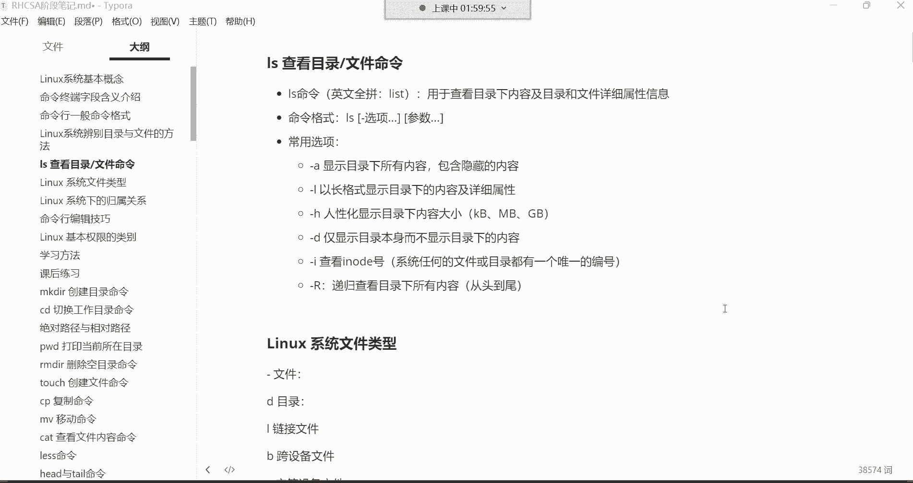

那接下来呢咱们再来重新的再来一遍。

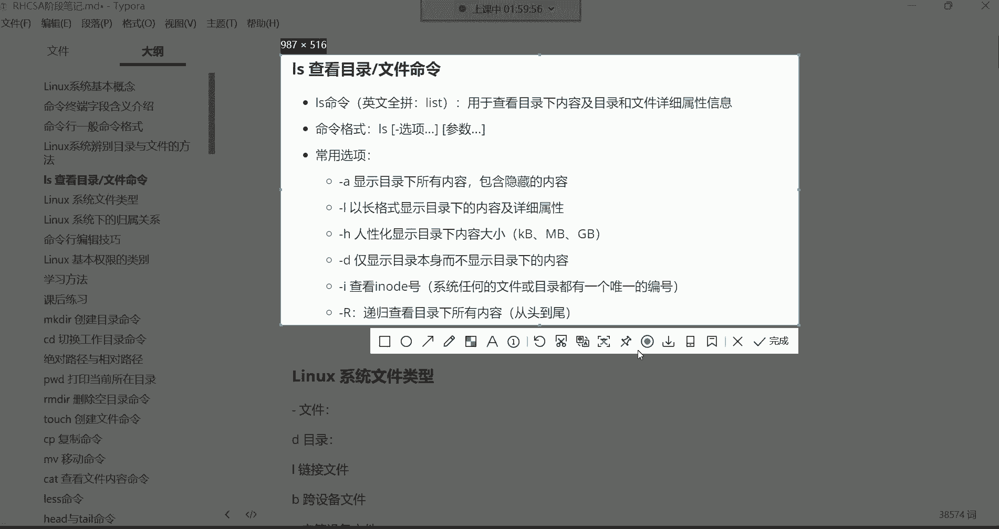

讲过的话呢，我们就简单过一下哈，阿拉斯这条命令用于查看目录下的内容，以及目录和文件的详细属性是吧，那这条命令呢，你看它的命令格式就是我们前面给讲解的是吧，呃选项跟参数啊，当然选项呢是可以同时有多个。

然后呢参数呢也是可以同时有多个，没错吧，当然了，你也可以加选项，也可以不加选项，这条命令就非常的灵活，你怎么去理解吧，这条命令非常的灵活哈，然后常用的选项，第一个杠A是显示目录下所有的内容。

那首先呢如果这条命令你直接敲的话，它就是显示目录下的所有内容，但是它杠A啊发挥的是后边的这个功能，叫包含隐藏的内容，唉这时候拉四杠A回车，这时候你再看哈，好像多出了很多个文件了，我们在没有加杠铃的时候。

只能看到这么一个文件，是不是啊，但是加了杠A这个选项之后呢，你就发现了诶，这个除了这个文件以外又多出来了什么呢，唉后边的这些是以点开头的文件了，有没有看到你看这些文件的名字，前面都多了一个点，是不是啊。

你看都有一个点，这点是什么意思呢，这个点就是隐藏的啊，隐藏的文件，这也是那个LINUX这个系统的它的一个特点吧，啊特色隐藏的文件前面都带一个点，那后期如果我们也想创建隐藏文件的话。

那我们也可以在这个文件名字前面加个点，到时候呢这个文件就被自动地隐藏起来了，那你说我为什么要用这种隐藏的功能啊，哎这个隐藏功能我们平时很少用，是系统啊，它能够用得到，因为这些隐藏的文件是干什么用的呢。

就是没有必要放到明面上，然后呢还不能还不能什么呢，缺少的一些像用户登录系统的时候唉，所必须用到的相关的文件啊，所以就是他觉得这个文件呢，哎不需要你做任何的改动，那就没有必要放到明面上了，那怎么办呢。

隐藏起来吧啊但是还不能没有唉，其实这就给隐藏起来了能力吧，但是我们没有必要，我们是压根没有必要去对他们做任何的修，改的哈，你知道一下怎么查看隐藏的内容就OK了，这是被隐藏起来了啊。

然后windows里面也有隐藏的功能。

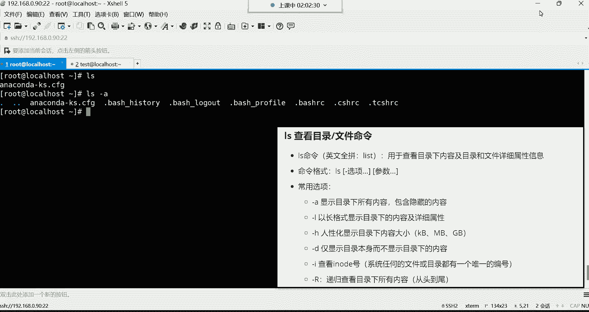

对于windows来讲，你看看windows隐藏的功能在哪呢，你看windows比如说我要看我的C盘，我C盘里面我看有哪些隐藏的文件，这时候呢查看，然后呢显示这里边隐藏的项目唉。

这时候你发现我在我的C盘，好像多出来了很多的文件啊，还有文件夹啊，你就看这个学习资料吧，这学习资料我再点查看，显示我把这个隐藏的项目给它取消掉，唉你看这个学习资料没了，看了吗，是不是哼学习资料没了吧。

然后我再查看显示，然后隐藏的项目诶，你看这学习资料又出来了，这学习资料里边是什么什么都没有空的啊，空的哈哈哈哈嗯，那就证明这个学习资料是被我隐藏起来了，没事吧，你看它的属性啊，右击属性看到了吧。

这属性里面有一个隐藏的属性，所以说呢哎它是一个隐被我隐藏起来，隐藏的功能呵，对我这是win11系统啊，win11windows里这个隐藏功能，其实对于我们那用户系统嘛是吧。

你想比如说有一些见不得人的一些什么视频，图片之类的是吧，那你需要在夜深人静的时候，你需要自己看的这些啊，视频跟这个图片之类的这些东西的时候呃，你可以给它隐藏起来，是不是呃不希望被别人发现。

那这windows不就有这个很好的功能成全你吗，没错吧，啊哈哈嗯对啊，我就给他删掉了哈，删掉了，Ok，很多同学发现这个功能就如同发现了宝藏一样，是不是哈哈说哇塞，那突然间又学会了一个技能。

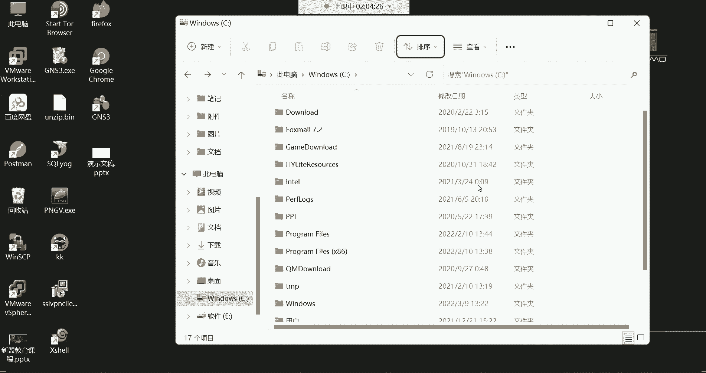

没错吧啊想知道一下就行哈，这隐藏那在这个LINUX里面呢。

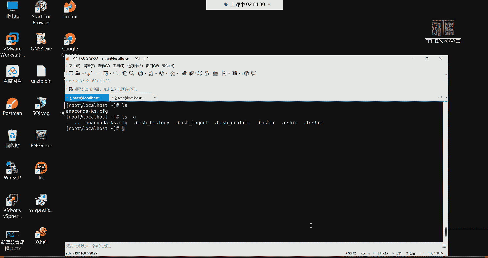

我们怎么看呢，就是杠A好，那下边我们再来说这个杠啊。

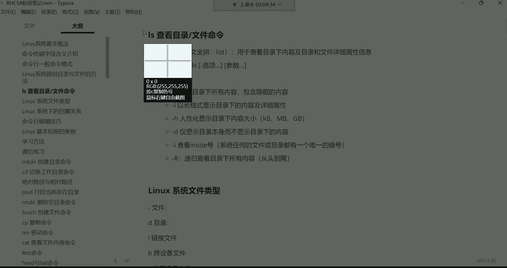

杠L这个选项。

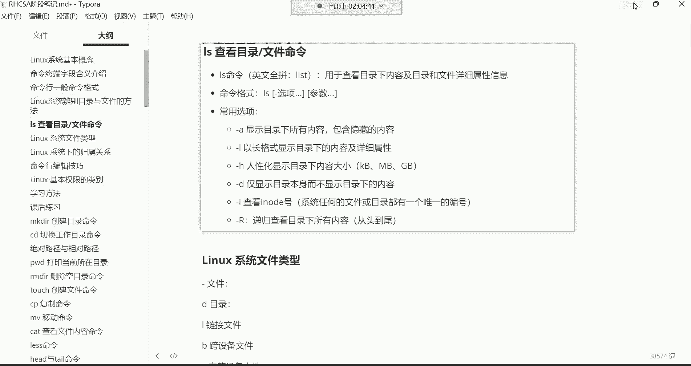

当L这个选项的话，前面给大家讲过是吧，以长格式形式显示目录下的内容及详细属性，这样好吗，阿拉斯杠L啊，然后再补个A，这样的话呢你看它在显示的时候呢，就是把每个文件的详细属性啊，就都给我们列出来了。

然后这个详细属性呢，我们在有一个阶段会专门去讲解它，但在这个位置呢，我们也是简单给大家介绍一下，就是对一个文件的嫌疑属性啊，都有哪些嫌疑属性，我们就拿这个文件来说吧，好吧啊，我们只是这个口述一下哈。

啊简单给大家先认识一下这个详细属性。

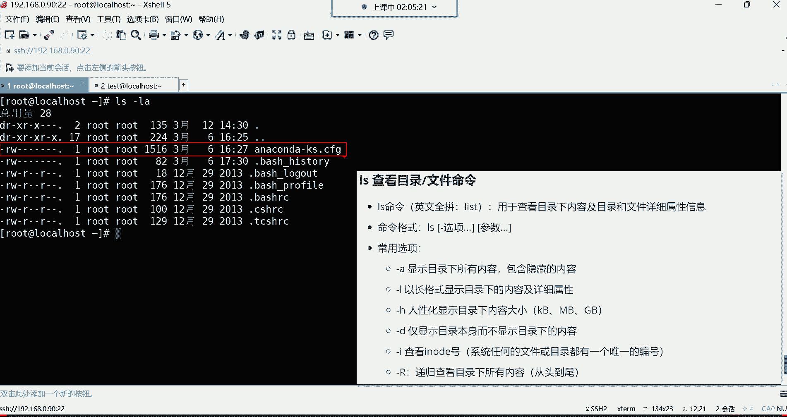

就拿这个文件来说，它的详细属性，啊给它截过来。

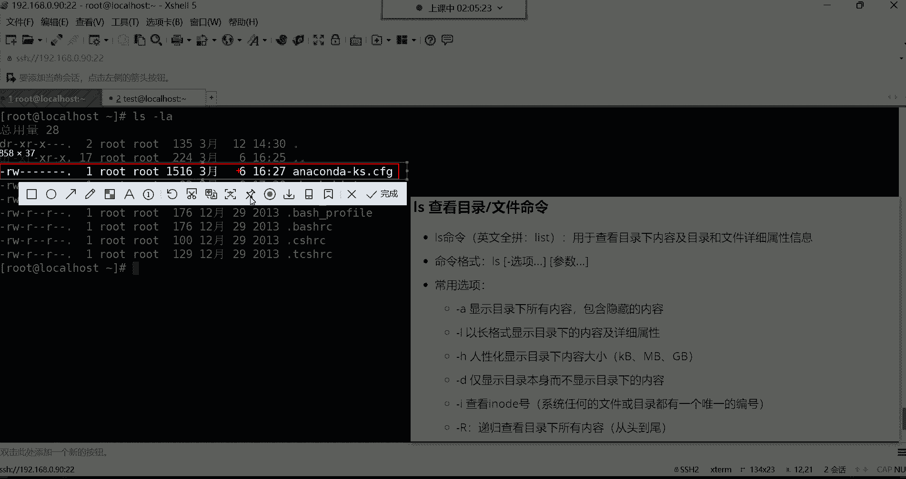

那它的这个详细属性里面有权限，有归属关系，有文件的大小，首先呢我们先说这个文件，他的这个详细属性里边都有什么呢，我们从左往右给大家讲好吧，然后参考这个笔记这个文件的响应响应属性。

从左往右最左侧这个小横杠看哈，这个小横杠代表是叫文件的类型，这有个小横杠看到了吗，就这个小横杠哈，这叫文件的类型，那这个类型的话呢，如果是横杠开头的，就代表这真的是一个文件啊，就普通的文件。

就像windows里的那个点TT结尾那个普通文件一样，K代表它的类型是文件类型，因为这个文件有很多种类型啊，是不是啊，那文件的话呢点TIT的就是普通的文件嘛，那点MP4的呢，这也是文件。

但它是什么类型的文件呢，视频文件是不是啊，那点mp3的呢，这也是文件，那它的类型是什么类型的呢，哎音频音频类型的是不是啊，那点JPG这也是文件，点pg也是也是文件，只不过就类型不一样而已，能理解吧。

唉它的类型是图片类型的，是不是啊，OK所以说我们都叫文件，只不过这个文件又分为很多种类型，那就跟你比，就就跟我们平时开车一样是吧，那你这这玩意儿它都叫车，那拖拉机自行车是不是小汽车诶，火车嗯。

哼这是不是啊，类型不一样，但是它统称都叫车，所以说哎这个文件也一样啊，它有很多种类型，什么压缩包文件啊等等等等哈，然后那这个小横杠就代表，这就是一个普通的文件，那在LINUX里面的这个文件类型啊。

有D开头的，如果说它的开头是以D开头代表是目录。

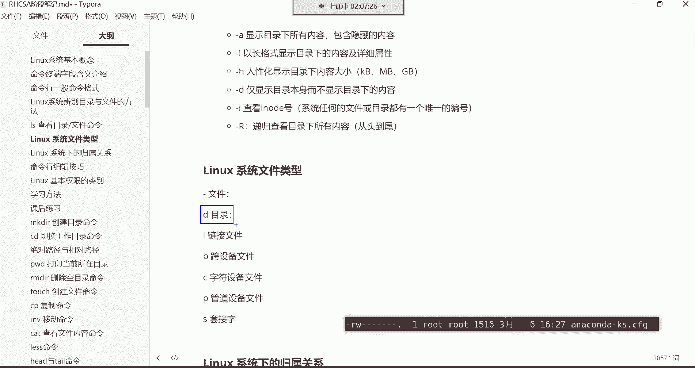

那什么叫目录呢，我们现在可能看不到啊，可以看到这有一个点跟点点是吧。

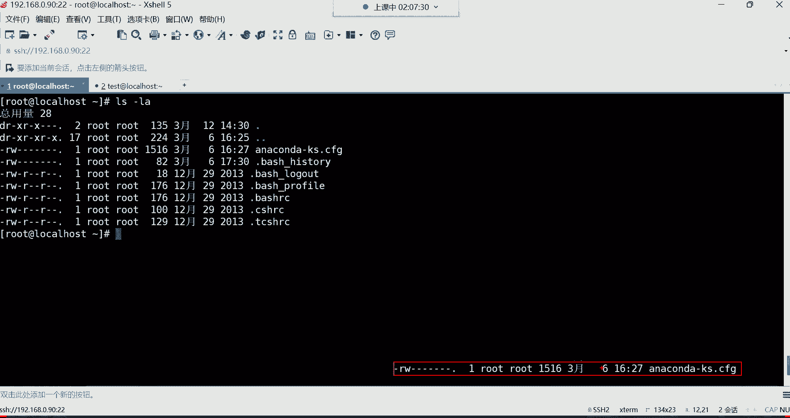

你看他们前面就是开头就是D开头的，没错吧，那我们不要看这个啊，我们干嘛呢，我们阿莱斯杠LA啊，看这个啊，看根目录啊，一会儿我们再说这个根目录哈，现在你看哈，我们可以看到你比如说像这个boot啊。

这个boot你看它的最左侧是什么呀，是以D开头，这些都是以D开头的是吧，哎那以D开头的就代表它的类型是目录啊，这个目录就是windows里的文件夹。

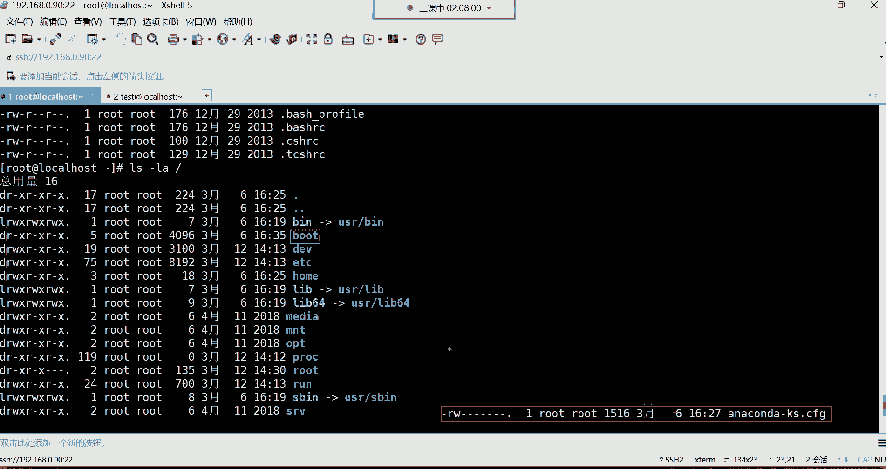

就是叫法不太一样，那还有一种类型叫L啊，这个L是链接文件，这个链接文件啊，我们稍后再讲啊，稍后给你们讲这个什么呢，我们去辨别目录与文件方法的时候，再给你讲讲什么叫链接好吧，其实就是快捷方式。

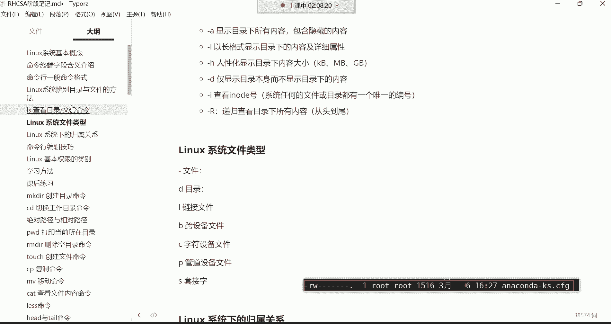

就是快捷方式，windows里的快捷方式，然后呢他们的开头就是以这种L开头。

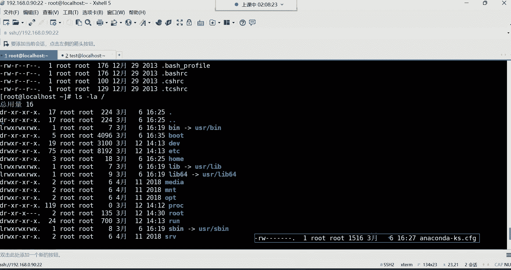

看到了这个L开头是吧，还有下面这两个是不是以都是以L开头的呀，OK这都是链接文件。

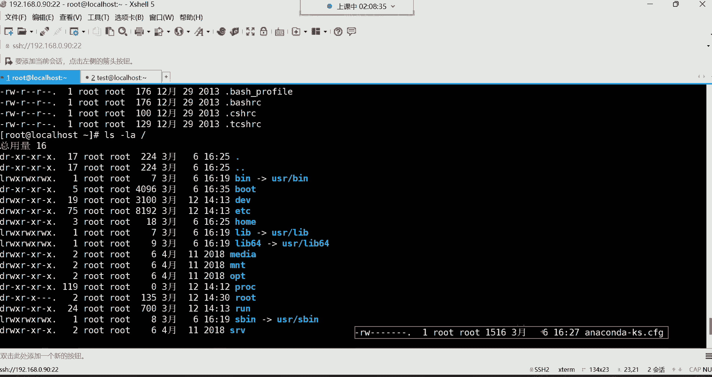

那还有下边不常见的像什么跨设备文件啊，跨设备就是跨不同的分区的文件哈，跨不同的分区，比如说我的这个就像windows里面。

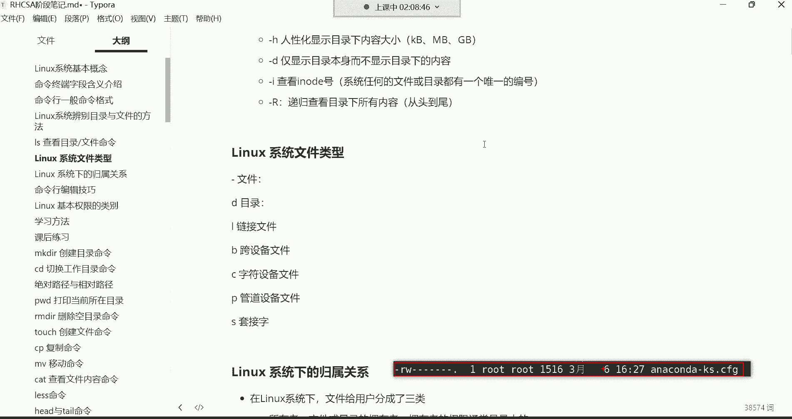

你的C盘跟你的E盘一样，比如说嗯我的这个文件，C盘的文件干嘛呀啊，我给他链接到我的E盘去了，那这是什么呀，跨设的跨设备了啊，这属于跨分区啊。

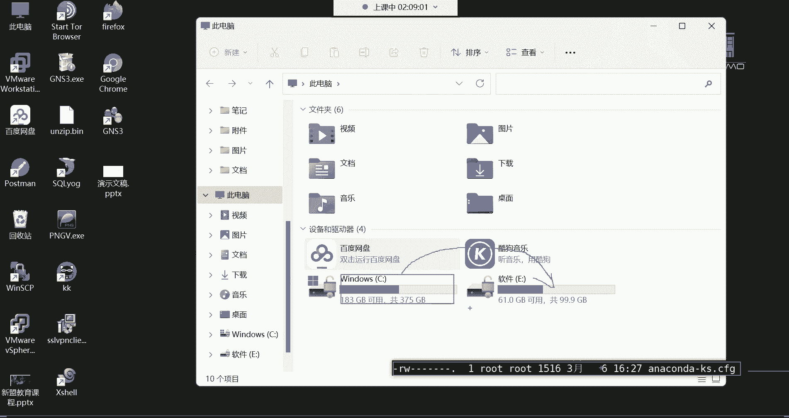

跨分区，然后呢我们再继续说这种像什么字符设备，管道设备套接字这些东西呢，你先对它有个大体的概念啊，现在用不到，包括这什么跨设备文件，现在我们也都用不到啊，你先知道一下它的类型非常多啊。

以后你再看到这种类型的时候，你像这种什么这个，其实最常见的还是前三个吧，嗯只能说最最常见的就是前三个，而像下面这几个呢其实都不是很常见啊，这是代表它的类型，那说完类型以后，我们再来说这个什么RW。

这是干什么用的呀，啊这个呢叫权限，所以这时候呢啊我们还要给大家涉及到什么呢，就LINUX系统的一个基本的权限，这个权限分为哪些权限呢，啊这个现在也是有个大致的概念哈，我们在后期有专门的权限管理的讲解。

在哪儿呢，在这个位置在这儿哈，这是权限权限权限找找哈啊，在这儿呢在这哈有专门的权限管理的课程，到时候呢我们再去详细讲解这个RW，杠杠杠杠杠啊，这分别代表什么意思啊，那这些呢就是属于权限，这个权限的话呢。

那我这里面也是给大家写了权限分为什么呢，分为三种啊，这叫R是读取，W是写入X呢是直行横杠，代表是没有权限，好，我们先来说这个读取是什么意思，读取读取其实很好理解，就是你能不能查看这个文件里的内容。

那这个W写入的话呢是什么意思呢，就是你能不能对这个文件的内容进行一些，比如说啊增删改啊，这不都属于血的操作吗，你看这个文件呢，你看它就有R跟W这种权限，是不是啊，那就是能读能写，那还有一个权限叫X啊。

这是一个执行的权限，这个执行权限是干什么用的呢，就是你能不能运行这个文件，一般什么文件需要运行啊，像什么脚本程序文件啊，才需要你运行，而普通的文件的话呢，是不需要你去运行它的好，这是权限啊，我们先了解。

先有个大概印象，我们后期会呃怎么说呢，会详细去讲解它的，OK然后但是这个权限呢，我们又会涉及到一个什么呢，叫做归属关系嗯，在这儿啊有一个叫归属关系，在LINUX在这个LINUX系统下面。

文件它给用户分成了三类，这三类就是我们所说的叫做归属关系，那第一类呢叫做所有者，所有者就是文件或目录的拥有者，你比如说我们在这个系统里边，我们用root这个账号，我们建了一个文件。

那这个文件通常谁创建的，谁就是文件的拥有者，很好理解吧，比如说你去花钱啊，你买个东西，那这个东西你花钱买的，那你就是它的拥有者，没错吧，你搞个对象是不是，那你就是这个呃这个女孩子的拥有者。

你想干嘛就干嘛，没错，是不是，那拥有者的权限通常是最大的，你该亲就亲，该抱就抱是吧，该搂就搂，该那啥就那啥啊，就拥有者嘛权限最大，那第二类呢叫所属组，所属组的话呢，一般啊这个系统有个特点，什么特点呢。

就是你看root是一个用户啊，是一个账号是吧，那系统呢对于系呃这个LINUX这个系统呢，对于这个每一个账号呢都会给他在干嘛呀，哎在创建一个同名的组，也叫root，注意哈，哎这个叫用户名，这叫组名啊。

只不过呢这叫用户的初始组，初始组就是这个用户与生俱来的这个组啊，系统自动分配的，不是我们自己创建的，那这个as对所属组就是初始组，也有人管它叫基本组，也有人管叫所属组，也有人管它叫初始组。

那一般的话呢就是你看root，比如说创建了一个文件，这个文件呢叫hell，那首先那谁创建的就属于谁，没错吧，是他的所有者，那这个文件默认情况下也会属于什么呢，属于这个账号的初始组哎。

这个就是文件的所属组啊，就是属于哪一个组，通常呢到时候这个所属组有什么用啊，你可以往组里面添加用户，这组嘛是不是组里面添加成员，比如后期你系统里面还有很多的账号，比如说test账号好。

我把test的账号添加到我这个组里面，那以后test的这个账号就可以干嘛呀啊，就可以继承这个组的权限了，那这个组对这个文件的权限是什么权限，那test这个账号就拥有相同的权限啊，这是一个搜索组啊。

它的一个作用，那通常所属组的权限会比所有者的，略微小一些啊，其实也很好理解嘛，毕竟你不能有所有者的权限大，OK那第三类呢叫做其他人，这个其他人呢很好理解，既不是文件目录的拥有者。

然后呢也不属于文件或目录组内的成员，那这个呢我们就称之为其他用户啊，就跟文件没有任何关系的，那叫其他用户，OK你怎么去理解呢，啊就是比如说啊你花钱买了一个物件儿，那你花钱买的。

你就是这个物件的拥有者是吧，那这个组是什么意思呢，哎你别的啊，你可以觉得哎呀这个呃我有很多的朋友是吧，也喜欢这个东西，那那那干嘛呀，哎大家可以相互交流啊，去探讨啊，那干嘛你给他们哎。

就是啊你给他组织到一起是吧，组织到一起呢，那这些人啊就都在同一个组里面，那也可以干嘛呢，也可以对这个物件具备一些啊略微小的权限，比如可以看一看呢，是不是啊，摸一摸呀，但是他想拿走是不行的是吧。

因为他不是拥有者嘛，那什么叫其他人呢，其他人就是哎他也不认识，他也不认识你，他也不认识你身边的什么朋友啊，什么七大姑八大姨的，跟你没有任何关系，那这个就称之为叫其他人了，其实就这意思就这意思。

所有者所属组跟其他人，然后就是简单的介绍一下哈，毕竟我们在前面基础阶段呢，对于一个文件的详细信息呢，我们也是要说一说好，那现在我们就得再来给大家讲讲，这个权限的类别里边，刚好他这个权限怎么看呢。

是总共有九个字符，然后这九个字符的话，它是每三个字符为一组，怎么区分呢，是这样子的啊，三个字符为一组，这这三个字符好，这是一组，然后再来，啊这又是三个字符，看了吧。

好然后右边那最后这红红框里面又是三个字符，看到了吧，然后每三个字符是一组，这一组什么意思呢，就是看看我们前面说所有者所属组，其他人是不是忘记最左侧的这个三个字符，代表是所有者的权限啊。

这个所有者用U来表示啊，这个你先不用管优不优的，我们后期再讲啊，就是所有者对这个文件的权限嗯，能读能写，然后中间这三个字符呢代表谁呢，代表所属组啊，所属组其实就是group的意思啊。

所属组group横杠是什么意思是吧，横杠叫没有权限，没有权限，然后最右侧这三个字符呢是谁的权限呢，是其他人的权限，其他人用O来表示，就是阿other的意思啊，叫其他人好。

那你说那我怎么看这个文件的所有者所有组啊，其他人呢啊在这儿哈哈，这个点的话呢，这个你先不用去管它，这是证明这个文件是受系统内核，防火墙保护的一个文件，而右边这个一是什么意思呢。

一就代表这个文件的引用次数啊，这个引用次数至今为止，没有人能够给一给一个最准确的解释啊，对于我们来讲也不是什么重要的信息，你知道一下就好，然后我们说说那这个文件的拥有者到底是谁啊，拥有者在这呢。

root啊，root注意哈，作为文件的拥有者，然后他的权限在哪呢，他的权限在这啊，最左侧这三个字符就是所有者的权限，那所有者是什么权限呢，所有者是读取跟写入的权限RW，但是你看啊。

那那个W的右侧是个小横杠是吧，那小横杠代表是没有权限，那没有什么权限呢，没有权限就要看这个小横杠在哪个权限位，正常来讲权限的顺序是，比如说，如果所有者对这个文件拥有一个，读写执行的权限。

那它的顺序永远都是RWX，那如果所属组对这个文件也是拥有一个，读写执行的权限，那它的顺序也是RWX，那其他人呢也是同样的道理，这叫全新的顺序，就是R永远在最左侧，W永远在中间，X永远在最右侧。

那这个时候如果这个小横杠啊，他你们看到的这个权限是这样的一个效果，就是啊RW横杠的这种效果的话，那首先你看啊是不是小横杠，它占的这个权限位是谁的权限位呢，应该是这个X的权限位，没错吧。

那就证明root啊，作为这个文件的拥有者，他没有什么选项呢，没有这个X选项，小横杠在哪个权限位，就证明它没有哪个权限好，那这时候我们再来看所属组呢，那所属组是中间这三个权限位，那你发现是三个小横杠。

是不是那三个小横杠哼，那所有组三个小时，就就都就证明他什么权限都没有，那其他人也一样了，你看其他人这个位置啊，现在是也是三个小横杠是吧，那就证明其他人对这个文件，也是没有任何的权限能列吧。

啊那以上就是我们怎么去啊，说这个文件的所有者所属组，其他人他们的权限怎么去看，就这样看，每三个字段为一组，总共有九个字段，然后所有者的权限，最左侧所属组的选项的中间这三个字段。

那其他人呢就跟这个文件没有任何关系的，那都被归类到其他人了，是最右侧这三个字符啊，代表其他人的决心好，那这个呢我们就前面就讲过了文件的大小啊，这是代表文件的大小哈，然后默认是以字节为单位啊。

后面那个是文件的最后一次的修改时间，修改时间，然后我这个笔记里边呢，在权限类别里面都给大家写了，但是我是拿哪个文件来给大家举个例子呢，也是系统里面的有一个文件，然后你看这个就是前面文件的详细属性。

是不是好，然后这个详细属性里边呢，那最左侧也是从左往右解释的中文解释，小横杠代表是文件的类型，然后呢剩下RW杠R杠杠R杠杠啊，就代表啊就是分别是所有者的权限，所属组的权限，还有其他人的权限。

OK啊UGO啊，用字母UGO来表示，然后那分别R代表什么权限，W代表什么权限，X代表什么权限，这里面写的也很清楚，然后下边这个包括这个一是什么意思啊，这个代表是文件的引用次数。

然后只针对于什么硬链接的文件才有效，这些东西呢大家先不要去去管他啊，因为这个至今为止没有一个很好的解释啊，然后剩下的就是这个root root，对应的解释就在这呢啊，就是文件的所有者。

然后呢另外这个root就是对应的是这个root，叫文件的所属组，然后这个呢数字代表是文件的大小，默认以字节为单位的显示，然后后面那个时间叫做文件，最近一次的修改时间，其实最近不就是最后的意思吗。

哦文件的名字叫什么，看到了吗，这里面写的也很详细，你发现跟这个文件是一模一样的哈，就是在这个系统当中就很有规律，所有的文件你想看它的详细属性，都是这样解读的，包括目录也一样，都是这种解读方法。

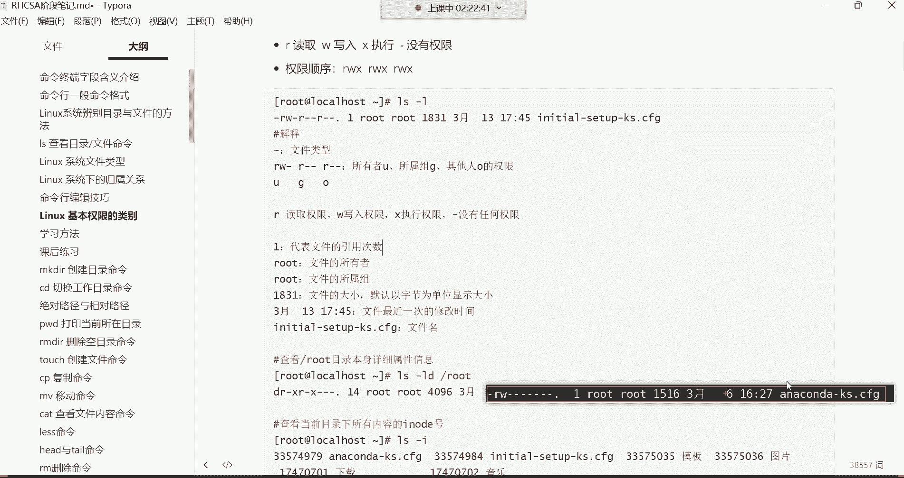

OK好的，解读了他的这个详细属性之后呢，然后我们也了解了。

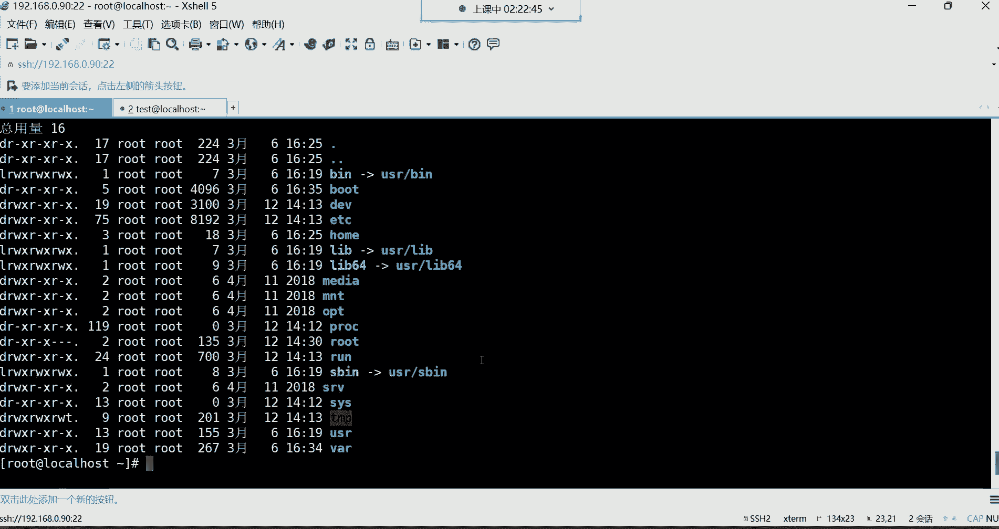

大概了解一下什么叫归属关系，什么叫权限了，是不是啊，那对于IOS这条命令啊，你看我们牵扯出来的还没完事呢，什么呢，就是这个，在这儿啊叫辨别目录与文件的方法，什么意思呢，就是我们在使用LS这条命令的时候。

比如说我想看什么呢，我想看我系统当中的其他目录，其他母我们刚刚用IOS，我们只是打开了自己的家目录，那我现在比如说。

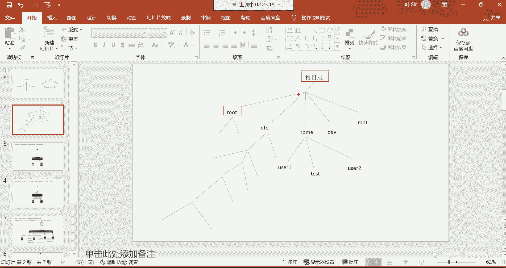

我想看看根目录下面都有哪些数据，怎么看呢，在这IOS空格直接跟上根目录回车，注意哈就是命令不加选项，直接跟参数的话，也要保留空格哈，你就记住命令行的顺序，命令永远在最左侧，然后呢命令如果需要跟选项。

那中间保留一个空格，命令如果需要跟参数啊，也要保留一个空格啊，作为一个分隔，这没有，为什么分隔符好。

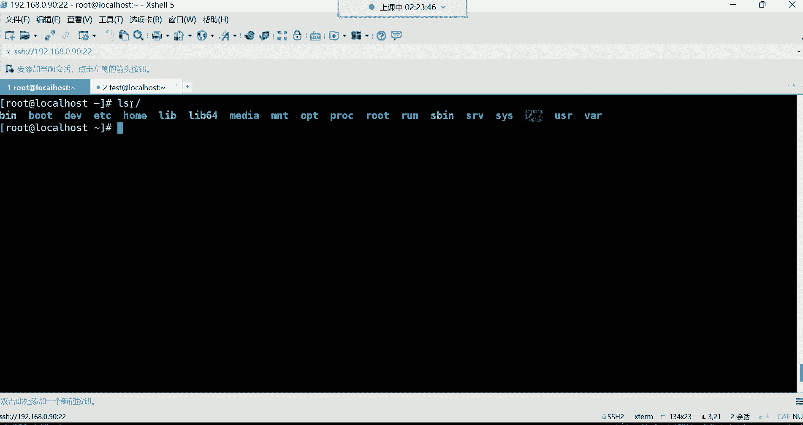

然后我们现在打开的是哪个目录呢，其实就是在这个图里面，就是这个根目录，我现在看的是根目录下边都有哪些数据好，但是它是一层一层的，是不是啊，你看那我们现在只是打开了根目录，下边的这一层，注意啊。

是这一层目录这一层，啊只是看到根目录下面的一层，但是呢你比如说那在根目录下边缘，你看比如etc目录的话呢，那如果到时候你还想看etc，那可能是在etc目录下面又又又有很多的什么呢，什么叫子目录。

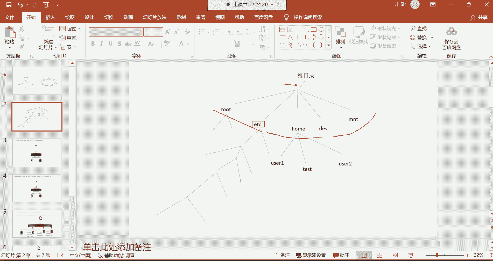

到时候你再继续去打开etc就可以了，好我们先来看这个什么呢，这个根目录下边的这一层都有哪些数据，那这些分别代表什么意思呢，其实这也是很多小白，在刚开始接触这个系统的时候，它容易什么的。

容易蒙的地方怎么蒙的，就是英文，完全看不懂，完全不理解，现在所看到的这个到底是干什么用的啊，以及这为什么要叫这个名字，都感觉很奇葩，是不是啊，为什么都是这个英文的，不像windows一样，中文的不好吗。

是不是啊啊会有众多的疑问啊，这就是这个系统的特点，没有办法改变不了啊，你改变不了社会，你就要去适应社会啊，这系统也一样是吧，你没有办法自己去开发一套系统，你就去适应它，你就去学习它就好了。

那我们现在看到的这些东西到底是什么呀。

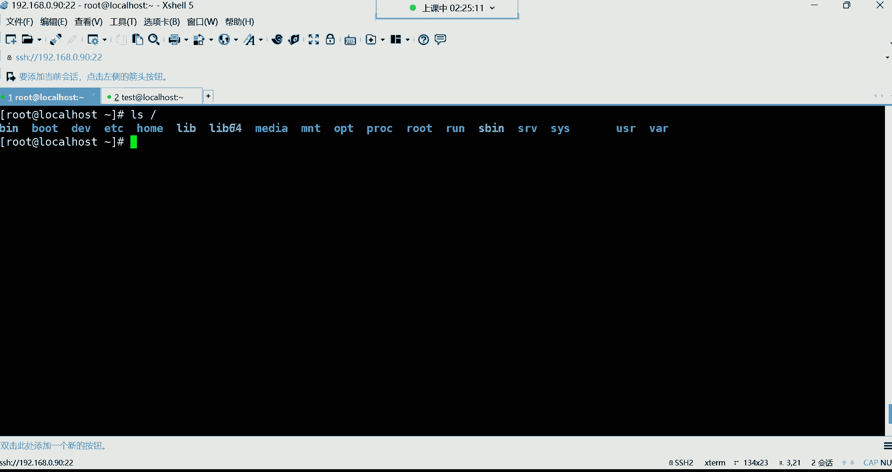

好接下来呢就就会扯出来一个叫做什么呢。

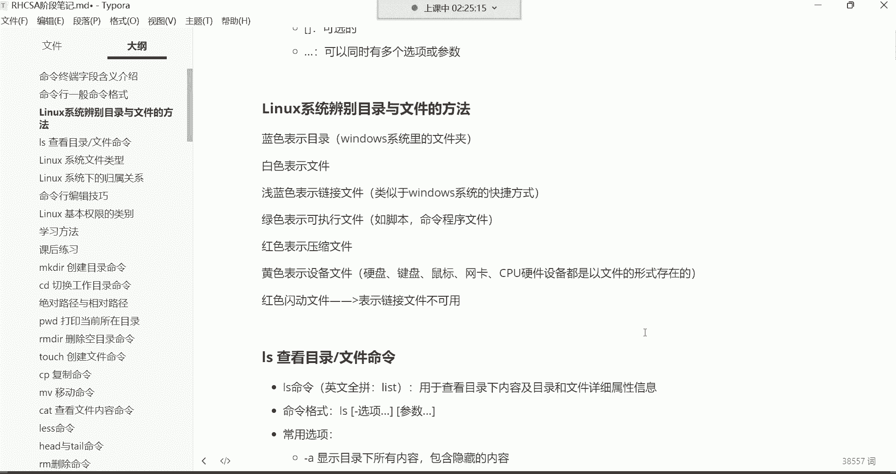

叫做辨别目录与文件的方法，就是我们现在看到这个东西。

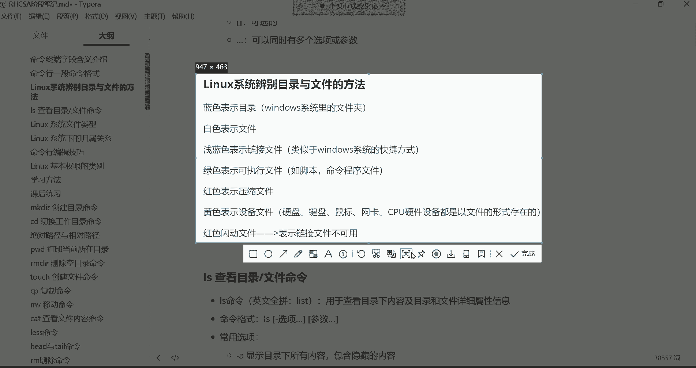

到底是文件还是文件夹，那怎么看呢，好接下来呢我就是来带领大家了解一下，在LINUX下边众多的文件的类型，我们怎么去通过颜色去辨别，第一蓝色，蓝色表示的是目录，这个目录就是windows里的文件夹。

大家也不要蒙圈，那文件夹这东西不就是存储数据用的吗。

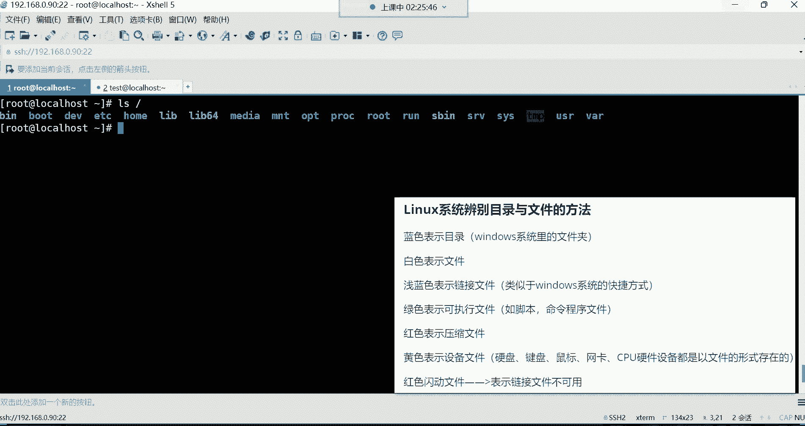

是吧，你说我建了一个文件夹，比如说我想存储一些嗯，一些不能被别人所这个看到的一些什么电影啊。

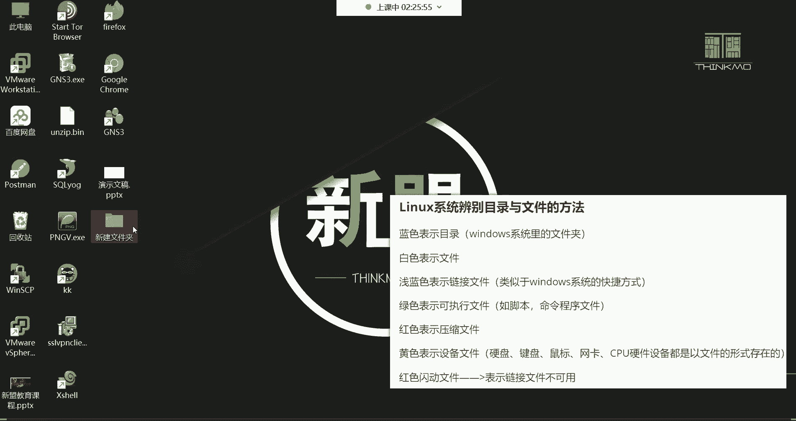

图片呢，那是不是就直接往文件夹里面存了，或者说在文件夹里面再去存储一些什么。

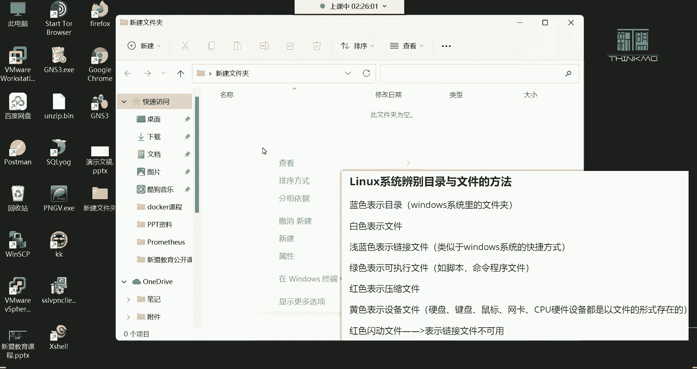

普通的文件啊等等等等的，这不就是文件夹干的事吗。

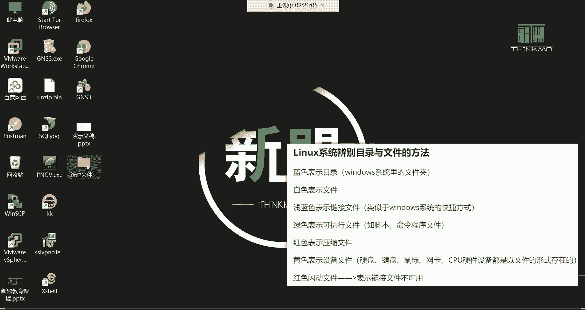

存储数据用的OK，只不过呢我们现在学习的不是windows系统。

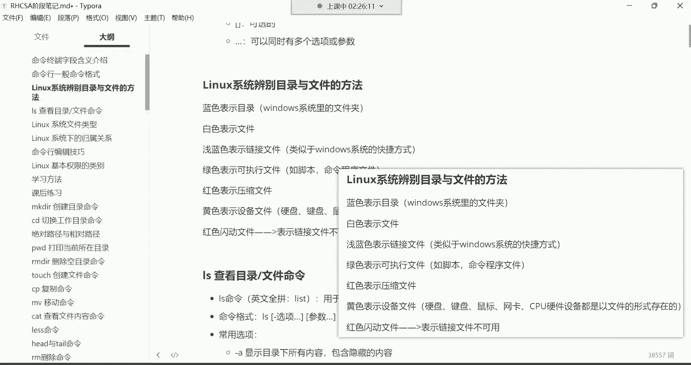

我们现在学习的是这个LINUX这个系统，而这个LINUX这个系统呢它就不叫文件夹啊，就是名字不一样，它叫什么，它叫目录，但是它的本质是一样的，能理解吧啊都是帮你存储数据的，你知道一下就好O好了。

这是蓝色表示的是目录，以后我也不会再去管它叫文件夹了啊，你们以后也不要管它叫文件夹，它就叫目录，好这是蓝色，那白色白色表示的是文件，那在根目录下面，你发现没有白色是吧，没关系啊，文件多了去了。

你比如说我想打开etc这个目录，那这时候你这样啊，LS空格跟下的etc啊，目录可不止这么多哈，你看我现在给你打开是根目录下边的谁呢，etc这个目录，所以这时候你再打开的时候就得指定了啊。

我要看跟下边的etc，所以说哎你看左边是根目录，然后呢etc在根目录下边，这时候就得根下的ETC，他现在给你打开的就是etc这个目录，那你看在etc这个目录下面又有非常多的什么呀，啊白色的代表是文件。

蓝色代表的是目录，所以说这个系统的结构就是像大树的分叉一样。

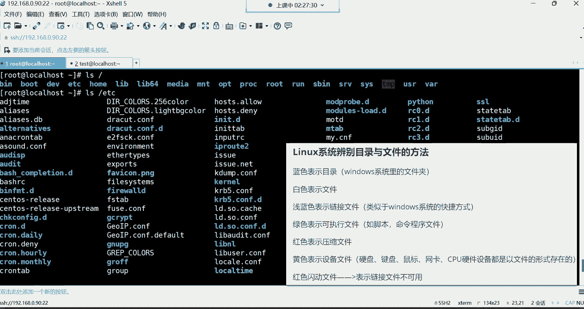

看到了吗，我们刚刚打开了etc，你发现etc下面又有非常多的什么呀，我们叫要小小的分差，那每个分叉都是一个目录或者是文件，哼能理了吧，那如果说我再打开，比如说mt目录，DV目录。

那其实每个目录里面呢还有很多的数据呢，因为大树嘛是吧，你看大树的分叉，你怎么可能数数得过来呢，所以这个系统的结构也是非常庞大的，有拥有非常多的目录，以及每个目录下边，它还有可能存放非常多的什么呢。

我们叫子目录呢。

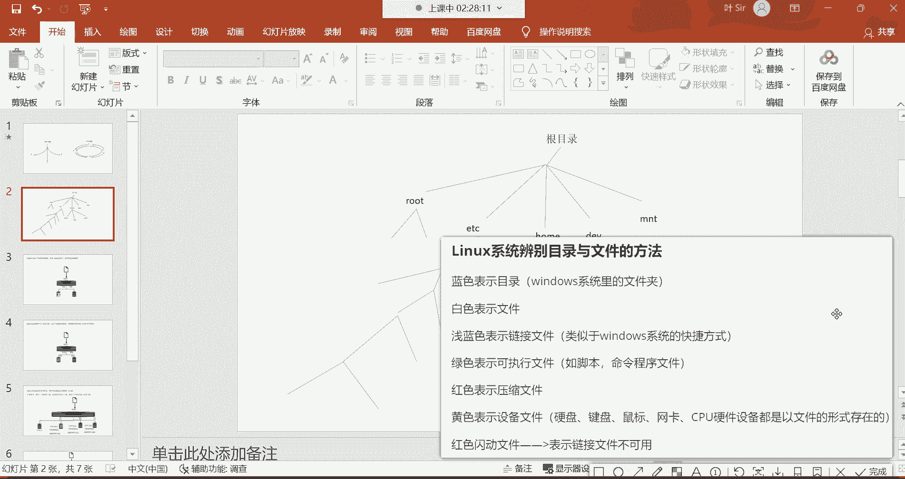

好那在这个etc目录下边，你看到了吗，我们现在看到的这个白色的，只要是白色的，都是什么呀，都是文件颜色在哪里配置是吧，呃这个系统自带颜色显示，自带颜色显示哈啊能变更吗，不能变更，变更不了。

这个时候呢你看看白色，现在你知道了，蓝色也知道了是吧，但是还有像这种浅蓝色的，你们有没有发现这种浅蓝色的表示是什么呀，浅蓝色的这种浅蓝色的它叫链接文件。

这个链接文件类似于windows里的那个叫快捷方式，可能说很多同学啊不知道什么叫链接是吧。

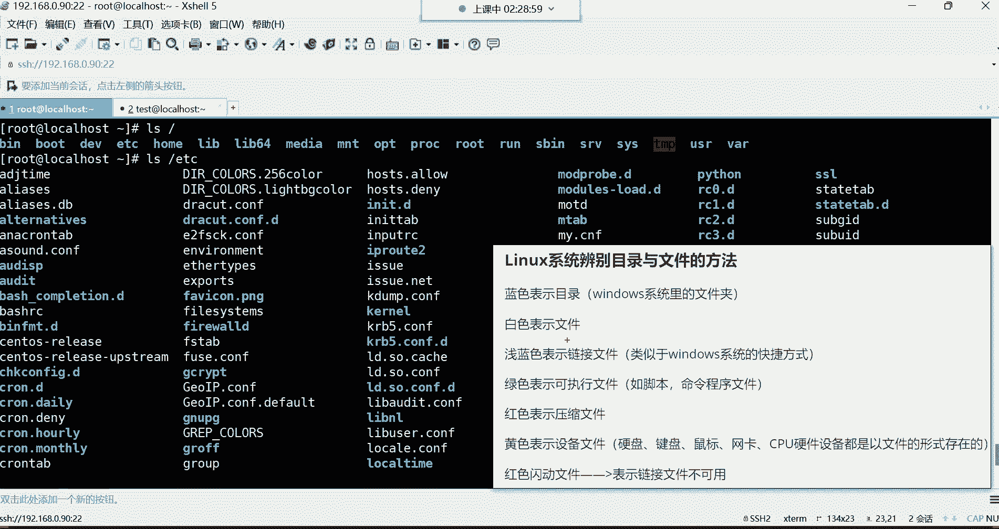

第一次听啊，这种东西就不是人话链接。

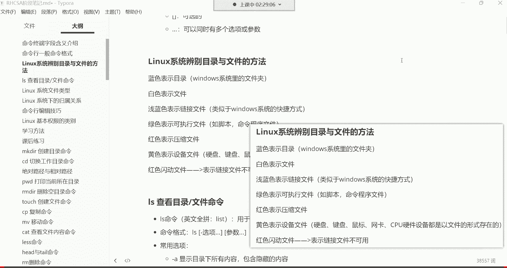

那我们给大家讲讲windows的快捷方式，然后让你们更好的理解什么叫链接文件呃，这个windows里边你看哈快捷方式，你们现在看到我的这个电脑，桌面上面的什么这个各种图标啊。

火狐浏览器的这个图标上面有个小箭头，是谷歌浏览器上面有个小箭头，没错啊，百度网盘等等等等，是不是都看到一个小箭头啊，这个小箭头就证明它是一个快捷方式，那你说快捷方式干什么用的呀，快捷方式我一双击它。

我一双击它。

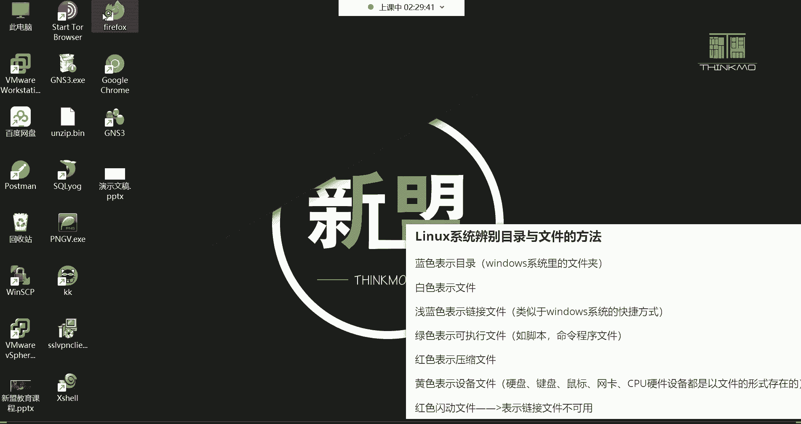

我就可以使用这个火狐浏览器了，那没有快捷方式呢。

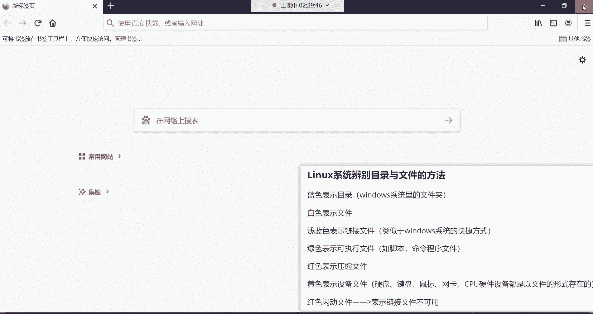

没有快捷方式，你得找到它所对应的那个程序文件，右击打开文件所在位置啊。

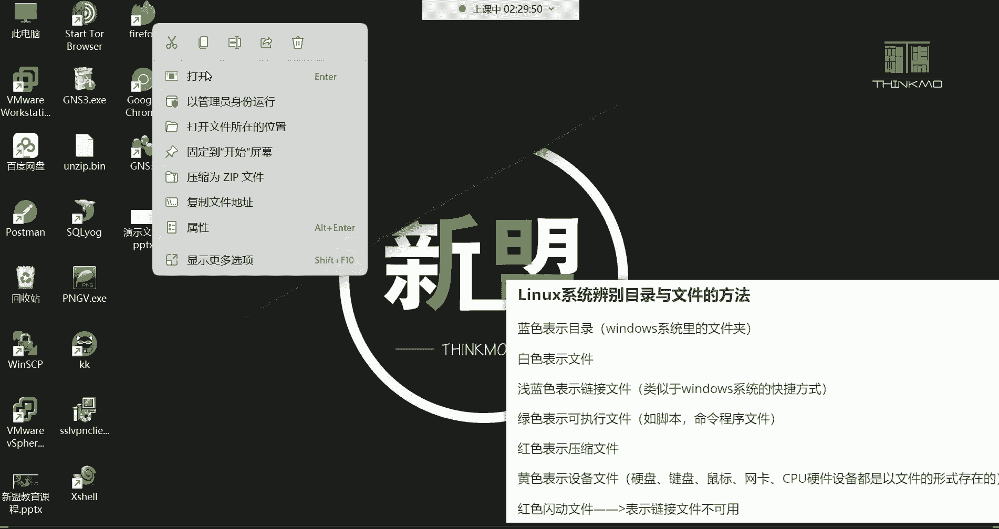

那这时候呢你看啊这个快捷方式，它所对应的真正的应用程序文件在这儿呢，看了吗，在这呢点ESE结尾的windows系统里的程序文件，那这时候我可以直接双击这个。

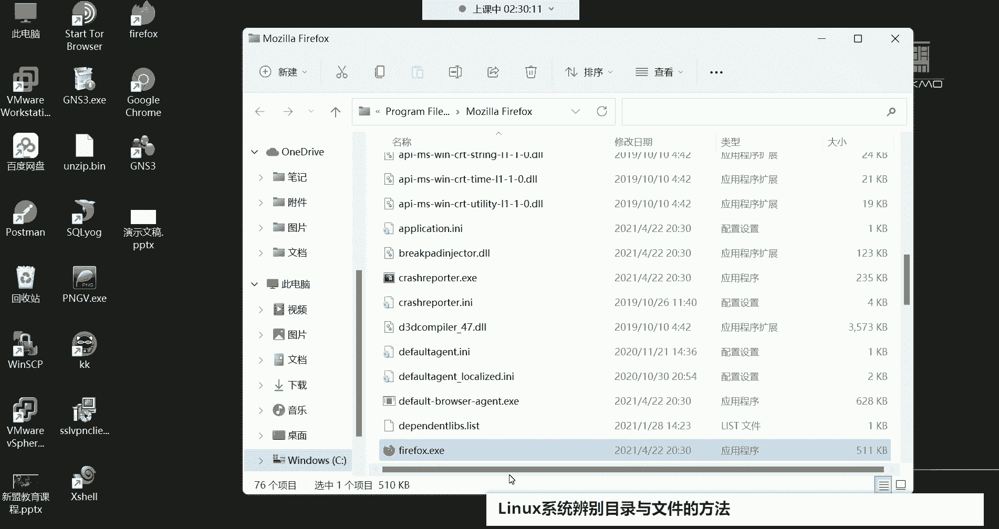

ESE的这个文件啊，执行这个文件，其实你发现效果也一样啊，我也可以使用这个火狐浏览器，没错吧，但是呢不太方便。

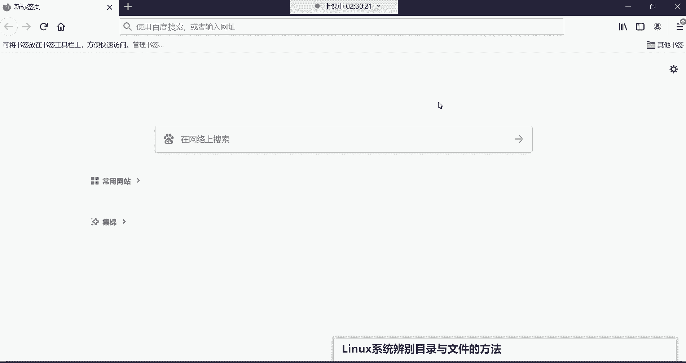

怎么不太方便呢，就是如果没有这个图标的话，没有这个快捷方式的话，我每次想使用火狐浏览器，我是不是得跑到我这个windows电脑的这么深的一个，文件夹里面，然后呢我还得去翻一翻，从上往上往下翻一翻啊。

我的火狐浏览器在哪儿，是不是哦，在这呢好一双击我就可以使用它了，麻不麻烦呢，非常的麻烦吧，所以有了快捷方式以后呢，你还需要去找他的这个程序文件吗，不需要双击图标就可以了啊，这个图标的话呢。

它最终会帮你自动去找到这个程序文件，所以什么叫快捷方式啊，是方便快捷的，让你找到这个程序文件去执行它。

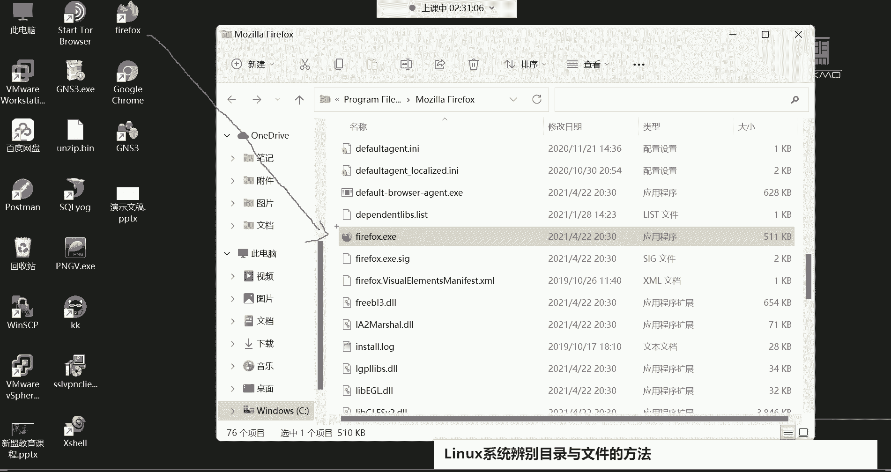

这不就叫做快捷方式吗，所以LINUX系统里面也有这个功能，只不过他名字不叫快捷方式，它叫什么呀，它叫链接文件，知道了吧，哎就你发现其实它的本质是这样子的，换汤不换药，能理解吧。

哎真正帮你实现功能的其实就是这个意思，但是就是叫法不一样，这就因为它不同的系统嘛啊系统类型不一样，所以说它叫法也不太一样O啊。

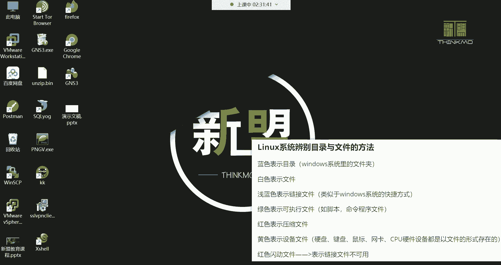

你知道一下，所以以后呢就不要再什么呢再问别人啊，什么叫链接文件呢，如果你自己不理解这种温，这个链接文件的含义的话。

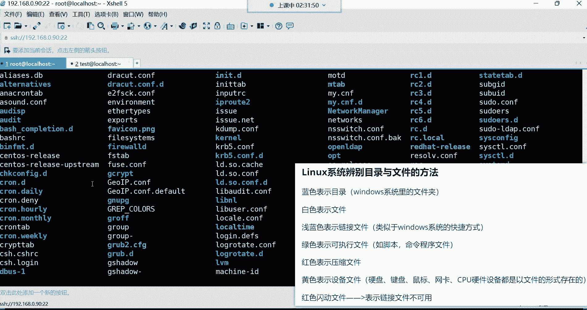

你就想想windows里面的快捷方式是干什么用的，你就知道什么叫链接文件了，你你也就知道他存在的意义是什么了。

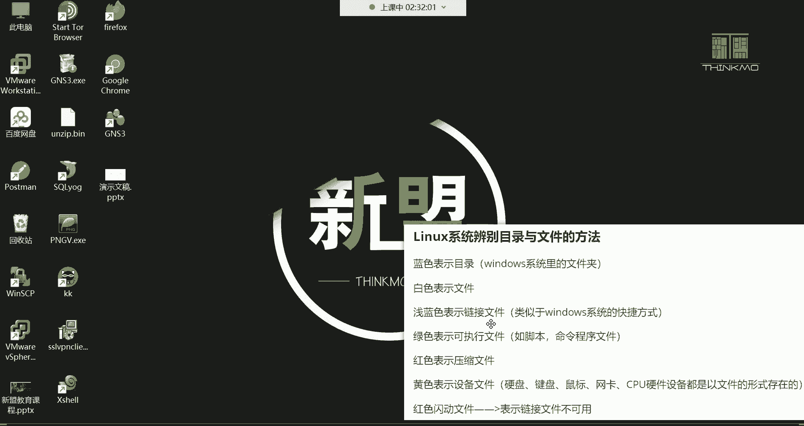

知道吧，OK啊这是浅蓝色，那还有一种叫做绿色啊，绿色表示可执行的文件，那可执行的文件啊，就刚刚我们说啊看到的那个程序文件。

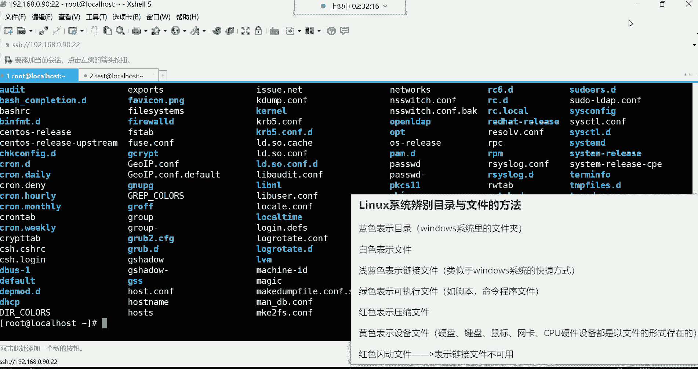

右击打开文件所在位置。

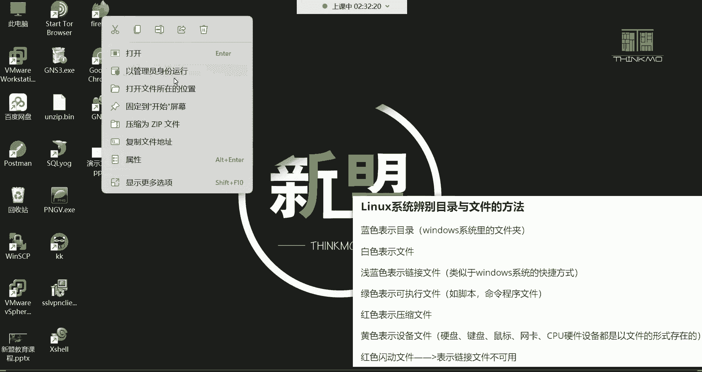

你看在windows里面呢，我们如果没有没有这种快捷方式，我也得去双击执行这个程序文件。

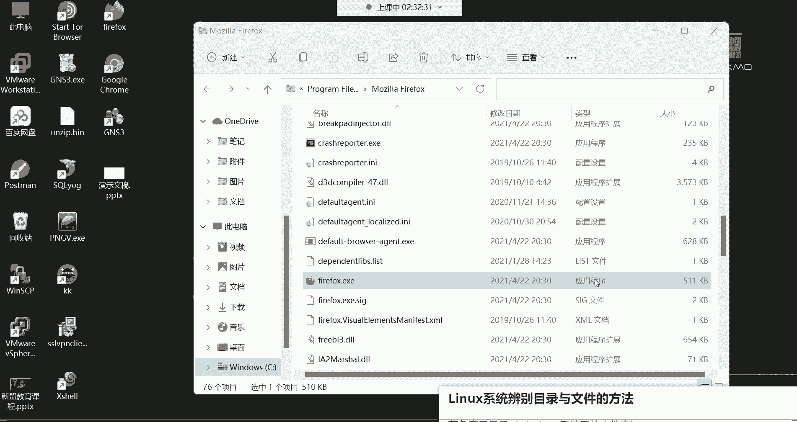

是不是啊，这就一个应用程序文件吗，一双击，然后呢浏览器我就可以使用了啊。

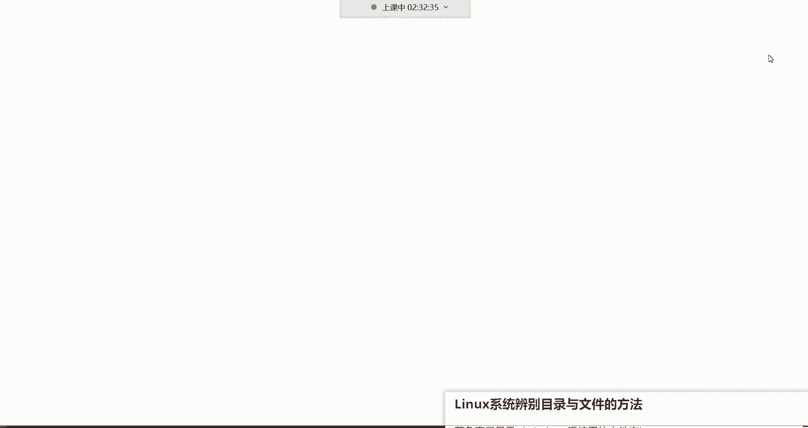

是怎么回事，但是呢在LINUX里面他压根没有这个图标，就没有这种图标，而且它也不能让你双击。

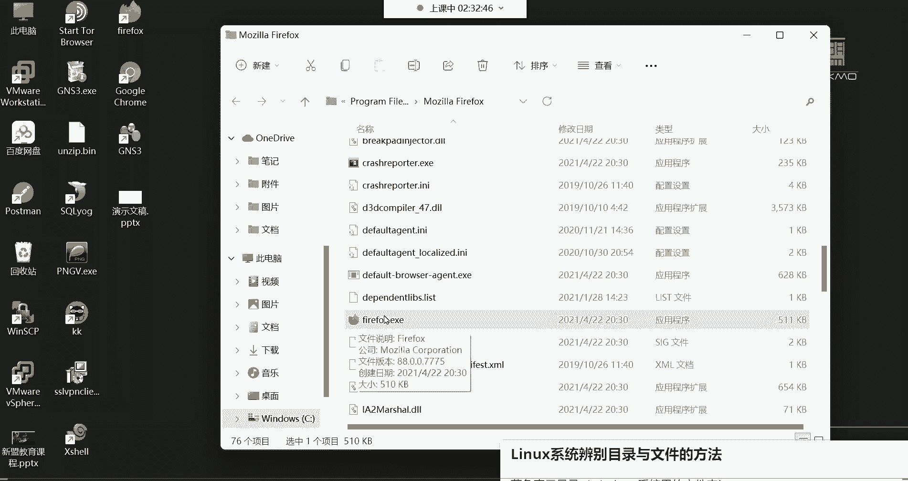

能理解吧，没有鼠标让你双击的，所以呢一般你怎么知道，或者说你怎么辨别这个文件，我能够去执行它给我带来功能啊，就看颜色啊，绿色就证明这个文件是能够给你带来功能的，不是一个普通的文件，知道吧。

那Z像这种在哪呢，CTRL清清屏啊，打开根目录，打开根目录，你看这里面有个bin啊，这个ban它是个浅蓝色的链接文件是吧，但是我告诉你它是一个目录的链接，注意哈是目录的链接。

那这个时候呢我们打开的目录嘛都可以打开，我要打开根下的哪个呢，并这个目录好回车，这里面你可以看到是不是有非常多的绿色的呀，我跟你讲这些绿色的就是什么呢，呃当然大多数都是这个命令的程序。

什么叫命令的程序啊，就是我们在这个系统当中敲的命令，大部分都在这个目录下面，而且呢都是绿色的，能够给你带来功能的命令，不就是给你带来功能的吗，是不是你得执行他，OK所以一般那命令也是以文件的形式存在的。

所以呢那是以绿色的颜色表示啊，可以给你带来功能的，OK这是绿色，那还有一个颜色是红色压缩文件，这个红色的话我们现在看不到啊，这里面因为我们系统里面没有压缩包，没有哈，那没有压缩包。

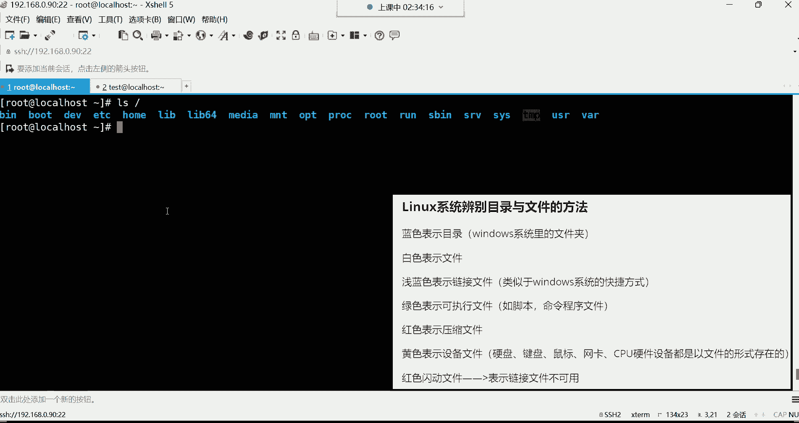

我们搞一个压缩包吧哈嗯咱们我建一个什么呢，建一个新建一个，我新建一个文件，然后呢我给它压缩一下，压缩好，那在windows里面我们可以看到，你看压缩以后就变成这个样子了，是吧好。

那这个你一眼就知道它是一个压缩包。

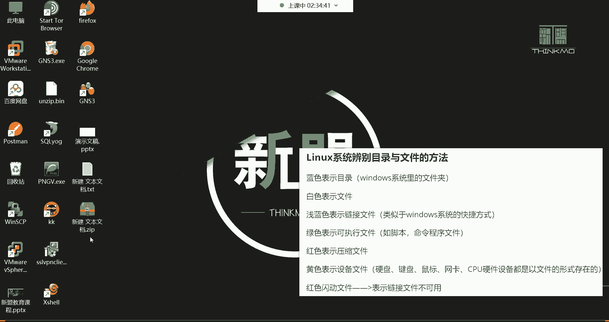

但是如果我把这个文件给你，传到LINUX这个系统里面以后。

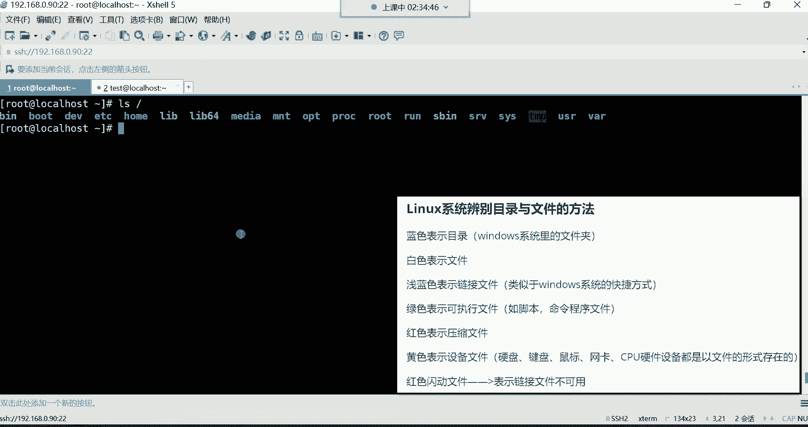

我们看看它是个什么样子哈，当然这样传是传不进去的，因为是跨操作系统了，那怎么传呢啊可以用这个东西叫vs c p。

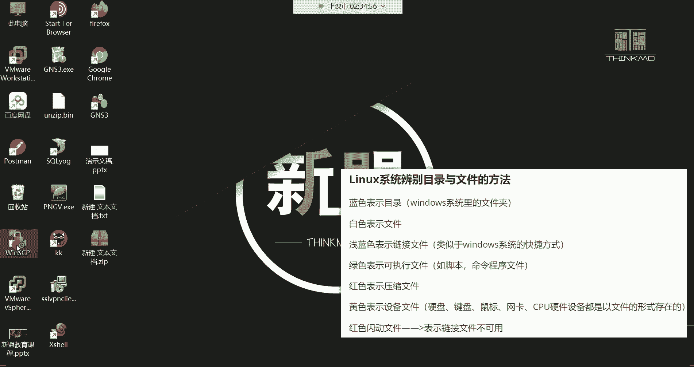

打开这个vs c p以后，它可以实现把windows里的文件传到LINUX系统里面，然后在这个里边呢哈输入主机名，192。168。0。90啊，这是我们当前的一个主机啊，主机名字。

然后呢下面的用户名用谁去干嘛呢，连接用root连接root的密码一，然后登录一下，OK你看现在去连接主机是吧，首次连接呢需要一个什么密钥哈，没关系，选择试就行了。

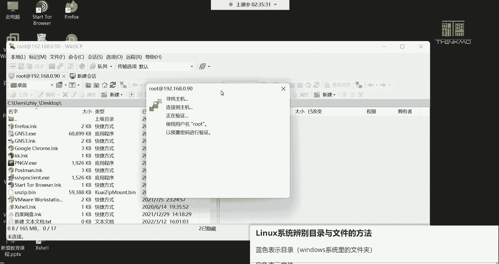

OK连上去了，连上去以后呢，左边就是我们的windows系统里的一些数据了，右边就是LINUX系统里面的数据了，我现在想把这个我桌面上边的这个压缩包，我直接给他拽进去就可以了，注意啊。

直接拽到这个什么呢，LINUX系统的root目录啊，现在就在root目录呢，是不是，OK那这时候呢关掉啊。

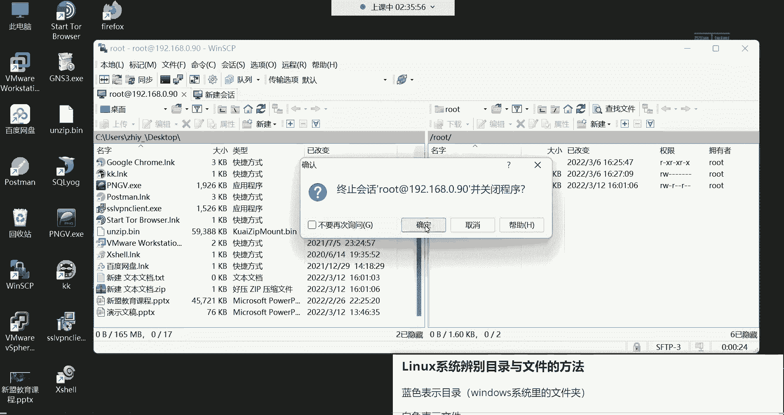

断开链接，这vs cp可以从哪下载的软件商店啊，软件商店就可以下，可以实现跨系统之间的一个数据传输好，那接下来呢我们看看在IOS回车。

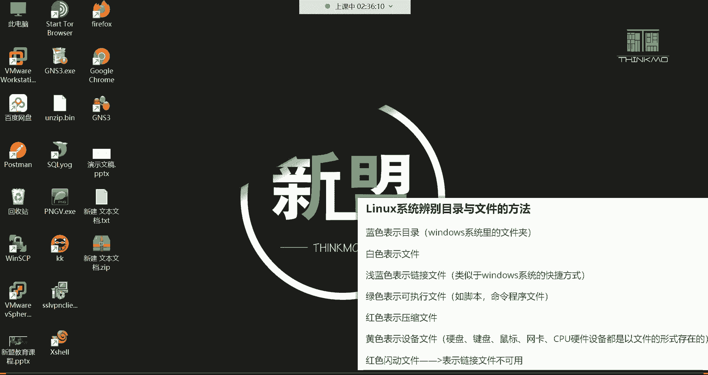

因为那个文件是传到了我们这个家里边了，所以呢你直接LS就是看的是加目录，那你看这个文件在我们这个系统中，是有那个图标吗，有那个像一个压缩包一样那种图标吗，你发现他没有是，但是它颜色是什么颜色红色。

所以你在这个系统当中一看，这个文件的颜色是红色的，就是一个压缩文件，压缩文件被压缩过的，那哪些文件属于被压缩的呢，多了去了，mp4这种视频文件就是被压缩过的，mp3啊，这种音音乐文件也是被压缩过的。

或者说这种点儿踏结尾的压缩包，还有点rpm结尾的软件包啊，这都是压缩类型，嗯不看这啊，这个颜色是看扩展名的吗哈嗯不看扩展名，不看冠名哈，好这是红色啊，表示的压缩文件，然后我们再来说啊，再来说这个黄色。

黄色表示设备文件，这设备文件比较好理解了，硬盘鼠标键盘网卡，CPU显卡这些都是硬件设备是吧啊，都是以文件的形式存在在哪个目录呢，有一个DEV，你看在跟下面有一个DEV看了吗啊。

我们阿拉斯空格打开根下的DV回车，你看这里面你发现有很多叫什么呢，叫黄色的，黄色的是吧，不是很正经的一个颜色，黄色设备文件，那你知道这个每每个文件分别代表是什么呀，到啊到底是哪个是硬盘，哪个是鼠标。

哪个是键盘的，哪是网卡呀，哪是CPU，这先甭管的啊，我们后面有一个单独阶段，会给大家介绍这个文件的，OK你先知道一下啊，这黄色那还有很多同学说，那老师这怎么还有个粉色的粉色。

粉色一般图片你传进来就是个粉色图片哈，如果你要给它传进来，它就是一个粉色，但是呢我们可以ALEX杠，我说我们看看DV下的log，这个你看，但是它的类型可不是图片S开头的那S开头的。

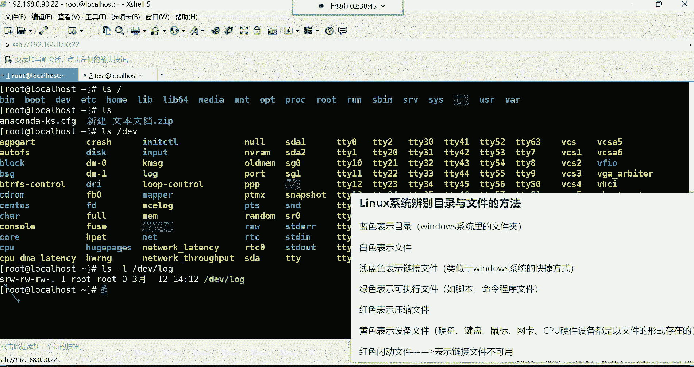

我们前面再给大家讲这个文件类型的时候，系统文件类型S代表是套接字文件。

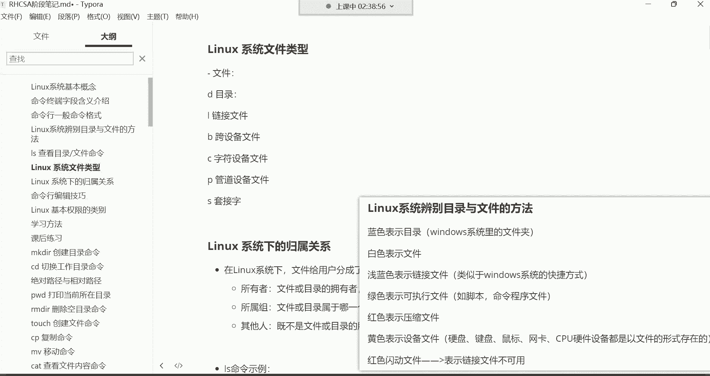

那什么叫套接字文件，你现在也不用管它，但最起码你现在知道它的类型是什么类型的，是不是，如果你实在不理解也没关系。

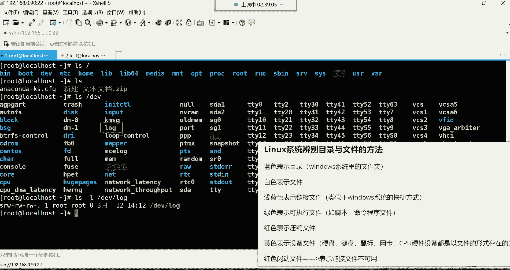

我这里边给你，你看啊，这里边有很多的文件类型的说。

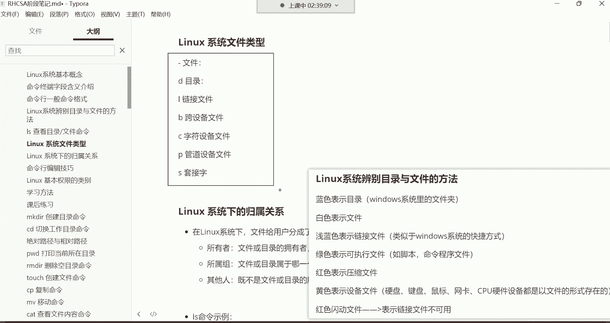

你比如说我们想看看黄色的那S杠L看谁呢，比如我看DV现在什么呢，我要看那个SDAS下的SDA回车，你看B以B开头的叫什么呀。

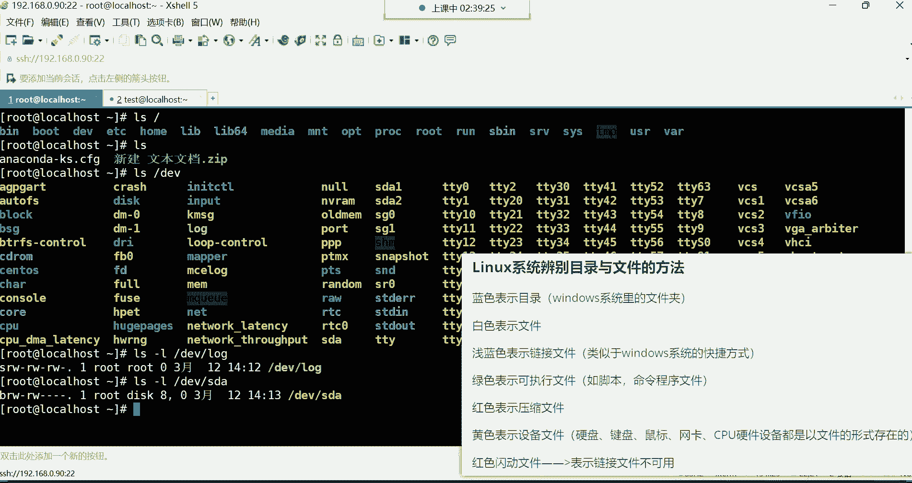

叫跨设备文件，其实就是硬件设备文件，叫硬件设备文件。

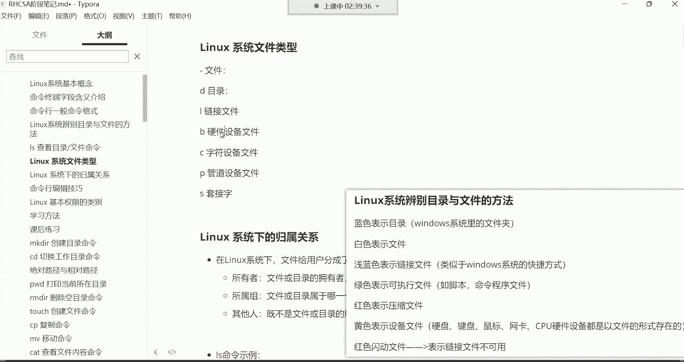

黄色的硬件吧，硬件设备都是什么呢，B开头的，这是说清楚了，这个黄色是吧，黄色，然后我们再来给大家讲讲，这个红色闪动的文件嗯，这个红色闪动的一般就是叫链接文件不可用，就这种浅蓝色的叫链接文件是吧。

那如果链接文件有问题呢，它就会变成什么呢，闪动的，但是这个你得看它的详细信息，比如现在我建个文件，建了一个hello文件，然后呢我给他创建个链接，这命令大家先不用去纠结哈。

我们现在还没到这个学习这些命令的时候，所以你先知道一下，我给你们演示一下，IOS杠L看OPT目录，看到这个文件了吗，红色闪动的，这就证明说它是本身它是一个链接，链接文件的特点是有个小箭头。

左边是链接文件，右边小箭头指向的是什么呀，就是他的那个语言文件。

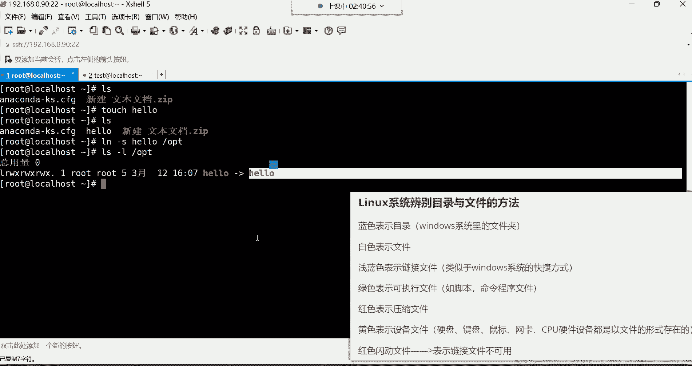

就等于说啊，左边这个文件就是我们所说的这个桌面的图标，然后右边箭头，右边那个对应的就是这个图标，背后真正的那个什么呢，实现功能的那个文件，你看我们右击打开文件所在位置。

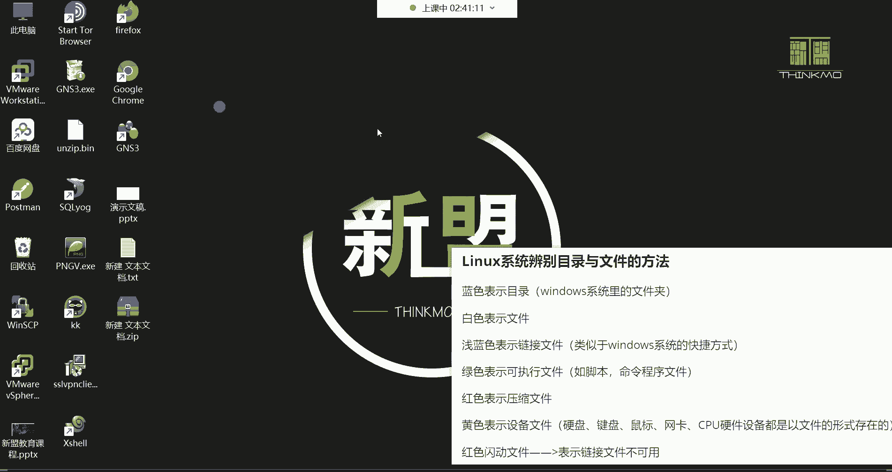

看到这个就是这个，这个就是它的快捷方式的语言文件，知道吧啊这是这个快捷方式。

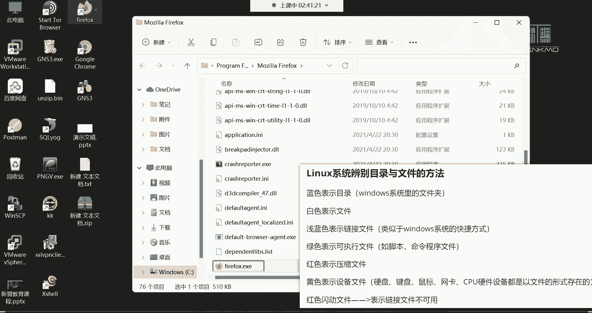

是不是啊，那在这里面我们看到得感叹，这小箭头左边就是这个什么呢，这个链接文件就那个快捷方式，右边这个就是它所对应的真正的那个什么呢，源文件，但是你一看原文件一直在闪闪闪，就证明什么呢，就证明有问题了。

你这个链接文件不能用是有问题的，啊那以上就是我们可以通过这些颜色去干嘛，去辨别系统当中的这种文件的类型啊，通过颜色辨别，然后你看我们在讲这个颜色辨别的时候，我我也是哈，呃其实也是给你们演示了很多。

就是我们想查看系统某个目录的时候，你比如我想看这个DEV下边的这个log，首先它是一个文件是吧，我怎么看呢，唉你看咱们说X杠L查看它的详细属性了呀，那详细属性里面你可以看到它具体的详细信息。

那这时候你就得这样看是吧，还指定这首先这个文件在哪，一直知道啊，在哪儿啊，是不是在DEV这个目录下面呢，哎他这个目录关系就是一层一层的啊，你得先干嘛，你得先指定这个目录是在根下的DV下边啊。

左边这个这个这条斜线就是根目录啊，然后指定根下的DV好，那你如果说我想看DEV下边的，比如这个log这个文件的话，那这时候注意哈，这个文件是不是在DV的目录下面的，那这个时候这根斜线是什么呀。

这根血线叫做路径分隔符，就指定我要看的是DV这个路径下边的某个文件，那这是怎么分割呢，怎么怎么让系统知道，你要看的是这个DV目录下边的呢，哎这根斜线就是路径之间的分隔符啊，通过斜线来表示。

那如果你像我前边，你看我并没有加这个什么呢，这个斜线后边这个log并没有加他的话，我如果直接这样敲的话，是不是直接把整个DEV目录打开了，打开了整个目录，但是我就想看这个目录下面的某一个文件。

那你就得具体的指定啊，这个目录下边的具体的文件的名字，那你看这就很好理解了，比如说我后期我还想看我，我我们先干嘛呢，我们先打开这个etc这个目录，ALICEALEX根下的etc，那你看我想看etc下面。

比如说哪个文件呢，我想看啊，我想看看哪个文件呢，那那那个这个吧啊叫pass wd的文件，那我怎么看呢，那首首先这个文件是在etc目录，是不是哎而etc目录呢它也在根目录下边，那它们之间是一层一层关系。

你看你先看根目录是不是有个etc在这儿呢，哎然后呢这时候我再打开根下的etc，哎那他就只给你打开etc目录回车好，那我想看etc下边的那个pass wd，那这时候你就得具体指定了，哎哎我们先清屏哈。

这时候命令翻过来指定路径分隔符，分割一下，我要看etc下边的pass wd，但这时候呢我想看它的详细属性，补个杠L空格，那就只把你想看的这个文件的详细属性，给你列出来了啊，它是这样子的啊。

是这样子看到了吧，所以以后你想用IOS，比如我想看这个系统当中的某一个目录，或者说某一个目录下面的，某一个文件的详细信息之类的，你是不是了解了这个他们之间的关系以后，就可以了。

唉这一层一层的去打开目录就可以了，想看具体的文件信息，就指定具体的文件的名字，但不要忘了前面那个路径分隔符啊，不能少。

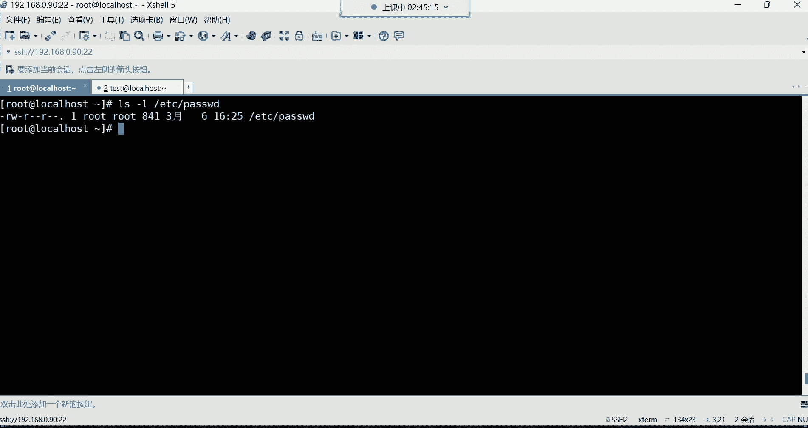

我们讲到哪了，还是阿拉斯ZL命令时候，你发现这阿拉斯这条命令，我们牵扯出了哪些东西啊，文件的类型嗯，归属关系，还有这个一些基本权限啊，以及文件的详细属性，还有前边怎么去辨别目录与文件。

通过颜色去辨别是吧，你发现这一个alex meeting，他真的是啊，光阿拉斯这条命令讲的话呢，扯出的东西就非常多了啊，都是你在入门的时候，你需要知道的一些必备的一些什么的概念好了。

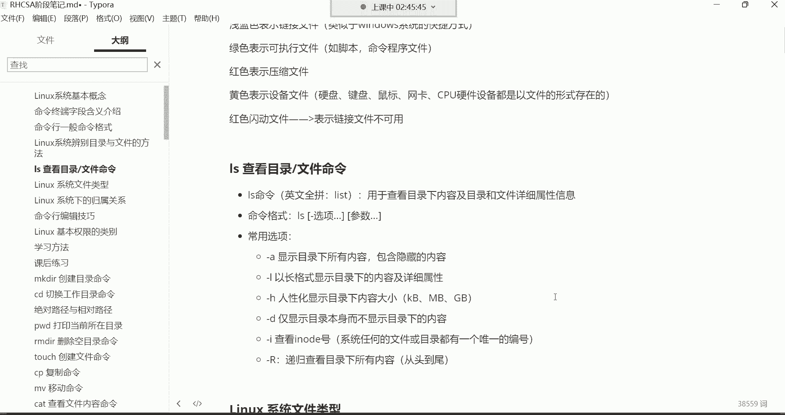

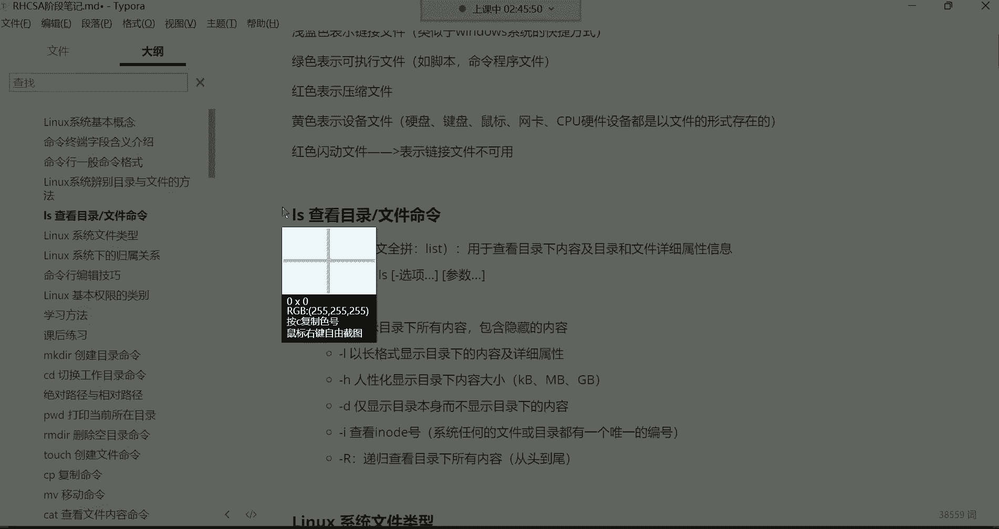

下面我们再来说其他的选项啊，到现在为止这几个选项还没说完呢，那么再来说哪个选项呢，嗯啊现在没，现在没搞懂，没关系哈，你可以下去多听两遍，而且现在也并不是真正去讲这个权限跟属性的，你现在搞不懂也没关系。

你可以把这个疑问呢先给他留下来，好那下面我们再来说这个嗯杠H这个选项呃，杠H这个选项讲过了是吧，就是人性化的显示目录下的内容大小，那这个呢前面就是，比如说你看看这个文件的时候。

以自己以这种字节为单位来显示大小啊，这个文件还不是很典型啊，ALEX杠etc下边有个service啊，VICES这个文件的大小，你看好几10万个字节，这时候呢不是很人性化，没错吧，咱们就这样。

IOS是吧，短选项合并了杠LHH，就是给我以K兆G的方式显示它的大小，然后再跟上什么呢，跟上这个文件的名字诶，回车没错吧，那这时候呢就是以K招记的方式给我显示了，但是刚刚你们有没有发现一个小细节。

这个文件名字怎么自己突然间就冒出来了呢，你看看我现在IOS杠H空格，你看诶怎么突然间冒，怎么就突然间冒出来了呢，哎看到了吗，这不是tab键哈，这可不是tab键，这可不是听不见，诶怎么出来的呢，看到了吗。

怎么出来的呢。

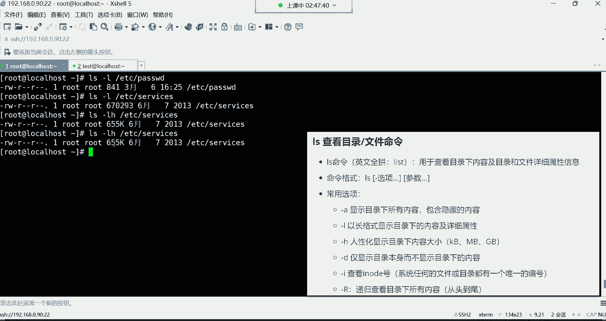

你这里面啊有一个什么呢，叫命令行的编辑技巧，其中这个里边一个快捷操作叫什么，叫ESC跟点结合着使用，是将上一条命令的参数，变成当前命令的执行对象啊，这句话再读一遍。

将上一条命令的参数变成当前命令的执行对象。

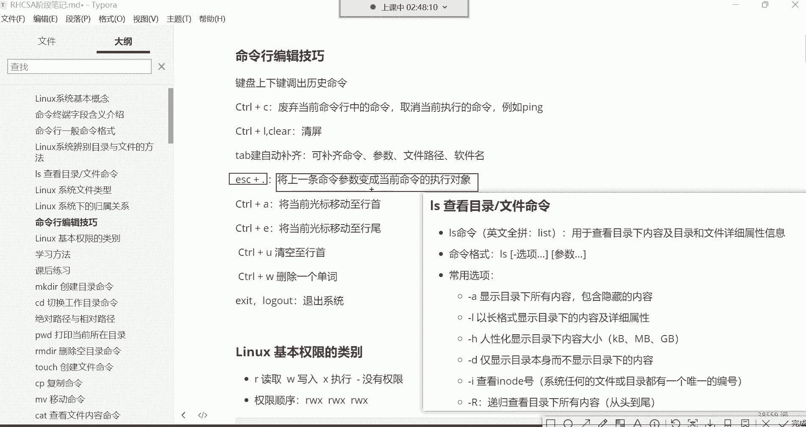

我的上一条windows的参数是谁啊，是这个路径下的这个文件，没错吧啊这我上一条命令的参数啊，是这个文件，那我下边我还想针对于这个文件做一些具体的，其他的操作的话，你比如我这样L4是吧。

杠LH那这时候呢我还需要调用这个文件，那怎么办呢，那这时候空格隔开，唉，注意哈，按住ESC的时候再按一下点，看到了吗，你发现就直接干嘛呀，直接把你曾经就你上一条命令干嘛呀。

就执行的这个对象直接就拿过来了，干嘛变成我当前这个命令的什么呢，这个执行对象了，这叫什么呀，这叫懒人操作啊，在我们这个行业里面，这叫懒人行，为，什么叫懒人行为呢，就是我他妈的不想省事儿一点儿。

我想方便一点，这不就懒人行为吗，是不是，所以这样就可以了哈。

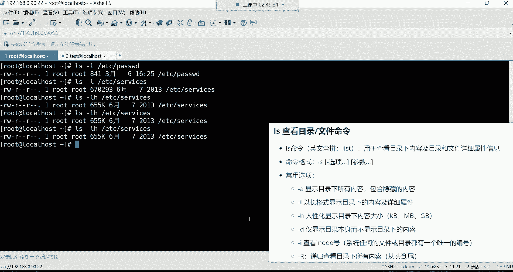

所以这个就是我后期也会经常去使用这些，快捷操作的，所以呢你们也干嘛也养成这种习惯啊，就是养成习惯以后呢，你会发现它会提升你的工作的，或者说学习的一个什么一个具体的效率。

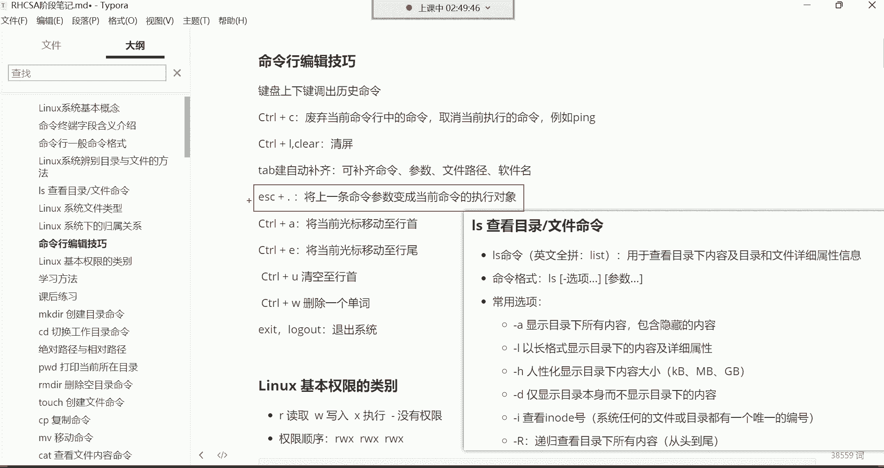

而且准确度也非常高，准确度非常高，你想你如果上边你你的这条命令，而针对这个参数执行成功了，你下面在调用的时候，是不是原封不动拿过来了呀，是不是原封不动拿过来，比你手敲它的准确率要高得多吧。

你手敲还有可能敲错呢，是不是啊，懒人行为，好那这就是杠H这个选项啊，杠H呢就是以这种K照记的方式，来显示了这个文件或目录的大小了，O嗯效率行为啊，那下面还有一个选项叫杠D啊，仅显示目录本身。

而不显示目录下的内容啊，这个杠D选项是针对于目录的，针对目录哈，什么意思呢，比如现在我想干嘛，我想杠LH，我想看etc这个目录，这个目录往外看看它本身的一些详细属性啊，不需要加H啊，就看到详细属性回车。

但是你发现它不太一样，它怎么回事呢，它是量子的，你看他是把这个etc这个目录下边。

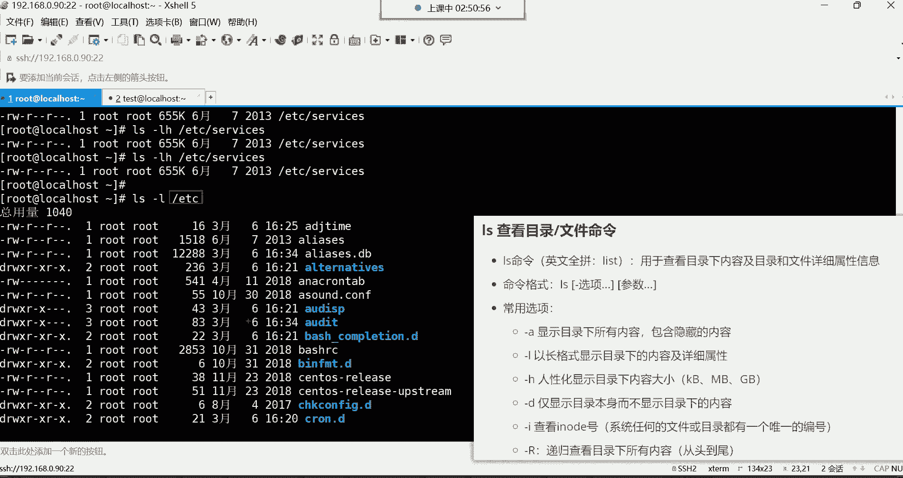

注意哈，是etc这个目录的下边唉，每一个子目录，包括它的呃子文件，它们的详细属性给我显示出来了，但是我想看的是谁呀，是etc目录本身，我想看的是这个目录本身，就它的本身的详细属性。

而我不想看的是它下边的这些什么呢，啊一些子文件或者子目录的详细信息，这怎么办呢，那这时候杠D这个选项。

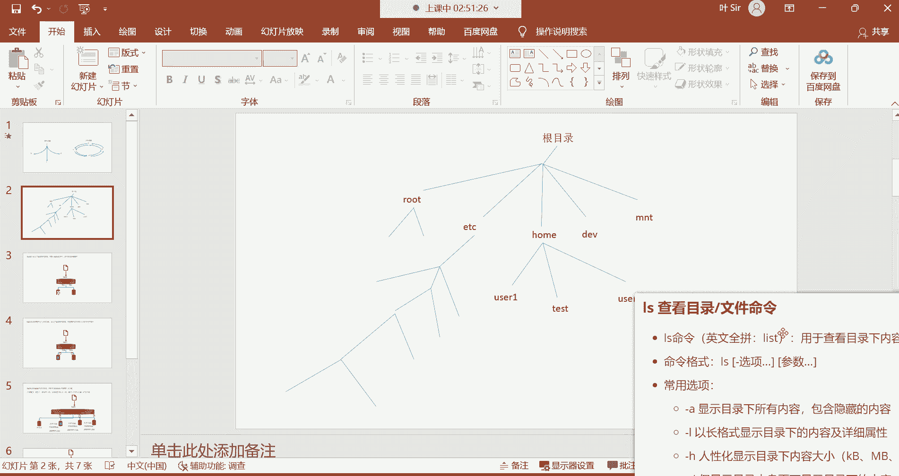

就是只针对于目录去用的，所以这时候我们可以怎么玩呢，啊阿拉S空格杠D，然后呢把etc给它调过来，那这时候你看杠D就是仅显示目录本身，而不显示目录下的内容了，哎ENC加点，把这个etc目录啊给它调取过来。

回车看到了吗，是不是就把etc目录本身显示出来了呀，而目录里的内容呢并没有给你显示吧，这不就是调用目录本身吗，但是你又感觉很奇怪，怎么奇怪呢，诶我调用它的本身，我想看它的详细属性是吧。

所以这时候你就得干嘛呀啊，再结合杠L把它的详细属性给你列出来，那你看这个短选项就必须得合并到一起去了，所以S干嘛，杠D空格ES加点，把etc目录等会ESC加点啊，把ESC目录给它们给它调取过来。

然后CTRL切个屏回车，这时候呢他就干嘛了，他就把这个目录的本身的详细属性，给我们列出来了，看到了吧，而而并不是这个目录下边的数据的详细属性，所以是杠D这个选项，OK然后后期你想看哪个目录。

你比如我想看那根目录，你比如我想看看不同的目录的详细属性，那是杠ID空格，那我再给大家强调一下，这个选项没有左右的顺序要求，比如把D放左边放右边可以吗，可以看跟下的，比如说看这个病它本身的详细属性。

回车看到了吧，这个B是个目录，然后但是它是一个什么呢，是一个链接过的目录，所以它的属性是L开头的，L开头代表是链接，而真正对应的那个原目录是在系统的这个位置，USB下边，OK然后我还想看别的。

那你就ALANALEX杠ID，比如我要看根下的不同目录回车啊，那是显示boot目录的详细属性了，而且是它的本身的详细属性，看了吗，啊这啊这个D这个选项呢，到时候你们可以自己多练一练哈。

每个选项都可以自己多练练，对于LLSZT命令随便玩，在这个系统里面，你想看什么随便练，为什么呀，这种查看的命令，不会对我们这个系统造成任何的什么呢，任何的威胁，它又不它又不像是什么删除。

又不像是什么修改，所以说这条命令随便玩，敲错也没关系啊，只要是你能够想象得到的，你都可以用它去什么呢去做练习，OK然后再来这个杠，I这个选项叫查看i know的号，这个i note号是干什么用的呢。

你看系统，任何的文件或目录都有一个唯一的编号，这个编号我们称之为叫i note号，我们这样吧哈来先演示一下IOS空格杠I回车，你看它现在显示的就是，我们当前的家目录下边的数据是吧，然后呢。

他把我加目录下边的每个文件前边，都给我们显示出了一串数字，你看看是不是你看这一串数字吧，啊在这一串数字，这也一样一串数字，然后我们说一说，这个数字，其实就是这个文件在我系统当中的一个，唯一的编号。

这个编号就有点像我们人的身份证号一样，身份证号，你看咱们说人嘛，呃可能说有很多人同名啊，比如你叫张三，那可能说也有人也有很多人叫张三这个名字啊，李四也一样啊，都有很多人叫李四，老王也一样是吧，同名了。

但是你说同名归同名，怎么辨别这个每个人的身份他是不同的呀，或者怎么去区分他们的唯一性啊，那看身份证号没错吧，所以说这个系统里的文件也一样，每个文件他的唯一的身份的标识，就是叫i know的号。

i do的号啊，系统任何文件目录都有一个唯一的编号啊，就是这个IDO的，那对于我们来讲呢，我们很少会通过这个IDO的号去记一个文件的，这就像我们平常生活中，你你会去通过每个人的身份证号，去记住这个人吗。

不可能的是吧，哼你都得通过什么呢，通过对方的名字去记他，谁会去记他的身份证号啊，啊所以对于我们来讲没有什么太大的作用，是系统啊，它在调用某些文件的时候，会通过这个呢通过这个ID号去调用它好。

那下面我们再来说这个这个选项用的不多哈，你们了解就行不多，然后这个杠A这个选项用的也不多，常用的下面这三个是最常用的，对i s t meeting，而且是我们在初级入门阶段最常用的三个选项。

你一定要把这三个选项给它，用数量的别的选项，你可以先作为了解啊，不是必须要掌握的，OK然后当大R这个选项叫递归，查看目录下所有内容，我们先说递归这个词儿啊，对于很多人来讲呢，有些不太理解。

递归递归就是啊很烫，后面我给你们补了一个解释啊，非常通俗的解释叫从头到尾什么意思呢。

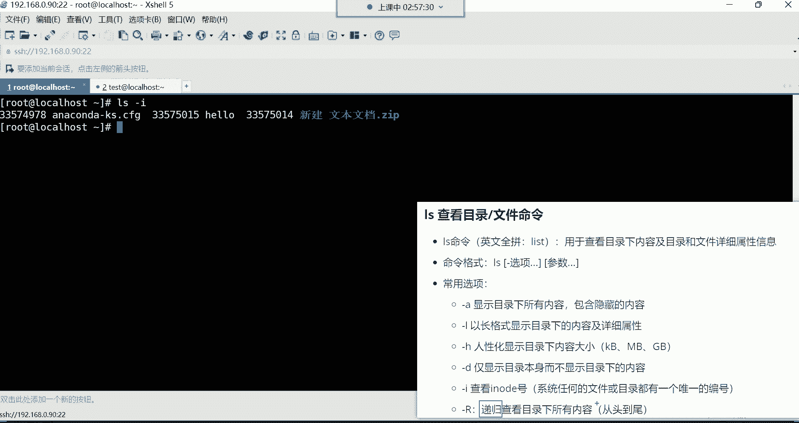

比如说啊我现在想干嘛呀，对于这个etc目录来讲，你说在etc下边有非常多的子目录，是不是，然后可能说在每个子目录下面又有很多的，什么叫子子目录结构非常的复杂啊，层级结构也非常的深，但是我想干嘛。

我想把整个etc目录都给我什么的，都给我从头到尾给我查一个遍啊，给我显示出来，那怎么办呢，这不就等于从头到尾嘛，是不是任何一个目录都不要给我放过，我查看一个遍，那这时候就要递归啊。

就从头到尾一直看到这个etc下面，最后一个目录也给我显示出来，这样才可以，所以杠大二呢他干的事儿就是那个什么呢。

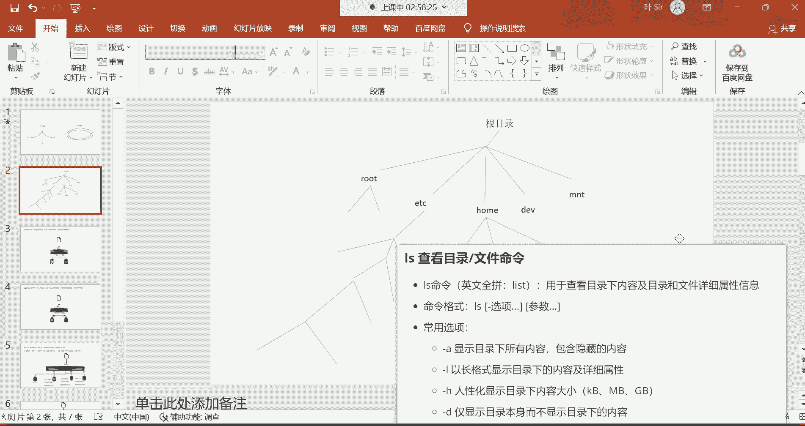

递归查看的事，那现在你看我们ALICE杠大R指定，你看如果不加杠大R，我指定ETC好，你们看看我们往上翻啊，按键盘的滚轮往上滚滚哈，你看这是我刚刚执行的命令，是不是，然后呢。

这下边的是etc目录里的内容，但是我跟你讲，他现在给我打开的是etc这一层目录下面的内容，在etc这一层目录下边啊，可以看到有很多的子目录，是不是蓝色的，是子目录，但是你有没有想象过。

那在这个子目录里边有没有可能存在，有没有还可能存在什么呢，子子目录，或者说在他的子子目录里面，有没有可能还存在什么子子子子子目录啊，有没有可能，所以这时候你全都给我打开，那就阿拉斯在这哈。

S杠大R指定etc，然后回车啊，这时候你再往上翻吧，你已经你已经翻不到头了，因为etc目录的这个层级结构非常的深，哈哈非常深，再往上翻，啊你看我右边这个滚轮的位置，我已经翻不上去了，看到了翻不上去了。

因为etc目录内容非常多，那包括每个子目录它都给你列出来了，所以这就叫做递归的意思啊，叫递归，那这种递归就不适合去看什么呢，不适合去看层级结构太复杂的目录啊，只适合看一些层级结构比较简单的啊。

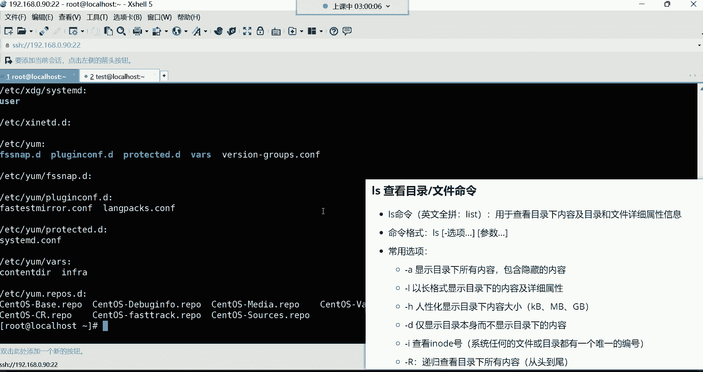

比如说啊有有一个目录啊，咱们就拿这个后面目录来说，哎，后门目录的层级结构不是很复杂，这时候呢啊你可以看一看啊。

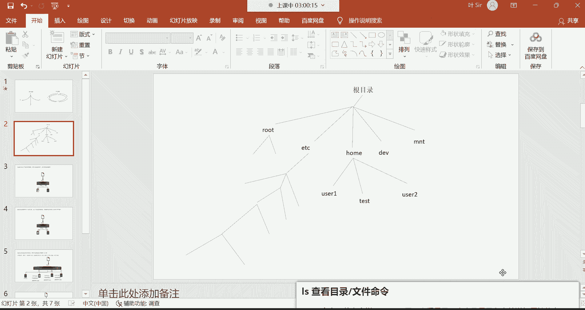

把整整个目录都给我打开，那这时候就来杠大R看根下的home目录，那这时候呢他就把home目录，从头到尾的给你打开了，看这是home目录是吧，根下的home最左侧那根斜线那边是根啊。

根下的home在home里面有个test目录，是不是啊，然后呢你看下面这个层级结构，就是根下的home下的test目录也给你列出来了，那这不就是把整个home目录都给你什么呢，从头到尾给你翻了个遍吗。

但是它层级结构呢就是比较什么比较简单，所以说呢我们看起来也比较清晰一些啊，可以用杠大二去看一看啊，这是阿拉斯这条命令的。

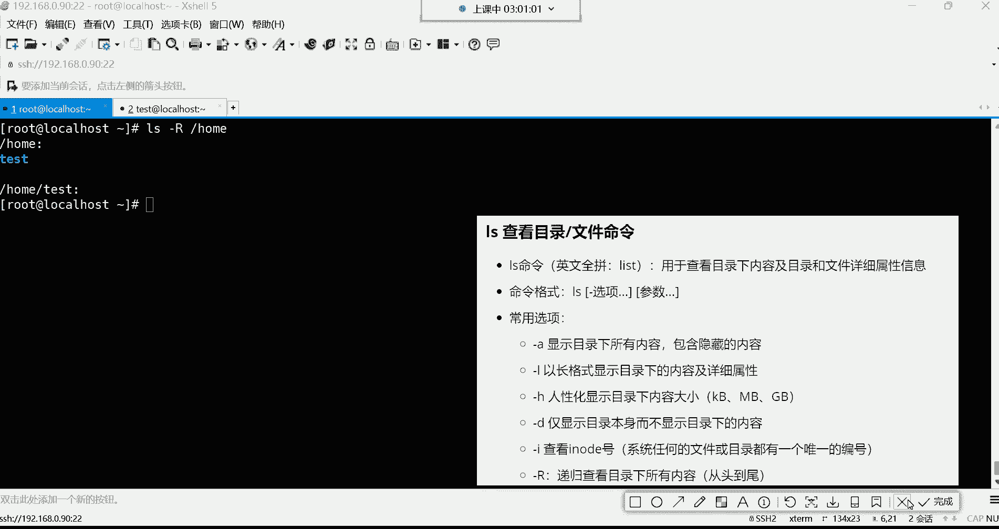

刚开始大家在入门的时候，我们需要掌握的一些什么呢，一些选项呃，大家需要必须要掌握的是，这三个选项是最常用的选项，而我并没有跟你们框起来的呢，大家就是你知道一下它有这个功能，阿拉斯这个命令具备这个功能啊。

作为了解就行，因为对于阿拉斯C命令，它的功能非常强大，而且它的选项常用的选项也不止这几个，好几十个选项，注意啊，是一条命令拥有好几十个选项，那这好几十个选项，如果你一股脑的都去学一个边的话。

你发现其实你根本就记不住的，而且大多数选项是你用不到的选项能列吧啊，所以。

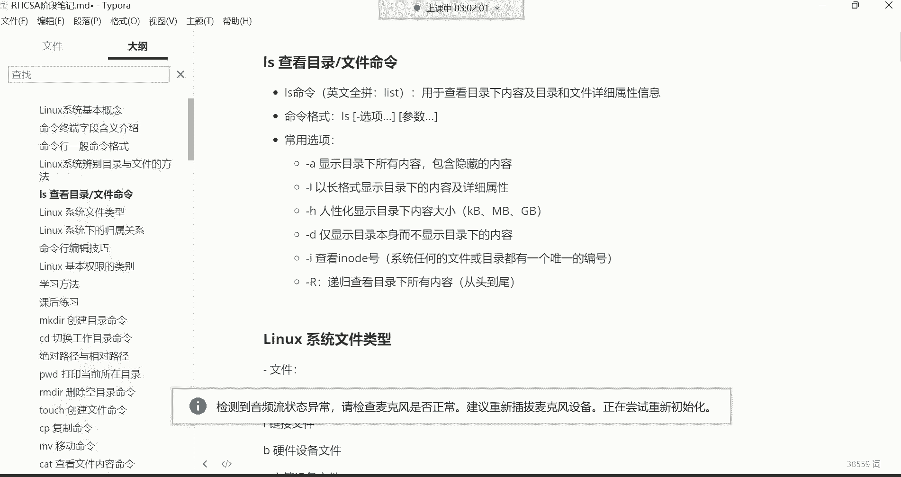

刚刚卡了一下是吧，所以呢大家在这个入门阶段。

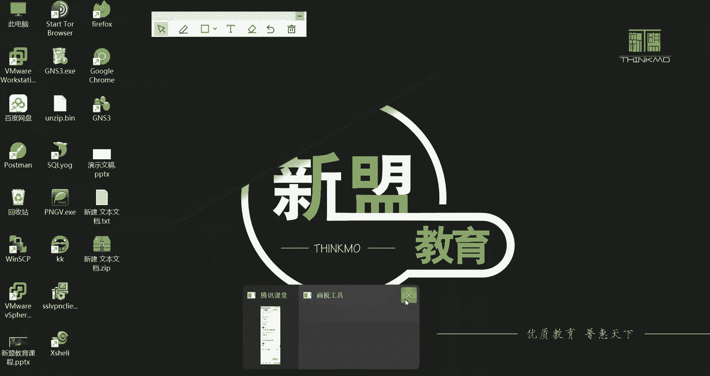

你掌握就掌握一些什么呢，就掌握一些这个我们必须啊，或者说这个经常用到的选项就可以了啊，就这仨吧，把这仨玩明白了，你就可以了就可以了哈，能够满足我们这个基础阶段的一些什么呢，一些需求。

然后后期呢随着不断的学习啊，如果真的是遇到一些特殊的场景了，咱们再去讲阿拉斯命令，怎么去怎么说呢啊或者说相关的选项啊，那时候再去学用到哪儿讲到哪儿好，阿拉斯命令，那你看我们这一股脑儿一直讲到哪儿了。

一直几乎啊这都完事了，是不是，然后命令行编辑技巧的话呢，咱们稍后再讲好吧，稍后再讲。

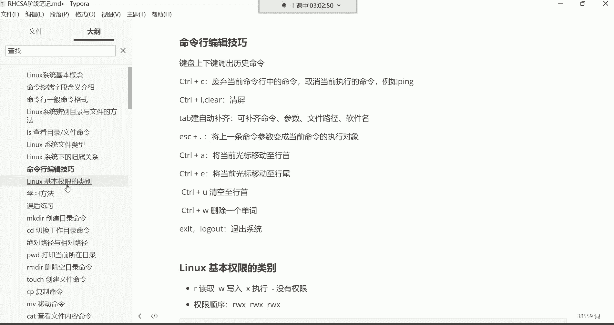

然后呢休息一下吧，一个小时了是吧。