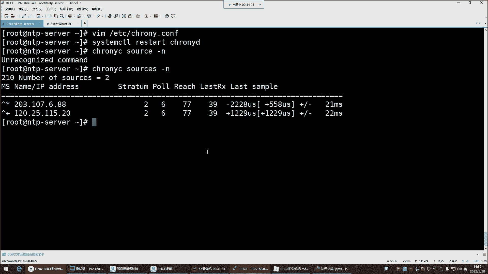
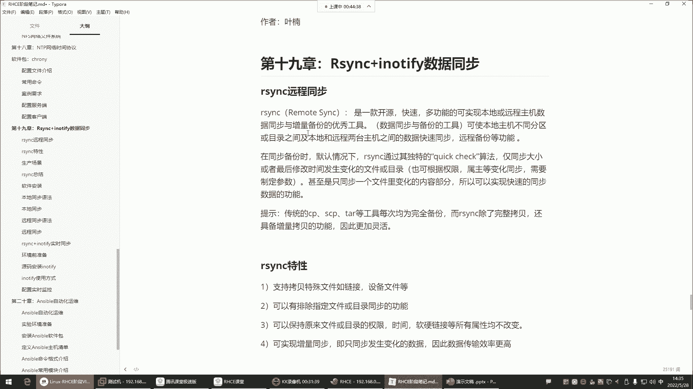

# 【小白入门 通俗易懂】全网最全RHCSA+RHCE教程，一周快速进阶Linux运维 - P60：红帽RHCE-23.NTP时间同步 - 网工小程立志不加班 - BV1PN4y1R7uU

喂喂喂，好录屏也OK，那接下来咱们就正式开始发车了，我们今天呢是HC，我准备要给它结束的一天，那我们今天这节课呢讲的内容呢，可以说是也是这个非常的多啊，而且呢也是大家今后在工作中。

你是必须会用到的一些内容的，所以这个大家好好听哈，这节课前面的一些基础命令，那个的话呢慢慢敲慢慢练，这个位置呢就是你到工作里面，你可能会接触那什么呢，就是这个NTP网络时间协议这个NTP啊。

也是今后大家在学习这个集群管理的时候，你们也会什么呢，也会接触的这个NTP他是干什么的呢，看看NTP嗯，等一下哈，好来看NTPNTP呢我们直接说中文哈，叫做网络的时间协议，那这个网络时间协议。

它是实现一个叫做时间同步的呃，我们说说为什么要做这种时间同步哈，因为下面这个东西太官方了，我们呢就不去啰嗦的了哈，这种东西有点不太好理解，咱们就说说，为什么要用NTP去做这种时间同步。

还有这个时间同步给谁去同步好。

那现在企业环境是什么环境呢，叫做集群环境。

那在企业的集群环境下边，我现在有一群机器，这一群服务器啊是提供什么呢，提供我们公司的一个网站的啊，有这一群几十台上百台，右边这群服务器呢是提供数据库业务的好，也是几十台上百台，那我们现在来看一下。

那这么一群服务器，你如果想要让他能够在一起协同工作啊，集群集群就是一群机器组成的群体，然后呢同时去对外提供你们公司的网站，这个服务好，那这一群机器你想让他能够协同的工作，一起去干活，那前提是什么呢。

就是得保证每个机器的时间他们得是一样的，你不能说我这个机器的时间活在2018年，这个机器的时间活在2019年，这个机器的时间活在2022年，那你说他们每台机器他都不活在同一个时间段，他们怎么干活啊。

是不是啊，哎就没有办法去同时的去协同工作了，所以我们要干嘛呢，保证每个服务器的时间，都得是一个叫做标准的时间，那我们怎么样才能让它保证是在标准的时间内，能啊，或者说处于一个标准时间呢。

那最好的方法不是我们手动的去给它。

通过data命令去配时间，能理解吗，你手动配的时间是不准确的好。

那这个NTP就可以帮我们实现实现，什么叫做时间的自动同步，这个自动同步哈，这个自动同步就是我们去找一个服务器，这个服务器呢就是NTP的服务器，就是这个服务器里边有一个NTP这么一个服务。

然后这个服务呢它可以让你去同步时间，或者说他给你提供一个标准的时间，那这个就比较好理解了，INTP它本身是给你提供一个标准的时间，然后呢我们干嘛呀，哎我们让我们自己的服务器啊，去跟这个服务器去同步。

就是你的这个NTP给我提供什么样的时间，那我的服务器就处于一个什么样的时间，这个比较好理解了吧，诶那就是说只要是说我的美的，我的每台机器的时间都去跟你去同步的话，那这样的好处，是不是每台服务器。

它们的时间就都保持一致了呀，那这样的话，他们是不是就都活在同一个时间点了呀，就可以去同时去协同工作了，而且像这种好处是什么呢，像这种的好处就是NTP这个服务器，它的时间是非常非常准确的。

它准确到什么地步呢，据说哈好几百年都不会差一秒的，就准确到这种地步，所以说我们在企业里边跟他去同步时间哎，比你手动配的要强好，那接下来呢咱们就说说NTP，我们怎么去同步别人的时间呢。

还有说这个NTP服务器都有哪些呢，可以让我们同步呢，啊这个非常多，有这个阿里的，有渗透8S的，有清华大学的，有中科大的，有腾讯的，有网易的，哎就是都给你提供这种NTP服务器，就看你喜欢同步谁了啊。

就这个，但是呢那就别雨露均沾，用一家就行了，那接下来我们说说在我们这个渗透S里边，跟red hat里边，我们可以使用哪个NTP呢，叫称之running，是一个网络时间协议的NTP实现方式。

就是说我想通过NTP这个协议，NTP本身是个协议哈，是一个时间同步的协议，我想使用这个协议去跟别人同步时间，那首先你得去安装一个软件，这个软件呢它就是基于NTP这个协议，去帮你去同步时间的。

所以说趁着running这个软件是一个开源的自由软件，在real7，sent s7操作系统里面是默认安装的服务，那注意它默认安装的话，你就不用手动去再额外安装了，那它能保持系统的时间与NTP时间。

服务器的时间是一致的，让你的时间保持同步，那我们看一下我们系统里面有没有这么个东西。

把这个拿过来，杠Q撑着running，我这里面怎么没有这个包呢，杠QA管道GRP称之running诶，没有安啊，没有安哈，由于我们这个系统啊，为什么没有安呢，是因为我们是最小化安装的，那最小化安装。

那没有办法，那我们就自己手动安一下吧，啊但是我这个主机名改一下哈，这个主机名不能让它叫FTP server了，我们让它叫什么呢，让他叫这个NTP server，NTP server杠，好回车，然后退出。

重新登录一下X，重新连接NTPCONSERVER是吧，好那这个NTP杠server小写的是吧，行小写就小写吧，我我们改的时候是大写的是吧，我改的是大写的，然后他这个没支持那些啊，得加选项才可以哈算了。

就这样吧，就NTP server好，那现在呢我要安装这个包了，YM杠y int，然后趁着RIN回车，CE讲完，后边是其他老师代，然后到第三阶段是其他老师带哈，然后到什么时候呢，到这个第四阶段。

那就又是我了，挂载一下这个镜像掉了哈，Dmt，然后再按一下，啊对大体是四个阶段，就是那个第四个阶段里面有4567，4567哈，但是这个整体就是第四大阶段里面，包含几个小阶段，好，那接下来我们就来看看啊。

包装好以后呢，我们对它的服务名叫趁着running后面有个D，那把它服务起来，Start，趁着running d回车起来以后呢，看到的状态，好RUA了吧，运行了，那接下来呢我们这个对于这个服务来讲。

我告诉你哈，你只要是把它一安装，它就自动帮你同步时间去了，就是你不需要对它做一些额外的配置，这玩意就这么简单啊，就简单到你把这个软件包安装，它就帮你同步时间那种，我怎么知道呢。

我们先看我们当前时间是一个标准时间吧，14：12：06是吧，这个是时区，这个cs t代表是中国的标准时区，还有一个还有叫还有一个是什么那个东八区，东八区的话呢，那个叫什么，我忘了哈。

啊你去搜一下叫cs t时区时区，好看一下哈，这个。

我们这是cs啊。

cs啊，可视为美国，澳大利亚，古巴或中国的标准时间，然后呢我们中国的话呢用的也是这个CST，那还有一个叫UTC，还还有一个时区叫什么，我给忘了哈，那个一因为我们用不到，那是国外的格林威治的时区。

一个cs，还有一个嗯什么CD题，看到了吗，还有什么这个CD题，这都是不同的时区哈，所以一般呢我们中国就是CST这个大家知道就行，那接下来呢我们这个主要说什么呢，主要是说他的这个配置文件。

我们先不打开我啊，我们先不打开它的配文件，我们先干嘛呢，我们先把时间给它改一改，怎么改呢，就是现在这个时间是14：12分是吧，现在是时间比较准确的，我改一下D杠S，我把年月日小时分钟秒都改掉了。

我给它改成2021年，然后杠零六杠6月25号，然后小啊这个小时分钟秒，比如说改成十八十，然后0000秒回车，那你看现在这个时间是不是改了呀，2021年了，你发现这个是不是跟我们当前的时间。

已经是不准确了呀，好那接下来哈哈，接下来你再敲D，再敲data data，Data，他他需要个时间哈，怎么还没过来呢，还没过来，没关系，我重启下服务，重启谁呢，那个chrunning raise a。

趁着装点回车，加个D回车好，这时候再敲data回车，等一会儿，哎看这来看哈，你发现这时间是这时间啊，它怎么自动又回来了呢，我们刚刚是不是自己改的，改成2021年了呀，但你看现在他自己又回来了。

他为什么自己回来了呢，他为什么呢，是因为他发现你当前的时间，跟那个NTP服务器的时间不一致啊，所以他帮你同步了一下，同步成一个当前的标准时间了，那你说现在这个问题就是哎，你说我们现在这种时间。

哎哟你说我这个改的这个时间，就是他给你改的时间跟谁同步的呢，这你要看它的配准件，Etc，甚至run点com，这是他的主配文件，打开文件以后呢，这个文件呢看一下他这有一些解释。

叫polo polo的公共服务器，看到了吗，他说使用polo点net点RG项目中的公共服务器，那这个项目中的公共服务器都有哪些呢，哎是渗透S的，看到了吗，这一个server就是一台服务器。

这个服务器就是它的NTP服务器，那这个文件它是给你啊，他是给你那给你指定了几台NTP服务器呢，他是给你指定了四台123啊，然后呢这是NTP服务器的主机名，这是主机名哈。

然后呢他就帮我去跟这四台服务器去同步时间，那他同步时间的时候就是从上到下，先找第一台服务器，如果第一台服务器他发现连不上去，或者没有给他一个时间，那这时候他就再找第二台服务器，然后以此类推。

只要跟哪个服务器能够同步到时间，它以后就一直跟这个服务器去同步时间了，能理解吧，这就是它自动就帮你去同步了，这是不是没有什么太多可配的呀，也不需要，那对于我们来讲，我们需要对这个NTP我们需要搞什么呢。

就是这个你要知道这服务器在国外，他跟渗透S去同步时间。

那渗透S服务器放在国外是不是太远了呀，所以我们一般干嘛呢，我们一般把这个时间给它改成我们国内的，阿里的，改成阿里的，那阿里的NTP地址在哪呢，阿里的NTP地址，阿里的NTP服务器的地址。

嗯哎我这笔记里面还放了呀，阿里的不，他是他不是说只同步一次哈，他隔一会儿就给你同步一次，隔一会儿就给你同步一次，诶，阿里的呢，阿里的，这阿里到哪儿去了，这儿呢哈找了半天，改成微软的不行吗。

微软的不也在国外吗，阿里的不在国内吗，所以来看这哈，就是我们可以干嘛呢，我们可以把这个地址给它换成阿里的，阿里的，大家来看一下哈，NTP点，阿里云点com，NTP一点，阿里云点com。

这是阿里给我们提供的NTP服务器。

这个呢就是在国内，你在国内的话，你想想跟在国外说不一样，所以这几个给他注释一下，注释一下，在这儿在这儿加一个井号，井号井号井号不是你不是你，你不是没见别人的电脑时间不准确，是如果你在企业的集群环境下。

你这个时间不同步，它就会出现时间不准确的问题，这不是给我们个人电脑同步哈，这是给服务器同步，你知道每个服务器，它的时间都保持一个一致的状态，这样的话就不会有任何问题，因为有的时候如果时间不一致。

你这个服务啊它会受到影响好，那接下来我们就保存退出，那现在是不是给它改成阿里的了呀，那重启一下服瑞斯塔，它的服务叫，称之running d，好重启了，那重启以后，我怎么知道他是跟阿里的服务器。

去同步时间了呢，来哈看这条命令叫chrunning source杠N。

回车，这称之running control，加个C，这是他给你提供的管理命令，这命令好久不用了，来看一下哈，就是我怎么知道他真的是跟阿里的同步的呢，你看它这里边哈有一些什么呢。

有一些这个什么星啊之类的，这个我们怎么看呢，上面，在这儿这哈。

你看哈在S那个字符的下边，S字符下边是不是有个星啊，好，这个星就代表说，他现在是正在跟这个服务器去同步的时间，那这个服务器你就得看看他是不是阿里的了。

星表示陈志庄，你当前同步的圆啊，加号表示可以接受的来源，就是我也可以接受谁呢。

哎我也可以接啊，当然没有加号了是吧，如果有的话，他就用加号来告诉你了，好那我怎么知道这个地址它真的是阿里的呢，那你就得自己去解析了，你拼拼谁呢，拼刚刚我们那个地址，就是你在文件里面配了两个。

一个是NTP点阿里云点com是吧，好那这个地址是谁呢，这个地址是第一个，是不是你看这个名字对应的，是不是是不是这个地址，那这地址是第一个哈，那第一个看来他没有同步，没有同步成功，好，那我们就看第二个。

那是NTP1。20点com，哎看对上了吧，是不是你看NTP1。200点com是这个地址，120的这个唉，这就是他现在就跟阿里云这个服务器，在同步时间了，哎那这玩意就比较简单，其实这东西没有什么可讲的。

你就知道你在企业的集群环境下，每台机器都要去配这种时间同步，如果你要是嫌麻烦的话啊，如果你嫌麻烦的话，你就不用改阿里云的，就跟那个cs，就那个默认的文件里面给的服务器去同步，也没毛病没毛病哈。

怎么看是阿里的呢，我这不这不刚刚不跟你拼了吗，这不刚给你拼完吗，这不拼着挨批了吗，我拼的是这个域名，是不是我拼的域名的域名不就对应的是IP吗，你们怎么不听课呢，我刚说完还还没过五秒钟呢，就给忘了。

这不是域名吗，我现在不是拼的这个域名吗，阿里NTP一点，阿里有点看，不然后这个星，不就代表说他正当前正在同步的服务器地址吗，这个地址跟这个地址是不是不是一模一样的呀，嗯是不是一模一样的呀。

那这个地址对应的域名是谁啊，是不是这域名啊啊是吧，是不是啊，看哈域名对应的IP你就知道啊，现在是跟这个NTP1。20点com在同步了，那接下来，啊你只看到了地址部署，应该啊对，如果你如果你不。

如果你不知道他现在跟哪个服务器在同步时间，你就拼一下，拼那个域名就行了，你拼这个IP的话，一般不一定能拼通，也能拼通，但是你PIP的话，他不告诉你名，或者你自己解析一下。

post nt p n TP一点，阿里云点com，我这里面还没有host命令，安个包哈，host一下NTP，一一点，阿里云点com，没有找到，啊是NTP看了吗，就是你解析一下不就行了吗。

他告诉你这个域名对应的地址，这不就是120。25。115点啥吗，是不是你，乘着run c，你看你解析完以后，是不是你是解析的这个域名啊，这个域名是不是对应的这个IP啊。

那这个IP是不是你当前正在同步的那个IP，啊对这些命令前面是不是给你们讲过呀。

这个你们都估计忘了，这种命令用的不多也可以理解哈，用的不多呢就估计就忘了好，那这是是不是比较简单，这玩意儿你就直接把一个什么呢，把一个地址给他，换成你想同步的那个服务器不就行了吗，那现在有个小需求啊。

这个需求呢就是这个有人说的，那如果我服务器在内网怎么办呢，是不是在内网公司需要你搞一个NTP服务器，给你企业的集群去同步，那这时候怎么办呢，你一可以选择自己搭建，自己搭建的比较麻烦。

所以呢我们有一个非常好的一种方案，什么呢，就是你找一台服务器去同步阿里云的时间，能理解吧，你找一个服务器去同把阿里云的，然后呢，你让其他的服务器同步你这台服务器的时间，确保身体一致就行了。

当阿里云不可用时，使用本地时间，这个其实不需要阿里云，没有不可用的时候，所以你这个我们就等于说在这个图里面，怎么玩呢，这是阿里的时间服务器，阿里云的NT好，那由于呢我这个企业内部的服务器啊。

他没有办法去跟阿里云同步，是不是啊，那你也别同步了，别跟别跟他直接同步了，干嘛呢，我们自己搞一个服务器，这个服务器呢是我企业内部的NTP服务器，那这个NTP服务器干嘛呢，就让它能联网就行了。

其他服务器不用联网哈，就他能联网，然后接下来呢让他去跟阿里云去同步时间去，那它跟阿里云同步时间，那它的时间是不是就阿里云的时间呢，那接下来呢，那这个服务器是不是可以让你企业内部，其他的机器来跟我通过啊。

那这个方法是不是就非常好了，你也不用自己去搭建了，哼哼啊，所以这种方法还是比较好用的哈，比较好用，所以我们接下来就来给大家演示，咱们怎么这么玩，那接下来呢就等于说我们自己搭个桥，让这个桥呢给我缺什么呢。

间接性的去同步时间，啊内网跟外网服务器之间怎么同步呢，你这个服务器它得能连外网哈，你得你必须得有一台服务器能够连到外网去，然后呢呃那这个服务器可以是谁呢，这服务器可以是你们公司的负载均衡。

你们公司的就你在负载均衡之上，你搞一个什么呢，搞一个NTP就安装这个。

就安装一个这个软件就行了，然后呢，接下来呢，让你们公司的所有服务器，都指向负载均衡就可以了，负载均衡肯定是跟外面是通的，然后接下来呢我们再搞一台机器，谁呢，就是这个13，好我们就拿这机器放大一点。

我们要我们现在就假设，这个机器是我企业内部的机器，那它叫host host多少呢，Host13，啊这是企业内部的机器，那企业内部的机器呢，它的时间现在跟谁同步呢，跟我企业的NTP这个服务器同步。

那我企业内部这个NTP服务器，它现在是不是已经跟阿里云同步了呀，啊那我们现在啊怎么改呢。

就这样，我们要在服务端的配置文件里面去添加一个叫，allow allow0点，0。0。0，叫允许所有网站的客户端进行时间同步，跟谁同步的，跟我同步。

etc称之running点com在里边啊，我看它有没有allow哈，默认，这儿呢看到了吗，配置软件里面是不是就有啊，多少行呢，29行左右，注释一删，把这个IP地址都给它改成什么呢，四个零就0。0。0。

0，这是什么意思呢，给大家说说啊，就是说你改成四个零以后。

你的这个机器就是一台什么呢，你企业内部的它这个它NTP服务器了，然后呢我那个改成四个零，就是任何网站的服务器，都可以来跟我同步时间啊，我允许如果他们跟我同步时间，所以这四个零的P那保存退出就可以了啊。

其他的话呢不用改哈，不用改这个什么NTP服务器不可用时，采用本地时间去作为同步标准，就这一步你不用做，为什么呢，因为NTP服务器没有不可用的时候，你放心吧，好几百年也没停机过一次好。

那接下来呢啊这一步呢就不用做，就添加这一行就行了哈，注意添加就这一行。

然后接下来你就重启啊，Chen running，好重启以后呢，我们这个机器现在要安装成熟，装进这个机器是谁呢。

就是我们企业内部的这些哈哈内部服务器了，内部服务器跟你企业的这个NTP服务器，是可以通信的，那接下来呢我们就对他来讲。

要安装称重软件，这个包啊，这个机器有这个机器，有的话，我们就直接改他的文件etc，趁着running点康复，然后在这里边干嘛呀，把这注释掉，注意哈，默认他是不是去找cs的NTP去同步啊。

那他在内网是不是找不到啊，所以接下来，注释掉，注释掉以后干嘛自己写一个复制这格式，在这写一个，那这个写的时候地址要改谁呢，是不是你跟谁同步就给谁地址啊，哎改成192。168。0。40，唉。

我去跟这个机器去同步时间去，他是我的NTP。

那也就是说在这个图里面，就是我们刚刚那把那个host13，host的13就是我企业内部的机器，然后我这个企业内部机器我跟谁同步时间呢，哎跟我企业内部的这个NTP，192。168。0。40，那0。

40是跟阿里云服务器同步时间，那也就是说他的时间就是阿里云的时间，而我跟他同步，是不是，我也就是间接性的是跟阿里云去同步时间了呀。

唉那接下来在这就保存退出，保存退出，把服务起来，好看状态，但这个要设置成随机自启啊，给大家说一下，在企业里边run了，run以后，趁着你C然后干嘛呢，source一下杠N回车，诶，你看，等会儿啊这个。

这个怎么有点不太对劲呢。

D2点，我看看是不是配错了呀，客户端，是没毛病哈。

没毛病啊，这个地址这个地址怎么变成这个名字了呢，我再打开配置文件看一眼哈，server就把地址1-268，等于0。40，那么这个机器0。40，然后我先看一下，我这边，他是啊，他现在又跟这个同步去了。

又跟203去同步去了，那它跟203同步，那我们呢还是找到同步再重启一下，我觉得刚刚服务可能说是他已经起过了，我应该重启一下，我就直接看吧哈，唉这对了，刚刚那服务是它已经启动了。

然后呢我应该给它重启一下就生效了，这时候就对了，你看这个星，就代表说他当前正在同步的服务器是谁谁呢，192的168。0。40，那四零跟C同步呢，四零跟阿里的这个服务器同步。

那我们就间接性的实现了什么呢，就是企业内部这些机器想同步时间，你随便找个机器，只要这个机器能够访问外网，那就可以什么呢，你就可以去让他去同步外网的时间。

啊NTP写错了吗，我NTP写错了吗，是配置文件吗，配件我可没有手写过哈，Server，好OK嗯，是不是看到效果了。

行，这就是怎么实现一个叫做内部服务器，实现一个时间同步，比较简单吧，好比较简单，这就没有什么太多可讲的了哈啊，接下来我们来看看这个i think啊。

