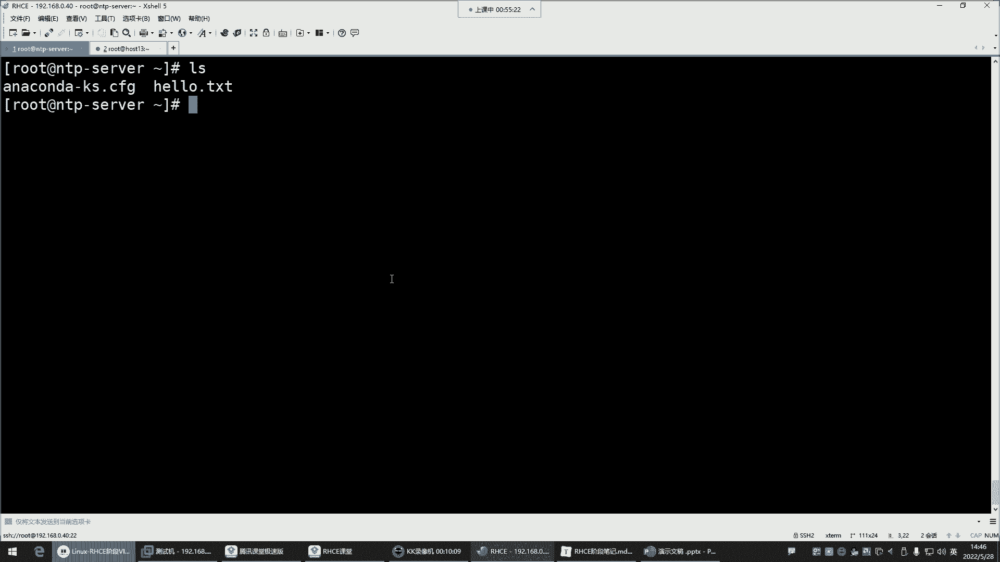
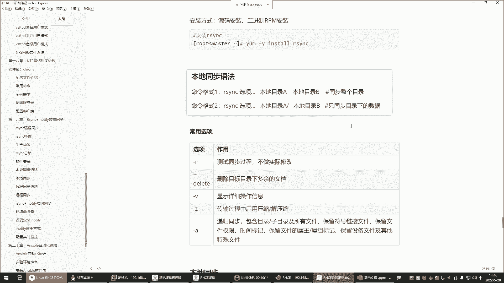
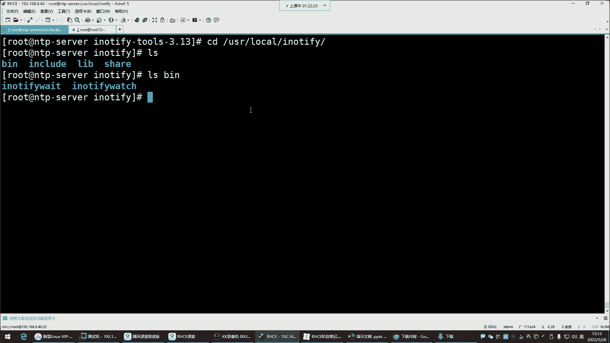

# 【小白入门 通俗易懂】全网最全RHCSA+RHCE教程，一周快速进阶Linux运维 - P61：红帽RHCE-24.Rsync+Inotify数据增量备份 - 网工小程立志不加班 - BV1PN4y1R7uU

那接下来讲什么呢，接下来我们讲这个i think加INNOTIFY叫数据同步，哎，这个都是同步这个数据同步同步什么玩意儿呢，这玩意儿看看这个i think，它可以帮你实现那种数据备份。

他这个备份是怎么备份呢，叫做本地备份，或者说远程备份都可以，这个i think是一个开源的，快速的，多功能的，实现，本地或远程主机的一个数据的同步，与增量备份的优秀工具，注意就是主要应用在数据备份。

跟数据同步这个领域，那这个东西一般什么场景呢，就是比如说企业服务器啊，需要做备份，企业里边呢一般会有那种单独的服务器，搞一个单独服务器什么呢，典型的那个NFSNFS哈，就是上节课给大家讲的NF4。

它不就是一个网络的这种什么呢，叫做附加存储吗，那别人是不是就是NFS服务器，可以把自己的文件夹共享给这个主机，是不是啊，那共享给这个主机的话，那他把他的文件夹给它挂载过来。

就说他们两个之间是一个挂载的关系，他是挂载了NFS的这个什么呢，那个文件夹了到自己的本机了，那到自己本机以后呢，那这个时候我们想做数据备份，那这个数据备份啊，一般我们一般就是可以通过哪种方式呢。

比较典型的，你像常用的命令里边是不是有什么CP啊，是不是踏压缩都可以做备份，对没错唉，这个理解还是对的哈，算增量，但是呢我现在跟你们说说，这个这个CP跟他的他的这个优点与缺点哈，这个优点与缺点是什么呢。

你比如说咱们就拿这一个文件来说啊，这是一个文件，啊这是一个文件啊，那这个文件呢我们比如说第一天的时候，它呢产生了两条数据，产生两条数据好，那接下来呢我对这两条数据呢我做了一个备份。

那这个数据是不是两条啊，好那两条数据我在备份的时候，那这是我的一个备份的，对啊，这是我的一个备份的一个文件，我给它放到哪儿，放到我的这个NTP服务器了，备份过去了，注意啊，我现在是说这两个服务器啊。

我在做备份，那现在呢我这个备份文件一啊，叫备份文件一，备份文件一，那这个一呢里边有两有两个文件，有两条数据，那随着这个文件呢又什么呢，又这个产生数据了，又产生了两条是吧。

好那现在这个文件里边又增加了两条数据，那由于这个考虑的数据安全性呢，我还得对这个文件做备份，那说这时候又对这个文件做了一个拷贝啊，那是备份文件二，第一次的时候是吧。

两条第二条呢第二次的时候呢又多了一些啊，就变成备份文件二了，那这个备份文件二的话呢，里边儿你有你想象一下，是不是有曾经你备份过一次的两条数据啊，而这两条都是新产生的，那你这次第二次备份的时候。

是不是前面这两条就多余了呀，有点多余了是吧，那如果这个文件现在又随着什么呢，又随着服务器的运行，又产生了几条数据了，又产生了两条，然后呢你考虑到数据的安全性，你又给他做备份了，那你在做备份的时候。

那我问你，你第三次的时候，这个备份文件里面这是备份文件三好，那你的第三次备份文件里面，是不是有前两次备份的重复的内容了呀，哎这能理解吗，各位理解的话，给我刷个一，就是你拷贝我CP拷贝我踏压缩。

是不是都是不是都是这种情况啊，你看你第三次备份的时候，就等于说前两次备份文件里有的东西，哎我这个第三次备份是不是都有了呀，那前两次那是不是就有点浪费存储空间了呀，是不是有点浪费了哈。

他就是浪费存储空间了啊，这是传统的拷贝，对重复了，注意这种就是传统的拷贝，传统传统的备份方式，而我们所说的增量备份是什么意思呢，增量备份它不一样，增量备份看看或者说增量同步哎。

这种它是同步的机制帮你备份，我们说什么叫同步哈，就比如说如果你同步的话，我第一天的时候，我这个文件里面有两有两条数据，然后呢我考虑到数据的安全，我把这个文件呢给它备份到这个NFS，这个备份服务器里面的。

那第二天我这个文件又产生了两条数据，又产生了两条，那接下来呢我又对这个文件做了一个备份，那这种同步的话注意如果你用i think，如果你是用i think去做这个数据备份的话。

那你永远不会考虑会有重复的数据，为什么呢，就是你这个文件里面多了两条数据，它会把这两条数据给你干嘛呢，哎给你增加到这个备份文件里面去，诶，那你曾经已经备份过的那个文件，它能够识别得到，唉。

有时候这个好处，就是它永远不会出现重复的内容，能理解吧，啊那我这个文件如果又增加一条数据呢，好你又什么用i think做了一个备份，那i think他也是能够识别到啊，前面的数据都有了，那干嘛呢。

就把这个文件里面新增加的内容给你同步过来，那这样的好处是什么呢，这个好处就是节约存储空间，是不是啊，这就是r sink，那你说这东西是不是比那个CP什么的，要好用的多呀，没错。

这备份过去是说啊这个看情况看情况哈，它有一些选项，就是如果你希望他们之间，一定要保持一模一样的话，那用选项可以实现，但如果你说你在备份的时候，它是允许你备份文件的内容比你的这个什么呢，语言文件要多的。

没关系，能理解吧啊这个没有影响，这可以通过选项控制，好喂喂喂，好了是吧，好了好了啊，这个麦接触不是很好，现在是不是恢复正常了呀，OK继续了，所以说理论的话呢大家了解就行了。

那接下来在生产场景的话怎么用呢，大家可以下去自己去看一看，总之呢你只要是需要这种同步的备份，你就可以用i think ok吧，那接下来呢咱们就下面说说他这玩意儿怎么用，第一呢要安装它的软件包。

它的软件包叫RSYNC，那这个包有没有呢。

如果没有，你自己额外安装一下吧，看一下RPMRPM，然后杠q rs y NC没有没有，就YM杠Y因此套回车安装好了。

安装好了之后呢，那注意啊，它是个工具，这玩意没有服务哈，它就是一个工具，拿过来就用就行了，那它的用法呢，第一命令格式一，看看命令格式应该是同步整个目录，命令格式二是什么意思呢，是指同步目录下的数据好。

那这玩意儿我们现在去准备两个目录哈，我们把这个看看根目录，嗯建个目录吧，Make dr，建一个rs y NC，Test，然后再建一个rs yc什么，把那个test删，把那个test删掉吧。

r s y NC test删掉吧，一个就行了，然后我们现在在自己的家目录，来给大家演示一下，我建几个文件，建一个hello，Hello，点TT好，我的家目录现在有两个文件是吧。

那接下来咱们演示演示他这两种命令格式哈。

大家这个位置哈，注意一下我现在是做什么呢，叫本地同步，注意哈，我现在是在做本地同步，知道什么叫本地同步吗，就是我这一台主机之间的同步，我这单台主机之间的同步哈，并没有跟其他机器在实现同步，那接下来呢。

我要把我root下的这两个文件给它备份，那如果是用命令格式一的话，如果是用命令格式一的话，那这个时候就直接同步整个目录了，整个目录同步过去了，来看rs y NC，然后选项这个选项的话呢都可以用哪些呢。

你可以先测试一下杠N它是不做实际修改的，在一般用不用呢啊，一般也不用哈，第二个选项叫杠杠，delete叫删除目标目录下多余的文档，唉这个就有点狠了哈，他怎么狠呢。

假设如果说我想把我这个root下的这两个文件，给它备份到刚刚的根目录下的那个，备份到根目录，看一下跟下的rs y NC back目录，那如果这个rs vs back目录有文件的话。

如果你加这个杠delete是什么结果呢，就是他会把你目录下多余的，只要是在我的root目录没有的都给你删掉，能理解吧，哎这种可是实现一种什么叫做，保持这两个目录的数据是完全一致的状态了啊。

他不允许你的目标目录有多余的文件，好V显示整个的操作的详细信息，Z传输过程中请用压缩压缩Z的话呢，如果说你在备份的时候，文件内容量比较大的话，可以让他先压缩一下，因为压缩以后是不是就变小了呀。

啊他用G这边的格式把你压缩一下，但是这个过程你看不到哈，非常快，压缩以后呢，再去帮你去进行备份，那这个传输速度是不是就快了呀，啊它也可以自带这种调用压缩格式啊，这个过程看不到压缩与解压缩的过程。

你看不到的，AA的话呢，这个选项就功能非常多了，实现什么呢，就是什么包含目录子目录的所有文件，保留符号链接，然后保留文件权限，保留文件的时间，标记文件数组数组，你把杠A给它理解成。

就是保持所有的备份的属性不变就行了，所有备份的内容属性不变的，就给它备份好，那接下来我们应该怎么用呢，我们用ABZ啊，咱们先不删除目标下多余的文档，就AVZ给我显示详细的操作信息。

然后呢备份的时候给我压缩一下，其实不压缩也行，咱们文件内容少的话，那咱别压缩了，但一般在工作中呢，大家可能会用这种杠Z的。

能理解吧，所以咱们就直接演示了哈，A abc，所以选项，S y n c，然后杠AVZ后边本地目录谁呢，root哎这个注意啊，你如果想直接同步整个目录的话，后边没有这根斜线看了吗，没有这个目录这个斜线啊。

就是你这就不要加斜线了，如果你加了斜线是什么效果呢，如果你如果你加了这根斜线，它代表是这哈同步目录下的数据，所以我们来验证一下，我先什么呢，先不加这根斜线，然后指定这是我的本地目录。

同步到另外一个目录是谁呢，就是rs y NC back卡回车啊，这个时候你看他给你显示，说他给你同步了哪些内容，过去第一root目录进去了吧，第二是目录下的所有文件也进去了。

那接下来看一下内目录是不是有root目录，是不是直接把root目录同步过来了啊，那这是第一种方法，是不是就看你加不加这个斜线的，不加斜线同步整个目录好，那我们现在把这个目录给删掉，IM杠F，删了以后呢。

这个目录是不是就变成空的了呀，那接下来咱们再验证我不同步整个目录了，我只同步目录下的数据，那接下来RSYNC，然后杠AVZ目录a root目录诶，加根斜线就代表目录下的内容了，同步到哪呢。

跟下了rs y NC back卡回车，你发现是不是点杠没有那个root了呀，啊是当前目录下的这些文件，点杠是不是代表是不是代表当前目录，就你当前目录下的这些文件，我给你同步过去，那这时候你再看。

是不是这两个文件过去了呀，当然还有一些隐藏的哈，你如果加杠A的话，你可以看到一些隐藏的，阿拉斯，你加个杠A，你再看那个目录，当然还有一些隐藏的也过去了，这就是我们所说的什么呢。

你本地同步看看你到底想怎么同步了，哎这不是大家理解吗，这两种语法格式理解吗，能看得懂吗，看得懂的给我刷个一上来，有有没有什么问题，是不是就在于那段斜线了呀，好没有问题，那没有问题。

接下来呢两种格式都演示了，接下来验证它真的是指同步变化的内容吗，我们接下来在我的这个什么呢，Hello，点TT文件里面，咱们写点东西，Vm hello，点TT写一个什么呢，写一个。

Hello is baby，然后保存退出，那是不是我现在给这个文件里面增加内容了呀，那增加内容的话呢，我现在又想对这个新增加的内容，再给它备份一次好，那这时候再来一遍，就RSYNC杠AVZ。

然后把我root目录下的所有，备份到根下的rs y NC回车，哎，来大家注意看他备份了什么呢，他备份了你的vim的信息，你vim的一个hello，点TTV文件了，看到了吗，有人说这个文件发生变化了。

你看了吗，别的文件好像没有给你重复备份吧，只又给你干嘛呢，同步了这个文件了，为什么呢，因为这个文件发生变化了，这个文件的内容发生变化了，那我们就直接来看来看这个啊，不是这个机器，我怎么总想点那个机器呢。

啊我们接下来看rs y c back目录好，接下来打开这个目录下的hello，点TT哎，你看同步过来的，同步过来了哈，那接下来我们再验证一下，我现在呢再往里面增加的内容，或者说我直接在这建个文件就行了。

在我的目录建个文件，touch一个什么呢，它是一个ABC点TT，我现在再同步把命令直接拿过来同步不说，那你看这时候他又说了，他说你这里边有个ABC的TT，我给你什么呢，给你同步过去了。

那接下来看看这个目录是不是ABC的TT，同步过来了，它没有显示的，就证明这个文件没有变化，那如果现在再去改hello点TT，再往里面增加一个叉叉O保存退出，我再同步回车，你看它就是只给你什么呢。

哎只跟你同步这个hello点TT别的文件它没动，是不是啊，哎这就是叫本地同步，是不是能够看到它确实是指同步什么呢，变化的内容啊，没有变化的，他是不会去帮你重复去做备份的，那你要是CP呢。

你要CP的效果可不一样了，每次问你要不要覆盖，每次问你要不要覆盖，好这是本地同步，那接下来再给大家验验证一个什么呢，就是这个杠杠delete。

对杠杠delete叫删除目标目录下多余的文档，这个选项有点给力了哈，来看一下。

比如说这个目标目录下有个多余的文件，我们干嘛呢，我们touch在这个目录下建一个文件，建一个什么呢，建一个test点TT，那现在证明一下，就是我这个备份的目录多了一个test点TT是吧。

然后呢我这个root目录原目录没有那个test点TT，那现在我如果再同步的话呢，对于这个目标目录新增加的这个文件，是不会有任何影响的，你比如我现在就v m hello，点TT往里面再写点东西，写点东西。

apple一个，Hello baby，B为叉叉O好保存退出，接下来，我再同步啊，这把命令翻过来，回车是不是只同步了这个文件呢，哎，那接下来你看看这个在这个目标目录有变化吗，没有变化。

test txt是不是没有受到影响，没有哈，没有受到影响，但是如果你同步的时候，你加一个杠杠delete，这边你再加一个选项叫杠杠delete回车，你看他告诉你什么呢，他告诉你。

我给你delete了一个文件，谁呢，test点TT，为什么呢，因为这个delete，它主要的功能就是要让你这个目标目录的内容，跟我的什么呢，这个要同步的目录的内容要完全一致，有多余的给你删掉，能理解吧。

所以你这时候再看这个目录就没了。

pass tt就没了，所以如果你想让他实现什么呢，这种就是如果真的是这两个目录之间，一定要保持同步的话，就加杠杆delete，如果你有的时候我们可能会觉得哎呀，这备份的时候，那不小心。

我们把我的语言目录的内容给误删掉以后，是不是在备份的目录还能找到啊，是不是啊，所以呢一般这个杠delete别加你备份吗，是不是，你想想你在本地不小心把某个文件给他删了，你是不是还能从备份文。

从这个备份的地方给它找回来呀，从备份目录啊，但如果你让他加个杠杠delete了好，你在同步的时候，你本地没有这个东西，那他一看还备份目录，有那个文件是不是也给你删掉了呀，这不就丢了吗。

能理解了吧，这就是我们所说的什么呢，就是杠杠delete这个选项有点危险啊。

这个选项有点危险，但有有有可能说，有些情况需要你做这种同步删除的操作，那你加就加这种杠杆delete，那这些选项哎，是不是给大家都已经讲的清楚了呀，这些选项现在OK明白了吗，明白的话给我刷个六本地同步。

加这些选项，用法命令语法都OK吧，好OK，那接下来呢远程同步注意哈，本地同步是在本机啊。

把hello点TT删一点是吧，行删点再同步一下，hello点TT删一行再同步一下哈，那加不加杠delete你得加，你得加上回车，他同步谁了呢，同步hello点阶梯了，是不是hello点TT发生变化了呀。

所以你VM打开这个目录下的hello，点TT是不是也少一行是吧，哎但如果你不加杠杆，delete你不加的话，你比如我我先去改hello贴贴，删掉一行是吧，你再去什么呢，再去同步，回车唉。

你们猜这它会变化吗啊，试试哈看看哈哈哈，他也变，呵呵对他也变哈哈哈他也变哈，内容跟文件不一样，他的你文件内容跟文件是不一样的哈，所以这个你要搞清楚哈，好了，那接下来呢我们就下面说远程同步了哈。

远程同步远程同步是什么意思呢，就是不同机器之间的同步了，就是我希望我的这个机器的某一个目录干嘛呢，跟我的远程服务器之间要什么呢，要做一个备份，那这时候就是实现远程同步，把本地文件备份到我的远程服务器去。

用i think也很给力好那这个时候来看哈。

远程同步的用法跟本地没啥区别，然后我们先回顾一下我们以前学的一条命令，SCPSCP这条命令是不是远程拷贝啊，比如把hello点TT以root的身份拷贝给谁呢，192。168。0。13。

拷贝到他的哪个目录，OP t回车，首次连接输入个yes，输入对方的密码回车，是不是拷贝过去了，这叫远程拷贝，然后你看这个机器的OPT是不是就有一个hello，点TT了呀，没错远程拷贝过来了。

那远程同步是什么意思呢，就是rs y NC，然后加选项杠AVZ，然后指定本地的文件是谁，咱们本地还有一个哪个文件呢，我看看哈，还有什么文件呢，我root下有ABC吗，有ABC的TT，放到opt目录。

注意那就别直接同步文件了，这整个目录下的内容吧行吗，我现在要把整个root下的内容干嘛呢，同步到远远程服务器的opt目录，这叫远程同步回车密码一回车，啊远程命令失败。

Avz sc aabc root o p t，看一眼不错哈，连接意外关闭了，连接失败了，远程命令不存在啊，Sorry，远程也要安装i think哈，YM杠y install r s y NC。

这时候你再来再来跑一遍，回车，密码回车同步了吗，看到了吗，是不是好给你投过去了，你看这时候你看到opt回车，是不是把整个root目录下的内容，都给你远程拷贝过来了呀，哎那我现在问一下。

你们远程同步的语法会吗啊，会不会会的话，给我刷个一上来，i think就怎么用，知道不就是多了一个选项而已嘛，这不就是换成i think的选项了吗，是不是，那剩下有区别吗，没啥区别吧。

就是我同步整个目录下的内容，到这个地方是不一样的，是一样的哈，所以这就是叫什么呢，叫远程同步，还蛮实用的哈，单个文件拷贝SAB不适合备份，你比如说我这个机器往这个机器传个包，那这个CP还是蛮合适的。

然后你的每台机器都要保持有这个i think，这个工具才行，能理解吧，因为他从ASSIC帮你去执行命令的，所以刚刚才会出现那个报错好，那接下来咱们再验证验证什么呢，验证如果本地增加文件的同步的话呢。

其实这种最好做免密，你要明白哈，就是我们如果真的是这个，实现这种远程的拷贝的话，提前做好免密SH，K帧生成个密对，然后呢SH杠靠背杠id，哎，你把这面盾给他拷贝过去，192。168。0。13。

把目标对拷贝过去，那以后远程同步不用输入密码，直接就过去了，好现在文件正本地建个文件，TCH个什么test点TT好，是本地多了个文件呢，那接下来RSYNC，然后杠AVZ本地root下的目录同步到谁呢。

以root的身份，同同步到192。16，8。0。13的OPT目录，回车密码都不用输了，直接同步过去了，是不是看到了吧，test txt文件过去了，然后你生成的这两个公司要也过去了。

那远程主机的你看一眼是不是test点TT也过来了，唉这就是远程同步是永久的，因为它是文件的方式保存的是永久的，只要你不删它就一直可以用好。

OK那远程同步无非不就是干嘛呢，是不是就换了一个什么呢，多了一个远程主机的一个信息呀，是不是剩下你到底是同步目录的本身，还是同步目录下的内容，是不是就看你自己了呀，哎这就是远程同步跟本地没有太大差别。

没有太大差别哈，好那下面我们再来说一个RC和加in notify，这个呢用的不是很多，我来给大家讲清楚哈，这个为什么用的不是很多，因为INNODEFI它呢比较消耗服务器资源，这个印度DEFI的话是内核。

用于通知用户的一种什么呢，系统变化的机制，它类似于一个小监控系统，类似一个小监控系统，监控什么呢，比如我系统里面的某一个目录的文件，或者说就直接监控某一个目录发生变化了，他马上就通知你。

比如说你这有一个目录，你这目录里面多了一个文件好，他马上通知你删除了一个文件，他马上通知，你能理解吧，啊，这样的话呢，能能够让我们立刻的获取这些变化的信息，所以这就类似一个小监控系统。

那这个小监控系统它可以帮我们去监监控。

比如说我想对我的这个root目录，我本地的这个root目录哈，我想干嘛呢，让它实现一个自动同步，就只要是我这个目录下面增加了文件了，或者说删除了文件了，你就给我去同步，不是我们手动的，那这个的话呢。

我们就可以用INNODEFY帮我去监控，我的这个目录，只要有变化了，然后i think去帮我同步叫自动啊，但这种的比较消耗资源，大家了解一下就行了，一般在企业里面不怎么玩，在企业里面一般怎么玩呢。

在企业里面就是我们自己写一个K还记得吧，crown table杠E我们自己写一个计划任务，但提前先搞一个脚本，写计划任务的话，那我们一般就分时日月周，然后后边就备份的脚本，这个备份脚本里边是什么呢啊。

一般就是BH我的什么这个那个什么叉叉点，SH那个备份脚本啊，这脚本里面是你的RC和命令，知道吧，然后什么时间备份，比如每周一晚上03：30，03：30，那我这个脚本里面就是我的那个。

i think的备份命令，那我的那个命令不，就是我们前面所说的rs y NC，然后杠AVZAVZ好同步同步谁呢，同步本地的某一个目录，然后同步到远程192。168。20。2好，这个主机的哪个目录OPT。

所以说这个脚本里面就是这条命令好，会帮你在每周一的凌晨03：30去跑一次，跑一次以后，是不是就实现了一个什么叫做自动备份的呀，而且是增量的自动备份吧，比那个踏压缩是不是要好用啊。

而自动的话呢得需要你用脚本让它一直运行着，消耗服务器资源，所以那个了解一下就行，知道吧，啊这个大家知道就行哈，就是我们如果后期做规范，i think要结合crown table放到脚本里面。

然后接下来呢这个INNODEFI的话呢，我们说一说你得去什么呢，提前因为什么呢，因为你想做远程备份，我们都得做好免密，这样的话呢你就不用输入密码了，提前做好免密，然后接着安装这个包，得源码。

安装这包的话呢在哪呢，它的官网在这官方地址哈，在这，他这个包版本非常的旧，看一下哈，这里边，这个这就是他的那个包，看到吗，你看2008年的这个包哈，2008年的到现在十多年了吧，是不是啊，然后你点进去。

点进来以后，他现在最新的版本就是3。13的文件夹，点进去啊，这里面就是他那个套包，用浏览器下载下来，传到我们的机器里面，点下载。

下载了吗，下的哈好，下载好了之后呢，我们通过下载下载内容还没好呢，哈好OK在文件夹中显示给它。

拖到我们这个机器里面去，我这机器里边，拖进去啊，等一会儿拖不进去是吧，安装一个包YM杠Y，因此它叫LRZSZ，这个包可以帮你去实现windows与LINUX。

之间的一个文件传输。

这个包这个名哈。

然后接下来呢把这个文件拖进去。

拖进来了之后，它是一个大包源码的哈，嗯嗯接下来呢胖杠XFINNOTIFY解压加以后，它生成一个目录，CD到这个目录好了，四这个源码是不是得需要编译啊，那得安装个GCCC原写的YM杠Y，因此套GCC。

好安装好JCC以后呢，那接下来点杠CONFIG，执行这个脚本，就这个脚本哈脚本，那这个脚本我们还可以怎么用呢，指定安装路径，杠杠help，它也可以让你你我们就看这个脚本的帮助哈。

杠杠help这个脚本的支持的参数。

可以让你使用这个叫杠杠PROFIX，指定它的安装路径。

看了吗，他说你想安装在哪里，你就指定就行了，在PROFIX中安装与体系结构无关的文件，就是你用这个杠杠PROFIX指定一下，等于我给它安装在系统的优势，local啊叫，Innotify。

就让他叫这个名字。

是不是多了一个N是吧。

那其他的小纸嘛，其他的不用了，就直接回车，天热是吧，我也热我也热哈，环境没有问题，接下来呢make并且make，因此套会编一边安装，好安装好了，安装好了之后，我们是不是进到那个安装路径啊。

Use a local innotify，好那接下来对于这个目录呢，看他的bin就行了，这个bin目录就是他的命令，这个命令呢你直接干嘛呀。

直接就给它搞个链接软链接，将命令程序链接到PCH路径以后的话呢，方便调用就行了，这是他INNOTEFBT是它的程序，他给你提供的这个程序命令，这个包大家知道怎么下吧，我是不是教你们了呀啊，那接下来呢。

创建一个链接就行了。

在这儿，LN杠S来一个来一个软链接，我当前这个路径就是软链接，一定要绝对路径，相对路径不行，FI下的B下的innotify white。

链接到根下的哪儿呢。

死SP好可以了，那以后你在系统的任何位置，都可以直接敲他这个命令，In the defi，mt tab键补齐了哈，这配tab键就可以补齐了，看到了吗，可以直接可以补齐了，IN加个O补齐啊。

接下来这玩意儿它怎么用呢，看他的命令INNOTIFY，然后呢选项目标文件，他这个哈一般你让它监控没啥意义，它光监控呢，一般呢我们也执行一些操作，所以呢我们要通过这种脚本，去跟阿C去相互结合。

所以你安装好以后，不用在命令行去用，它就直接通过这个脚本来给大家演示一下，这个脚本看哈是一个死循环的脚本，while循环，while循环循环后面是不是得给他一个条件呢，这个条件就是我的这个命令。

我的这个命令却持续的去监控，这里边杠RQR呢就是递归监控，比如说你给他一个目录好，哪个目录呢，比如监控我的root目录，那他会把你这个root目录以及目录下的，所有的子文件，子目录都给你监控上。

所以这个叫递归Q的话，就减少屏幕输出，因为他每次监控会有屏幕的输出，我们就不要输出结果了，能理解吧，把输出结果给它扔掉，而且正常来讲输出结果就不要了，然后更易监控时，如果发生一些修改的操作。

创建的删除的跟权限改变的操作都监控好，然后呢这后面就跟上这些参数了哈，杠E后面跟着什么modify create delete，还有一些权限之类的，都指定上，就是我监控这些东西一旦发生变化，发生变化。

条件成立了吧，是不是啊，好条件成以后，是不是执行多跟道理的语句啊，啊think去给我干嘛呀，同步同步，那这脚本大家什么时候用。

什么时候可以拿过来试一试哈，写个脚本，CD到script，诶我跟一下，怎么没有对目录了呢，呃建一个吧，script脚本目录，接下来呢咱们编写这个脚本，就让它叫ASSINK，点SH粘贴起来哈。

粘贴进来。

好那让他监控哪个目录呢，我们换个目录，别太得意了，我们让他监控我本地的root目录啊，然后呢下面改一改，监控root目录要不要同步删除啊，别同步删除了，同步删除一点，太危险了，同步给谁呢，同步给谁。

一三同步到他的OPT目录，执行脚本啊，好执行脚本，它就把你监控是吧，监控以后右边咱们再来一个终端，我们去建一个，在root下，我去干嘛呢，先建一个文件去哈，它是一个ABC，不行了。

它是一个test零一点TT，这边有输出吗，有输出了，看到了吗，是不是输出了给你监控上了对，然后那边有变化吗，4o p d test01过来了，是不是看到了好，再建个文件，test02回车有变化吗。

他说test02跑到哪去了，看OPD有没有过来，是不是来了哈哈，这自动同步了哈啊，那这脚本扔到后台运行哈，如果跑脚本的话，这脚本放到后台，加个执行权限，乘着mod加个X，然后呢让它在后台运行。

加个and符回车就可以了就可以了，他就在后台在默默地运行着，能理解吧。

好了，那这就是，i think跟INNOTIFY实现一个什么呢，叫做数据的同步，而且是实时的，但这种用的比较少啊，为什么呢，这样的话呢它比较消耗CPU。

所以一般的话那大家聊一下就行，OK吧，别让它运行了哈，消消耗内存，消耗CPU消耗内存，所以说呢我们直接给他干嘛，直接给他干掉，先让它跑到前台来，CTRLC解除掉，不要在后台运行哈，O，行了。

那我问一下你们哈。

这个位置有没有什么问题嗯，没有问题的，给我刷个一，学的都挺不错呀，好那咱们歇歇会儿吧，今天讲完了吗，肯定能讲完的，你看今天还有一个安踏本，我们就能讲完了哈，好歇会儿吧。

